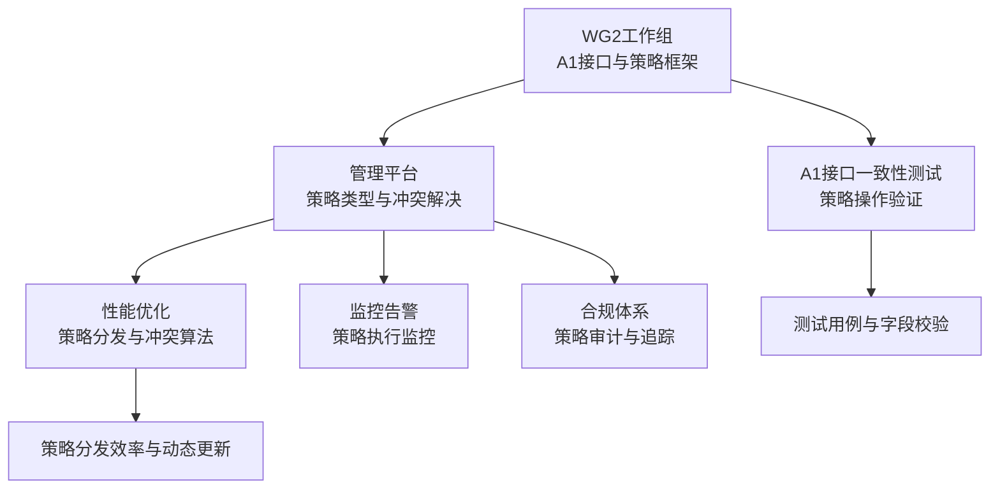
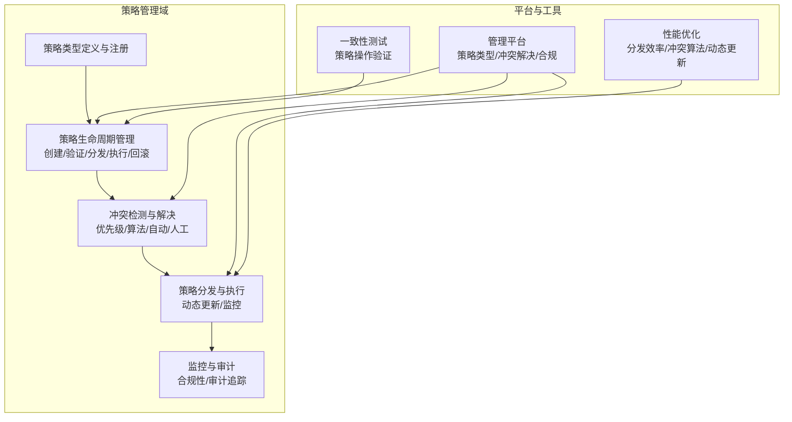
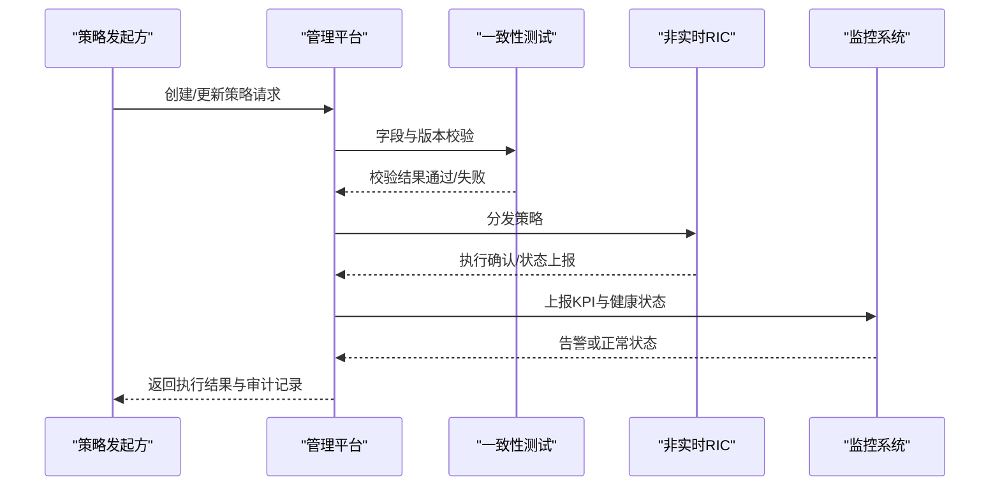
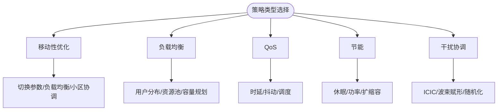
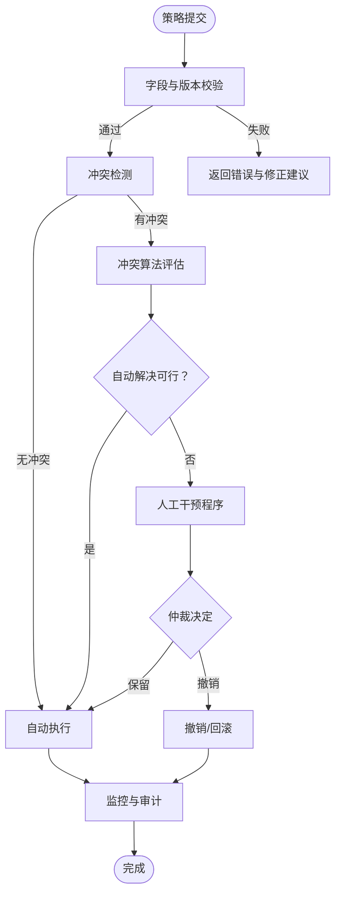
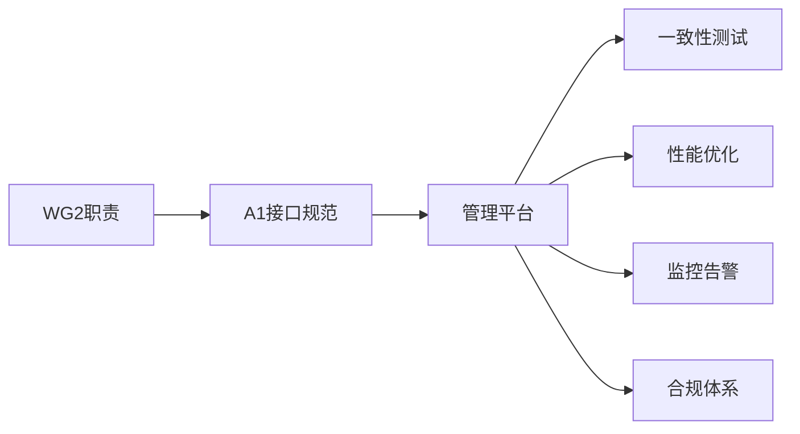

# A1接口策略管理

<cite>
**本文引用的文件**
- [WG2工作组职责与范围](file://06-working-groups/wg-detailed-responsibilities.md)
- [O-RAN联盟工作组职责](file://06-working-groups/wg-detailed-responsibilities.md)
- [A1接口一致性测试](file://13-testing-validation/conformance-testing/o-ran-conformance-testing-en.md)
- [O-RAN应用性能优化](file://26-performance-optimization/application-tuning/o-ran-application-performance-tuning.md)
- [O-RAN管理平台](file://22-tool-platforms/management-platforms/o-ran-management-platforms-zh.md)
- [O-RAN管理平台（英文）](file://22-tool-platforms/management-platforms/o-ran-management-platforms.md)
- [O-RAN网络性能优化](file://26-performance-optimization/network-optimization/network-performance-tuning.md)
- [O-RAN合规管理体系](file://25-legal-regulations/compliance-system/o-ran-compliance-management.md)
- [O-RAN监控告警框架](file://14-operations-management/monitoring-alerting/operations-monitoring-framework-zh.md)
- [O-RAN团队协作最佳实践](file://30-best-practices/team-collaboration/o-ran-team-collaboration-best-practices.md)
- [O-RAN跨文化管理](file://23-international-deployment/cross-cultural-management/o-ran-cross-cultural-management.md)
- [O-RAN接口标准论文](file://11-academic-papers/interfaces/readme.md)
- [O-RAN知识库总览](file://README.md)
</cite>

## 目录
1. [引言](#引言)
2. [项目结构](#项目结构)
3. [核心组件](#核心组件)
4. [架构概览](#架构概览)
5. [详细组件分析](#详细组件分析)
6. [依赖关系分析](#依赖关系分析)
7. [性能考虑](#性能考虑)
8. [故障排查指南](#故障排查指南)
9. [结论](#结论)
10. [附录](#附录)

## 引言
本文件围绕A1接口策略管理的完整生命周期，系统阐述策略创建与验证、版本控制、分发机制、执行监控与回滚撤销，并结合移动性优化、负载均衡、QoS、节能与干扰协调等典型策略类型，给出冲突解决机制（优先级、冲突检测、自动解决与人工干预）、实现框架与最佳实践。内容来源于WG2工作组职责、A1接口一致性测试、管理平台与性能优化等权威资料，旨在为O-RAN部署与运营提供可操作的策略管理指导。

## 项目结构
围绕A1接口策略管理，知识库中与之直接相关的核心目录与文件如下：
- 工作组职责：WG2定义A1接口规范与策略管理框架
- 接口一致性测试：定义A1接口策略操作的测试用例与字段校验
- 管理平台：展示策略类型、分发与冲突解决的平台能力
- 性能优化：包含策略分发效率、冲突算法与动态更新等优化要点
- 合规与监控：策略执行的合规性、审计与监控告警
- 团队协作与跨文化：冲突预防与解决流程，适用于策略冲突治理

**图表来源**
- [WG2工作组职责与范围](file://06-working-groups/wg-detailed-responsibilities.md#L56-L99)
- [A1接口一致性测试](file://13-testing-validation/conformance-testing/o-ran-conformance-testing-en.md#L46-L116)
- [O-RAN管理平台](file://22-tool-platforms/management-platforms/o-ran-management-platforms-zh.md#L454-L532)
- [O-RAN应用性能优化](file://26-performance-optimization/application-tuning/o-ran-application-performance-tuning.md#L97-L129)
- [O-RAN监控告警框架](file://14-operations-management/monitoring-alerting/operations-monitoring-framework-zh.md#L726-L743)
- [O-RAN合规管理体系](file://25-legal-regulations/compliance-system/o-ran-compliance-management.md#L1-L47)

**章节来源**
- [WG2工作组职责与范围](file://06-working-groups/wg-detailed-responsibilities.md#L56-L99)
- [O-RAN知识库总览](file://README.md#L1-L472)

## 核心组件
- 策略生命周期管理
  - 创建与验证：策略类型注册、字段校验、版本控制
  - 分发与执行：策略分发效率、动态更新、执行监控
  - 回滚与撤销：版本回退、撤销机制、审计追踪
- 策略类型与场景
  - 移动性优化策略：切换参数、负载均衡算法、小区间协调
  - 负载均衡策略：用户分布优化、资源池动态调度
  - QoS策略：时延与抖动控制、优先级映射、调度策略
  - 节能策略：智能休眠、功率控制、按需扩缩容
  - 干扰协调策略：ICIC、波束赋形、干扰随机化
- 冲突解决机制
  - 优先级机制：策略优先级设定与冲突判定
  - 冲突检测算法：策略域与目标对象的冲突扫描
  - 自动冲突解决：基于规则的自动裁决与降级
  - 人工干预程序：冲突仲裁、审批流程与回退策略

**章节来源**
- [WG2工作组职责与范围](file://06-working-groups/wg-detailed-responsibilities.md#L70-L93)
- [A1接口一致性测试](file://13-testing-validation/conformance-testing/o-ran-conformance-testing-en.md#L88-L116)
- [O-RAN网络性能优化](file://26-performance-optimization/network-optimization/network-performance-tuning.md#L62-L82)
- [O-RAN应用性能优化](file://26-performance-optimization/application-tuning/o-ran-application-performance-tuning.md#L97-L129)

## 架构概览
下图展示了A1接口策略管理在非实时RIC（Non-RT RIC）中的整体架构：策略类型定义与注册、策略生命周期管理、冲突检测与解决、策略分发与执行、监控与审计。

**图表来源**
- [WG2工作组职责与范围](file://06-working-groups/wg-detailed-responsibilities.md#L70-L93)
- [O-RAN管理平台](file://22-tool-platforms/management-platforms/o-ran-management-platforms-zh.md#L454-L532)
- [A1接口一致性测试](file://13-testing-validation/conformance-testing/o-ran-conformance-testing-en.md#L88-L116)
- [O-RAN应用性能优化](file://26-performance-optimization/application-tuning/o-ran-application-performance-tuning.md#L97-L129)

## 详细组件分析

### 策略生命周期管理
- 策略创建与验证
  - 类型注册：策略类型在平台注册，定义字段约束与校验规则
  - 字段校验：基于一致性测试定义的字段清单进行校验（如策略类型、实例ID等）
  - 版本控制：策略版本号管理，支持回滚与变更追踪
- 分发机制
  - 分发效率：优化策略分发路径与批量处理
  - 动态更新：支持在线策略更新与增量下发
- 执行监控
  - 实时监控：策略执行状态与KPI指标
  - 告警联动：异常触发运维动作（重启、检查连接、数据库连通性等）
- 回滚与撤销
  - 回滚策略：版本回退与撤销机制
  - 审计追踪：记录策略变更历史与影响范围

**图表来源**
- [A1接口一致性测试](file://13-testing-validation/conformance-testing/o-ran-conformance-testing-en.md#L88-L116)
- [O-RAN监控告警框架](file://14-operations-management/monitoring-alerting/operations-monitoring-framework-zh.md#L726-L743)
- [O-RAN管理平台](file://22-tool-platforms/management-platforms/o-ran-management-platforms-zh.md#L454-L532)

**章节来源**
- [A1接口一致性测试](file://13-testing-validation/conformance-testing/o-ran-conformance-testing-en.md#L88-L116)
- [O-RAN监控告警框架](file://14-operations-management/monitoring-alerting/operations-monitoring-framework-zh.md#L726-L743)
- [O-RAN管理平台](file://22-tool-platforms/management-platforms/o-ran-management-platforms-zh.md#L454-L532)

### 策略类型与应用场景
- 移动性优化策略
  - 切换参数调优、负载均衡算法、小区间协调
- 负载均衡策略
  - 用户分布优化、动态资源池、容量规划
- QoS策略
  - 时延与抖动控制、调度策略、缓冲区管理
- 节能策略
  - 智能休眠、功率控制、按需扩缩容
- 干扰协调策略
  - ICIC、波束赋形、干扰随机化

**图表来源**
- [O-RAN网络性能优化](file://26-performance-optimization/network-optimization/network-performance-tuning.md#L62-L82)

**章节来源**
- [O-RAN网络性能优化](file://26-performance-optimization/network-optimization/network-performance-tuning.md#L6-L82)

### 冲突解决机制
- 优先级机制
  - 策略优先级设定，冲突时高优先级保留
- 冲突检测算法
  - 基于策略域与目标对象的扫描与匹配
- 自动冲突解决
  - 规则驱动的裁决与降级策略
- 人工干预程序
  - 冲突仲裁、审批流程与回退策略

**图表来源**
- [WG2工作组职责与范围](file://06-working-groups/wg-detailed-responsibilities.md#L90-L93)
- [O-RAN应用性能优化](file://26-performance-optimization/application-tuning/o-ran-application-performance-tuning.md#L97-L129)

**章节来源**
- [WG2工作组职责与范围](file://06-working-groups/wg-detailed-responsibilities.md#L90-L93)
- [O-RAN应用性能优化](file://26-performance-optimization/application-tuning/o-ran-application-performance-tuning.md#L97-L129)

### 实现框架与最佳实践
- 管理平台能力
  - 策略类型定义与注册、冲突解决、合规与审计
  - 基于意图的策略创建与执行
- 性能优化要点
  - 策略分发效率、冲突算法、策略验证加速、动态策略更新
- 合规与审计
  - 策略变更审计、合规性检查、版本控制与追踪
- 团队协作与跨文化
  - 冲突预防、早期干预、协商与学习导向

**章节来源**
- [O-RAN管理平台](file://22-tool-platforms/management-platforms/o-ran-management-platforms-zh.md#L454-L532)
- [O-RAN应用性能优化](file://26-performance-optimization/application-tuning/o-ran-application-performance-tuning.md#L97-L129)
- [O-RAN合规管理体系](file://25-legal-regulations/compliance-system/o-ran-compliance-management.md#L1-L47)
- [O-RAN团队协作最佳实践](file://30-best-practices/team-collaboration/o-ran-team-collaboration-best-practices.md#L166-L196)
- [O-RAN跨文化管理](file://23-international-deployment/cross-cultural-management/o-ran-cross-cultural-management.md#L180-L253)

## 依赖关系分析
A1接口策略管理涉及以下关键依赖：
- WG2工作组职责：定义A1接口规范与策略管理框架
- 管理平台：承载策略类型、冲突解决与合规审计
- 一致性测试：验证策略查询与更新等操作
- 性能优化：提升策略分发与冲突算法效率
- 监控告警：策略执行状态与异常响应
- 合规体系：策略变更审计与追踪

**图表来源**
- [WG2工作组职责与范围](file://06-working-groups/wg-detailed-responsibilities.md#L56-L99)
- [A1接口一致性测试](file://13-testing-validation/conformance-testing/o-ran-conformance-testing-en.md#L46-L116)
- [O-RAN管理平台](file://22-tool-platforms/management-platforms/o-ran-management-platforms-zh.md#L454-L532)
- [O-RAN应用性能优化](file://26-performance-optimization/application-tuning/o-ran-application-performance-tuning.md#L97-L129)
- [O-RAN监控告警框架](file://14-operations-management/monitoring-alerting/operations-monitoring-framework-zh.md#L726-L743)
- [O-RAN合规管理体系](file://25-legal-regulations/compliance-system/o-ran-compliance-management.md#L1-L47)

**章节来源**
- [WG2工作组职责与范围](file://06-working-groups/wg-detailed-responsibilities.md#L56-L99)
- [A1接口一致性测试](file://13-testing-validation/conformance-testing/o-ran-conformance-testing-en.md#L46-L116)
- [O-RAN管理平台](file://22-tool-platforms/management-platforms/o-ran-management-platforms-zh.md#L454-L532)
- [O-RAN应用性能优化](file://26-performance-optimization/application-tuning/o-ran-application-performance-tuning.md#L97-L129)
- [O-RAN监控告警框架](file://14-operations-management/monitoring-alerting/operations-monitoring-framework-zh.md#L726-L743)
- [O-RAN合规管理体系](file://25-legal-regulations/compliance-system/o-ran-compliance-management.md#L1-L47)

## 性能考虑
- 策略分发效率：批量处理、去重与增量下发
- 冲突算法：高效扫描与匹配，降低策略冲突检测开销
- 策略验证加速：预编译与缓存机制
- 动态策略更新：最小化停机时间与影响范围
- 数据模型优化：JSON Schema优化、序列化格式与向后兼容

**章节来源**
- [O-RAN应用性能优化](file://26-performance-optimization/application-tuning/o-ran-application-performance-tuning.md#L97-L129)

## 故障排查指南
- 策略执行异常
  - 检查策略字段与版本是否符合一致性测试要求
  - 查看监控告警，定位执行延迟或失败原因
  - 启动回滚或撤销流程，恢复到稳定版本
- 冲突问题
  - 使用冲突检测算法识别冲突策略
  - 依据优先级与规则进行自动裁决
  - 无法自动解决时启动人工干预程序
- 平台与工具
  - 管理平台：查看策略类型、冲突解决与合规审计
  - 一致性测试：复现策略操作，验证字段与响应
  - 性能优化：检查分发效率与冲突算法性能

**章节来源**
- [A1接口一致性测试](file://13-testing-validation/conformance-testing/o-ran-conformance-testing-en.md#L88-L116)
- [O-RAN监控告警框架](file://14-operations-management/monitoring-alerting/operations-monitoring-framework-zh.md#L726-L743)
- [O-RAN管理平台](file://22-tool-platforms/management-platforms/o-ran-management-platforms-zh.md#L454-L532)
- [O-RAN团队协作最佳实践](file://30-best-practices/team-collaboration/o-ran-team-collaboration-best-practices.md#L166-L196)
- [O-RAN跨文化管理](file://23-international-deployment/cross-cultural-management/o-ran-cross-cultural-management.md#L180-L253)

## 结论
A1接口策略管理以WG2工作组规范为基础，结合管理平台、一致性测试、性能优化与合规监控，形成从创建、验证、分发、执行到回滚的完整生命周期闭环。通过优先级机制、冲突检测算法与自动/人工干预相结合的冲突解决体系，以及面向移动性优化、负载均衡、QoS、节能与干扰协调等场景的策略类型，能够有效支撑O-RAN网络的智能化与自动化运营。建议在实践中持续优化策略分发与冲突算法，强化监控与审计，完善团队协作与跨文化冲突管理流程，以提升策略管理的整体效率与可靠性。

## 附录
- 相关论文与研究：A1接口策略管理框架的学术研究与性能评估
- 接口标准：A1接口版本、策略类型与消息格式

**章节来源**
- [O-RAN接口标准论文](file://11-academic-papers/interfaces/readme.md#L29-L34)
- [A1接口一致性测试](file://13-testing-validation/conformance-testing/o-ran-conformance-testing-en.md#L46-L49)