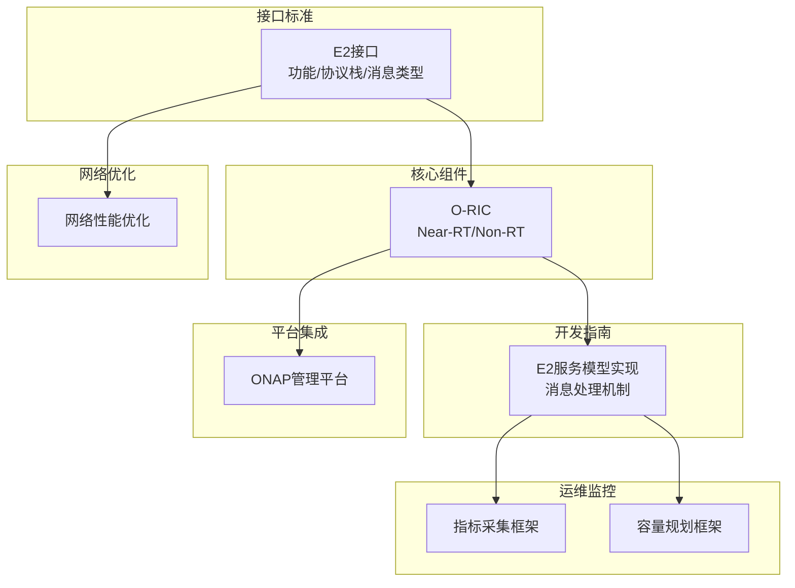
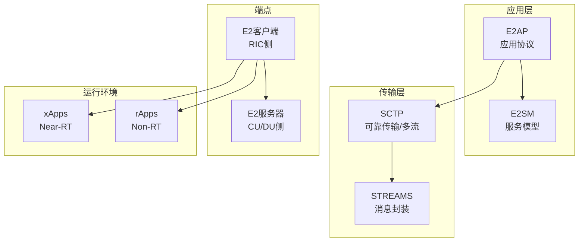
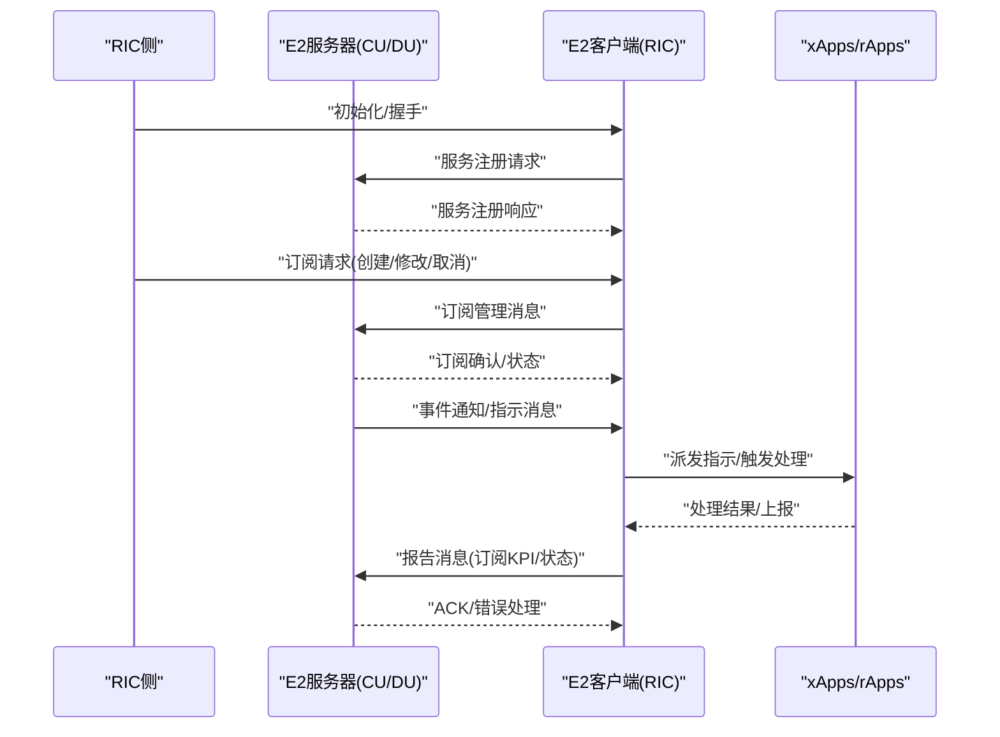
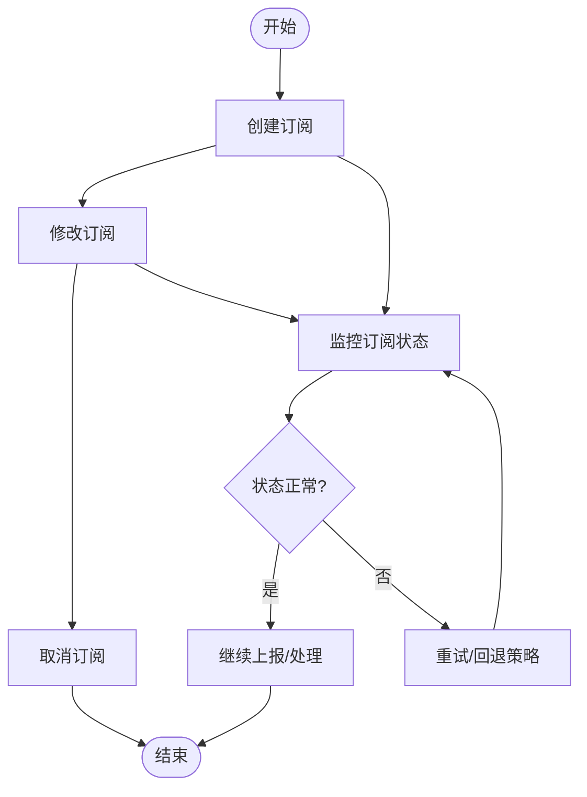
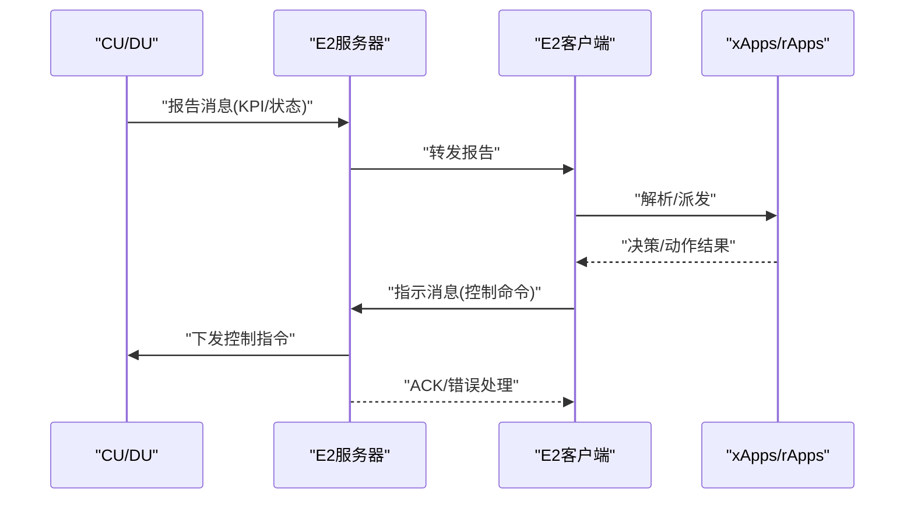
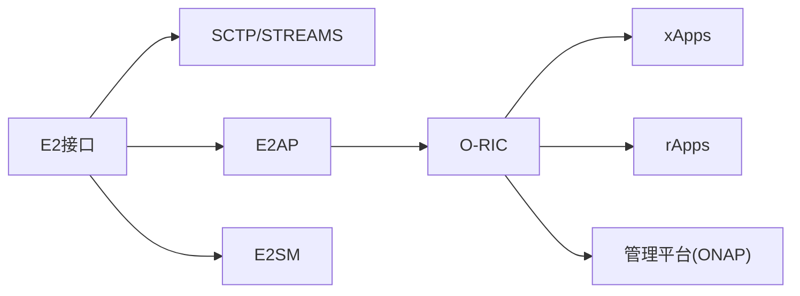
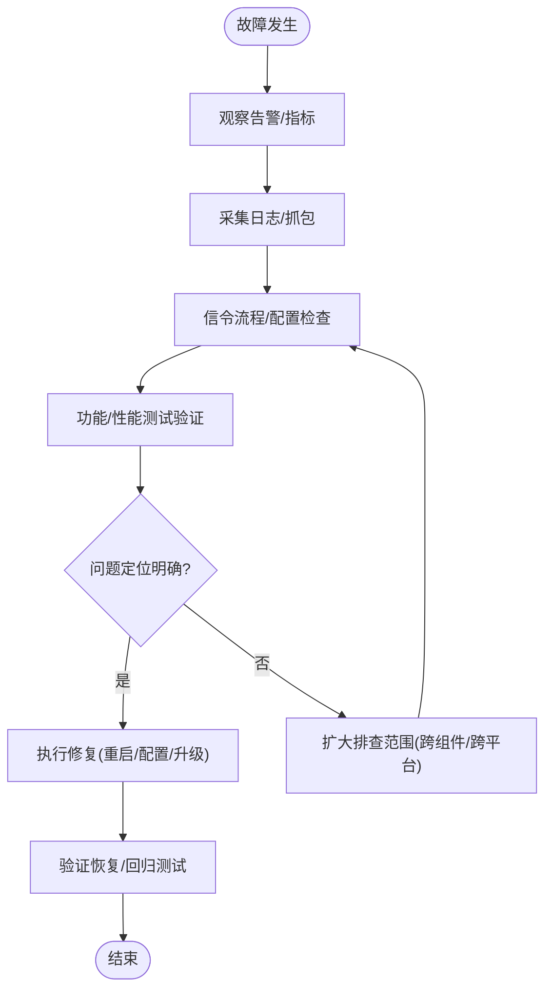

# E2接口深度应用

<cite>
**本文引用的文件**
- [E2接口](file://03-interface-standards/e2-interface.md)
- [O-RIC](file://02-core-components/o-ric.md)
- [O-RIC开发](file://07-ric-development/readme-zh.md)
- [指标采集框架](file://14-operations-management/monitoring-alerting/operations-monitoring-framework-zh.md)
- [容量规划框架](file://14-operations-management/capacity-planning/capacity-planning-framework-zh.md)
- [网络性能优化](file://26-performance-optimization/network-optimization/network-performance-tuning.md)
- [ONAP非实时RIC平台](file://22-tool-platforms/management-platforms/o-ran-management-platforms-zh.md)
</cite>

## 目录
1. [引言](#引言)
2. [项目结构](#项目结构)
3. [核心组件](#核心组件)
4. [架构总览](#架构总览)
5. [详细组件分析](#详细组件分析)
6. [依赖分析](#依赖分析)
7. [性能考量](#性能考量)
8. [故障排查指南](#故障排查指南)
9. [结论](#结论)
10. [附录](#附录)

## 引言
本文件面向O-RAN网络中E2接口的深度应用，围绕E2服务模型（E2SM）与应用协议（E2AP）在RIC与CU/DU之间的交互，系统阐述服务注册、订阅管理、指示与报告消息处理机制，并结合传输层（SCTP/STREAMS）与应用层（消息编解码、路由）的技术要点，给出性能优化策略（消息批处理、连接池、异步处理、缓存、负载均衡）与运维最佳实践及故障排查方法。内容来源于仓库内现有文档，旨在帮助云平台与网络运维工程师在生产环境中高效、稳定地落地E2接口能力。

## 项目结构
本仓库围绕O-RAN架构形成多主题文档体系，其中与E2接口直接相关的内容主要分布在：
- 接口标准：E2接口功能、协议栈、消息类型与部署考量
- 核心组件：O-RIC（Near-RT/Non-RT）职责与架构
- 开发指南：E2服务模型实现、消息处理机制与性能优化
- 运维监控：指标采集、容量规划与告警
- 平台集成：管理平台（如ONAP）的服务组合与策略编排
- 网络优化：无线与传输层面的性能调优

**章节来源**
- file://03-interface-standards/e2-interface.md#L1-L337
- file://02-core-components/o-ric.md#L1-L437
- file://07-ric-development/readme-zh.md#L60-L78
- file://14-operations-management/monitoring-alerting/operations-monitoring-framework-zh.md#L46-L260
- file://14-operations-management/capacity-planning/capacity-planning-framework-zh.md#L361-L503
- file://22-tool-platforms/management-platforms/o-ran-management-platforms-zh.md#L454-L532
- file://26-performance-optimization/network-optimization/network-performance-tuning.md#L1-L98

## 核心组件
- E2接口：基于SCTP/STREAMS，提供服务化架构下的服务发现、服务调用、事件通知与订阅管理，支撑RIC与CU/DU之间的可靠通信。
- O-RIC：分为Near-RT RIC（毫秒级闭环）与Non-RT RIC（策略与分析），承担E2/A1接口适配、xApps/rApps运行环境、策略分发与数据分析等职责。
- E2服务模型（E2SM）：定义KPI订阅与报告（E2SM-KPM）、无线资源控制（E2SM-RC）、CU-UP控制（E2SM-GNB-CU-UP）等服务接口与消息格式。
- 消息处理：包含初始化、服务注册、服务调用、事件通知、订阅管理与错误处理等消息类型。

**章节来源**
- file://03-interface-standards/e2-interface.md#L7-L62
- file://02-core-components/o-ric.md#L7-L116
- file://07-ric-development/readme-zh.md#L60-L78

## 架构总览
E2接口在协议栈上自上而下分为应用层（E2AP/E2SM）与传输层（SCTP），在系统架构上由RIC侧客户端与CU/DU侧服务器构成，配合xApps/rApps实现智能控制闭环。

**图表来源**
- [E2接口](file://03-interface-standards/e2-interface.md#L63-L78)
- [O-RIC](file://02-core-components/o-ric.md#L75-L116)

**章节来源**
- file://03-interface-standards/e2-interface.md#L63-L78
- file://02-core-components/o-ric.md#L75-L116

## 详细组件分析

### E2服务模型与消息处理机制
- 服务模型（E2SM）：KPI订阅与报告（E2SM-KPM）、无线资源控制（E2SM-RC）、CU-UP控制（E2SM-GNB-CU-UP）等，定义接口、消息格式与行为。
- 消息类型：初始化、服务注册、服务调用、事件通知、订阅管理、错误处理等。
- 处理流程：服务注册程序、订阅生命周期（创建/修改/取消）、指示消息下发、报告消息接收与解析。

**图表来源**
- [E2接口](file://03-interface-standards/e2-interface.md#L79-L88)
- [O-RIC开发](file://07-ric-development/readme-zh.md#L66-L71)

**章节来源**
- file://03-interface-standards/e2-interface.md#L79-L88
- file://07-ric-development/readme-zh.md#L66-L71

### 订阅管理（创建/修改/取消）
- 订阅生命周期：创建订阅（定义KPI/事件范围）、修改订阅（调整采样周期/过滤条件）、取消订阅（释放资源）。
- 订阅粒度：按区域、扇区、用户数、QoS等级等维度划分。
- 状态同步：订阅状态与RIC侧xApps/rApps状态保持一致，异常时触发重订阅或降级策略。

**图表来源**
- [E2接口](file://03-interface-standards/e2-interface.md#L28-L31)
- [O-RIC开发](file://07-ric-development/readme-zh.md#L66-L71)

**章节来源**
- file://03-interface-standards/e2-interface.md#L28-L31
- file://07-ric-development/readme-zh.md#L66-L71

### 指示与报告消息处理
- 指示消息：来自RIC的控制指令（如资源调整、切换策略），在E2客户端侧解析后交由xApps处理，再通过E2服务器下发至CU/DU。
- 报告消息：来自CU/DU的KPI/状态报告，经E2客户端解析后进入xApps/rApps进行分析与决策，必要时回传指示。
- 错误处理：对解析失败、超时、协议不匹配等情况进行错误码返回与重试/降级策略。

**图表来源**
- [E2接口](file://03-interface-standards/e2-interface.md#L84-L88)
- [O-RIC](file://02-core-components/o-ric.md#L21-L31)

**章节来源**
- file://03-interface-standards/e2-interface.md#L84-L88
- file://02-core-components/o-ric.md#L21-L31

### E2SM-KPM（KPI订阅与报告）
- 适用场景：Near-RT RIC对KPI进行高频订阅与实时分析，支撑闭环控制。
- 关键点：订阅粒度、采样周期、过滤策略、报告格式一致性与错误恢复。

**章节来源**
- file://07-ric-development/readme-zh.md#L62-L62

### E2SM-RC（无线资源控制）
- 适用场景：通过E2接口下发无线侧控制指令（如功率控制、调度策略调整）。
- 关键点：指令原子性、时延约束、与xApps的协同与回传。

**章节来源**
- file://07-ric-development/readme-zh.md#L63-L63

### E2SM-GNB-CU-UP（CU-UP控制）
- 适用场景：对CU-UP用户面功能进行控制与优化（如转发、QoS映射、负载均衡）。
- 关键点：与E1接口交互、跨实例协调、状态同步与一致性。

**章节来源**
- file://07-ric-development/readme-zh.md#L64-L64

## 依赖分析
- E2接口依赖SCTP/STREAMS提供可靠、多流的传输通道；应用层依赖E2AP/E2SM定义消息格式与行为。
- O-RIC作为E2客户端/服务器的运行载体，依赖xApps/rApps实现业务逻辑；Near-RT侧重低时延处理，Non-RT侧重策略与分析。
- 管理平台（如ONAP）通过服务组合与策略编排，将E2接口能力纳入整体网络编排。

**图表来源**
- [E2接口](file://03-interface-standards/e2-interface.md#L63-L78)
- [O-RIC](file://02-core-components/o-ric.md#L75-L116)
- [ONAP非实时RIC平台](file://22-tool-platforms/management-platforms/o-ran-management-platforms-zh.md#L454-L532)

**章节来源**
- file://03-interface-standards/e2-interface.md#L63-L78
- file://02-core-components/o-ric.md#L75-L116
- file://22-tool-platforms/management-platforms/o-ran-management-platforms-zh.md#L454-L532

## 性能考量
- 传输层优化：SCTP参数调优（拥塞窗口、重传超时）、多流配置与多路径，降低时延与提升可靠性。
- 应用层优化：消息压缩、批量处理、缓存机制，减少交互次数与重复计算。
- 网络优化：减少跳数、网络加速（如SR-IOV/DPDK）、负载均衡，提升吞吐与稳定性。
- 近实时优化：Near-RT RIC侧的xApps/rApps应具备低时延处理能力与高可用性设计。
- 监控与容量：通过指标采集与容量规划框架，持续评估与优化E2接口性能。

**章节来源**
- file://03-interface-standards/e2-interface.md#L131-L147
- file://26-performance-optimization/network-optimization/network-performance-tuning.md#L1-L98
- file://14-operations-management/monitoring-alerting/operations-monitoring-framework-zh.md#L46-L260
- file://14-operations-management/capacity-planning/capacity-planning-framework-zh.md#L361-L503
- file://02-core-components/o-ric.md#L283-L301

## 故障排查指南
- 常见故障：连接断连/重连失败、消息传输失败/解析错误、服务调用失败/不可用、性能劣化（时延/吞吐）。
- 定位方法：告警分析、日志分析（RIC/CU-DU）、信令流程分析、测试验证。
- 恢复手段：重启接口/服务、调整配置参数、服务重启、软件升级修复。
- 告警管理：设置合理阈值、告警分级、关联分析、统一告警平台集成。

**图表来源**
- [E2接口](file://03-interface-standards/e2-interface.md#L170-L189)

**章节来源**
- file://03-interface-standards/e2-interface.md#L170-L189

## 结论
E2接口是O-RAN实现智能控制与优化的关键，结合SCTP/STREAMS可靠传输与E2AP/E2SM标准化消息模型，可在RIC与CU/DU之间建立高效、可控的通信通道。通过Near-RT与Non-RT RIC的分工协作、xApps/rApps的业务编排、以及完善的监控与容量规划体系，可实现低时延、高可靠的网络智能闭环。生产实践中应重视性能优化与故障处置流程，确保E2接口在大规模、跨厂商环境下稳定运行。

## 附录
- 最佳实践：自动化部署（IaC/CI/CD）、高可用设计（冗余/故障转移）、灾难恢复（异地备份/快速恢复）、安全加固（网络/系统/应用）。
- 平台集成：将E2接口能力纳入管理平台（如ONAP）的服务组合与策略编排，实现端到端的网络智能化管理。

**章节来源**
- file://03-interface-standards/e2-interface.md#L202-L260
- file://02-core-components/o-ric.md#L302-L388
- file://22-tool-platforms/management-platforms/o-ran-management-platforms-zh.md#L454-L532