# RIC开发与高级技术

<cite>
**本文引用的文件**
- [O-RIC架构与功能](file://02-core-components/o-ric.md)
- [E2接口技术规范](file://03-interface-standards/e2-interface.md)
- [RIC开发与高级技术总览](file://07-ric-development/readme.md)
- [RIC开发与高级技术（中文）](file://07-ric-development/readme-zh.md)
- [AI-RAN融合概览](file://31-ai-ran-convergence/readme.md)
- [RAN中的Agentic AI](file://31-ai-ran-convergence/agentic-ai/readme.md)
- [RAN中的Agentic AI（中文）](file://31-ai-ran-convergence/agentic-ai/readme-zh.md)
- [AI-RAN架构与平台](file://31-ai-ran-convergence/architecture-platforms/readme.md)
- [RAN数字孪生](file://31-ai-ran-convergence/digital-twin/readme.md)
- [O-RAN安全架构参考](file://12-security-privacy/security-architecture/security-reference-architecture.md)
- [O-RAN安全架构参考（中文）](file://12-security-privacy/security-architecture/security-reference-architecture-zh.md)
- [O-RAN网络性能优化实践](file://26-performance-optimization/network-optimization/network-performance-tuning.md)
- [O-RAN性能优化框架](file://14-operations-management/performance-optimization/performance-optimization-framework.md)
- [O-RAN测试工具与框架](file://13-testing-validation/testing-tools/testing-tools-frameworks.md)
- [O-RAN开发工具包](file://22-tool-platforms/development-tools/o-ran-development-toolkit.md)
- [O-RAN开发工具包（中文）](file://22-tool-platforms/development-tools/o-ran-development-toolkit-zh.md)
- [O-RAN开发环境配置脚本](file://17-open-source-ecosystem/developer-tools/oran-development-tools.md)
- [O-RAN开发环境配置脚本（中文）](file://17-open-source-ecosystem/developer-tools/oran-development-tools-zh.md)
- [O-RAN RIC与AI论文索引](file://11-academic-papers/ric-ai/readme.md)
- [新兴应用路线图与AI原生架构](file://15-future-development/emerging-applications/emerging-applications-roadmap.md)
</cite>

## 更新摘要
**所做更改**
- 新增AI-RAN融合章节，整合智能体AI集成概念
- 增强A1接口策略管理功能描述，包含LLM驱动的意图翻译
- 添加三层智能体层级架构（战略/战术/反应层）
- 集成NVIDIA ARC GPU加速平台和数字孪生验证
- 更新xApps/rApps到自主智能体的演进路径
- 增强安全护栏和数字孪生预验证机制

## 目录
1. [简介](#简介)
2. [项目结构](#项目结构)
3. [核心组件](#核心组件)
4. [架构总览](#架构总览)
5. [详细组件分析](#详细组件分析)
6. [依赖关系分析](#依赖关系分析)
7. [性能考虑](#性能考虑)
8. [故障排查指南](#故障排查指南)
9. [结论](#结论)
10. [附录](#附录)

## 简介
本文件面向O-RAN网络的RIC（无线智能控制器）开发与高级技术，系统阐述Near-RT RIC与Non-RT RIC的架构设计、E2接口服务化模型与消息处理机制、xApps/rApps开发框架、智能算法与机器学习在O-RAN中的应用、无线电资源管理与能效优化、安全架构与威胁检测，并提供测试方法、部署最佳实践与调试技巧。**2026年重大更新**：整合AI-RAN融合概念，引入智能体AI集成和增强的A1接口策略管理功能，实现从传统规则驱动到LLM推理驱动的自主网络控制。内容基于O-RAN联盟规范与开源生态，结合生产环境经验，帮助读者构建可扩展、可运维、可演进的智能RAN解决方案。

## 项目结构
本仓库围绕O-RAN关键主题形成知识体系，其中与RIC开发直接相关的内容主要分布在以下目录：
- 02-core-components：O-RIC架构与功能说明
- 03-interface-standards：E2接口技术规范
- 07-ric-development：RIC开发与高级技术总览及中文版
- 12-security-privacy：安全架构与威胁检测
- 14-operations-management：性能优化框架
- 15-future-development：AI原生与新兴应用
- 17-open-source-ecosystem：开发工具与环境配置
- 22-tool-platforms：开发工具包与API设计
- 26-performance-optimization：网络性能优化实践
- 13-testing-validation：测试工具与框架
- **31-ai-ran-convergence**：AI-RAN融合架构与智能体AI

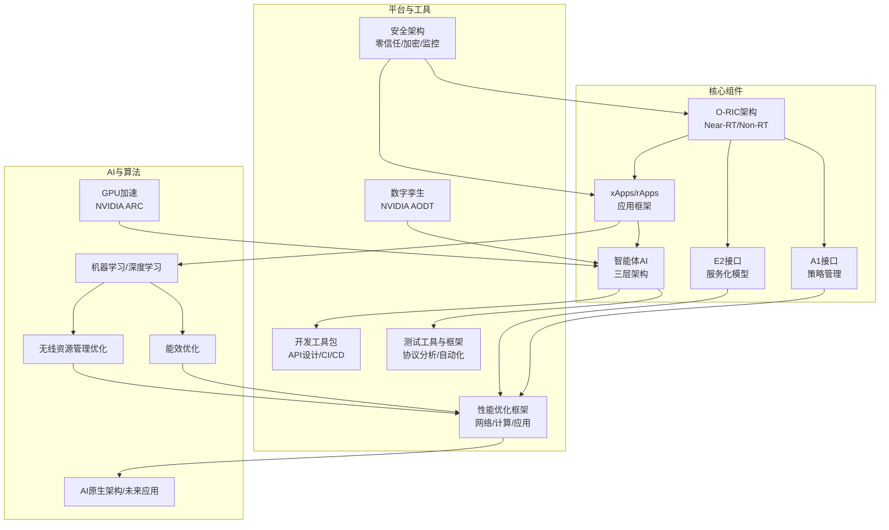

**图表来源**
- [O-RIC架构与功能:1-437](file://02-core-components/o-ric.md#L1-L437)
- [E2接口技术规范:1-337](file://03-interface-standards/e2-interface.md#L1-L337)
- [RIC开发与高级技术总览:1-368](file://07-ric-development/readme.md#L1-L368)
- [AI-RAN融合概览:1-177](file://31-ai-ran-convergence/readme.md#L1-L177)
- [RAN中的Agentic AI:1-327](file://31-ai-ran-convergence/agentic-ai/readme.md#L1-L327)

**章节来源**
- [O-RIC架构与功能:1-437](file://02-core-components/o-ric.md#L1-L437)
- [E2接口技术规范:1-337](file://03-interface-standards/e2-interface.md#L1-L337)
- [RIC开发与高级技术总览:1-368](file://07-ric-development/readme.md#L1-L368)

## 核心组件
- Near-RT RIC：毫秒级实时控制闭环，负责与CU/DU通过E2接口交互，承载xApps运行与实时策略执行，现支持智能体AI协调。
- Non-RT RIC：秒级到分钟级策略管理，负责与Near-RT RIC通过A1接口交互，承载rApps运行与长期优化策略生成，集成LLM推理引擎。
- E2接口：基于SCTP/STREAMS的服务化接口，提供服务发现、调用、事件通知与订阅管理，支持智能体间通信。
- A1接口：RESTful策略管理接口，现支持自然语言意图翻译为策略YAML，实现智能体间的策略协商。
- xApps/rApps：基于标准接口的第三方应用，正演进为自主智能体，具备推理、规划、学习和协调能力。
- **智能体AI**：三层架构（战略/战术/反应），提供跨时间尺度的自主网络控制能力。

**章节来源**
- [O-RIC架构与功能:5-133](file://02-core-components/o-ric.md#L5-L133)
- [E2接口技术规范:9-90](file://03-interface-standards/e2-interface.md#L9-L90)
- [RAN中的Agentic AI:27-73](file://31-ai-ran-convergence/agentic-ai/readme.md#L27-L73)

## 架构总览
下图展示RIC与接口、应用、平台与工具的整体交互关系，突出AI-RAN融合架构：

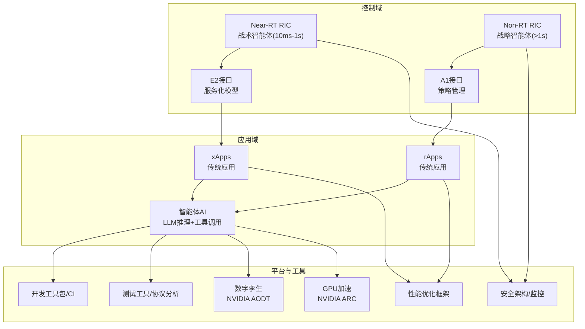

**图表来源**
- [O-RIC架构与功能:73-133](file://02-core-components/o-ric.md#L73-L133)
- [E2接口技术规范:63-130](file://03-interface-standards/e2-interface.md#L63-L130)
- [AI-RAN融合概览:120-147](file://31-ai-ran-convergence/readme.md#L120-L147)
- [RAN中的Agentic AI:31-64](file://31-ai-ran-convergence/agentic-ai/readme.md#L31-L64)

## 详细组件分析

### Near-RT RIC与Non-RT RIC架构
- Near-RT RIC：微服务架构、E2接口服务模型、xApps部署环境、实时数据处理、高可用与容错，现集成战术智能体执行层。
- Non-RT RIC：策略管理框架、A1接口实现、rApps部署环境、数据分析与机器学习、策略分发与冲突解决，现集成战略智能体推理层。
- 协调机制：策略上下行传递、跨RIC状态同步、负载均衡与故障隔离，现支持智能体间协商和数字孪生预验证。

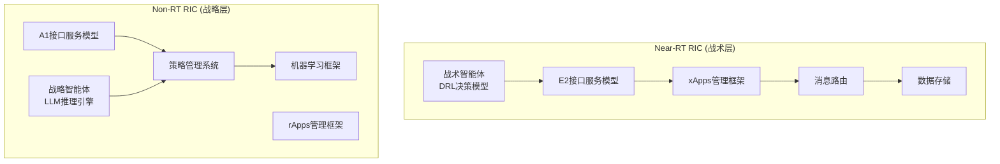

**图表来源**
- [O-RIC架构与功能:75-117](file://02-core-components/o-ric.md#L75-L117)
- [RAN中的Agentic AI:31-64](file://31-ai-ran-convergence/agentic-ai/readme.md#L31-L64)

**章节来源**
- [O-RIC架构与功能:73-133](file://02-core-components/o-ric.md#L73-L133)
- [RAN中的Agentic AI:27-73](file://31-ai-ran-convergence/agentic-ai/readme.md#L27-L73)

### E2接口服务化模型与消息处理
- 服务化功能：服务发现、服务调用（同步/异步）、事件通知、订阅管理，现支持智能体间通信。
- 协议栈：SCTP传输层、STREAMS应用层、服务模型E2SM与应用协议E2AP。
- 消息类型：初始化、服务注册、服务调用、事件通知、订阅管理、错误处理。
- 性能优化：SCTP参数优化、多流配置、消息批处理、缓存与负载均衡。

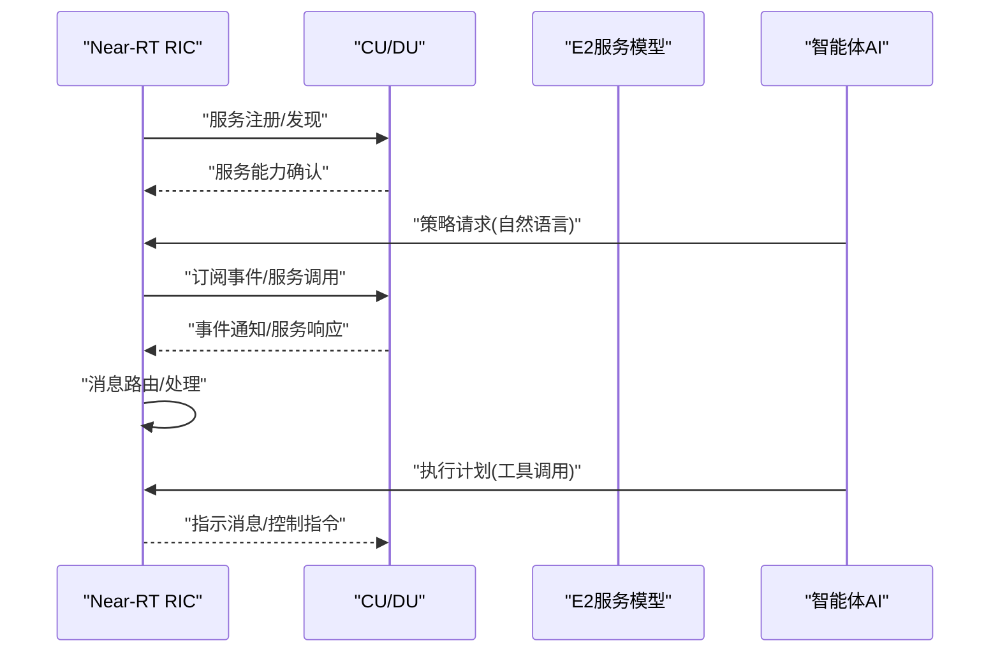

**图表来源**
- [E2接口技术规范:9-90](file://03-interface-standards/e2-interface.md#L9-L90)
- [RAN中的Agentic AI:153-184](file://31-ai-ran-convergence/agentic-ai/readme.md#L153-L184)

**章节来源**
- [E2接口技术规范:63-147](file://03-interface-standards/e2-interface.md#L63-L147)
- [RAN中的Agentic AI:139-184](file://31-ai-ran-convergence/agentic-ai/readme.md#L139-L184)

### A1接口策略管理的增强功能
- **传统策略管理**：策略生命周期管理、策略类型和场景、策略冲突解决。
- **增强功能**：
  - LLM驱动的意图翻译：自然语言策略需求自动转换为YAML格式
  - 智能体间策略协商：多智能体协同制定优化策略
  - 数字孪生预验证：所有策略在执行前进行仿真验证
  - 动态策略调整：基于实时反馈的自适应策略优化
- **策略类型扩展**：移动性优化、负载均衡、QoS、节能、干扰协调、智能体协作策略。

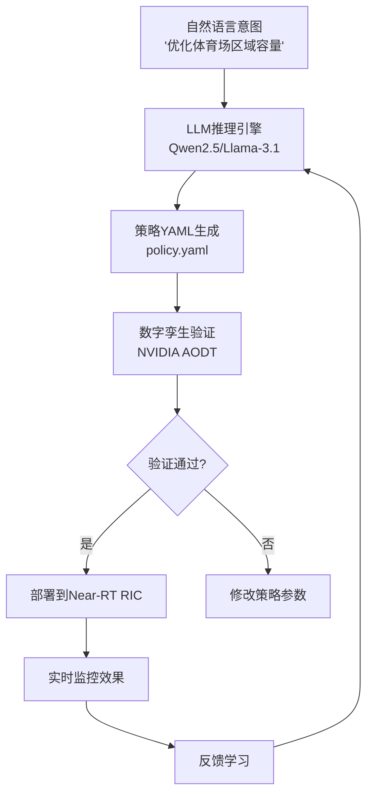

**图表来源**
- [RIC开发与高级技术总览:88-106](file://07-ric-development/readme.md#L88-L106)
- [RAN中的Agentic AI:380-406](file://31-ai-ran-convergence/agentic-ai/readme.md#L380-L406)

**章节来源**
- [RIC开发与高级技术总览:88-106](file://07-ric-development/readme.md#L88-L106)
- [RAN中的Agentic AI:372-427](file://31-ai-ran-convergence/agentic-ai/readme.md#L372-L427)

### xApps/rApps开发框架到智能体AI的演进
- **传统xApps开发**：E2接口服务模型适配、实时数据处理、控制逻辑、订阅与指示机制、生命周期管理。
- **传统rApps开发**：A1接口策略管理、数据分析与建模、机器学习集成、策略生成与分发、长周期数据处理。
- **智能体AI开发**：
  - LLM推理引擎集成（Qwen2.5-7B/Llama-3.1-8B）
  - 工具调用模式（预测、优化、仿真、查询）
  - 记忆与学习能力（情景记忆、语义记忆）
  - 安全护栏执行（物理限制、运营商策略）
- **开发工具链**：IDE与环境配置、单元/集成测试、CI/CD、容器镜像构建、部署与升级工具。

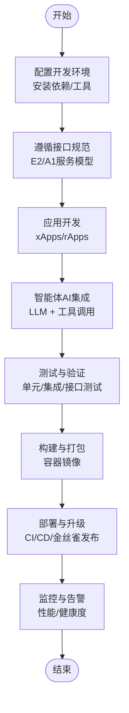

**图表来源**
- [RIC开发与高级技术总览:34-58](file://07-ric-development/readme.md#L34-L58)
- [O-RAN开发工具包:259-329](file://22-tool-platforms/development-tools/o-ran-development-toolkit.md#L259-L329)
- [RAN中的Agentic AI:290-313](file://31-ai-ran-convergence/agentic-ai/readme.md#L290-L313)

**章节来源**
- [RIC开发与高级技术总览:34-58](file://07-ric-development/readme.md#L34-L58)
- [O-RAN开发工具包:259-329](file://22-tool-platforms/development-tools/o-ran-development-toolkit.md#L259-L329)
- [RAN中的Agentic AI:290-313](file://31-ai-ran-convergence/agentic-ai/readme.md#L290-L313)

### 智能算法与机器学习在O-RAN中的应用
- **机器学习模型**：监督学习（分类/回归）、无监督学习（聚类/异常检测）、强化学习（Q-Learning/DQN）、深度学习（CNN/RNN/Transformer）、联邦学习。
- **异常检测**：统计方法（Z-Score/IQR）、机器学习（Isolation Forest/One-Class SVM）、深度学习（Autoencoder/GAN）、时间序列（LSTM/GRU）、实时流处理（滑动窗口）。
- **预测性维护**：设备健康状态预测、故障预测模型、剩余寿命估计、维护计划优化、成本效益分析。
- **自动优化**：闭环优化框架、多目标优化、约束优化、在线学习与自适应、A/B测试与验证。
- **智能体AI增强**：LLM推理、多智能体协调、数字孪生验证、安全护栏执行。

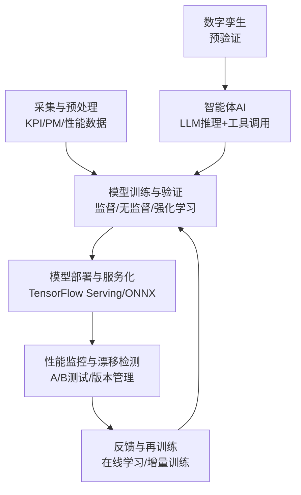

**图表来源**
- [O-RAN开发工具包:368-415](file://22-tool-platforms/development-tools/o-ran-development-toolkit.md#L368-L415)
- [O-RAN RIC与AI论文索引:1-98](file://11-academic-papers/ric-ai/readme.md#L1-L98)
- [RAN中的Agentic AI:153-184](file://31-ai-ran-convergence/agentic-ai/readme.md#L153-L184)

**章节来源**
- [RIC开发与高级技术总览:99-124](file://07-ric-development/readme.md#L99-L124)
- [O-RAN开发工具包:368-415](file://22-tool-platforms/development-tools/o-ran-development-toolkit.md#L368-L415)
- [O-RAN RIC与AI论文索引:1-98](file://11-academic-papers/ric-ai/readme.md#L1-L98)

### 无线资源管理（RRM）与能效优化
- **RRM优化**：基于ML的资源调度、动态带宽分配、功率控制优化、调度策略优化、负载均衡算法、干扰管理（ICIC/ICIC/CoMP）。
- **能效优化**：基于负载的动态开关、功率控制优化、睡眠模式管理、能耗预测模型、绿色能源集成、碳足迹优化。
- **智能体AI增强**：多智能体协调优化、数字孪生预验证、安全边界保证、自适应策略调整。

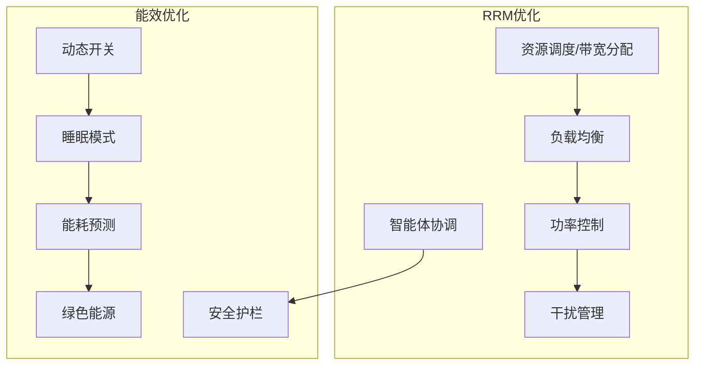

**图表来源**
- [O-RIC架构与功能:125-169](file://02-core-components/o-ric.md#L125-L169)
- [O-RAN网络性能优化实践:6-83](file://26-performance-optimization/network-optimization/network-performance-tuning.md#L6-L83)
- [RAN中的Agentic AI:221-255](file://31-ai-ran-convergence/agentic-ai/readme.md#L221-L255)

**章节来源**
- [O-RIC架构与功能:125-169](file://02-core-components/o-ric.md#L125-L169)
- [O-RAN网络性能优化实践:6-83](file://26-performance-optimization/network-optimization/network-performance-tuning.md#L6-L83)
- [RAN中的Agentic AI:221-255](file://31-ai-ran-convergence/agentic-ai/readme.md#L221-L255)

### 安全架构与威胁检测
- **零信任模型**：永不信任、持续验证、最小权限、微分段。
- **加密与密钥管理**：证书管理框架、密钥派生与加解密、mTLS、API网关安全、速率限制与熔断。
- **安全监控与审计**：SIEM集成、威胁检测与响应、合规检查（GDPR/NIST/ISO 27001/3GPP）。
- **智能体AI安全**：多层安全护栏、数字孪生预验证、人类监督机制、紧急停止功能。

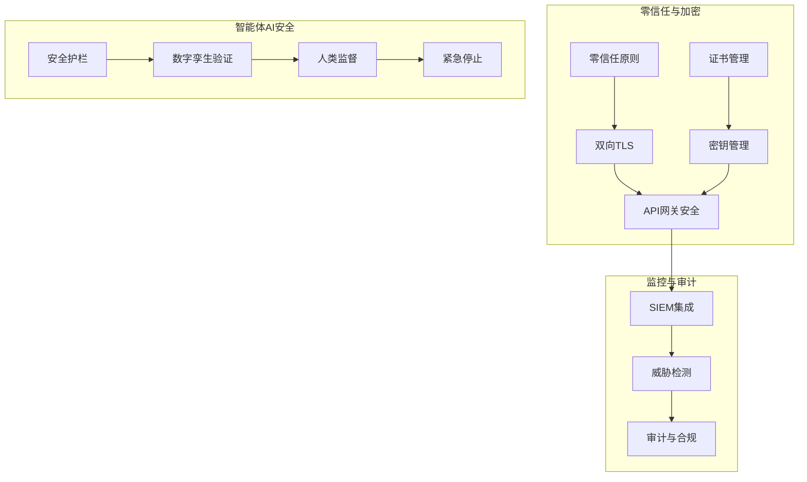

**图表来源**
- [O-RAN安全架构参考:8-71](file://12-security-privacy/security-architecture/security-reference-architecture.md#L8-L71)
- [O-RAN安全架构参考:147-245](file://12-security-privacy/security-architecture/security-reference-architecture.md#L147-L245)
- [O-RAN安全架构参考:339-513](file://12-security-privacy/security-architecture/security-reference-architecture.md#L339-L513)
- [RAN中的Agentic AI:221-255](file://31-ai-ran-convergence/agentic-ai/readme.md#L221-L255)

**章节来源**
- [O-RAN安全架构参考:6-559](file://12-security-privacy/security-architecture/security-reference-architecture.md#L6-L559)
- [RAN中的Agentic AI:221-255](file://31-ai-ran-convergence/agentic-ai/readme.md#L221-L255)

## 依赖关系分析
- 组件耦合：Near-RT RIC与E2接口强耦合，Non-RT RIC与A1接口强耦合；xApps/rApps通过标准接口与RIC解耦，智能体AI通过工具接口与平台解耦。
- 外部依赖：容器编排（Kubernetes）、服务网格（Istio/Linkerd）、消息队列（Kafka/RabbitMQ）、数据库（Redis/PostgreSQL/MongoDB）、监控（Prometheus/Grafana）、GPU加速（NVIDIA ARC）、数字孪生（NVIDIA AODT）。
- 依赖可视化：

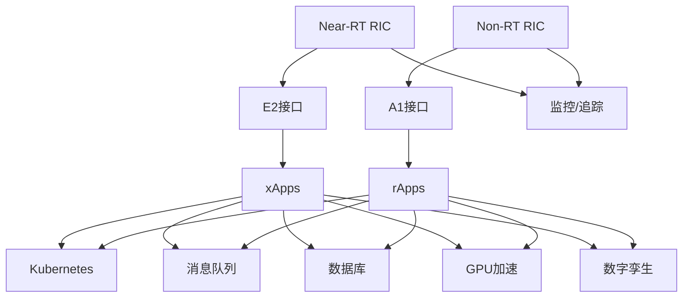

**图表来源**
- [O-RIC架构与功能:89-116](file://02-core-components/o-ric.md#L89-L116)
- [E2接口技术规范:131-147](file://03-interface-standards/e2-interface.md#L131-L147)
- [AI-RAN融合概览:120-147](file://31-ai-ran-convergence/readme.md#L120-L147)

**章节来源**
- [O-RIC架构与功能:89-116](file://02-core-components/o-ric.md#L89-L116)
- [E2接口技术规范:131-147](file://03-interface-standards/e2-interface.md#L131-L147)

## 性能考虑
- Near-RT RIC优化：处理延迟优化、资源利用率优化、消息处理优化、xApps性能优化、智能体推理延迟优化。
- Non-RT RIC优化：数据处理优化、资源利用率优化、策略优化、rApps性能优化、LLM推理优化。
- 系统集成优化：接口优化、数据传输优化、服务协调优化、智能体间通信优化。
- 网络层优化：频谱效率、干扰管理、QoS参数调优、负载均衡。
- 计算层优化：CPU亲和性、内存优化（大页/分配器）、NUMA绑定、GPU资源管理。
- 应用层优化：容器资源限制、启动时间、运行效率、服务网格调优、智能体工具调用优化。

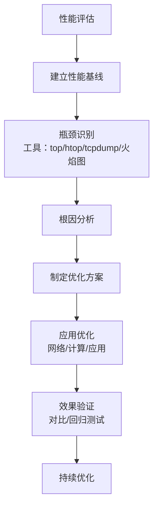

**图表来源**
- [O-RAN性能优化框架:26-67](file://14-operations-management/performance-optimization/performance-optimization-framework.md#L26-L67)
- [O-RAN网络性能优化实践:84-98](file://26-performance-optimization/network-optimization/network-performance-tuning.md#L84-L98)

**章节来源**
- [O-RIC架构与功能:283-301](file://02-core-components/o-ric.md#L283-L301)
- [O-RAN性能优化框架:1-650](file://14-operations-management/performance-optimization/performance-optimization-framework.md#L1-L650)
- [O-RAN网络性能优化实践:1-98](file://26-performance-optimization/network-optimization/network-performance-tuning.md#L1-L98)

## 故障排查指南
- 常见故障：E2/A1接口断连、xApps/rApps崩溃、CPU过载/内存不足、数据丢失/损坏、配置错误、智能体推理失败、数字孪生同步异常。
- 故障定位：告警分析、日志分析、性能分析、测试验证、智能体行为分析。
- 故障恢复：重启服务、调整配置、资源扩容、修复接口、应用重启、智能体回滚。
- 安全事件：暴力破解、未授权配置变更、网络异常、智能体越权操作，配套SIEM与自动化响应。

**章节来源**
- [O-RIC架构与功能:261-282](file://02-core-components/o-ric.md#L261-L282)
- [O-RAN安全架构参考:339-513](file://12-security-privacy/security-architecture/security-reference-architecture.md#L339-L513)
- [RAN中的Agentic AI:214-255](file://31-ai-ran-convergence/agentic-ai/readme.md#L214-L255)

## 结论
通过标准化的RIC架构、服务化接口与应用框架，结合机器学习与AI原生能力，O-RAN实现了从"控制面"到"智能面"的全面升级。**2026年的重大突破**在于智能体AI的引入，使网络控制从规则驱动演进为LLM推理驱动，实现了真正的自主网络管理。在生产环境中，应重视部署自动化、高可用设计、灾难恢复、应用生命周期管理、安全与合规、性能优化与持续改进，特别是要确保智能体AI的安全护栏和数字孪生验证机制，以确保RIC系统稳定、高效、可扩展地支撑智能RAN的演进。

## 附录

### 开发与部署最佳实践
- 自动化部署：Kubernetes编排、Helm包管理、CI/CD流水线、GitOps配置管理。
- 高可用性：实例冗余、自动故障转移、数据备份与恢复。
- 容灾：异地备份、演练与快速恢复。
- 应用管理：遵循开发规范、容器化部署、监控与回滚机制。
- 安全：零信任、mTLS、RBAC、API网关、速率限制、消息签名与完整性保护。
- **智能体AI部署**：GPU资源管理、LLM模型部署、数字孪生集成、安全护栏配置。

**章节来源**
- [O-RIC架构与功能:302-387](file://02-core-components/o-ric.md#L302-L387)
- [O-RAN安全架构参考:6-71](file://12-security-privacy/security-architecture/security-reference-architecture.md#L6-L71)
- [RAN中的Agentic AI:290-313](file://31-ai-ran-convergence/agentic-ai/readme.md#L290-L313)

### 测试方法与工具
- 商业测试：Spirent/Keysight/Anritsu等网络测试平台与协议分析工具。
- 开源测试：Robot Framework、PyTest、Wireshark插件、容器化测试环境与Kubernetes编排。
- 测试自动化：CI/CD集成、测试数据生成与匿名化、Prometheus/Grafana监控与告警。
- **智能体AI测试**：数字孪生预验证、LLM推理测试、工具调用测试、安全护栏验证。

**章节来源**
- [O-RAN测试工具与框架:1-598](file://13-testing-validation/testing-tools/testing-tools-frameworks.md#L1-L598)
- [RAN数字孪生:73-80](file://31-ai-ran-convergence/digital-twin/readme.md#L73-L80)

### AI原生与未来应用
- AI原生架构：边缘AI加速器、分布式学习单元、量子增强处理器、连续学习流水线、自优化网络、预测性维护、自主安全。
- 未来趋势：边缘AI、联邦学习、可解释AI、实时分析、数字孪生、绿色AI。
- **智能体AI发展**：多智能体协调、跨厂商互操作、完全自主网络、人机协作优化。

**章节来源**
- [新兴应用路线图与AI原生架构:61-282](file://15-future-development/emerging-applications/emerging-applications-roadmap.md#L61-L282)
- [RAN中的Agentic AI:277-287](file://31-ai-ran-convergence/agentic-ai/readme.md#L277-L287)

### 2026年AI-RAN融合关键技术
- **三层智能体架构**：战略智能体（Non-RT RIC）、战术智能体（Near-RT RIC）、反应智能体（O-DU/ARC）。
- **GPU加速平台**：NVIDIA ARC/ARC-Compact，支持AI-with-RAN共享GPU资源。
- **数字孪生验证**：NVIDIA AODT平台，实现动作预验证和风险规避。
- **LLM驱动策略**：Qwen2.5/Llama-3.1模型，实现自然语言到策略的自动转换。
- **安全护栏机制**：多层安全防护，确保智能体操作的安全性和合规性。

**章节来源**
- [AI-RAN融合概览:13-41](file://31-ai-ran-convergence/readme.md#L13-L41)
- [RAN中的Agentic AI:31-73](file://31-ai-ran-convergence/agentic-ai/readme.md#L31-L73)
- [AI-RAN架构与平台:48-88](file://31-ai-ran-convergence/architecture-platforms/readme.md#L48-L88)