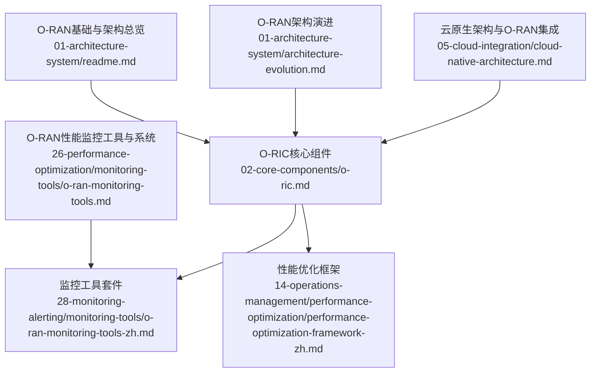
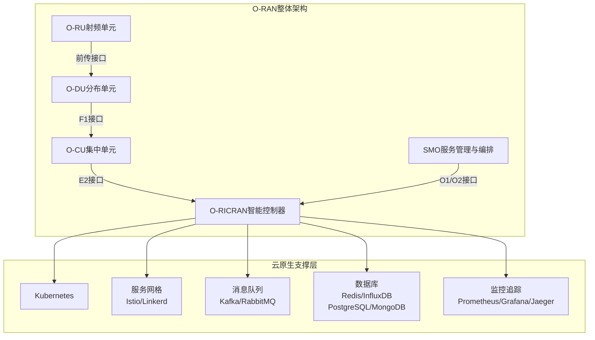
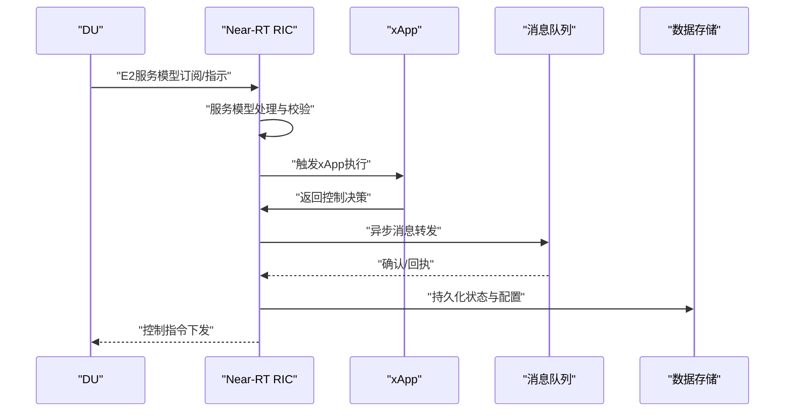
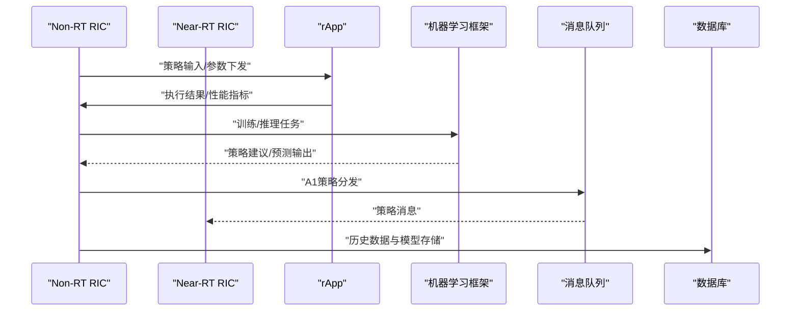
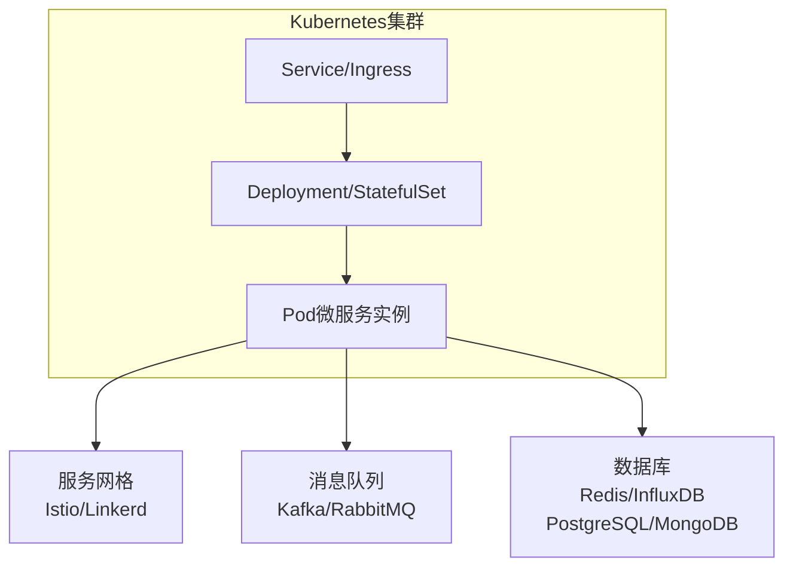
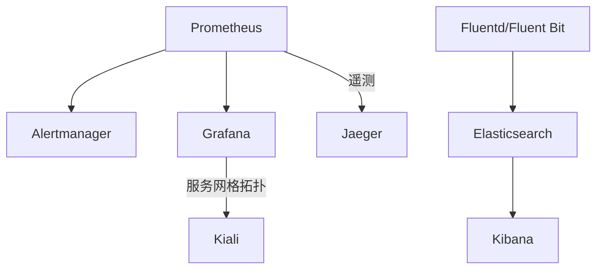
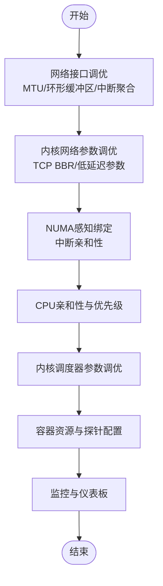
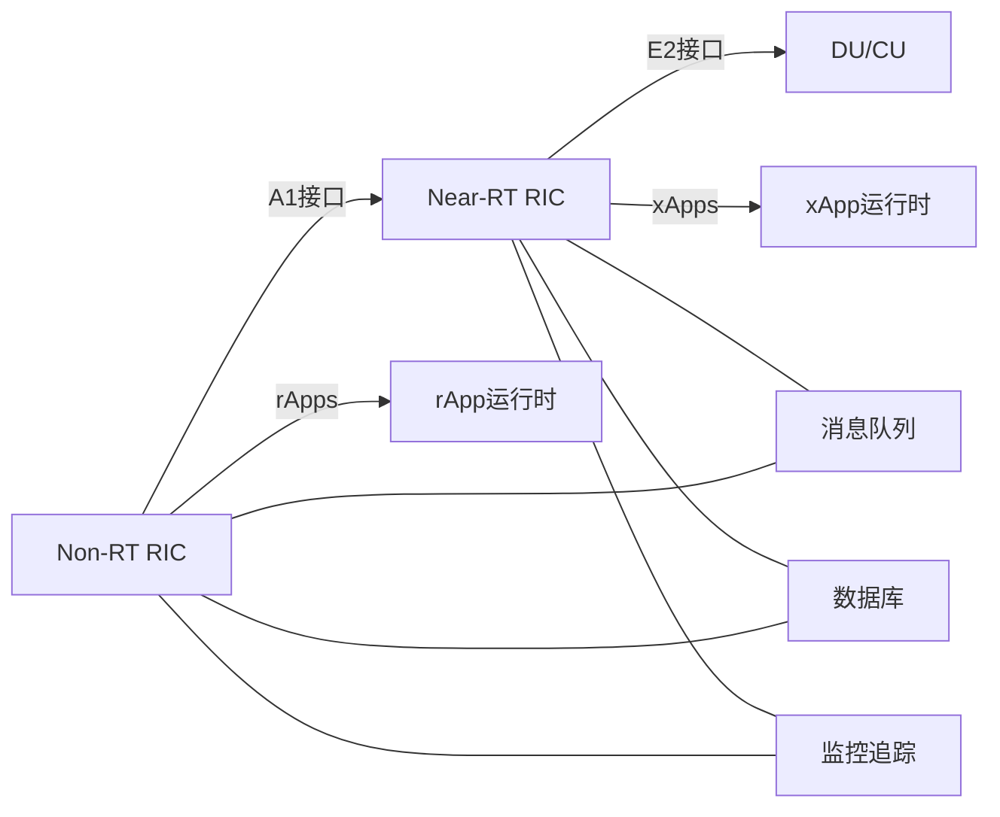

# RIC架构设计

<cite>
**本文引用的文件**
- [O-RAN基础与架构总览](file://01-architecture-system/readme.md)
- [O-RAN架构演进](file://01-architecture-system/architecture-evolution.md)
- [O-RIC核心组件](file://02-core-components/o-ric.md)
- [云原生架构与O-RAN集成](file://05-cloud-integration/cloud-native-architecture.md)
- [O-RAN监控工具套件](file://28-monitoring-alerting/monitoring-tools/o-ran-monitoring-tools-zh.md)
- [O-RAN性能监控工具与系统](file://26-performance-optimization/monitoring-tools/o-ran-monitoring-tools.md)
- [O-RAN性能优化框架](file://14-operations-management/performance-optimization/performance-optimization-framework-zh.md)
</cite>

## 目录
1. [简介](#简介)
2. [项目结构](#项目结构)
3. [核心组件](#核心组件)
4. [架构总览](#架构总览)
5. [详细组件分析](#详细组件分析)
6. [依赖分析](#依赖分析)
7. [性能考量](#性能考量)
8. [故障排查指南](#故障排查指南)
9. [结论](#结论)
10. [附录](#附录)

## 简介
本文件面向RIC（RAN智能控制器）架构设计，系统阐述Near-RT RIC与Non-RT RIC的架构原理、设计模式与实现细节；结合云原生技术（容器编排、微服务、服务网格），给出高可用、容错、负载均衡与资源调度的设计策略；并覆盖消息队列、数据库与监控追踪等技术栈选择及最佳实践与性能优化策略。内容来源于仓库中关于O-RAN架构、核心组件、云原生集成与监控优化的权威文档。

## 项目结构
本仓库围绕O-RAN参考架构与落地实践组织内容，与RIC架构设计直接相关的主要模块如下：
- 01-architecture-system：O-RAN基础与架构演进，奠定RIC在整体架构中的定位与演进脉络
- 02-core-components：核心网络元素与O-RIC功能职责、技术架构与部署考量
- 05-cloud-integration：云原生与O-RAN集成，容器编排、微服务与服务网格的应用
- 26-performance-optimization：性能监控与优化工具链
- 28-monitoring-alerting：监控与告警工具生态，支撑高可用与可观测性

**图表来源**
- [O-RAN基础与架构总览](file://01-architecture-system/readme.md#L1-L161)
- [O-RAN架构演进](file://01-architecture-system/architecture-evolution.md#L1-L183)
- [O-RIC核心组件](file://02-core-components/o-ric.md#L1-L437)
- [云原生架构与O-RAN集成](file://05-cloud-integration/cloud-native-architecture.md#L1-L481)
- [O-RAN性能监控工具与系统](file://26-performance-optimization/monitoring-tools/o-ran-monitoring-tools.md#L1-L355)
- [O-RAN监控工具套件](file://28-monitoring-alerting/monitoring-tools/o-ran-monitoring-tools-zh.md#L1-L284)
- [O-RAN性能优化框架](file://14-operations-management/performance-optimization/performance-optimization-framework-zh.md#L1-L342)

**章节来源**
- [O-RAN基础与架构总览](file://01-architecture-system/readme.md#L1-L161)
- [O-RAN架构演进](file://01-architecture-system/architecture-evolution.md#L1-L183)
- [O-RIC核心组件](file://02-core-components/o-ric.md#L1-L437)
- [云原生架构与O-RAN集成](file://05-cloud-integration/cloud-native-architecture.md#L1-L481)
- [O-RAN性能监控工具与系统](file://26-performance-optimization/monitoring-tools/o-ran-monitoring-tools.md#L1-L355)
- [O-RAN监控工具套件](file://28-monitoring-alerting/monitoring-tools/o-ran-monitoring-tools-zh.md#L1-L284)
- [O-RAN性能优化框架](file://14-operations-management/performance-optimization/performance-optimization-framework-zh.md#L1-L342)

## 核心组件
- Near-RT RIC：毫秒级控制闭环，负责E2接口实时交互、xApps运行与管理、服务模型处理、消息路由与数据存储；采用Kubernetes容器编排、Istio/Linkerd服务网格、Kafka/RabbitMQ消息队列、Redis/InfluxDB数据库、Prometheus/Grafana监控。
- Non-RT RIC：秒至分钟级策略管理，负责A1接口策略分发、rApps生命周期管理、策略系统、数据分析引擎与机器学习框架；采用Kubernetes容器编排、Istio/Linkerd服务网格、Kafka/RabbitMQ消息队列、PostgreSQL/MongoDB数据库、Spark/Flink大数据处理、TensorFlow/PyTorch机器学习。
- RIC协调：Near-RT与Non-RT之间的策略上下行传递、多RIC协作、状态同步与冲突解决。

**章节来源**
- [O-RIC核心组件](file://02-core-components/o-ric.md#L7-L133)

## 架构总览
下图展示了RIC在O-RAN整体架构中的位置与交互，以及云原生技术栈如何支撑其微服务化、容器化与服务网格化部署。

**图表来源**
- [O-RAN基础与架构总览](file://01-architecture-system/readme.md#L21-L34)
- [O-RIC核心组件](file://02-core-components/o-ric.md#L89-L116)
- [云原生架构与O-RAN集成](file://05-cloud-integration/cloud-native-architecture.md#L299-L341)

**章节来源**
- [O-RAN基础与架构总览](file://01-architecture-system/readme.md#L1-L161)
- [O-RIC核心组件](file://02-core-components/o-ric.md#L73-L116)
- [云原生架构与O-RAN集成](file://05-cloud-integration/cloud-native-architecture.md#L297-L341)

## 详细组件分析

### Near-RT RIC组件与数据流
- 核心组件：E2接口适配层、xApps管理框架、服务模型处理、消息路由、数据存储
- 关键流程：E2接口订阅与指示处理、xApps生命周期管理、消息路由与转发、网络状态与配置存储
- 技术栈：Kubernetes、Istio/Linkerd、Kafka/RabbitMQ、Redis/InfluxDB、Prometheus/Grafana

**图表来源**
- [O-RIC核心组件](file://02-core-components/o-ric.md#L82-L94)

**章节来源**
- [O-RIC核心组件](file://02-core-components/o-ric.md#L75-L94)

### Non-RT RIC组件与数据流
- 核心组件：A1接口适配层、rApps管理框架、策略系统、数据分析引擎、机器学习框架
- 关键流程：策略生命周期管理、历史数据分析与建模、rApp生命周期管理、策略生成与分发
- 技术栈：Kubernetes、Istio/Linkerd、Kafka/RabbitMQ、PostgreSQL/MongoDB、Spark/Flink、TensorFlow/PyTorch

**图表来源**
- [O-RIC核心组件](file://02-core-components/o-ric.md#L103-L116)

**章节来源**
- [O-RIC核心组件](file://02-core-components/o-ric.md#L96-L116)

### 云原生微服务与容器编排
- 微服务架构：服务组件化、独立部署与升级、技术栈多样性
- 容器编排：Kubernetes实现自动扩缩容、自我修复、服务发现与负载均衡
- 服务网格：Istio/Linkerd提供流量治理、安全与可观测性增强
- 自动化：CI/CD流水线、基础设施即代码（IaC）

**图表来源**
- [云原生架构与O-RAN集成](file://05-cloud-integration/cloud-native-architecture.md#L37-L50)
- [O-RIC核心组件](file://02-core-components/o-ric.md#L89-L116)

**章节来源**
- [云原生架构与O-RAN集成](file://05-cloud-integration/cloud-native-architecture.md#L1-L481)
- [O-RIC核心组件](file://02-core-components/o-ric.md#L75-L116)

### 监控与可观测性
- 指标采集：Prometheus、Node Exporter、kube-state-metrics、cAdvisor
- 可视化：Grafana仪表板、服务网格拓扑（Kiali）
- 分布式追踪：Jaeger、OpenTelemetry
- 日志聚合：Elasticsearch/Kibana、Fluentd/Fluent Bit、Loki
- 告警：Alertmanager、Grafana告警、Sensu/Zabbix

**图表来源**
- [O-RAN监控工具套件](file://28-monitoring-alerting/monitoring-tools/o-ran-monitoring-tools-zh.md#L10-L31)
- [O-RAN监控工具套件](file://28-monitoring-alerting/monitoring-tools/o-ran-monitoring-tools-zh.md#L57-L62)
- [O-RAN性能监控工具与系统](file://26-performance-optimization/monitoring-tools/o-ran-monitoring-tools.md#L146-L214)

**章节来源**
- [O-RAN监控工具套件](file://28-monitoring-alerting/monitoring-tools/o-ran-monitoring-tools-zh.md#L1-L284)
- [O-RAN性能监控工具与系统](file://26-performance-optimization/monitoring-tools/o-ran-monitoring-tools.md#L1-L355)

### 性能优化与资源调度
- 网络优化：接口调优（巨帧、环形缓冲区、中断聚合）、内核参数（BBR、TCP参数）、NUMA感知绑定
- 计算优化：CPU亲和性与优先级、内核调度器参数、容器资源请求/限制与探针
- 监控仪表板：按组件CPU/内存利用率、延迟与吞吐趋势

**图表来源**
- [O-RAN性能优化框架](file://14-operations-management/performance-optimization/performance-optimization-framework-zh.md#L8-L101)
- [O-RAN性能优化框架](file://14-operations-management/performance-optimization/performance-optimization-framework-zh.md#L103-L234)
- [O-RAN性能优化框架](file://14-operations-management/performance-optimization/performance-optimization-framework-zh.md#L302-L340)

**章节来源**
- [O-RAN性能优化框架](file://14-operations-management/performance-optimization/performance-optimization-framework-zh.md#L1-L342)

## 依赖分析
- 组件耦合：Near-RT与Non-RT RIC通过A1接口耦合，形成“策略-执行”闭环；E2接口与DU/CU耦合，形成“实时控制”闭环
- 外部依赖：Kubernetes提供编排与弹性；服务网格提供流量治理与安全；消息队列提供异步解耦；数据库提供状态与历史数据存储；监控追踪提供可观测性
- 风险与缓解：接口兼容性、实时性与同步精度、多厂商生态、安全与合规

**图表来源**
- [O-RIC核心组件](file://02-core-components/o-ric.md#L47-L71)
- [O-RIC核心组件](file://02-core-components/o-ric.md#L82-L116)

**章节来源**
- [O-RIC核心组件](file://02-core-components/o-ric.md#L47-L71)
- [O-RIC核心组件](file://02-core-components/o-ric.md#L82-L116)

## 性能考量
- 实时性保障：容器性能优化（特权容器、CPU亲和性）、网络优化（SR-IOV/DPDK）、存储优化（本地/高性能）、资源预留
- 可靠性与可用性：多副本部署、自动故障转移、状态一致性、备份与恢复
- 安全性：网络策略、最小权限、传输与存储加密、镜像与运行时安全扫描
- 可观测性：统一监控（日志/指标/追踪）、分布式追踪、智能告警与根因分析

**章节来源**
- [云原生架构与O-RAN集成](file://05-cloud-integration/cloud-native-architecture.md#L123-L176)
- [O-RAN监控工具套件](file://28-monitoring-alerting/monitoring-tools/o-ran-monitoring-tools-zh.md#L254-L282)

## 故障排查指南
- 告警与分级：接口故障、应用故障、资源不足、性能劣化
- 定位手段：告警关联、日志分析、性能分析、测试验证
- 恢复策略：服务重启、配置调整、资源扩容、接口修复、应用重启
- 自动化：配置自动化、自动化测试、自动检测与恢复、自动化的性能优化流程

**章节来源**
- [O-RIC核心组件](file://02-core-components/o-ric.md#L261-L301)
- [O-RIC核心组件](file://02-core-components/o-ric.md#L343-L388)

## 结论
RIC作为O-RAN智能化核心，通过Near-RT与Non-RT双轨架构实现“实时控制+长期优化”的协同。依托云原生技术栈，RIC可实现高可用、弹性扩展与可观测性，满足低延迟、高可靠与多厂商互操作的复杂场景需求。结合完善的监控与性能优化体系，可系统性提升网络性能与运维效率。

## 附录
- 部署模式：集中式、边缘云、混合云，依据业务与延迟要求选择
- 最佳实践：自动化部署与GitOps、高可用冗余与故障转移、灾难恢复、应用安全与数据安全、容量管理与动态资源调整

**章节来源**
- [云原生架构与O-RAN集成](file://05-cloud-integration/cloud-native-architecture.md#L235-L296)
- [O-RIC核心组件](file://02-core-components/o-ric.md#L302-L388)