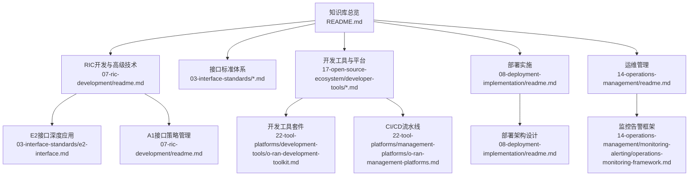
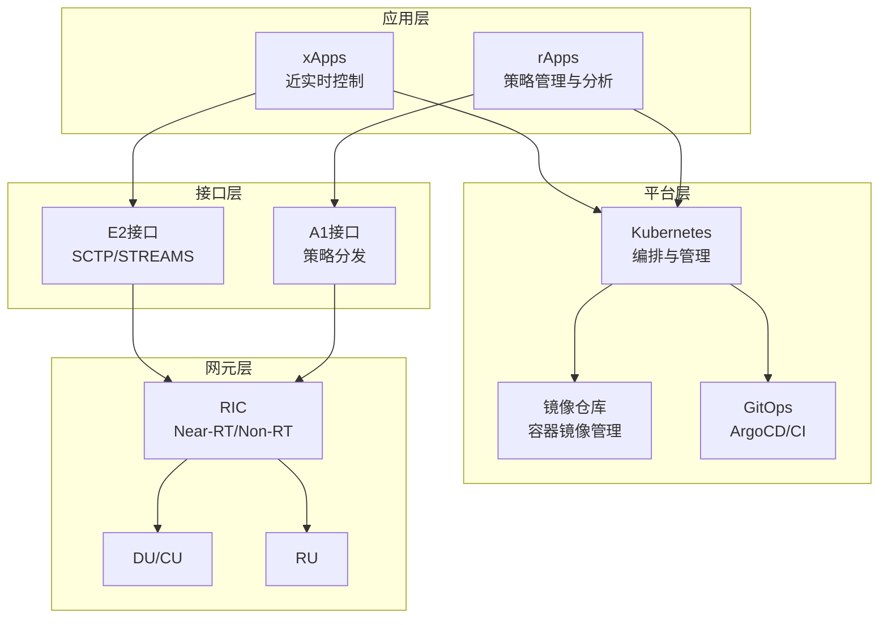
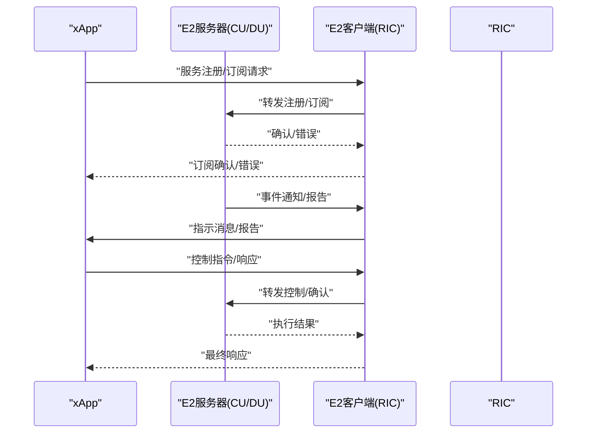
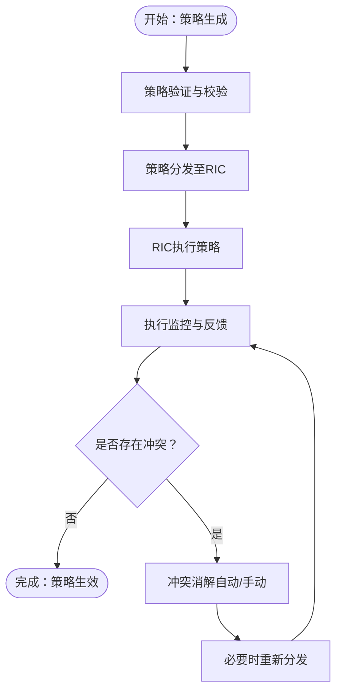
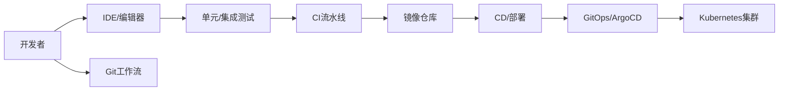
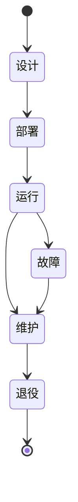
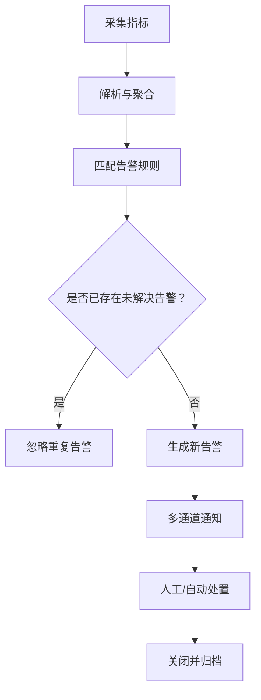
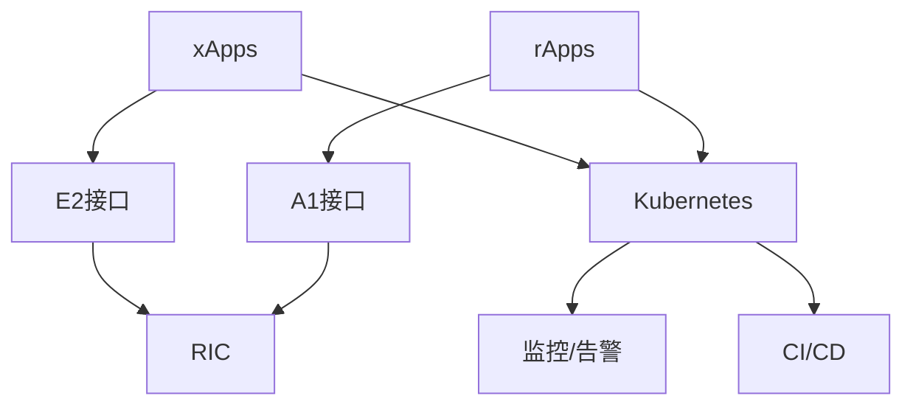
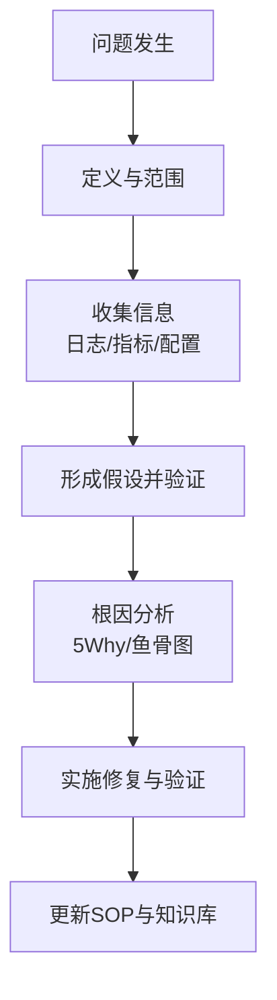

# xApps/rApps开发框架

<cite>
**本文引用的文件**
- [README.md](file://README.md)
- [07-ric-development/readme.md](file://07-ric-development/readme.md)
- [07-ric-development/readme-zh.md](file://07-ric-development/readme-zh.md)
- [03-interface-standards/e2-interface.md](file://03-interface-standards/e2-interface.md)
- [17-open-source-ecosystem/developer-tools/oran-development-tools.md](file://17-open-source-ecosystem/developer-tools/oran-development-tools.md)
- [22-tool-platforms/development-tools/o-ran-development-toolkit.md](file://22-tool-platforms/development-tools/o-ran-development-toolkit.md)
- [08-deployment-implementation/readme.md](file://08-deployment-implementation/readme.md)
- [14-operations-management/readme.md](file://14-operations-management/readme.md)
- [22-tool-platforms/management-platforms/o-ran-management-platforms.md](file://22-tool-platforms/management-platforms/o-ran-management-platforms.md)
- [17-open-source-ecosystem/developer-tools/oran-development-tools-zh.md](file://17-open-source-ecosystem/developer-tools/oran-development-tools-zh.md)
- [26-performance-optimization/monitoring-tools/o-ran-monitoring-tools.md](file://26-performance-optimization/monitoring-tools/o-ran-monitoring-tools.md)
- [14-operations-management/monitoring-alerting/operations-monitoring-framework.md](file://14-operations-management/monitoring-alerting/operations-monitoring-framework.md)
- [05-cloud-integration/cloud-native-architecture.md](file://05-cloud-integration/cloud-native-architecture.md)
</cite>

## 目录
1. [简介](#简介)
2. [项目结构](#项目结构)
3. [核心组件](#核心组件)
4. [架构总览](#架构总览)
5. [详细组件分析](#详细组件分析)
6. [依赖分析](#依赖分析)
7. [性能考虑](#性能考虑)
8. [故障排查指南](#故障排查指南)
9. [结论](#结论)
10. [附录](#附录)

## 简介
本文件面向云平台运维背景的专业人士，系统化梳理xApps/rApps开发框架，重点围绕以下目标展开：
- 明确xApps与rApps的差异、适用场景与发展要求
- 深入讲解E2接口与A1接口的服务模型适配、实时数据处理与控制逻辑实现
- 提供开发工具链配置（IDE、测试框架、CI/CD）、编程语言选择与框架使用指南
- 覆盖生命周期管理、部署策略、调试技巧与性能优化方法
- 结合仓库现有文档，给出可落地的最佳实践与参考路径

## 项目结构
该知识库以“云平台专家向O-RAN转型”的主线组织，围绕架构、接口、RIC开发、部署实施、测试验证、运维管理、性能优化等维度形成完整知识图谱。与xApps/rApps开发直接相关的内容主要集中在：
- RIC开发与高级技术：xApps/rApps开发框架、E2/A1接口深度应用、智能算法与机器学习
- 接口标准：E2接口、A1接口规范与实现要点
- 开发工具与平台：开发环境、SDK、CI/CD、模拟仿真与测试框架
- 部署实施：部署架构设计、硬件与基础设施规划、集成测试策略
- 运维管理：监控告警、容量规划、生命周期管理、故障处理

图表来源
- [README.md](file://README.md#L1-L472)
- [07-ric-development/readme.md](file://07-ric-development/readme.md#L1-L368)
- [03-interface-standards/e2-interface.md](file://03-interface-standards/e2-interface.md#L1-L337)
- [22-tool-platforms/development-tools/o-ran-development-toolkit.md](file://22-tool-platforms/development-tools/o-ran-development-toolkit.md#L1-L488)
- [22-tool-platforms/management-platforms/o-ran-management-platforms.md](file://22-tool-platforms/management-platforms/o-ran-management-platforms.md#L534-L616)
- [08-deployment-implementation/readme.md](file://08-deployment-implementation/readme.md#L1-L200)
- [14-operations-management/monitoring-alerting/operations-monitoring-framework.md](file://14-operations-management/monitoring-alerting/operations-monitoring-framework.md#L262-L486)

章节来源
- [README.md](file://README.md#L1-L472)

## 核心组件
- xApps开发要点
  - E2接口服务模型适配：KPI订阅/报告、无线资源控制、CU-UP控制等
  - 实时数据处理与控制逻辑：订阅/指示机制、错误处理与重试
  - 生命周期管理：开发、测试、部署、升级、退役
- rApps开发要点
  - A1接口策略管理：策略生命周期、冲突消解、长周期数据分析与模型集成
  - 策略生成与分发：策略验证、版本控制、执行监控与回滚
- 开发工具链
  - IDE与环境配置：VS Code扩展、JetBrains配置、Git工作流与代码质量工具
  - 测试框架：单元/集成测试、模拟仿真、协议分析
  - CI/CD：GitHub Actions、ArgoCD、GitOps、容器镜像构建与部署
- 编程语言与框架
  - Python：数据分析与机器学习
  - Go：高性能服务与实时处理
  - Java：企业应用与微服务
  - C++：性能关键组件与算法优化
  - 框架：Spring Boot、Flask、gRPC

章节来源
- [07-ric-development/readme.md](file://07-ric-development/readme.md#L34-L97)
- [07-ric-development/readme-zh.md](file://07-ric-development/readme-zh.md#L34-L97)
- [17-open-source-ecosystem/developer-tools/oran-development-tools.md](file://17-open-source-ecosystem/developer-tools/oran-development-tools.md#L86-L413)
- [22-tool-platforms/development-tools/o-ran-development-toolkit.md](file://22-tool-platforms/development-tools/o-ran-development-toolkit.md#L1-L200)

## 架构总览
xApps/rApps运行于云原生平台之上，依托Kubernetes进行编排与管理，通过E2/A1接口与RIC/网元交互，实现近实时与非实时两类控制与策略管理场景。

图表来源
- [07-ric-development/readme.md](file://07-ric-development/readme.md#L8-L33)
- [03-interface-standards/e2-interface.md](file://03-interface-standards/e2-interface.md#L63-L98)
- [22-tool-platforms/management-platforms/o-ran-management-platforms.md](file://22-tool-platforms/management-platforms/o-ran-management-platforms.md#L534-L616)

## 详细组件分析

### xApps开发：E2接口服务模型与实时处理
- 服务模型适配
  - E2SM-KPM：KPI订阅与报告
  - E2SM-RC：无线资源控制
  - E2SM-GNB-CU-UP：CU-UP控制
  - 自定义服务模型开发
- 消息处理机制
  - 服务注册、订阅管理（创建/修改/删除）、指示消息处理、报告消息处理、错误处理与重试
- 性能优化
  - 消息批处理、连接池管理、异步处理、缓存策略、负载均衡

图表来源
- [03-interface-standards/e2-interface.md](file://03-interface-standards/e2-interface.md#L79-L98)
- [07-ric-development/readme.md](file://07-ric-development/readme.md#L60-L78)

章节来源
- [03-interface-standards/e2-interface.md](file://03-interface-standards/e2-interface.md#L49-L98)
- [07-ric-development/readme.md](file://07-ric-development/readme.md#L60-L78)

### rApps开发：A1接口策略管理与长周期分析
- 策略生命周期管理
  - 创建与验证、版本控制、分发机制、执行监控、回滚与撤销
- 策略类型与场景
  - 移动性优化、负载均衡、QoS、节能、干扰协调
- 冲突消解
  - 优先级机制、冲突检测算法、自动/手动干预、审计与记录

图表来源
- [07-ric-development/readme.md](file://07-ric-development/readme.md#L79-L97)

章节来源
- [07-ric-development/readme.md](file://07-ric-development/readme.md#L79-L97)

### 开发工具链与框架使用
- IDE与开发环境
  - VS Code扩展、JetBrains插件、Git工作流、代码质量工具（SonarQube、静态分析）
- 模拟仿真与测试
  - NS-3扩展、Wireshark O-RAN配置、协议分析与抓包
- CI/CD与GitOps
  - GitHub Actions流水线、ArgoCD GitOps、Helm/Kustomize应用管理
- 容器化与本地开发
  - Dockerfile与多阶段构建、Docker Compose、VS Code Server

图表来源
- [17-open-source-ecosystem/developer-tools/oran-development-tools.md](file://17-open-source-ecosystem/developer-tools/oran-development-tools.md#L86-L413)
- [22-tool-platforms/development-tools/o-ran-development-toolkit.md](file://22-tool-platforms/development-tools/o-ran-development-toolkit.md#L1-L200)
- [22-tool-platforms/management-platforms/o-ran-management-platforms.md](file://22-tool-platforms/management-platforms/o-ran-management-platforms.md#L534-L616)

章节来源
- [17-open-source-ecosystem/developer-tools/oran-development-tools.md](file://17-open-source-ecosystem/developer-tools/oran-development-tools.md#L86-L413)
- [22-tool-platforms/development-tools/o-ran-development-toolkit.md](file://22-tool-platforms/development-tools/o-ran-development-toolkit.md#L1-L200)
- [22-tool-platforms/management-platforms/o-ran-management-platforms.md](file://22-tool-platforms/management-platforms/o-ran-management-platforms.md#L534-L616)

### 生命周期管理与部署策略
- 生命周期管理
  - 设计、部署、运行、维护、退役；配置版本控制、变更评估与回滚
- 部署架构设计
  - 集中式、分布式、混合、边缘、多云部署；带宽与延迟预算、跨云连通性
- 集成测试策略
  - 接口测试（E2/A1/O1/O-FH/F1）、功能测试、性能测试、互通测试、回归测试
- 自动化与编排
  - IaC（Terraform/Ansible）、Kubernetes/Helm/ArgoCD、HPA/VPA、蓝绿/金丝雀发布

图表来源
- [14-operations-management/readme.md](file://14-operations-management/readme.md#L82-L96)
- [08-deployment-implementation/readme.md](file://08-deployment-implementation/readme.md#L8-L38)
- [08-deployment-implementation/readme.md](file://08-deployment-implementation/readme.md#L180-L196)

章节来源
- [14-operations-management/readme.md](file://14-operations-management/readme.md#L82-L126)
- [08-deployment-implementation/readme.md](file://08-deployment-implementation/readme.md#L1-L200)
- [05-cloud-integration/cloud-native-architecture.md](file://05-cloud-integration/cloud-native-architecture.md#L207-L255)

### 调试技巧与监控告警
- 监控最佳实践
  - 四黄金信号、RED/USE方法、告警降噪与分级、系统可靠性与持续改进
- 智能告警引擎
  - 告警规则加载、指标提取、去重与通知通道（邮件/Slack/PagerDuty）
- 运行时观测
  - Prometheus/Grafana集成、日志分析（ELK）、性能分析（Perf/火焰图）

图表来源
- [26-performance-optimization/monitoring-tools/o-ran-monitoring-tools.md](file://26-performance-optimization/monitoring-tools/o-ran-monitoring-tools.md#L286-L355)
- [14-operations-management/monitoring-alerting/operations-monitoring-framework.md](file://14-operations-management/monitoring-alerting/operations-monitoring-framework.md#L262-L486)

章节来源
- [26-performance-optimization/monitoring-tools/o-ran-monitoring-tools.md](file://26-performance-optimization/monitoring-tools/o-ran-monitoring-tools.md#L286-L355)
- [14-operations-management/monitoring-alerting/operations-monitoring-framework.md](file://14-operations-management/monitoring-alerting/operations-monitoring-framework.md#L262-L486)

## 依赖分析
- 组件耦合与内聚
  - xApps与E2接口强耦合，需关注消息编解码、订阅生命周期与错误处理
  - rApps与A1接口强耦合，需关注策略冲突消解与执行监控
  - 平台层（Kubernetes/ArgoCD）与应用层（xApps/rApps）松耦合，便于独立演进
- 外部依赖与集成点
  - 协议栈：SCTP/STREAMS（E2）、NETCONF/YANG（O1）、eCPRI（前传）
  - 工具链：Wireshark/E2AP解析、NS-3仿真、Prometheus/Grafana监控
- 潜在循环依赖
  - 通过清晰的接口契约与版本管理避免应用与平台层循环依赖

图表来源
- [03-interface-standards/e2-interface.md](file://03-interface-standards/e2-interface.md#L63-L98)
- [07-ric-development/readme.md](file://07-ric-development/readme.md#L8-L33)
- [22-tool-platforms/management-platforms/o-ran-management-platforms.md](file://22-tool-platforms/management-platforms/o-ran-management-platforms.md#L534-L616)

章节来源
- [03-interface-standards/e2-interface.md](file://03-interface-standards/e2-interface.md#L63-L98)
- [07-ric-development/readme.md](file://07-ric-development/readme.md#L8-L33)

## 性能考虑
- E2接口性能优化
  - 传输层：SCTP参数优化、多流配置、多路径
  - 应用层：消息压缩、批处理、缓存
  - 网络层：减少跳数、SR-IOV/DPDK、负载均衡
- RIC应用性能优化
  - 数据处理逻辑优化、连接池与缓存、异步处理、并发与瓶颈分析、架构去单点
- 监控与基线
  - 建立性能基线、四黄金信号与RED/USE方法、告警分级与降噪

章节来源
- [03-interface-standards/e2-interface.md](file://03-interface-standards/e2-interface.md#L131-L147)
- [07-ric-development/readme.md](file://07-ric-development/readme.md#L72-L78)
- [26-performance-optimization/monitoring-tools/o-ran-monitoring-tools.md](file://26-performance-optimization/monitoring-tools/o-ran-monitoring-tools.md#L286-L355)

## 故障排查指南
- 常见问题分类
  - 接口故障（E2/A1/O1/O-FH/F1）、性能问题（延迟/吞吐/丢包）、可用性问题、配置问题、兼容性问题
- 排查流程
  - 问题定义与范围界定、信息收集（日志/指标/配置）、假设与验证、根因分析（5 Why/鱼骨图）、解决方案实施与验证
- 诊断工具
  - Wireshark/Tcpdump、协议分析器、ELK/Splunk、Perf/火焰图、Ping/Traceroute/MTR
- 标准作业程序（SOP）
  - 故障响应、升级、沟通、复盘与知识库更新

图表来源
- [08-deployment-implementation/readme.md](file://08-deployment-implementation/readme.md#L126-L156)

章节来源
- [08-deployment-implementation/readme.md](file://08-deployment-implementation/readme.md#L126-L156)

## 结论
xApps/rApps开发框架以云原生为底座，围绕E2/A1接口实现近实时控制与非实时策略管理。通过完善的开发工具链、CI/CD与GitOps、监控告警与容量规划，以及系统化的生命周期管理与故障排查流程，可在生产环境中实现高可靠、可扩展、可维护的O-RAN应用交付。建议从接口适配与消息处理入手，逐步引入智能算法与策略管理，并持续优化性能与运维自动化。

## 附录
- 实际开发示例与最佳实践
  - 参考“xApp开发”“rApp开发”“异常检测系统”“预测性维护”“能效优化”等实验室项目
  - 生产环境最佳实践：微服务架构、错误处理与日志、测试与容器化、金丝雀发布、模型版本管理与回滚、安全与合规
- 参考资料
  - O-RAN联盟规范、ETSI标准、3GPP标准、开源项目与社区资源

章节来源
- [07-ric-development/readme.md](file://07-ric-development/readme.md#L297-L368)
- [07-ric-development/readme-zh.md](file://07-ric-development/readme-zh.md#L297-L340)