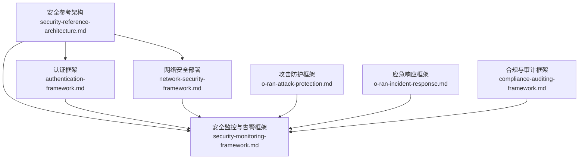
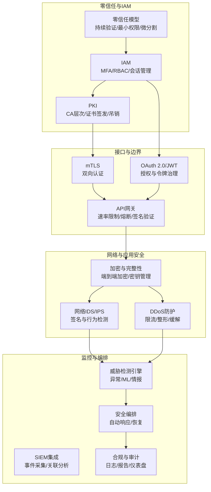
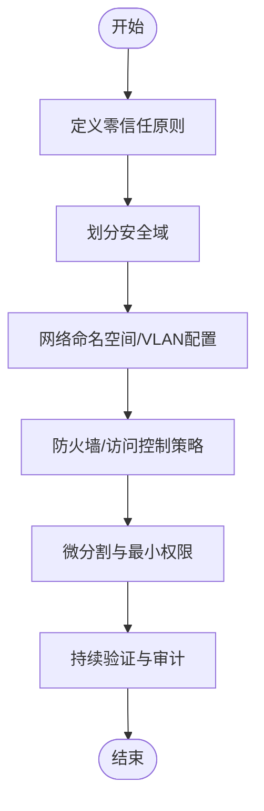
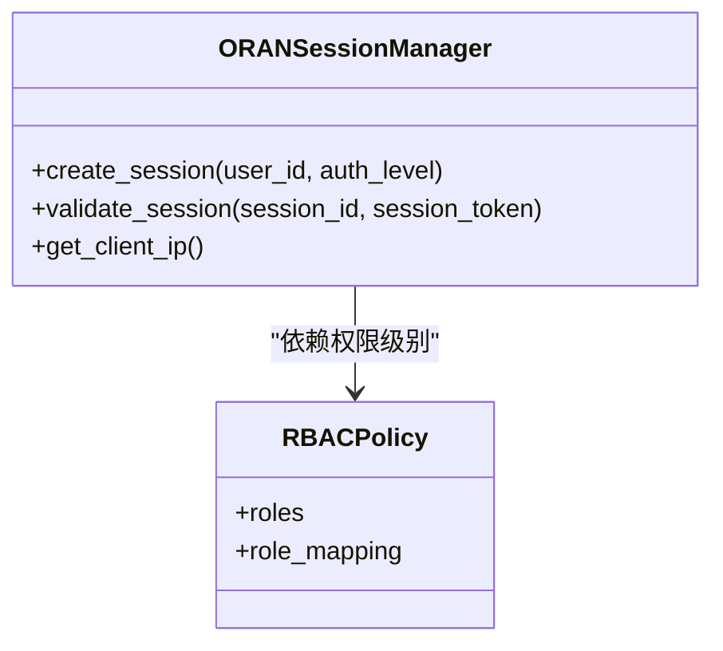
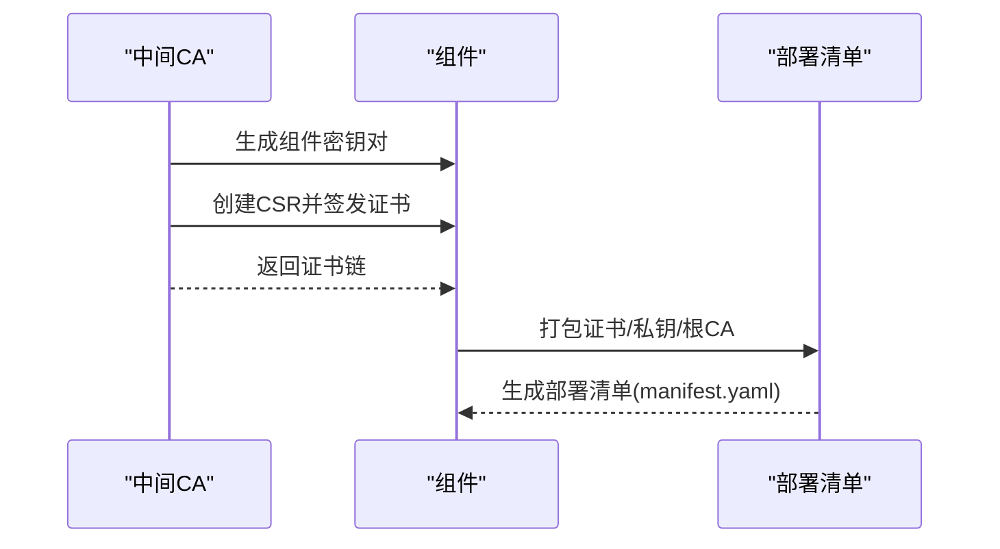
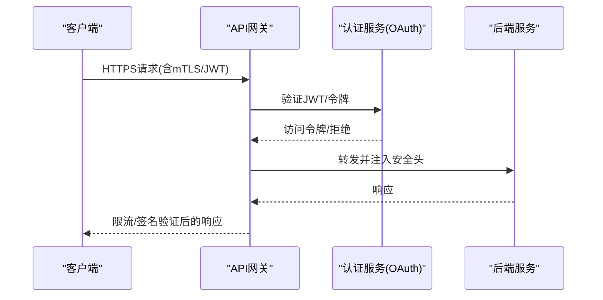
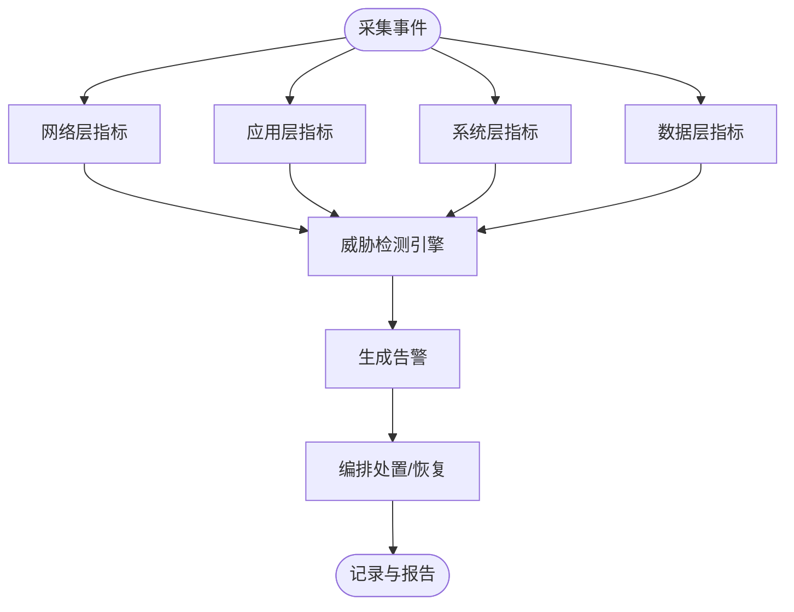
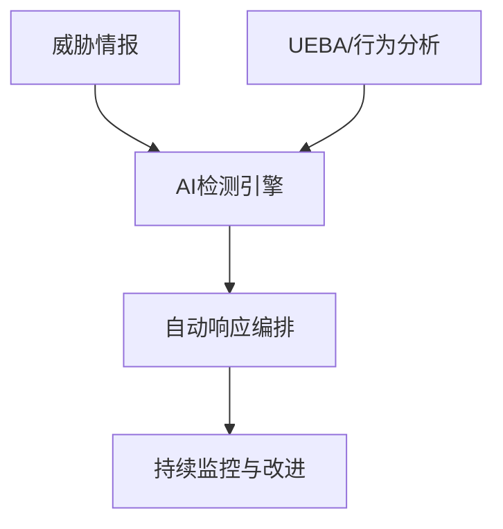
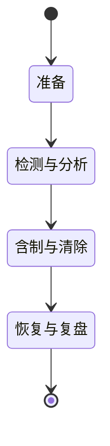
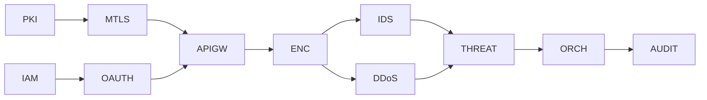

# 安全架构与威胁检测

<cite>
**本文引用的文件**
- [安全参考架构](file://12-security-privacy/security-architecture/security-reference-architecture.md)
- [认证框架](file://12-security-privacy/authentication/authentication-framework.md)
- [网络安全部署](file://12-security-privacy/network-security/network-security-framework.md)
- [合规与审计框架](file://12-security-privacy/compliance-auditing/compliance-auditing-framework.md)
- [安全监控与告警框架](file://12-security-privacy/monitoring-alerting/security-monitoring-framework.md)
- [O-RAN 威胁检测与防护](file://29-security-threats/attack-protection/o-ran-attack-protection.md)
- [O-RAN 应急响应框架](file://29-security-threats/incident-response/o-ran-incident-response.md)
</cite>

## 目录
1. [简介](#简介)
2. [项目结构](#项目结构)
3. [核心组件](#核心组件)
4. [架构总览](#架构总览)
5. [详细组件分析](#详细组件分析)
6. [依赖关系分析](#依赖关系分析)
7. [性能考量](#性能考量)
8. [故障排查指南](#故障排查指南)
9. [结论](#结论)
10. [附录](#附录)

## 简介
本文件面向O-RAN安全架构与威胁检测，系统化梳理零信任、微分割、身份与访问管理（IAM）、公钥基础设施（PKI）、安全编排自动化等关键能力；深入说明接口安全增强（mTLS双向认证、OAuth 2.0/OIDC授权、API网关安全、速率限制与熔断、消息签名与验证）；覆盖AI驱动的安全（异常行为检测、威胁情报集成、自动化响应、预测性安全分析、欺骗检测）；并提供安全监控与审计（实时监控、事件关联分析、审计日志管理、合规检查、安全报告可视化）的实现思路与最佳实践。

## 项目结构
围绕安全主题，仓库采用按主题域划分的文档组织方式，安全相关文档主要分布在“12-security-privacy”与“29-security-threats”两个目录下，并与“12-security-privacy/monitoring-alerting”形成监控与告警闭环。

图示来源
- [安全参考架构](file://12-security-privacy/security-architecture/security-reference-architecture.md#L1-L559)
- [认证框架](file://12-security-privacy/authentication/authentication-framework.md#L1-L208)
- [网络安全部署](file://12-security-privacy/network-security/network-security-framework.md#L1-L473)
- [安全监控与告警框架](file://12-security-privacy/monitoring-alerting/security-monitoring-framework.md#L1-L733)
- [O-RAN 威胁检测与防护](file://29-security-threats/attack-protection/o-ran-attack-protection.md#L1-L241)
- [O-RAN 应急响应框架](file://29-security-threats/incident-response/o-ran-incident-response.md#L1-L269)
- [合规与审计框架](file://12-security-privacy/compliance-auditing/compliance-auditing-framework.md#L1-L486)

章节来源
- [安全参考架构](file://12-security-privacy/security-architecture/security-reference-architecture.md#L1-L559)
- [认证框架](file://12-security-privacy/authentication/authentication-framework.md#L1-L208)
- [网络安全部署](file://12-security-privacy/network-security/network-security-framework.md#L1-L473)
- [安全监控与告警框架](file://12-security-privacy/monitoring-alerting/security-monitoring-framework.md#L1-L733)
- [O-RAN 威胁检测与防护](file://29-security-threats/attack-protection/o-ran-attack-protection.md#L1-L241)
- [O-RAN 应急响应框架](file://29-security-threats/incident-response/o-ran-incident-response.md#L1-L269)
- [合规与审计框架](file://12-security-privacy/compliance-auditing/compliance-auditing-framework.md#L1-L486)

## 核心组件
- 零信任与微分割：通过安全域划分、持续验证、最小权限与微分割实现纵深防御。
- 身份与访问管理（IAM）：多因素认证（MFA）、基于角色的访问控制（RBAC）、会话管理与令牌治理。
- 公钥基础设施（PKI）：根/中间CA层次、组件证书签发与部署、吊销检查与密钥轮换。
- 接口安全增强：mTLS双向认证、OAuth 2.0/JWT、API网关安全、速率限制与熔断、消息签名与验证。
- 安全监控与审计：多层监控体系、威胁检测引擎、合规仪表盘、自动响应编排。
- AI驱动安全：异常行为检测、威胁情报集成、自动化响应、预测性分析与欺骗检测。

章节来源
- [安全参考架构](file://12-security-privacy/security-architecture/security-reference-architecture.md#L8-L36)
- [认证框架](file://12-security-privacy/authentication/authentication-framework.md#L8-L23)
- [网络安全部署](file://12-security-privacy/network-security/network-security-framework.md#L6-L40)
- [安全监控与告警框架](file://12-security-privacy/monitoring-alerting/security-monitoring-framework.md#L8-L31)

## 架构总览
下图展示O-RAN安全架构的关键交互：以零信任为核心，结合PKI与IAM保障身份可信，网络与应用双层防护，SIEM与威胁情报驱动的实时检测与自动编排。

图示来源
- [安全参考架构](file://12-security-privacy/security-architecture/security-reference-architecture.md#L8-L36)
- [认证框架](file://12-security-privacy/authentication/authentication-framework.md#L71-L96)
- [网络安全部署](file://12-security-privacy/network-security/network-security-framework.md#L428-L471)
- [安全监控与告警框架](file://12-security-privacy/monitoring-alerting/security-monitoring-framework.md#L119-L217)

## 详细组件分析

### 零信任与微分割
- 零信任原则：永不信任，始终验证；最小权限；持续验证；微分割。
- 安全域划分：管理域、控制面域、用户面域、基础设施域，分别配置差异化的访问控制与隔离策略。
- 微分割实施：命名空间/ VLAN/防火墙规则，确保跨域通信受控。

图示来源
- [安全参考架构](file://12-security-privacy/security-architecture/security-reference-architecture.md#L8-L36)
- [网络安全部署](file://12-security-privacy/network-security/network-security-framework.md#L42-L112)

章节来源
- [安全参考架构](file://12-security-privacy/security-architecture/security-reference-architecture.md#L8-L36)
- [网络安全部署](file://12-security-privacy/network-security/network-security-framework.md#L6-L40)

### 身份与访问管理（IAM）
- 多因素认证（MFA）：用户名密码+一次性验证码/智能卡/硬件令牌/生物识别。
- RBAC策略：角色定义、权限矩阵、LDAP组映射，支持全局/域/安全域作用域。
- 会话管理：安全会话创建、令牌校验、超时与活动刷新、客户端IP绑定。

图示来源
- [认证框架](file://12-security-privacy/authentication/authentication-framework.md#L126-L185)
- [认证框架](file://12-security-privacy/authentication/authentication-framework.md#L284-L337)

章节来源
- [认证框架](file://12-security-privacy/authentication/authentication-framework.md#L8-L23)
- [认证框架](file://12-security-privacy/authentication/authentication-framework.md#L284-L337)
- [认证框架](file://12-security-privacy/authentication/authentication-framework.md#L126-L185)

### 公钥基础设施（PKI）
- CA层次：根CA组织级CA→管理/控制/用户/基础设施中间CA。
- 组件证书：组件密钥生成、CSR签发、打包部署、有效期与续期策略。
- 证书管理：吊销检查（OCSP/CRL）、透明度日志、私钥备份与HSM。

图示来源
- [安全参考架构](file://12-security-privacy/security-architecture/security-reference-architecture.md#L75-L145)

章节来源
- [安全参考架构](file://12-security-privacy/security-architecture/security-reference-architecture.md#L75-L145)

### 接口安全增强
- mTLS双向认证：E2/F1/管理接口启用，客户端证书必需，OCSP/CRL吊销检查，TLS套件选择。
- OAuth 2.0/JWT：授权服务器、令牌端点、客户端注册、JWT签名算法与生命周期。
- API网关安全：TLS终止、安全头、速率限制zone、请求转发与头部注入。
- 速率限制与熔断：全局/源地址限速、突发窗口、带宽整形、NFTables/Iptables规则。
- 消息签名与验证：完整性保护与抗抵赖，结合时间戳与随机数。

图示来源
- [认证框架](file://12-security-privacy/authentication/authentication-framework.md#L71-L96)
- [网络安全部署](file://12-security-privacy/network-security/network-security-framework.md#L428-L471)
- [安全参考架构](file://12-security-privacy/security-architecture/security-reference-architecture.md#L249-L282)

章节来源
- [认证框架](file://12-security-privacy/authentication/authentication-framework.md#L100-L124)
- [认证框架](file://12-security-privacy/authentication/authentication-framework.md#L71-L96)
- [网络安全部署](file://12-security-privacy/network-security/network-security-framework.md#L428-L471)
- [安全参考架构](file://12-security-privacy/security-architecture/security-reference-architecture.md#L249-L282)

### 安全监控与审计
- 多层监控：网络层（流量/协议/入侵）、应用层（API安全/认证/权限）、系统层（容器/主机/基线漂移）、数据层（加密/防泄漏/密钥审计）。
- 威胁检测：实时检测引擎、威胁模式匹配、告警分级与关联。
- 合规仪表盘：指标采集频率、目标值与趋势、阈值告警、通知策略。
- 自动化编排：基于预案的自动处置（阻断IP、禁用账户、增加日志级别），与SOAR对接。

图示来源
- [安全监控与告警框架](file://12-security-privacy/monitoring-alerting/security-monitoring-framework.md#L8-L31)
- [安全监控与告警框架](file://12-security-privacy/monitoring-alerting/security-monitoring-framework.md#L119-L217)
- [安全监控与告警框架](file://12-security-privacy/monitoring-alerting/security-monitoring-framework.md#L306-L440)

章节来源
- [安全监控与告警框架](file://12-security-privacy/monitoring-alerting/security-monitoring-framework.md#L8-L31)
- [安全监控与告警框架](file://12-security-privacy/monitoring-alerting/security-monitoring-framework.md#L119-L217)
- [安全监控与告警框架](file://12-security-privacy/monitoring-alerting/security-monitoring-framework.md#L306-L440)

### AI驱动的安全
- 异常行为检测：用户/实体行为分析（UEBA）、基线建立与异常评分、群体对比与风险自适应挑战。
- 威胁情报集成：实时情报订阅、IOC匹配、签名与哈希比对、异常流量与查询模式识别。
- 自动化响应：SOAR编排、自动阻断、账户冻结、补丁部署、权限回收。
- 预测性安全分析：基于历史与趋势的脆弱性预测、攻击向量概率评估。
- 欺骗检测：诱饵系统/诱饵令牌/诱饵文件、反侦察与拖慢扫描、溯源追踪。

图示来源
- [O-RAN 威胁检测与防护](file://29-security-threats/attack-protection/o-ran-attack-protection.md#L70-L83)
- [O-RAN 威胁检测与防护](file://29-security-threats/attack-protection/o-ran-attack-protection.md#L147-L177)

章节来源
- [O-RAN 威胁检测与防护](file://29-security-threats/attack-protection/o-ran-attack-protection.md#L53-L83)
- [O-RAN 威胁检测与防护](file://29-security-threats/attack-protection/o-ran-attack-protection.md#L147-L177)

### 应急响应与恢复
- 团队结构：指挥官、技术负责人、通讯、法务、取证专家等角色职责。
- 流程阶段：准备、检测与分析、遏制与清除、恢复与复盘、沟通与报告。
- 工具栈：SOAR、工单系统、协作平台、通知服务、取证工具、日志分析平台。
- 指标度量：MTTD/MTTR/MTTC/MTTR、遏制成功率、误报率、客户满意度、合规达成度。

图示来源
- [O-RAN 应急响应框架](file://29-security-threats/incident-response/o-ran-incident-response.md#L45-L105)

章节来源
- [O-RAN 应急响应框架](file://29-security-threats/incident-response/o-ran-incident-response.md#L6-L22)
- [O-RAN 应急响应框架](file://29-security-threats/incident-response/o-ran-incident-response.md#L171-L203)

## 依赖关系分析
- 认证与授权依赖于PKI提供的证书与令牌；API网关作为统一入口，串联mTLS与OAuth流程。
- 网络与应用安全（IDS/IPS、DDoS、加密）为监控与告警提供输入事件与指标。
- 威胁检测引擎与SOAR编排共同驱动自动化响应，形成闭环。
- 合规与审计框架贯穿全链路，提供证据收集、报告与持续改进。

图示来源
- [认证框架](file://12-security-privacy/authentication/authentication-framework.md#L100-L124)
- [网络安全部署](file://12-security-privacy/network-security/network-security-framework.md#L428-L471)
- [安全监控与告警框架](file://12-security-privacy/monitoring-alerting/security-monitoring-framework.md#L119-L217)

章节来源
- [认证框架](file://12-security-privacy/authentication/authentication-framework.md#L71-L96)
- [网络安全部署](file://12-security-privacy/network-security/network-security-framework.md#L261-L310)
- [安全监控与告警框架](file://12-security-privacy/monitoring-alerting/security-monitoring-framework.md#L518-L637)

## 性能考量
- 加密与完整性：在保证安全的前提下，选择高效算法（如AES-GCM）与硬件加速；TLS 1.3减少握手开销。
- 限流与整形：针对不同接口优先级设置带宽上限与队列类型，避免拥塞与尾延迟放大。
- 监控开销：采用异步采集与批处理、压缩与分区存储，降低SIEM与日志系统的资源占用。
- 编排效率：预置Playbook与并行动作，缩短MTTR；避免重复扫描与无效阻断。

## 故障排查指南
- 认证失败/会话失效：核对mTLS证书链、吊销状态、时间同步；检查会话令牌生成与校验逻辑。
- 授权异常：核查RBAC角色映射、LDAP组权限、作用域范围；确认JWT声明与过期时间。
- 网络异常/DDoS：检查iptables/NFTables规则、速率阈值、地理过滤与签名阻断；查看IDS告警与流量统计。
- 日志缺失/不一致：确认采集器运行状态、Kafka/ES连通性、日志格式与索引策略。
- 合规问题：执行合规脚本检查、核对证书有效期与策略配置、审查违规记录与整改闭环。

章节来源
- [认证框架](file://12-security-privacy/authentication/authentication-framework.md#L126-L185)
- [网络安全部署](file://12-security-privacy/network-security/network-security-framework.md#L311-L426)
- [安全监控与告警框架](file://12-security-privacy/monitoring-alerting/security-monitoring-framework.md#L310-L440)
- [合规与审计框架](file://12-security-privacy/compliance-auditing/compliance-auditing-framework.md#L310-L379)

## 结论
O-RAN安全架构应以零信任为基石，结合PKI与IAM实现身份可信，通过网络与应用双层防护强化边界安全，借助SIEM与威胁情报驱动的AI检测与自动编排提升响应效率，并以合规与审计保障持续改进。上述组件协同工作，可有效应对当前复杂多变的网络威胁环境。

## 附录
- 关键术语：零信任、微分割、mTLS、OAuth 2.0/JWT、RBAC、UEBA、SOAR、MTTD/MTTR/MTTC。
- 参考标准：3GPP TS 33.501/33.102/33.401、ETSI TS 103 859/983、ISO 27001、NIST CSF、GDPR。