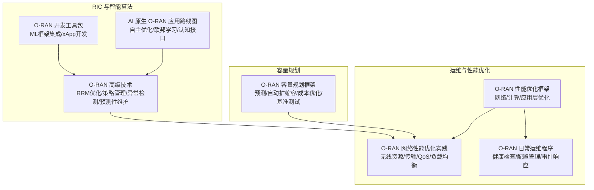
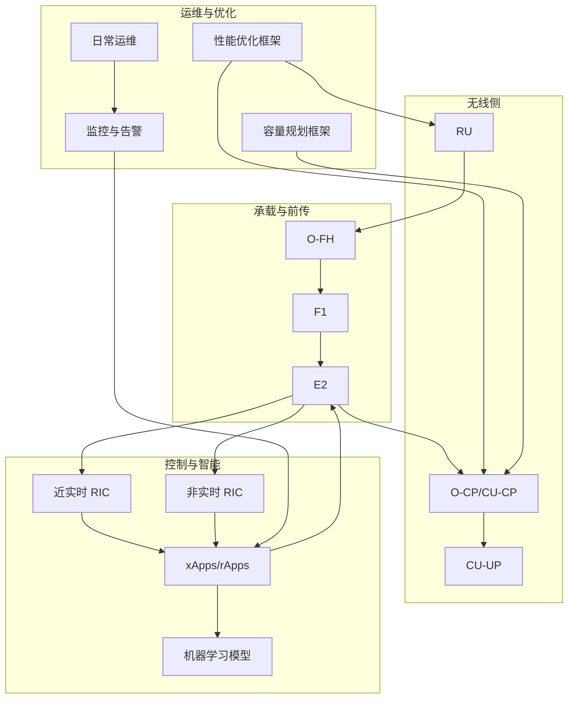
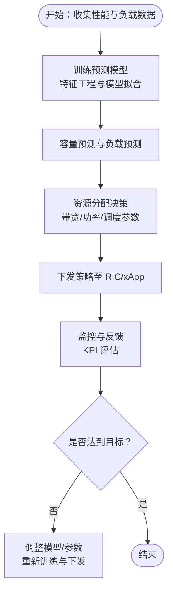
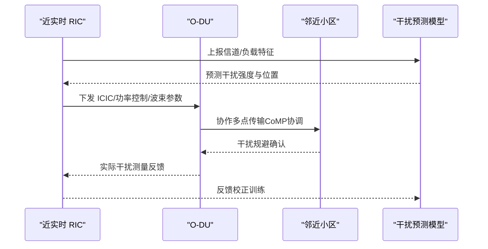
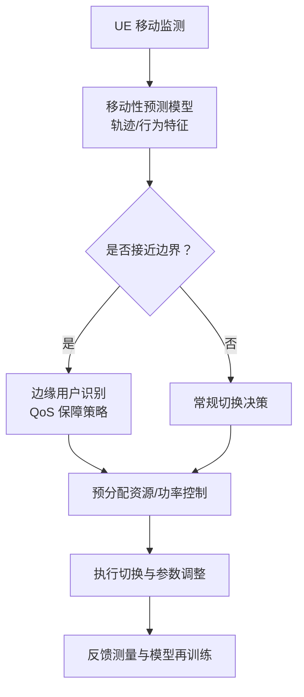
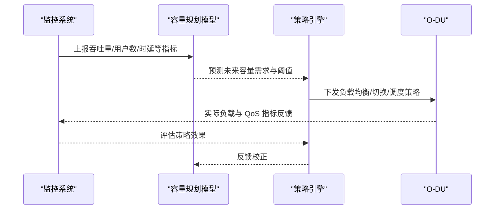
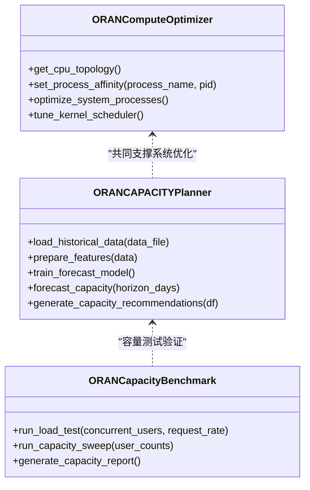
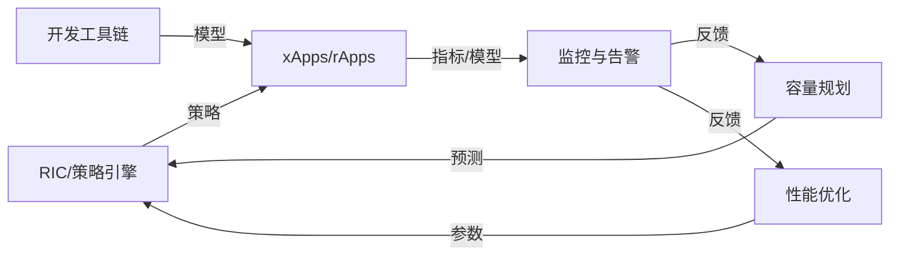
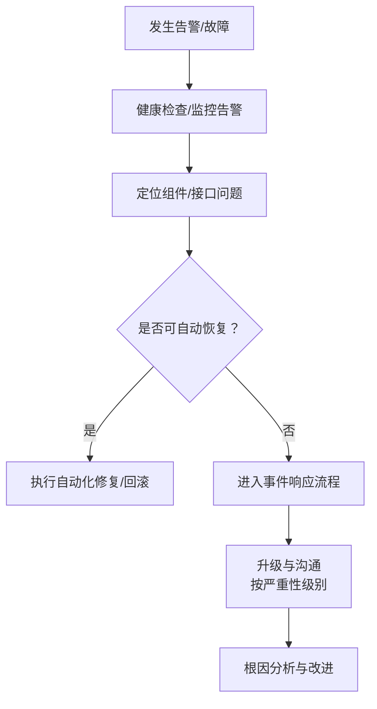

# 无线资源管理优化

<cite>
**本文引用的文件**
- [O-RAN 性能优化框架](file://14-operations-management/performance-optimization/performance-optimization-framework-zh.md)
- [O-RAN 容量规划框架](file://14-operations-management/capacity-planning/capacity-planning-framework-zh.md)
- [O-RAN 网络性能优化实践](file://26-performance-optimization/network-optimization/network-performance-tuning.md)
- [O-RAN 高级技术](file://07-ric-development/readme-zh.md)
- [O-RAN 日常运维程序](file://14-operations-management/daily-operations/daily-operation-procedures-zh.md)
- [O-RAN 开发工具包](file://22-tool-platforms/development-tools/o-ran-development-toolkit.md)
- [AI 原生 O-RAN 应用路线图](file://15-future-development/emerging-applications/emerging-applications-roadmap.md)
</cite>

## 目录
1. [简介](#简介)
2. [项目结构](#项目结构)
3. [核心组件](#核心组件)
4. [架构总览](#架构总览)
5. [详细组件分析](#详细组件分析)
6. [依赖分析](#依赖分析)
7. [性能考量](#性能考量)
8. [故障排查指南](#故障排查指南)
9. [结论](#结论)
10. [附录](#附录)

## 简介
本文件面向无线资源管理优化，围绕智能资源分配、干扰管理、移动性优化与容量管理等主题，系统梳理仓库中已有的性能优化、容量规划、网络优化实践与 RIC/智能算法相关内容，形成可操作的优化策略与实施路径。内容既覆盖现有成熟实践，也包含面向未来的 AI 原生架构演进方向，帮助读者在 O-RAN 网络中实现更高效、稳定、智能的资源管理。

## 项目结构
本知识库采用主题化目录组织，与无线资源管理优化直接相关的内容主要分布在以下模块：
- 运维与性能优化：网络接口调优、计算层优化、应用层容器资源优化、监控与告警
- 容量规划：负载预测、自动扩缩容、成本优化、容量基准测试
- 网络优化实践：无线资源优化、传输效率优化、QoS 参数调优、负载均衡策略
- RIC 与智能算法：基于机器学习的无线资源管理、策略管理、异常检测与预测性维护
- 日常运维：健康检查、配置管理、事件响应与故障排查
- 开发工具与 AI 集成：机器学习框架集成、xApp/rApp 开发工具链
- 未来应用：AI 原生 O-RAN 架构与自主优化

**图表来源**
- [O-RAN 性能优化框架](file://14-operations-management/performance-optimization/performance-optimization-framework-zh.md#L1-L342)
- [O-RAN 网络性能优化实践](file://26-performance-optimization/network-optimization/network-performance-tuning.md#L1-L98)
- [O-RAN 日常运维程序](file://14-operations-management/daily-operations/daily-operation-procedures-zh.md#L1-L419)
- [O-RAN 容量规划框架](file://14-operations-management/capacity-planning/capacity-planning-framework-zh.md#L1-L505)
- [O-RAN 高级技术](file://07-ric-development/readme-zh.md#L1-L340)
- [O-RAN 开发工具包](file://22-tool-platforms/development-tools/o-ran-development-toolkit.md#L368-L415)
- [AI 原生 O-RAN 应用路线图](file://15-future-development/emerging-applications/emerging-applications-roadmap.md#L61-L282)

**章节来源**
- [O-RAN 性能优化框架](file://14-operations-management/performance-optimization/performance-optimization-framework-zh.md#L1-L342)
- [O-RAN 网络性能优化实践](file://26-performance-optimization/network-optimization/network-performance-tuning.md#L1-L98)
- [O-RAN 日常运维程序](file://14-operations-management/daily-operations/daily-operation-procedures-zh.md#L1-L419)
- [O-RAN 容量规划框架](file://14-operations-management/capacity-planning/capacity-planning-framework-zh.md#L1-L505)
- [O-RAN 高级技术](file://07-ric-development/readme-zh.md#L1-L340)
- [O-RAN 开发工具包](file://22-tool-platforms/development-tools/o-ran-development-toolkit.md#L368-L415)
- [AI 原生 O-RAN 应用路线图](file://15-future-development/emerging-applications/emerging-applications-roadmap.md#L61-L282)

## 核心组件
- 网络层优化：接口调优、内核参数、NUMA 绑定、流量控制与优先级队列
- 计算层优化：CPU 亲和性、进程优先级、内核调度器调优
- 应用层优化：容器资源请求/限制、探针配置、健康检查
- 容量规划：机器学习预测模型、自动扩缩容策略、成本优化与容量基准测试
- 无线资源管理（RRM）：智能资源分配、干扰管理、移动性优化、容量管理
- 监控与告警：KPI 指标体系、自动化告警规则、仪表板配置
- 日常运维：健康检查、配置备份/恢复、变更管理、事件响应流程

**章节来源**
- [O-RAN 性能优化框架](file://14-operations-management/performance-optimization/performance-optimization-framework-zh.md#L6-L100)
- [O-RAN 性能优化框架](file://14-operations-management/performance-optimization/performance-optimization-framework-zh.md#L103-L234)
- [O-RAN 性能优化框架](file://14-operations-management/performance-optimization/performance-optimization-framework-zh.md#L236-L342)
- [O-RAN 容量规划框架](file://14-operations-management/capacity-planning/capacity-planning-framework-zh.md#L6-L186)
- [O-RAN 容量规划框架](file://14-operations-management/capacity-planning/capacity-planning-framework-zh.md#L188-L360)
- [O-RAN 网络性能优化实践](file://26-performance-optimization/network-optimization/network-performance-tuning.md#L6-L98)
- [O-RAN 高级技术](file://07-ric-development/readme-zh.md#L125-L149)
- [O-RAN 日常运维程序](file://14-operations-management/daily-operations/daily-operation-procedures-zh.md#L6-L161)

## 架构总览
下图展示无线资源管理优化在 O-RAN 系统中的整体架构与关键交互：

**图表来源**
- [O-RAN 高级技术](file://07-ric-development/readme-zh.md#L8-L33)
- [O-RAN 网络性能优化实践](file://26-performance-optimization/network-optimization/network-performance-tuning.md#L1-L98)
- [O-RAN 性能优化框架](file://14-operations-management/performance-optimization/performance-optimization-framework-zh.md#L1-L342)
- [O-RAN 容量规划框架](file://14-operations-management/capacity-planning/capacity-planning-framework-zh.md#L1-L505)
- [O-RAN 日常运维程序](file://14-operations-management/daily-operations/daily-operation-procedures-zh.md#L1-L419)

## 详细组件分析

### 智能资源分配与调度
- 基于机器学习的资源调度：利用历史性能与负载数据训练预测模型，支撑容量规划与资源分配决策。
- 动态带宽分配：结合负载预测与 QoS 目标，动态调整频谱与资源块分配。
- 功率控制优化：依据信道质量与干扰状况，自适应调整发射功率。
- 调度策略优化：结合优先级映射、缓冲区管理与队列调度算法，降低时延与抖动。
- 负载均衡算法：通过用户分布优化与动态资源池，实现跨小区/节点的负载均衡与卸载。

**图表来源**
- [O-RAN 容量规划框架](file://14-operations-management/capacity-planning/capacity-planning-framework-zh.md#L18-L186)
- [O-RAN 高级技术](file://07-ric-development/readme-zh.md#L125-L149)

**章节来源**
- [O-RAN 容量规划框架](file://14-operations-management/capacity-planning/capacity-planning-framework-zh.md#L6-L186)
- [O-RAN 高级技术](file://07-ric-development/readme-zh.md#L125-L149)

### 干扰管理技术
- 小区间干扰协调（ICIC）：动态资源分配，避免相邻小区间的同频干扰。
- 功率控制优化：自适应发射功率调整，抑制上行/下行干扰。
- 波束赋形与干扰随机化：利用空间维度与跳频/扩频技术抑制干扰。
- 基于学习的干扰预测：通过 ML 模型预测干扰热点，提前规避或缓解。
- 自适应干扰规避与协作多点传输（CoMP）：联合调度与波束协调，提升边缘用户体验。

**图表来源**
- [O-RAN 网络性能优化实践](file://26-performance-optimization/network-optimization/network-performance-tuning.md#L22-L27)
- [O-RAN 高级技术](file://07-ric-development/readme-zh.md#L132-L137)

**章节来源**
- [O-RAN 网络性能优化实践](file://26-performance-optimization/network-optimization/network-performance-tuning.md#L22-L27)
- [O-RAN 高级技术](file://07-ric-development/readme-zh.md#L132-L137)

### 移动性优化
- 切换决策优化：基于 ML 的切换时机与目标小区选择，减少掉话与乒乓切换。
- 切换参数调优：门限、迟滞、定时器等参数的动态调整。
- 移动性预测：利用轨迹与行为模型预测用户移动趋势，预分配资源。
- 双连接管理：EN-DC 场景下的承载与功率协同管理。
- 边缘用户识别：基于位置与信道特征识别边缘用户，实施差异化策略。

**图表来源**
- [O-RAN 高级技术](file://07-ric-development/readme-zh.md#L138-L143)

**章节来源**
- [O-RAN 高级技术](file://07-ric-development/readme-zh.md#L138-L143)

### 容量管理策略
- 基于预测的容量规划：使用随机森林等模型对未来容量需求进行预测，输出容量建议。
- 动态小区切换：根据负载与 QoS 指标，动态引导用户切换至最优小区。
- 负载均衡与卸载：跨小区/节点的负载均衡与用户分组调度。
- QoS 保障机制：针对不同业务（URLLC/eMBB/mMTC）配置差异化 QoS 参数与优先级。

**图表来源**
- [O-RAN 容量规划框架](file://14-operations-management/capacity-planning/capacity-planning-framework-zh.md#L54-L151)
- [O-RAN 网络性能优化实践](file://26-performance-optimization/network-optimization/network-performance-tuning.md#L62-L82)

**章节来源**
- [O-RAN 容量规划框架](file://14-operations-management/capacity-planning/capacity-planning-framework-zh.md#L6-L186)
- [O-RAN 网络性能优化实践](file://26-performance-optimization/network-optimization/network-performance-tuning.md#L62-L82)

### 性能优化与监控
- 网络接口优化：禁用不必要的网络卸载、设置巨帧、配置中断聚合与优先级队列。
- 内核参数调优：TCP 拥塞控制、延迟与缓冲区参数优化。
- NUMA 感知绑定：将网络中断绑定到特定 CPU 核心，降低跨 NUMA 通信开销。
- 计算层优化：进程 CPU 亲和性、优先级与内核调度器调优。
- 应用层优化：容器资源请求/限制、探针配置与健康检查。
- 监控与告警：KPI 指标体系、自动化告警规则与可视化仪表板。

**图表来源**
- [O-RAN 性能优化框架](file://14-operations-management/performance-optimization/performance-optimization-framework-zh.md#L113-L234)
- [O-RAN 容量规划框架](file://14-operations-management/capacity-planning/capacity-planning-framework-zh.md#L18-L186)
- [O-RAN 容量规划框架](file://14-operations-management/capacity-planning/capacity-planning-framework-zh.md#L372-L503)

**章节来源**
- [O-RAN 性能优化框架](file://14-operations-management/performance-optimization/performance-optimization-framework-zh.md#L6-L100)
- [O-RAN 性能优化框架](file://14-operations-management/performance-optimization/performance-optimization-framework-zh.md#L103-L234)
- [O-RAN 性能优化框架](file://14-operations-management/performance-optimization/performance-optimization-framework-zh.md#L236-L342)
- [O-RAN 容量规划框架](file://14-operations-management/capacity-planning/capacity-planning-framework-zh.md#L361-L505)

## 依赖分析
- 组件耦合与协作
  - RIC（近实时/非实时）与 xApps/rApps：负责策略生成与执行，依赖 ML 模型与监控反馈。
  - 容量规划与网络优化：相互依赖，容量规划为优化提供输入，优化结果反馈到容量模型。
  - 日常运维与监控：健康检查与告警规则驱动优化动作，形成闭环。
- 外部依赖
  - 机器学习框架（如 TensorFlow/Keras）与模型服务（ONNX/TensorFlow Serving）。
  - 监控与可视化平台（Prometheus/Grafana）。
  - 容器编排与资源管理（Kubernetes）。

**图表来源**
- [O-RAN 高级技术](file://07-ric-development/readme-zh.md#L34-L98)
- [O-RAN 开发工具包](file://22-tool-platforms/development-tools/o-ran-development-toolkit.md#L368-L415)
- [O-RAN 日常运维程序](file://14-operations-management/daily-operations/daily-operation-procedures-zh.md#L361-L419)

**章节来源**
- [O-RAN 高级技术](file://07-ric-development/readme-zh.md#L34-L98)
- [O-RAN 开发工具包](file://22-tool-platforms/development-tools/o-ran-development-toolkit.md#L368-L415)
- [O-RAN 日常运维程序](file://14-operations-management/daily-operations/daily-operation-procedures-zh.md#L361-L419)

## 性能考量
- 无线侧：频谱效率提升、干扰抑制、波束赋形与随机化、QoS 参数精细化配置。
- 传输侧：头部压缩、协议栈优化、用户面/控制面消息优化、会话管理优化。
- 网络层：接口调优、内核参数、NUMA 绑定、流量控制与优先级队列。
- 计算层：CPU 亲和性、进程优先级、内核调度器调优。
- 应用层：容器资源请求/限制、探针与健康检查、自动扩缩容策略。
- 监控与告警：KPI 指标体系、自动化告警规则、可视化仪表板。

**章节来源**
- [O-RAN 网络性能优化实践](file://26-performance-optimization/network-optimization/network-performance-tuning.md#L6-L98)
- [O-RAN 性能优化框架](file://14-operations-management/performance-optimization/performance-optimization-framework-zh.md#L6-L100)
- [O-RAN 性能优化框架](file://14-operations-management/performance-optimization/performance-optimization-framework-zh.md#L103-L234)
- [O-RAN 性能优化框架](file://14-operations-management/performance-optimization/performance-optimization-framework-zh.md#L236-L342)

## 故障排查指南
- 健康检查：每日健康验证脚本，检查各组件健康状态并告警。
- 网络接口监控：丢包率、延迟、带宽利用率阈值监控与邮件告警。
- 配置管理：备份/恢复流程、变更管理流程与回滚程序。
- 事件响应：严重性分级、升级时间线与沟通协议。
- 常见问题：E2/F1/O-FH 接口连接与性能问题的诊断与解决步骤。

**图表来源**
- [O-RAN 日常运维程序](file://14-operations-management/daily-operations/daily-operation-procedures-zh.md#L6-L161)
- [O-RAN 日常运维程序](file://14-operations-management/daily-operations/daily-operation-procedures-zh.md#L283-L359)

**章节来源**
- [O-RAN 日常运维程序](file://14-operations-management/daily-operations/daily-operation-procedures-zh.md#L6-L161)
- [O-RAN 日常运维程序](file://14-operations-management/daily-operations/daily-operation-procedures-zh.md#L163-L281)
- [O-RAN 日常运维程序](file://14-operations-management/daily-operations/daily-operation-procedures-zh.md#L283-L359)

## 结论
通过将网络层优化、计算层优化、应用层优化与容量规划相结合，并依托 RIC/智能算法实现闭环优化，O-RAN 网络可在频谱效率、QoS、时延抖动与资源利用率等方面取得显著提升。面向未来，AI 原生架构将进一步推动网络的自优化与自适应能力，持续提升用户体验与运营效率。

## 附录
- AI 原生 O-RAN 架构：AI 处理器、联邦学习、自主优化与认知接口等方向的演进与示例。
- 开发工具与 ML 集成：TensorFlow/Keras 集成、ONNX 转换与模型服务、xApp 开发框架。

**章节来源**
- [AI 原生 O-RAN 应用路线图](file://15-future-development/emerging-applications/emerging-applications-roadmap.md#L61-L282)
- [O-RAN 开发工具包](file://22-tool-platforms/development-tools/o-ran-development-toolkit.md#L368-L415)