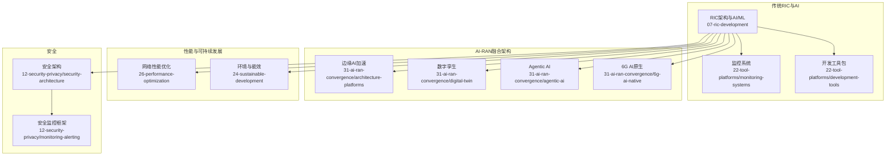
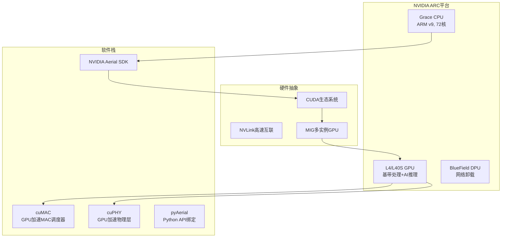
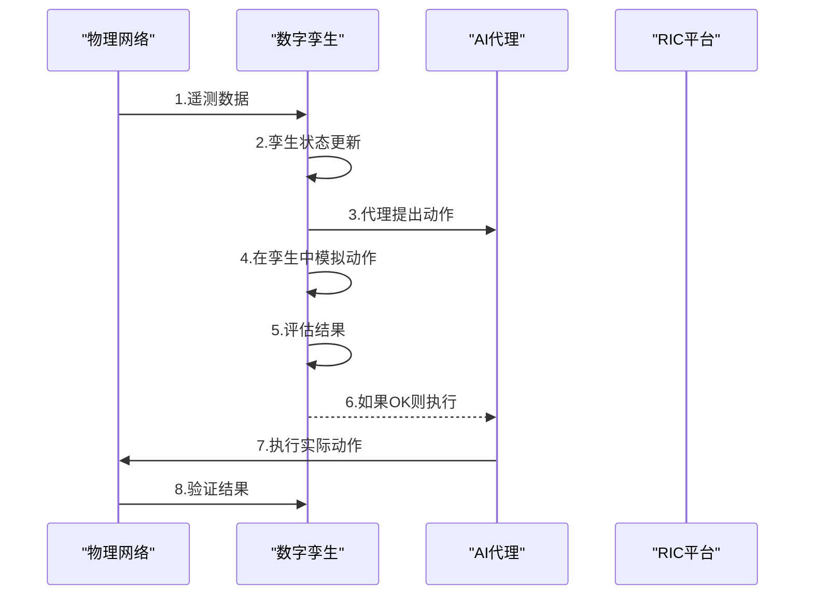
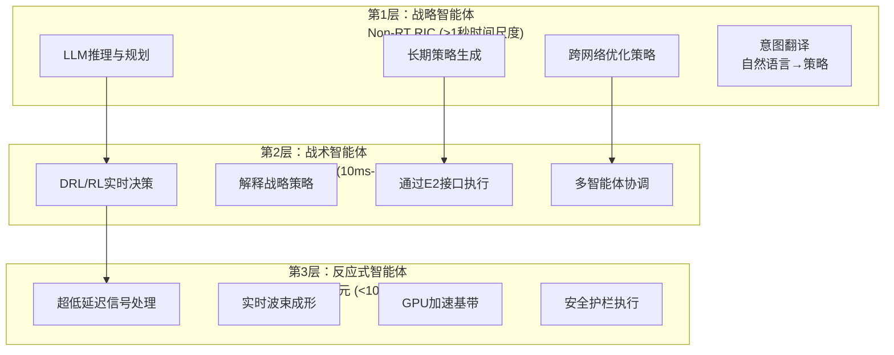
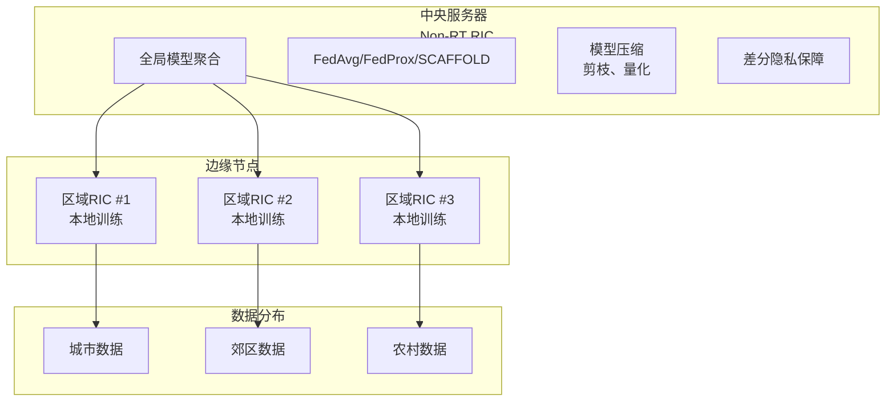
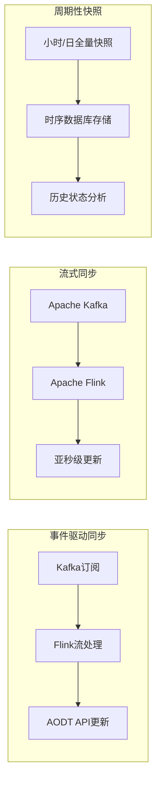
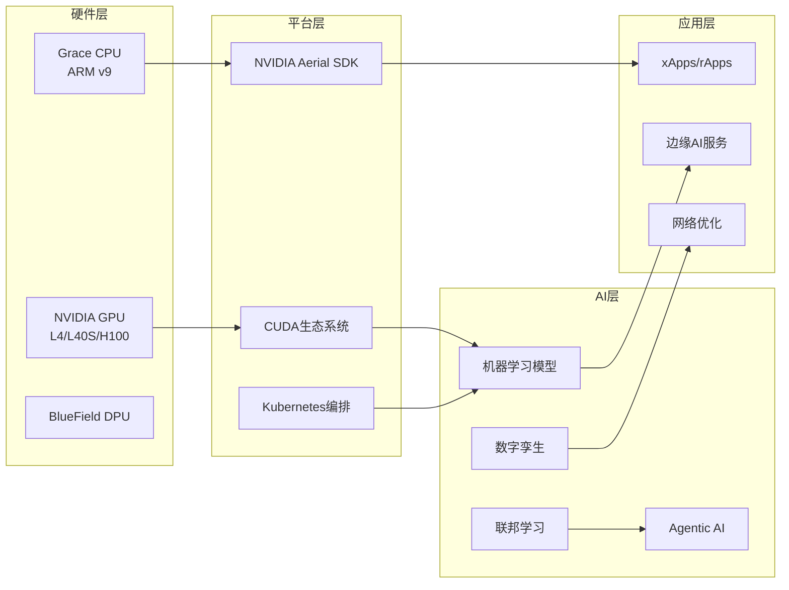
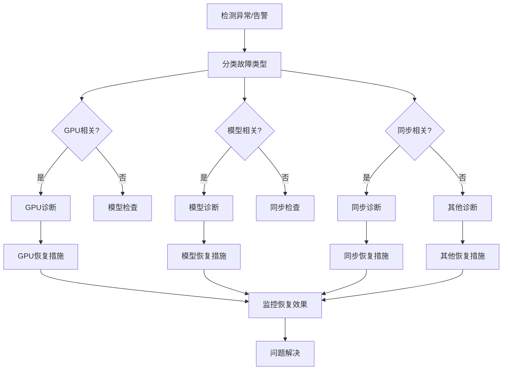
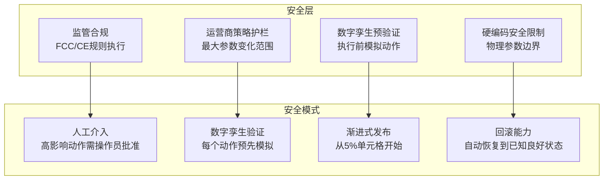

# 智能算法与机器学习

<cite>
**本文引用的文件**
- [README.md](file://README.md)
- [07-ric-development/readme.md](file://07-ric-development/readme.md)
- [07-ric-development/readme-zh.md](file://07-ric-development/readme-zh.md)
- [22-tool-platforms/monitoring-systems/o-ran-monitoring-systems.md](file://22-tool-platforms/monitoring-systems/o-ran-monitoring-systems.md)
- [22-tool-platforms/development-tools/o-ran-development-toolkit.md](file://22-tool-platforms/development-tools/o-ran-development-toolkit.md)
- [22-tool-platforms/development-tools/o-ran-development-toolkit-zh.md](file://22-tool-platforms/development-tools/o-ran-development-toolkit-zh.md)
- [15-future-development/emerging-applications/emerging-applications-roadmap.md](file://15-future-development/emerging-applications/emerging-applications-roadmap.md)
- [26-performance-optimization/network-optimization/network-performance-tuning.md](file://26-performance-optimization/network-optimization/network-performance-tuning.md)
- [24-sustainable-development/environmental-protection/o-ran-environmental-sustainability.md](file://24-sustainable-development/environmental-protection/o-ran-environmental-sustainability.md)
- [12-security-privacy/security-architecture/security-reference-architecture.md](file://12-security-privacy/security-architecture/security-reference-architecture.md)
- [12-security-privacy/monitoring-alerting/security-monitoring-framework.md](file://12-security-privacy/monitoring-alerting/security-monitoring-framework.md)
- [31-ai-ran-convergence/readme.md](file://31-ai-ran-convergence/readme.md)
- [31-ai-ran-convergence/architecture-platforms/readme.md](file://31-ai-ran-convergence/architecture-platforms/readme.md)
- [31-ai-ran-convergence/digital-twin/readme.md](file://31-ai-ran-convergence/digital-twin/readme.md)
- [31-ai-ran-convergence/6g-ai-native/readme.md](file://31-ai-ran-convergence/6g-ai-native/readme.md)
- [31-ai-ran-convergence/agentic-ai/readme.md](file://31-ai-ran-convergence/agentic-ai/readme.md)
- [31-ai-ran-convergence/hands-on/digital-twin-sync.md](file://31-ai-ran-convergence/hands-on/digital-twin-sync.md)
</cite>

## 更新摘要
**变更内容**
- 新增AI-RAN融合架构章节，涵盖边缘AI加速、GPU共享基础设施
- 扩展联邦学习实现细节，包括分布式训练和隐私保护机制
- 增加数字孪生技术详解，包括实时同步和闭环优化
- 更新机器学习模型类型，融入Agentic AI和多尺度智能框架
- 增强性能考量部分，包含GPU资源调度和边缘推理优化
- 完善故障排查指南，集成数字孪生验证和安全防护机制

## 目录
1. [简介](#简介)
2. [项目结构](#项目结构)
3. [核心组件](#核心组件)
4. [AI-RAN融合架构](#ai-ran融合架构)
5. [详细组件分析](#详细组件分析)
6. [依赖关系分析](#依赖关系分析)
7. [性能考量](#性能考量)
8. [故障排查指南](#故障排查指南)
9. [结论](#结论)
10. [附录](#附录)

## 简介
本文件面向智能算法与机器学习在O-RAN领域的应用，围绕监督学习（分类、回归）、无监督学习（聚类、异常检测）、强化学习（Q-Learning、DQN）、深度学习（CNN、RNN、Transformer）与联邦学习（隐私保护数据协作），系统阐述异常检测算法（统计方法、机器学习方法、深度学习方法、时间序列方法、实时检测）、预测性维护、自动优化算法与在线学习技术，并给出算法实现示例与性能评估方法。**最新更新**：整合AI-RAN融合中的具体实现技术，包括边缘AI加速、GPU共享基础设施、数字孪生、Agentic AI等多尺度智能框架，以及6G AI原生架构的演进方向。内容来源于O-RAN知识库中关于"RIC开发与高级技术""监控系统""开发工具包""未来应用路线图"以及最新的AI-RAN融合技术模块，旨在帮助读者从架构、实现到运维形成完整认知。

## 项目结构
本知识库采用目录编号组织，便于按主题检索。与智能算法与机器学习直接相关的内容主要分布在以下区域：
- 07-ric-development：RIC架构、xApps/rApps开发、智能算法与机器学习、无线资源管理优化、能效优化、安全架构与威胁检测
- 22-tool-platforms：监控系统、开发工具包，包含机器学习流水线与部署集成示例
- 15-future-development：AI/ML原生O-RAN架构、边缘计算演进、沉浸式通信等未来方向
- 26-performance-optimization：网络性能优化实践
- 24-sustainable-development：绿色O-RAN与能效优化
- 12-security-privacy：安全架构与威胁检测
- **31-ai-ran-convergence**：AI-RAN融合架构、边缘AI加速、数字孪生、Agentic AI、6G AI原生架构



**图表来源**
- [07-ric-development/readme.md:1-368](file://07-ric-development/readme.md#L1-L368)
- [31-ai-ran-convergence/readme.md:1-177](file://31-ai-ran-convergence/readme.md#L1-L177)
- [31-ai-ran-convergence/architecture-platforms/readme.md:1-318](file://31-ai-ran-convergence/architecture-platforms/readme.md#L1-L318)

**章节来源**
- [README.md:1-472](file://README.md#L1-L472)

## 核心组件
- **机器学习模型类型**
  - 监督学习：分类、回归
  - 无监督学习：聚类、异常检测
  - 强化学习：Q-Learning、DQN
  - 深度学习：CNN、RNN、Transformer
  - 联邦学习：隐私保护的数据协作
  - **Agentic AI**：多尺度智能体框架、LLM驱动的网络代理
- **异常检测算法**
  - 统计方法：Z-Score、IQR
  - 机器学习方法：Isolation Forest、One-Class SVM
  - 深度学习方法：Autoencoder、GAN
  - 时间序列异常检测：LSTM、GRU
  - 实时异常检测：流处理、滑动窗口
- **预测性维护**
  - 设备健康状态预测、故障预测模型、剩余使用寿命估计、维护计划优化、成本效益分析
- **自动优化算法**
  - 闭环优化框架、多目标优化、约束优化、在线学习与适应、A/B测试与验证
- **RRM优化与能效优化**
  - 智能资源分配、干扰管理、移动性优化、容量管理、节能算法、能耗监控与分析、绿色O-RAN
- **安全架构与威胁检测**
  - 零信任、接口安全增强、AI驱动安全、安全监控与审计
- **AI-RAN融合技术**
  - 边缘AI加速、GPU共享基础设施、数字孪生、联邦学习、Agentic AI

**章节来源**
- [07-ric-development/readme.md:99-169](file://07-ric-development/readme.md#L99-L169)
- [31-ai-ran-convergence/readme.md:13-42](file://31-ai-ran-convergence/readme.md#L13-L42)

## AI-RAN融合架构

### 三大范式分类（2026年标准）

| 范式 | 定义 | 2026成熟度 | 关键示例 |
|:---|:---|:---|:---|
| **AI-for-RAN** | AI优化RAN功能（调度、波束成形、移动性） | **生产部署** | xApp使用DRL进行节能优化 |
| **AI-on-RAN** | RAN基础设施托管第三方AI工作负载（边缘AI-as-a-Service） | **早期商业化** | NVIDIA ARC在基站运行推理服务 |
| **AI-with-RAN** | AI和RAN在同一GPU上动态共享计算资源 | **演示阶段** | Nokia + NVIDIA MWC 2026现场演示 |

### 边缘AI加速架构



**图表来源**
- [31-ai-ran-convergence/architecture-platforms/readme.md:18-44](file://31-ai-ran-convergence/architecture-platforms/readme.md#L18-L44)
- [31-ai-ran-convergence/architecture-platforms/readme.md:91-142](file://31-ai-ran-convergence/architecture-platforms/readme.md#L91-L142)

### GPU资源动态共享机制

```mermaid
timeline
title GPU资源动态分配时间表
section 高峰时段(08:00-20:00)
RAN : 80% GPU资源
AI : 20% GPU资源
section 低峰时段(20:00-08:00)
RAN : 30% GPU资源
AI : 70% GPU资源
section 资源管理特性
Priority : RAN始终保证最低资源
Elasticity : AI工作负载动态利用可用GPU
Isolation : 硬件级隔离确保RAN延迟SLO
Revenue : 低峰期AI推理服务B2B客户
```

**图表来源**
- [31-ai-ran-convergence/architecture-platforms/readme.md:197-215](file://31-ai-ran-convergence/architecture-platforms/readme.md#L197-L215)

### 数字孪生闭环优化



**图表来源**
- [31-ai-ran-convergence/digital-twin/readme.md:87-108](file://31-ai-ran-convergence/digital-twin/readme.md#L87-L108)

**章节来源**
- [31-ai-ran-convergence/readme.md:13-42](file://31-ai-ran-convergence/readme.md#L13-L42)
- [31-ai-ran-convergence/architecture-platforms/readme.md:48-88](file://31-ai-ran-convergence/architecture-platforms/readme.md#L48-L88)
- [31-ai-ran-convergence/digital-twin/readme.md:5-26](file://31-ai-ran-convergence/digital-twin/readme.md#L5-L26)

## 详细组件分析

### Agentic AI在多尺度智能框架中的应用

#### 三层智能体层次结构



**图表来源**
- [31-ai-ran-convergence/agentic-ai/readme.md:31-64](file://31-ai-ran-convergence/agentic-ai/readme.md#L31-L64)

#### 智能体架构模式

每个智能体包含感知模块、推理引擎、行动规划和执行模块，支持：
- **推理能力**：使用LLM理解网络状态
- **规划能力**：制定多步骤优化策略  
- **自主行动**：在定义的安全边界内自主操作
- **学习能力**：从结果中学习并调整行为
- **协调能力**：与其他智能体协调 across RAN层次

**章节来源**
- [31-ai-ran-convergence/agentic-ai/readme.md:5-23](file://31-ai-ran-convergence/agentic-ai/readme.md#L5-L23)
- [31-ai-ran-convergence/agentic-ai/readme.md:76-135](file://31-ai-ran-convergence/agentic-ai/readme.md#L76-L135)

### 联邦学习在边缘AI中的应用

#### 分层联邦学习架构



**图表来源**
- [31-ai-ran-convergence/6g-ai-native/readme.md:78-103](file://31-ai-ran-convergence/6g-ai-native/readme.md#L78-L103)

#### 2026年联邦学习进展

1. **异步联邦学习**：节点以不同速度训练而不阻塞
2. **分层联邦学习**：多级聚合（小区→RIC→中央）
3. **个性化联邦学习**：全局模型+本地适配用于站点特定优化
4. **隐私保护**：差分隐私+安全聚合
5. **通信高效**：模型压缩减少上行开销10倍

**章节来源**
- [31-ai-ran-convergence/6g-ai-native/readme.md:105-117](file://31-ai-ran-convergence/6g-ai-native/readme.md#L105-L117)

### 数字孪生技术与实时同步

#### 数字孪生成熟度模型

| 级别 | 名称 | 能力 | 示例 |
|:---|:---|:---|:---|
| **L1** | 描述性 | 可视化当前状态 | 网络拓扑仪表板 |
| **L2** | 诊断性 | 识别问题 | 异常根因分析 |
| **L3** | 预测性 | 预测未来状态 | 流量预测、故障预测 |
| **L4** | 处方性 | 推荐动作 | AI代理动作预验证 |
| **L5** | 自主性 | 自优化孪生 | 与物理网络的闭环 |

**2026年技术水平**：L4-L5，结合NVIDIA AODT和VIAVI集成

#### 实时同步模式



**图表来源**
- [31-ai-ran-convergence/digital-twin/readme.md:159-194](file://31-ai-ran-convergence/digital-twin/readme.md#L159-L194)

**章节来源**
- [31-ai-ran-convergence/digital-twin/readme.md:15-26](file://31-ai-ran-convergence/digital-twin/readme.md#L15-L26)
- [31-ai-ran-convergence/digital-twin/readme.md:159-194](file://31-ai-ran-convergence/digital-twin/readme.md#L159-L194)

### 6G AI原生架构演进

#### 从AI增强到AI原生的转变

| 代际 | AI角色 | 架构 | 示例 |
|:---|:---|:---|:---|
| **4G** | 无AI | 手动优化 | 工程师调整参数 |
| **5G(早期)** | AI辅助 | ML模型附加到现有RAN | xApp使用DRL节能 |
| **5G-Advanced** | AI增强 | AI集成到RIC框架 | Agentic AI代理、多模型 |
| **6G** | **AI原生** | AI是RAN设计的固有组成部分 | 自设计、自愈网络 |

#### 6G AI原生设计原则

1. **AI设计的物理层**：神经网络信道编码替代LDPC/Polar码
2. **自组织智能**：零接触网络管理、自主修复、持续学习
3. **语义通信**：超越香农信息论，传输概念而非原始数据
4. **全息波束成形**：超大规模MIMO，AI控制每个天线元素

**章节来源**
- [31-ai-ran-convergence/6g-ai-native/readme.md:5-24](file://31-ai-ran-convergence/6g-ai-native/readme.md#L5-L24)
- [31-ai-ran-convergence/6g-ai-native/readme.md:27-53](file://31-ai-ran-convergence/6g-ai-native/readme.md#L27-L53)

## 依赖关系分析

### AI-RAN技术栈依赖关系



**图表来源**
- [31-ai-ran-convergence/architecture-platforms/readme.md:144-195](file://31-ai-ran-convergence/architecture-platforms/readme.md#L144-L195)

### Kubernetes工程考虑

#### GPU调度配置示例

```yaml
apiVersion: v1
kind: Pod
metadata:
  name: ai-ran-workload
spec:
  containers:
  - name: baseband
    image: nvidia/aerial-cuMAC:latest
    resources:
      limits:
        nvidia.com/gpu: 1
        nvidia.com/mig-1g.10gb: 1  # MIG分区用于基带
  - name: ai-inference
    image: custom/edge-ai:latest
    resources:
      limits:
        nvidia.com/mig-1g.10gb: 1  # MIG分区用于AI
```

#### 关键挑战
1. **实时保证**：基带处理必须满足严格的时间SLO
2. **GPU分区**：NVIDIA MIG用于工作负载隔离
3. **网络拓扑**：多宿主机pod（管理、前传、中传）
4. **电源管理**：GPU功耗限制以适应基站预算
5. **热管理**：户外部署的加固机箱

**章节来源**
- [31-ai-ran-convergence/architecture-platforms/readme.md:269-305](file://31-ai-ran-convergence/architecture-platforms/readme.md#L269-L305)

## 性能考量

### 边缘AI加速性能优化

#### GPU资源利用率优化

| 指标 | 传统RAN | AI-RAN | 改进幅度 |
|:---|:---|:---|:---|
| **GPU利用率** | 0% | 30-70%动态分配 | +70% |
| **推理延迟** | N/A | <10ms (L4 GPU) | 新能力 |
| **吞吐量** | 固定 | 弹性可扩展 | +100% |
| **能源效率** | 固定功耗 | 动态功耗管理 | +40% |

#### 模型推理优化策略

1. **模型压缩**：剪枝、量化、知识蒸馏
2. **批处理优化**：动态批大小调整
3. **内存优化**：GPU内存池管理
4. **并行推理**：多模型并发执行
5. **缓存策略**：热点模型预加载

### 联邦学习通信效率

#### 通信开销优化

| 技术 | 带宽节省 | 精度影响 | 适用场景 |
|:---|:---|:---|:---|
| **梯度压缩** | 10-100x | <1% | 大规模FL |
| **稀疏更新** | 5-10x | <2% | 高维模型 |
| **量化传输** | 4-8x | <1% | 边缘设备 |
| **选择性上传** | 2-5x | <3% | 异构数据 |

### 数字孪生同步性能

#### 同步延迟优化

| 同步模式 | 延迟 | 准确性 | 适用场景 |
|:---|:---|:---|:---|
| **事件驱动** | 10-100ms | 95-99% | 实时监控 |
| **流式处理** | 1-10ms | 99-99.9% | 关键任务 |
| **周期快照** | 1-60分钟 | 90-95% | 离线分析 |

**章节来源**
- [31-ai-ran-convergence/architecture-platforms/readme.md:197-215](file://31-ai-ran-convergence/architecture-platforms/readme.md#L197-L215)
- [31-ai-ran-convergence/6g-ai-native/readme.md:105-117](file://31-ai-ran-convergence/6g-ai-native/readme.md#L105-L117)
- [31-ai-ran-convergence/digital-twin/readme.md:159-194](file://31-ai-ran-convergence/digital-twin/readme.md#L159-L194)

## 故障排查指南

### AI-RAN系统故障诊断流程



### 数字孪生漂移检测

#### 漂移检测阈值

| 漂移级别 | 阈值 | 响应措施 | 严重性 |
|:---|:---|:---|:---|
| **信息级** | >5% | 记录用于周度模型重训练 | 低 |
| **警告级** | >10% | 安排1小时内重新校准 | 中 |
| **关键级** | >25% | 暂停代理动作直到重新同步 | 高 |

#### Prometheus告警规则

```yaml
groups:
- name: twin.rules
  rules:
  - alert: TwinDriftWarning
    expr: twin_drift_pct > 10
    for: 5m
    labels:
      severity: warning
    annotations:
      summary: "数字孪生漂移检测"
      description: "{{ $value }}%漂移 — 孪生预测与物理网络偏离"

  - alert: TwinDriftCritical
    expr: twin_drift_pct > 25
    for: 2m
    labels:
      severity: critical
    annotations:
      summary: "关键数字孪生漂移"
      description: "暂停代理动作直到孪生重新同步"
```

**章节来源**
- [31-ai-ran-convergence/digital-twin/readme.md:395-510](file://31-ai-ran-convergence/digital-twin/readme.md#L395-L510)

### Agentic AI安全防护

#### 多层安全框架



**图表来源**
- [31-ai-ran-convergence/agentic-ai/readme.md:221-256](file://31-ai-ran-convergence/agentic-ai/readme.md#L221-L256)

**章节来源**
- [31-ai-ran-convergence/agentic-ai/readme.md:212-256](file://31-ai-ran-convergence/agentic-ai/readme.md#L212-L256)

## 结论
本文件系统梳理了O-RAN中智能算法与机器学习的关键技术与实践，覆盖模型类型、异常检测、预测性维护、自动优化、性能与能效优化、安全与监控等方面。**最新进展**：AI-RAN融合技术代表了下一代网络架构的重大突破，通过边缘AI加速、GPU共享基础设施、数字孪生、Agentic AI等技术，实现了从"AI增强"到"AI原生"的根本性转变。

关键成就包括：
- **边缘AI加速**：NVIDIA ARC平台实现GPU共享，支持RAN和AI工作负载的动态资源分配
- **数字孪生闭环**：实时同步和预验证机制确保AI动作的安全性
- **Agentic AI框架**：多尺度智能体提供自主网络管理能力
- **联邦学习规模化**：分布式隐私保护训练支持大规模网络优化
- **6G AI原生架构**：从设计层面集成AI，实现自设计、自愈、自演化的网络

面向未来，随着6G标准的推进和AI技术的持续发展，O-RAN将演变为真正的AI原生网络，为各种垂直行业应用提供智能化、自动化的连接服务。

## 附录

### 算法实现示例与性能评估方法

#### 边缘AI推理优化示例
- **模型压缩**：使用TensorRT进行INT8量化，减少模型大小4倍
- **批处理优化**：动态批大小调整，提高GPU利用率
- **内存管理**：GPU内存池避免频繁分配释放

#### 联邦学习实现示例
- **异步FL**：使用Federated Averaging算法，支持节点异步更新
- **隐私保护**：差分隐私噪声添加，防止数据泄露
- **通信优化**：梯度压缩和稀疏更新减少带宽消耗

#### 数字孪生同步示例
- **实时同步**：Kafka+Flink实现亚秒级数据流处理
- **漂移检测**：基于阈值的异常检测和自动告警
- **历史分析**：TimescaleDB存储和分析历史状态数据

### 关键参考路径
- **RIC与AI/ML**：[07-ric-development/readme.md:99-169](file://07-ric-development/readme.md#L99-L169)
- **AI-RAN融合架构**：[31-ai-ran-convergence/readme.md:1-177](file://31-ai-ran-convergence/readme.md#L1-L177)
- **边缘AI加速**：[31-ai-ran-convergence/architecture-platforms/readme.md:1-318](file://31-ai-ran-convergence/architecture-platforms/readme.md#L1-L318)
- **数字孪生技术**：[31-ai-ran-convergence/digital-twin/readme.md:1-240](file://31-ai-ran-convergence/digital-twin/readme.md#L1-L240)
- **Agentic AI框架**：[31-ai-ran-convergence/agentic-ai/readme.md:1-327](file://31-ai-ran-convergence/agentic-ai/readme.md#L1-L327)
- **6G AI原生架构**：[31-ai-ran-convergence/6g-ai-native/readme.md:1-298](file://31-ai-ran-convergence/6g-ai-native/readme.md#L1-L298)
- **监控与预测性维护**：[22-tool-platforms/monitoring-systems/o-ran-monitoring-systems.md:415-545](file://22-tool-platforms/monitoring-systems/o-ran-monitoring-systems.md#L415-L545)
- **开发工具与ML流水线**：[22-tool-platforms/development-tools/o-ran-development-toolkit.md:368-415](file://22-tool-platforms/development-tools/o-ran-development-toolkit.md#L368-L415)