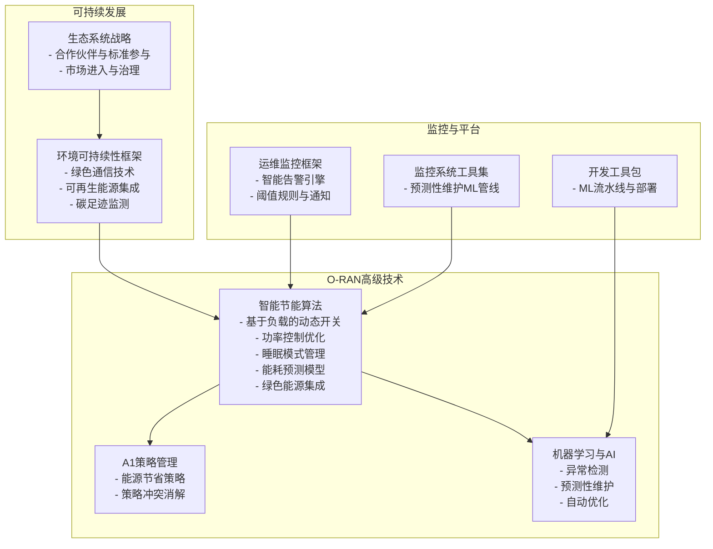
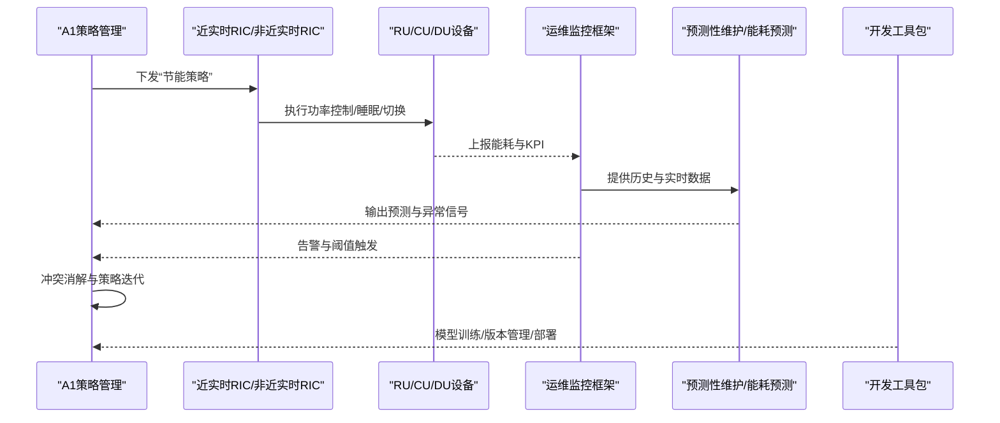
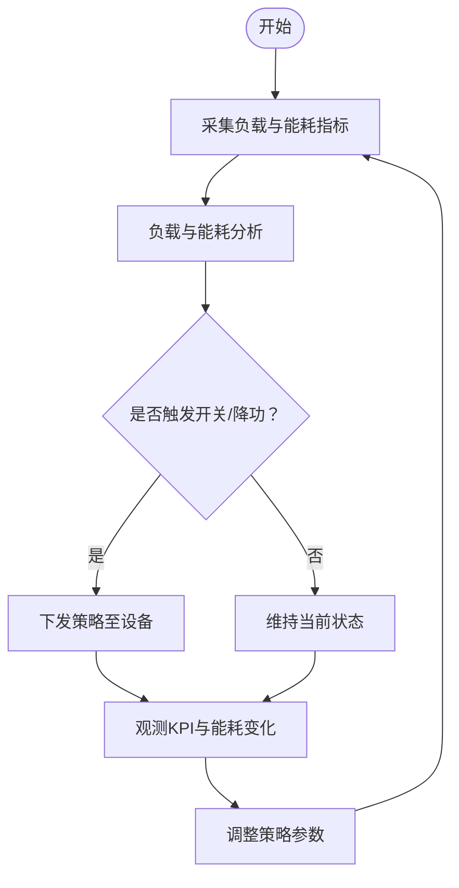
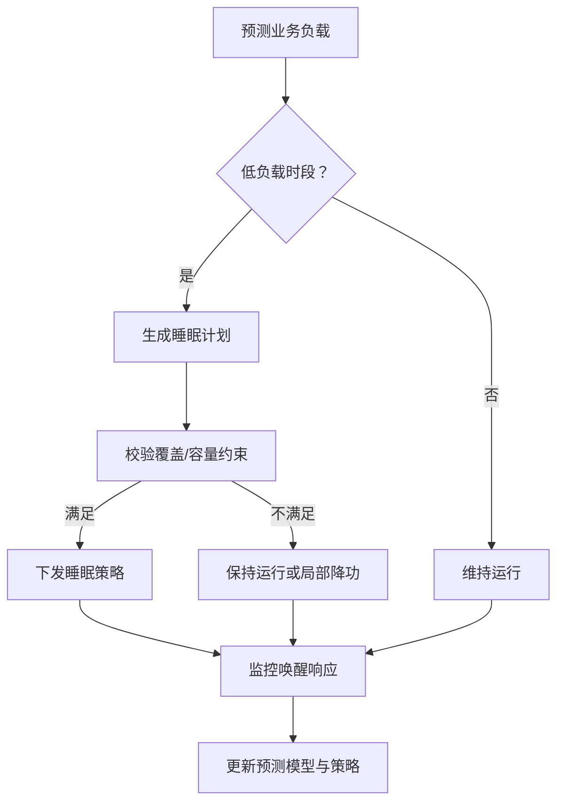
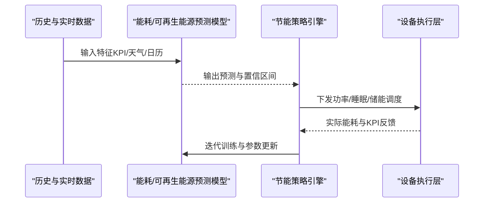
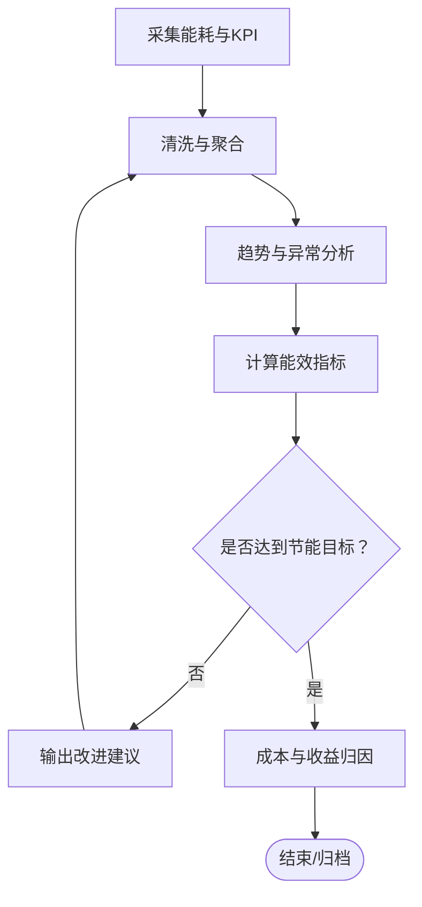
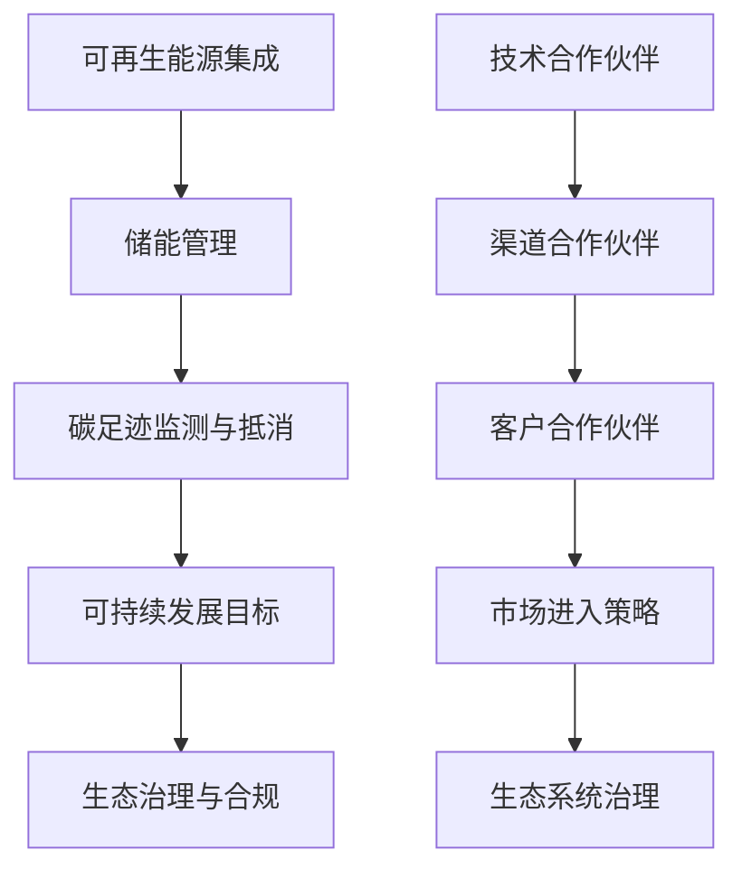
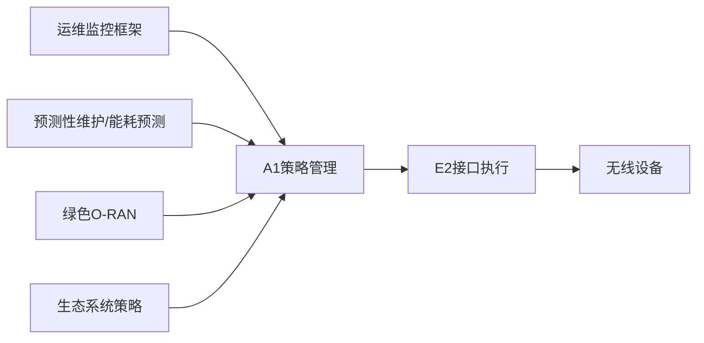

# 能源效率优化

<cite>
**本文引用的文件**
- [O-RAN高级技术总览](file://07-ric-development/readme.md)
- [O-RAN环境可持续性框架](file://24-sustainable-development/environmental-protection/o-ran-environmental-sustainability.md)
- [O-RAN生态系统战略框架](file://24-sustainable-development/readme.md)
- [O-RAN生态系统战略（中文）](file://20-ecosystem-partnership/ecosystem-strategy/o-ran-ecosystem-strategy-zh.md)
- [O-RAN运维监控框架](file://14-operations-management/monitoring-alerting/operations-monitoring-framework.md)
- [O-RAN监控系统工具集](file://22-tool-platforms/monitoring-systems/o-ran-monitoring-systems.md)
- [O-RAN开发工具包](file://22-tool-platforms/development-tools/o-ran-development-toolkit.md)
- [O-RAN专利清单（可再生能源与碳足迹）](file://comprehensive-oran-patent-table.md)
</cite>

## 目录
1. [引言](#引言)
2. [项目结构](#项目结构)
3. [核心组件](#核心组件)
4. [架构总览](#架构总览)
5. [详细组件分析](#详细组件分析)
6. [依赖分析](#依赖分析)
7. [性能考虑](#性能考虑)
8. [故障排查指南](#故障排查指南)
9. [结论](#结论)
10. [附录](#附录)

## 引言
本文件围绕O-RAN网络的能源效率优化，系统阐述智能节能算法与绿色O-RAN理念的落地路径，涵盖基于负载的动态开关、功率控制优化、睡眠模式管理、能耗预测模型、绿色能源集成与储能管理；同时给出能耗监测与分析体系，包括实时能耗监测、趋势分析、能效指标、节能效果评估与成本分析方法，并结合生态与合规视角提出可持续发展战略与实施建议。

## 项目结构
本知识库将“能源效率优化”置于O-RAN高级技术与可持续发展两大主题之下，形成从算法到平台、从监控到生态的闭环支撑体系。

**图表来源**
- [O-RAN高级技术总览](file://07-ric-development/readme.md#L151-L169)
- [O-RAN环境可持续性框架](file://24-sustainable-development/environmental-protection/o-ran-environmental-sustainability.md#L8-L50)
- [O-RAN生态系统战略（中文）](file://20-ecosystem-partnership/ecosystem-strategy/o-ran-ecosystem-strategy-zh.md#L50-L92)
- [O-RAN运维监控框架](file://14-operations-management/monitoring-alerting/operations-monitoring-framework.md#L264-L346)
- [O-RAN监控系统工具集](file://22-tool-platforms/monitoring-systems/o-ran-monitoring-systems.md#L415-L485)
- [O-RAN开发工具包](file://22-tool-platforms/development-tools/o-ran-development-toolkit.md#L368-L415)

**章节来源**
- [O-RAN高级技术总览](file://07-ric-development/readme.md#L1-L368)
- [O-RAN环境可持续性框架](file://24-sustainable-development/environmental-protection/o-ran-environmental-sustainability.md#L1-L285)
- [O-RAN生态系统战略（中文）](file://20-ecosystem-partnership/ecosystem-strategy/o-ran-ecosystem-strategy-zh.md#L1-L189)

## 核心组件
- 智能节能算法（基于A1策略与RIC）
  - 基于负载的动态开关：站点/设备/子系统的按需启停与协同调度
  - 功率控制优化：发射功率、接收灵敏度与链路预算的闭环优化
  - 睡眠模式管理：覆盖与容量协同下的睡眠窗口规划与唤醒策略
  - 能耗预测模型：面向KPI与负载的能耗趋势预测
  - 绿色能源集成：可再生能源与储能的协同调度与削峰填谷
- 能耗监测与分析
  - 实时能耗监测：采集与聚合关键能耗指标
  - 趋势分析：日/周/月能耗变化与异常识别
  - 能效指标：单位数据传输能耗、PUE、可再生能源占比等
  - 节能效果评估：基线对比、归因分析与ROI量化
  - 成本分析：电力成本、设备折旧、运维成本与碳成本
- 绿色O-RAN
  - 可再生能源集成：屋顶光伏、小型风电、混合微网
  - 储能管理：电池系统、削峰填谷与黑启动能力
  - 碳足迹优化：全生命周期碳排放监测与抵消
  - 可持续发展战略：零碳运营、循环经济发展与生态治理
  - 环境合规：国际与区域标准对接与披露

**章节来源**
- [O-RAN高级技术总览](file://07-ric-development/readme.md#L151-L169)
- [O-RAN环境可持续性框架](file://24-sustainable-development/environmental-protection/o-ran-environmental-sustainability.md#L8-L50)
- [O-RAN生态系统战略（中文）](file://20-ecosystem-partnership/ecosystem-strategy/o-ran-ecosystem-strategy-zh.md#L115-L142)

## 架构总览
下图展示了从策略生成、执行、监控到反馈优化的闭环路径，以及与监控平台、预测性维护与开发工具的协同关系。

**图表来源**
- [O-RAN高级技术总览](file://07-ric-development/readme.md#L79-L97)
- [O-RAN运维监控框架](file://14-operations-management/monitoring-alerting/operations-monitoring-framework.md#L264-L346)
- [O-RAN监控系统工具集](file://22-tool-platforms/monitoring-systems/o-ran-monitoring-systems.md#L415-L485)
- [O-RAN开发工具包](file://22-tool-platforms/development-tools/o-ran-development-toolkit.md#L368-L415)

## 详细组件分析

### 组件A：基于负载的动态开关与功率控制优化
- 关键点
  - 负载感知：以吞吐量、用户数、信道质量等指标驱动开关
  - 功率优化：发射功率、接收门限与链路预算的联合优化
  - 协同调度：跨站点/子系统的负载均衡与覆盖协同
- 实施要点
  - 将“负载-能耗-容量”映射为策略参数空间
  - 通过A1策略下发与E2接口反馈形成闭环
  - 结合预测模型设置动态阈值与窗口边界
- 效果评估
  - 能耗下降率、容量保障率、QoS达标率、单位数据能耗

**图表来源**
- [O-RAN高级技术总览](file://07-ric-development/readme.md#L125-L149)
- [O-RAN运维监控框架](file://14-operations-management/monitoring-alerting/operations-monitoring-framework.md#L348-L374)

**章节来源**
- [O-RAN高级技术总览](file://07-ric-development/readme.md#L125-L149)

### 组件B：睡眠模式管理与网络级协调
- 关键点
  - 站点睡眠：基于流量预测与覆盖需求的站点/扇区休眠
  - 设备级省电：BBU/RU模块的智能关断与自适应供电
  - 网络级协调：跨小区负载平衡与覆盖协同
- 实施要点
  - 机器学习预测未来时段的业务需求
  - 与A1策略联动，确保覆盖与容量安全边界
  - 与预测性维护结合，避免在故障高发时段睡眠
- 效果评估
  - 睡眠覆盖率、唤醒成功率、覆盖盲区率、能耗节省

**图表来源**
- [O-RAN高级技术总览](file://07-ric-development/readme.md#L151-L169)
- [O-RAN监控系统工具集](file://22-tool-platforms/monitoring-systems/o-ran-monitoring-systems.md#L415-L485)

**章节来源**
- [O-RAN高级技术总览](file://07-ric-development/readme.md#L151-L169)

### 组件C：能耗预测模型与绿色能源集成
- 关键点
  - 能耗预测：基于历史KPI、天气、节假日、业务模型的时序预测
  - 绿色能源：太阳能/风能出力预测与调度
  - 削峰填谷：储能充放电策略与电网互动
- 实施要点
  - 使用时间序列与深度学习模型进行多步预测
  - 将预测结果作为策略输入，动态调整功率与睡眠窗口
  - 与A1策略冲突消解机制配合，确保安全优先
- 效果评估
  - 预测精度（MAPE/RMSE）、可再生能源利用率、碳减排量、储能寿命

**图表来源**
- [O-RAN监控系统工具集](file://22-tool-platforms/monitoring-systems/o-ran-monitoring-systems.md#L415-L485)
- [O-RAN开发工具包](file://22-tool-platforms/development-tools/o-ran-development-toolkit.md#L368-L415)

**章节来源**
- [O-RAN监控系统工具集](file://22-tool-platforms/monitoring-systems/o-ran-monitoring-systems.md#L415-L485)
- [O-RAN开发工具包](file://22-tool-platforms/development-tools/o-ran-development-toolkit.md#L368-L415)

### 组件D：能耗监测与分析（实时、趋势、指标、评估、成本）
- 实时监测
  - 采集能耗、KPI、环境参数，统一上报与聚合
- 趋势分析
  - 日/周/月能耗变化、异常检测与根因定位
- 能效指标
  - 单位数据能耗、PUE、可再生能源占比、能效提升率
- 节能效果评估
  - 基线对比、归因分析（策略/天气/负载）、ROI量化
- 成本分析
  - 电力成本、设备折旧、运维成本、碳成本与抵消

**图表来源**
- [O-RAN运维监控框架](file://14-operations-management/monitoring-alerting/operations-monitoring-framework.md#L264-L346)

**章节来源**
- [O-RAN运维监控框架](file://14-operations-management/monitoring-alerting/operations-monitoring-framework.md#L264-L346)

### 组件E：绿色O-RAN与生态治理
- 绿色O-RAN
  - 可再生能源集成：分布式电源与微网
  - 储能管理：削峰填谷、黑启动与应急备用
  - 碳足迹优化：全生命周期核算与抵消
  - 可持续发展：零碳运营、循环经济与生态修复
  - 环境合规：国际与区域标准对接
- 生态系统策略
  - 合作伙伴分类：技术、渠道、客户
  - 市场进入：绿地与棕地策略
  - 治理与风控：标准参与、多元化与合规监控

**图表来源**
- [O-RAN环境可持续性框架](file://24-sustainable-development/environmental-protection/o-ran-environmental-sustainability.md#L8-L50)
- [O-RAN生态系统战略（中文）](file://20-ecosystem-partnership/ecosystem-strategy/o-ran-ecosystem-strategy-zh.md#L50-L92)

**章节来源**
- [O-RAN环境可持续性框架](file://24-sustainable-development/environmental-protection/o-ran-environmental-sustainability.md#L1-L285)
- [O-RAN生态系统战略（中文）](file://20-ecosystem-partnership/ecosystem-strategy/o-ran-ecosystem-strategy-zh.md#L1-L189)

## 依赖分析
- 策略层（A1）与执行层（E2/设备）的耦合度较高，需强化冲突消解与版本管理
- 监控与预测模型依赖高质量的历史数据与特征工程
- 绿色能源集成与储能管理需要与电网/调度系统协同
- 生态系统与标准参与影响技术路线与市场准入

**图表来源**
- [O-RAN高级技术总览](file://07-ric-development/readme.md#L79-L97)
- [O-RAN运维监控框架](file://14-operations-management/monitoring-alerting/operations-monitoring-framework.md#L264-L346)
- [O-RAN监控系统工具集](file://22-tool-platforms/monitoring-systems/o-ran-monitoring-systems.md#L415-L485)
- [O-RAN环境可持续性框架](file://24-sustainable-development/environmental-protection/o-ran-environmental-sustainability.md#L8-L50)
- [O-RAN生态系统战略（中文）](file://20-ecosystem-partnership/ecosystem-strategy/o-ran-ecosystem-strategy-zh.md#L50-L92)

**章节来源**
- [O-RAN高级技术总览](file://07-ric-development/readme.md#L79-L97)
- [O-RAN运维监控框架](file://14-operations-management/monitoring-alerting/operations-monitoring-framework.md#L264-L346)

## 性能考虑
- 策略下发与执行延迟：优化E2消息处理与连接池，减少环路延迟
- 模型推理与训练：边缘侧轻量化模型与云端集中训练相结合
- 监控与告警：阈值规则与去重逻辑，避免告警风暴
- 能源预测：多模型融合与在线增量学习，提高鲁棒性

[本节为通用指导，无需列出具体文件来源]

## 故障排查指南
- 告警规则配置
  - 明确阈值、持续时间与严重级别
  - 区分基础设施、应用、网络、安全与业务类告警
- 告警去重与关联
  - 避免重复告警与误报，结合组件归属与影响范围
- 通知通道与升级
  - 邮件、Slack、PagerDuty等通道分级通知
- 回溯与复盘
  - 记录告警历史、处置过程与根因分析

**章节来源**
- [O-RAN运维监控框架](file://14-operations-management/monitoring-alerting/operations-monitoring-framework.md#L264-L486)

## 结论
通过将A1策略管理、RIC执行、预测性维护与监控平台有机整合，O-RAN可在保证服务质量的前提下实现显著的能耗下降与碳减排。结合绿色能源与储能系统，可进一步提升可再生能源利用率与系统韧性。同时，完善的能耗监测与分析体系、可持续发展战略与合规治理，将为企业带来长期的竞争优势与社会价值。

[本节为总结性内容，无需列出具体文件来源]

## 附录
- 专利与标准参考
  - 可再生能源集成与碳足迹监测相关专利
  - 国际与区域环境标准与行业指南
- 实施建议
  - 分阶段推进：从策略制定、试点部署到规模化推广
  - 建立跨部门协作机制，明确责任与KPI
  - 持续投入研发与生态合作，推动技术与标准演进

**章节来源**
- [O-RAN专利清单（可再生能源与碳足迹）](file://comprehensive-oran-patent-table.md#L125-L136)
- [O-RAN生态系统战略（中文）](file://20-ecosystem-partnership/ecosystem-strategy/o-ran-ecosystem-strategy-zh.md#L115-L142)