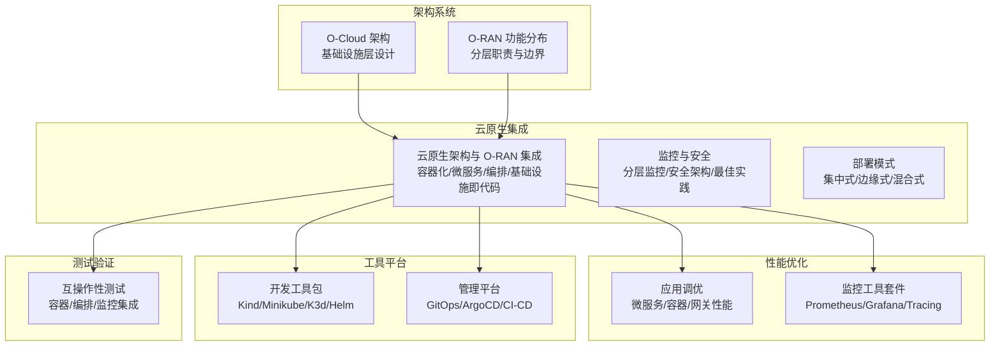
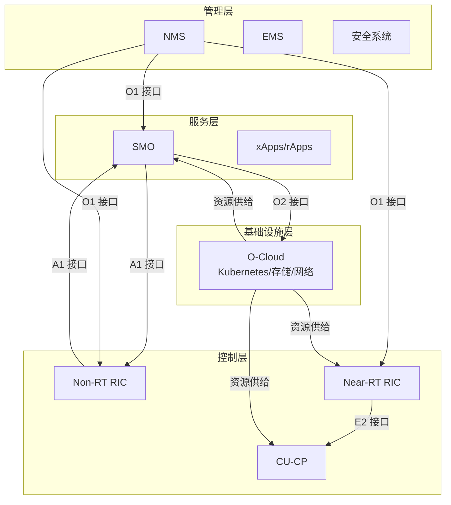
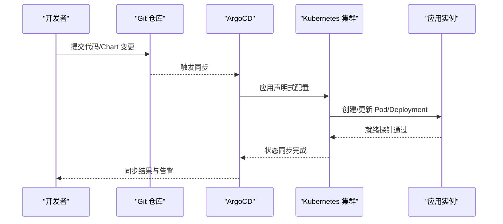
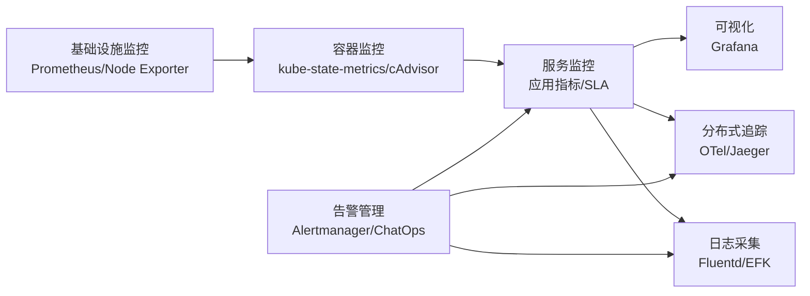
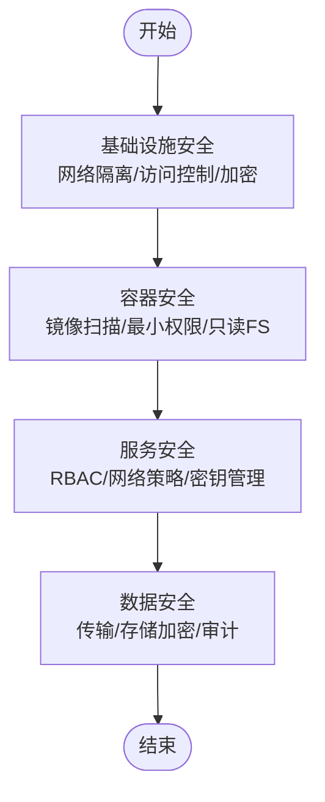
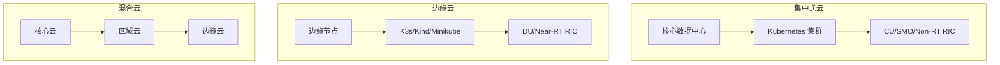
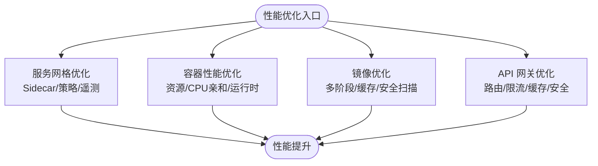
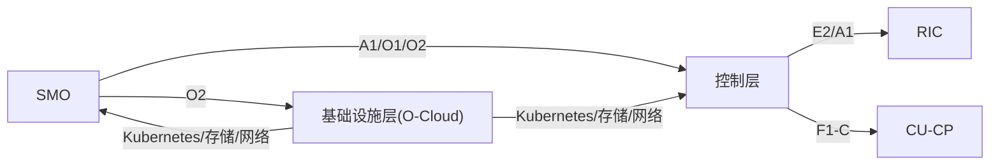
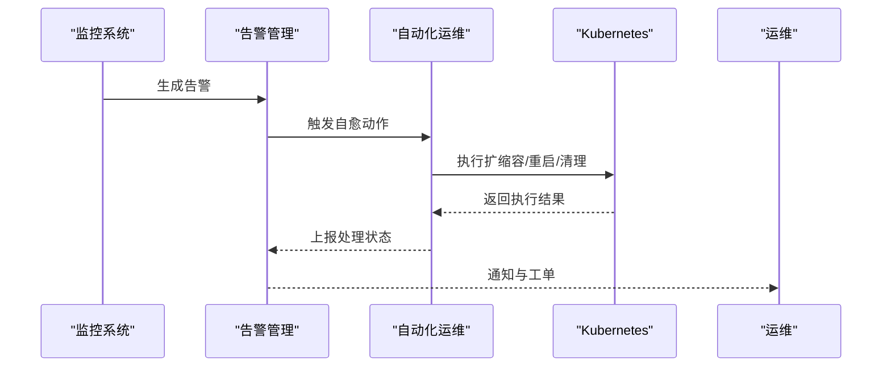

# 云原生架构设计

<cite>
**本文引用的文件**
- [云原生架构与 O-RAN 集成](file://05-cloud-integration/cloud-native-architecture.md)
- [O-Cloud 架构](file://01-architecture-system/o-cloud-architecture.md)
- [O-RAN 功能分布](file://01-architecture-system/functional-distribution.md)
- [O-RAN 监控工具套件](file://28-monitoring-alerting/monitoring-tools/o-ran-monitoring-tools.md)
- [O-RAN 性能优化：应用调优](file://26-performance-optimization/application-tuning/o-ran-application-performance-tuning.md)
- [O-RAN 开发工具包](file://22-tool-platforms/development-tools/o-ran-development-toolkit.md)
- [O-RAN 自动化运维：故障自愈框架](file://14-operations-management/monitoring-alerting/operations-monitoring-framework.md)
- [O-RAN 管理平台：GitOps 与 ArgoCD](file://22-tool-platforms/management-platforms/o-ran-management-platforms.md)
- [O-RAN 互操作性测试](file://13-testing-validation/interoperability/interoperability-testing.md)
</cite>

## 目录
1. [引言](#引言)
2. [项目结构](#项目结构)
3. [核心组件](#核心组件)
4. [架构总览](#架构总览)
5. [详细组件分析](#详细组件分析)
6. [依赖分析](#依赖分析)
7. [性能考虑](#性能考虑)
8. [故障排查指南](#故障排查指南)
9. [结论](#结论)
10. [附录](#附录)

## 引言
本文件围绕 O-RAN 云原生架构设计，系统阐述容器化、微服务、自动化编排与基础设施即代码等关键技术在 O-RAN 中的应用方式与落地要点；说明云原生如何支撑弹性伸缩、高可用与快速部署；给出技术栈选择与配置建议；总结服务拆分、数据管理与安全方面的最佳实践，并提供架构图、部署示例与性能优化建议，帮助读者在真实网络中实现 O-RAN 的现代化与智能化。

## 项目结构
本仓库围绕 O-RAN 的“四层”架构与云原生集成，形成如下主题化文档集合：
- 架构系统：O-Cloud 基础设施层、功能分布与分层职责
- 云原生集成：云原生架构与 O-RAN 的融合、监控与安全、部署模式
- 性能优化：应用调优、监控工具与自动化运维
- 工具平台：开发工具、管理平台与 GitOps
- 测试验证：互操作性测试与自动化验证

**章节来源**
- file://05-cloud-integration/cloud-native-architecture.md#L1-L481
- file://01-architecture-system/o-cloud-architecture.md#L1-L238
- file://01-architecture-system/functional-distribution.md#L1-L325
- file://28-monitoring-alerting/monitoring-tools/o-ran-monitoring-tools.md#L1-L186
- file://26-performance-optimization/application-tuning/o-ran-application-performance-tuning.md#L131-L199
- file://22-tool-platforms/development-tools/o-ran-development-toolkit.md#L222-L257
- file://22-tool-platforms/management-platforms/o-ran-management-platforms.md#L534-L616
- file://13-testing-validation/interoperability/interoperability-testing.md#L227-L231

## 核心组件
- 容器化与编排
  - 使用容器封装 CU、DU、RIC、SMO 等功能，实现快速部署与弹性扩缩容
  - 基于 Kubernetes 的编排平台，实现服务发现、自动扩缩容与自愈
- 微服务架构
  - 将 RIC、SMO 等功能拆分为独立微服务，支持独立升级与扩展
  - 通过 API 网关与服务网格实现服务治理与可观测性
- 基础设施即代码
  - 使用 Terraform/Ansible 管理基础设施，实现环境一致性与自动化
- 监控与安全
  - 分层监控体系（基础设施/容器/服务/业务），结合 Prometheus、Grafana、OpenTelemetry
  - 多层次安全（基础设施/容器/服务/数据），强化 RBAC、网络策略与密钥管理

**章节来源**
- file://05-cloud-integration/cloud-native-architecture.md#L9-L64
- file://01-architecture-system/o-cloud-architecture.md#L19-L30
- file://28-monitoring-alerting/monitoring-tools/o-ran-monitoring-tools.md#L6-L31
- file://22-tool-platforms/development-tools/o-ran-development-toolkit.md#L222-L257

## 架构总览
下图展示了 O-RAN 云原生架构的总体关系：服务层（SMO/xApps/rApps）、控制层（Near-RT/Non-RT RIC、CU-CP）、管理层（NMS/EMS/安全）与基础设施层（O-Cloud）通过标准接口协同；云原生技术贯穿其中，实现弹性、可观测与自动化。

**图示来源**
- file://01-architecture-system/functional-distribution.md#L36-L85
- file://01-architecture-system/functional-distribution.md#L129-L137
- file://01-architecture-system/functional-distribution.md#L180-L189
- file://01-architecture-system/o-cloud-architecture.md#L9-L18

**章节来源**
- file://01-architecture-system/functional-distribution.md#L7-L48
- file://01-architecture-system/functional-distribution.md#L49-L93
- file://01-architecture-system/functional-distribution.md#L94-L144
- file://01-architecture-system/functional-distribution.md#L145-L196

## 详细组件分析

### 组件一：云原生编排与弹性伸缩
- 容器化与微服务
  - 将 CU、DU、RIC、SMO 功能容器化，按需独立部署与扩展
  - 微服务拆分遵循单一职责与清晰接口，支持异步/同步通信与服务发现
- 自动化编排
  - 基于 Kubernetes 的滚动更新、蓝绿/金丝雀发布与 HPA/VPA
  - 结合 Helm 管理应用部署与配置，实现版本化与可追溯
- 弹性伸缩与高可用
  - 根据负载自动扩缩容，结合优雅启停与健康检查
  - 多副本部署与故障转移，保障 99.999% 可用性目标

**图示来源**
- file://22-tool-platforms/management-platforms/o-ran-management-platforms.md#L571-L616
- file://22-tool-platforms/development-tools/o-ran-development-toolkit.md#L241-L257

**章节来源**
- file://05-cloud-integration/cloud-native-architecture.md#L37-L64
- file://05-cloud-integration/cloud-native-architecture.md#L207-L234
- file://22-tool-platforms/management-platforms/o-ran-management-platforms.md#L534-L616
- file://22-tool-platforms/development-tools/o-ran-development-toolkit.md#L222-L257

### 组件二：监控与可观测性
- 分层监控
  - 基础设施层：CPU/内存/磁盘/网络
  - 容器层：Pod/容器资源与健康
  - 服务层：服务可用性、SLA、端到端性能
- 工具链
  - 指标：Prometheus + kube-state-metrics + cAdvisor
  - 日志：Fluentd/Fluent Bit + Elasticsearch + Kibana
  - 追踪：OpenTelemetry + Jaeger/Zipkin
  - 可视化：Grafana + 自定义仪表板
- 智能分析
  - 告警聚合与根因分析，结合机器学习减少误报
  - 业务影响评估与自愈联动

**图示来源**
- file://28-monitoring-alerting/monitoring-tools/o-ran-monitoring-tools.md#L10-L31
- file://28-monitoring-alerting/monitoring-tools/o-ran-monitoring-tools.md#L162-L181
- file://28-monitoring-alerting/monitoring-tools/o-ran-monitoring-tools.md#L1-L186

**章节来源**
- file://05-cloud-integration/cloud-native-architecture.md#L297-L341
- file://28-monitoring-alerting/monitoring-tools/o-ran-monitoring-tools.md#L1-L186

### 组件三：安全与合规
- 多层次安全
  - 基础设施安全：网络隔离、访问控制、加密
  - 容器安全：镜像扫描、只读文件系统、最小权限
  - 服务安全：RBAC、网络策略、Secrets 管理
  - 数据安全：传输与存储加密、审计与销毁
- 合规与审计
  - 审计日志记录与回溯，满足行业合规要求

**图示来源**
- file://05-cloud-integration/cloud-native-architecture.md#L342-L377

**章节来源**
- file://05-cloud-integration/cloud-native-architecture.md#L342-L377

### 组件四：部署模式与案例
- 集中式云部署
  - 核心数据中心集中部署 CU、RIC、SMO，统一管理与编排，适合高密度业务与集中化管理
- 边缘云部署
  - 边缘节点部署小型集群，靠近用户与 RU，满足低延迟与边缘计算需求
- 混合云部署
  - 核心云/区域云/边缘云协同，平衡集中管理与边缘性能

**图示来源**
- file://05-cloud-integration/cloud-native-architecture.md#L235-L296

**章节来源**
- file://05-cloud-integration/cloud-native-architecture.md#L235-L296

### 组件五：性能优化与调优
- 微服务与服务网格
  - 服务网格优化（Envoy 代理、流量策略、遥测）
  - 网络策略优化（东西向/南北向流量、DNS 解析）
- 容器性能
  - 资源配额与限制、启动时间优化、运行时配置
  - 镜像优化（多阶段构建、基础镜像选择、层缓存）
- API 网关
  - 路由与负载均衡、限流与节流、缓存与安全

**图示来源**
- file://26-performance-optimization/application-tuning/o-ran-application-performance-tuning.md#L133-L199

**章节来源**
- file://26-performance-optimization/application-tuning/o-ran-application-performance-tuning.md#L131-L199

## 依赖分析
- 层间接口与职责边界
  - 服务层通过 A1/O1/O2 接口与控制层/管理层/基础设施层交互
  - 控制层内部 Near-RT/Non-RT RIC 与 CU-CP 通过 E2/A1 接口协同
- 云原生技术依赖
  - Kubernetes 作为编排核心，依赖 CNI/CSI/Ingress 等插件
  - 监控与安全工具链相互依赖，形成闭环

**图示来源**
- file://01-architecture-system/functional-distribution.md#L199-L222
- file://01-architecture-system/functional-distribution.md#L180-L189
- file://01-architecture-system/o-cloud-architecture.md#L19-L30

**章节来源**
- file://01-architecture-system/functional-distribution.md#L197-L246

## 性能考虑
- 实时性与确定性
  - Near-RT RIC 与关键控制面功能对延迟敏感，需容器性能优化与网络优化（SR-IOV/DPDK）
- 资源预留与隔离
  - 为关键服务预留 CPU/内存，使用资源配额与亲和性策略
- 存储与网络
  - 热/温/冷数据分层存储，边缘侧优先本地存储；核心侧采用高性能分布式存储
  - 网络采用 SR-IOV/DPDK，减少虚拟化开销
- 可观测性与自愈
  - 通过监控与告警联动，实现自动扩缩容与自愈动作，降低故障影响

**章节来源**
- file://05-cloud-integration/cloud-native-architecture.md#L123-L176
- file://01-architecture-system/o-cloud-architecture.md#L41-L80
- file://01-architecture-system/o-cloud-architecture.md#L58-L63

## 故障排查指南
- 自动化故障自愈
  - 基于告警规则与 Remediation 框架，自动执行扩缩容、重启、清理缓存等动作
  - 通过 GitOps 与 ArgoCD 保持期望状态，自动修复漂移
- 监控与告警
  - 使用 Prometheus/Alertmanager/Grafana 构建统一告警与可视化
  - 结合分布式追踪与日志聚合，快速定位根因
- 互操作性与测试
  - 基于容器与编排的测试环境，验证多厂商组件互操作性与稳定性

**图示来源**
- file://14-operations-management/monitoring-alerting/operations-monitoring-framework.md#L694-L907
- file://28-monitoring-alerting/monitoring-tools/o-ran-monitoring-tools.md#L146-L214
- file://22-tool-platforms/management-platforms/o-ran-management-platforms.md#L534-L616

**章节来源**
- file://14-operations-management/monitoring-alerting/operations-monitoring-framework.md#L694-L907
- file://28-monitoring-alerting/monitoring-tools/o-ran-monitoring-tools.md#L146-L214
- file://13-testing-validation/interoperability/interoperability-testing.md#L227-L231

## 结论
O-RAN 云原生架构通过容器化、微服务、自动化编排与基础设施即代码，实现网络功能的弹性、可观测与自动化。结合分层监控与安全体系，可在满足实时性与高可用要求的同时，提升部署效率与运维质量。推荐采用混合云部署模式，配合 GitOps 与服务网格，持续优化性能与可靠性。

## 附录
- 开发与测试工具
  - 本地开发集群：kind/minikube/k3d
  - Helm 图表开发与测试：模板结构、函数与最佳实践
- 管理平台
  - GitOps 与 ArgoCD：仓库结构、应用配置与同步策略
- 监控与告警
  - Prometheus 生态、Grafana 可视化、分布式追踪与智能告警

**章节来源**
- file://22-tool-platforms/development-tools/o-ran-development-toolkit.md#L222-L257
- file://22-tool-platforms/management-platforms/o-ran-management-platforms.md#L534-L616
- file://28-monitoring-alerting/monitoring-tools/o-ran-monitoring-tools.md#L1-L186