# 云平台集成

<cite>
**本文引用的文件**
- [云原生架构与 O-RAN 集成](file://05-cloud-integration/cloud-native-architecture.md)
- [O-Cloud 架构](file://01-architecture-system/o-cloud-architecture.md)
- [O-RIC 智能控制器](file://02-core-components/o-ric.md)
- [O-RAN 实施](file://08-deployment-implementation/readme.md)
- [E2 接口](file://03-interface-standards/e2-interface.md)
- [部署场景分析](file://04-disaggregation-options/deployment-scenarios.md)
- [O-RAN 性能优化框架](file://14-operations-management/performance-optimization/performance-optimization-framework.md)
</cite>

## 目录
1. [引言](#引言)
2. [项目结构](#项目结构)
3. [核心组件](#核心组件)
4. [架构总览](#架构总览)
5. [详细组件分析](#详细组件分析)
6. [依赖分析](#依赖分析)
7. [性能考量](#性能考量)
8. [故障排查指南](#故障排查指南)
9. [结论](#结论)
10. [附录](#附录)

## 引言
本文件面向 O-RAN 云平台集成的专业读者，系统阐述云原生技术在 O-RAN 中的应用与落地，覆盖容器化与微服务架构、编排与自动化、监控与告警、与 O-RAN 网络元素的集成模式（边缘计算、多云与混合云）、部署案例与最佳实践，以及成本优化、弹性伸缩与高可用设计原则。内容基于仓库中关于云原生架构、O-Cloud、O-RIC、部署实施、接口标准与性能优化等主题文档，形成可操作的工程化指南。

## 项目结构
围绕“云平台集成”的目标，本仓库中与 O-RAN 云原生集成直接相关的内容主要分布在以下主题目录：
- 01-architecture-system：O-Cloud 基础设施层与云原生技术栈
- 02-core-components：O-RIC 等核心网元的云原生部署与运维
- 03-interface-standards：E2/A1/O1 等接口的云原生集成要点
- 04-disaggregation-options：集中式/分布式/混合式部署场景
- 05-cloud-integration：云原生架构、容器编排、监控集成等专题
- 08-deployment-implementation：实施策略、自动化与运维体系
- 14-operations-management：性能优化与自动化运维框架

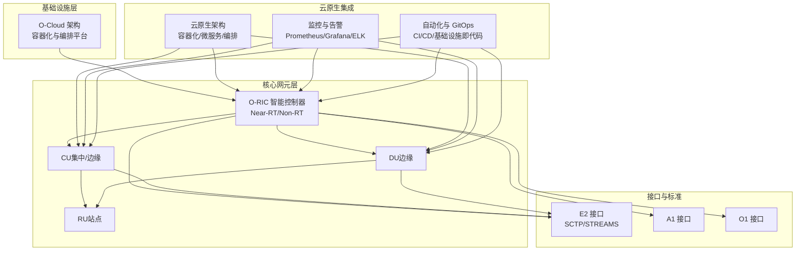

图示来源
- [O-Cloud 架构](file://01-architecture-system/o-cloud-architecture.md#L1-L238)
- [O-RIC 智能控制器](file://02-core-components/o-ric.md#L1-L437)
- [E2 接口](file://03-interface-standards/e2-interface.md#L1-L337)
- [O-RAN 实施](file://08-deployment-implementation/readme.md#L1-L353)
- [云原生架构与 O-RAN 集成](file://05-cloud-integration/cloud-native-architecture.md#L1-L481)

章节来源
- [O-Cloud 架构](file://01-architecture-system/o-cloud-architecture.md#L1-L238)
- [O-RIC 智能控制器](file://02-core-components/o-ric.md#L1-L437)
- [E2 接口](file://03-interface-standards/e2-interface.md#L1-L337)
- [O-RAN 实施](file://08-deployment-implementation/readme.md#L1-L353)
- [云原生架构与 O-RAN 集成](file://05-cloud-integration/cloud-native-architecture.md#L1-L481)

## 核心组件
- O-Cloud 基础设施层：提供虚拟化、容器化、编排、存储与网络的云原生底座，支撑 CU/DU/RIC/SMO 等功能的运行与弹性。
- O-RIC 智能控制器：分为 Near-RT RIC（毫秒级闭环）与 Non-RT RIC（策略与优化），提供 xApps/rApps 的运行环境与接口服务。
- 接口与标准：E2（RIC↔CU/DU）、A1（RIC↔RIC/策略）、O1（管理）等，均支持云原生部署与监控集成。
- 部署与实施：集中式/分布式/混合式/边缘/多云部署架构，配套自动化与运维体系。
- 性能优化：网络、计算、容器与应用层的系统化优化方法论与自动化工具链。

章节来源
- [O-Cloud 架构](file://01-architecture-system/o-cloud-architecture.md#L1-L238)
- [O-RIC 智能控制器](file://02-core-components/o-ric.md#L1-L437)
- [E2 接口](file://03-interface-standards/e2-interface.md#L1-L337)
- [O-RAN 实施](file://08-deployment-implementation/readme.md#L1-L353)
- [云原生架构与 O-RAN 集成](file://05-cloud-integration/cloud-native-architecture.md#L1-L481)
- [部署场景分析](file://04-disaggregation-options/deployment-scenarios.md#L1-L563)
- [O-RAN 性能优化框架](file://14-operations-management/performance-optimization/performance-optimization-framework.md#L1-L650)

## 架构总览
云原生在 O-RAN 中的集成体现为“三层协同”：
- 基础设施层（O-Cloud）：Kubernetes 编排、容器运行时、存储与网络虚拟化，提供统一的资源池与弹性能力。
- 控制与智能层（O-RIC）：Near-RT/Non-RT RIC 采用微服务与容器化部署，结合服务网格与消息中间件，支撑 xApps/rApps 的快速交付与治理。
- 管理与运维层（SMO/监控）：统一监控（指标、日志、追踪）、告警与自动化运维，保障端到端业务质量。

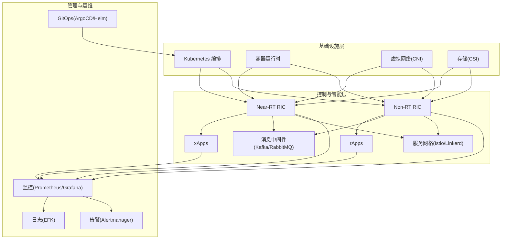

图示来源
- [O-Cloud 架构](file://01-architecture-system/o-cloud-architecture.md#L19-L29)
- [O-RIC 智能控制器](file://02-core-components/o-ric.md#L89-L116)
- [O-RAN 实施](file://08-deployment-implementation/readme.md#L94-L124)

章节来源
- [O-Cloud 架构](file://01-architecture-system/o-cloud-architecture.md#L19-L29)
- [O-RIC 智能控制器](file://02-core-components/o-ric.md#L89-L116)
- [O-RAN 实施](file://08-deployment-implementation/readme.md#L94-L124)

## 详细组件分析

### 云原生架构与 O-RAN 集成
- 容器化：统一打包 CU/DU/RIC/SMO 等功能，提升一致性、可移植性与资源利用率。
- 微服务架构：将 RIC、SMO 等拆分为独立服务，支持独立扩展与升级。
- 自动化编排：Kubernetes 实现部署、扩缩容、自愈与服务发现；HPA/VPA 自动调节资源。
- 基础设施即代码：Terraform/Ansible 管理基础设施，确保环境一致性与可追溯性。

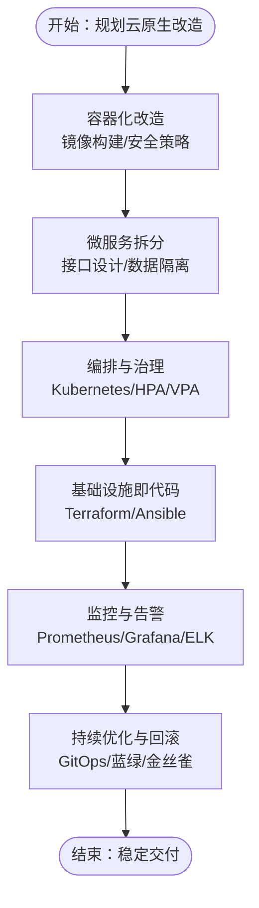

图示来源
- [云原生架构与 O-RAN 集成](file://05-cloud-integration/cloud-native-architecture.md#L9-L63)
- [O-RAN 实施](file://08-deployment-implementation/readme.md#L180-L196)

章节来源
- [云原生架构与 O-RAN 集成](file://05-cloud-integration/cloud-native-architecture.md#L9-L63)
- [O-RAN 实施](file://08-deployment-implementation/readme.md#L180-L196)

### O-Cloud 架构与云原生技术栈
- 计算/存储/网络/管理层：提供虚拟化、容器化、编排、分布式存储与虚拟网络。
- 性能优化：NUMA 感知、SR-IOV/DPDK、热/温/冷存储分层。
- 可靠性设计：硬件/软件冗余、自动故障转移、定期演练。
- 安全性设计：网络隔离、主机加固、数据加密与访问审计。
- 可扩展性设计：水平/垂直扩展、模块化与负载均衡。

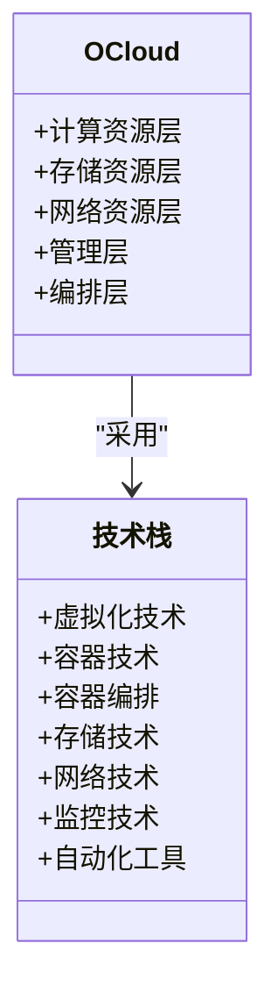

图示来源
- [O-Cloud 架构](file://01-architecture-system/o-cloud-architecture.md#L9-L30)

章节来源
- [O-Cloud 架构](file://01-architecture-system/o-cloud-architecture.md#L9-L30)
- [O-Cloud 架构](file://01-architecture-system/o-cloud-architecture.md#L41-L122)
- [O-Cloud 架构](file://01-architecture-system/o-cloud-architecture.md#L116-L141)
- [O-Cloud 架构](file://01-architecture-system/o-cloud-architecture.md#L142-L194)

### O-RIC 的云原生部署与运维
- Near-RT RIC：容器化与微服务化，支持 xApps 生命周期管理、E2 接口服务与实时数据处理。
- Non-RT RIC：容器化与微服务化，支持 rApps 生命周期管理、策略系统与机器学习框架。
- 部署模式：集中式/分布式/混合式，平衡实时性与管理效率。
- 运维管理：监控与告警、配置管理、故障处理、性能优化与安全最佳实践。

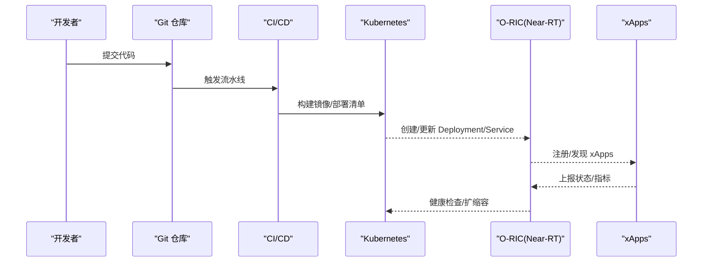

图示来源
- [O-RIC 智能控制器](file://02-core-components/o-ric.md#L304-L322)
- [O-RAN 实施](file://08-deployment-implementation/readme.md#L180-L196)

章节来源
- [O-RIC 智能控制器](file://02-core-components/o-ric.md#L75-L133)
- [O-RIC 智能控制器](file://02-core-components/o-ric.md#L214-L301)
- [O-RIC 智能控制器](file://02-core-components/o-ric.md#L302-L388)
- [O-RAN 实施](file://08-deployment-implementation/readme.md#L180-L196)

### E2 接口的云原生集成
- 协议与服务模型：基于 SCTP/STREAMS 的服务化接口，支持服务发现、调用、事件通知与订阅管理。
- 部署架构：集中式/分布式/混合式，结合 QoS 与网络优化（SR-IOV/DPDK）。
- 运维与监控：连接状态、消息吞吐与延迟、告警分级与关联分析。
- 安全与版本管理：访问控制、加密、相互认证与版本兼容性测试。

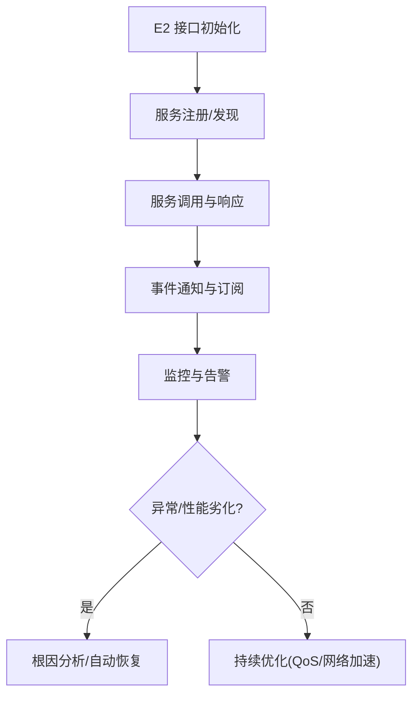

图示来源
- [E2 接口](file://03-interface-standards/e2-interface.md#L63-L90)
- [E2 接口](file://03-interface-standards/e2-interface.md#L111-L130)
- [E2 接口](file://03-interface-standards/e2-interface.md#L148-L201)
- [E2 接口](file://03-interface-standards/e2-interface.md#L202-L260)

章节来源
- [E2 接口](file://03-interface-standards/e2-interface.md#L63-L90)
- [E2 接口](file://03-interface-standards/e2-interface.md#L111-L130)
- [E2 接口](file://03-interface-standards/e2-interface.md#L148-L201)
- [E2 接口](file://03-interface-standards/e2-interface.md#L202-L260)

### 部署场景与多云/混合云
- 集中式/分布式/混合式/边缘/多云：依据业务类型（eMBB/URLLC/mMTC）、网络条件与成本预算选择最优架构。
- 关键考量：传输带宽/延迟/可靠性、核心/边缘计算能力、安全隔离与合规、运维复杂度与成本。
- 实施策略：分阶段部署、功能分层、资源调度与数据管理、自动化部署与网络/业务自动化。

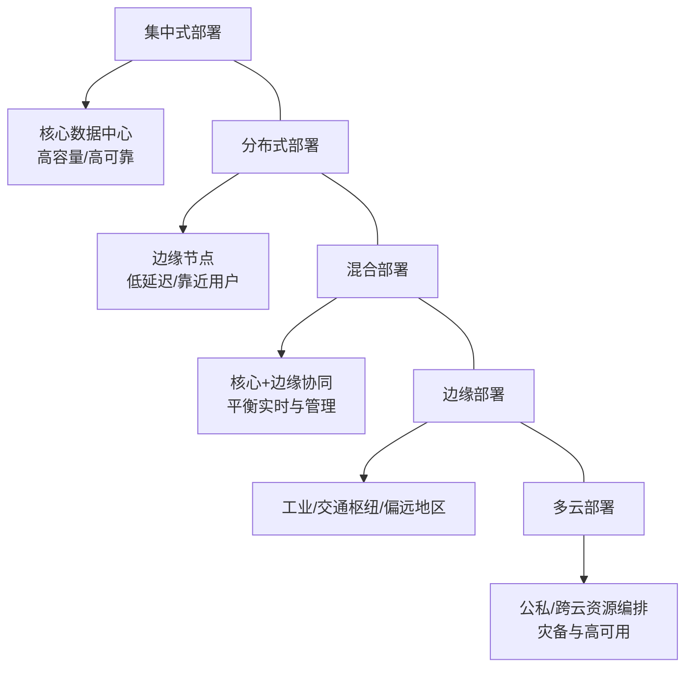

图示来源
- [部署场景分析](file://04-disaggregation-options/deployment-scenarios.md#L59-L214)
- [部署场景分析](file://04-disaggregation-options/deployment-scenarios.md#L216-L316)
- [部署场景分析](file://04-disaggregation-options/deployment-scenarios.md#L366-L435)
- [O-RAN 实施](file://08-deployment-implementation/readme.md#L33-L38)

章节来源
- [部署场景分析](file://04-disaggregation-options/deployment-scenarios.md#L59-L214)
- [部署场景分析](file://04-disaggregation-options/deployment-scenarios.md#L216-L316)
- [部署场景分析](file://04-disaggregation-options/deployment-scenarios.md#L366-L435)
- [O-RAN 实施](file://08-deployment-implementation/readme.md#L33-L38)

### 监控集成与自动化运维
- 监控体系：指标（Prometheus）、日志（ELK）、追踪（Jaeger/Zipkin）、告警（Alertmanager）、可视化（Grafana）。
- O-RAN 特定监控：CU/DU/RU 性能、RIC 控制延迟、接口状态与服务模型执行情况。
- 智能监控与分析：异常检测、预测性分析、根因分析与智能告警。
- 自动化与 GitOps：CI/CD、蓝绿/金丝雀发布、HPA/VPA、ArgoCD/Helm。

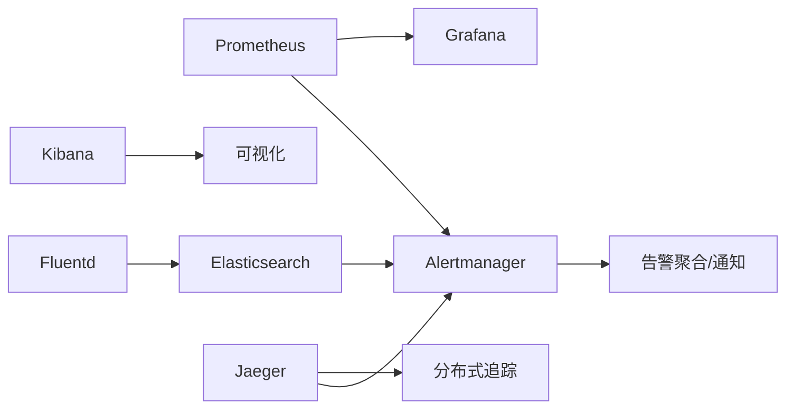

图示来源
- [云原生架构与 O-RAN 集成](file://05-cloud-integration/cloud-native-architecture.md#L297-L341)
- [O-RAN 实施](file://08-deployment-implementation/readme.md#L94-L124)

章节来源
- [云原生架构与 O-RAN 集成](file://05-cloud-integration/cloud-native-architecture.md#L297-L341)
- [O-RAN 实施](file://08-deployment-implementation/readme.md#L94-L124)

### 性能优化框架
- 网络层：Jumbo 帧、中断合并、NUMA 绑定、优先队列与 O-RAN 流量标记。
- 计算层：CPU 亲和性、进程优先级、内核调度器参数、NUMA 内存绑定。
- 容器层：资源请求/限制、探针配置、运行时参数（GC/并发）。
- 应用层：内存页优化（HugePages）、内存分配器与过承诺策略。
- 监控与自动化：仪表板、趋势分析、自动化调优与性能报告。

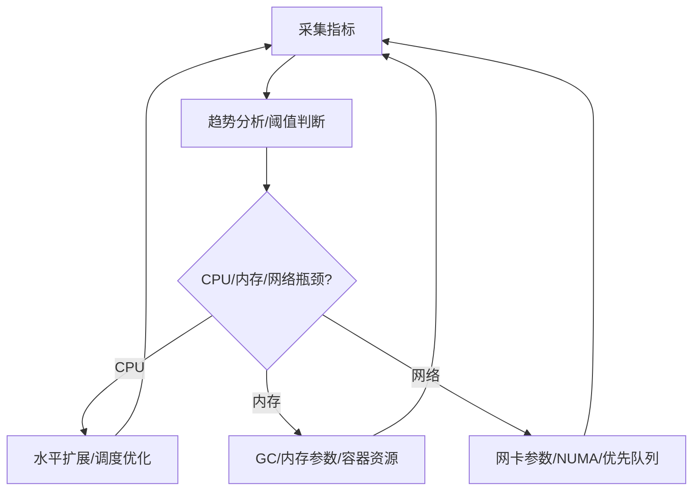

图示来源
- [O-RAN 性能优化框架](file://14-operations-management/performance-optimization/performance-optimization-framework.md#L378-L448)
- [O-RAN 性能优化框架](file://14-operations-management/performance-optimization/performance-optimization-framework.md#L450-L648)

章节来源
- [O-RAN 性能优化框架](file://14-operations-management/performance-optimization/performance-optimization-framework.md#L6-L101)
- [O-RAN 性能优化框架](file://14-operations-management/performance-optimization/performance-optimization-framework.md#L103-L234)
- [O-RAN 性能优化框架](file://14-operations-management/performance-optimization/performance-optimization-framework.md#L236-L376)
- [O-RAN 性能优化框架](file://14-operations-management/performance-optimization/performance-optimization-framework.md#L378-L448)
- [O-RAN 性能优化框架](file://14-operations-management/performance-optimization/performance-optimization-framework.md#L450-L648)

## 依赖分析
- 组件耦合与内聚：O-RIC 与 CU/DU 通过 E2 接口耦合，与 Non-RT RIC 通过 A1 接口耦合；容器化与编排提升了内聚与可替换性。
- 外部依赖：Kubernetes、CNI/CSI、Prometheus/Grafana、消息中间件、服务网格与 GitOps 工具链。
- 潜在环路：通过服务网格与 API 网关避免循环依赖；接口层（E2/A1/O1）提供清晰边界。
- 集成点：O-Cloud 为上层提供统一资源与编排能力；SMO 与监控系统贯穿全栈。

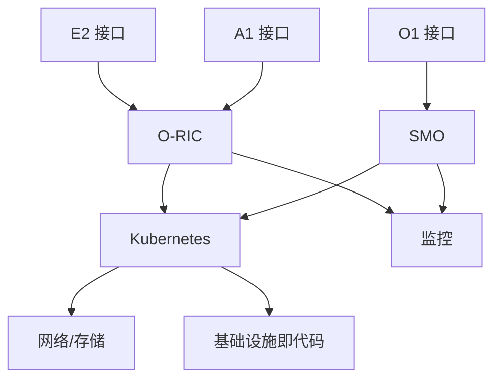

图示来源
- [E2 接口](file://03-interface-standards/e2-interface.md#L63-L90)
- [O-RIC 智能控制器](file://02-core-components/o-ric.md#L304-L322)
- [O-RAN 实施](file://08-deployment-implementation/readme.md#L94-L124)

章节来源
- [E2 接口](file://03-interface-standards/e2-interface.md#L63-L90)
- [O-RIC 智能控制器](file://02-core-components/o-ric.md#L304-L322)
- [O-RAN 实施](file://08-deployment-implementation/readme.md#L94-L124)

## 性能考量
- 实时性与确定性：Near-RT RIC 延迟需低于 10ms；通过容器亲和、NUMA 绑定、SR-IOV/DPDK、优先队列与 QoS 保障。
- 可靠性与可用性：99.999% 可用性要求，多副本、自动故障转移、备份与恢复、定期演练。
- 安全与隔离：网络分段、RBAC、加密传输、镜像扫描与运行时保护。
- 可观测性：统一监控、分布式追踪、智能告警与根因分析。
- 成本与弹性：HPA/VPA、资源预留与保障、容量规划与成本优化、按需扩缩容。

章节来源
- [云原生架构与 O-RAN 集成](file://05-cloud-integration/cloud-native-architecture.md#L123-L176)
- [O-Cloud 架构](file://01-architecture-system/o-cloud-architecture.md#L64-L122)
- [O-RAN 实施](file://08-deployment-implementation/readme.md#L94-L124)

## 故障排查指南
- 问题分类：接口故障（E2/A1/O1）、性能问题（延迟/吞吐/丢包）、可用性问题、配置问题、兼容性问题。
- 排查流程：问题定义与范围、信息收集（日志/指标/配置）、假设与验证、根因分析（5 Why/鱼骨图/故障树）、方案实施与验证。
- 诊断工具：Wireshark/tcptrace、协议分析器、ELK/Splunk、性能分析工具、网络监控工具。
- SOP：故障响应、升级流程、沟通流程、复盘与知识库更新。

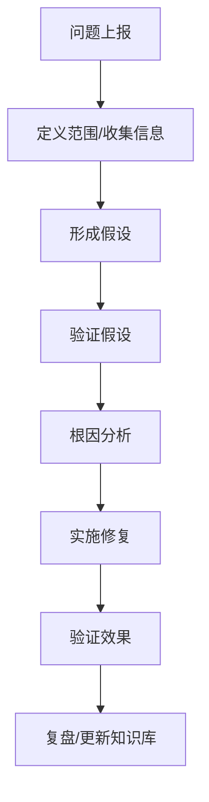

图示来源
- [O-RAN 实施](file://08-deployment-implementation/readme.md#L126-L156)

章节来源
- [O-RAN 实施](file://08-deployment-implementation/readme.md#L126-L156)

## 结论
O-RAN 与云原生的深度融合，通过容器化、微服务、自动化编排与基础设施即代码，实现了更灵活、高效与智能的无线接入网络。结合 O-Cloud 的统一底座、O-RIC 的云原生部署与治理、E2/A1/O1 接口的标准化与云原生集成，以及完善的监控与自动化运维体系，可在边缘计算、多云与混合云场景下实现低延迟、高可靠与高性价比的网络服务。建议在实践中遵循最佳实践，持续优化性能与成本，并以自动化与 GitOps 提升交付效率与稳定性。

## 附录
- 配置与清单参考：容器资源请求/限制、探针、服务网格与消息中间件配置。
- 部署案例：核心城市集中式、工业园区边缘式、全国范围混合式与多云部署。
- 最佳实践：镜像安全、资源预留、HPA/VPA、蓝绿/金丝雀发布、GitOps、安全扫描与合规审计。

章节来源
- [O-RAN 实施](file://08-deployment-implementation/readme.md#L296-L321)
- [云原生架构与 O-RAN 集成](file://05-cloud-integration/cloud-native-architecture.md#L378-L436)
- [部署场景分析](file://04-disaggregation-options/deployment-scenarios.md#L497-L558)