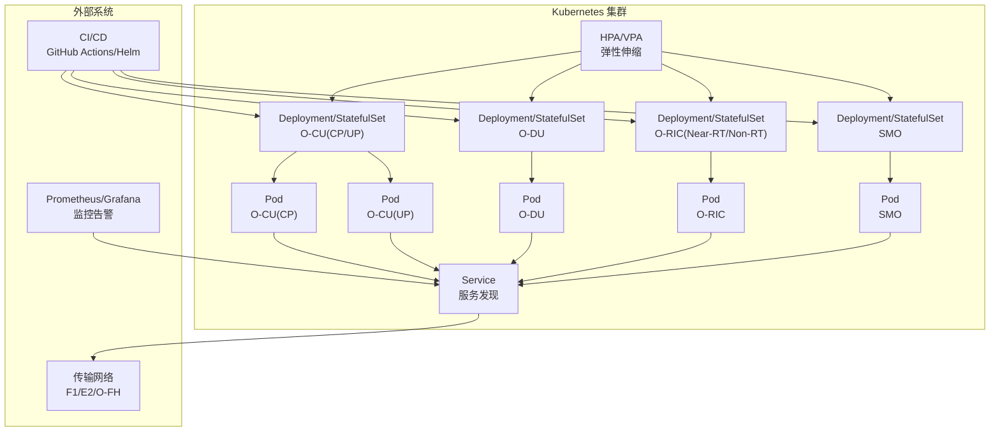
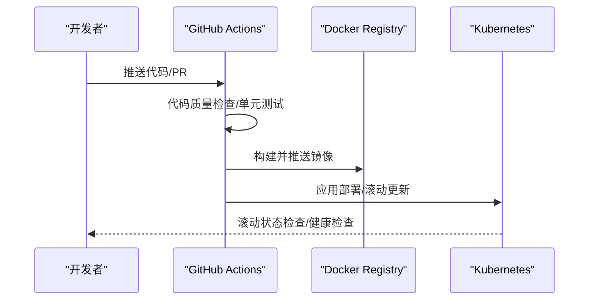
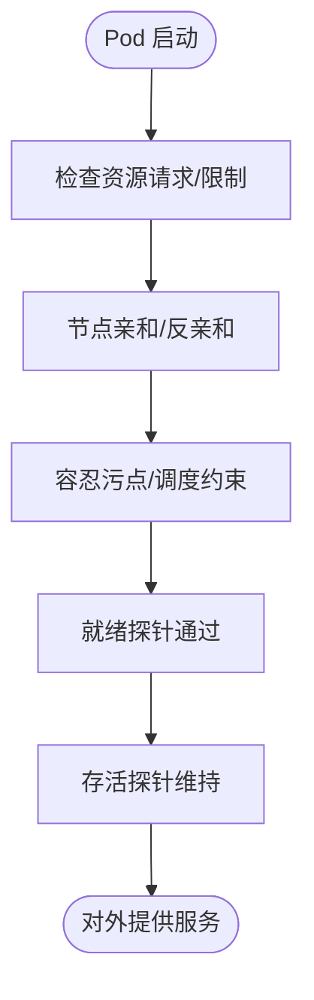
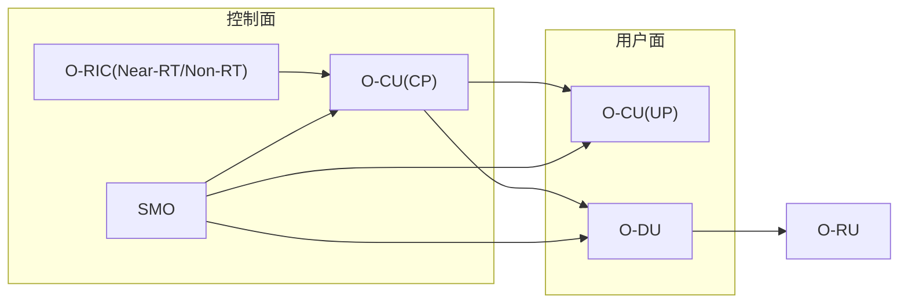
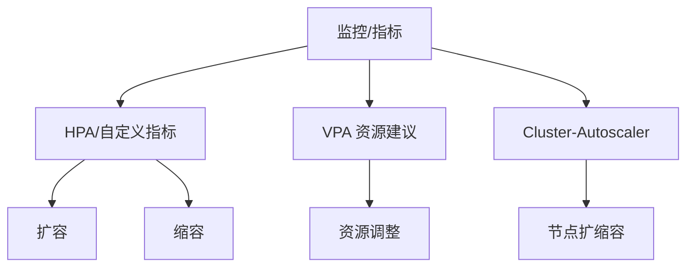
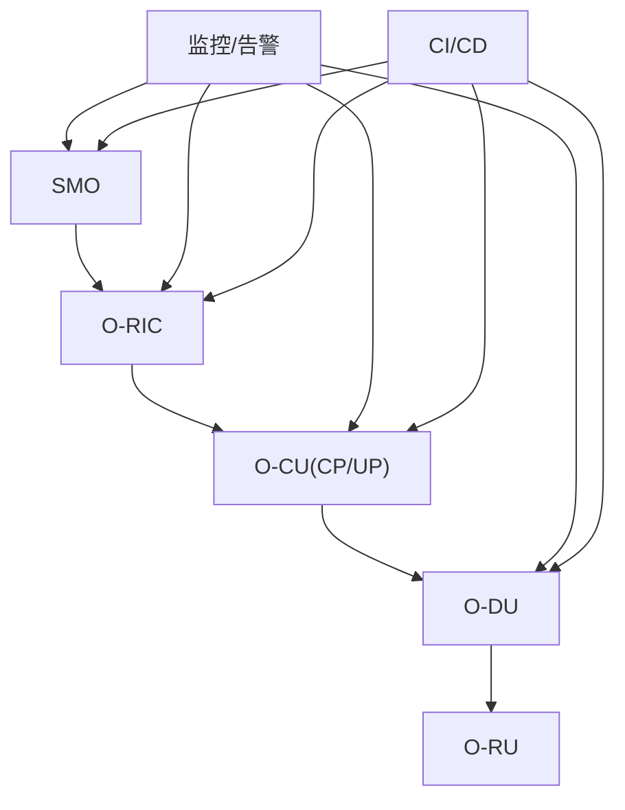
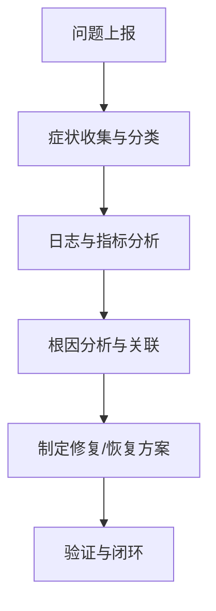

# 容器编排与管理

<cite>
**本文引用的文件**
- [云原生架构与 O-RAN 集成.md](file://05-cloud-integration/cloud-native-architecture.md)
- [O-RAN Implementation.md](file://08-deployment-implementation/readme.md)
- [O-RAN 监控系统.md](file://22-tool-platforms/monitoring-systems/o-ran-monitoring-systems.md)
- [O-RAN 故障处理与排查指南.md](file://14-operations-management/fault-handling/fault-troubleshooting-guide.md)
- [O-RAN 开发工具与自动化.md](file://17-open-source-ecosystem/developer-tools/oran-development-tools.md)
- [O-RAN 开发工具与自动化（中文）.md](file://17-open-source-ecosystem/developer-tools/oran-development-tools-zh.md)
- [O-RAN 容量规划.md](file://26-performance-optimization/capacity-planning/o-ran-capacity-planning.md)
- [O-RAN 计算优化.md](file://26-performance-optimization/compute-optimization/o-ran-compute-optimization.md)
- [O-CU.md](file://02-core-components/o-cu.md)
- [O-DU.md](file://02-core-components/o-du.md)
</cite>

## 目录
1. [简介](#简介)
2. [项目结构](#项目结构)
3. [核心组件](#核心组件)
4. [架构总览](#架构总览)
5. [详细组件分析](#详细组件分析)
6. [依赖关系分析](#依赖关系分析)
7. [性能考虑](#性能考虑)
8. [故障排查指南](#故障排查指南)
9. [结论](#结论)
10. [附录](#附录)

## 简介
本文件面向 O-RAN 网络的容器编排与管理，系统阐述基于 Kubernetes 的集群管理、Pod 调度与 Service 发现；结合 O-RAN 核心网元（O-RU、O-DU、O-CU、O-RIC、SMO）的容器化部署策略与配置；并覆盖水平扩展、滚动更新、负载均衡与故障恢复等高级特性。同时给出容器网络、存储与安全策略的实施方案，并提供配置文件示例、部署脚本与故障排查清单，帮助读者在生产环境中落地云原生 O-RAN。

## 项目结构
围绕容器编排与管理主题，本仓库中与之直接相关的内容主要分布在如下章节：
- 云原生与 O-RAN 集成：阐述容器化、微服务、自动化编排、基础设施即代码等原则及在 O-RAN 中的应用。
- 部署实施：涵盖部署架构设计、硬件与基础设施规划、集成测试、运维管理、故障排查与安全实现、自动化与编排。
- 监控系统：提供基于 Prometheus/Grafana 的指标采集、日志分析、故障诊断与预测性维护方案。
- 故障排查：系统化地给出故障分类、诊断方法、常用工具与典型场景的排查步骤。
- 开发工具与自动化：包含 CI/CD 流水线、Helm 图表模板、本地开发集群工具与 Helm Chart 开发最佳实践。
- 性能优化：涵盖 CPU 调度、资源配额、HPA/VPA/Cluster-Autoscaler 等动态资源管理。
- O-RAN 核心组件：O-CU、O-DU 的功能、接口、部署与运维要点，为容器化部署提供业务语义支撑。

```mermaid
graph TB
subgraph "云原生与 O-RAN"
CN["云原生架构与 O-RAN 集成"]
DI["O-RAN Implementation"]
end
subgraph "监控与运维"
MON["O-RAN 监控系统"]
FH["O-RAN 故障处理与排查指南"]
end
subgraph "开发与自动化"
DEV["O-RAN 开发工具与自动化"]
CAP["O-RAN 容量规划"]
CMP["O-RAN 计算优化"]
end
subgraph "核心组件"
OC["O-CU"]
OD["O-DU"]
end
CN --> DI
DI --> MON
DI --> FH
DI --> DEV
DEV --> CAP
DEV --> CMP
DI --> OC
DI --> OD
```

**图示来源**
- [云原生架构与 O-RAN 集成.md](file://05-cloud-integration/cloud-native-architecture.md#L1-L481)
- [O-RAN Implementation.md](file://08-deployment-implementation/readme.md#L1-L353)
- [O-RAN 监控系统.md](file://22-tool-platforms/monitoring-systems/o-ran-monitoring-systems.md#L1-L545)
- [O-RAN 故障处理与排查指南.md](file://14-operations-management/fault-handling/fault-troubleshooting-guide.md#L1-L633)
- [O-RAN 开发工具与自动化.md](file://17-open-source-ecosystem/developer-tools/oran-development-tools.md#L799-L992)
- [O-RAN 容量规划.md](file://26-performance-optimization/capacity-planning/o-ran-capacity-planning.md#L76-L144)
- [O-RAN 计算优化.md](file://26-performance-optimization/compute-optimization/o-ran-compute-optimization.md#L6-L59)
- [O-CU.md](file://02-core-components/o-cu.md#L1-L419)
- [O-DU.md](file://02-core-components/o-du.md#L1-L415)

**章节来源**
- [云原生架构与 O-RAN 集成.md](file://05-cloud-integration/cloud-native-architecture.md#L1-L481)
- [O-RAN Implementation.md](file://08-deployment-implementation/readme.md#L1-L353)

## 核心组件
- O-RU（远端单元）：负责射频前端与物理层处理，通常以硬件形态存在，但其控制面与管理面可容器化。
- O-DU（分布式单元）：承担物理层与 MAC 层处理，对实时性要求高，适合就近部署与边缘化容器化。
- O-CU（集中式单元）：分离为 CU-CP（控制面）与 CU-UP（用户面），分别面向集中管理与用户面转发，具备良好的容器化与弹性扩展能力。
- O-RIC（无线智能控制器）：支持 Near-RT 与 Non-RT 场景，容器化部署利于快速伸缩与 xApp/rApp 管理。
- SMO（系统管理与编排）：提供统一编排与管理能力，容器化后可与 Kubernetes 生态深度融合。

这些组件在云原生环境下通过容器镜像交付，借助 Kubernetes 的 Deployment/StatefulSet、Service、HPA/VPA、Ingress 等对象实现编排与治理。

**章节来源**
- [O-CU.md](file://02-core-components/o-cu.md#L1-L419)
- [O-DU.md](file://02-core-components/o-du.md#L1-L415)

## 架构总览
下图展示了 O-RAN 在云原生环境下的总体架构：控制面（O-CU CP、O-RIC）与用户面（O-CU UP、O-DU）通过 Kubernetes 进行容器化编排，Service 提供服务发现，HPA/VPA 实现弹性伸缩，Prometheus/Grafana 提供可观测性，CI/CD 管道自动化构建与部署。

**图示来源**
- [云原生架构与 O-RAN 集成.md](file://05-cloud-integration/cloud-native-architecture.md#L37-L49)
- [O-RAN Implementation.md](file://08-deployment-implementation/readme.md#L180-L196)
- [O-RAN 监控系统.md](file://22-tool-platforms/monitoring-systems/o-ran-monitoring-systems.md#L10-L78)
- [O-RAN 开发工具与自动化.md](file://17-open-source-ecosystem/developer-tools/oran-development-tools.md#L799-L992)

## 详细组件分析

### Kubernetes 集群管理与编排
- 集群设计：根据业务需求划分控制面与工作节点，选择合适 CNI/CSI 插件，支持边缘与核心混合部署。
- 应用部署策略：滚动更新、蓝绿/金丝雀发布，配合 HPA/VPA/Cluster-Autoscaler 实现资源自动调节。
- CI/CD：通过 GitHub Actions 自动构建 Docker 镜像并部署到 Kubernetes，支持多环境一致性与回滚。

**图示来源**
- [O-RAN 开发工具与自动化.md](file://17-open-source-ecosystem/developer-tools/oran-development-tools.md#L803-L906)

**章节来源**
- [O-RAN Implementation.md](file://08-deployment-implementation/readme.md#L180-L196)
- [O-RAN 开发工具与自动化.md](file://17-open-source-ecosystem/developer-tools/oran-development-tools.md#L799-L992)

### Pod 调度与 Service 发现
- 调度策略：结合节点亲和性、污点容忍、NUMA/亲和性优化，确保实时性与性能。
- Service 发现：ClusterIP/NodePort/LoadBalancer，配合 DNS 与端口暴露，实现跨命名空间访问。
- 探针与健康检查：liveness/readiness probes 保障 Pod 生命周期管理。

**图示来源**
- [O-RAN 开发工具与自动化.md](file://17-open-source-ecosystem/developer-tools/oran-development-tools.md#L908-L992)
- [O-RAN 容量规划.md](file://26-performance-optimization/capacity-planning/o-ran-capacity-planning.md#L76-L144)

**章节来源**
- [O-RAN 开发工具与自动化.md](file://17-open-source-ecosystem/developer-tools/oran-development-tools.md#L908-L992)
- [O-RAN 容量规划.md](file://26-performance-optimization/capacity-planning/o-ran-capacity-planning.md#L76-L144)

### O-RAN 网络元素容器化部署策略
- O-CU（CU-CP/CU-UP）：控制面与用户面分离，分别部署与弹性伸缩；支持跨区域与边缘部署，结合 E1 接口进行控制与用户面协同。
- O-DU：靠近 RU 部署，强调低延迟与高吞吐；容器化需关注实时性与资源隔离。
- O-RIC：Near-RT/Non-RT 分离部署，便于按 SLA 与延迟要求进行差异化编排。
- SMO：统一编排与管理，容器化后与监控/告警/CI/CD 深度集成。

**图示来源**
- [O-CU.md](file://02-core-components/o-cu.md#L62-L121)
- [O-DU.md](file://02-core-components/o-du.md#L68-L86)

**章节来源**
- [O-CU.md](file://02-core-components/o-cu.md#L1-L419)
- [O-DU.md](file://02-core-components/o-du.md#L1-L415)

### 高级特性：水平扩展、滚动更新、负载均衡与故障恢复
- 水平扩展：HPA 基于 CPU/内存/自定义指标或 VPA 自动推荐资源，Cluster-Autoscaler 根据节点资源动态增删节点。
- 滚动更新：蓝绿/金丝雀发布策略，结合探针与回滚机制，降低变更风险。
- 负载均衡：Service/Ingress/NLB 结合，实现跨 Pod 的流量分发与高可用。
- 故障恢复：自愈（探针失败重启/替换）、自动扩缩容、备份与恢复、故障演练与根因分析。

**图示来源**
- [O-RAN 容量规划.md](file://26-performance-optimization/capacity-planning/o-ran-capacity-planning.md#L76-L144)

**章节来源**
- [O-RAN Implementation.md](file://08-deployment-implementation/readme.md#L180-L196)
- [O-RAN 容量规划.md](file://26-performance-optimization/capacity-planning/o-ran-capacity-planning.md#L76-L144)

### 容器网络配置、存储管理与安全策略
- 网络：CNI 插件（Calico/Cilium 等）实现 Pod 网络与网络策略；Service/Ingress 提供南北向流量；O-FH/F1/E2 等接口需结合 SR-IOV/DPDK 优化。
- 存储：CSI 插件对接块/文件存储；StatefulSet/PVC 保障有状态组件持久化；备份与快照策略。
- 安全：RBAC/网络策略/最小权限；镜像扫描/运行时保护；mTLS/证书管理；审计与合规。

**章节来源**
- [O-RAN Implementation.md](file://08-deployment-implementation/readme.md#L158-L179)
- [O-RAN Implementation.md](file://08-deployment-implementation/readme.md#L94-L125)

### 配置文件示例与部署脚本
- Helm 图表模板：Deployment/Service/HPA/VPA/ConfigMap/Secret 等模板与 values.yaml 示例，便于参数化部署。
- CI/CD 工作流：GitHub Actions 自动构建镜像并部署到 Kubernetes。
- 自动化脚本：集群初始化、CNI 安装、命名空间与 RBAC 配置、Helm 部署 Near-RT RIC 与 O-DU/O-CU 组件。

**章节来源**
- [O-RAN 开发工具与自动化.md](file://17-open-source-ecosystem/developer-tools/oran-development-tools.md#L908-L992)
- [O-RAN 开发工具与自动化.md](file://17-open-source-ecosystem/developer-tools/oran-development-tools.md#L799-L906)
- [O-RAN 开发工具与自动化（中文）.md](file://17-open-source-ecosystem/developer-tools/oran-development-tools-zh.md#L909-L993)
- [O-RAN 开发工具与自动化（中文）.md](file://17-open-source-ecosystem/developer-tools/oran-development-tools-zh.md#L800-L907)

## 依赖关系分析
- 组件依赖：SMO 依赖 O-RIC；O-RIC 依赖 O-CU；O-CU 依赖 O-DU；O-DU 依赖 O-RU。
- 网络依赖：F1/E2/O-FH 接口对时延、抖动与丢包敏感；Service/Ingress/LoadBalancer 影响可达性与吞吐。
- 运维依赖：Prometheus/Grafana 提供可观测性；CI/CD 提供自动化；HPA/VPA/Cluster-Autoscaler 提供弹性。

**图示来源**
- [O-RAN 故障处理与排查指南.md](file://14-operations-management/fault-handling/fault-troubleshooting-guide.md#L100-L180)
- [O-RAN 监控系统.md](file://22-tool-platforms/monitoring-systems/o-ran-monitoring-systems.md#L1-L545)
- [O-RAN Implementation.md](file://08-deployment-implementation/readme.md#L1-L353)

**章节来源**
- [O-RAN 故障处理与排查指南.md](file://14-operations-management/fault-handling/fault-troubleshooting-guide.md#L1-L633)
- [O-RAN 监控系统.md](file://22-tool-platforms/monitoring-systems/o-ran-monitoring-systems.md#L1-L545)

## 性能考虑
- CPU 调度优化：NUMA 亲和、CPU 集合、实时调度策略；容器级 CPU 请求/限制与 cgroups 调优。
- 资源配额与弹性：HPA/VPA/Cluster-Autoscaler 动态资源管理；裸金属资源池化与隔离。
- 网络与存储：SR-IOV/DPDK、网卡队列与中断亲和、存储 I/O 隔离与带宽控制。
- 实时性保障：容器性能优化、特权模式、资源预留与 QoS。

**章节来源**
- [O-RAN 计算优化.md](file://26-performance-optimization/compute-optimization/o-ran-compute-optimization.md#L6-L59)
- [O-RAN 容量规划.md](file://26-performance-optimization/capacity-planning/o-ran-capacity-planning.md#L76-L144)
- [云原生架构与 O-RAN 集成.md](file://05-cloud-integration/cloud-native-architecture.md#L123-L176)

## 故障排查指南
- 故障分类：网络功能、接口协议、基础设施与平台、安全组件、监控系统。
- 诊断方法：系统化故障识别、日志分析、根因分析（RCA）框架、症状关联与影响评估。
- 常见场景：E2/F1/O-FH 接口问题、同步异常、性能退化、资源耗尽；配套排查步骤与自动化恢复流程。
- 工具链：tcpdump/tshark、ss/ethtool、ptp 工具、系统资源监控脚本。

**图示来源**
- [O-RAN 故障处理与排查指南.md](file://14-operations-management/fault-handling/fault-troubleshooting-guide.md#L31-L98)

**章节来源**
- [O-RAN 故障处理与排查指南.md](file://14-operations-management/fault-handling/fault-troubleshooting-guide.md#L1-L633)

## 结论
通过将 O-RAN 的核心网元（O-RU/O-DU/O-CU/O-RIC/SMO）容器化，并结合 Kubernetes 的编排能力、HPA/VPA/Cluster-Autoscaler 的弹性伸缩、Service 的服务发现与 Ingress/LB 的负载均衡，以及完善的监控与 CI/CD 流水线，可以实现 O-RAN 网络的高可用、低延迟、可扩展与可运维。针对实时性与可靠性挑战，应结合 NUMA/亲和性、特权容器、SR-IOV/DPDK、资源预留与 QoS 等手段，确保满足 O-RAN 的严格性能与安全要求。

## 附录
- 配置文件示例与部署脚本路径：
  - [Helm 图表模板与 values.yaml](file://17-open-source-ecosystem/developer-tools/oran-development-tools.md#L908-L992)
  - [CI/CD GitHub Actions 工作流](file://17-open-source-ecosystem/developer-tools/oran-development-tools.md#L799-L906)
  - [自动化部署脚本（集群初始化与组件部署）](file://17-open-source-ecosystem/developer-tools/oran-development-tools-zh.md#L328-L432)
- 监控与告警：
  - [Prometheus/Grafana 配置与告警规则](file://22-tool-platforms/monitoring-systems/o-ran-monitoring-systems.md#L29-L78)
  - [日志分析与实时流处理](file://22-tool-platforms/monitoring-systems/o-ran-monitoring-systems.md#L135-L263)
- 运维与安全：
  - [自动化运维与安全最佳实践](file://08-deployment-implementation/readme.md#L180-L315)
  - [安全实现与合规](file://08-deployment-implementation/readme.md#L158-L179)