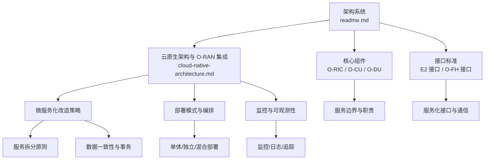
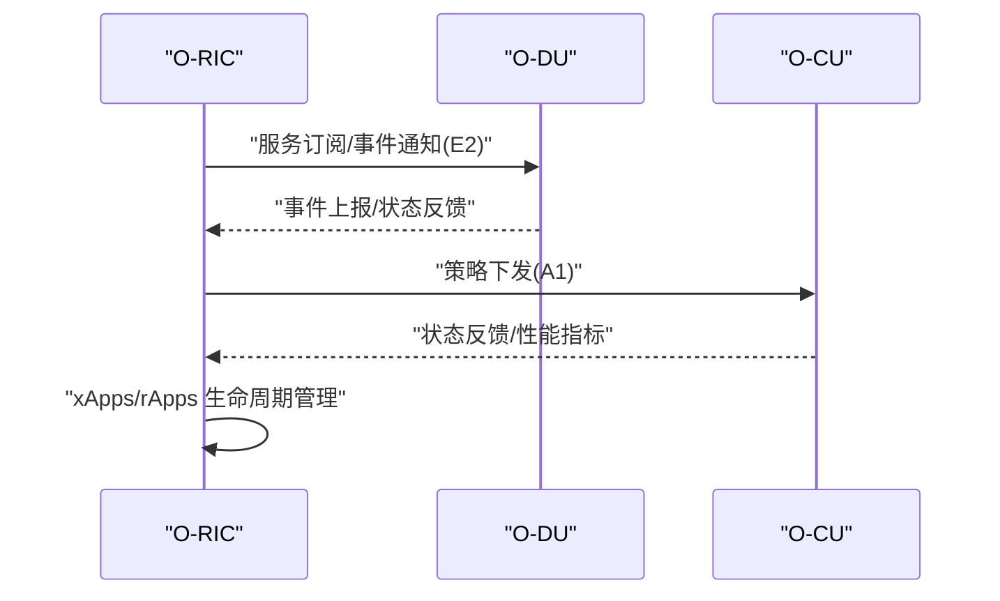
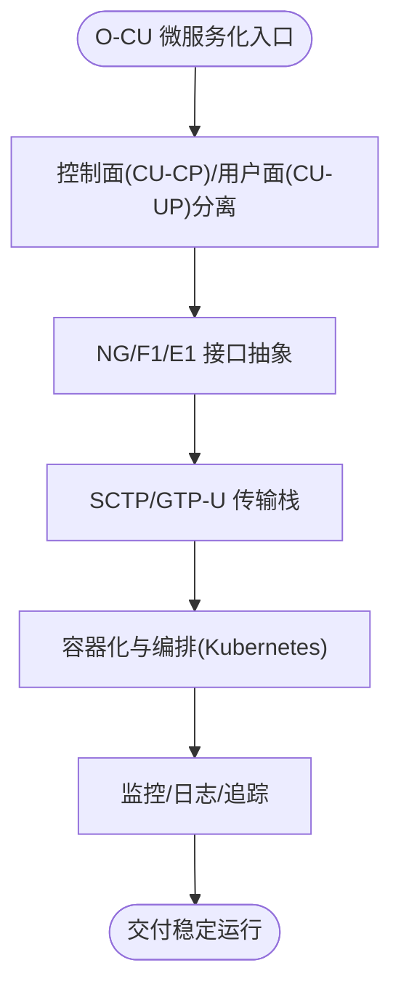
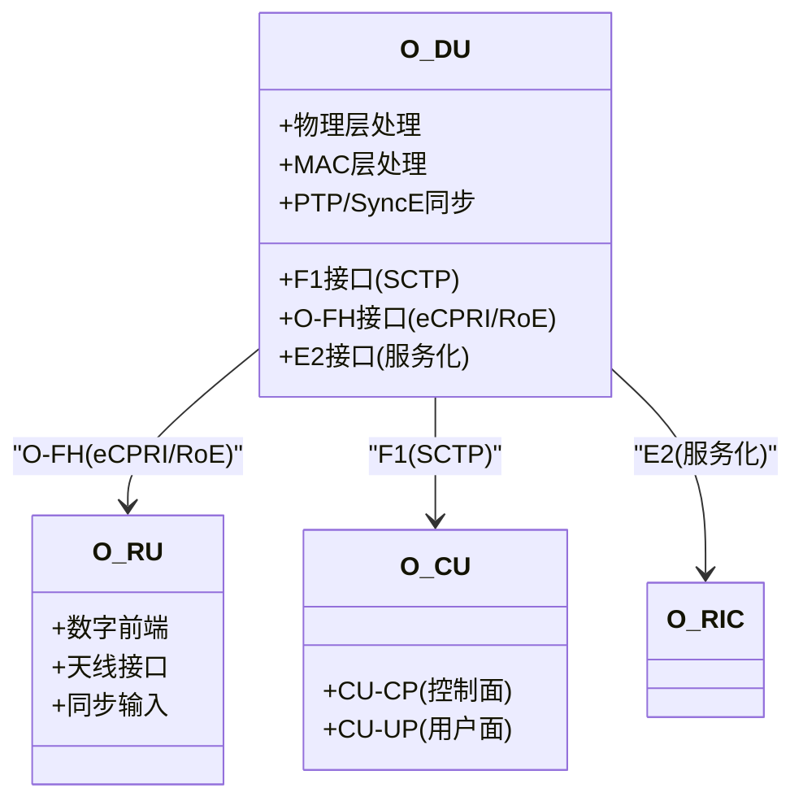
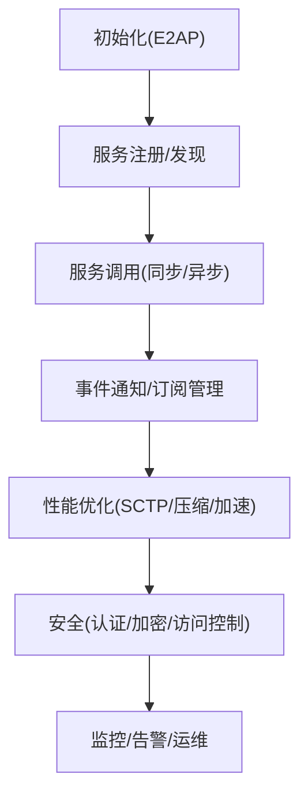
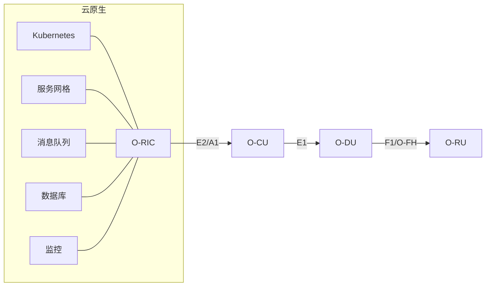
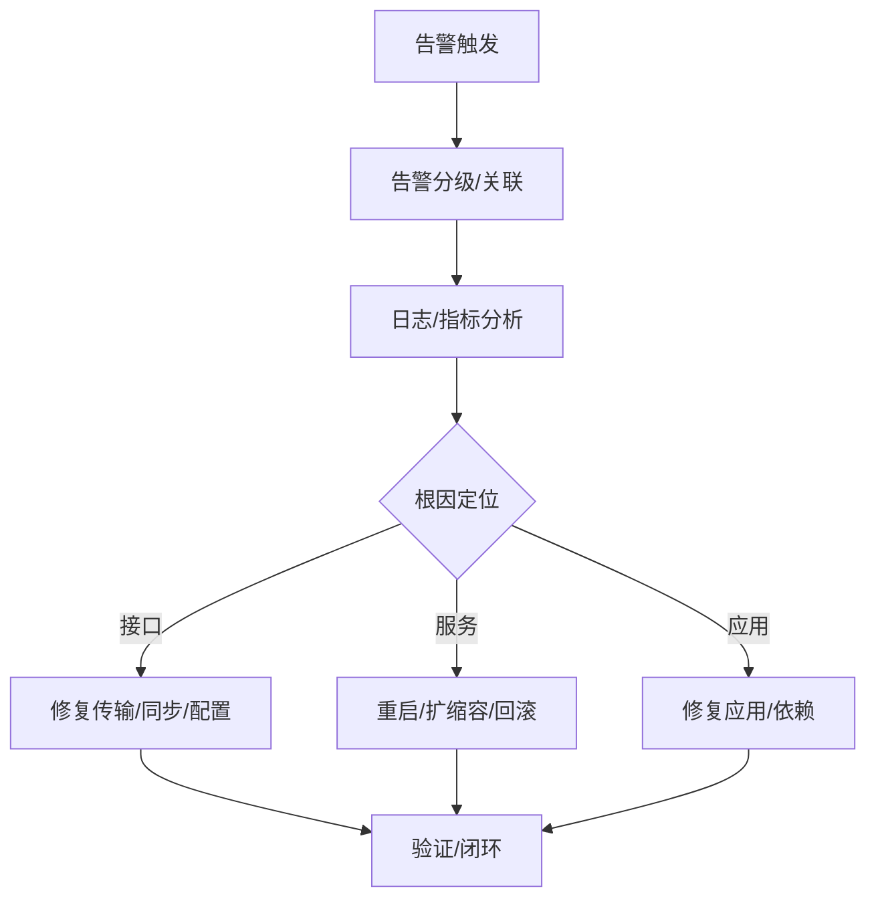

# 微服务架构设计

<cite>
**本文引用的文件**
- [O-RAN 基础知识](file://01-architecture-system/readme.md)
- [云原生架构与 O-RAN 集成](file://05-cloud-integration/cloud-native-architecture.md)
- [E2 接口](file://03-interface-standards/e2-interface.md)
- [O-RIC](file://02-core-components/o-ric.md)
- [O-CU](file://02-core-components/o-cu.md)
- [O-DU](file://02-core-components/o-du.md)
- [O-FH 接口](file://03-interface-standards/o-fh-interface.md)
</cite>

## 目录
1. [引言](#引言)
2. [项目结构](#项目结构)
3. [核心组件](#核心组件)
4. [架构总览](#架构总览)
5. [详细组件分析](#详细组件分析)
6. [依赖关系分析](#依赖关系分析)
7. [性能考虑](#性能考虑)
8. [故障排查指南](#故障排查指南)
9. [结论](#结论)
10. [附录](#附录)

## 引言
本文件面向 O-RAN 微服务架构设计，围绕服务边界划分、接口设计与通信机制展开，结合 O-RIC、O-CU、O-DU、O-FH、E2 等关键组件，给出微服务化改造策略（服务拆分原则、数据一致性与事务管理）、部署模式（单体、独立、混合）及可观测性（监控、日志、追踪）、基础设施（服务注册发现、API 网关、熔断器）与运维最佳实践。目标是帮助读者在 O-RAN 场景下落地云原生与微服务理念，实现高可靠、低时延、可扩展的网络能力。

## 项目结构
本仓库以主题域组织 O-RAN 知识，与微服务架构相关的内容主要分布在“架构系统”“云原生集成”“核心组件”“接口标准”等目录。下图给出与微服务相关的主要文件与主题映射：



图表来源
- [O-RAN 基础知识](file://01-architecture-system/readme.md#L1-L161)
- [云原生架构与 O-RAN 集成](file://05-cloud-integration/cloud-native-architecture.md#L1-L481)
- [E2 接口](file://03-interface-standards/e2-interface.md#L1-L337)
- [O-RIC](file://02-core-components/o-ric.md#L1-L437)
- [O-CU](file://02-core-components/o-cu.md#L1-L419)
- [O-DU](file://02-core-components/o-du.md#L1-L415)
- [O-FH 接口](file://03-interface-standards/o-fh-interface.md#L1-L397)

章节来源
- [O-RAN 基础知识](file://01-architecture-system/readme.md#L1-L161)
- [云原生架构与 O-RAN 集成](file://05-cloud-integration/cloud-native-architecture.md#L1-L481)

## 核心组件
- O-RIC（近实时/非实时）：提供 xApps/rApps 的运行与管理环境，承担 E2/A1 接口服务与策略下发，强调低时延控制闭环与长期优化协同。
- O-CU（CU-CP/CU-UP）：集中处理控制面与用户面，支持控制面与用户面分离，具备 NG/F1/E1 接口能力，强调可扩展与容器化部署。
- O-DU：物理层与 MAC 层处理，强调实时性（端到端 <3ms），具备 F1/O-FH/E2 接口，对同步与延迟敏感。
- O-FH 接口：连接 O-DU 与 O-RU，支持 eCPRI/RoE，提供用户面、控制面与高精度同步能力。
- E2 接口：RIC 与 CU/DU 的服务化接口，基于 SCTP/STREAMS，支持服务发现、调用、事件通知与订阅管理。

章节来源
- [O-RIC](file://02-core-components/o-ric.md#L1-L437)
- [O-CU](file://02-core-components/o-cu.md#L1-L419)
- [O-DU](file://02-core-components/o-du.md#L1-L415)
- [O-FH 接口](file://03-interface-standards/o-fh-interface.md#L1-L397)
- [E2 接口](file://03-interface-standards/e2-interface.md#L1-L337)

## 架构总览
下图展示 O-RAN 微服务化视角下的关键交互：O-RIC 作为智能中枢，通过 E2 接口与 O-CU/O-DU 交互；O-DU 通过 O-FH 接口与 O-RU 交互；O-CU 内部按 CP/UP 分离并通过 F1 接口与 O-DU 交互；云原生层提供容器化、微服务、编排与监控能力。

```mermaid
graph TB
subgraph "云原生层"
K8S["Kubernetes 编排"]
Mesh["服务网格"]
Mon["监控/日志/追踪"]
end
subgraph "控制面"
RIC["O-RIC<br/>Near-RT/Non-RT"]
CU_CP["O-CU-CP"]
end
subgraph "用户面"
DU["O-DU"]
RU["O-RU"]
end
CU_UP["O-CU-UP"] --> DU
RIC --> CU_CP
RIC --> DU
DU --> RU
CU_CP <- --> DU
CU_UP <- --> DU
K8S --> RIC
K8S --> CU_CP
K8S --> CU_UP
K8S --> DU
Mesh --> RIC
Mesh --> CU_CP
Mesh --> CU_UP
Mesh --> DU
Mon --> RIC
Mon --> CU_CP
Mon --> CU_UP
Mon --> DU
```

图表来源
- [O-RIC](file://02-core-components/o-ric.md#L75-L133)
- [O-CU](file://02-core-components/o-cu.md#L82-L117)
- [O-DU](file://02-core-components/o-du.md#L68-L86)
- [E2 接口](file://03-interface-standards/e2-interface.md#L63-L90)
- [O-FH 接口](file://03-interface-standards/o-fh-interface.md#L59-L98)
- [云原生架构与 O-RAN 集成](file://05-cloud-integration/cloud-native-architecture.md#L23-L50)

## 详细组件分析

### O-RIC 微服务化设计
- 服务边界
  - Near-RT RIC：聚焦毫秒级控制闭环，提供 E2 接口适配、xApps 生命周期与消息路由。
  - Non-RT RIC：聚焦秒至分钟级策略管理，提供 A1 接口适配、rApps 管理与数据分析/机器学习。
- 接口设计
  - E2 接口：服务发现、服务调用、事件通知、订阅管理。
  - A1 接口：策略分发、状态反馈、消息路由。
- 通信机制
  - 基于 SCTP/STREAMS 的服务化消息模型；支持同步/异步调用与事件驱动。
- 部署模式
  - 集中式/分布式/混合部署，结合地理与时延需求平衡全局优化与实时响应。
- 可观测性
  - E2/A1 接口状态、xApps/rApps 运行状态、处理延迟、资源利用率监控与告警。



图表来源
- [O-RIC](file://02-core-components/o-ric.md#L21-L57)
- [E2 接口](file://03-interface-standards/e2-interface.md#L11-L32)
- [A1 接口](file://03-interface-standards/a1-interface.md#L1-L200)

章节来源
- [O-RIC](file://02-core-components/o-ric.md#L75-L133)
- [E2 接口](file://03-interface-standards/e2-interface.md#L63-L90)

### O-CU 微服务化设计
- 服务边界
  - CU-CP：RRC/NG/F1 控制面功能，强调低时延与高可用。
  - CU-UP：PDCP/SDAP 用户面功能，强调吞吐量与 QoS。
- 接口设计
  - NG/F1/E1 接口，支持控制面与用户面分离。
- 通信机制
  - 控制面基于 SCTP，用户面基于 GTP-U；跨实例通过 E1 接口协调。
- 部署模式
  - 集中式/分布式/混合部署，结合覆盖与低延迟需求。



图表来源
- [O-CU](file://02-core-components/o-cu.md#L82-L117)
- [云原生架构与 O-RAN 集成](file://05-cloud-integration/cloud-native-architecture.md#L23-L50)

章节来源
- [O-CU](file://02-core-components/o-cu.md#L82-L117)

### O-DU 微服务化设计
- 服务边界
  - 物理层/ MAC 层处理，强调实时性（端到端 <3ms）与高可靠性。
- 接口设计
  - F1（控制面/SCTP）、O-FH（eCPRI/RoE）、E2（服务化接口）。
- 通信机制
  - 与 O-RU 通过 O-FH 低延迟传输 IQ 数据；与 O-CU 通过 F1 控制面交互；与 RIC 通过 E2 交互。
- 同步与延迟
  - 严格 PTP/SyncE 同步；低延迟网络与确定性调度。



图表来源
- [O-DU](file://02-core-components/o-du.md#L68-L86)
- [O-FH 接口](file://03-interface-standards/o-fh-interface.md#L61-L98)
- [E2 接口](file://03-interface-standards/e2-interface.md#L63-L90)

章节来源
- [O-DU](file://02-core-components/o-du.md#L51-L86)
- [O-FH 接口](file://03-interface-standards/o-fh-interface.md#L117-L178)

### E2 接口微服务化要点
- 服务化模型
  - E2SM（服务模型）+ E2AP（应用协议），支持服务注册、发现、调用与事件通知。
- 通信与可靠性
  - 基于 SCTP/STREAMS，提供多流、可靠传输与错误处理；支持订阅生命周期管理。
- 性能优化
  - SCTP 参数优化、消息压缩、批量处理、网络加速（SR-IOV/DPDK）与负载均衡。
- 运维与安全
  - 统一监控、告警分级、自动化故障检测与恢复、跨厂商互操作与加密传输。



图表来源
- [E2 接口](file://03-interface-standards/e2-interface.md#L79-L147)

章节来源
- [E2 接口](file://03-interface-standards/e2-interface.md#L63-L147)

## 依赖关系分析
- 组件耦合
  - O-RIC 与 O-CU/O-DU：通过 E2/A1 接口耦合，强调低时延与高可靠。
  - O-DU 与 O-RU：通过 O-FH 接口耦合，强调同步与带宽。
  - O-CU 内部：CU-CP/CU-UP 通过 E1 接口耦合，支持分离部署。
- 云原生依赖
  - 容器编排（Kubernetes）、服务网格（Istio/Linkerd）、消息队列（Kafka/RabbitMQ）、数据库（Redis/InfluxDB/PostgreSQL/MongoDB）与监控（Prometheus/Grafana）。



图表来源
- [O-RIC](file://02-core-components/o-ric.md#L75-L117)
- [O-CU](file://02-core-components/o-cu.md#L101-L117)
- [O-DU](file://02-core-components/o-du.md#L68-L86)
- [O-FH 接口](file://03-interface-standards/o-fh-interface.md#L59-L98)
- [E2 接口](file://03-interface-standards/e2-interface.md#L63-L90)
- [云原生架构与 O-RAN 集成](file://05-cloud-integration/cloud-native-architecture.md#L23-L50)

章节来源
- [O-RIC](file://02-core-components/o-ric.md#L75-L117)
- [O-CU](file://02-core-components/o-cu.md#L101-L117)
- [O-DU](file://02-core-components/o-du.md#L68-L86)
- [O-FH 接口](file://03-interface-standards/o-fh-interface.md#L59-L98)
- [E2 接口](file://03-interface-standards/e2-interface.md#L63-L90)
- [云原生架构与 O-RAN 集成](file://05-cloud-integration/cloud-native-architecture.md#L23-L50)

## 性能考虑
- 实时性与延迟
  - Near-RT RIC 响应时间 <10ms；端到端延迟 <3ms；O-FH 同步精度 <100ns。
- 网络优化
  - 带宽与 QoS、SR-IOV/DPDK、多路径与负载均衡、链路聚合。
- 资源与弹性
  - 容器资源限制/亲和性、HPA/VPA、多副本与自动故障转移。
- 数据与一致性
  - 状态管理（Redis/InfluxDB）、分布式锁、最终一致性策略、事件溯源与补偿。

章节来源
- [O-RIC](file://02-core-components/o-ric.md#L134-L192)
- [O-DU](file://02-core-components/o-du.md#L51-L67)
- [O-FH 接口](file://03-interface-standards/o-fh-interface.md#L117-L178)
- [云原生架构与 O-RAN 集成](file://05-cloud-integration/cloud-native-architecture.md#L123-L176)

## 故障排查指南
- 监控与告警
  - 接口状态（E2/A1/F1/O-FH）、服务调用成功率/延迟、资源利用率、订阅状态。
- 常见故障定位
  - 告警关联分析、日志分析、信令/同步测试、自动化验证。
- 恢复与回滚
  - 服务重启、配置调整、资源扩容、接口修复、应用回滚与版本治理。



图表来源
- [E2 接口](file://03-interface-standards/e2-interface.md#L148-L220)
- [O-RIC](file://02-core-components/o-ric.md#L214-L282)
- [O-DU](file://02-core-components/o-du.md#L224-L288)

章节来源
- [E2 接口](file://03-interface-standards/e2-interface.md#L148-L220)
- [O-RIC](file://02-core-components/o-ric.md#L214-L282)
- [O-DU](file://02-core-components/o-du.md#L224-L288)

## 结论
O-RAN 的微服务化改造应以“控制面集中、用户面就近、接口服务化、云原生编排”为核心原则。通过明确服务边界、统一服务化接口（E2/A1/F1/O-FH）、强化可观测性与自动化运维，可在满足低时延与高可靠的条件下，实现灵活扩展与高效运营。

## 附录

### 微服务化改造策略
- 服务拆分原则
  - 单一职责、限域自治、接口稳定、幂等与可重试。
- 数据一致性与事务
  - 分阶段提交/补偿、事件驱动与最终一致性、分布式锁与状态机。
- 事务管理
  - 本地事务 + 异步事件；跨服务通过 Saga/事件溯源；补偿与重试退避。

章节来源
- [云原生架构与 O-RAN 集成](file://05-cloud-integration/cloud-native-architecture.md#L177-L234)

### 部署模式与适用场景
- 集中式云部署：核心区域集中、管理效率优先、传输发达。
- 边缘云部署：低延迟业务、边缘计算、传输受限。
- 混合云部署：兼顾集中管理与边缘性能，跨区域协同。

章节来源
- [云原生架构与 O-RAN 集成](file://05-cloud-integration/cloud-native-architecture.md#L235-L296)

### 监控、日志与分布式追踪
- 监控体系：基础设施/容器/服务/业务分层；Prometheus/Grafana。
- 日志聚合：Elasticsearch/Fluentd/Kibana。
- 分布式追踪：Jaeger/Zipkin；端到端链路追踪与根因分析。

章节来源
- [云原生架构与 O-RAN 集成](file://05-cloud-integration/cloud-native-architecture.md#L297-L341)

### 基础设施设计与配置
- 服务注册发现：Kubernetes Service/Headless、服务网格注册。
- API 网关：统一入口、鉴权、限流、路由与可观测性。
- 熔断与限流：服务网格/SDK 熔断、舱壁隔离、突发削峰。

章节来源
- [云原生架构与 O-RAN 集成](file://05-cloud-integration/cloud-native-architecture.md#L342-L377)

### 性能优化、安全加固与运维最佳实践
- 性能优化：容器与网络优化、资源预留、批处理与缓存、负载均衡。
- 安全加固：镜像安全、RBAC、网络策略、Secrets 管理、API 认证与加密。
- 运维最佳实践：自动化编排、CI/CD、配置即代码、容量与成本优化、故障演练与知识沉淀。

章节来源
- [云原生架构与 O-RAN 集成](file://05-cloud-integration/cloud-native-architecture.md#L177-L234)
- [O-RIC](file://02-core-components/o-ric.md#L302-L388)
- [O-DU](file://02-core-components/o-du.md#L309-L369)
- [O-CU](file://02-core-components/o-cu.md#L283-L361)