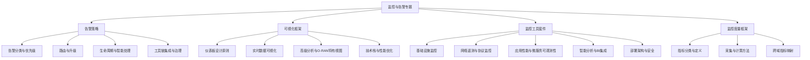
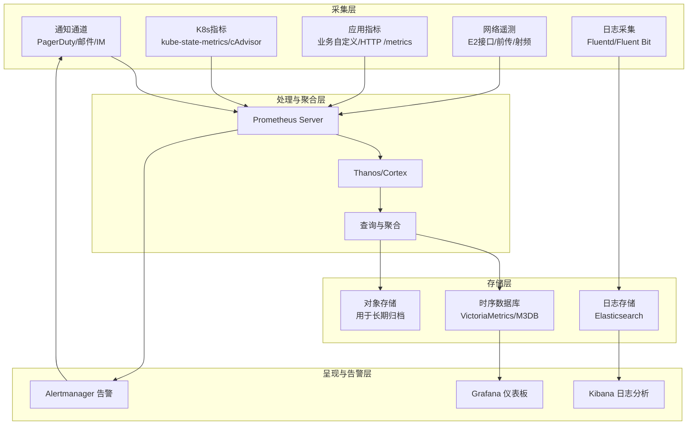
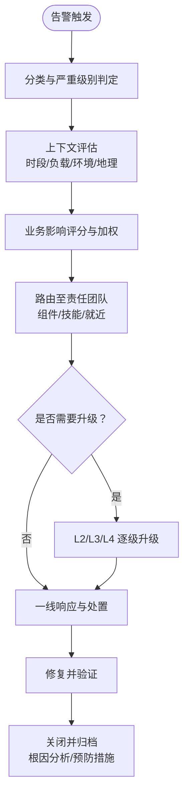
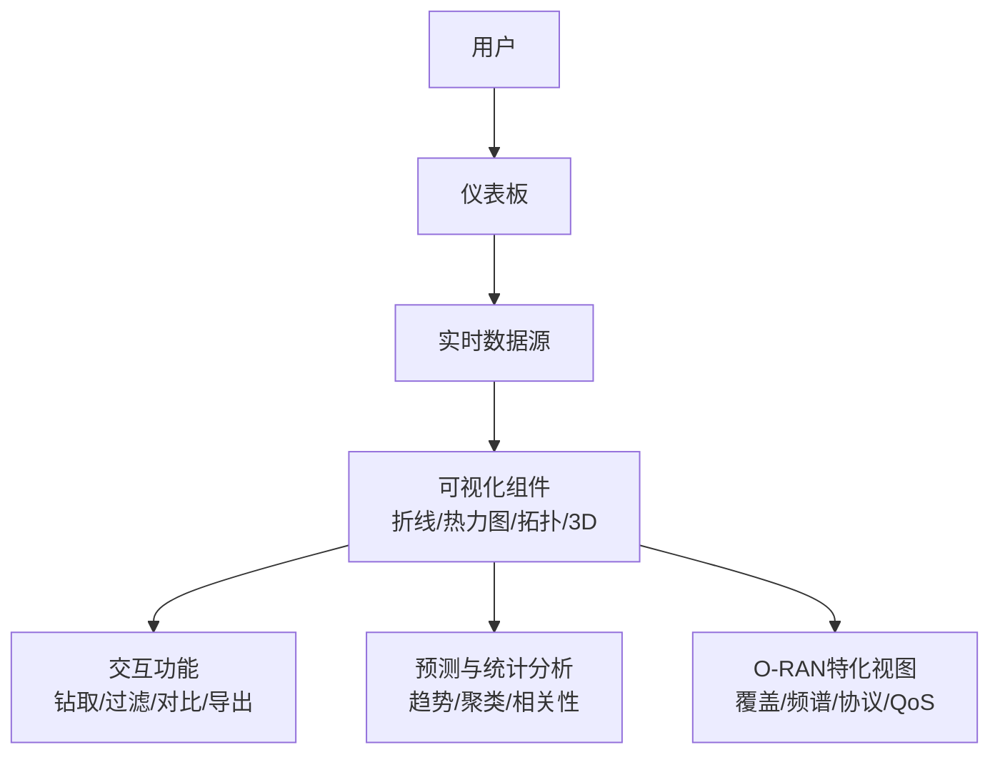
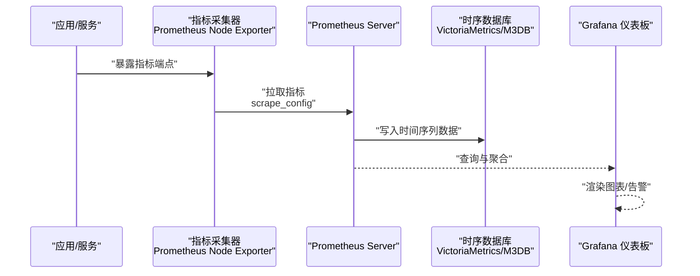
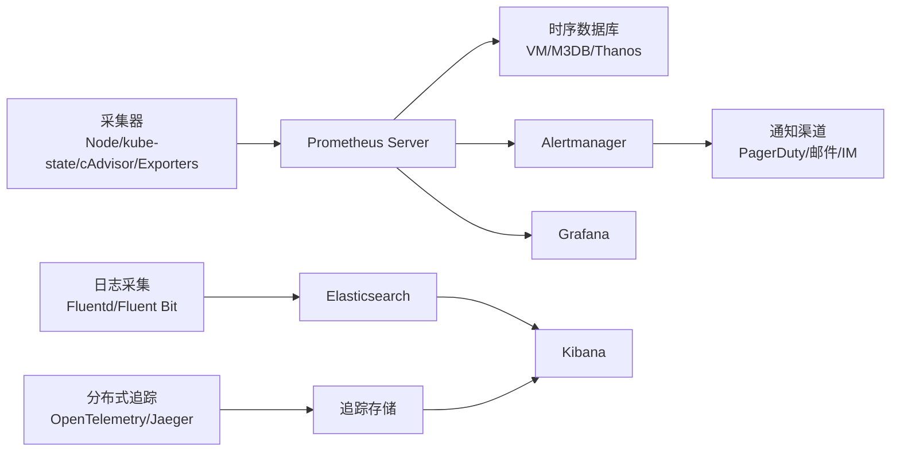

# 监控集成与观测性

<cite>
**本文引用的文件**
- [O-RAN 告警策略框架](file://28-monitoring-alerting/alert-strategy/o-ran-alert-strategy.md)
- [O-RAN 监控可视化框架](file://28-monitoring-alerting/visualization/o-ran-monitoring-visualization.md)
- [O-RAN 监控工具套件](file://28-monitoring-alerting/monitoring-tools/o-ran-monitoring-tools.md)
- [O-RAN 监控工具套件（中文）](file://28-monitoring-alerting/monitoring-tools/o-ran-monitoring-tools-zh.md)
- [O-RAN 监控度量框架](file://28-monitoring-alerting/metric-system/monitoring-metrics-framework.md)
- [O-RAN 监控度量框架（中文）](file://28-monitoring-alerting/metric-system/monitoring-metrics-framework-zh.md)
</cite>

## 目录
1. [简介](#简介)
2. [项目结构](#项目结构)
3. [核心组件](#核心组件)
4. [架构总览](#架构总览)
5. [详细组件分析](#详细组件分析)
6. [依赖关系分析](#依赖关系分析)
7. [性能考量](#性能考量)
8. [故障排查指南](#故障排查指南)
9. [结论](#结论)
10. [附录](#附录)

## 简介
本文件面向O-RAN网络的监控集成与观测性，系统化阐述监控架构设计、数据采集机制（指标、日志、链路追踪）、监控指标体系（性能、业务、基础设施）、存储与查询方案（时序数据库、日志系统、分布式追踪）、告警规则与通知集成、可视化仪表板与自定义报表，以及高可用、备份与性能优化策略。内容来源于仓库中“监控与告警”专题下的告警策略、可视化、监控工具与度量框架等文档，并结合O-RAN网络关键网元（如CU/DU/RU/RIC等）在实际部署中的观测需求进行组织与解读。

## 项目结构
围绕监控与观测性主题，仓库在“28-monitoring-alerting”目录下提供了从策略到工具再到可视化的完整文档体系，便于按需组合形成端到端的监控集成方案。

图表来源
- [O-RAN 告警策略框架](file://28-monitoring-alerting/alert-strategy/o-ran-alert-strategy.md#L1-L247)
- [O-RAN 监控可视化框架](file://28-monitoring-alerting/visualization/o-ran-monitoring-visualization.md#L1-L257)
- [O-RAN 监控工具套件](file://28-monitoring-alerting/monitoring-tools/o-ran-monitoring-tools.md#L1-L284)
- [O-RAN 监控度量框架](file://28-monitoring-alerting/metric-system/monitoring-metrics-framework.md)

章节来源
- [O-RAN 告警策略框架](file://28-monitoring-alerting/alert-strategy/o-ran-alert-strategy.md#L1-L247)
- [O-RAN 监控可视化框架](file://28-monitoring-alerting/visualization/o-ran-monitoring-visualization.md#L1-L257)
- [O-RAN 监控工具套件](file://28-monitoring-alerting/monitoring-tools/o-ran-monitoring-tools.md#L1-L284)
- [O-RAN 监控度量框架](file://28-monitoring-alerting/metric-system/monitoring-metrics-framework.md)

## 核心组件
- 告警策略：定义告警分类、严重级别、优先级评估、路由与升级、生命周期管理、噪声抑制与预测性告警，以及工具链集成与治理。
- 可视化框架：覆盖仪表板布局与视觉规范、实时数据展示、交互探索、预测与统计分析、以及O-RAN特有的无线电与协议栈视图。
- 监控工具套件：涵盖基础设施、容器平台、存储数据库、网络遥测（含E2接口、前传/射频）、应用性能与微服务可观测性、智能分析与BI集成、部署架构与安全、性能优化。
- 监控度量框架：明确指标分类、采集与计算方法、跨域映射与一致性保障。

章节来源
- [O-RAN 告警策略框架](file://28-monitoring-alerting/alert-strategy/o-ran-alert-strategy.md#L6-L247)
- [O-RAN 监控可视化框架](file://28-monitoring-alerting/visualization/o-ran-monitoring-visualization.md#L6-L257)
- [O-RAN 监控工具套件](file://28-monitoring-alerting/monitoring-tools/o-ran-monitoring-tools.md#L6-L284)
- [O-RAN 监控度量框架](file://28-monitoring-alerting/metric-system/monitoring-metrics-framework.md)

## 架构总览
下图展示了O-RAN监控系统的端到端架构：边缘采集（系统/容器/网络/应用）、汇聚与处理（Prometheus/Thanos/Cortex等）、存储（TSDB/日志/时序），以及呈现与告警（Grafana/可视化/Alertmanager/通知渠道）。

图表来源
- [O-RAN 监控工具套件](file://28-monitoring-alerting/monitoring-tools/o-ran-monitoring-tools.md#L10-L181)
- [O-RAN 监控可视化框架](file://28-monitoring-alerting/visualization/o-ran-monitoring-visualization.md#L197-L255)
- [O-RAN 告警策略框架](file://28-monitoring-alerting/alert-strategy/o-ran-alert-strategy.md#L175-L188)

## 详细组件分析

### 告警策略组件
- 告警分类：基础设施、网络、应用三类，覆盖硬件、资源、性能、安全、连通性、QoS、协议、带宽、服务不可用、处理错误、集成问题、数据一致性等。
- 严重级别：Critical/High/Medium/Low四级，结合业务影响（收入、客户体验、运营效率、合规风险、品牌声誉）进行评分与加权。
- 优先级框架：引入环境因素（时段、负载、部署阶段、季节性、地理分布）进行上下文感知优先级调整。
- 路由与升级：按组件/技能/负载均衡/地理就近路由；建立L1-L4分级响应与升级路径。
- 通知渠道：短信/语音、移动推送、即时通讯、邮件、工单系统、视频会议、知识库与状态看板。
- 生命周期管理：New→Acknowledged→In Progress→Resolved→Closed，配套MTTA/MTTR、首纠率、复现率等度量与持续改进。
- 智能处理：去噪（重复检测、关联分析、阈值优化、基线对比）、假阳性管理（ML模型、历史分析、置信度、反馈回路）、预测性告警（统计/ML/行为分析/趋势预测）。
- 工具链集成：数据采集层（Prometheus/Telegraf/SNMP）、处理引擎（Alertmanager/Elasticsearch/流处理）、通知系统（PagerDuty/Opsgenie/自定义）、可视化层（Grafana/Kibana/自定义仪表板）。
- 配置管理：YAML策略、版本控制、环境差异化、动态更新；测试框架（告警模拟、混沌工程、回归测试、性能基准）。
- 治理与合规：审计留存、变更管理、RBAC、合规报告；标准化手册、自动化Runbook、知识库、培训材料。

图表来源
- [O-RAN 告警策略框架](file://28-monitoring-alerting/alert-strategy/o-ran-alert-strategy.md#L56-L139)

章节来源
- [O-RAN 告警策略框架](file://28-monitoring-alerting/alert-strategy/o-ran-alert-strategy.md#L6-L247)

### 可视化组件
- 设计原则：层级化布局（高管/运营/技术/历史）、信息架构（优先级放置/逻辑分组/渐进披露/统一导航）、色彩与排版规范。
- 实时展示：系统健康概览（可用性/性能/资源/告警）、网络性能视图（拓扑/流量/时延热力图/带宽利用率）、时间序列（折线/面积/迷你图/水平图）、WebSocket/轮询/增量更新/降级容错。
- 交互探索：层级钻取、时间范围选择、维度过滤、对比分析、悬停/点击/缩放/导出。
- 高级分析：预测性可视化（趋势预测/容量规划/风险评估/场景建模）、ML洞察（异常检测/模式识别/相关性/聚类）、多维表示（3D拓扑/热力图/分布图/散点/平行坐标/径向图）。
- O-RAN特化：覆盖图（RSRP/RSRQ/干扰/切换边界/波束）、频谱分析（FFT/PRB/互调/频谱效率）、协议栈视图（E2接口映射/消息流/状态图）、服务质量（5QI/SLA/MOS/中断时间/用户影响/收入影响/客诉关联）。
- 技术选型：前端（React/Vue/D3/Chart.js/Plotly）、后端（GraphQL/REST/WebSocket/消息队列）、性能优化（虚拟滚动/懒加载/Canvas/Web Workers）、数据优化（聚合/渐进增强/压缩/缓存）。
- 可访问性与可用性：WCAG 2.1、屏幕阅读器、键盘导航、色盲友好、直观控件、提示、撤销/重做、可定制视图。
- 集成与部署：CI/CD（自动化测试/性能监控/安全扫描/发布）、监控与分析（用户行为/性能/错误/采用率）。

图表来源
- [O-RAN 监控可视化框架](file://28-monitoring-alerting/visualization/o-ran-monitoring-visualization.md#L6-L257)

章节来源
- [O-RAN 监控可视化框架](file://28-monitoring-alerting/visualization/o-ran-monitoring-visualization.md#L1-L257)

### 监控工具组件
- 基础设施监控：Prometheus生态（Server/Node Exporter/Alertmanager/Pushgateway）、Grafana集成（模板/告警可视化/多租户/插件）。
- 容器平台监控：kube-state-metrics/cAdvisor/Kubelet/ETCD；Helm Chart部署示例；服务网格可观测性（Istio Telemetry/Jaeger/Kiali/Mixer）。
- 存储与数据库监控：PostgreSQL/MySQL/Redis/MongoDB Exporter；Ceph/NFS/块设备/文件系统指标。
- 网络遥测：E2终止点（消息统计/订阅管理/连接健康/错误率）；RIC近实时（策略执行/服务管理/负载均衡/吞吐）；O-DU到O-RU（FH传输/射频资源/波束成形/同步）；射频性能分析（覆盖/干扰/移动性/频谱）；网络性能工具（iperf3/tc/Netperf/Wireshark）；SDN控制器（OpenDaylight/ONOS/OVS/拓扑）。
- 应用性能与微服务可观测性：xApp/rApp生命周期/资源/消息/错误；自定义指标收集示例；健康检查（K8s探针/自定义/熔断/优雅降级）；分布式追踪（OpenTelemetry/上下文传播/Span属性/采样）；日志聚合（Fluentd/Fluent Bit/Elasticsearch/Kibana/Logstash）；指标联邦（Thanos/Cortex/VictoriaMetrics/M3DB）。
- 智能分析与BI：异常检测（统计/无监督/时间序列/集成）与实现示例；预测性维护（故障预测/容量规划/性能优化/根因分析）；数据仓库（Druid/ClickHouse/Redshift/BigQuery）；仪表板编排（Metabase/Superset/Looker/Power BI）；自定义报告（Jinja2/PDF/定时/交互）。
- 部署架构：多层监控堆栈（边缘/聚合/存储/呈现）；高可用（主主复制/负载均衡/备份恢复/灾备）。
- 安全与合规：RBAC/认证集成（LDAP/OAuth/SAML）/审计日志/数据加密；GDPR/SOC 2/ISO 27001/行业法规。
- 性能优化：水平分区/查询优化/缓存/资源管理；容量规划（基数/存储/带宽/计算）。

图表来源
- [O-RAN 监控工具套件](file://28-monitoring-alerting/monitoring-tools/o-ran-monitoring-tools.md#L10-L31)
- [O-RAN 监控工具套件（中文）](file://28-monitoring-alerting/monitoring-tools/o-ran-monitoring-tools-zh.md#L10-L31)

章节来源
- [O-RAN 监控工具套件](file://28-monitoring-alerting/monitoring-tools/o-ran-monitoring-tools.md#L1-L284)
- [O-RAN 监控工具套件（中文）](file://28-monitoring-alerting/monitoring-tools/o-ran-monitoring-tools-zh.md#L1-L284)

### 监控度量框架组件
- 指标分类：性能指标（时延/吞吐/错误率/资源利用率）、业务指标（SLA/收入/用户数/满意度）、基础设施指标（CPU/内存/磁盘/网络/硬件状态）。
- 采集与计算：明确采集频率、窗口与聚合方式、百分位与时变统计、异常值处理、缺失值填补、基数控制与标签规范化。
- 跨域映射：将网元（CU/DU/RU/RIC）与接口（E2/F1/FH/OAM）的原始指标映射到统一的KPI视图，确保跨域一致性与可比性。

章节来源
- [O-RAN 监控度量框架](file://28-monitoring-alerting/metric-system/monitoring-metrics-framework.md)
- [O-RAN 监控度量框架（中文）](file://28-monitoring-alerting/metric-system/monitoring-metrics-framework-zh.md)

## 依赖关系分析
- 组件耦合：采集层与处理层通过标准协议（HTTP抓取/消息队列）解耦；存储层与呈现层通过查询接口解耦；告警层与通知层通过Webhook/集成API解耦。
- 外部依赖：Prometheus、Grafana、Alertmanager、Elasticsearch、Kibana、Jaeger、Kiali、Thanos/Cortex/VictoriaMetrics/M3DB、OpenTelemetry、各类Exporters。
- 依赖可视化：

图表来源
- [O-RAN 监控工具套件](file://28-monitoring-alerting/monitoring-tools/o-ran-monitoring-tools.md#L10-L181)
- [O-RAN 监控可视化框架](file://28-monitoring-alerting/visualization/o-ran-monitoring-visualization.md#L197-L255)
- [O-RAN 告警策略框架](file://28-monitoring-alerting/alert-strategy/o-ran-alert-strategy.md#L175-L188)

## 性能考量
- 指标基数控制：限制高基数标签数量，使用低基数聚合标签；定期审查与清理无效标签。
- 查询优化：合理设置抓取间隔与保留周期；使用分片/分区与索引策略；避免全表扫描与高成本聚合。
- 缓存与分层：在边缘与聚合层设置缓存；对热点数据进行预聚合；利用Thanos/Cortex等进行全局查询加速。
- 资源管理：为Prometheus/TSDB/日志堆栈分配专用资源；启用水平扩展与负载均衡；监控资源使用并动态扩容。
- 网络与带宽：优化抓取与传输协议；启用压缩与增量更新；跨区域部署以降低延迟。
- 容量规划：估算时间序列数量与增长趋势；规划存储与带宽；预留灾难恢复与备份空间。

## 故障排查指南
- 告警与通知
  - 检查告警规则与阈值设置，确认严重级别与路由策略是否符合预期。
  - 验证通知通道连通性与权限，确保关键告警可触达责任人。
  - 使用模拟告警与混沌工程验证告警链路的可靠性与响应时间。
- 可视化与查询
  - 核对数据源连接与查询语句，确认时间范围与聚合粒度。
  - 检查仪表板缓存与刷新策略，排除前端渲染与网络问题。
  - 使用Kibana/Elasticsearch进行日志检索与关联分析。
- 指标与采集
  - 核查采集器配置与目标可达性，确认抓取间隔与超时设置。
  - 检查Exporter输出格式与标签命名，避免指标重复或缺失。
  - 关注高基数与异常峰值，及时调整采集策略与阈值。
- 微服务与链路追踪
  - 核对追踪上下文传播与采样策略，确保关键请求可被追踪。
  - 使用Jaeger/Kiali定位慢调用与错误路径，结合日志与指标进行根因分析。
- 存储与查询
  - 监控TSDB与日志存储的容量与性能，必要时启用压缩与归档。
  - 使用Thanos/Cortex进行跨实例查询与长期存储，避免单点瓶颈。

章节来源
- [O-RAN 告警策略框架](file://28-monitoring-alerting/alert-strategy/o-ran-alert-strategy.md#L173-L218)
- [O-RAN 监控可视化框架](file://28-monitoring-alerting/visualization/o-ran-monitoring-visualization.md#L242-L255)
- [O-RAN 监控工具套件](file://28-monitoring-alerting/monitoring-tools/o-ran-monitoring-tools.md#L237-L282)

## 结论
通过将告警策略、可视化、监控工具与度量框架有机结合，O-RAN监控系统能够实现从边缘到中心、从指标到日志、从链路到业务的全栈观测。遵循本文的架构设计、指标体系、存储与查询方案、告警与通知集成、可视化与报表实践，以及高可用与性能优化策略，可显著提升系统的可观测性与运维效率，支撑O-RAN网络在复杂场景下的稳定运行与持续优化。

## 附录
- 快速参考清单
  - 告警策略：分类、级别、优先级、路由、升级、生命周期、智能处理、工具链、配置与治理。
  - 可视化：设计原则、实时展示、交互功能、高级分析、O-RAN特化视图、技术栈与性能优化。
  - 监控工具：基础设施/容器/存储/网络遥测/应用性能/微服务可观测性/智能分析/BI集成/部署与安全/性能优化。
  - 度量框架：指标分类、采集与计算、跨域映射。