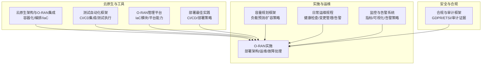
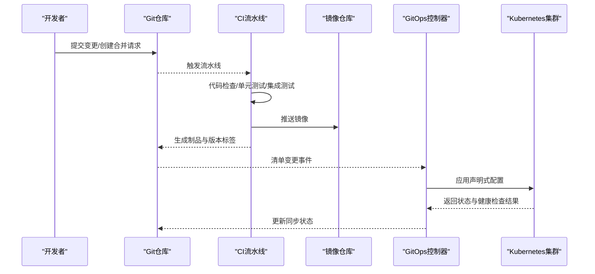
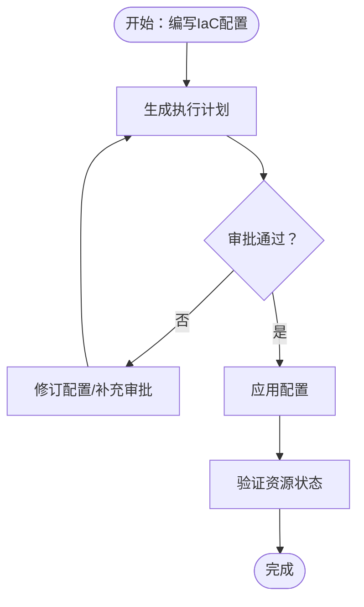
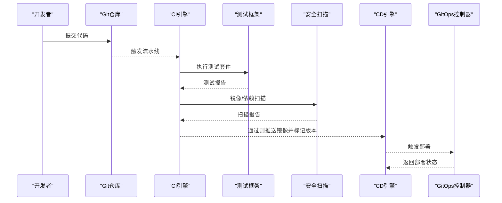
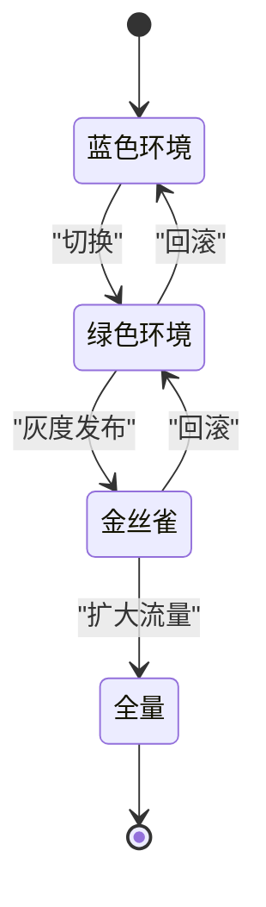
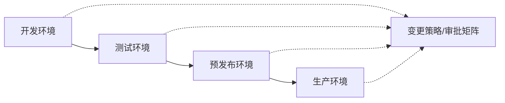
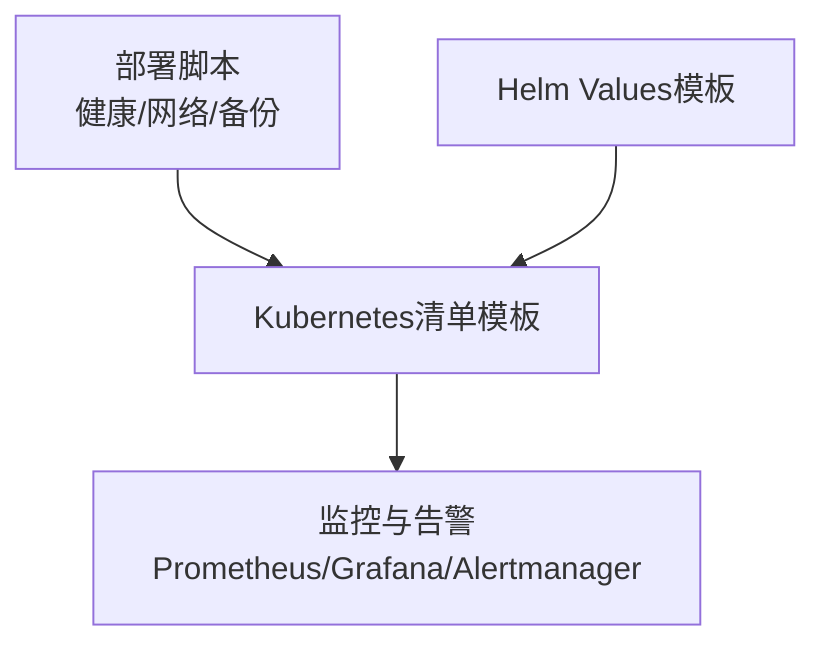
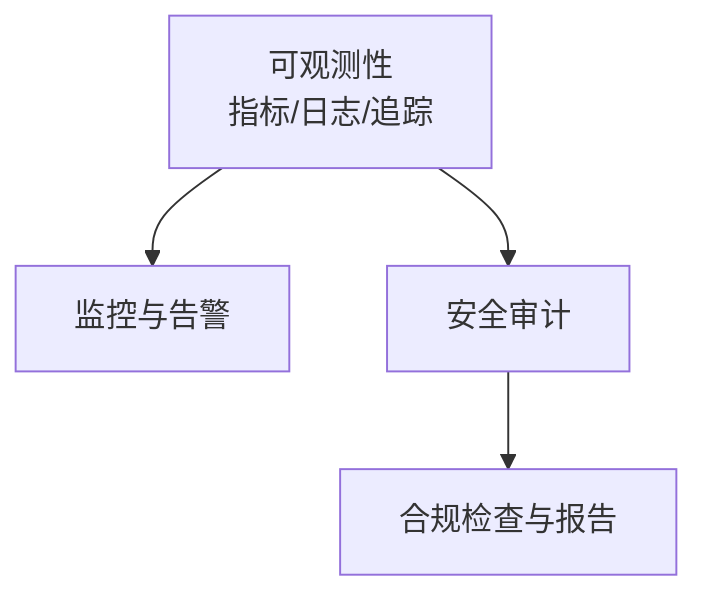
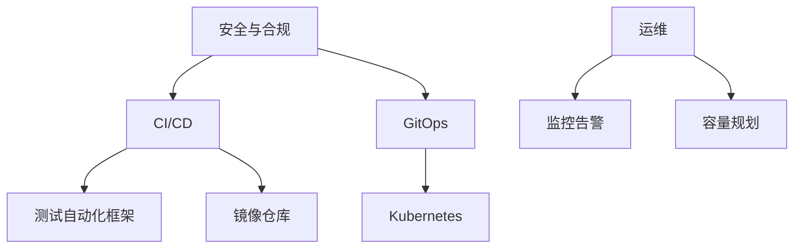

# 自动化部署与CI/CD

<cite>
**本文引用的文件**   
- [O-RAN实施](file://08-deployment-implementation/readme.md)
- [云原生架构与O-RAN集成](file://05-cloud-integration/cloud-native-architecture.md)
- [测试自动化框架](file://13-testing-validation/automation-framework/test-automation-framework.md)
- [日常运维规程](file://14-operations-management/daily-operations/daily-operation-procedures.md)
- [容量规划框架](file://14-operations-management/capacity-planning/capacity-planning-framework.md)
- [监控与告警系统](file://28-monitoring-alerting/readme.md)
- [合规与审计框架](file://12-security-privacy/compliance-auditing/compliance-auditing-framework.md)
- [O-RAN管理平台](file://22-tool-platforms/management-platforms/o-ran-management-platforms.md)
- [O-RAN最佳实践-部署实践](file://30-best-practices/deployment-practices/o-ran-deployment-best-practices.md)
</cite>

## 目录
1. [引言](#引言)
2. [项目结构](#项目结构)
3. [核心组件](#核心组件)
4. [架构总览](#架构总览)
5. [详细组件分析](#详细组件分析)
6. [依赖分析](#依赖分析)
7. [性能考虑](#性能考虑)
8. [故障排查指南](#故障排查指南)
9. [结论](#结论)
10. [附录](#附录)

## 引言
本文件面向O-RAN自动化部署与CI/CD，围绕“GitOps工作流、声明式配置、基础设施即代码”三大基石，系统阐述从代码提交到部署发布的完整流水线；结合蓝绿部署、金丝雀发布等策略，给出版本管理与回滚机制；并提供开发/测试/生产环境的隔离与同步方案，以及部署脚本、配置模板与监控告警的集成思路。同时覆盖可观测性、安全审计与合规检查，帮助团队建立稳定、可追溯、可审计的自动化交付体系。

## 项目结构
该仓库以主题域划分内容，与自动化部署密切相关的关键目录如下：
- 05-cloud-integration：云原生与O-RAN集成，强调容器化、微服务、编排与基础设施即代码
- 08-deployment-implementation：实施层面的部署架构、硬件规划、运维与故障处理
- 13-testing-validation：测试自动化框架，支撑CI/CD中的测试阶段
- 14-operations-management：日常运维、容量规划、性能优化与监控告警
- 12-security-privacy：合规与审计框架，提供安全与合规的落地方法
- 22-tool-platforms：管理平台与工具链，包含基础设施即代码示例
- 30-best-practices：部署最佳实践，涵盖CI/CD与部署策略

**章节来源**
- file://05-cloud-integration/cloud-native-architecture.md#L1-L481
- file://08-deployment-implementation/readme.md#L1-L353
- file://13-testing-validation/automation-framework/test-automation-framework.md#L1-L134
- file://14-operations-management/daily-operations/daily-operation-procedures.md#L1-L443
- file://14-operations-management/capacity-planning/capacity-planning-framework.md#L1-L505
- file://28-monitoring-alerting/readme.md#L1-L95
- file://12-security-privacy/compliance-auditing/compliance-auditing-framework.md#L1-L486
- file://22-tool-platforms/management-platforms/o-ran-management-platforms.md#L618-L709
- file://30-best-practices/deployment-practices/o-ran-deployment-best-practices.md#L100-L130

## 核心组件
- GitOps与声明式配置
  - 以Git为单一事实来源，通过声明式清单（如Kubernetes manifests）描述目标状态，由GitOps控制器（如ArgoCD）持续对齐实际状态。
  - 关键要点：变更走分支与合并，自动化校验与审批，变更可追溯与可回滚。
- 基础设施即代码（IaC）
  - 使用Terraform等工具将网络、计算、安全策略等基础设施以代码形式管理，实现版本化、可复用、可审计。
- CI/CD流水线
  - 触发：代码提交/合并请求
  - 执行：自动构建镜像、单元测试、集成测试、安全扫描、部署发布
  - 回滚：一键回滚至上一个稳定版本
- 部署策略
  - 蓝绿部署：零停机切换，失败快速回切
  - 金丝雀发布：按流量比例灰度放量，结合监控阈值动态扩缩
  - 回滚机制：版本标记、镜像标签、配置快照、变更记录
- 监控与告警
  - 指标采集（Prometheus）、日志聚合（ELK）、可视化（Grafana）、告警聚合（Alertmanager）
- 安全与合规
  - 审计证据收集、合规检查清单、第三方审计准备、持续合规监控

**章节来源**
- file://08-deployment-implementation/readme.md#L180-L196
- file://05-cloud-integration/cloud-native-architecture.md#L51-L64
- file://13-testing-validation/automation-framework/test-automation-framework.md#L15-L21
- file://28-monitoring-alerting/readme.md#L63-L76
- file://12-security-privacy/compliance-auditing/compliance-auditing-framework.md#L432-L486
- file://30-best-practices/deployment-practices/o-ran-deployment-best-practices.md#L100-L130

## 架构总览
下图展示了从代码到生产的端到端自动化交付路径，以及与云原生、测试、运维、监控、合规的耦合关系。

```mermaid
graph TB
Dev["开发者提交代码<br/>Git仓库"] --> CI["CI流水线<br/>构建/测试/扫描"]
CI --> Registry["容器镜像仓库"]
CI --> Test["测试执行<br/>自动化测试框架"]
CI --> Release["制品归档/版本标记"]
Registry --> CD["CD流水线<br/>GitOps/部署"]
CD --> Argo["GitOps控制器<br/>ArgoCD"]
Argo --> K8s["Kubernetes集群<br/>声明式配置"]
K8s --> Apps["O-RAN组件<br/>CU/DU/RIC/SMO"]
Ops["运维与容量规划<br/>健康检查/变更管理"] --> K8s
Mon["监控与告警<br/>指标/日志/可视化"] --> K8s
Sec["安全与合规<br/>审计证据/合规检查"] --> CD
CI -.-> Mon
CI -.-> Sec
CD -.-> Ops
```

**图表来源**
- file://05-cloud-integration/cloud-native-architecture.md#L177-L234
- file://13-testing-validation/automation-framework/test-automation-framework.md#L79-L84
- file://28-monitoring-alerting/readme.md#L63-L76
- file://12-security-privacy/compliance-auditing/compliance-auditing-framework.md#L432-L486
- file://14-operations-management/daily-operations/daily-operation-procedures.md#L163-L281

## 详细组件分析

### GitOps与声明式配置
- 工作流
  - 开发者在特性分支提交变更，发起合并请求，触发CI流水线
  - CI通过静态检查、单元测试、集成测试后，生成镜像并推送到镜像仓库
  - GitOps控制器（如ArgoCD）检测到清单变更，自动将目标状态同步到集群
- 关键实践
  - 清单版本化：所有资源配置纳入Git，变更可审计
  - 权限最小化：GitOps控制器仅具备读取权限，部署权限受控
  - 变更审批：关键环境采用双人审批或批准矩阵
- 风险控制
  - 自动化回滚：当新版本出现异常，可快速回退至上一个已知稳定版本
  - 健康检查：部署后进行就绪/存活探针与端到端连通性验证

**章节来源**
- file://08-deployment-implementation/readme.md#L180-L196
- file://05-cloud-integration/cloud-native-architecture.md#L177-L234

### 基础设施即代码（IaC）
- Terraform模块化
  - 提供Kubernetes集群、网络子网、安全组等模块，统一管理多云/混合云资源
  - 通过变量抽象环境差异，实现一套代码适配开发/测试/生产
- 网络与安全
  - VPC/VNet、子网划分、安全组/防火墙规则、DNS与证书管理
  - 针对O-RAN接口端口（如E2、O1）配置入站规则
- 自动化运维
  - 结合Ansible/Shell脚本完成系统初始化、内核参数调优、NUMA绑定等

**章节来源**
- file://22-tool-platforms/management-platforms/o-ran-management-platforms.md#L618-L709
- file://14-operations-management/daily-operations/daily-operation-procedures.md#L163-L217

### CI/CD流水线设计与配置
- 触发与阶段
  - 触发：提交/合并请求
  - 阶段：构建（镜像）、测试（单元/集成/安全扫描）、部署（GitOps/直接部署）、验证（健康检查/端到端测试）
- 测试集成
  - 在CI中执行冒烟测试、回归测试、性能回归测试
  - 与测试自动化框架对接，实现测试数据管理、并行执行与结果分析
- 安全扫描
  - 镜像漏洞扫描、依赖许可证检查、配置基线扫描
- 发布与回滚
  - 版本标签与制品归档，支持一键回滚至上一个稳定版本

**章节来源**
- file://13-testing-validation/automation-framework/test-automation-framework.md#L79-L84
- file://30-best-practices/deployment-practices/o-ran-deployment-best-practices.md#L117-L130

### 版本管理策略：蓝绿部署、金丝雀发布与回滚
- 蓝绿部署
  - 两套完全相同的生产环境（蓝/绿），切换时仅暴露新版本，失败立即切回旧版本
  - 适用于重大功能或架构变更，风险可控
- 金丝雀发布
  - 以小流量（如1%-10%）导入新版本，结合延迟、错误率等指标动态扩大流量
  - 与HPA/VPA配合，实现弹性扩缩
- 回滚机制
  - 版本标签与镜像标签规范化；配置快照与数据库迁移脚本版本化
  - 回滚时可一键恢复到上一个稳定版本，必要时回滚数据库迁移

**章节来源**
- file://08-deployment-implementation/readme.md#L296-L321
- file://05-cloud-integration/cloud-native-architecture.md#L215-L220

### 部署环境管理：开发/测试/生产隔离与同步
- 隔离
  - 环境分离：开发、测试、预发布、生产各自独立的命名空间/集群/账号
  - 网络隔离：VPC/Subnet/安全组区分；服务网格/网络策略限制跨环境访问
- 同步
  - 通过Git分支策略与发布通道，将变更有序同步至下游环境
  - 配置差异化：通过环境变量/ConfigMap/Helm Values管理
- 变更治理
  - 变更请求（CR）模板、影响评估、回滚预案、审批流程与审计日志

**章节来源**
- file://14-operations-management/daily-operations/daily-operation-procedures.md#L219-L281

### 部署脚本、配置模板与监控告警集成
- 部署脚本
  - 健康检查脚本：定时探测组件健康状态，异常告警
  - 网络监控脚本：带宽利用率、丢包率、延迟阈值告警
  - 配置备份与恢复：定时备份配置，支持灾难恢复演练
- 配置模板
  - Kubernetes Deployment/Service/HPA/NetworkPolicy等清单模板
  - Helm Values模板：按环境覆盖关键参数
- 监控告警
  - Prometheus指标、Grafana仪表盘、Alertmanager告警规则
  - 面向O-RAN接口的延迟、吞吐、错误率等KPI

**章节来源**
- file://14-operations-management/daily-operations/daily-operation-procedures.md#L8-L66
- file://28-monitoring-alerting/readme.md#L63-L95

### 可观测性、安全审计与合规检查
- 可观测性
  - 指标：CPU/内存/网络/接口延迟/吞吐
  - 日志：ELK/EFK收集与检索
  - 追踪：分布式追踪（Jaeger/Zipkin）定位端到端瓶颈
- 安全审计
  - 审计证据收集：系统信息、安全配置、网络配置、应用证据、合规证据
  - 合规检查：GDPR、ETSI标准、3GPP安全要求
- 合规监控
  - 持续合规仪表盘：合规分数、控制有效性、审计发现解决率、监管状态

**章节来源**
- file://28-monitoring-alerting/readme.md#L6-L95
- file://12-security-privacy/compliance-auditing/compliance-auditing-framework.md#L432-L486

## 依赖分析
- 组件耦合
  - CI/CD依赖测试自动化框架与镜像仓库
  - GitOps依赖Kubernetes集群与声明式配置
  - 运维依赖监控与告警系统，容量规划依赖历史数据与预测模型
  - 安全与合规贯穿全链路，提供审计证据与合规报告
- 外部依赖
  - 云平台（AWS/Azure/GCP/VMware）与多云网络
  - 开源监控栈（Prometheus/Grafana/ELK/Alertmanager）

**章节来源**
- file://13-testing-validation/automation-framework/test-automation-framework.md#L15-L21
- file://28-monitoring-alerting/readme.md#L63-L76
- file://14-operations-management/capacity-planning/capacity-planning-framework.md#L1-L505
- file://12-security-privacy/compliance-auditing/compliance-auditing-framework.md#L432-L486

## 性能考虑
- 网络层优化
  - 关闭可能导致抖动的网络卸载、增大环形缓冲、Jumbo帧、优先队列与流量整形
  - NUMA感知的中断亲和与CPU亲和绑定
- 计算层优化
  - 容器资源请求/限制、垃圾回收参数、Go内存上限
  - NUMA本地内存绑定、内核调度器参数调优
- 应用层优化
  - Kubernetes资源优化（HPA/VPA）、探针配置、优雅终止
- 监控与自动调优
  - 基于指标的趋势分析与自动扩缩策略，生成性能优化报告

**章节来源**
- file://14-operations-management/performance-optimization/performance-optimization-framework.md#L8-L101
- file://14-operations-management/performance-optimization/performance-optimization-framework.md#L103-L234
- file://14-operations-management/performance-optimization/performance-optimization-framework.md#L236-L376
- file://14-operations-management/performance-optimization/performance-optimization-framework.md#L378-L648

## 故障排查指南
- 常见问题分类
  - 接口类：E2/A1/O1/O-FH/F1接口异常
  - 性能类：延迟、吞吐、丢包
  - 可用性类：服务中断、降级
  - 配置类：配置冲突、参数错误
  - 兼容性类：多厂商互通问题
- 排查流程
  - 问题定义与范围界定、信息收集（日志/指标/配置）、假设验证、根因分析、修复验证
- 诊断工具
  - 网络分析（Wireshark/tcpdump）、协议分析（E2/A1/O1）、日志分析（ELK/Splunk）、性能分析（Perf/火焰图）
- SOP与知识库
  - 故障响应、升级、沟通、复盘与知识沉淀

**章节来源**
- file://08-deployment-implementation/readme.md#L126-L157
- file://14-operations-management/daily-operations/daily-operation-procedures.md#L283-L359

## 结论
通过GitOps、声明式配置与基础设施即代码，O-RAN可以实现可重复、可追溯、可审计的自动化交付；结合蓝绿/金丝雀发布与完善的回滚机制，能够在保障业务连续性的同时快速迭代；以监控告警与安全合规贯穿全生命周期，确保系统可观测、可治理、可合规。建议从IaC模块化与GitOps控制器入手，逐步完善CI/CD流水线与测试自动化，最终形成端到端的自动化交付体系。

## 附录
- 关键参考文件索引
  - [O-RAN实施](file://08-deployment-implementation/readme.md#L1-L353)
  - [云原生架构与O-RAN集成](file://05-cloud-integration/cloud-native-architecture.md#L1-L481)
  - [测试自动化框架](file://13-testing-validation/automation-framework/test-automation-framework.md#L1-L134)
  - [日常运维规程](file://14-operations-management/daily-operations/daily-operation-procedures.md#L1-L443)
  - [容量规划框架](file://14-operations-management/capacity-planning/capacity-planning-framework.md#L1-L505)
  - [监控与告警系统](file://28-monitoring-alerting/readme.md#L1-L95)
  - [合规与审计框架](file://12-security-privacy/compliance-auditing/compliance-auditing-framework.md#L1-L486)
  - [O-RAN管理平台](file://22-tool-platforms/management-platforms/o-ran-management-platforms.md#L618-L709)
  - [O-RAN最佳实践-部署实践](file://30-best-practices/deployment-practices/o-ran-deployment-best-practices.md#L100-L130)