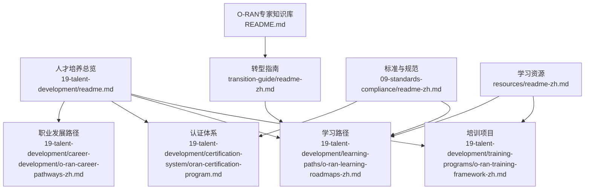
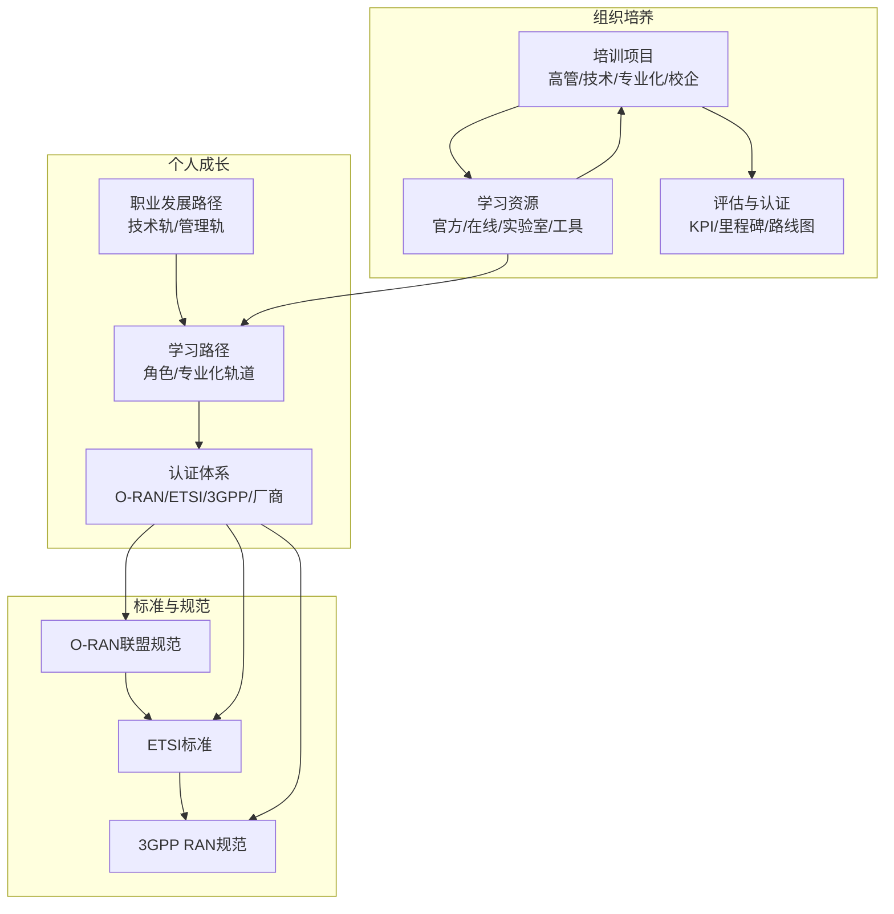
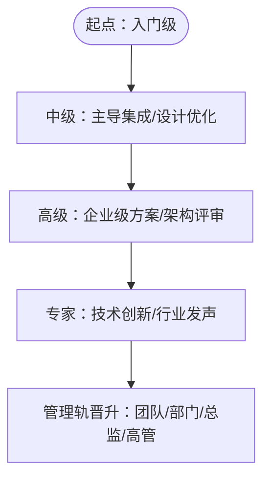
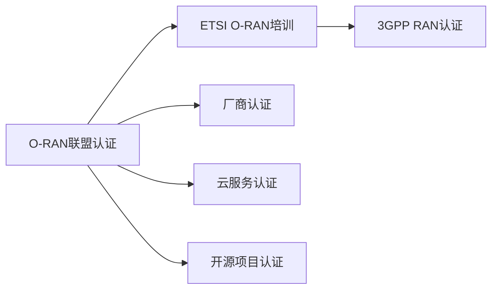
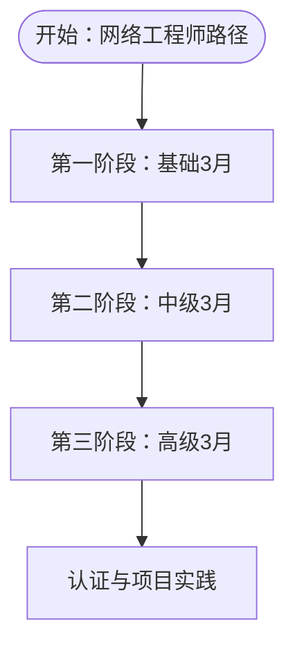
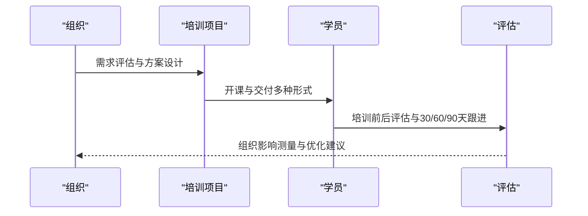
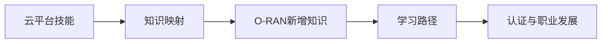
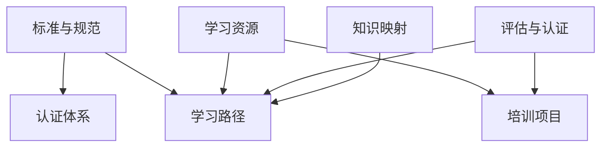

# 人才培养

<cite>
**本文引用的文件**
- [O-RAN专家职业发展框架](file://19-talent-development/career-development/o-ran-career-pathways-zh.md)
- [O-RAN人才认证体系](file://19-talent-development/certification-system/oran-certification-program.md)
- [O-RAN学习路径](file://19-talent-development/learning-paths/o-ran-learning-roadmaps-zh.md)
- [O-RAN培训项目](file://19-talent-development/training-programs/o-ran-training-framework-zh.md)
- [O-RAN人才发展总览](file://19-talent-development/readme.md)
- [云平台到O-RAN专家转型指南](file://transition-guide/readme-zh.md)
- [O-RAN标准与规范](file://09-standards-compliance/readme-zh.md)
- [O-RAN学习资源](file://resources/readme-zh.md)
- [O-RAN专家知识库](file://README.md)
</cite>

## 目录
1. [引言](#引言)
2. [项目结构](#项目结构)
3. [核心组件](#核心组件)
4. [架构总览](#架构总览)
5. [详细组件分析](#详细组件分析)
6. [依赖分析](#依赖分析)
7. [性能考虑](#性能考虑)
8. [故障排除指南](#故障排除指南)
9. [结论](#结论)
10. [附录](#附录)

## 引言
本文件面向O-RAN人才培养，围绕“职业发展路径—认证体系—学习路径—培训项目—能力评估”五大支柱，系统化构建O-RAN专家的技能成长地图与组织内训体系。内容来源于仓库中“19-talent-development”“transition-guide”“09-standards-compliance”“resources”等权威文档，既覆盖个人成长，也兼顾组织落地。

## 项目结构
人才培养相关的内容分布在以下子目录与文件：
- 人才发展总览：明确训练体系、认证体系、学习路径与职业通道
- 职业发展：提供技术与管理双轨晋升、技能画像与KPI
- 认证体系：汇总O-RAN联盟、ETSI、3GPP及厂商认证
- 学习路径：按角色与专业化方向给出阶段性目标与资源
- 培训项目：企业内训、专业化模块、校企合作与定制方案
- 转型指南：云平台到O-RAN专家的知识映射与学习路径
- 标准与规范：支撑认证与实践的依据
- 学习资源：官方文档、在线课程、实验室与工具

**图表来源**
- [O-RAN人才发展总览](file://19-talent-development/readme.md#L1-L71)
- [O-RAN专家职业发展框架](file://19-talent-development/career-development/o-ran-career-pathways-zh.md#L1-L268)
- [O-RAN人才认证体系](file://19-talent-development/certification-system/oran-certification-program.md#L1-L114)
- [O-RAN学习路径](file://19-talent-development/learning-paths/o-ran-learning-roadmaps-zh.md#L1-L297)
- [O-RAN培训项目](file://19-talent-development/training-programs/o-ran-training-framework-zh.md#L1-L329)
- [云平台到O-RAN专家转型指南](file://transition-guide/readme-zh.md#L1-L116)
- [O-RAN标准与规范](file://09-standards-compliance/readme-zh.md#L1-L371)
- [O-RAN学习资源](file://resources/readme-zh.md#L1-L126)
- [O-RAN专家知识库](file://README.md#L1-L365)

**章节来源**
- [O-RAN人才发展总览](file://19-talent-development/readme.md#L1-L71)
- [O-RAN专家知识库](file://README.md#L1-L365)

## 核心组件
- 职业发展路径：技术轨与管理轨双通道，分入门、中级、高级、专家四个层级，配套软技能与硬技能画像
- 认证体系：O-RAN联盟认证、ETSI O-RAN培训、3GPP RAN认证、厂商认证与云服务认证
- 学习路径：按角色（网络工程师、RIC开发者）与专业化轨道（安全、云基础设施、无线优化）设计阶段性目标与资源
- 培训项目：企业高管领导力、技术实施强化、专业化模块、校企合作与定制化方案
- 评估与认证：个人KPI、里程碑追踪、进度跟踪与认证路线图
- 转型与标准：云平台技能映射到O-RAN知识，标准与规范驱动实践与认证

**章节来源**
- [O-RAN专家职业发展框架](file://19-talent-development/career-development/o-ran-career-pathways-zh.md#L6-L268)
- [O-RAN人才认证体系](file://19-talent-development/certification-system/oran-certification-program.md#L1-L114)
- [O-RAN学习路径](file://19-talent-development/learning-paths/o-ran-learning-roadmaps-zh.md#L1-L297)
- [O-RAN培训项目](file://19-talent-development/training-programs/o-ran-training-framework-zh.md#L1-L329)
- [云平台到O-RAN专家转型指南](file://transition-guide/readme-zh.md#L1-L116)
- [O-RAN标准与规范](file://09-standards-compliance/readme-zh.md#L1-L371)
- [O-RAN学习资源](file://resources/readme-zh.md#L1-L126)

## 架构总览
下图展示“个人成长—组织培养—能力认证”的闭环架构，强调以标准与规范为依据，以认证为杠杆，以学习路径与培训项目为抓手，最终实现组织能力与个人发展的双轮驱动。

**图表来源**
- [O-RAN专家职业发展框架](file://19-talent-development/career-development/o-ran-career-pathways-zh.md#L6-L268)
- [O-RAN人才认证体系](file://19-talent-development/certification-system/oran-certification-program.md#L1-L114)
- [O-RAN学习路径](file://19-talent-development/learning-paths/o-ran-learning-roadmaps-zh.md#L1-L297)
- [O-RAN培训项目](file://19-talent-development/training-programs/o-ran-training-framework-zh.md#L1-L329)
- [O-RAN标准与规范](file://09-standards-compliance/readme-zh.md#L1-L371)
- [O-RAN学习资源](file://resources/readme-zh.md#L1-L126)

## 详细组件分析

### 职业发展路径与能力画像
- 技术轨：入门（0-2年）→ 中级（2-5年）→ 高级（5-8年）→ 专家（8+年），职责与技能逐级递进
- 管理轨：团队主管（2-4年）→ 部门经理（5-8年）→ 总监（8-12年）→ 高管（12+年），强调战略与跨部门协同
- 能力画像：网络基础、云原生、O-RAN专项、自动化与DevOps、软技能（领导力、沟通、商业敏锐度）

**图表来源**
- [O-RAN专家职业发展框架](file://19-talent-development/career-development/o-ran-career-pathways-zh.md#L8-L100)

**章节来源**
- [O-RAN专家职业发展框架](file://19-talent-development/career-development/o-ran-career-pathways-zh.md#L6-L268)

### 认证体系与备考建议
- 官方认证：O-RAN联盟Associate/Professional/Expert；ETSI O-RAN培训；3GPP RAN认证
- 厂商认证：Ericsson、Nokia、Samsung、ZTE、Huawei等
- 云服务认证：AWS、Azure、GCP相关专业认证
- 开源项目认证：LFCS、CNCF、ONAP、ONF等
- 备考路径：基础知识→专业技能→实战应用；推荐资源与考试要点

**图表来源**
- [O-RAN人才认证体系](file://19-talent-development/certification-system/oran-certification-program.md#L6-L114)

**章节来源**
- [O-RAN人才认证体系](file://19-talent-development/certification-system/oran-certification-program.md#L1-L114)

### 学习路径与阶段性目标
- 网络工程师路径：基础（3个月）→ 中级（3个月）→ 高级（3个月），覆盖架构、组件配置、网络管理与故障排查、高级功能与性能优化、项目领导力
- RIC开发者路径：编程基础（2个月）→ RIC开发技能（3个月）→ 生产部署（3个月），覆盖Python、容器、API、xApp开发、ML/AI集成、CI/CD与可扩展性
- 专业化轨道：安全专家（6-8个月）、云基础设施（4-6个月）、无线优化（5-7个月）
- 评估与认证：周/月/季跟踪，认证路线图（入门→中级→高级→领导级）

**图表来源**
- [O-RAN学习路径](file://19-talent-development/learning-paths/o-ran-learning-roadmaps-zh.md#L8-L100)

**章节来源**
- [O-RAN学习路径](file://19-talent-development/learning-paths/o-ran-learning-roadmaps-zh.md#L1-L297)

### 培训项目与交付模式
- 高管领导力项目：2天强化，战略、技术架构、风险管理与治理、实践工作坊
- 技术实施项目：5天强化，理论+实践，覆盖架构、组件、RIC开发、高级功能与生产部署
- 专业化模块：安全与合规、云原生O-RAN
- 校企合作：学术证书项目与研究合作
- 定制化方案：需求评估→项目设计→实施→评估优化
- 交付选项：现场/虚拟/自定进度/混合/培训师培训
- 效果指标：培训前后评估、组织影响测量（技能转化率、绩效改进、项目成功率、留存、创新指数）

**图表来源**
- [O-RAN培训项目](file://19-talent-development/training-programs/o-ran-training-framework-zh.md#L250-L329)

**章节来源**
- [O-RAN培训项目](file://19-talent-development/training-programs/o-ran-training-framework-zh.md#L1-L329)

### 转型指南与标准规范
- 知识映射：云基础设施→O-RAN部署架构、虚拟化→CU/DU虚拟化、容器编排→O-RAN服务管理、监控与可观测性→O-RAN运维、安全→O-RAN安全、自动化→RIC与xApps、DevOps→O-RAN CI/CD、可扩展性→RAN容量管理
- 学习路径：O-RAN基础→技术架构与接口→O-RAN实施→高级技术→标准与行业实践
- 认证与职业发展：O-RAN联盟认证、ETSI O-RAN培训、3GPP RAN认证、厂商特定认证；职业路径与专业发展

**图表来源**
- [云平台到O-RAN专家转型指南](file://transition-guide/readme-zh.md#L6-L92)

**章节来源**
- [云平台到O-RAN专家转型指南](file://transition-guide/readme-zh.md#L1-L116)
- [O-RAN标准与规范](file://09-standards-compliance/readme-zh.md#L1-L371)

### 能力评估与认证框架
- 个人KPI：代码质量、项目按时交付、知识分享、创新（专利）
- 职业里程碑：1-2年基础建设、3-5年专业化发展、6-8年领导力准备、9年起高管准备
- 评估与认证：周/月/季跟踪，认证路线图，学习效果与长期影响指标

**章节来源**
- [O-RAN专家职业发展框架](file://19-talent-development/career-development/o-ran-career-pathways-zh.md#L219-L268)
- [O-RAN学习路径](file://19-talent-development/learning-paths/o-ran-learning-roadmaps-zh.md#L231-L297)

## 依赖分析
- 认证依赖标准：O-RAN联盟、ETSI、3GPP规范是认证与实践的依据
- 学习依赖资源：官方文档、在线课程、实验室与工具支撑学习路径
- 培训依赖评估：培训前后评估与组织影响测量保障培训投资回报
- 转型依赖映射：云平台技能与O-RAN知识的映射决定学习重点与节奏

**图表来源**
- [O-RAN标准与规范](file://09-standards-compliance/readme-zh.md#L1-L371)
- [O-RAN学习资源](file://resources/readme-zh.md#L1-L126)
- [O-RAN学习路径](file://19-talent-development/learning-paths/o-ran-learning-roadmaps-zh.md#L1-L297)
- [O-RAN培训项目](file://19-talent-development/training-programs/o-ran-training-framework-zh.md#L1-L329)
- [云平台到O-RAN专家转型指南](file://transition-guide/readme-zh.md#L1-L116)

**章节来源**
- [O-RAN标准与规范](file://09-standards-compliance/readme-zh.md#L1-L371)
- [O-RAN学习资源](file://resources/readme-zh.md#L1-L126)
- [O-RAN学习路径](file://19-talent-development/learning-paths/o-ran-learning-roadmaps-zh.md#L1-L297)
- [O-RAN培训项目](file://19-talent-development/training-programs/o-ran-training-framework-zh.md#L1-L329)
- [云平台到O-RAN专家转型指南](file://transition-guide/readme-zh.md#L1-L116)

## 性能考虑
- 学习效率：阶段性目标与资源匹配，避免“广而不精”，确保“知识保留率>85%、技能应用>90%”
- 培训ROI：通过“技能转化率、项目成功率、绩效改进、留存指标、创新指数”量化组织收益
- 认证杠杆：以认证为牵引，带动薪资增长与职位晋升，建议“定期更新、实践经验、知识分享、网络建设”

## 故障排除指南
- 认证未通过：对照备考建议（理论、实操、案例、时间管理、心理准备），复盘薄弱环节
- 学习停滞：调整学习路径（加速/综合/管理轨道），增加实践项目与同伴代码审查
- 培训效果不佳：完善评估框架（培训前/中/后），优化交付形式与资源支持
- 标准不一致：回归标准与规范（O-RAN联盟、ETSI、3GPP），开展差距分析与补强

**章节来源**
- [O-RAN人才认证体系](file://19-talent-development/certification-system/oran-certification-program.md#L60-L114)
- [O-RAN学习路径](file://19-talent-development/learning-paths/o-ran-learning-roadmaps-zh.md#L231-L297)
- [O-RAN培训项目](file://19-talent-development/training-programs/o-ran-training-framework-zh.md#L285-L329)
- [O-RAN标准与规范](file://09-standards-compliance/readme-zh.md#L110-L161)

## 结论
以“标准与规范”为纲、“认证为杠杆”、“学习路径与培训项目”为抓手、“评估与认证”为闭环，构建个人成长与组织能力双轮驱动的人才培养体系。建议组织优先建立“认证导向的学习路径+分级培训项目+持续评估机制”，并配套“知识映射与转型指南”，确保人才供给与业务发展同频共振。

## 附录
- 学习资源索引：官方文档、在线课程、实验室与工具、认证项目
- 标准与规范索引：O-RAN联盟、ETSI、3GPP关键规范与白皮书
- 职业发展通道：技术专家与管理双轨，明确晋升标准与KPI

**章节来源**
- [O-RAN学习资源](file://resources/readme-zh.md#L1-L126)
- [O-RAN标准与规范](file://09-standards-compliance/readme-zh.md#L1-L371)
- [O-RAN专家知识库](file://README.md#L198-L288)