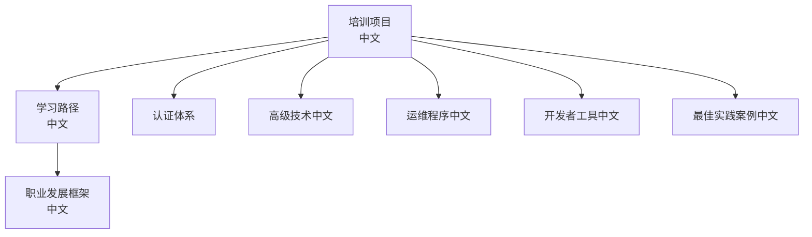
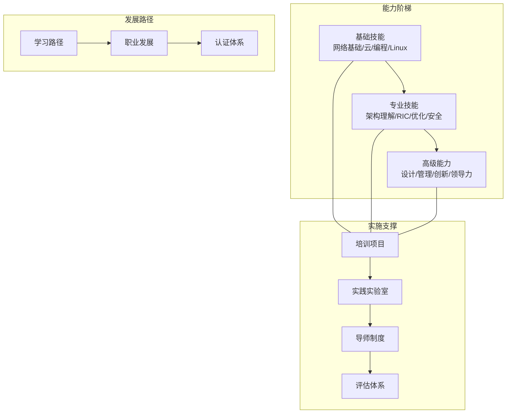
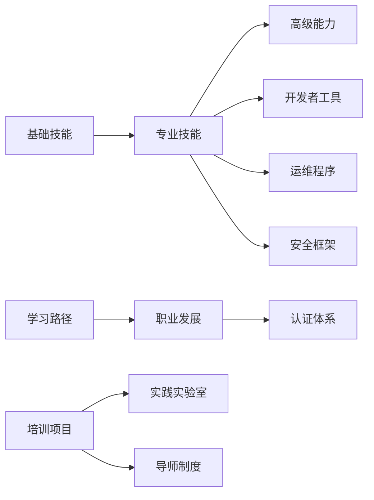
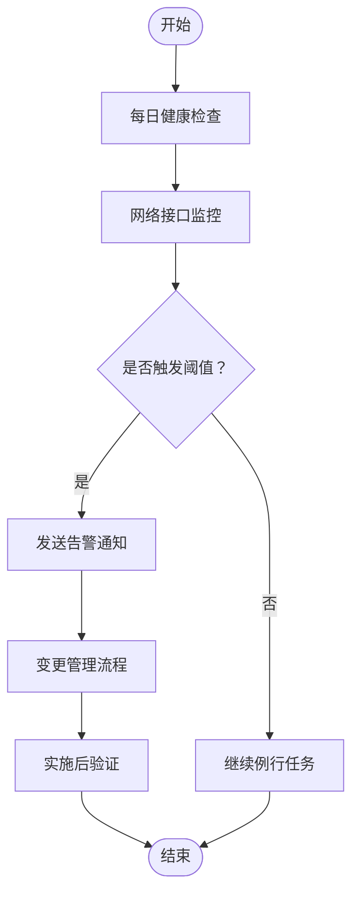

# 培训项目

<cite>
**本文引用的文件**
- [O-RAN 培训项目（中文）](file://19-talent-development/training-programs/o-ran-training-framework-zh.md)
- [O-RAN 学习路径（中文）](file://19-talent-development/learning-paths/o-ran-learning-roadmaps-zh.md)
- [O-RAN 职业发展框架（中文）](file://19-talent-development/career-development/o-ran-career-pathways-zh.md)
- [O-RAN 人才认证体系](file://19-talent-development/certification-system/oran-certification-program.md)
- [O-RAN 高级技术（中文）](file://07-ric-development/readme-zh.md)
- [O-RAN 日常运维程序（中文）](file://14-operations-management/daily-operations/daily-operation-procedures-zh.md)
- [O-RAN 开发者工具和SDK（中文）](file://17-open-source-ecosystem/developer-tools/oran-development-tools-zh.md)
- [O-RAN 最佳实践案例（中文）](file://21-case-studies/best-practices/o-ran-best-practice-cases-zh.md)
</cite>

## 目录
1. [引言](#引言)
2. [项目结构](#项目结构)
3. [核心组件](#核心组件)
4. [架构总览](#架构总览)
5. [详细组件分析](#详细组件分析)
6. [依赖分析](#依赖分析)
7. [性能考虑](#性能考虑)
8. [故障排查指南](#故障排查指南)
9. [结论](#结论)
10. [附录](#附录)

## 引言
本文件面向组织内部开展 O-RAN 培训的实施者与管理者，系统化梳理 O-RAN 培训体系的整体架构与实施方法，围绕“基础技能培训—专业技能发展—高级能力增强”三层目标，结合 O-RAN 架构、RIC 开发、云原生与运维、安全与合规等关键能力，提供可落地的课程模块、学习路径、认证与评估机制，并给出实践实验室与导师制度的实施方案，帮助组织建立可持续的人才培养与能力提升机制。

## 项目结构
培训体系由“培训项目—学习路径—职业发展—认证体系—实施与评估”五大部分构成，形成从“入门—进阶—专家”的完整能力阶梯与“知识—技能—素养”的多维发展路径。

**图表来源**
- [O-RAN 培训项目（中文）](file://19-talent-development/training-programs/o-ran-training-framework-zh.md#L1-L329)
- [O-RAN 学习路径（中文）](file://19-talent-development/learning-paths/o-ran-learning-roadmaps-zh.md#L1-L297)
- [O-RAN 职业发展框架（中文）](file://19-talent-development/career-development/o-ran-career-pathways-zh.md#L1-L268)
- [O-RAN 人才认证体系](file://19-talent-development/certification-system/oran-certification-program.md#L1-L114)
- [O-RAN 高级技术（中文）](file://07-ric-development/readme-zh.md#L1-L340)
- [O-RAN 日常运维程序（中文）](file://14-operations-management/daily-operations/daily-operation-procedures-zh.md#L1-L419)
- [O-RAN 开发者工具和SDK（中文）](file://17-open-source-ecosystem/developer-tools/oran-development-tools-zh.md#L1-L995)
- [O-RAN 最佳实践案例（中文）](file://21-case-studies/best-practices/o-ran-best-practice-cases-zh.md#L1-L210)

**章节来源**
- [O-RAN 培训项目（中文）](file://19-talent-development/training-programs/o-ran-training-framework-zh.md#L1-L329)
- [O-RAN 学习路径（中文）](file://19-talent-development/learning-paths/o-ran-learning-roadmaps-zh.md#L1-L297)
- [O-RAN 职业发展框架（中文）](file://19-talent-development/career-development/o-ran-career-pathways-zh.md#L1-L268)
- [O-RAN 人才认证体系](file://19-talent-development/certification-system/oran-certification-program.md#L1-L114)

## 核心组件
- 培训项目：提供企业培训、专业化模块、大学合作与定制化解决方案，覆盖高管领导力、技术实施、安全与合规、云原生 O-RAN 等主题。
- 学习路径：按角色（网络工程师、RIC 开发者）与专业化轨道（安全、云基础设施、无线优化）设计阶段性目标与资源。
- 职业发展：明确技术与管理双轨晋升路径、核心能力与软技能要求、持续学习与网络建设策略。
- 认证体系：覆盖 O-RAN 联盟认证、厂商认证、云服务商认证与开源项目认证，配套备考建议与职业价值。
- 高级能力：聚焦 RIC 架构与 xApps/rApps 开发、智能算法与性能优化、安全架构与威胁检测、运维与可观测性、开发者工具与自动化流水线。

**章节来源**
- [O-RAN 培训项目（中文）](file://19-talent-development/training-programs/o-ran-training-framework-zh.md#L6-L329)
- [O-RAN 学习路径（中文）](file://19-talent-development/learning-paths/o-ran-learning-roadmaps-zh.md#L6-L297)
- [O-RAN 职业发展框架（中文）](file://19-talent-development/career-development/o-ran-career-pathways-zh.md#L6-L268)
- [O-RAN 人才认证体系](file://19-talent-development/certification-system/oran-certification-program.md#L6-L114)
- [O-RAN 高级技术（中文）](file://07-ric-development/readme-zh.md#L1-L340)
- [O-RAN 日常运维程序（中文）](file://14-operations-management/daily-operations/daily-operation-procedures-zh.md#L1-L419)
- [O-RAN 开发者工具和SDK（中文）](file://17-open-source-ecosystem/developer-tools/oran-development-tools-zh.md#L1-L995)

## 架构总览
培训体系以“三层能力阶梯 + 多维发展路径 + 全周期评估”为核心，贯穿“学习—实践—认证—应用—复盘”的闭环。

**图表来源**
- [O-RAN 培训项目（中文）](file://19-talent-development/training-programs/o-ran-training-framework-zh.md#L1-L329)
- [O-RAN 学习路径（中文）](file://19-talent-development/learning-paths/o-ran-learning-roadmaps-zh.md#L1-L297)
- [O-RAN 职业发展框架（中文）](file://19-talent-development/career-development/o-ran-career-pathways-zh.md#L1-L268)
- [O-RAN 人才认证体系](file://19-talent-development/certification-system/oran-certification-program.md#L1-L114)

## 详细组件分析

### 基础技能培训模块
- 网络基础知识：5G RAN 概念、空口与物理层、协议基础（以太网、IP、UDP/IP、时钟同步）。
- 云计算技能：容器编排（Kubernetes）、微服务、CI/CD、可观测性与监控。
- 编程能力：Python、RESTful API、异步编程、数据处理、容器与镜像管理。
- Linux 系统：系统管理、脚本编写、日志分析、网络与进程监控。

实施建议
- 采用“理论+实验”混合式教学，配套在线课程与实践平台。
- 以项目为导向的实验任务，如基础网络配置、协议分析、简单数据包捕获与分析。
- 提供学习资源目录（官方文档、Coursera/edX/Udemy/Pluralsight）与实践平台（O-RAN SC 实验室、ONAP、PacketRan、Open5GS）。

**章节来源**
- [O-RAN 学习路径（中文）](file://19-talent-development/learning-paths/o-ran-learning-roadmaps-zh.md#L10-L100)
- [O-RAN 培训项目（中文）](file://19-talent-development/training-programs/o-ran-training-framework-zh.md#L59-L72)
- [O-RAN 学习路径（中文）](file://19-talent-development/learning-paths/o-ran-learning-roadmaps-zh.md#L206-L230)

### 专业技能发展模块
- O-RAN 架构理解：参考架构、功能分割、关键组件（O-CU/O-DU/O-RU/SMO）、标准接口（F1/E2/O1/OAM）。
- RIC 开发：近实时/非实时 RIC 架构、E2/A1 接口、xApps/rApps 开发、策略管理、智能算法与机器学习集成。
- 网络优化：KPI 监控与分析、容量规划、干扰管理、覆盖优化、QoS 与负载均衡、自组织网络。
- 安全保护：威胁分析、安全架构原则、接口安全（mTLS、OAuth/OIDC）、加密与密钥管理、零信任、事件响应与持续监控。

实施建议
- 以“技术实施项目”为例，提供为期5天的课程与实验，涵盖架构、组件、RIC、高级功能与生产部署。
- 结合“云原生 O-RAN 培训”，强化容器编排、CI/CD、可观测性与高级云模式。
- 引入“安全与合规培训”，聚焦接口安全、加密、网络分段与合规框架。

**章节来源**
- [O-RAN 培训项目（中文）](file://19-talent-development/training-programs/o-ran-training-framework-zh.md#L49-L132)
- [O-RAN 高级技术（中文）](file://07-ric-development/readme-zh.md#L8-L33)
- [O-RAN 高级技术（中文）](file://07-ric-development/readme-zh.md#L60-L98)
- [O-RAN 高级技术（中文）](file://07-ric-development/readme-zh.md#L125-L170)
- [O-RAN 培训项目（中文）](file://19-talent-development/training-programs/o-ran-training-framework-zh.md#L134-L196)

### 高级能力增强模块
- 架构设计：企业级 O-RAN 解决方案设计、多厂商集成、安全架构、业务需求转化。
- 项目管理：技术战略与路线图、项目交付与资源管理、跨部门协调、流程改进。
- 技术创新：AI/ML 在 RAN 优化中的应用、闭环优化系统、预测性维护、能效优化。
- 领导力发展：团队激励、冲突解决、变革管理、战略思维、高管沟通。

实施建议
- 针对管理者与技术专家提供“高管领导力项目”，聚焦商业战略、技术架构概览、风险管理与治理。
- 通过“学术证书项目”与“研究合作项目”，推动长期学习与行业影响力。
- 建立“加速轨道/综合轨道/管理轨道”的定制化学习计划，满足不同背景与目标。

**章节来源**
- [O-RAN 培训项目（中文）](file://19-talent-development/training-programs/o-ran-training-framework-zh.md#L8-L48)
- [O-RAN 职业发展框架（中文）](file://19-talent-development/career-development/o-ran-career-pathways-zh.md#L66-L100)
- [O-RAN 职业发展框架（中文）](file://19-talent-development/career-development/o-ran-career-pathways-zh.md#L100-L147)
- [O-RAN 学习路径（中文）](file://19-talent-development/learning-paths/o-ran-learning-roadmaps-zh.md#L260-L282)

### 培训项目实施方法
- 官方培训：提供企业培训、专业化模块与大学合作项目，明确课程模块、时长与交付形式。
- 在线课程：推荐 Coursera、edX、Udemy、Pluralsight 等平台的 O-RAN 相关课程。
- 实践实验室：依托 O-RAN SC 实验室、ONAP、PacketRan、Open5GS 等平台开展实验。
- 导师制度：建立资深从业者指导、同伴协作与反馈机制，配合项目实践与技能展示。

**章节来源**
- [O-RAN 培训项目（中文）](file://19-talent-development/training-programs/o-ran-training-framework-zh.md#L198-L248)
- [O-RAN 培训项目（中文）](file://19-talent-development/training-programs/o-ran-training-framework-zh.md#L278-L284)
- [O-RAN 学习路径（中文）](file://19-talent-development/learning-paths/o-ran-learning-roadmaps-zh.md#L206-L230)

### 培训效果评估体系
- 参与者评估：培训前（知识基线、技能评估、学习风格）、培训中（每日检查、实验表现、协作评估）、培训后（实践展示、项目评估、认证、30/60/90天跟进）。
- 组织影响测量：技能转化率、绩效改进、项目成功率、留存指标、创新指数。

**章节来源**
- [O-RAN 培训项目（中文）](file://19-talent-development/training-programs/o-ran-training-framework-zh.md#L285-L314)

## 依赖分析
- 能力与课程耦合：基础技能支撑专业技能，专业技能支撑高级能力；学习路径与职业发展为认证提供方向。
- 实施与支撑：培训项目依赖实践实验室与导师制度；认证体系为职业发展提供权威背书。
- 技术栈与工具：RIC 开发与运维依赖容器编排、监控与可观测性工具链；安全模块依赖零信任与加密框架。

**图表来源**
- [O-RAN 学习路径（中文）](file://19-talent-development/learning-paths/o-ran-learning-roadmaps-zh.md#L1-L297)
- [O-RAN 职业发展框架（中文）](file://19-talent-development/career-development/o-ran-career-pathways-zh.md#L1-L268)
- [O-RAN 人才认证体系](file://19-talent-development/certification-system/oran-certification-program.md#L1-L114)
- [O-RAN 开发者工具和SDK（中文）](file://17-open-source-ecosystem/developer-tools/oran-development-tools-zh.md#L1-L995)
- [O-RAN 日常运维程序（中文）](file://14-operations-management/daily-operations/daily-operation-procedures-zh.md#L1-L419)
- [O-RAN 高级技术（中文）](file://07-ric-development/readme-zh.md#L1-L340)

**章节来源**
- [O-RAN 学习路径（中文）](file://19-talent-development/learning-paths/o-ran-learning-roadmaps-zh.md#L1-L297)
- [O-RAN 职业发展框架（中文）](file://19-talent-development/career-development/o-ran-career-pathways-zh.md#L1-L268)
- [O-RAN 人才认证体系](file://19-talent-development/certification-system/oran-certification-program.md#L1-L114)
- [O-RAN 开发者工具和SDK（中文）](file://17-open-source-ecosystem/developer-tools/oran-development-tools-zh.md#L1-L995)
- [O-RAN 日常运维程序（中文）](file://14-operations-management/daily-operations/daily-operation-procedures-zh.md#L1-L419)
- [O-RAN 高级技术（中文）](file://07-ric-development/readme-zh.md#L1-L340)

## 性能考虑
- 学习效率：采用阶段性里程碑与项目驱动，结合认证与实践展示，确保知识向技能转化。
- 技术成熟度：优先引入云原生与自动化工具链，降低部署与运维复杂度，提升系统稳定性与可扩展性。
- 成本与收益：通过标准化流程与自动化测试，缩短部署周期、降低运营成本，提升 ROI。

## 故障排查指南
- 健康检查与告警：每日健康检查脚本、网络接口监控与带宽利用率阈值告警、邮件通知机制。
- 配置管理：备份与恢复策略、变更管理流程（请求—评估—实施—验证—回滚）、自动化脚本。
- 事件响应：严重性分级与升级矩阵、沟通协议、故障排除手册（E2/F1/O-FH 接口问题）。
- RIC 开发与运维：xApp/rApp 生命周期管理、性能监控与告警规则、安全增强与威胁检测。

**图表来源**
- [O-RAN 日常运维程序（中文）](file://14-operations-management/daily-operations/daily-operation-procedures-zh.md#L8-L66)
- [O-RAN 日常运维程序（中文）](file://14-operations-management/daily-operations/daily-operation-procedures-zh.md#L68-L161)
- [O-RAN 日常运维程序（中文）](file://14-operations-management/daily-operations/daily-operation-procedures-zh.md#L219-L281)

**章节来源**
- [O-RAN 日常运维程序（中文）](file://14-operations-management/daily-operations/daily-operation-procedures-zh.md#L6-L419)

## 结论
通过“三层能力阶梯 + 多维发展路径 + 全周期评估”的培训体系，组织可在 O-RAN 技术落地过程中实现从“入门—进阶—专家”的系统化人才培养，并以认证与实践实验室、导师制度为抓手，持续提升组织在架构设计、项目管理、技术创新与领导力方面的综合能力，最终达成业务目标与技术领先。

## 附录
- 实施建议
  - 分阶段推进：试点—推广—优化，结合季度评估与持续改进。
  - 资源保障：实验环境、设备与软件许可、支持人员与内容开发。
  - 能力画像：基于职业发展框架，建立个人 KPI 与里程碑追踪。
- 成功案例借鉴
  - 德国电信、乐天移动、威瑞森、沃达丰等案例展示了分阶段部署、自动化与 AI 驱动优化、边缘计算集成与农村覆盖扩展的最佳实践。

**章节来源**
- [O-RAN 最佳实践案例（中文）](file://21-case-studies/best-practices/o-ran-best-practice-cases-zh.md#L1-L210)
- [O-RAN 职业发展框架（中文）](file://19-talent-development/career-development/o-ran-career-pathways-zh.md#L219-L254)