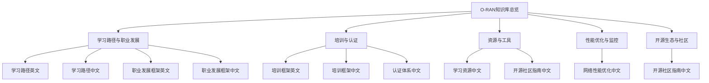
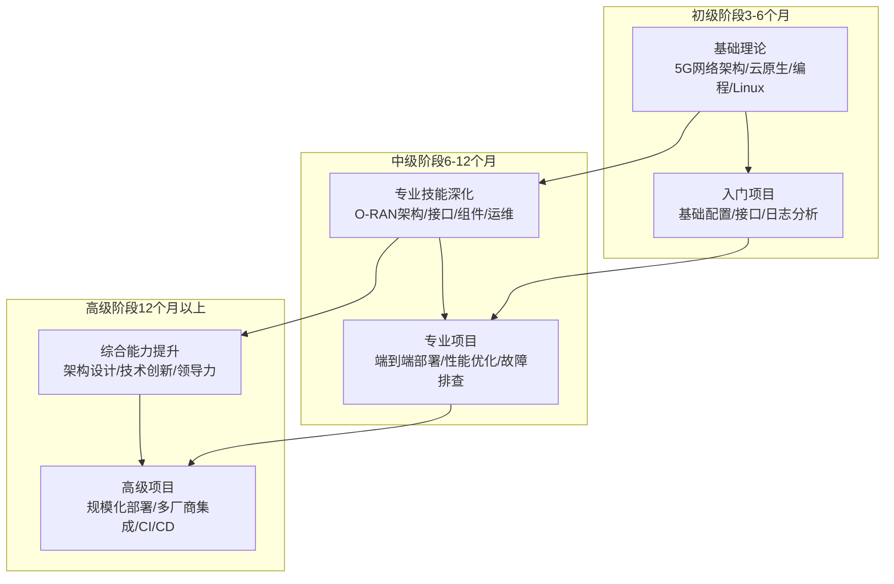
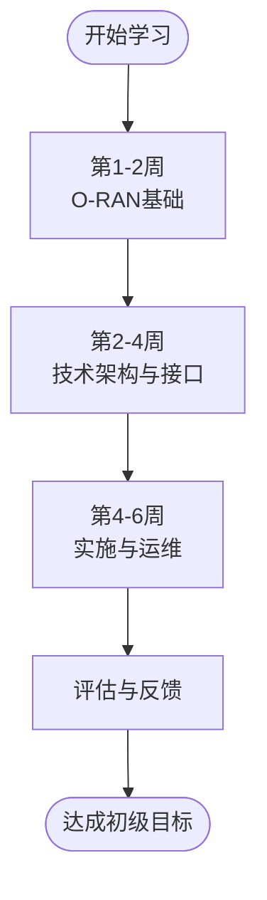
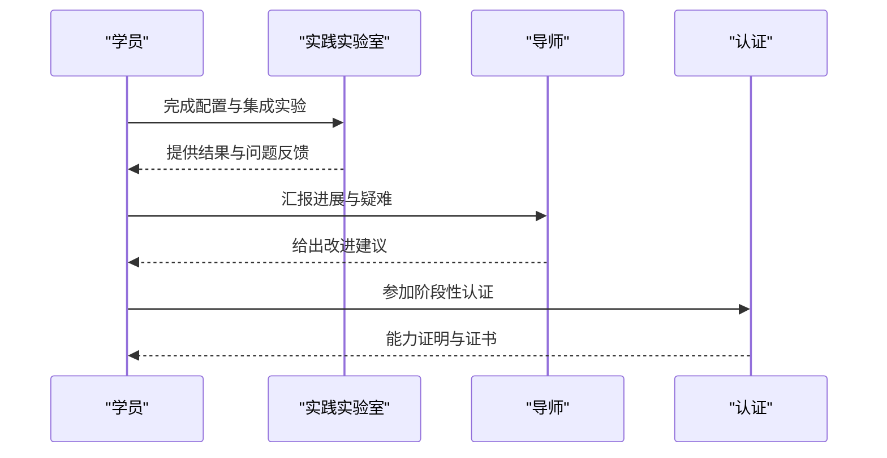
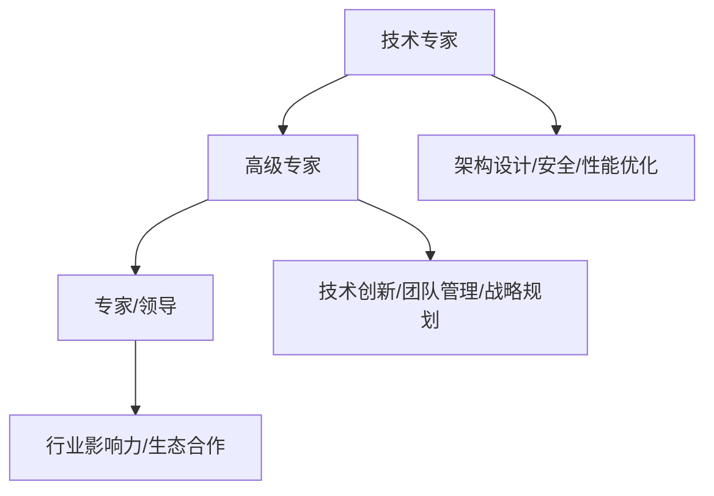
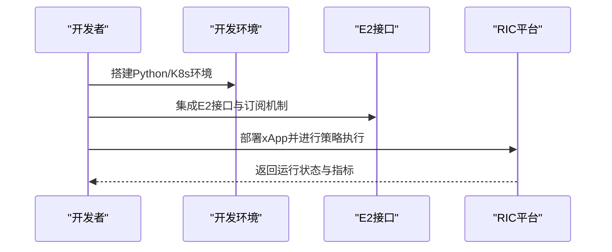
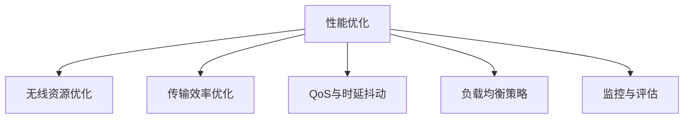

# 学习路径

<cite>
**本文引用的文件**
- [O-RAN学习路径（英文）](file://19-talent-development/learning-paths/o-ran-learning-roadmaps.md)
- [O-RAN学习路径（中文）](file://19-talent-development/learning-paths/o-ran-learning-roadmaps-zh.md)
- [O-RAN职业发展框架（英文）](file://19-talent-development/career-development/o-ran-career-pathways.md)
- [O-RAN职业发展框架（中文）](file://19-talent-development/career-development/o-ran-career-pathways-zh.md)
- [O-RAN培训项目（英文）](file://19-talent-development/training-programs/o-ran-training-framework.md)
- [O-RAN培训项目（中文）](file://19-talent-development/training-programs/o-ran-training-framework-zh.md)
- [O-RAN人才认证体系（中文）](file://19-talent-development/certification-system/oran-certification-program.md)
- [云平台到O-RAN专家转型指南（中文）](file://transition-guide/readme-zh.md)
- [O-RAN学习资源（中文）](file://resources/readme-zh.md)
- [O-RAN开源社区资源指南（中文）](file://17-open-source-ecosystem/community-resources/open-source-community-guide-zh.md)
- [O-RAN网络性能优化实践（中文）](file://26-performance-optimization/network-optimization/network-performance-tuning.md)
- [O-RAN知识库总览（英文）](file://README.md)
</cite>

## 目录
1. [引言](#引言)
2. [项目结构](#项目结构)
3. [核心组件](#核心组件)
4. [架构总览](#架构总览)
5. [详细组件分析](#详细组件分析)
6. [依赖分析](#依赖分析)
7. [性能考量](#性能考量)
8. [故障排查指南](#故障排查指南)
9. [结论](#结论)
10. [附录](#附录)

## 引言
本学习路径面向希望系统性掌握O-RAN技术的工程师与技术管理者，围绕“初级工程师路径”“中级工程师路径”“高级专家路径”三大阶段，给出阶段性学习目标、技能要求、时间规划、学习资源、实践项目与评估标准，帮助制定个性化成长计划。内容既覆盖基础理论（5G网络架构、云原生、编程与Linux系统等），也深入到O-RAN架构理解、RIC开发、网络优化与安全保护，最终指向架构设计、技术创新与领导力发展。

## 项目结构
该知识库以主题域划分，便于按阶段推进学习与实践。以下为与学习路径密切相关的核心模块与文件：

图表来源
- [O-RAN知识库总览（英文）](file://README.md#L1-L472)
- [O-RAN学习路径（英文）](file://19-talent-development/learning-paths/o-ran-learning-roadmaps.md#L1-L297)
- [O-RAN学习路径（中文）](file://19-talent-development/learning-paths/o-ran-learning-roadmaps-zh.md#L1-L297)
- [O-RAN职业发展框架（英文）](file://19-talent-development/career-development/o-ran-career-pathways.md#L1-L268)
- [O-RAN职业发展框架（中文）](file://19-talent-development/career-development/o-ran-career-pathways-zh.md#L1-L268)
- [O-RAN培训项目（英文）](file://19-talent-development/training-programs/o-ran-training-framework.md#L1-L329)
- [O-RAN培训项目（中文）](file://19-talent-development/training-programs/o-ran-training-framework-zh.md#L1-L329)
- [O-RAN人才认证体系（中文）](file://19-talent-development/certification-system/oran-certification-program.md#L1-L114)
- [O-RAN学习资源（中文）](file://resources/readme-zh.md#L1-L126)
- [O-RAN开源社区资源指南（中文）](file://17-open-source-ecosystem/community-resources/open-source-community-guide-zh.md#L1-L494)
- [O-RAN网络性能优化实践（中文）](file://26-performance-optimization/network-optimization/network-performance-tuning.md#L1-L98)

章节来源
- [O-RAN知识库总览（英文）](file://README.md#L1-L472)

## 核心组件
- 学习路径与阶段划分：提供“网络工程师路径”“RIC开发者路径”及“专业化轨道”，明确三阶段学习目标、课程模块、实践项目与评估框架。
- 职业发展框架：定义技术与管理两条晋升路径，列出各层级职责、所需技能与能力发展策略。
- 培训与认证：提供企业内训、高校合作、定制化解决方案与认证备考建议，支撑能力验证与持续发展。
- 资源与工具：汇总官方规范、在线课程、实践平台、测试与仿真工具、监控与日志工具，形成“学-练-测-评”的闭环。
- 性能优化与监控：提供无线资源、传输效率、QoS参数、负载均衡等优化策略与KPI指标，支撑实战能力培养。
- 开源生态：梳理O-RAN软件社区、ONAP、OpenAirInterface等项目与协作平台，鼓励参与贡献与实战演练。

章节来源
- [O-RAN学习路径（英文）](file://19-talent-development/learning-paths/o-ran-learning-roadmaps.md#L1-L297)
- [O-RAN学习路径（中文）](file://19-talent-development/learning-paths/o-ran-learning-roadmaps-zh.md#L1-L297)
- [O-RAN职业发展框架（英文）](file://19-talent-development/career-development/o-ran-career-pathways.md#L1-L268)
- [O-RAN职业发展框架（中文）](file://19-talent-development/career-development/o-ran-career-pathways-zh.md#L1-L268)
- [O-RAN培训项目（英文）](file://19-talent-development/training-programs/o-ran-training-framework.md#L1-L329)
- [O-RAN培训项目（中文）](file://19-talent-development/training-programs/o-ran-training-framework-zh.md#L1-L329)
- [O-RAN人才认证体系（中文）](file://19-talent-development/certification-system/oran-certification-program.md#L1-L114)
- [O-RAN学习资源（中文）](file://resources/readme-zh.md#L1-L126)
- [O-RAN开源社区资源指南（中文）](file://17-open-source-ecosystem/community-resources/open-source-community-guide-zh.md#L1-L494)
- [O-RAN网络性能优化实践（中文）](file://26-performance-optimization/network-optimization/network-performance-tuning.md#L1-L98)

## 架构总览
下图展示了从“基础理论—专业技能—综合能力”的三层学习架构，以及贯穿始终的“实践项目—认证评估—持续发展”的闭环。

图表来源
- [O-RAN学习路径（英文）](file://19-talent-development/learning-paths/o-ran-learning-roadmaps.md#L10-L100)
- [O-RAN学习路径（中文）](file://19-talent-development/learning-paths/o-ran-learning-roadmaps-zh.md#L10-L100)
- [O-RAN职业发展框架（英文）](file://19-talent-development/career-development/o-ran-career-pathways.md#L10-L65)
- [O-RAN职业发展框架（中文）](file://19-talent-development/career-development/o-ran-career-pathways-zh.md#L10-L65)

## 详细组件分析

### 初级工程师路径（3-6个月）
- 学习目标
  - 理解RAN基础与5G空口、物理层与MAC层功能
  - 掌握O-RAN参考架构与功能分割（选项7/2）
  - 熟悉以太网/IP/UDP/IP/定时同步等协议基础
- 技能要求
  - 基础Linux命令与系统管理
  - 网络协议分析与抓包分析
  - 基础脚本（Python/Bash）与自动化思维
- 时间规划
  - 第1-2周：O-RAN基础（参考架构、核心组件、接口标准）
  - 第2-4周：技术架构与接口（E2/A1/O1/O-FH协议栈、解耦选项）
  - 第4-6周：实施与运维（部署架构、硬件规划、集成测试、运维流程）
- 实践项目
  - 基础网络配置与连通性测试
  - 接口配置与协议分析
  - 日志采集与基础故障定位
- 评估标准
  - 理论测验与实验报告
  - 项目交付与演示
  - 导师反馈与学习计划调整

图表来源
- [O-RAN学习路径（中文）](file://19-talent-development/learning-paths/o-ran-learning-roadmaps-zh.md#L10-L100)
- [O-RAN知识库总览（英文）](file://README.md#L325-L354)

章节来源
- [O-RAN学习路径（英文）](file://19-talent-development/learning-paths/o-ran-learning-roadmaps.md#L10-L100)
- [O-RAN学习路径（中文）](file://19-talent-development/learning-paths/o-ran-learning-roadmaps-zh.md#L10-L100)
- [O-RAN知识库总览（英文）](file://README.md#L325-L354)

### 中级工程师路径（6-12个月）
- 学习目标
  - 精通O-RAN组件配置与接口集成（F1/E2/O1）
  - 掌握NETCONF/YANG、O1接口与性能监控
  - 具备常见问题的诊断与解决能力
- 技能要求
  - 容器编排（Kubernetes/Docker）与CI/CD流水线
  - 微服务与云原生架构
  - 网络切片、QoS、负载均衡与自组织网络
- 时间规划
  - 第1-2月：编程基础（Python/RESTful/API/JSON/异步）
  - 第2-4月：容器技术与API开发（Docker/K8s/平台API）
  - 第4-6月：网络管理与故障排查（NETCONF/YANG/O1/日志分析）
  - 第6-12月：高级功能与性能优化（网络切片/QoS/容量规划/干扰管理）
- 实践项目
  - 端到端O-RAN小区部署
  - 基础性能优化与KPI分析
  - 故障模拟与根因分析
- 评估标准
  - 月度里程碑与季度评审
  - 项目交付质量与导师反馈
  - 认证准备与能力验证

图表来源
- [O-RAN学习路径（英文）](file://19-talent-development/learning-paths/o-ran-learning-roadmaps.md#L42-L100)
- [O-RAN学习路径（中文）](file://19-talent-development/learning-paths/o-ran-learning-roadmaps-zh.md#L42-L100)
- [O-RAN培训项目（英文）](file://19-talent-development/training-programs/o-ran-training-framework.md#L57-L132)
- [O-RAN培训项目（中文）](file://19-talent-development/training-programs/o-ran-training-framework-zh.md#L57-L132)

章节来源
- [O-RAN学习路径（英文）](file://19-talent-development/learning-paths/o-ran-learning-roadmaps.md#L42-L100)
- [O-RAN学习路径（中文）](file://19-talent-development/learning-paths/o-ran-learning-roadmaps-zh.md#L42-L100)
- [O-RAN培训项目（英文）](file://19-talent-development/training-programs/o-ran-training-framework.md#L57-L132)
- [O-RAN培训项目（中文）](file://19-talent-development/training-programs/o-ran-training-framework-zh.md#L57-L132)

### 高级专家路径（12个月以上）
- 学习目标
  - 独立设计企业级O-RAN解决方案
  - 主导RIC应用开发与xApps/rApps部署
  - 具备多厂商集成与规模化运维能力
- 技能要求
  - 企业级架构设计与安全架构
  - AI/ML在RAN优化中的应用
  - 领导力与跨部门协作
- 时间规划
  - 第1-2年：技术专家（架构设计/安全/性能优化）
  - 第2-3年：高级专家（技术创新/团队管理/战略规划）
  - 第3年以上：专家/领导（行业影响力/生态合作）
- 实践项目
  - 生产级xApps/rApps开发与部署
  - CI/CD流水线与可观测性体系建设
  - 多厂商集成与灾难恢复规划
- 评估标准
  - 项目成功率与业务价值
  - 团队领导与知识传承
  - 行业认可与持续学习

图表来源
- [O-RAN职业发展框架（英文）](file://19-talent-development/career-development/o-ran-career-pathways.md#L8-L65)
- [O-RAN职业发展框架（中文）](file://19-talent-development/career-development/o-ran-career-pathways-zh.md#L8-L65)

章节来源
- [O-RAN职业发展框架（英文）](file://19-talent-development/career-development/o-ran-career-pathways.md#L8-L65)
- [O-RAN职业发展框架（中文）](file://19-talent-development/career-development/o-ran-career-pathways-zh.md#L8-L65)

### RIC开发者路径（与学习路径衔接）
- 初级阶段（1-2月）：Python编程、容器技术、API开发
- 中级阶段（3-5月）：xApp开发、E2接口集成、ML/AI算法
- 高级阶段（6-8月）：生产部署、可扩展性与可靠性、多厂商集成

图表来源
- [O-RAN学习路径（英文）](file://19-talent-development/learning-paths/o-ran-learning-roadmaps.md#L101-L187)
- [O-RAN学习路径（中文）](file://19-talent-development/learning-paths/o-ran-learning-roadmaps-zh.md#L101-L187)

章节来源
- [O-RAN学习路径（英文）](file://19-talent-development/learning-paths/o-ran-learning-roadmaps.md#L101-L187)
- [O-RAN学习路径（中文）](file://19-talent-development/learning-paths/o-ran-learning-roadmaps-zh.md#L101-L187)

## 依赖分析
- 知识依赖
  - 初级阶段依赖5G与无线基础；中级阶段依赖O-RAN架构与接口；高级阶段依赖企业架构与领导力。
- 工具依赖
  - 实践依赖测试平台（O-RAN SC Lab、ONAP、PacketRan、Open5GS）、仿真工具、监控与日志工具。
- 社区依赖
  - 通过O-RAN软件社区、ONAP、OpenAirInterface等平台获取代码、文档与协作支持。

图表来源
- [O-RAN学习路径（中文）](file://19-talent-development/learning-paths/o-ran-learning-roadmaps-zh.md#L10-L100)
- [O-RAN学习资源（中文）](file://resources/readme-zh.md#L65-L101)
- [O-RAN开源社区资源指南（中文）](file://17-open-source-ecosystem/community-resources/open-source-community-guide-zh.md#L1-L494)

章节来源
- [O-RAN学习路径（中文）](file://19-talent-development/learning-paths/o-ran-learning-roadmaps-zh.md#L10-L100)
- [O-RAN学习资源（中文）](file://resources/readme-zh.md#L65-L101)
- [O-RAN开源社区资源指南（中文）](file://17-open-source-ecosystem/community-resources/open-source-community-guide-zh.md#L1-L494)

## 性能考量
- 无线资源优化：载波聚合、MCS自适应、HARQ重传、波束赋形、干扰随机化
- 传输效率优化：ROHC头部压缩、协议栈优化、QoS参数精细化、PDU会话优化
- QoS与时延抖动控制：DRB配置、调度策略、队列管理（WFQ/SP）、缓冲与整形
- 负载均衡：切换参数、动态资源池、负载预测、容量弹性与智能休眠
- 监控与评估：建立KPI基线、对比优化前后、长期趋势与ROI评估

图表来源
- [O-RAN网络性能优化实践（中文）](file://26-performance-optimization/network-optimization/network-performance-tuning.md#L1-L98)

章节来源
- [O-RAN网络性能优化实践（中文）](file://26-performance-optimization/network-optimization/network-performance-tuning.md#L1-L98)

## 故障排查指南
- 硬件故障：组件失效诊断与修复流程
- 软件故障：Bug定位、调试与修复策略
- 网络问题：连通性、性能退化与协议异常
- 诊断工具：专业工具与故障案例库
- 建议：建立标准化排查流程与知识库，沉淀案例与最佳实践

章节来源
- [O-RAN知识库总览（英文）](file://README.md#L210-L284)

## 结论
通过“基础理论—专业技能—综合能力”的三阶段学习路径，结合实践项目、认证评估与持续发展机制，学习者可以系统掌握O-RAN技术，逐步成长为具备架构设计、技术创新与领导力的专家。建议根据个人背景与目标选择加速/综合/管理等定制化学习计划，并充分利用开源社区与企业培训资源，实现“学以致用、用以促学”。

## 附录
- 学习资源目录
  - 官方文档：O-RAN联盟规范、ETSI标准、3GPP规范
  - 在线课程：Coursera、edX、Udemy、Pluralsight
  - 实践平台：O-RAN SC实验室、ONAP演示平台、PacketRan、Open5GS
  - 社区资源：O-RAN开发者论坛、GitHub O-RAN项目、Stack Overflow、Reddit r/O_RAN
- 认证与职业发展
  - O-RAN联盟认证（助理/专业/专家）、ETSI培训、3GPP RAN认证、厂商认证
  - 职业路径：部署专家、运维专家、RIC开发者、解决方案架构师、标准贡献者
- 开源生态
  - O-RAN软件社区（OSC）、ONAP、OpenAirInterface等项目与协作平台
  - 开发环境设置、代码贡献流程、问题跟踪模板、社区活动与会议

章节来源
- [O-RAN学习资源（中文）](file://resources/readme-zh.md#L1-L126)
- [O-RAN人才认证体系（中文）](file://19-talent-development/certification-system/oran-certification-program.md#L1-L114)
- [O-RAN开源社区资源指南（中文）](file://17-open-source-ecosystem/community-resources/open-source-community-guide-zh.md#L1-L494)
- [O-RAN知识库总览（英文）](file://README.md#L285-L472)