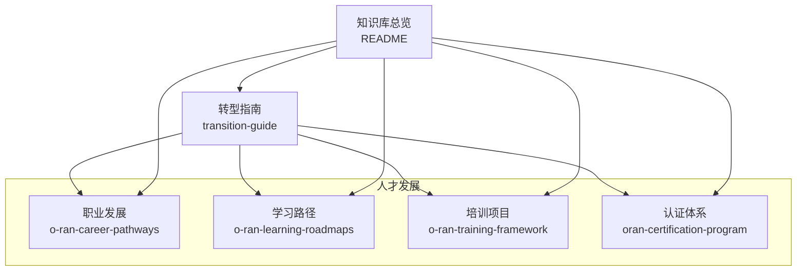
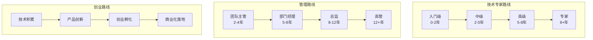
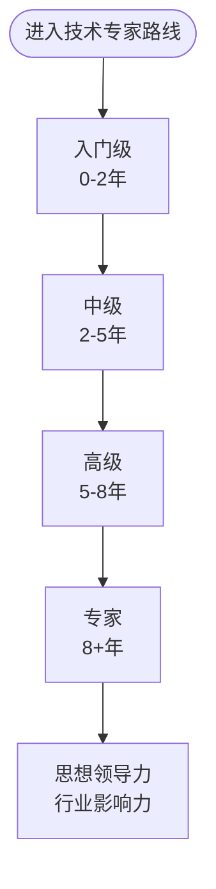
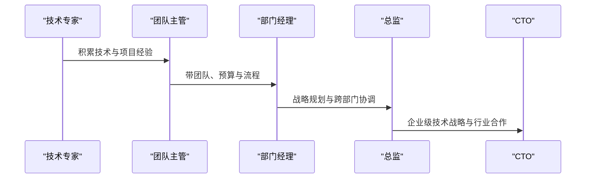
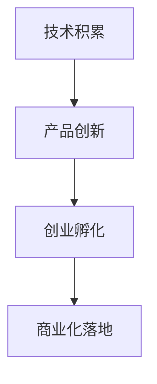
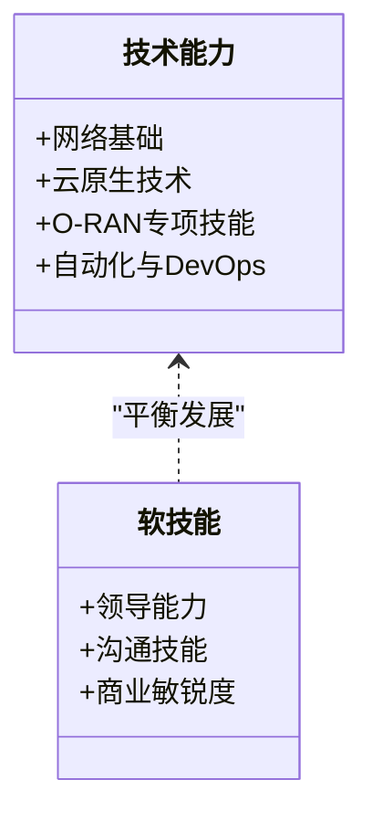
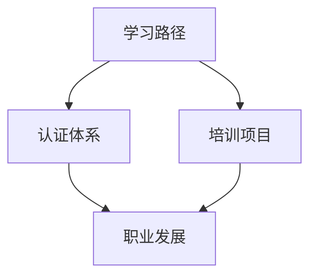
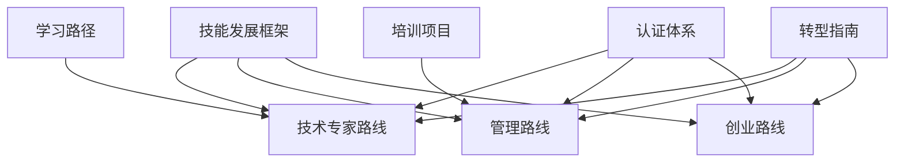

# O-RAN职业发展路径

<cite>
**本文引用的文件**
- [O-RAN职业发展框架](file://19-talent-development/career-development/o-ran-career-pathways.md)
- [O-RAN职业发展框架（中文）](file://19-talent-development/career-development/o-ran-career-pathways-zh.md)
- [O-RAN学习路径](file://19-talent-development/learning-paths/o-ran-learning-roadmaps.md)
- [O-RAN学习路径（中文）](file://19-talent-development/learning-paths/o-ran-learning-roadmaps-zh.md)
- [O-RAN培训项目](file://19-talent-development/training-programs/o-ran-training-framework.md)
- [O-RAN培训项目（中文）](file://19-talent-development/training-programs/o-ran-training-framework-zh.md)
- [O-RAN人才认证体系](file://19-talent-development/certification-system/oran-certification-program.md)
- [云平台到O-RAN专家转型指南](file://transition-guide/readme.md)
- [云平台到O-RAN专家转型指南（中文）](file://transition-guide/readme-zh.md)
- [O-RAN专家知识库总览](file://README.md)
</cite>

## 目录
1. [引言](#引言)
2. [项目结构](#项目结构)
3. [核心组件](#核心组件)
4. [架构总览](#架构总览)
5. [详细组件分析](#详细组件分析)
6. [依赖分析](#依赖分析)
7. [性能考虑](#性能考虑)
8. [故障排除指南](#故障排除指南)
9. [结论](#结论)
10. [附录](#附录)

## 引言
本文件围绕O-RAN专家的三条主要职业发展通道——技术专家路线、管理路线与创业路线，系统梳理晋升层级、能力要求与职业发展阶段，并结合项目中的学习路径、培训框架与认证体系，给出可操作的技能要求、经验积累建议与职业规划指导。内容既覆盖技术深度与专业权威建立，也强调技术与管理的平衡发展，以及从技术积累到商业化的完整流程。

## 项目结构
该项目以“人才发展”为核心子目录，包含职业发展、学习路径、培训项目与认证体系等模块，形成从“认知—学习—实践—认证—晋升”的闭环。整体结构如下图所示：

图表来源
- [O-RAN职业发展框架](file://19-talent-development/career-development/o-ran-career-pathways.md#L1-L268)
- [O-RAN学习路径](file://19-talent-development/learning-paths/o-ran-learning-roadmaps.md#L1-L297)
- [O-RAN培训项目](file://19-talent-development/training-programs/o-ran-training-framework.md#L1-L329)
- [O-RAN人才认证体系](file://19-talent-development/certification-system/oran-certification-program.md#L1-L114)
- [云平台到O-RAN专家转型指南](file://transition-guide/readme.md#L1-L116)
- [O-RAN专家知识库总览](file://README.md#L1-L472)

章节来源
- [O-RAN专家知识库总览](file://README.md#L137-L144)

## 核心组件
- 职业发展框架：明确技术专家、管理与创业三条通道的晋升层级、职责与能力要求。
- 学习路径：提供阶段性课程、项目与评估机制，支撑从入门到专家的系统化成长。
- 培训项目：覆盖高层领导力、技术实施与专业化模块，满足不同角色与能力层级的需求。
- 认证体系：提供O-RAN联盟认证、厂商认证与云服务认证，支撑职业发展与市场认可。
- 转型指南：帮助云平台专家将既有技能迁移到O-RAN领域，明确学习路径与认证方向。

章节来源
- [O-RAN职业发展框架](file://19-talent-development/career-development/o-ran-career-pathways.md#L6-L100)
- [O-RAN学习路径](file://19-talent-development/learning-paths/o-ran-learning-roadmaps.md#L6-L100)
- [O-RAN培训项目](file://19-talent-development/training-programs/o-ran-training-framework.md#L6-L50)
- [O-RAN人才认证体系](file://19-talent-development/certification-system/oran-certification-program.md#L6-L30)
- [云平台到O-RAN专家转型指南](file://transition-guide/readme.md#L6-L40)

## 架构总览
三条职业发展通道的总体架构如下：

图表来源
- [O-RAN职业发展框架](file://19-talent-development/career-development/o-ran-career-pathways.md#L8-L99)
- [O-RAN职业发展框架（中文）](file://19-talent-development/career-development/o-ran-career-pathways-zh.md#L8-L99)

## 详细组件分析

### 技术专家路线：从初级工程师到首席专家
- 入门级（0-2年）
  - 角色：初级RAN工程师、O-RAN实施专员
  - 职责：协助部署、配置维护、排查问题、文档编写
  - 能力要求：5G/RAN基础、Linux、网络协议、脚本基础
- 中级（2-5年）
  - 角色：RAN系统工程师、O-RAN集成专家
  - 职责：主导集成项目、设计优化、自动化脚本、指导新人
  - 能力要求：高级O-RAN架构、容器编排、CI/CD、性能优化
- 高级（5-8年）
  - 角色：高级RAN架构师、O-RAN解决方案架构师
  - 职责：企业级方案设计、技术战略、架构评审、客户对接
  - 能力要求：企业架构、多厂商集成、安全架构、业务需求转化
- 专家（8+年）
  - 角色：首席RAN架构师、O-RAN创新总监
  - 职责：推动技术创新、行业发声、战略合作、研发领导
  - 能力要求：思想领导力、跨职能领导、趋势分析、高管沟通

图表来源
- [O-RAN职业发展框架](file://19-talent-development/career-development/o-ran-career-pathways.md#L10-L65)
- [O-RAN职业发展框架（中文）](file://19-talent-development/career-development/o-ran-career-pathways-zh.md#L10-L65)

章节来源
- [O-RAN职业发展框架](file://19-talent-development/career-development/o-ran-career-pathways.md#L8-L65)
- [O-RAN职业发展框架（中文）](file://19-talent-development/career-development/o-ran-career-pathways-zh.md#L8-L65)

### 管理路线：从技术管理者到CTO
- 团队主管（2-4年）
  - 角色：RAN团队主管、O-RAN项目经理
  - 职责：管理小团队、协调交付、资源分配、绩效反馈
- 部门经理（5-8年）
  - 角色：RAN工程经理、O-RAN项目总监
  - 职责：主导多项目、预算管理、利益相关者沟通、流程改进
- 总监（8-12年）
  - 角色：RAN工程总监、O-RAN技术总监
  - 职责：部门战略、跨组织协调、厂商关系、技术投资决策
- 高管（12+年）
  - 角色：网络技术副总裁、CTO - RAN事业部
  - 职责：企业级技术战略、董事会汇报、行业合作、长期愿景

图表来源
- [O-RAN职业发展框架](file://19-talent-development/career-development/o-ran-career-pathways.md#L66-L99)
- [O-RAN职业发展框架（中文）](file://19-talent-development/career-development/o-ran-career-pathways-zh.md#L66-L99)

章节来源
- [O-RAN职业发展框架](file://19-talent-development/career-development/o-ran-career-pathways.md#L66-L99)
- [O-RAN职业发展框架（中文）](file://19-talent-development/career-development/o-ran-career-pathways-zh.md#L66-L99)

### 创业路线：从技术积累到商业化
- 技术积累：掌握O-RAN关键技术栈（架构、接口、RIC、云原生）
- 产品创新：基于xApps/rApps、网络切片、AI/ML优化等方向进行产品化探索
- 创业孵化：寻找市场机会、组建团队、获取资源与政策支持
- 商业化落地：产品规模化、商业模式完善、生态合作与市场拓展

图表来源
- [O-RAN职业发展框架](file://19-talent-development/career-development/o-ran-career-pathways.md#L213-L218)
- [O-RAN职业发展框架（中文）](file://19-talent-development/career-development/o-ran-career-pathways-zh.md#L213-L218)

章节来源
- [O-RAN职业发展框架](file://19-talent-development/career-development/o-ran-career-pathways.md#L199-L218)
- [O-RAN职业发展框架（中文）](file://19-talent-development/career-development/o-ran-career-pathways-zh.md#L199-L218)

### 技能发展框架与学习路径
- 核心技术能力
  - 网络基础：RAN架构、5G NR、传输网络、网络切片
  - 云原生技术：微服务、容器、编排、服务网格
  - O-RAN专项技能：架构组件、标准接口、RIC与xApps、近实时/非实时RIC
  - 自动化与DevOps：基础设施即代码、配置管理、监控可观测性、CI/CD
- 软技能发展
  - 领导能力：团队激励、冲突解决、变革管理、战略思维
  - 沟通技能：技术文档、演讲、跨文化沟通、高管简报
  - 商业敏锐度：财务分析、ROI、市场分析、客户需求分析

图表来源
- [O-RAN职业发展框架](file://19-talent-development/career-development/o-ran-career-pathways.md#L100-L147)
- [O-RAN学习路径](file://19-talent-development/learning-paths/o-ran-learning-roadmaps.md#L101-L127)

章节来源
- [O-RAN职业发展框架](file://19-talent-development/career-development/o-ran-career-pathways.md#L100-L147)
- [O-RAN学习路径](file://19-talent-development/learning-paths/o-ran-learning-roadmaps.md#L101-L127)

### 学习路径与认证体系
- 网络工程师路径：基础（1-3月）→中级（4-6月）→高级（7-9月）
- RIC开发者路径：编程基础（1-2月）→开发技能（3-5月）→生产部署（6-8月）
- 专业化轨道：安全专家、云基础设施、无线优化
- 认证体系：O-RAN联盟认证、厂商认证、云服务认证、开源项目认证
- 培训项目：高管领导力、技术实施、安全与合规、云原生O-RAN

图表来源
- [O-RAN学习路径](file://19-talent-development/learning-paths/o-ran-learning-roadmaps.md#L1-L297)
- [O-RAN培训项目](file://19-talent-development/training-programs/o-ran-training-framework.md#L1-L329)
- [O-RAN人才认证体系](file://19-talent-development/certification-system/oran-certification-program.md#L1-L114)

章节来源
- [O-RAN学习路径](file://19-talent-development/learning-paths/o-ran-learning-roadmaps.md#L1-L297)
- [O-RAN培训项目](file://19-talent-development/training-programs/o-ran-training-framework.md#L1-L329)
- [O-RAN人才认证体系](file://19-talent-development/certification-system/oran-certification-program.md#L1-L114)

### 职业转换与个人品牌建设
- 转换机会：相邻技术（边缘计算、网络切片、AI/ML、安全架构）、行业垂直（运营商、云服务、企业、咨询）、创业路径
- 个人品牌：技术博客、会议演讲、开源贡献、社交媒体；作品集：项目文档、代码仓库、认证记录、绩效指标

章节来源
- [O-RAN职业发展框架](file://19-talent-development/career-development/o-ran-career-pathways.md#L199-L218)
- [O-RAN职业发展框架（中文）](file://19-talent-development/career-development/o-ran-career-pathways-zh.md#L199-L218)

## 依赖分析
三条发展通道之间存在相互依赖与互补关系：
- 技术专家与管理路线需要软技能支撑，尤其是沟通与领导能力
- 创业路线依赖技术专家路线的深度积累与认证体系的市场认可
- 学习路径与培训项目为三条路线提供知识与实践基础
- 转型指南帮助云平台专家将既有技能迁移到O-RAN领域

图表来源
- [O-RAN职业发展框架](file://19-talent-development/career-development/o-ran-career-pathways.md#L100-L147)
- [O-RAN学习路径](file://19-talent-development/learning-paths/o-ran-learning-roadmaps.md#L1-L297)
- [O-RAN培训项目](file://19-talent-development/training-programs/o-ran-training-framework.md#L1-L329)
- [O-RAN人才认证体系](file://19-talent-development/certification-system/oran-certification-program.md#L1-L114)
- [云平台到O-RAN专家转型指南](file://transition-guide/readme.md#L1-L116)

## 性能考虑
- 学习效率：按月度、季度、年度节奏推进，结合认证与项目实践
- 能力评估：KPI指标（代码质量、按时交付、知识分享、创新）与里程碑追踪
- 组织影响：技能转化率、项目成功率、留存指标、创新指数

章节来源
- [O-RAN职业发展框架](file://19-talent-development/career-development/o-ran-career-pathways.md#L219-L254)
- [O-RAN培训项目](file://19-talent-development/training-programs/o-ran-training-framework.md#L285-L314)

## 故障排除指南
- 技术瓶颈：通过学习路径与培训项目补齐短板，结合认证体系验证能力
- 职业停滞：借助转型指南重新审视技能映射，调整学习路径与认证方向
- 管理能力不足：参与管理类培训项目，强化领导与沟通技能
- 创业困难：从技术积累入手，逐步过渡到产品创新与商业化

章节来源
- [O-RAN学习路径](file://19-talent-development/learning-paths/o-ran-learning-roadmaps.md#L231-L252)
- [O-RAN培训项目](file://19-talent-development/training-programs/o-ran-training-framework.md#L251-L276)
- [云平台到O-RAN专家转型指南](file://transition-guide/readme.md#L21-L40)

## 结论
三条职业发展通道各有侧重：技术专家路线强调技术深度与专业权威；管理路线强调技术与管理的平衡；创业路线强调技术商业化与价值创造。结合学习路径、培训项目与认证体系，可以系统化地提升能力、验证成果并获得市场认可。建议根据个人兴趣与背景，选择适合的通道，并持续学习、实践与反思，以实现可持续的职业成长。

## 附录
- 成功案例与经验：快速晋升、跨领域转换、创业成功、国际流动
- 职业里程碑：基础建设、专业化发展、领导力准备、高管准备
- 职业规划建议：明确目标、制定计划、持续认证、扩展网络、积累项目经验

章节来源
- [O-RAN职业发展框架](file://19-talent-development/career-development/o-ran-career-pathways.md#L256-L268)
- [O-RAN职业发展框架（中文）](file://19-talent-development/career-development/o-ran-career-pathways-zh.md#L256-L268)