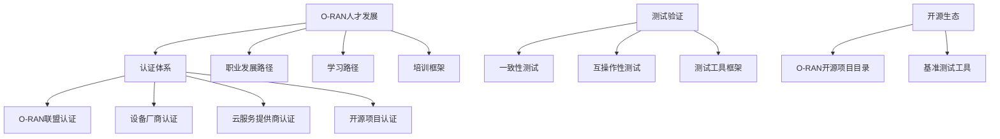
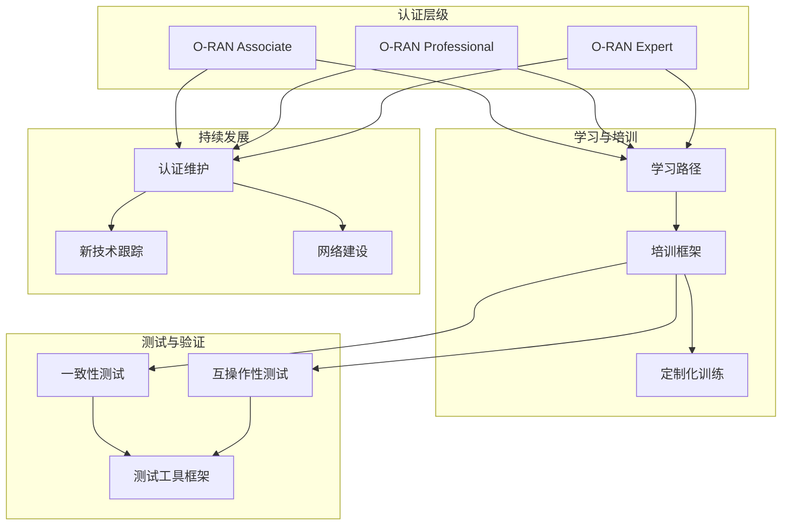
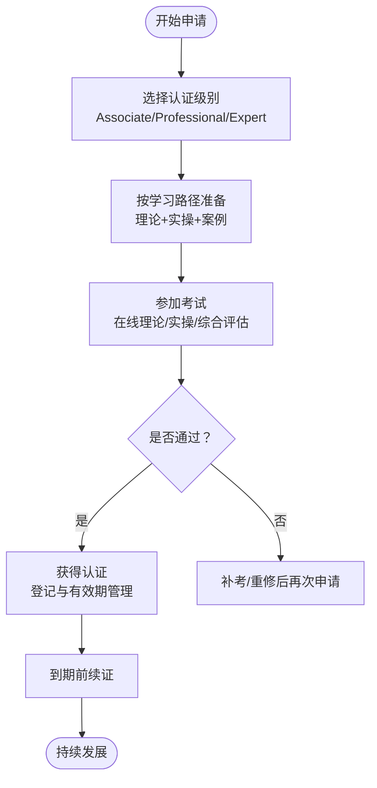
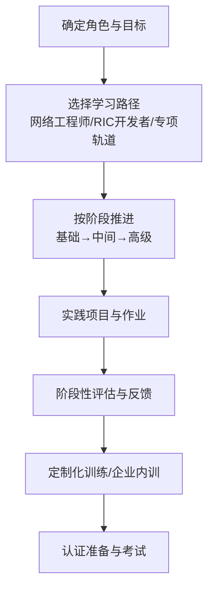
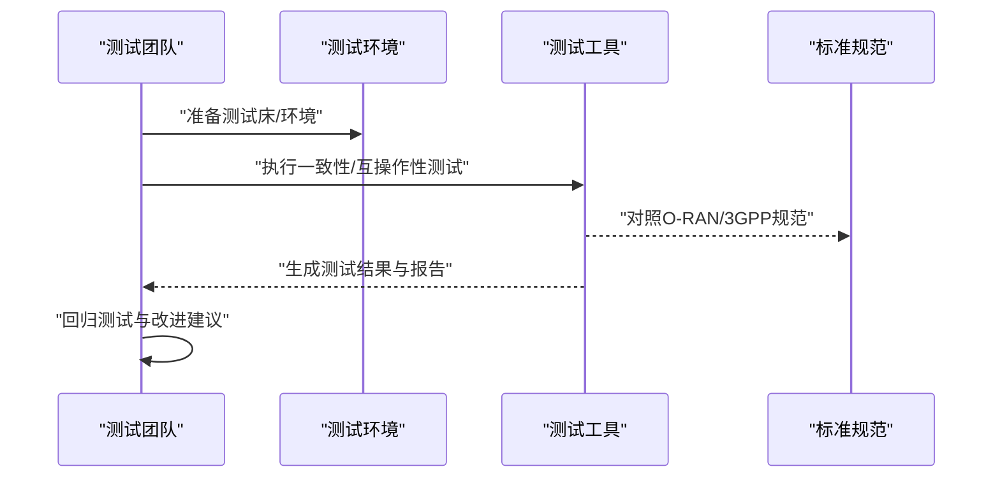
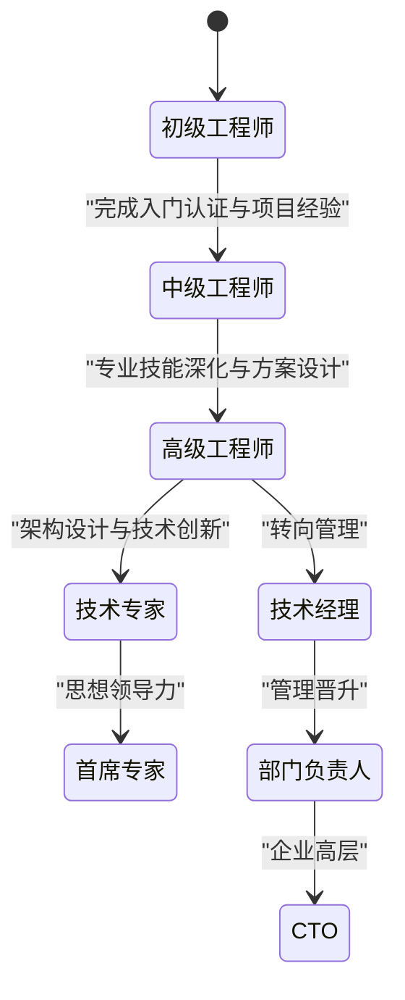
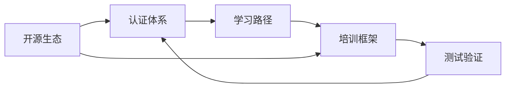

# 认证体系

<cite>
**本文引用的文件**
- [O-RAN 人才认证体系](file://19-talent-development/certification-system/oran-certification-program.md)
- [O-RAN Career Development Framework](file://19-talent-development/career-development/o-ran-career-pathways.md)
- [O-RAN Training Programs](file://19-talent-development/training-programs/o-ran-training-framework.md)
- [O-RAN Learning Pathways](file://19-talent-development/learning-paths/o-ran-learning-roadmaps.md)
- [O-RAN 测试一致性验证](file://13-testing-validation/conformance-testing/o-ran-conformance-testing.md)
- [O-RAN Testing Tools and Frameworks](file://13-testing-validation/testing-tools/testing-tools-frameworks.md)
- [O-RAN Open Source Projects Catalog](file://17-open-source-ecosystem/oran-projects/oran-open-source-projects.md)
- [O-RAN Talent Development](file://19-talent-development/readme.md)
</cite>

## 目录
1. [引言](#引言)
2. [项目结构](#项目结构)
3. [核心组件](#核心组件)
4. [架构总览](#架构总览)
5. [详细组件分析](#详细组件分析)
6. [依赖分析](#依赖分析)
7. [性能考量](#性能考量)
8. [故障排除指南](#故障排除指南)
9. [结论](#结论)
10. [附录](#附录)

## 引言
本文件面向O-RAN（开放无线接入网）领域的认证体系建设，系统梳理O-RAN联盟认证、设备厂商认证、云服务提供商认证、开源项目认证、运营商内部认证、咨询机构认证与国际组织认证的项目类别、认证级别、考试内容、申请条件与流程；并结合学习路径、培训框架与测试验证体系，给出认证准备指南、学习资源与考试技巧，最终形成个人认证发展路径，帮助技术人员制定长期规划。

## 项目结构
该仓库围绕“人才培养”“认证体系”“学习路径”“培训框架”“测试验证”“开源生态”等维度组织内容，认证体系相关内容主要分布在以下目录：
- 19-talent-development：包含认证体系、职业发展、学习路径与培训框架
- 13-testing-validation：包含一致性测试、互操作性测试与测试工具框架
- 17-open-source-ecosystem：包含O-RAN开源项目目录与基准测试工具

**图表来源**
- [O-RAN Talent Development](file://19-talent-development/readme.md#L1-L71)
- [O-RAN 人才认证体系](file://19-talent-development/certification-system/oran-certification-program.md#L1-L114)
- [O-RAN 测试一致性验证](file://13-testing-validation/conformance-testing/o-ran-conformance-testing.md#L1-L67)
- [O-RAN Testing Tools and Frameworks](file://13-testing-validation/testing-tools/testing-tools-frameworks.md#L1-L598)
- [O-RAN Open Source Projects Catalog](file://17-open-source-ecosystem/oran-projects/oran-open-source-projects.md#L1-L716)

**章节来源**
- [O-RAN Talent Development](file://19-talent-development/readme.md#L1-L71)

## 核心组件
- 官方认证体系：O-RAN联盟认证（Associate/Professional/Expert）
- 设备厂商认证：Ericsson、Nokia、Samsung、ZTE、Huawei等
- 云服务提供商认证：AWS、Azure、GCP相关专业认证
- 开源项目认证：Linux Foundation、ONF、ONAP等
- 培训与学习：企业内训、大学合作、定制化学习路径
- 测试与验证：一致性测试、互操作性测试、测试工具与自动化

**章节来源**
- [O-RAN 人才认证体系](file://19-talent-development/certification-system/oran-certification-program.md#L6-L58)
- [O-RAN Training Programs](file://19-talent-development/training-programs/o-ran-training-framework.md#L6-L133)
- [O-RAN Learning Pathways](file://19-talent-development/learning-paths/o-ran-learning-roadmaps.md#L6-L100)

## 架构总览
认证体系由“认证层级—学习路径—培训—测试验证—持续发展”构成闭环，支撑从入门到专家的职业成长。

**图表来源**
- [O-RAN 人才认证体系](file://19-talent-development/certification-system/oran-certification-program.md#L6-L22)
- [O-RAN Learning Pathways](file://19-talent-development/learning-paths/o-ran-learning-roadmaps.md#L231-L258)
- [O-RAN Training Programs](file://19-talent-development/training-programs/o-ran-training-framework.md#L251-L276)
- [O-RAN 测试一致性验证](file://13-testing-validation/conformance-testing/o-ran-conformance-testing.md#L6-L19)
- [O-RAN Testing Tools and Frameworks](file://13-testing-validation/testing-tools/testing-tools-frameworks.md#L361-L418)

## 详细组件分析

### 官方认证体系：O-RAN联盟认证
- 认证级别与周期
  - O-RAN Associate：基础理论，有效期2年
  - O-RAN Professional：理论+实操，有效期3年
  - O-RAN Expert：综合评估+案例分析，有效期3年
- 申请条件与流程
  - 基础知识掌握（Associate）
  - 实践经验+理论知识（Professional）
  - 丰富项目经验+技术领导力（Expert）
  - 在线理论+实操或综合评估
- 价值与收益
  - 薪资提升：认证前后薪资区间与涨幅
  - 职业机会扩展：晋升、行业认可、国际视野

**图表来源**
- [O-RAN 人才认证体系](file://19-talent-development/certification-system/oran-certification-program.md#L8-L22)
- [O-RAN Learning Pathways](file://19-talent-development/learning-paths/o-ran-learning-roadmaps.md#L231-L258)

**章节来源**
- [O-RAN 人才认证体系](file://19-talent-development/certification-system/oran-certification-program.md#L6-L22)
- [O-RAN Learning Pathways](file://19-talent-development/learning-paths/o-ran-learning-roadmaps.md#L231-L258)

### 设备厂商认证
- 主要厂商认证项目
  - Ericsson：Ericsson Certified Professional
  - Nokia：Nokia Network Certification
  - Samsung：Samsung RAN Certification
  - ZTE：ZTE Technical Certification
  - Huawei：Huawei Certified ICT Professional
- 适用人群与价值
  - 针对特定厂商产品线与工具链
  - 提升在厂商生态中的适配与交付能力

**章节来源**
- [O-RAN 人才认证体系](file://19-talent-development/certification-system/oran-certification-program.md#L24-L29)

### 云服务提供商认证
- AWS认证方向
  - AWS Certified Advanced Networking – Specialty
  - AWS Certified Security – Specialty
  - AWS Certified DevOps Engineer – Professional
- Azure认证方向
  - Azure Solutions Architect Expert
  - Azure Security Engineer Associate
  - Azure DevOps Engineer Expert
- GCP认证方向
  - Professional Cloud Network Engineer
  - Professional Cloud Security Engineer
  - Professional DevOps Engineer
- 价值与适用场景
  - O-RAN云原生部署、运维与安全治理
  - CI/CD、可观测性、弹性与成本优化

**章节来源**
- [O-RAN 人才认证体系](file://19-talent-development/certification-system/oran-certification-program.md#L31-L46)

### 开源项目认证
- Linux Foundation项目
  - LFCS：Linux Foundation Certified System Administrator
  - CNCF：Cloud Native Computing Foundation 认证
  - ONAP：Open Network Automation Platform 认证
- ONF认证
  - SDN and NFV Professional Certification
  - CORD and Aether Certification
  - ONOS Developer Certification
- 价值与贡献
  - 开源生态协作与平台能力
  - 通过基准测试与贡献流程提升影响力

**章节来源**
- [O-RAN 人才认证体系](file://19-talent-development/certification-system/oran-certification-program.md#L48-L58)
- [O-RAN Open Source Projects Catalog](file://17-open-source-ecosystem/oran-projects/oran-open-source-projects.md#L1-L716)

### 运营商内部认证、咨询机构认证与国际组织认证
- 运营商内部认证
  - 内部能力模型与认证标准
  - 项目交付与运维能力认证
- 咨询机构认证
  - 第三方培训机构的O-RAN相关课程与认证
- 国际组织认证
  - IEEE、ITU等国际标准组织的相关认证与能力证明
- 价值与意义
  - 行业认可、跨组织流动与标准对接

**章节来源**
- [O-RAN Talent Development](file://19-talent-development/readme.md#L34-L37)

### 学习路径与培训框架
- 学习路径
  - 网络工程师路径：基础—中间—高级，覆盖O-RAN架构、接口配置、故障排查与性能优化
  - RIC开发者路径：编程基础—xApp开发—生产部署—可扩展性与可靠性
  - 专项学习轨道：安全、云基础设施、无线电优化
- 培训框架
  - 企业内训：高层战略、技术实施、安全合规、云原生O-RAN
  - 大学合作：学术证书、研究合作、实习与联合项目
  - 定制化方案：需求评估—课程设计—交付—评估优化

**图表来源**
- [O-RAN Learning Pathways](file://19-talent-development/learning-paths/o-ran-learning-roadmaps.md#L8-L100)
- [O-RAN Training Programs](file://19-talent-development/training-programs/o-ran-training-framework.md#L49-L132)

**章节来源**
- [O-RAN Learning Pathways](file://19-talent-development/learning-paths/o-ran-learning-roadmaps.md#L6-L100)
- [O-RAN Training Programs](file://19-talent-development/training-programs/o-ran-training-framework.md#L49-L132)

### 测试与验证：一致性与互操作性
- 一致性测试
  - O-RAN联盟测试套件：架构、接口、功能、性能、安全一致性
  - 3GPP规范验证：NG-RAN、5G NR、RAN功能与互操作性
- 互操作性测试
  - 功能与性能互操作性指标
  - 连接稳定性、失败恢复、会话持久化、负载均衡
  - O-RAN联盟认证与行业标准合规
- 测试工具与自动化
  - 商业测试平台（Spirent、Keysight、Anritsu）
  - 开源测试框架（Robot Framework、PyTest）
  - 容器化测试环境与CI/CD集成

**图表来源**
- [O-RAN 测试一致性验证](file://13-testing-validation/conformance-testing/o-ran-conformance-testing.md#L6-L67)
- [O-RAN Testing Tools and Frameworks](file://13-testing-validation/testing-tools/testing-tools-frameworks.md#L361-L418)

**章节来源**
- [O-RAN 测试一致性验证](file://13-testing-validation/conformance-testing/o-ran-conformance-testing.md#L1-L67)
- [O-RAN Testing Tools and Frameworks](file://13-testing-validation/testing-tools/testing-tools-frameworks.md#L1-L598)

### 认证准备指南与学习资源
- 学习路径规划
  - 基础知识（2-3个月）：5G架构、O-RAN参考架构、核心接口、云原生基础
  - 专业技能（3-4个月）：RIC开发、网络优化、安全防护、运维管理
  - 实战应用（2-3个月）：案例分析、部署经验、故障处理、性能调优
- 学习资源
  - 官方文档：O-RAN Alliance Technical Specifications
  - 在线课程：Coursera、edX
  - 实践平台：O-RAN SC实验室、ONAP演示平台、PacketRan、Open5GS
  - 社区交流：O-RAN开发者论坛、GitHub、Stack Overflow、Reddit r/O_RAN
- 考试准备要点
  - 理论知识、实操技能、案例分析、时间管理、心理准备

**章节来源**
- [O-RAN 人才认证体系](file://19-talent-development/certification-system/oran-certification-program.md#L60-L94)
- [O-RAN Learning Pathways](file://19-talent-development/learning-paths/o-ran-learning-roadmaps.md#L206-L229)

### 职业发展与个人认证发展路径
- 职业发展价值
  - 薪资提升与职业机会扩展
  - 认证维护与持续发展建议
- 个人发展路径
  - 技术专家路径：从初级工程师到首席专家
  - 管理路径：技术管理到部门/CTO
  - 创业路径：技术积累到产品孵化
- 关键里程碑与KPI
  - 技术卓越、项目交付、知识分享、创新成果
  - 年度复盘与目标调整

**图表来源**
- [O-RAN Career Development Framework](file://19-talent-development/career-development/o-ran-career-pathways.md#L6-L99)

**章节来源**
- [O-RAN Career Development Framework](file://19-talent-development/career-development/o-ran-career-pathways.md#L1-L268)

## 依赖分析
- 认证体系与学习路径耦合：认证需要以学习路径为基础，学习路径为认证提供知识与技能支撑
- 培训框架与测试验证耦合：培训产出需要通过测试验证进行质量把关，测试工具与自动化贯穿培训全过程
- 开源生态与认证耦合：开源项目贡献与基准测试有助于提升认证含金量与行业影响力

**图表来源**
- [O-RAN 人才认证体系](file://19-talent-development/certification-system/oran-certification-program.md#L6-L58)
- [O-RAN Learning Pathways](file://19-talent-development/learning-paths/o-ran-learning-roadmaps.md#L231-L258)
- [O-RAN Training Programs](file://19-talent-development/training-programs/o-ran-training-framework.md#L251-L276)
- [O-RAN Open Source Projects Catalog](file://17-open-source-ecosystem/oran-projects/oran-open-source-projects.md#L1-L716)

**章节来源**
- [O-RAN 人才认证体系](file://19-talent-development/certification-system/oran-certification-program.md#L6-L58)
- [O-RAN Open Source Projects Catalog](file://17-open-source-ecosystem/oran-projects/oran-open-source-projects.md#L1-L716)

## 性能考量
- 认证准备效率
  - 明确学习路径与阶段性目标，避免盲目刷题
  - 将理论与实践结合，通过测试工具与仿真平台验证掌握程度
- 认证维护成本
  - 定期更新知识库，关注标准演进与新技术趋势
  - 通过社区与开源项目保持实战能力与行业影响力

[本节为通用建议，无需具体文件来源]

## 故障排除指南
- 常见问题
  - 理论与实操脱节：通过测试工具与仿真平台补齐实操短板
  - 时间管理不当：采用阶段性里程碑与评估机制
  - 缺乏实战案例：参与开源项目与基准测试，积累真实场景经验
- 解决思路
  - 使用测试工具框架进行自动化验证与回归测试
  - 借助一致性测试与互操作性测试标准进行自我校验
  - 通过社区与开源项目贡献沉淀知识与经验

**章节来源**
- [O-RAN Testing Tools and Frameworks](file://13-testing-validation/testing-tools/testing-tools-frameworks.md#L361-L418)
- [O-RAN 测试一致性验证](file://13-testing-validation/conformance-testing/o-ran-conformance-testing.md#L35-L67)

## 结论
O-RAN认证体系以“官方认证—厂商认证—云服务认证—开源认证—内部/咨询/国际认证”为主线，配合系统化的学习路径、企业内训与大学合作、以及测试验证与自动化工具，形成从入门到专家的完整发展闭环。建议技术人员结合自身角色与目标，制定阶段性学习与认证计划，持续跟踪标准演进与技术趋势，通过测试验证与开源贡献提升实战能力与行业影响力。

[本节为总结，无需具体文件来源]

## 附录
- 学习资源清单
  - 官方文档：O-RAN Alliance Technical Specifications
  - 在线课程：Coursera、edX
  - 实践平台：O-RAN SC实验室、ONAP演示平台、PacketRan、Open5GS
  - 社区：O-RAN开发者论坛、GitHub、Stack Overflow、Reddit r/O_RAN
- 认证路线图
  - 入门级：O-RAN Associate
  - 中级：O-RAN Professional + 相关技术认证
  - 高级：O-RAN Expert + 专业化领域认证
  - 领导级：行业认可 + 思想领导力

**章节来源**
- [O-RAN 人才认证体系](file://19-talent-development/certification-system/oran-certification-program.md#L254-L258)
- [O-RAN Learning Pathways](file://19-talent-development/learning-paths/o-ran-learning-roadmaps.md#L254-L258)