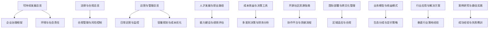
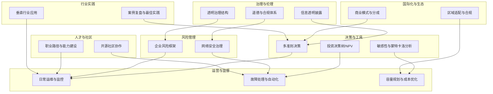
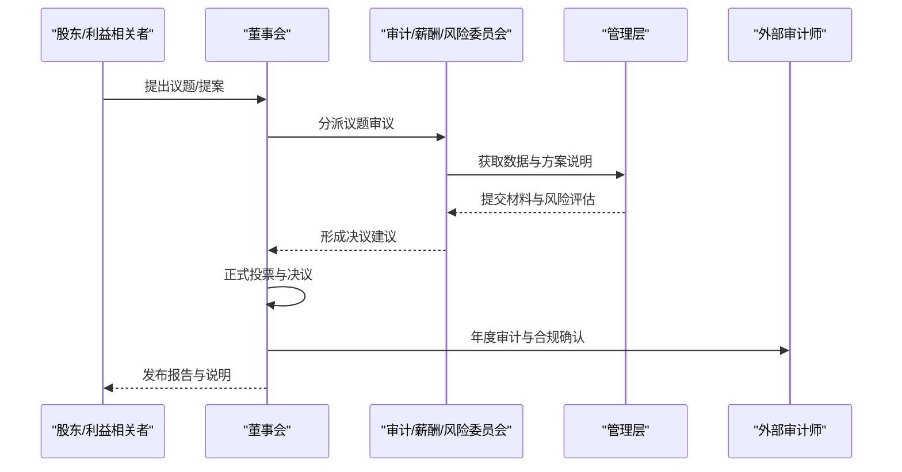
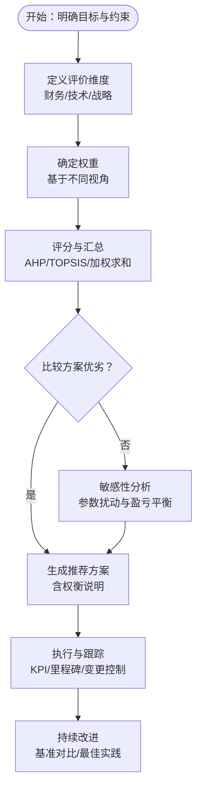
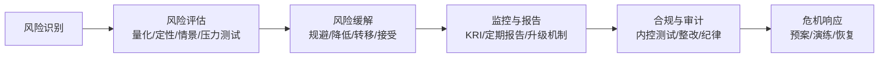
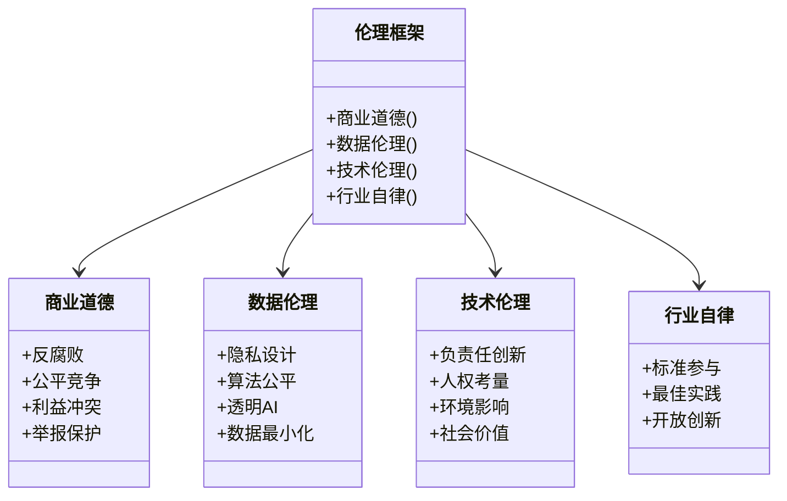
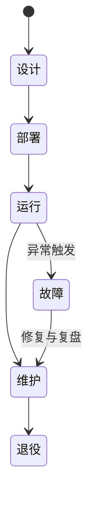
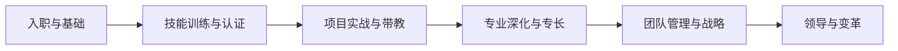
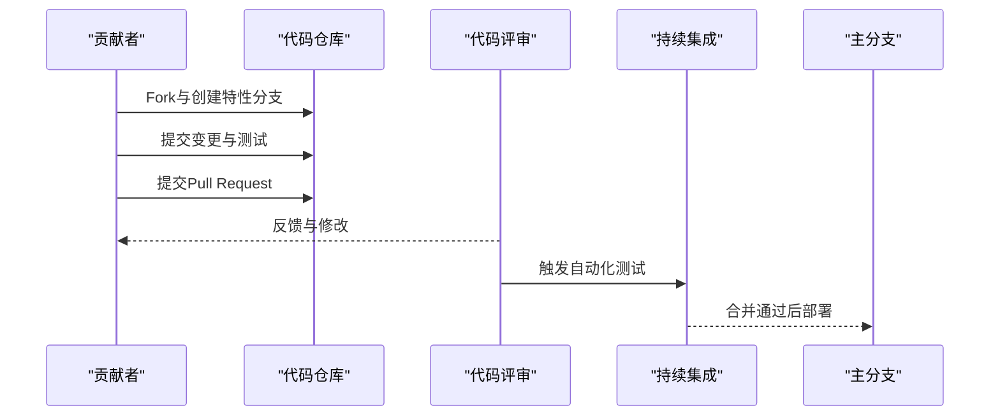
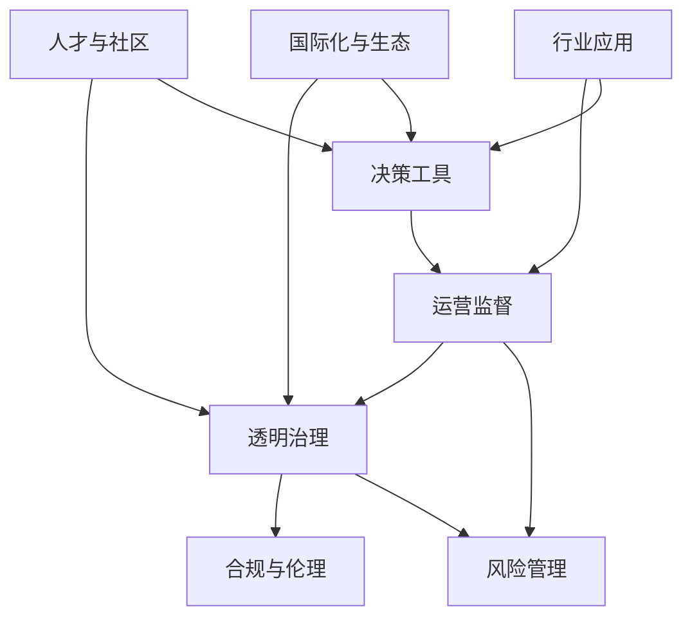

# 企业治理

<cite>
**本文引用的文件**
- [企业治理（英文）](file://24-sustainable-development/corporate-governance/o-ran-corporate-governance.md)
- [可持续发展总览](file://24-sustainable-development/readme.md)
- [法律与合规总览](file://25-legal-regulations/readme.md)
- [运营与管理总览](file://14-operations-management/readme.md)
- [人才发展与职业路径](file://19-talent-development/career-development/o-ran-career-pathways.md)
- [成本效益与决策工具](file://18-cost-benefit-analysis/decision-tools/oran-decision-frameworks.md)
- [开源社区资源指南](file://17-open-source-ecosystem/community-resources/open-source-community-guide.md)
- [国际部署与跨文化管理](file://23-international-deployment/readme.md)
- [业务模型与收益模式](file://20-ecosystem-partnership/business-models/o-ran-business-models.md)
- [行业应用与解决方案](file://16-industry-solutions/readme.md)
- [案例研究与最佳实践](file://21-case-studies/readme.md)
</cite>

## 目录
1. [引言](#引言)
2. [项目结构](#项目结构)
3. [核心组件](#核心组件)
4. [架构总览](#架构总览)
5. [详细组件分析](#详细组件分析)
6. [依赖关系分析](#依赖关系分析)
7. [性能考量](#性能考量)
8. [故障排查指南](#故障排查指南)
9. [结论](#结论)
10. [附录](#附录)

## 引言
本文件面向O-RAN生态体系中的企业治理需求，系统化构建透明治理机制、民主决策流程、透明化操作程序与问责制度；深入分析决策机制设计（利益相关者参与、流程优化与执行监督）；阐述风险管理体系（内控、合规与危机应对）；介绍伦理标准建设（商业道德、数据伦理、技术伦理与行业自律）；并提供治理最佳实践案例（治理结构优化、透明度提升与可持续发展报告）。

## 项目结构
该仓库围绕“架构—组件—接口—部署—合规—运营—可持续发展—案例”形成完整知识谱系。企业治理相关内容主要分布在“可持续发展”“法律与合规”“运营与管理”“人才发展”“成本效益与决策工具”“开源社区资源”“国际部署”“业务模型”“行业应用”“案例研究”等主题目录中，体现治理在组织架构、流程规范、人员能力、技术平台、市场策略与全球运营中的全链路覆盖。

**章节来源**
- file://24-sustainable-development/readme.md#L1-L65
- file://25-legal-regulations/readme.md#L1-L74
- file://14-operations-management/readme.md#L1-L126
- file://19-talent-development/career-development/o-ran-career-pathways.md#L1-L268
- file://18-cost-benefit-analysis/decision-tools/oran-decision-frameworks.md#L1-L726
- file://17-open-source-ecosystem/community-resources/open-source-community-guide.md#L1-L494
- file://23-international-deployment/readme.md#L1-L72
- file://20-ecosystem-partnership/business-models/o-ran-business-models.md#L1-L299
- file://16-industry-solutions/readme.md#L1-L58
- file://21-case-studies/readme.md#L1-L74

## 核心组件
- 透明治理结构：董事会治理、委员会职责、决策流程与利益相关者参与
- 信息透明披露：财务、运营、风险与可持续发展报告
- 道德与合规体系：行为准则、合规内控、培训与监督
- 风险管理与治理：企业风险框架、网络安全治理、持续改进
- 决策机制与工具：多准则决策、投资决策树、敏感性分析、NPV/IRR
- 运营与监督：日常运维、监控告警、故障处理、自动化与生命周期管理
- 人才与能力建设：职业路径、技能矩阵、认证与持续学习
- 开源协作与社区治理：贡献流程、问题管理、社区会议与标准参与
- 国际化与合规：区域适配、许可与数据治理、供应链与跨文化管理
- 生态与商业模式：硬件/软件/服务收入、平台分成、网络切片与边缘计算
- 行业应用与案例：垂直行业经验总结、成功要素与失败教训

**章节来源**
- file://24-sustainable-development/corporate-governance/o-ran-corporate-governance.md#L6-L43
- file://24-sustainable-development/corporate-governance/o-ran-corporate-governance.md#L45-L68
- file://24-sustainable-development/corporate-governance/o-ran-corporate-governance.md#L70-L95
- file://24-sustainable-development/corporate-governance/o-ran-corporate-governance.md#L97-L120
- file://24-sustainable-development/corporate-governance/o-ran-corporate-governance.md#L174-L199
- file://24-sustainable-development/corporate-governance/o-ran-corporate-governance.md#L201-L224
- file://18-cost-benefit-analysis/decision-tools/oran-decision-frameworks.md#L8-L53
- file://18-cost-benefit-analysis/decision-tools/oran-decision-frameworks.md#L55-L304
- file://14-operations-management/readme.md#L6-L35
- file://14-operations-management/readme.md#L36-L81
- file://19-talent-development/career-development/o-ran-career-pathways.md#L6-L99
- file://17-open-source-ecosystem/community-resources/open-source-community-guide.md#L266-L313
- file://23-international-deployment/readme.md#L32-L72
- file://20-ecosystem-partnership/business-models/o-ran-business-models.md#L54-L299
- file://16-industry-solutions/readme.md#L38-L58
- file://21-case-studies/readme.md#L26-L74

## 架构总览
企业治理架构以“透明治理—伦理合规—风险管理—决策工具—运营监督—人才与社区—国际化与生态—行业实践”为主线，形成闭环驱动的价值创造与风险控制体系。

**图表来源**
- [企业治理（英文）](file://24-sustainable-development/corporate-governance/o-ran-corporate-governance.md#L6-L43)
- [企业治理（英文）](file://24-sustainable-development/corporate-governance/o-ran-corporate-governance.md#L97-L120)
- [企业治理（英文）](file://24-sustainable-development/corporate-governance/o-ran-corporate-governance.md#L174-L199)
- [企业治理（英文）](file://24-sustainable-development/corporate-governance/o-ran-corporate-governance.md#L201-L224)
- [成本效益与决策工具](file://18-cost-benefit-analysis/decision-tools/oran-decision-frameworks.md#L8-L53)
- [成本效益与决策工具](file://18-cost-benefit-analysis/decision-tools/oran-decision-frameworks.md#L55-L304)
- [运营与管理总览](file://14-operations-management/readme.md#L6-L35)
- [运营与管理总览](file://14-operations-management/readme.md#L36-L81)
- [人才发展与职业路径](file://19-talent-development/career-development/o-ran-career-pathways.md#L6-L99)
- [开源社区资源指南](file://17-open-source-ecosystem/community-resources/open-source-community-guide.md#L266-L313)
- [国际部署与跨文化管理](file://23-international-deployment/readme.md#L32-L72)
- [业务模型与收益模式](file://20-ecosystem-partnership/business-models/o-ran-business-models.md#L54-L299)
- [行业应用与解决方案](file://16-industry-solutions/readme.md#L38-L58)
- [案例研究与最佳实践](file://21-case-studies/readme.md#L26-L74)

## 详细组件分析

### 透明治理机制与民主决策流程
- 治理架构：独立董事主导、委员会分工（审计、提名与治理、薪酬、风险）、正式会议与投票程序、记录归档与利益相关者沟通
- 透明披露：季度财报、年度报告、分部与技术路线图、关键风险与合规状态、ESG与治理有效性指标
- 民主决策：正式议事规则、执行层汇报、定期股东会与投资者关系、社区与行业对话

**图表来源**
- [企业治理（英文）](file://24-sustainable-development/corporate-governance/o-ran-corporate-governance.md#L8-L43)
- [企业治理（英文）](file://24-sustainable-development/corporate-governance/o-ran-corporate-governance.md#L45-L68)

**章节来源**
- file://24-sustainable-development/corporate-governance/o-ran-corporate-governance.md#L6-L43
- file://24-sustainable-development/corporate-governance/o-ran-corporate-governance.md#L45-L68

### 决策机制设计与执行监督
- 多准则决策（MCDA）：财务/技术/战略维度权重、AHP/TOPSIS加权法、利益相关者视角（CTO/CFO/CIO）
- 投资决策树：传统RAN/O-RAN/混合架构场景、概率与期望值、敏感性分析与盈亏平衡点
- 财务分析：NPV/IRR/回收期、蒙特卡洛模拟与置信区间
- 执行监督：KPI与里程碑、变更管理、持续改进与基准对比

**图表来源**
- [成本效益与决策工具](file://18-cost-benefit-analysis/decision-tools/oran-decision-frameworks.md#L8-L53)
- [成本效益与决策工具](file://18-cost-benefit-analysis/decision-tools/oran-decision-frameworks.md#L55-L304)
- [成本效益与决策工具](file://18-cost-benefit-analysis/decision-tools/oran-decision-frameworks.md#L336-L476)
- [成本效益与决策工具](file://18-cost-benefit-analysis/decision-tools/oran-decision-frameworks.md#L478-L724)

**章节来源**
- file://18-cost-benefit-analysis/decision-tools/oran-decision-frameworks.md#L8-L53
- file://18-cost-benefit-analysis/decision-tools/oran-decision-frameworks.md#L55-L304
- file://18-cost-benefit-analysis/decision-tools/oran-decision-frameworks.md#L336-L476
- file://18-cost-benefit-analysis/decision-tools/oran-decision-frameworks.md#L478-L724

### 风险管理体系（内控、合规与危机应对）
- 企业风险框架：战略、运营、财务、技术风险识别与评估、缓解与监控
- 合规管理：法律遵循、内控流程、培训与意识、审计与整改、纪律处分
- 网络安全治理：CISO角色、安全部门、政策与运营、持续监控与响应
- 危机应对：应急预案、升级流程、业务连续性保障

**图表来源**
- [企业治理（英文）](file://24-sustainable-development/corporate-governance/o-ran-corporate-governance.md#L174-L199)
- [企业治理（英文）](file://24-sustainable-development/corporate-governance/o-ran-corporate-governance.md#L97-L120)
- [企业治理（英文）](file://24-sustainable-development/corporate-governance/o-ran-corporate-governance.md#L201-L224)

**章节来源**
- file://24-sustainable-development/corporate-governance/o-ran-corporate-governance.md#L97-L120
- file://24-sustainable-development/corporate-governance/o-ran-corporate-governance.md#L174-L199
- file://24-sustainable-development/corporate-governance/o-ran-corporate-governance.md#L201-L224

### 伦理标准建设（商业道德、数据伦理、技术伦理与行业自律）
- 商业道德：反腐败、公平竞争、利益冲突管理、举报保护
- 数据伦理：隐私设计、算法公平、透明AI、最小化原则
- 技术伦理：负责任创新、人权考量、环境影响、社会价值
- 行业自律：标准参与、最佳实践分享、开放创新

**图表来源**
- [企业治理（英文）](file://24-sustainable-development/corporate-governance/o-ran-corporate-governance.md#L70-L95)

**章节来源**
- file://24-sustainable-development/corporate-governance/o-ran-corporate-governance.md#L70-L95

### 运营与监督（日常运维、监控告警、故障处理、自动化与生命周期）
- 日常运维：健康检查、配置变更、版本升级、补丁与备份
- 监控告警：阈值设定、异常检测、分类通知、根因分析
- 故障处理：快速定位、应急响应、恢复与复盘、知识库
- 自动化：Ansible/K8s/CI-CD/IaC、无人值守
- 生命周期：设计—部署—运行—维护—退役；配置版本与回滚；文档与知识传承

**图表来源**
- [运营与管理总览](file://14-operations-management/readme.md#L6-L35)
- [运营与管理总览](file://14-operations-management/readme.md#L36-L81)
- [运营与管理总览](file://14-operations-management/readme.md#L82-L126)

**章节来源**
- file://14-operations-management/readme.md#L6-L35
- file://14-operations-management/readme.md#L36-L81
- file://14-operations-management/readme.md#L82-L126

### 人才与能力建设（职业路径、技能矩阵、认证与持续学习）
- 技术路径：初级—中级—高级—专家；架构与集成能力
- 管理路径：团队负责人—部门经理—总监—高管；跨组织协调与投资决策
- 软技能：领导力、沟通、业务洞察、跨文化
- 持续学习：月度/季度/年度活动、认证、社区参与、个人品牌

**图表来源**
- [人才发展与职业路径](file://19-talent-development/career-development/o-ran-career-pathways.md#L6-L99)
- [人才发展与职业路径](file://19-talent-development/career-development/o-ran-career-pathways.md#L100-L170)
- [人才发展与职业路径](file://19-talent-development/career-development/o-ran-career-pathways.md#L171-L218)

**章节来源**
- file://19-talent-development/career-development/o-ran-career-pathways.md#L6-L99
- file://19-talent-development/career-development/o-ran-career-pathways.md#L100-L170
- file://19-talent-development/career-development/o-ran-career-pathways.md#L171-L218

### 开源社区与协作治理（贡献流程、问题管理、社区会议）
- 贡献流程：Fork/分支—实现—测试—提交PR—评审—合并—CI/CD—部署
- 问题模板：缺陷、功能请求、文档改进
- 社区平台：邮件列表、Slack频道、工作组会议、插拔测试与峰会

**图表来源**
- [开源社区资源指南](file://17-open-source-ecosystem/community-resources/open-source-community-guide.md#L266-L313)
- [开源社区资源指南](file://17-open-source-ecosystem/community-resources/open-source-community-guide.md#L217-L264)

**章节来源**
- file://17-open-source-ecosystem/community-resources/open-source-community-guide.md#L266-L313
- file://17-open-source-ecosystem/community-resources/open-source-community-guide.md#L217-L264

### 国际化与合规（区域适配、许可与数据治理、供应链与跨文化）
- 区域特征：北美、欧洲、亚太、拉美与非洲的监管、市场与部署差异
- 本地化：频段、标准、设备定制、接口适配、语言与文化
- 合规：许可证申请、认证、数据主权与跨境传输、网络安全评估
- 供应链：本地采购、物流与清关、售后与风险管控

**章节来源**
- file://23-international-deployment/readme.md#L6-L31
- file://23-international-deployment/readme.md#L32-L72
- file://25-legal-regulations/readme.md#L26-L58

### 生态与商业模式（硬件/软件/服务、平台分成、网络切片与边缘）
- 收入模型：硬件销售、设备即服务、软件授权、xApp/rApp、专业服务、订阅与平台分成
- 新兴模式：网络切片即服务、边缘计算服务、数据洞察与分析
- 收入分配：硬件/软件/服务/运营商分成比例与机制

**章节来源**
- file://20-ecosystem-partnership/business-models/o-ran-business-models.md#L54-L299

### 行业应用与案例（垂直行业落地与最佳实践）
- 应用领域：制造4.0、能源、交通、医疗、教育
- 解决方案要素：网络切片、边缘节点、安全隔离、实施策略
- 成功因素：需求清晰、技术成熟、资源投入、项目管理、持续优化
- 失败教训：架构缺陷、兼容性差、安全漏洞、需求不清、资源不足、组织阻力

**章节来源**
- file://16-industry-solutions/readme.md#L6-L58
- file://21-case-studies/readme.md#L26-L74

## 依赖关系分析
企业治理各模块之间存在强耦合与协同关系：
- 透明治理为合规与风控提供制度基础，确保决策流程可追溯、可审计
- 决策工具支撑投资与运营决策，输出可量化的评估结果与风险区间
- 运营监督保障执行质量，形成闭环反馈至治理与决策迭代
- 人才与社区为治理与技术能力提供支撑，推动标准与最佳实践共享
- 国际化与生态为治理提供外部约束与合作空间，促进可持续价值

**图表来源**
- [企业治理（英文）](file://24-sustainable-development/corporate-governance/o-ran-corporate-governance.md#L6-L43)
- [成本效益与决策工具](file://18-cost-benefit-analysis/decision-tools/oran-decision-frameworks.md#L8-L53)
- [运营与管理总览](file://14-operations-management/readme.md#L6-L35)
- [人才发展与职业路径](file://19-talent-development/career-development/o-ran-career-pathways.md#L6-L99)
- [国际部署与跨文化管理](file://23-international-deployment/readme.md#L32-L72)
- [业务模型与收益模式](file://20-ecosystem-partnership/business-models/o-ran-business-models.md#L54-L299)
- [行业应用与解决方案](file://16-industry-solutions/readme.md#L38-L58)

**章节来源**
- file://24-sustainable-development/corporate-governance/o-ran-corporate-governance.md#L6-L43
- file://18-cost-benefit-analysis/decision-tools/oran-decision-frameworks.md#L8-L53
- file://14-operations-management/readme.md#L6-L35
- file://19-talent-development/career-development/o-ran-career-pathways.md#L6-L99
- file://23-international-deployment/readme.md#L32-L72
- file://20-ecosystem-partnership/business-models/o-ran-business-models.md#L54-L299
- file://16-industry-solutions/readme.md#L38-L58

## 性能考量
- 决策效率：多准则权重与方法论应结合组织优先级动态调整，避免过度复杂化
- 风险量化：NPV/IRR与敏感性分析需对关键参数设定合理波动范围，关注概率正向NPV与区间稳健性
- 运维效能：自动化与监控告警应与变更管理联动，减少变更失败率与平均恢复时间
- 人才培养：认证与持续学习应与岗位胜任力模型对接，缩短上手周期并提升稳定性
- 合规成本：合规流程与审计应与业务节奏匹配，避免过度摩擦与重复劳动

## 故障排查指南
- 决策偏差：若出现“高成本低回报”倾向，检查权重设定与情景假设，进行敏感性分析与参数校准
- 执行滞后：核查KPI与里程碑设置是否合理，变更流程是否冗长，自动化覆盖率是否达标
- 合规违规：审查内控制度与培训记录，强化专项审计与整改闭环
- 技术风险：加强网络安全治理与渗透测试，完善事件响应预案与演练频率
- 国际化障碍：核对许可与数据治理要求，评估供应链中断风险与替代方案

**章节来源**
- file://18-cost-benefit-analysis/decision-tools/oran-decision-frameworks.md#L197-L253
- file://14-operations-management/readme.md#L22-L28
- file://24-sustainable-development/corporate-governance/o-ran-corporate-governance.md#L97-L120
- file://24-sustainable-development/corporate-governance/o-ran-corporate-governance.md#L201-L224
- file://23-international-deployment/readme.md#L60-L72

## 结论
通过将透明治理、伦理合规、风险管理、科学决策、运营监督、人才与社区、国际化与生态、行业实践有机整合，O-RAN企业可在复杂多变的市场环境中实现稳健增长与可持续价值创造。建议以治理框架为纲，以决策工具为器，以运营监督为基，以人才与社区为脉，以合规与风控为盾，持续迭代优化，形成闭环治理闭环。

## 附录
- 治理最佳实践清单
  - 建立独立董事会与专门委员会，明确职责与汇报路径
  - 制定并公开披露信息透明度指标与可持续发展报告
  - 将伦理准则纳入合同与绩效考核，强化举报与保护机制
  - 构建多准则决策与财务分析工具，定期开展敏感性与压力测试
  - 完善运营自动化与监控体系，落实变更与故障管理流程
  - 设计职业发展通道与认证体系，推动跨文化团队协作
  - 建立合规与网络安全治理组织，定期开展审计与演练
  - 制定区域适配与数据治理策略，完善供应链与风险管控
  - 明确生态分成与定价机制，推动平台与开放创新
  - 总结行业案例与失败教训，沉淀最佳实践与知识库