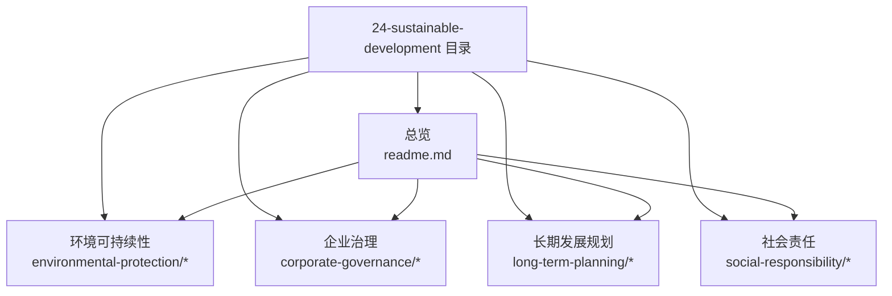
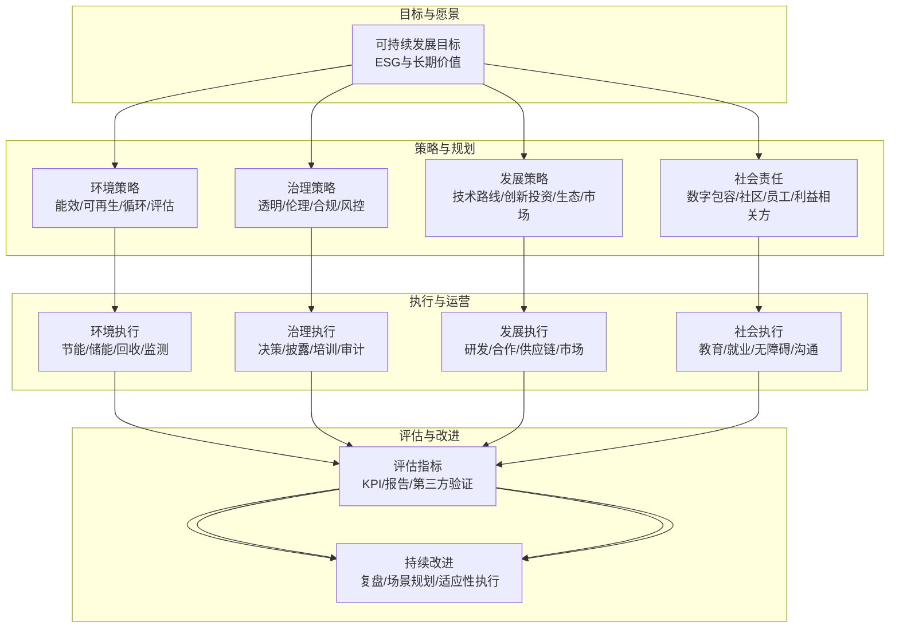
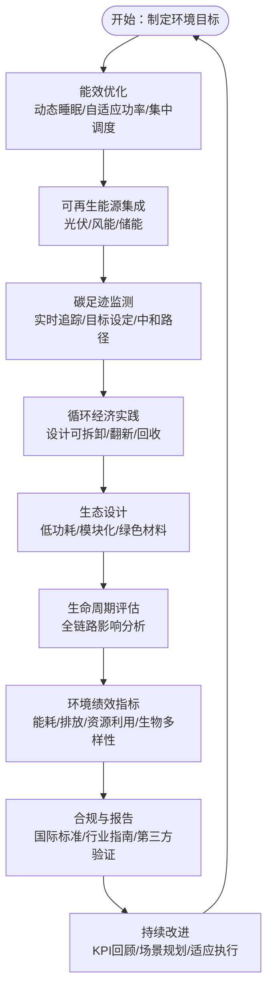
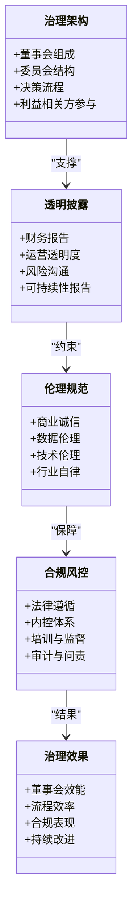
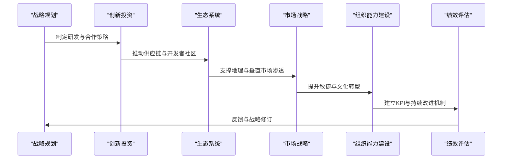
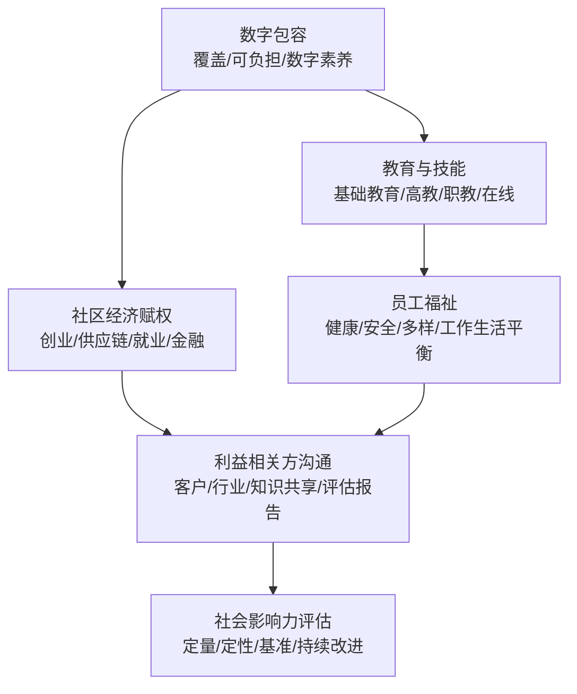
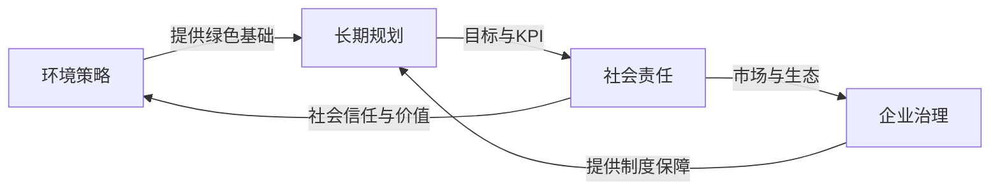

# 可持续发展

<cite>
**本文引用的文件**
- [O-RAN 可持续发展总览](file://24-sustainable-development/readme.md)
- [O-RAN 环境可持续性框架](file://24-sustainable-development/environmental-protection/o-ran-environmental-sustainability.md)
- [O-RAN 企业治理框架](file://24-sustainable-development/corporate-governance/o-ran-corporate-governance.md)
- [O-RAN 长期发展规划（中文）](file://24-sustainable-development/long-term-planning/o-ran-long-term-strategy-zh.md)
- [O-RAN 长期发展规划（英文）](file://24-sustainable-development/long-term-planning/o-ran-long-term-strategy.md)
- [O-RAN 社会责任框架](file://24-sustainable-development/social-responsibility/o-ran-social-responsibility.md)
</cite>

## 目录
1. [引言](#引言)
2. [项目结构](#项目结构)
3. [核心组件](#核心组件)
4. [架构总览](#架构总览)
5. [详细组件分析](#详细组件分析)
6. [依赖分析](#依赖分析)
7. [性能考虑](#性能考虑)
8. [故障排除指南](#故障排除指南)
9. [结论](#结论)
10. [附录](#附录)

## 引言
本文件面向O-RAN可持续发展主题，系统梳理并阐述环境保护、企业治理、长期发展规划、社会责任与可持续发展目标设定及评估方法。内容基于仓库中“24-sustainable-development”目录下的权威文档，结合O-RAN技术特性，提供可操作的策略、流程与评估框架，帮助组织在技术先进性与可持续价值之间取得平衡，实现长期、负责任的发展。

## 项目结构
可持续发展相关内容集中于“24-sustainable-development”目录，包含总览与四大子专题：环境可持续性、企业治理、长期发展规划、社会责任。各子专题均提供中英双语版本，便于国际化协作与传播。

图表来源
- [O-RAN 可持续发展总览](file://24-sustainable-development/readme.md#L1-L65)

章节来源
- [O-RAN 可持续发展总览](file://24-sustainable-development/readme.md#L1-L65)

## 核心组件
- 环境保护与绿色技术：聚焦通信能效优化、可再生能源集成、碳足迹管理、循环经济发展、硬件生态设计与生命周期评估。
- 企业治理：强调透明治理、伦理规范、合规与风控、利益相关方价值、治理有效性评估与持续改进。
- 长期发展规划：覆盖技术路线图（短期/中期/长期）、创新投资策略、生态系统与供应链演进、市场拓展与组织能力建设、可持续增长与KPI体系。
- 社会责任：围绕数字包容、无障碍设计、教育与技能培训、社区经济赋权、员工福祉与多样性、利益相关方沟通与影响力评估。

章节来源
- [O-RAN 可持续发展总览](file://24-sustainable-development/readme.md#L3-L65)

## 架构总览
可持续发展体系由“目标—策略—执行—评估—改进”的闭环构成，贯穿技术、组织与社会三个维度：

图表来源
- [O-RAN 环境可持续性框架](file://24-sustainable-development/environmental-protection/o-ran-environmental-sustainability.md#L3-L285)
- [O-RAN 企业治理框架](file://24-sustainable-development/corporate-governance/o-ran-corporate-governance.md#L3-L278)
- [O-RAN 长期发展规划（英文）](file://24-sustainable-development/long-term-planning/o-ran-long-term-strategy.md#L3-L343)
- [O-RAN 社会责任框架](file://24-sustainable-development/social-responsibility/o-ran-social-responsibility.md#L3-L293)

## 详细组件分析

### 环境保护与绿色技术
- 能源效率优化：动态睡眠机制、设备/站点/网络级节能、负载均衡与集中资源调度；结合预测与机器学习优化需求。
- 可再生能源集成：屋顶光伏、跟踪系统、混合风光、电池储能与削峰填谷。
- 碳足迹管理：实时排放追踪、科学碳目标、减排承诺与中和路径。
- 循环经济：从拆卸、翻新到回收的全生命周期资产管理，材料回收率量化。
- 硬件生态设计：低功耗芯片与加速器、热管理创新、模块化与可升级架构、绿色包装。
- 生命周期评估（LCA）：从开采、制造、物流安装到报废回收的全链路影响评估。
- 环境绩效指标：单位数据能耗、PUE、可再生能源占比、绝对减排、水耗、回收率、生物多样性保护等。
- 合规与标准：ISO 14001、欧盟绿色新政、美国EPA、中国绿色标准，以及GSMA、ITU-T、CDP等产业标准。

图表来源
- [O-RAN 环境可持续性框架](file://24-sustainable-development/environmental-protection/o-ran-environmental-sustainability.md#L8-L285)

章节来源
- [O-RAN 环境可持续性框架](file://24-sustainable-development/environmental-protection/o-ran-environmental-sustainability.md#L3-L285)

### 企业治理与伦理
- 治理架构：董事会组成与委员会职责、决策流程、利益相关方参与。
- 信息透明：财务与运营披露、ESG报告、风险沟通。
- 伦理准则：商业诚信、数据伦理、技术伦理、行业自律。
- 合规与风控：法律遵循、内控体系、培训与监督、审计与问责。
- 治理有效性：董事会效能、流程效率、合规表现、持续改进。

图表来源
- [O-RAN 企业治理框架](file://24-sustainable-development/corporate-governance/o-ran-corporate-governance.md#L8-L278)

章节来源
- [O-RAN 企业治理框架](file://24-sustainable-development/corporate-governance/o-ran-corporate-governance.md#L3-L278)

### 长期发展规划与实施
- 技术路线图：短期（5G Advanced、O-RAN成熟、边缘计算、商用部署扩展）、中期（6G预研、原生云、意图网络、频谱创新、生态构建）、长期（量子通信、AI网络、仿生网络、可持续技术演进）。
- 创新投资：核心研发、前沿探索、知识产权、开放创新。
- 生态系统：供应商生态、智能制造、物流优化、供应链韧性。
- 市场战略：发达市场巩固、新兴市场发展、前沿市场探索、区域策略。
- 组织能力建设：未来技能、组织敏捷、文化转型、技术基础设施。
- 可持续增长：收入多元化、成本优化、投资规划、风险管理。
- 绩效测量：技术领导力、市场地位、财务绩效、可持续性绩效；定期战略审查、情景规划、利益相关方反馈与适应性执行。

图表来源
- [O-RAN 长期发展规划（中文）](file://24-sustainable-development/long-term-planning/o-ran-long-term-strategy-zh.md#L6-L343)
- [O-RAN 长期发展规划（英文）](file://24-sustainable-development/long-term-planning/o-ran-long-term-strategy.md#L6-L343)

章节来源
- [O-RAN 长期发展规划（中文）](file://24-sustainable-development/long-term-planning/o-ran-long-term-strategy-zh.md#L1-L343)
- [O-RAN 长期发展规划（英文）](file://24-sustainable-development/long-term-planning/o-ran-long-term-strategy.md#L1-L343)

### 社会责任与利益相关方
- 数字包容：农村与偏远地区覆盖、可负担方案、数字素养。
- 无障碍设计：通用设计、残障支持、适老化、多语言。
- 教育与技能：学校合作、高等教育、职业培训、在线平台。
- 社区经济赋权：创业支持、供应链融入、就业创造、金融普惠。
- 员工福祉：健康与安全、工作环境、压力管理、多样性与包容。
- 利益相关方沟通：客户关系、行业协作、知识共享、影响力评估与报告。

图表来源
- [O-RAN 社会责任框架](file://24-sustainable-development/social-responsibility/o-ran-social-responsibility.md#L8-L293)

章节来源
- [O-RAN 社会责任框架](file://24-sustainable-development/social-responsibility/o-ran-social-responsibility.md#L3-L293)

## 依赖分析
可持续发展四大支柱相互支撑、协同演进：
- 环境策略为技术与运营提供绿色底座，驱动治理与社会责任的制度化与透明化。
- 企业治理确保资源投入与执行过程的合规、伦理与问责，为长期规划提供组织保障。
- 长期规划将技术、生态与市场目标转化为可衡量的KPI与阶段性里程碑，反向牵引资源配置与能力构建。
- 社会责任以包容与赋权为导向，强化品牌价值与社会信任，促进生态系统的良性循环。

图表来源
- [O-RAN 环境可持续性框架](file://24-sustainable-development/environmental-protection/o-ran-environmental-sustainability.md#L3-L285)
- [O-RAN 企业治理框架](file://24-sustainable-development/corporate-governance/o-ran-corporate-governance.md#L3-L278)
- [O-RAN 长期发展规划（英文）](file://24-sustainable-development/long-term-planning/o-ran-long-term-strategy.md#L3-L343)
- [O-RAN 社会责任框架](file://24-sustainable-development/social-responsibility/o-ran-social-responsibility.md#L3-L293)

## 性能考虑
- 指标体系应兼顾技术领先性与可持续性：如单位流量能耗、PUE、可再生能源占比、碳强度、回收率、社会价值指标等。
- 执行层面需建立跨部门协同机制，避免“孤岛”，确保环境、治理、规划与社会目标在预算、人员与流程上协同配置。
- 评估周期建议采用“年度刷新+季度评估+月度运营审查+实时监控”的多层次节奏，结合情景规划与外部验证，提升适应性与可信度。

## 故障排除指南
- 指标失真或漂移：检查数据采集链路、基期选择与权重设置，确保与业务实际一致。
- 执行滞后：识别跨部门协作瓶颈，明确责任矩阵与关键节点，必要时引入敏捷执行与快速纠偏机制。
- 合规风险：完善内控制度与培训体系，强化审计与问责，确保披露与报告符合内外部标准。
- 社会影响不足：加强利益相关方对话，纳入社区与员工反馈，动态调整项目范围与资源分配。

## 结论
O-RAN可持续发展需要以系统化框架统筹技术、组织与社会目标。通过绿色技术与治理机制的双重驱动，配合长期规划与社会责任实践，可在保持技术领先的同时实现环境友好、社会包容与长期价值创造。建议以KPI与第三方验证为抓手，持续迭代，形成可复制、可推广的最佳实践。

## 附录
- 参考标准与框架：ISO 14001、欧盟绿色新政、美国EPA、中国绿色标准、GSMA、ITU-T、CDP等。
- 术语索引：碳足迹、PUE、生命周期评估（LCA）、意图网络、边缘计算（MEC）、量子通信、仿生网络、再生技术设计、数字包容、无障碍设计、ESG。