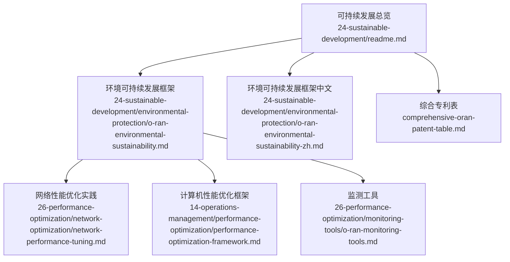
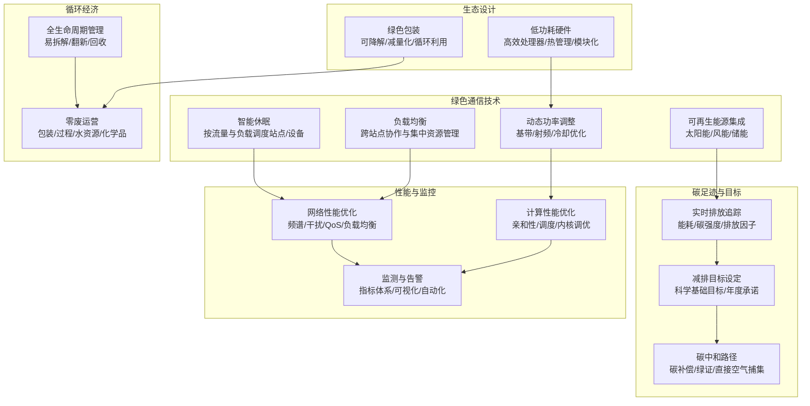
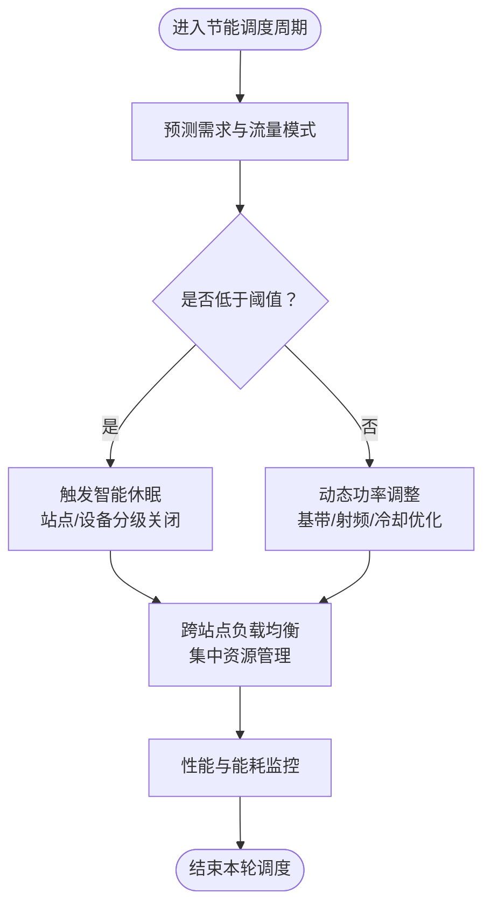
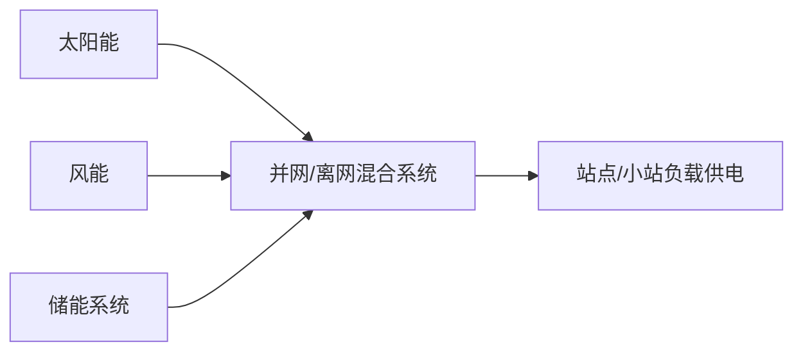
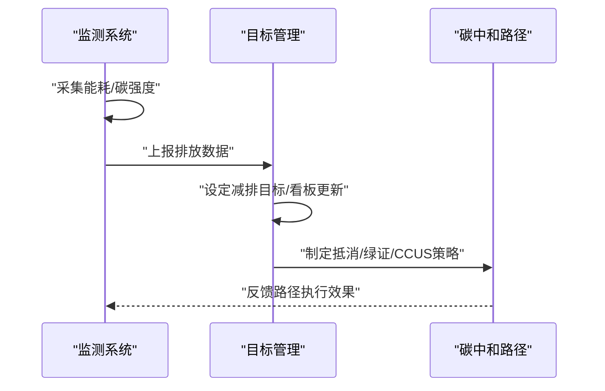
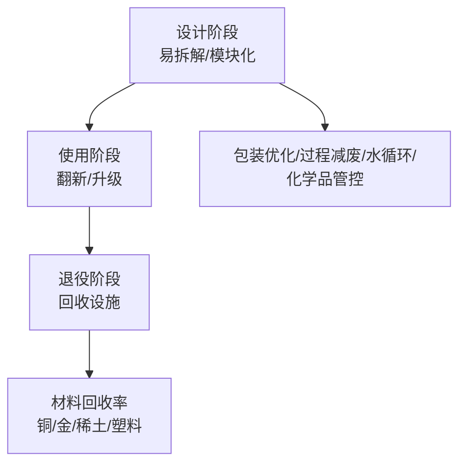
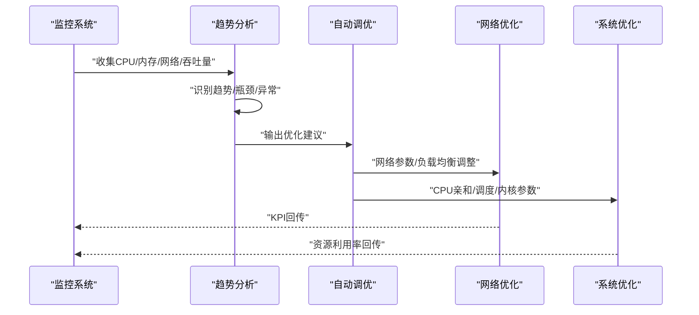
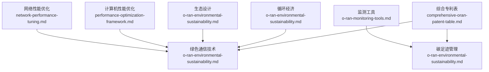

# 环境保护

<cite>
**本文引用的文件**
- [O-RAN 环境可持续发展框架](file://24-sustainable-development/environmental-protection/o-ran-environmental-sustainability.md)
- [O-RAN 环境保护（中文）](file://24-sustainable-development/environmental-protection/o-ran-environmental-sustainability-zh.md)
- [O-RAN 可持续发展总览](file://24-sustainable-development/readme.md)
- [O-RAN 网络性能优化实践](file://26-performance-optimization/network-optimization/network-performance-tuning.md)
- [O-RAN 计算机性能优化框架](file://14-operations-management/performance-optimization/performance-optimization-framework.md)
- [O-RAN 监测工具](file://26-performance-optimization/monitoring-tools/o-ran-monitoring-tools.md)
- [O-RAN 综合专利表](file://comprehensive-oran-patent-table.md)
</cite>

## 目录
1. [简介](#简介)
2. [项目结构](#项目结构)
3. [核心组件](#核心组件)
4. [架构总览](#架构总览)
5. [详细组件分析](#详细组件分析)
6. [依赖关系分析](#依赖关系分析)
7. [性能考量](#性能考量)
8. [故障排查指南](#故障排查指南)
9. [结论](#结论)
10. [附录](#附录)

## 简介
本文件围绕 O-RAN 的环境可持续发展战略，系统梳理绿色通信技术、可再生能源集成、碳足迹管理、循环经济与生态设计等主题，结合仓库中已有的技术文档与专利信息，形成可落地的实施路径与评估方法。内容既面向技术读者，也兼顾非技术背景的读者理解。

## 项目结构
- 环境保护相关的核心内容集中在“可持续发展”目录下的“环境保护”子目录，包含英文与中文版本的框架文档。
- 网络与计算性能优化文档提供了节能与资源调度的工程实践，支撑绿色通信目标的实现。
- 监测与运维文档提供了性能监控与告警的最佳实践，保障节能策略的可视化与可度量。
- 综合专利表明确了智能休眠、可再生能源集成、碳足迹监测等关键技术的专利布局，为技术路线与合规提供参考。

图表来源
- [O-RAN 可持续发展总览](file://24-sustainable-development/readme.md#L1-L65)
- [O-RAN 环境可持续发展框架](file://24-sustainable-development/environmental-protection/o-ran-environmental-sustainability.md#L1-L285)
- [O-RAN 网络性能优化实践](file://26-performance-optimization/network-optimization/network-performance-tuning.md#L1-L98)
- [O-RAN 计算机性能优化框架](file://14-operations-management/performance-optimization/performance-optimization-framework.md#L103-L234)
- [O-RAN 监测工具](file://26-performance-optimization/monitoring-tools/o-ran-monitoring-tools.md#L286-L355)
- [O-RAN 综合专利表](file://comprehensive-oran-patent-table.md#L120-L136)

章节来源
- [O-RAN 可持续发展总览](file://24-sustainable-development/readme.md#L1-L65)

## 核心组件
- 绿色通信技术：覆盖智能休眠、动态功率调整、负载均衡等节能技术，以及可再生能源集成与碳足迹监测体系。
- 循环经济：从设备全生命周期管理到回收与材料再利用，提出零废运营框架。
- 生态设计：低功耗硬件、模块化架构、环境适应性与绿色包装等可持续设计原则。
- 性能与监控：通过网络与计算层面的优化实践，配合监测与自动化调优工具，实现节能与稳定性的平衡。

章节来源
- [O-RAN 环境可持续发展框架](file://24-sustainable-development/environmental-protection/o-ran-environmental-sustainability.md#L6-L50)
- [O-RAN 环境可持续发展框架](file://24-sustainable-development/environmental-protection/o-ran-environmental-sustainability.md#L77-L127)
- [O-RAN 环境可持续发展框架](file://24-sustainable-development/environmental-protection/o-ran-environmental-sustainability.md#L129-L179)
- [O-RAN 可持续发展总览](file://24-sustainable-development/readme.md#L6-L18)

## 架构总览
下图展示了 O-RAN 环境可持续发展体系的总体架构：以绿色通信技术为基础，通过可再生能源与碳足迹管理实现低碳运营；以循环经济与生态设计降低全生命周期环境影响；以性能优化与监控保障节能策略的可执行性与可观测性。

图表来源
- [O-RAN 环境可持续发展框架](file://24-sustainable-development/environmental-protection/o-ran-environmental-sustainability.md#L6-L50)
- [O-RAN 环境可持续发展框架](file://24-sustainable-development/environmental-protection/o-ran-environmental-sustainability.md#L77-L127)
- [O-RAN 网络性能优化实践](file://26-performance-optimization/network-optimization/network-performance-tuning.md#L62-L82)
- [O-RAN 计算机性能优化框架](file://14-operations-management/performance-optimization/performance-optimization-framework.md#L103-L234)
- [O-RAN 监测工具](file://26-performance-optimization/monitoring-tools/o-ran-monitoring-tools.md#L286-L355)

## 详细组件分析

### 绿色通信技术：智能休眠、动态功率调整与负载均衡
- 智能休眠：基于流量预测与机器学习算法，实现站点与设备的按需激活/关闭，减少空闲能耗。
- 动态功率调整：对基带单元、射频模块与冷却系统进行自适应控制，降低峰值能耗。
- 负载均衡：跨站点的负载协同与覆盖协作，避免局部过载与能源浪费。

图表来源
- [O-RAN 环境可持续发展框架](file://24-sustainable-development/environmental-protection/o-ran-environmental-sustainability.md#L10-L23)
- [O-RAN 网络性能优化实践](file://26-performance-optimization/network-optimization/network-performance-tuning.md#L62-L82)

章节来源
- [O-RAN 环境可持续发展框架](file://24-sustainable-development/environmental-protection/o-ran-environmental-sustainability.md#L6-L50)
- [O-RAN 网络性能优化实践](file://26-performance-optimization/network-optimization/network-performance-tuning.md#L62-L82)

### 可再生能源集成：太阳能、风能与储能
- 太阳能：屋顶安装、跟踪系统与电池储能一体化。
- 风能：小型风机、风光互补与微发电单元。
- 储能：锂电系统、并网储能与削峰填谷优化。

图表来源
- [O-RAN 环境可持续发展框架](file://24-sustainable-development/environmental-protection/o-ran-environmental-sustainability.md#L24-L36)

章节来源
- [O-RAN 环境可持续发展框架](file://24-sustainable-development/environmental-protection/o-ran-environmental-sustainability.md#L24-L36)

### 碳足迹管理体系：监测、目标与路径
- 实时监测：能耗、碳强度与排放因子数据库联动。
- 减排目标：科学基础目标、年度承诺与进度看板。
- 碳中和路径：碳补偿、绿证与直接空气捕集投资。

图表来源
- [O-RAN 环境可持续发展框架](file://24-sustainable-development/environmental-protection/o-ran-environmental-sustainability.md#L37-L49)

章节来源
- [O-RAN 环境可持续发展框架](file://24-sustainable-development/environmental-protection/o-ran-environmental-sustainability.md#L37-L49)

### 循环经济：设备回收、材料再利用与废物最小化
- 设备全生命周期：易拆解设计、翻新流程与回收设施。
- 材料回收率：铜、金、稀土元素与塑料的回收目标。
- 零废运营：包装优化、过程减废、水资源循环与化学品管理。

图表来源
- [O-RAN 环境可持续发展框架](file://24-sustainable-development/environmental-protection/o-ran-environmental-sustainability.md#L79-L127)

章节来源
- [O-RAN 环境可持续发展框架](file://24-sustainable-development/environmental-protection/o-ran-environmental-sustainability.md#L77-L127)

### 生态设计：低功耗硬件、模块化与绿色包装
- 低功耗硬件：高效处理器、FPGA/ASIC加速与电源门控。
- 热管理：液冷、热管、自然对流与相变材料。
- 模块化：热插拔、可扩展与可升级，延长设备寿命。
- 绿色包装：可降解材料、减量化与循环利用。

章节来源
- [O-RAN 环境可持续发展框架](file://24-sustainable-development/environmental-protection/o-ran-environmental-sustainability.md#L52-L75)
- [O-RAN 可持续发展总览](file://24-sustainable-development/readme.md#L14-L18)

### 性能与监控：网络与计算优化及自动化调优
- 网络侧：频谱效率、干扰管理、数据压缩与QoS参数调优，以及智能休眠与负载均衡。
- 计算侧：CPU亲和性、进程优先级、内核调度器调优。
- 监测与告警：四黄金信号、RED/USE方法、告警设计与可靠性保障。
- 自动化调优：基于历史指标的趋势分析与推荐，生成优化报告。

图表来源
- [O-RAN 网络性能优化实践](file://26-performance-optimization/network-optimization/network-performance-tuning.md#L62-L82)
- [O-RAN 计算机性能优化框架](file://14-operations-management/performance-optimization/performance-optimization-framework.md#L450-L648)
- [O-RAN 监测工具](file://26-performance-optimization/monitoring-tools/o-ran-monitoring-tools.md#L286-L355)

章节来源
- [O-RAN 网络性能优化实践](file://26-performance-optimization/network-optimization/network-performance-tuning.md#L1-L98)
- [O-RAN 计算机性能优化框架](file://14-operations-management/performance-optimization/performance-optimization-framework.md#L103-L234)
- [O-RAN 监测工具](file://26-performance-optimization/monitoring-tools/o-ran-monitoring-tools.md#L286-L355)

## 依赖关系分析
- 绿色通信技术依赖于网络与计算性能优化文档提供的工程能力，以实现智能休眠与动态功率调整的自动化与可视化。
- 碳足迹管理依赖监测工具提供的指标体系与告警机制，确保数据质量与目标达成的可追踪性。
- 循环经济与生态设计为绿色通信提供硬件与供应链层面的支撑，降低全生命周期能耗与材料消耗。
- 专利表为上述技术路线提供知识产权布局参考，指导技术选型与合规。

图表来源
- [O-RAN 网络性能优化实践](file://26-performance-optimization/network-optimization/network-performance-tuning.md#L1-L98)
- [O-RAN 计算机性能优化框架](file://14-operations-management/performance-optimization/performance-optimization-framework.md#L103-L234)
- [O-RAN 监测工具](file://26-performance-optimization/monitoring-tools/o-ran-monitoring-tools.md#L286-L355)
- [O-RAN 环境可持续发展框架](file://24-sustainable-development/environmental-protection/o-ran-environmental-sustainability.md#L6-L50)
- [O-RAN 综合专利表](file://comprehensive-oran-patent-table.md#L120-L136)

章节来源
- [O-RAN 环境可持续发展框架](file://24-sustainable-development/environmental-protection/o-ran-environmental-sustainability.md#L1-L285)
- [O-RAN 综合专利表](file://comprehensive-oran-patent-table.md#L120-L136)

## 性能考量
- 节能与性能的平衡：通过智能休眠与动态功率调整，在保证用户体验的前提下降低能耗；通过负载均衡与QoS参数优化，维持低时延与高可靠。
- 自动化与可观测性：利用趋势分析与自动化调优，减少人工干预成本；通过监控与告警体系，快速定位瓶颈并闭环优化。
- 成本与收益：节能带来的电力成本下降与设备寿命延长，应结合ROI评估方法进行长期价值衡量。

## 故障排查指南
- 监控指标异常：检查四黄金信号与RED/USE方法识别的瓶颈，确认是否存在CPU/内存/网络饱和或错误率上升。
- 调度与亲和性问题：核对进程亲和性设置与优先级，确保关键进程（如近实时RIC、DU/CU、SMO）被正确绑定与优先处理。
- 内核调度器：核对调度器相关内核参数，避免迁移成本过高或RT预算不足导致的时延抖动。
- 告警噪声与疲劳：通过阈值设置、相关性过滤与优先级路由，降低无效告警，提升响应效率。

章节来源
- [O-RAN 监测工具](file://26-performance-optimization/monitoring-tools/o-ran-monitoring-tools.md#L286-L355)
- [O-RAN 计算机性能优化框架](file://14-operations-management/performance-optimization/performance-optimization-framework.md#L103-L234)

## 结论
O-RAN 的环境可持续发展需要以绿色通信技术为核心抓手，结合可再生能源与碳足迹管理，构建闭环的节能与低碳运营体系；同时通过循环经济与生态设计降低全生命周期环境影响；借助网络与计算性能优化、监测与自动化调优工具，实现可执行、可度量、可改进的可持续发展路径。专利布局则为技术路线提供知识产权保障与合规指引。

## 附录
- 实施案例与效果评估建议
  - 案例类型：区域站点智能休眠试点、风光储一体化供电改造、设备翻新与回收率提升、绿色包装与物流优化。
  - 评估方法：建立KPI基线（能耗/碳强度/回收率/水耗/废物率），对比优化前后趋势与同比变化，结合ROI与ESG回报进行综合评价。
- 技术路线图（概念示意）
  - 短期：部署智能休眠与动态功率调整，完成碳排放盘查与目标设定。
  - 中期：推进可再生能源与储能系统，完善监测与告警体系，启动设备翻新与回收。
  - 长期：实现碳中和路径与循环经济目标，探索量子/生物启发等前沿技术。