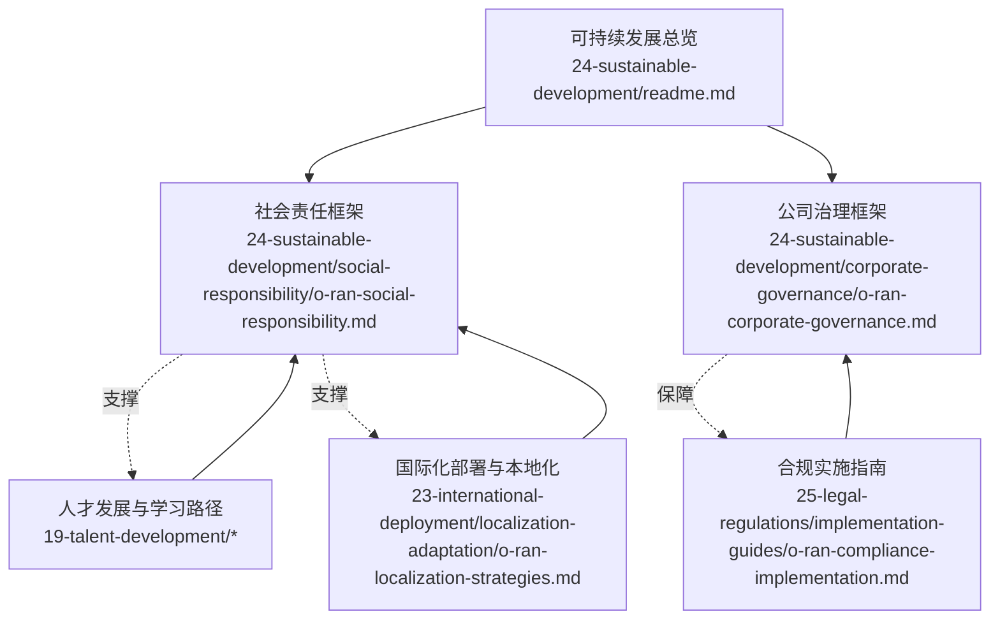
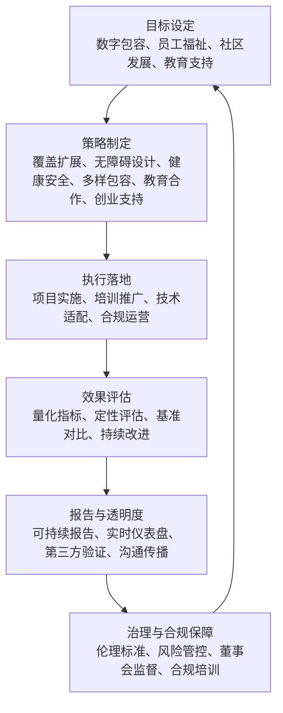
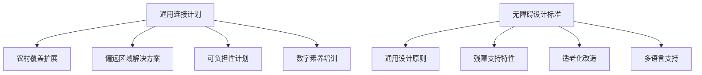
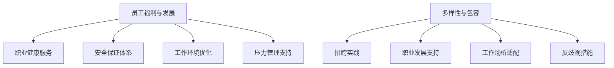
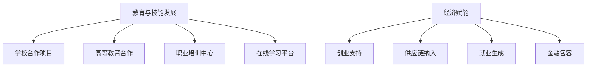
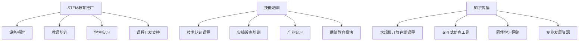
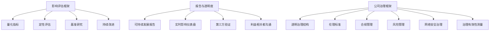
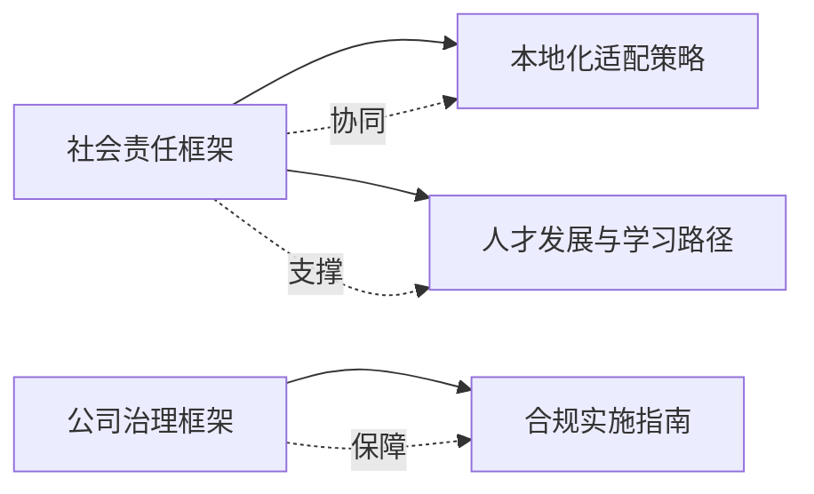

# 社会责任

<cite>
**本文引用的文件**
- [可持续发展总览](file://24-sustainable-development/readme.md)
- [社会责任框架](file://24-sustainable-development/social-responsibility/o-ran-social-responsibility.md)
- [公司治理框架](file://24-sustainable-development/corporate-governance/o-ran-corporate-governance.md)
- [本地化适配策略](file://23-international-deployment/localization-adaptation/o-ran-localization-strategies.md)
- [合规实施指南](file://25-legal-regulations/implementation-guides/o-ran-compliance-implementation.md)
- [职业发展路径（英文）](file://19-talent-development/career-development/o-ran-career-pathways.md)
- [学习路线图（英文）](file://19-talent-development/learning-paths/o-ran-learning-roadmaps.md)
</cite>

## 目录
1. [引言](#引言)
2. [项目结构](#项目结构)
3. [核心组件](#核心组件)
4. [架构总览](#架构总览)
5. [详细组件分析](#详细组件分析)
6. [依赖分析](#依赖分析)
7. [性能考虑](#性能考虑)
8. [故障排除指南](#故障排除指南)
9. [结论](#结论)
10. [附录](#附录)

## 引言
本文件围绕“社会责任”主题，系统梳理并呈现本项目在以下方面的实践与框架：
- 数字包容性：普遍服务理念、农村与偏远地区覆盖、弥合数字鸿沟、无障碍设计
- 员工关怀：健康安全保障、公平就业、技能培训体系、工作生活平衡
- 社区发展：促进当地就业、支持产业发展、推动经济振兴
- 教育支持：推广STEM教育、开展技能培训、传播知识与能力
- 实施框架：责任目标设定、执行策略、效果评估与报告透明度

本文件以项目现有资料为基础，结合可操作的流程与机制，帮助读者快速理解并落地社会责任实践。

## 项目结构
本项目在“可持续发展”目录下提供了社会责任与公司治理的整体框架；同时，其他相关模块如“国际化部署”“人才发展”“合规实施”等也提供了支撑性内容，形成跨领域的协同支撑。

**图表来源**
- [可持续发展总览](file://24-sustainable-development/readme.md#L1-L65)
- [社会责任框架](file://24-sustainable-development/social-responsibility/o-ran-social-responsibility.md#L1-L293)
- [公司治理框架](file://24-sustainable-development/corporate-governance/o-ran-corporate-governance.md#L1-L278)
- [本地化适配策略](file://23-international-deployment/localization-adaptation/o-ran-localization-strategies.md#L96-L140)
- [合规实施指南](file://25-legal-regulations/implementation-guides/o-ran-compliance-implementation.md#L250-L300)
- [职业发展路径（英文）](file://19-talent-development/career-development/o-ran-career-pathways.md#L100-L268)
- [学习路线图（英文）](file://19-talent-development/learning-paths/o-ran-learning-roadmaps.md#L269-L297)

**章节来源**
- [可持续发展总览](file://24-sustainable-development/readme.md#L1-L65)

## 核心组件
- 数字包容性：面向农村与偏远地区的连接扩展、可负担性方案、数字素养培训，以及通用设计、无障碍功能、适老化与多语言支持。
- 员工关怀：健康与安全管理体系、工作环境优化、压力管理与心理支持、多样性与包容性制度。
- 社区发展：教育与技能发展、创业与供应链融入、就业生成、金融普惠。
- 教育支持：学校合作、高校研究合作、职业培训中心、在线学习平台。
- 公司治理：透明决策、信息披露、伦理标准、合规管理、风险治理、利益相关者价值。
- 实施与评估：影响评估框架、报告与透明度、第三方验证、持续改进。

**章节来源**
- [社会责任框架](file://24-sustainable-development/social-responsibility/o-ran-social-responsibility.md#L6-L293)
- [公司治理框架](file://24-sustainable-development/corporate-governance/o-ran-corporate-governance.md#L6-L278)

## 架构总览
社会责任的实施由“目标—策略—执行—评估—报告—改进”的闭环构成，贯穿于技术部署、组织治理与社区协作全过程。

**图表来源**
- [社会责任框架](file://24-sustainable-development/social-responsibility/o-ran-social-responsibility.md#L214-L264)
- [公司治理框架](file://24-sustainable-development/corporate-governance/o-ran-corporate-governance.md#L174-L276)

## 详细组件分析

### 数字包容性实践
- 覆盖扩展：卫星回传、电视空白频谱、无人机临时覆盖、社区热点等，提升农村与偏远地区连通率。
- 可负担性：设备分期付款、按需付费数据套餐、社区共担模式、政府合作资金。
- 数字素养：基础计算机技能、移动互联网使用、网络安全意识、电商与数字支付应用。
- 无障碍设计：通用设计原则、多模态界面、高对比显示、语音控制；针对残障人士的读屏兼容、助听环路、触觉反馈；适老化简化界面、大按钮、清晰导航；多语言界面、实时翻译、文化适配。

**图表来源**
- [社会责任框架](file://24-sustainable-development/social-responsibility/o-ran-social-responsibility.md#L8-L56)
- [本地化适配策略](file://23-international-deployment/localization-adaptation/o-ran-localization-strategies.md#L96-L140)

**章节来源**
- [社会责任框架](file://24-sustainable-development/social-responsibility/o-ran-social-responsibility.md#L6-L56)
- [本地化适配策略](file://23-international-deployment/localization-adaptation/o-ran-localization-strategies.md#L96-L140)

### 员工关怀体系
- 健康与安全：职业健康服务、工作环境人体工程学评估、心理健康咨询、应急响应与事故调查。
- 工作环境优化：弹性工作安排、远程办公能力、协作空间设计、环境舒适度控制。
- 压力管理：员工援助计划、正念训练、工作生活平衡、同伴支持网络。
- 多元与包容：招聘盲选、多元面试小组、包容性职位描述、无障碍设施与宗教节日支持、反歧视政策与培训、举报与处置机制。

**图表来源**
- [社会责任框架](file://24-sustainable-development/social-responsibility/o-ran-social-responsibility.md#L110-L160)
- [公司治理框架](file://24-sustainable-development/corporate-governance/o-ran-corporate-governance.md#L149-L172)

**章节来源**
- [社会责任框架](file://24-sustainable-development/social-responsibility/o-ran-social-responsibility.md#L110-L160)
- [公司治理框架](file://24-sustainable-development/corporate-governance/o-ran-corporate-governance.md#L149-L172)

### 社区发展贡献
- 教育与技能：学校合作、高校研究合作、职业培训中心、在线学习平台。
- 创业与产业：创业孵化、商业计划竞赛、导师网络、种子资金；供应链纳入、能力建设、质量标准培训、公平贸易合作。
- 就业与金融：部署期就业岗位、维护服务网络、技术支持中心、数字服务平台；移动支付、小额金融、数字支付、金融素养。

**图表来源**
- [社会责任框架](file://24-sustainable-development/social-responsibility/o-ran-social-responsibility.md#L58-L108)

**章节来源**
- [社会责任框架](file://24-sustainable-development/social-responsibility/o-ran-social-responsibility.md#L58-L108)

### 教育支持项目
- STEM教育推广：设备捐赠、教师培训、学生实习、课程开发支持。
- 技能培养：技术认证课程、实操设备培训、产业实习、继续教育模块。
- 知识传播：MOOC、交互式仿真、同伴学习网络、专业发展资源。

**图表来源**
- [社会责任框架](file://24-sustainable-development/social-responsibility/o-ran-social-responsibility.md#L60-L83)
- [学习路线图（英文）](file://19-talent-development/learning-paths/o-ran-learning-roadmaps.md#L269-L297)

**章节来源**
- [社会责任框架](file://24-sustainable-development/social-responsibility/o-ran-social-responsibility.md#L60-L83)
- [学习路线图（英文）](file://19-talent-development/learning-paths/o-ran-learning-roadmaps.md#L269-L297)

### 实施框架与治理保障
- 影响评估：量化指标（数字包容、就业、经济、环境）、定性评估（社区满意度、利益相关者反馈、案例研究）、基准研究（行业对比、区域评估、趋势监测）、持续改进。
- 报告与透明度：可持续发展报告、实时影响仪表盘、第三方验证、利益相关者沟通。
- 公司治理：透明治理结构、伦理标准、合规管理、风险管理、网络安全治理、治理有效性测量与持续改进。

**图表来源**
- [社会责任框架](file://24-sustainable-development/social-responsibility/o-ran-social-responsibility.md#L214-L264)
- [公司治理框架](file://24-sustainable-development/corporate-governance/o-ran-corporate-governance.md#L6-L278)

**章节来源**
- [社会责任框架](file://24-sustainable-development/social-responsibility/o-ran-social-responsibility.md#L214-L264)
- [公司治理框架](file://24-sustainable-development/corporate-governance/o-ran-corporate-governance.md#L6-L278)

## 依赖分析
- 数字包容性与本地化适配密切相关：多语言与文化适配是实现无障碍与可负担性的关键。
- 员工关怀与公司治理中的伦理与合规相辅相成：健康安全与多样性政策需要制度化与监督保障。
- 社区发展与教育支持依赖于系统化的培训与学习路径，确保长期能力提升。
- 合规实施指南为公司治理与社会责任提供操作层面的培训与执行工具。

**图表来源**
- [社会责任框架](file://24-sustainable-development/social-responsibility/o-ran-social-responsibility.md#L1-L293)
- [公司治理框架](file://24-sustainable-development/corporate-governance/o-ran-corporate-governance.md#L1-L278)
- [本地化适配策略](file://23-international-deployment/localization-adaptation/o-ran-localization-strategies.md#L96-L140)
- [合规实施指南](file://25-legal-regulations/implementation-guides/o-ran-compliance-implementation.md#L250-L300)
- [职业发展路径（英文）](file://19-talent-development/career-development/o-ran-career-pathways.md#L100-L268)
- [学习路线图（英文）](file://19-talent-development/learning-paths/o-ran-learning-roadmaps.md#L269-L297)

**章节来源**
- [本地化适配策略](file://23-international-deployment/localization-adaptation/o-ran-localization-strategies.md#L96-L140)
- [合规实施指南](file://25-legal-regulations/implementation-guides/o-ran-compliance-implementation.md#L250-L300)
- [职业发展路径（英文）](file://19-talent-development/career-development/o-ran-career-pathways.md#L100-L268)
- [学习路线图（英文）](file://19-talent-development/learning-paths/o-ran-learning-roadmaps.md#L269-L297)

## 性能考虑
- 目标设定应遵循SMART原则，明确可衡量的指标（如接入覆盖率、受训人数、就业岗位数量、社区满意度）。
- 执行阶段需建立里程碑与阶段性评估，确保资源投入与产出匹配。
- 评估与报告应采用多维度指标，兼顾定量与定性，定期进行基准对比与趋势分析。
- 治理与合规保障是长期可持续性的前提，需持续投入培训、审计与改进。

## 故障排除指南
- 员工关怀落实不到位：检查健康与安全制度是否覆盖、工作环境是否符合人体工程学、压力管理资源是否充足；通过定期满意度调查与匿名反馈渠道识别问题。
- 数字包容性进展缓慢：评估覆盖方案的技术可行性与成本效益，确认可负担性与数字素养培训的覆盖面与质量；结合本地化策略调整语言与文化适配。
- 社区发展缺乏持续性：梳理教育与创业支持项目的衔接机制，强化供应链与地方企业合作；建立长期跟踪与激励机制。
- 合规与治理风险：完善合规培训与操作流程，加强内部审计与第三方验证，建立风险预警与应急响应机制。

**章节来源**
- [社会责任框架](file://24-sustainable-development/social-responsibility/o-ran-social-responsibility.md#L110-L160)
- [公司治理框架](file://24-sustainable-development/corporate-governance/o-ran-corporate-governance.md#L97-L120)

## 结论
本项目在社会责任方面已形成较为完整的框架：以数字包容为核心，结合员工福祉、社区发展与教育支持，并以公司治理与合规为保障，构建了从目标设定到评估改进的闭环。建议在后续实践中进一步细化量化指标、强化跨部门协同与外部合作伙伴关系，持续提升社会影响力与长期价值。

## 附录
- 未来愿景（至2030）：实现数字公平、包容型职场、社区赋权与行业领导力，推动全球标准制定与负责任技术创新。

**章节来源**
- [社会责任框架](file://24-sustainable-development/social-responsibility/o-ran-social-responsibility.md#L266-L293)