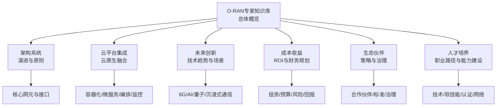
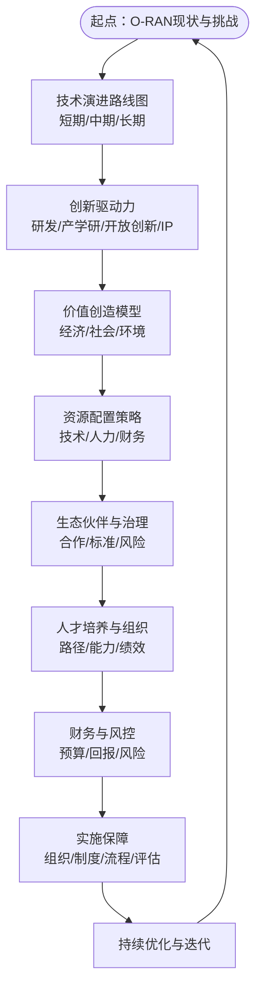
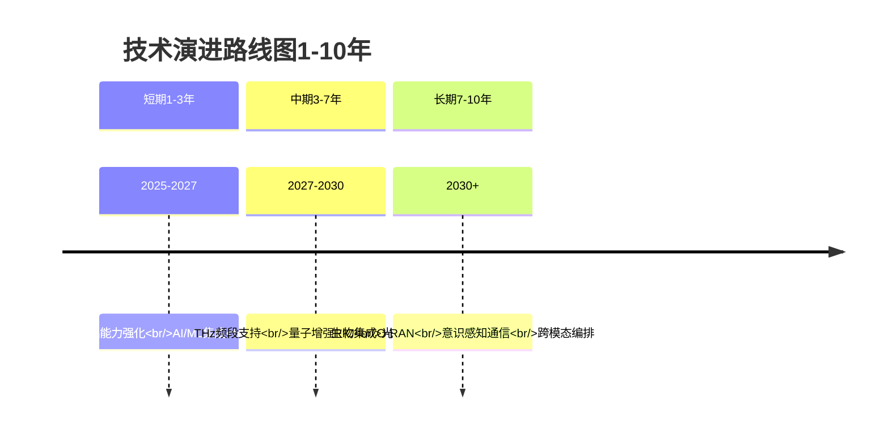
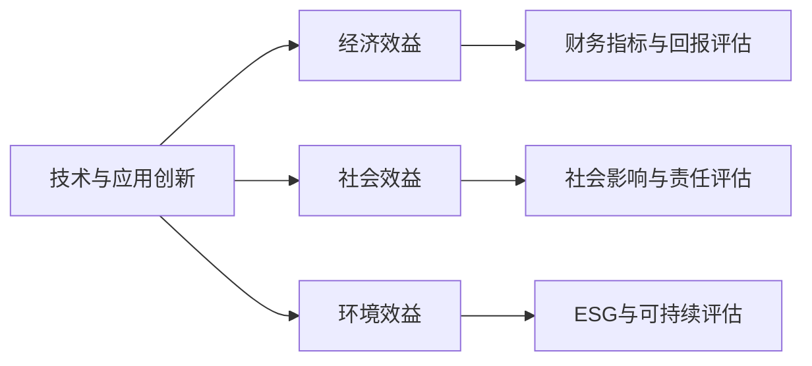
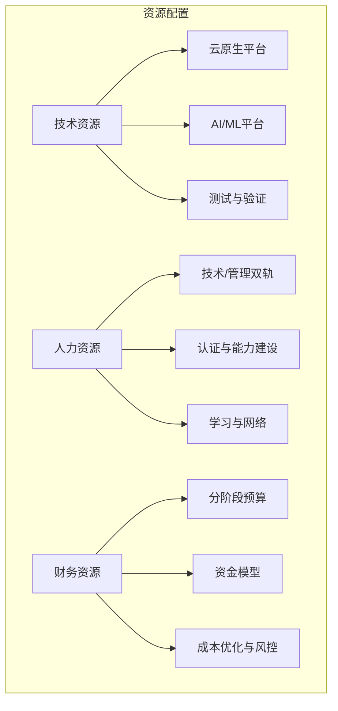
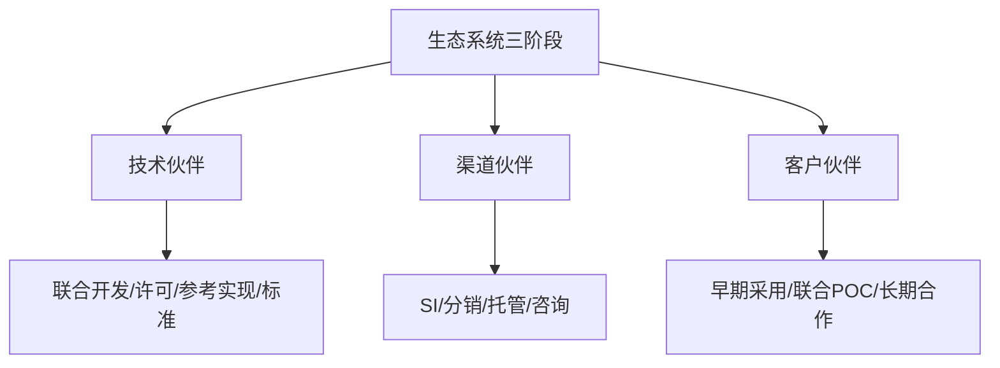
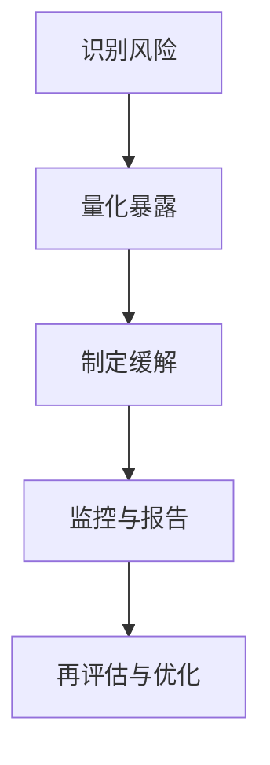
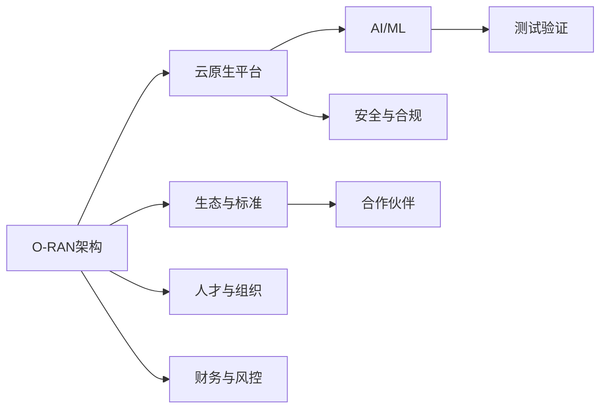

# 长期发展规划

<cite>
**本文引用的文件**
- [README.md](file://README.md)
- [architecture-evolution.md](file://01-architecture-system/architecture-evolution.md)
- [cloud-native-architecture.md](file://05-cloud-integration/cloud-native-architecture.md)
- [technology-evolution-roadmap.md](file://15-future-development/technology-trends/technology-evolution-roadmap.md)
- [emerging-applications-roadmap.md](file://15-future-development/emerging-applications/emerging-applications-roadmap.md)
- [o-ran-roi-analysis.md](file://18-cost-benefit-analysis/roi-analysis/o-ran-roi-analysis.md)
- [oran-financial-planning.md](file://18-cost-benefit-analysis/financial-planning/oran-financial-planning.md)
- [o-ran-ecosystem-strategy.md](file://20-ecosystem-partnership/ecosystem-strategy/o-ran-ecosystem-strategy.md)
- [o-ran-career-pathways.md](file://19-talent-development/career-development/o-ran-career-pathways.md)
</cite>

## 目录
1. [引言](#引言)
2. [项目结构](#项目结构)
3. [核心组件](#核心组件)
4. [架构总览](#架构总览)
5. [详细组件分析](#详细组件分析)
6. [依赖分析](#依赖分析)
7. [性能考虑](#性能考虑)
8. [故障排查指南](#故障排查指南)
9. [结论](#结论)
10. [附录](#附录)

## 引言
本文件面向O-RAN数据库项目的长期发展规划，系统梳理技术演进路线图（短期1-3年、中期3-7年、长期7-10年），提出创新驱动力（研发投资、产学研、开放创新、知识产权）、价值创造模型（经济效益、社会效益、环境效益）与资源配置策略（技术、人力、财务），并给出战略实施保障（组织、制度、风控、绩效）。规划以仓库现有文档为基础，结合O-RAN架构演进、云原生融合、前沿技术趋势、成本收益分析、生态伙伴策略与人才发展路径，形成可执行、可评估、可持续的总体蓝图。

## 项目结构
本知识库围绕“O-RAN专家知识体系”组织，涵盖架构系统、核心网元、接口标准、解耦选项、云平台集成、工作组、RIC与AI、部署实施、标准合规、应用场景、安全隐私、测试验证、运营管理、未来创新、行业解决方案、开源生态、成本收益、人才培养、生态伙伴、案例研究、工具平台、国际部署、可持续发展、法律合规、性能优化、故障诊断、监控告警、安全威胁、最佳实践等主题目录。整体结构体现“从架构到实现、从标准到应用、从技术到生态”的完整闭环。

章节来源
- file://README.md#L1-L472

## 核心组件
- 架构演进与云原生融合：从传统RAN到O-RAN的开放、智能、虚拟化演进；云原生容器化、微服务、编排、可观测性与安全在O-RAN中的集成与挑战。
- 未来技术趋势与应用场景：从5G到6G、AI原生、量子通信、沉浸式通信、工业互联网、智慧城市、联网自动驾驶等。
- 成本收益与财务规划：ROI分析方法论、NPV/IRR/回收期、敏感性分析、分阶段投资与资金模型、预算优化与风险管控。
- 生态伙伴与知识产权：生态系统三阶段（基础、扩张、领导）、合作伙伴分类与模式、竞争定位、治理与风险。
- 人才培养与职业路径：技术与管理双轨晋升、技能矩阵、持续学习、网络与品牌建设、绩效指标与里程碑。

章节来源
- file://01-architecture-system/architecture-evolution.md#L1-L183
- file://05-cloud-integration/cloud-native-architecture.md#L1-L481
- file://15-future-development/technology-trends/technology-evolution-roadmap.md#L1-L68
- file://15-future-development/emerging-applications/emerging-applications-roadmap.md#L1-L879
- file://18-cost-benefit-analysis/roi-analysis/o-ran-roi-analysis.md#L1-L181
- file://18-cost-benefit-analysis/financial-planning/oran-financial-planning.md#L1-L773
- file://20-ecosystem-partnership/ecosystem-strategy/o-ran-ecosystem-strategy.md#L1-L189
- file://19-talent-development/career-development/o-ran-career-pathways.md#L1-L268

## 架构总览
本规划以“O-RAN架构演进—云原生融合—未来技术—价值创造—资源配置—生态与人才—财务与风控—实施保障”为主线，形成闭环驱动：

## 详细组件分析

### 技术演进路线图（短期1-3年、中期3-7年、长期7-10年）
- 短期（1-3年）：聚焦O-RAN架构落地与云原生融合，完成核心网元解耦、接口标准化、RIC部署与xApps/rApps开发，实现容器化、微服务与自动化编排，达成性能与运维效率提升。
- 中期（3-7年）：推进AI原生架构、边缘智能、网络切片增强、绿色低碳，实现近实时与非实时RIC协同优化、策略自动化与预测性维护，支撑垂直行业规模化应用。
- 长期（7-10年）：面向6G与量子通信，探索太赫兹、全息通信、智能超表面、空天地一体化、语义通信、量子安全与计算，构建认知智能与意识感知的下一代无线网络。

章节来源
- file://15-future-development/technology-trends/technology-evolution-roadmap.md#L1-L68
- file://15-future-development/emerging-applications/emerging-applications-roadmap.md#L1-L879
- file://01-architecture-system/architecture-evolution.md#L97-L123

### 创新驱动力
- 研发投资策略：分阶段投入（试点、扩展、全面转型），结合ROI与风险评估，采用分阶段资金模型与风险缓释手段。
- 产学研合作：联合实验室、标准制定、课程共建、实习基地、联合培养，促进技术转化与人才供给。
- 开放创新机制：开源社区、API生态、插件化平台、开发者工具包、联合创新基金，鼓励外部贡献与跨界融合。
- 知识产权管理：专利布局（基础/应用/平台）、交叉许可、开源许可合规、技术秘密保护、争议解决机制。

章节来源
- file://18-cost-benefit-analysis/roi-analysis/o-ran-roi-analysis.md#L112-L181
- file://18-cost-benefit-analysis/financial-planning/oran-financial-planning.md#L68-L307
- file://20-ecosystem-partnership/ecosystem-strategy/o-ran-ecosystem-strategy.md#L50-L92

### 价值创造模型
- 经济效益：直接收益（硬件替代、自动化、快速上线、弹性）、间接收益（竞争优势、运营效率、客户体验、创新能力），结合ROI、NPV、IRR与敏感性分析量化回报。
- 社会效益：数字化转型、就业与技能提升、公共服务改善、产业协作与标准输出。
- 环境效益：绿色节能、可再生能源、碳足迹优化、循环与可持续。

章节来源
- file://18-cost-benefit-analysis/roi-analysis/o-ran-roi-analysis.md#L32-L111
- file://18-cost-benefit-analysis/financial-planning/oran-financial-planning.md#L509-L773

### 资源配置策略
- 技术资源：云原生平台（容器/微服务/编排/监控/安全）、AI/ML平台、测试与验证工具链、接口与协议栈、边缘与核心协同架构。
- 人力资源：技术与管理双通道、认证与能力模型、持续学习与网络建设、绩效与激励机制。
- 财务资源：分阶段预算、资金模型（传统/运营/服务/合资/渐进）、成本优化与风险对冲、现金流与回报评估。

章节来源
- file://05-cloud-integration/cloud-native-architecture.md#L65-L234
- file://19-talent-development/career-development/o-ran-career-pathways.md#L100-L268
- file://18-cost-benefit-analysis/financial-planning/oran-financial-planning.md#L309-L773

### 生态伙伴与知识产权
- 生态建设三阶段：基础（能力建设、首批伙伴、最小可行产品）、扩张（多厂商集成、渠道与参考实现、市场拓展）、领导（平台化、标准贡献、全球化）。
- 合作伙伴分类：技术伙伴（联合开发/许可/参考实现/标准）、渠道伙伴（系统集成/分销/托管/咨询）、客户伙伴（早期采用/联合POC/长期战略）。
- 知识产权：专利组合、交叉许可、开源合规、技术秘密、争议解决。

章节来源
- file://20-ecosystem-partnership/ecosystem-strategy/o-ran-ecosystem-strategy.md#L1-L189

### 人才培养与组织能力
- 职业路径：技术与管理双轨，从初级工程师到专家/总监/执行级，明确技能要求、认证与里程碑。
- 能力建设：网络与社区、持续学习、软技能与业务洞察、个人品牌与影响力。
- 绩效与评估：KPI与成长档案、年度回顾与目标修订、跨部门协作与领导力发展。

章节来源
- file://19-talent-development/career-development/o-ran-career-pathways.md#L1-L268

### 财务与风险控制
- ROI与回报：NPV/IRR/回收期、敏感性分析、时间窗口、蒙特卡洛模拟。
- 预算与资金：分阶段投资、资金模型比较、现金流与债务容量、风险调整回报。
- 风险管理：技术、市场、金融、运营风险识别与缓解、VaR与压力测试。

章节来源
- file://18-cost-benefit-analysis/roi-analysis/o-ran-roi-analysis.md#L74-L111
- file://18-cost-benefit-analysis/financial-planning/oran-financial-planning.md#L558-L773

### 实施保障
- 组织架构：战略委员会、运营治理、创新委员会，明确权责与汇报线。
- 管理制度：标准流程、变更管理、质量管理、合规审计。
- 风险控制：风险识别清单、限额与审批、应急预案、持续监控。
- 绩效评估：KPI仪表盘、里程碑评审、后评估与复盘。

章节来源
- file://20-ecosystem-partnership/ecosystem-strategy/o-ran-ecosystem-strategy.md#L143-L189

## 依赖分析
- 技术依赖：O-RAN架构→云原生平台→AI/ML→测试验证→安全与合规。
- 生态依赖：标准组织（O-RAN联盟/ETSI/3GPP）、开源社区、供应商生态、客户与渠道。
- 人才依赖：技术专家、项目经理、标准与合规人员、运营与运维团队。
- 财务依赖：分阶段投资、资金模型、预算与成本控制、风险对冲。

## 性能考虑
- 架构性能：容器与微服务的延迟与吞吐权衡、弹性与自愈、可观测性与告警聚合。
- 运维性能：自动化编排、CI/CD流水线、监控与日志、故障自愈与根因分析。
- 业务性能：端到端SLA、切片与边缘部署、容量规划与弹性伸缩。

章节来源
- file://05-cloud-integration/cloud-native-architecture.md#L123-L234

## 故障排查指南
- 云原生故障：容器健康检查失败、服务发现异常、网络策略阻断、存储挂载问题。
- O-RAN接口故障：E2/A1/O1等接口状态异常、订阅/指示消息处理失败、策略冲突与回滚。
- RIC应用：xApp/rApp部署异常、性能退化、算法失效与回滚、监控缺失导致的延迟发现。
- 安全事件：接口未授权访问、证书与mTLS异常、API限流与熔断、威胁情报联动响应。

章节来源
- file://05-cloud-integration/cloud-native-architecture.md#L151-L176
- file://07-ric-development/readme.md#L60-L98

## 结论
本规划以O-RAN架构演进与云原生融合为技术基石，以技术趋势与应用场景为增长引擎，以成本收益与财务风控为决策依据，以生态伙伴与人才发展为实施保障，形成“技术—应用—生态—组织—财务”的闭环。建议分阶段滚动推进，持续评估与优化，确保在10年内实现从O-RAN到6G/AI/量子融合网络的战略跃迁。

## 附录
- 关键术语：O-RAN、RIC、xApp/rApp、云原生、网络切片、边缘计算、AI/ML、NPV/IRR、VaR、开源生态、标准组织。
- 参考文档：架构演进、云原生集成、技术趋势、应用路线图、ROI分析、财务规划、生态策略、职业路径。