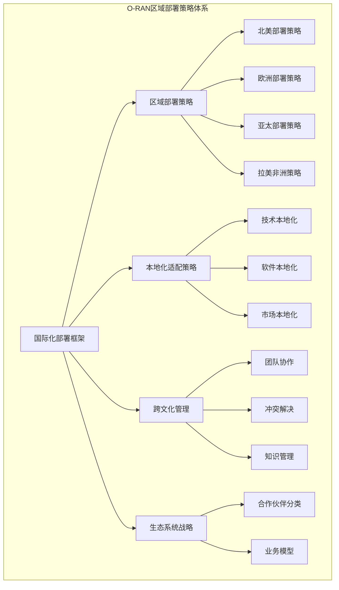
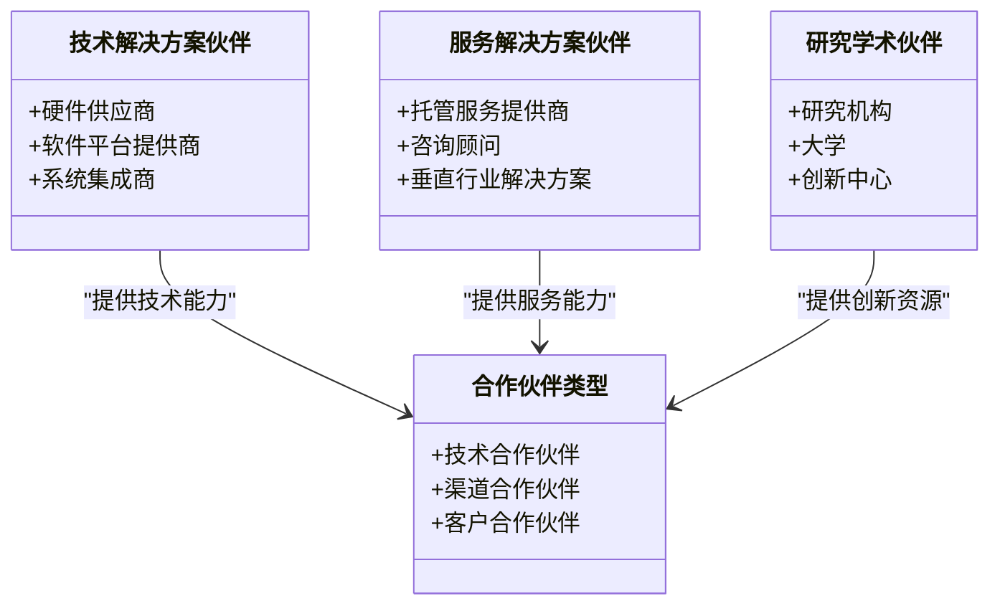
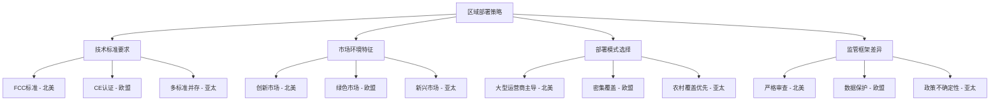
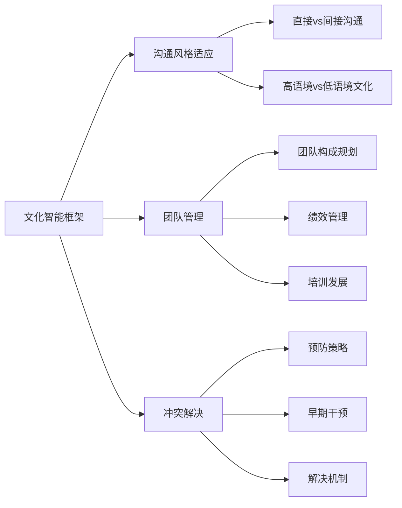
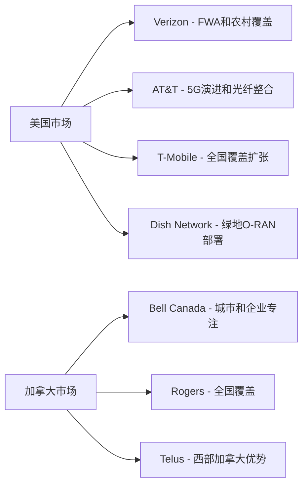
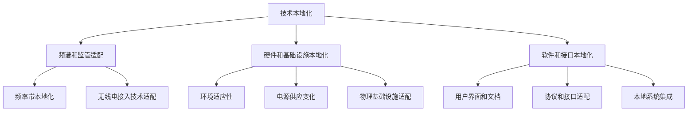
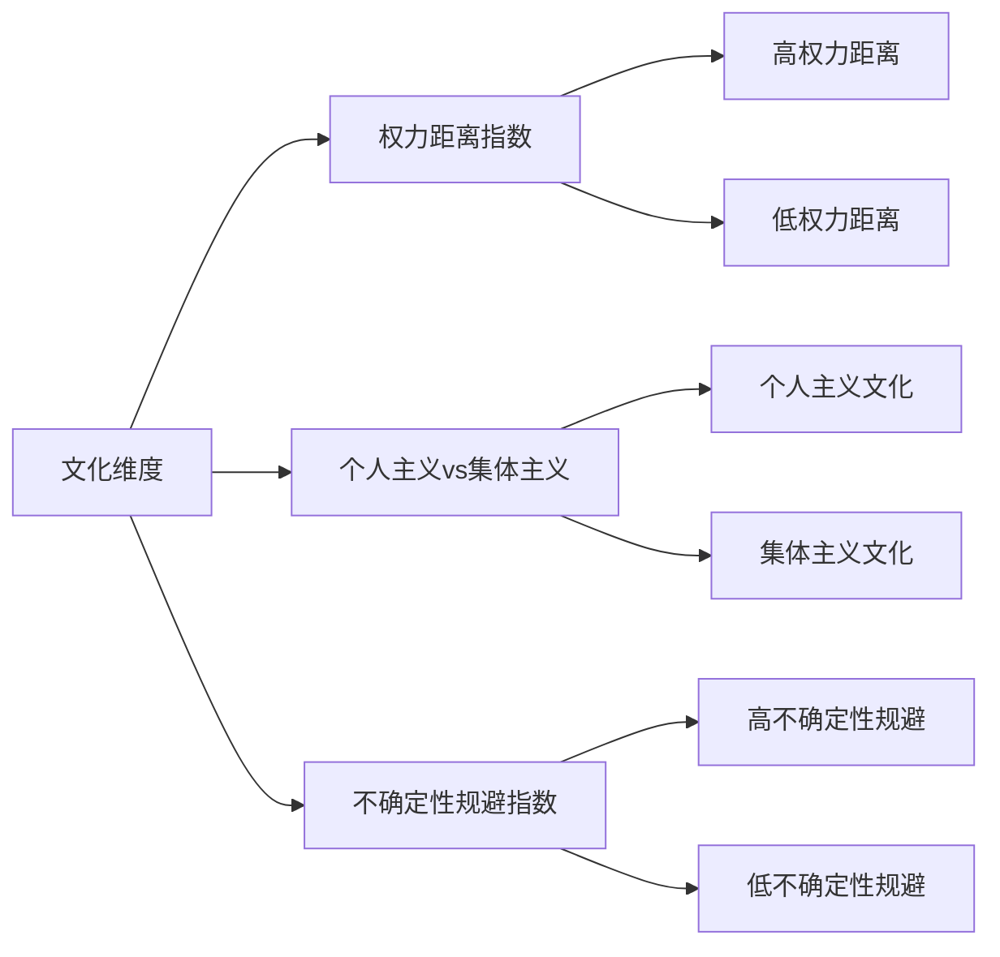
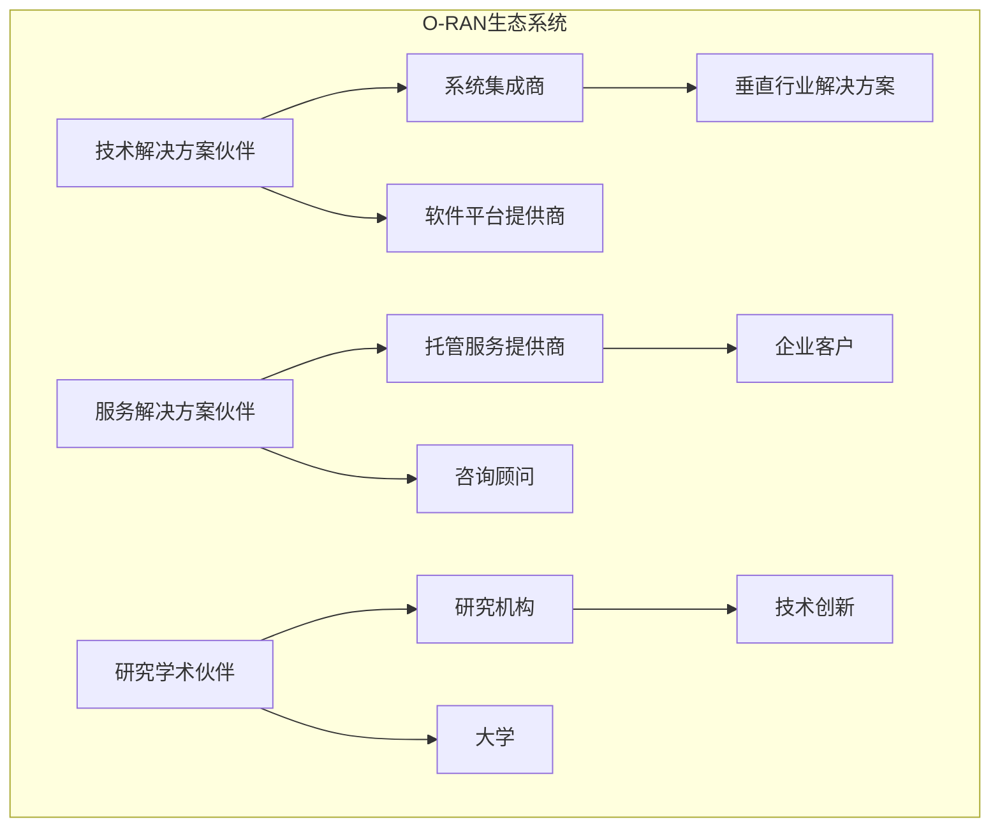
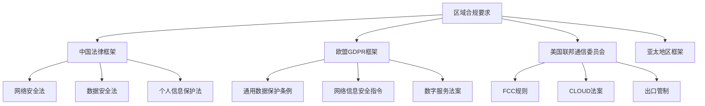

# O-RAN区域部署策略

<cite>
**本文档引用的文件**
- [O-RAN区域部署策略](file://23-international-deployment/regional-strategies/o-ran-regional-deployment-strategies.md)
- [O-RAN国际化运营框架](file://23-international-deployment/international-operations/international-operations-framework.md)
- [O-RAN本地化适配策略](file://23-international-deployment/localization-adaptation/o-ran-localization-strategies.md)
- [O-RAN生态系统战略](file://20-ecosystem-partnership/ecosystem-strategy/o-ran-ecosystem-strategy.md)
- [O-RAN合作伙伴分类](file://20-ecosystem-partnership/partner-types/o-ran-partner-classification.md)
- [O-RAN跨文化管理](file://23-international-deployment/cross-cultural-management/o-ran-cross-cultural-management.md)
- [O-RAN最佳实践案例](file://21-case-studies/best-practices/o-ran-best-practice-cases.md)
- [O-RAN区域合规要求](file://25-legal-regulations/regional-requirements/o-ran-regional-compliance.md)
- [O-RAN业务模型](file://20-ecosystem-partnership/business-models/o-ran-business-models.md)
- [O-RAN国际化部署概述](file://23-international-deployment/readme.md)
</cite>

## 目录
1. [引言](#引言)
2. [项目结构](#项目结构)
3. [核心组件](#核心组件)
4. [架构概览](#架构概览)
5. [详细组件分析](#详细组件分析)
6. [依赖关系分析](#依赖关系分析)
7. [性能考虑](#性能考虑)
8. [故障排除指南](#故障排除指南)
9. [结论](#结论)

## 引言

本文件为O-RAN（开放无线接入网）区域部署策略提供了全面的指导内容。该策略框架涵盖了北美、欧洲、亚太、拉美和非洲等不同地区的O-RAN部署特点和策略差异，深入分析了各地区的技术标准要求、市场环境特征、部署模式选择和监管框架差异。

通过系统化的区域化指导，本策略旨在帮助组织制定符合当地条件的O-RAN部署方案，包括技术选型、资源配置、合作伙伴选择和商业模式设计，从而最大化O-RAN技术在不同区域市场的价值实现。

## 项目结构

O-RAN区域部署策略项目采用模块化架构，围绕国际化部署、本地化适配、跨文化管理和生态系统建设四个核心维度构建：

**图表来源**
- [O-RAN国际化运营框架](file://23-international-deployment/international-operations/international-operations-framework.md#L1-L497)
- [O-RAN区域部署策略](file://23-international-deployment/regional-strategies/o-ran-regional-deployment-strategies.md#L1-L327)

**章节来源**
- [O-RAN国际化部署概述](file://23-international-deployment/readme.md#L1-L30)

## 核心组件

### 区域部署策略矩阵

| 地区 | 技术标准 | 市场特征 | 部署模式 | 监管框架 |
|------|----------|----------|----------|----------|
| 北美 | FCC合规、CBRS频谱 | 创新驱动、竞争激烈 | 大型运营商主导 | 严格网络安全审查 |
| 欧洲 | CE认证、GDPR | 绿色低碳、可持续发展 | 密集城区覆盖 | 数据主权保护 |
| 亚太 | 快速部署、成本敏感 | 新兴市场、数字化转型 | 农村覆盖优先 | 多样化标准挑战 |
| 拉美 | 成本优化、简单易用 | 基础设施空白 | 简化架构 | 政策不确定性 |
| 非洲 | 成熟稳定、适应性强 | 跨越式发展 | 快速见效 | 国际合作 |

### 生态系统合作伙伴分类

O-RAN生态系统包含多个层次的合作伙伴，每个层级都有其特定的角色和价值贡献：

**图表来源**
- [O-RAN合作伙伴分类](file://20-ecosystem-partnership/partner-types/o-ran-partner-classification.md#L1-L218)

**章节来源**
- [O-RAN生态系统战略](file://20-ecosystem-partnership/ecosystem-strategy/o-ran-ecosystem-strategy.md#L1-L189)

## 架构概览

### 区域部署架构

O-RAN区域部署采用分层架构，从宏观的区域策略到微观的本地化实施形成完整的部署体系：

**图表来源**
- [O-RAN区域部署策略](file://23-international-deployment/regional-strategies/o-ran-regional-deployment-strategies.md#L1-L327)
- [O-RAN国际化部署概述](file://23-international-deployment/readme.md#L6-L30)

### 跨文化管理架构

有效的跨文化管理是O-RAN国际部署成功的关键因素：

**图表来源**
- [O-RAN跨文化管理](file://23-international-deployment/cross-cultural-management/o-ran-cross-cultural-management.md#L1-L519)

## 详细组件分析

### 北美地区部署策略

#### 市场特征与机遇

北美市场具有以下显著特征：
- **技术标准**：FCC合规要求、CBRS频谱分配政策
- **市场环境**：技术创新驱动、竞争激烈、投资活跃
- **部署模式**：大型运营商主导、郊区覆盖优先
- **监管框架**：严格的网络安全审查、数据保护法规

#### 核心运营商策略分析

**图表来源**
- [O-RAN区域部署策略](file://23-international-deployment/regional-strategies/o-ran-regional-deployment-strategies.md#L10-L62)

#### 技术标准要求

北美地区的主要技术标准要求包括：
- **频谱分配**：CBRS 3.5GHz频段商业化、C波段拍卖结果
- **基础设施共享**：塔桅和小站共享、光纤网络接入
- **环境安全标准**：NEPA合规要求、RF暴露限制

**章节来源**
- [O-RAN区域部署策略](file://23-international-deployment/regional-strategies/o-ran-regional-deployment-strategies.md#L6-L118)

### 欧洲地区部署策略

#### 西方欧洲市场

##### 德国市场领导地位

德国作为欧洲经济领袖，在O-RAN部署中表现出以下特点：
- **市场动态**：制造业连接需求、汽车工业要求、工业4.0整合
- **监管环境**：Bundesnetzagentur监督、严格数据保护要求(GDPR)
- **技术采用趋势**：早期5G部署领导、O-RAN创新生态系统发展

##### 英国市场后脱欧考虑

英国在脱欧后的监管独立性带来了新的机遇和挑战：
- **监管独立性**：Ofcom频谱政策发展、英国特定技术标准
- **市场自由化影响**：增加竞争机会、外国投资便利化
- **标准和合规**：英国版GDPR要求、CE标志替代发展

#### 北欧和斯堪的纳维亚方法

北欧市场展现出独特的技术领导特征：
- **创新驱动市场**：早期技术采用率、强大的研发投资文化
- **可持续发展关注**：绿色技术要求、碳中和承诺
- **数字社会发展**：电子政府服务整合、数字公共基础设施

**章节来源**
- [O-RAN区域部署策略](file://23-international-deployment/regional-strategies/o-ran-regional-deployment-strategies.md#L120-L286)

### 亚太地区部署策略

#### 中国市场主导地位

中国作为世界最大的电信市场，在O-RAN部署中占据主导地位：
- **市场领导**：16亿+移动用户订阅、大规模基础设施投资
- **政府驱动发展**：中国制造2025计划、数字丝绸之路扩展
- **生态系统整合**：垂直行业合作伙伴关系、智慧城市全国部署

#### 日本市场特点

日本市场具有以下战略定位和方法：
- **技术领导地位**：世界领先的5G基础设施投资
- **政府驱动发展**：5G发展优先、本土技术推广
- **生态系统整合**：垂直行业合作伙伴关系、工业互联网发展

#### 印度市场机遇

印度市场展现出巨大的增长潜力：
- **基础设施发展**：绿地部署机会、基础设施共享倡议
- **数字包容关注**：负担得起的接入解决方案、农村连接项目
- **本地生态系统发展**：本土技术合作伙伴关系、技能培训项目

**章节来源**
- [O-RAN区域部署策略](file://23-international-deployment/regional-strategies/o-ran-regional-deployment-strategies.md#L288-L327)

### 拉丁美洲和非洲部署策略

#### 发展机遇分析

拉丁美洲和非洲地区具有以下发展机会：
- **基础设施缺口**：跨越式发展、国际合作
- **部署模式**：成本优化、简单易用、快速见效
- **技术选择**：成熟稳定、易于维护、适应性强
- **合作模式**：南南合作、技术转移、能力建设

#### 案例研究：美洲移动区域O-RAN策略

美洲移动公司实施了协调的O-RAN策略，展示了区域一体化的优势：
- **区域标准化**：通用技术标准和架构、共享供应商关系
- **本地市场适应**：国家特定监管合规、本地语言文化考虑
- **跨境实施**：区域标准统一、国家特定适应

**章节来源**
- [O-RAN区域部署策略](file://23-international-deployment/regional-strategies/o-ran-regional-deployment-strategies.md#L26-L30)
- [O-RAN最佳实践案例](file://21-case-studies/best-practices/o-ran-best-practice-cases.md#L270-L317)

### 本地化适配策略

#### 技术本地化框架

O-RAN技术本地化涉及多个层面的适应性调整：

**图表来源**
- [O-RAN本地化适配策略](file://23-international-deployment/localization-adaptation/o-ran-localization-strategies.md#L6-L424)

#### 区域市场特定适应策略

不同区域的市场特定适应策略包括：

| 区域 | 主要合规要求 | 市场特定功能 | 技术采用加速 |
|------|--------------|--------------|--------------|
| 北美 | FCC Part 96要求、NEPA环境审查 | 农村和郊区部署、企业私有网络 | 竞争定价策略 |
| 欧盟 | GDPR数据保护、绿色技术要求 | 数字包容关注、可持续发展 | 跨边界数据传输 |
| 亚太 | 快速部署要求、规模成本效率 | 基础设施发展、数字包容 | 早期采用者参与 |

**章节来源**
- [O-RAN本地化适配策略](file://23-international-deployment/localization-adaptation/o-ran-localization-strategies.md#L186-L299)

### 跨文化管理策略

#### 文化智能框架

O-RAN跨文化管理基于霍夫斯泰德文化维度理论的应用：

**图表来源**
- [O-RAN跨文化管理](file://23-international-deployment/cross-cultural-management/o-ran-cross-cultural-management.md#L10-L62)

#### 多元文化团队管理

有效的多元文化团队管理需要综合考虑：
- **团队构成规划**：核心技术团队、区域实施团队、支持职能
- **文化整合策略**：行前文化准备、在任支持、归国整合
- **跨文化冲突解决**：预防策略、早期干预、解决机制

**章节来源**
- [O-RAN跨文化管理](file://23-international-deployment/cross-cultural-management/o-ran-cross-cultural-management.md#L122-L253)

## 依赖关系分析

### 生态系统合作伙伴依赖关系

O-RAN生态系统中的合作伙伴关系形成了复杂的依赖网络：

**图表来源**
- [O-RAN合作伙伴分类](file://20-ecosystem-partnership/partner-types/o-ran-partner-classification.md#L1-L218)

### 监管合规依赖关系

不同地区的监管合规要求形成了相互依存的关系：

**图表来源**
- [O-RAN区域合规要求](file://25-legal-regulations/regional-requirements/o-ran-regional-compliance.md#L1-L318)

**章节来源**
- [O-RAN生态系统战略](file://20-ecosystem-partnership/ecosystem-strategy/o-ran-ecosystem-strategy.md#L1-L189)

## 性能考虑

### 区域部署性能指标

不同区域的O-RAN部署需要关注不同的性能指标：

| 区域 | 关键性能指标 | 目标值 | 测量频率 |
|------|-------------|--------|----------|
| 北美 | 部署时间、运营支出减少 | 43%更快、22%减少 | 季度评估 |
| 欧盟 | 能源效率、网络可用性 | 28%降低、99.95% | 年度评估 |
| 亚太 | 成本效率、可扩展性 | 40%降低、弹性扩展 | 月度评估 |
| 拉丁美洲 | 数字包容、社会影响 | 连接数增长、经济影响 | 年度评估 |
| 非洲 | 快速部署、成本控制 | 快速见效、成本优化 | 季度评估 |

### 实施成功因素

成功的O-RAN区域部署需要关注以下关键因素：
1. **早期持续的利益相关者参与**
2. **灵活适应区域要求的方法**
3. **强大的本地合作伙伴和协作网络**
4. **全面的测试和验证流程**
5. **持续学习和改进的心态**
6. **稳健的项目管理和治理结构**
7. **清晰的沟通和变更管理策略**
8. **充足的资源分配和投资承诺**

**章节来源**
- [O-RAN本地化适配策略](file://23-international-deployment/localization-adaptation/o-ran-localization-strategies.md#L414-L424)

## 故障排除指南

### 区域部署常见问题

#### 技术合规风险

**问题识别**：监管要求变化、多厂商集成问题、区域性能差异

**缓解策略**：
- 持续监管监控和灵活架构设计
- 标准化接口设计和全面测试程序
- 自适应优化算法和持续监控系统

#### 市场进入障碍

**问题识别**：高进入成本和复杂性、激烈的地方竞争、文化误解

**缓解策略**：
- 分阶段市场进入方法
- 战略合作伙伴关系开发
- 跨文化培训项目和本地人才发展

#### 跨文化冲突

**问题识别**：沟通误解、工作风格差异、价值观冲突

**解决机制**：
- 明确期望设定和文化敏感性培训
- 定期脉搏调查和反馈收集
- 文化适当的调解过程和解决方案

**章节来源**
- [O-RAN本地化适配策略](file://23-international-deployment/localization-adaptation/o-ran-localization-strategies.md#L376-L424)

## 结论

O-RAN区域部署策略的成功实施需要综合考虑技术标准、市场环境、文化差异和监管要求等多个维度。通过建立完善的区域部署框架、本地化适配策略和跨文化管理体系，组织可以有效应对不同区域市场的挑战，实现O-RAN技术的最大价值。

关键成功要素包括：
- **区域化思维**：根据不同区域特点制定差异化策略
- **生态系统建设**：构建多层次合作伙伴关系网络
- **文化适应能力**：培养跨文化团队管理和沟通能力
- **合规风险管理**：建立完善的合规监控和风险管理体系
- **持续改进机制**：建立学习型组织和最佳实践分享体系

通过系统性的区域部署策略实施，O-RAN技术将在全球范围内实现更广泛的商业应用和社会价值创造。