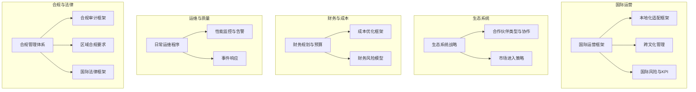
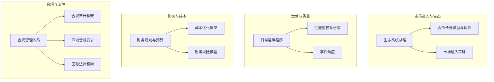
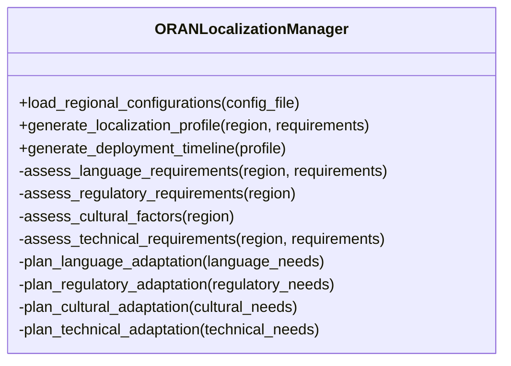
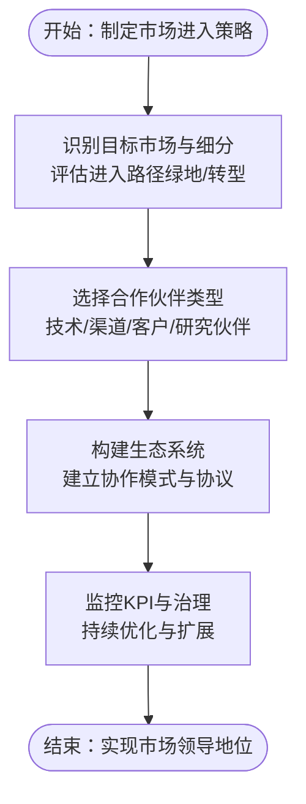
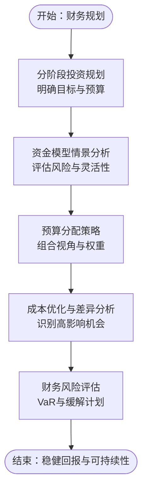
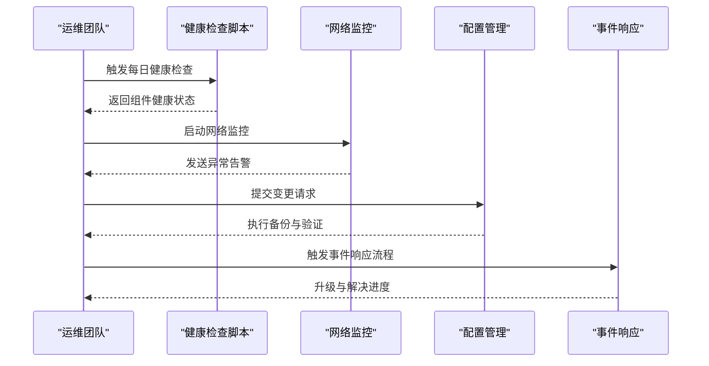
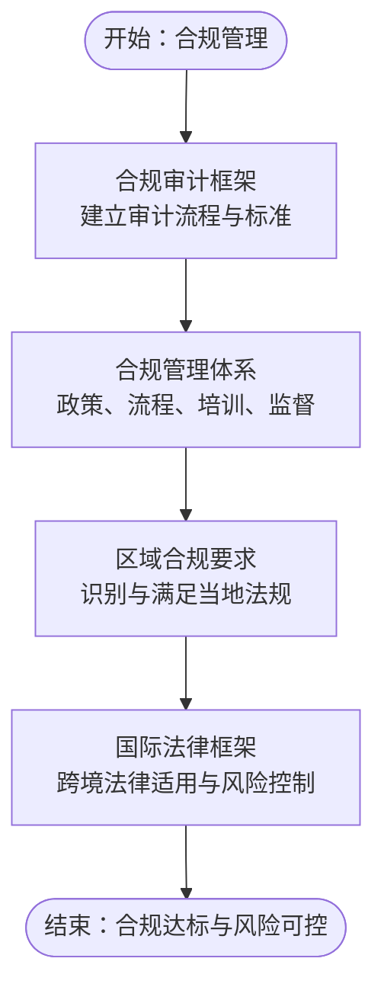
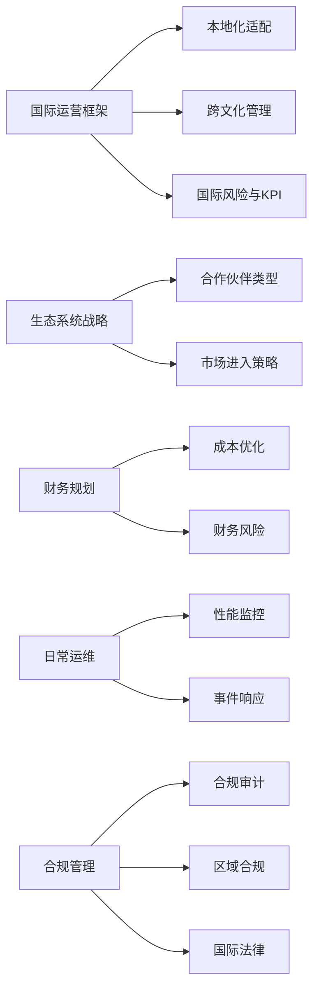

# 国际运营

<cite>
**本文引用的文件**
- [O-RAN 国际运营框架](file://23-international-deployment/international-operations/international-operations-framework.md)
- [O-RAN 生态系统战略框架](file://20-ecosystem-partnership/ecosystem-strategy/o-ran-ecosystem-strategy-zh.md)
- [O-RAN 合作伙伴类型与协作模式](file://20-ecosystem-partnership/partner-types/o-ran-partner-classification-zh.md)
- [O-RAN 财务规划和预算](file://18-cost-benefit-analysis/financial-planning/oran-financial-planning-zh.md)
- [O-RAN 日常运维程序](file://14-operations-management/daily-operations/daily-operation-procedures-zh.md)
- [O-RAN 合规审计框架](file://12-security-privacy/compliance-auditing/compliance-auditing-framework-zh.md)
- [O-RAN 合规管理体系](file://25-legal-regulations/compliance-system/o-ran-compliance-management-zh.md)
- [O-RAN 合规实施指南](file://25-legal-regulations/implementation-guides/o-ran-compliance-implementation-zh.md)
- [O-RAN 区域合规要求](file://25-legal-regulations/regional-requirements/o-ran-regional-compliance-zh.md)
- [O-RAN 国际法律框架](file://25-legal-regulations/international-laws/o-ran-international-legal-framework-zh.md)
</cite>

## 目录
1. [引言](#引言)
2. [项目结构](#项目结构)
3. [核心组件](#核心组件)
4. [架构总览](#架构总览)
5. [详细组件分析](#详细组件分析)
6. [依赖分析](#依赖分析)
7. [性能考量](#性能考量)
8. [故障排查指南](#故障排查指南)
9. [结论](#结论)
10. [附录](#附录)

## 引言
本文件面向O-RAN国际运营，围绕市场进入策略、合规管理体系、全生命周期管理、品牌建设、财务管理与成本控制、成功要素与风险防控等方面，提供系统化框架与实操指引。内容来源于仓库中关于国际运营、生态系统、财务规划、日常运维、合规与法律的相关文档，旨在帮助组织在多区域、多文化、多法规环境下稳健推进O-RAN国际化部署与运营。

## 项目结构
本仓库围绕O-RAN技术栈与运营实践形成主题化文档体系，国际运营相关内容主要分布在以下主题域：
- 国际部署与运营：区域策略、本地化适配、跨文化管理、风险与KPI
- 生态系统与合作伙伴：生态演进、伙伴分类与协作模式、市场进入策略
- 财务与成本：分阶段资本规划、资金模型、预算与成本优化、财务风险
- 日常运维与质量：健康检查、配置管理、事件响应、性能监控
- 合规与法律：合规审计、合规管理、区域合规、国际法律框架

**图表来源**
- [O-RAN 国际运营框架](file://23-international-deployment/international-operations/international-operations-framework.md#L1-L497)
- [O-RAN 生态系统战略框架](file://20-ecosystem-partnership/ecosystem-strategy/o-ran-ecosystem-strategy-zh.md#L1-L189)
- [O-RAN 合作伙伴类型与协作模式](file://20-ecosystem-partnership/partner-types/o-ran-partner-classification-zh.md#L1-L218)
- [O-RAN 财务规划和预算](file://18-cost-benefit-analysis/financial-planning/oran-financial-planning-zh.md#L1-L773)
- [O-RAN 日常运维程序](file://14-operations-management/daily-operations/daily-operation-procedures-zh.md#L1-L419)
- [O-RAN 合规审计框架](file://12-security-privacy/compliance-auditing/compliance-auditing-framework-zh.md)
- [O-RAN 合规管理体系](file://25-legal-regulations/compliance-system/o-ran-compliance-management-zh.md)
- [O-RAN 合规实施指南](file://25-legal-regulations/implementation-guides/o-ran-compliance-implementation-zh.md)
- [O-RAN 区域合规要求](file://25-legal-regulations/regional-requirements/o-ran-regional-compliance-zh.md)
- [O-RAN 国际法律框架](file://25-legal-regulations/international-laws/o-ran-international-legal-framework-zh.md)

**章节来源**
- [O-RAN 国际运营框架](file://23-international-deployment/international-operations/international-operations-framework.md#L1-L497)
- [O-RAN 生态系统战略框架](file://20-ecosystem-partnership/ecosystem-strategy/o-ran-ecosystem-strategy-zh.md#L1-L189)
- [O-RAN 合作伙伴类型与协作模式](file://20-ecosystem-partnership/partner-types/o-ran-partner-classification-zh.md#L1-L218)
- [O-RAN 财务规划和预算](file://18-cost-benefit-analysis/financial-planning/oran-financial-planning-zh.md#L1-L773)
- [O-RAN 日常运维程序](file://14-operations-management/daily-operations/daily-operation-procedures-zh.md#L1-L419)
- [O-RAN 合规审计框架](file://12-security-privacy/compliance-auditing/compliance-auditing-framework-zh.md)
- [O-RAN 合规管理体系](file://25-legal-regulations/compliance-system/o-ran-compliance-management-zh.md)
- [O-RAN 合规实施指南](file://25-legal-regulations/implementation-guides/o-ran-compliance-implementation-zh.md)
- [O-RAN 区域合规要求](file://25-legal-regulations/regional-requirements/o-ran-regional-compliance-zh.md)
- [O-RAN 国际法律框架](file://25-legal-regulations/international-laws/o-ran-international-legal-framework-zh.md)

## 核心组件
- 国际运营框架：提供区域部署策略、本地化适配、跨文化管理、风险与KPI体系，支撑全球化落地。
- 生态系统与合作伙伴：明确生态演进阶段、伙伴分类与协作模式、市场进入策略，构建开放合作的业务基础。
- 财务规划与成本控制：分阶段资本规划、资金模型、预算与成本优化、财务风险评估，确保投资回报与可持续性。
- 日常运维与质量：健康检查、配置管理、事件响应、性能监控与告警，保障稳定运行与快速恢复。
- 合规与法律：合规审计、合规管理、区域合规与国际法律框架，确保全球合规与风险可控。

**章节来源**
- [O-RAN 国际运营框架](file://23-international-deployment/international-operations/international-operations-framework.md#L1-L497)
- [O-RAN 生态系统战略框架](file://20-ecosystem-partnership/ecosystem-strategy/o-ran-ecosystem-strategy-zh.md#L1-L189)
- [O-RAN 合作伙伴类型与协作模式](file://20-ecosystem-partnership/partner-types/o-ran-partner-classification-zh.md#L1-L218)
- [O-RAN 财务规划和预算](file://18-cost-benefit-analysis/financial-planning/oran-financial-planning-zh.md#L1-L773)
- [O-RAN 日常运维程序](file://14-operations-management/daily-operations/daily-operation-procedures-zh.md#L1-L419)
- [O-RAN 合规审计框架](file://12-security-privacy/compliance-auditing/compliance-auditing-framework-zh.md)
- [O-RAN 合规管理体系](file://25-legal-regulations/compliance-system/o-ran-compliance-management-zh.md)
- [O-RAN 合规实施指南](file://25-legal-regulations/implementation-guides/o-ran-compliance-implementation-zh.md)
- [O-RAN 区域合规要求](file://25-legal-regulations/regional-requirements/o-ran-regional-compliance-zh.md)
- [O-RAN 国际法律框架](file://25-legal-regulations/international-laws/o-ran-international-legal-framework-zh.md)

## 架构总览
国际运营的“四梁八柱”由以下子系统协同：
- 市场进入与生态：以生态系统战略为牵引，通过合作伙伴分类与协作模式，制定绿地与现有系统转型两类市场进入策略。
- 运营与质量：以日常运维程序为基础，建立健康检查、配置管理、事件响应与性能监控的闭环。
- 财务与成本：以分阶段资本规划与资金模型为核心，配合预算与成本优化、财务风险评估，实现稳健回报。
- 合规与法律：以合规审计与管理体系为抓手，结合区域合规与国际法律框架，确保全球合规与风险可控。

**图表来源**
- [O-RAN 生态系统战略框架](file://20-ecosystem-partnership/ecosystem-strategy/o-ran-ecosystem-strategy-zh.md#L1-L189)
- [O-RAN 合作伙伴类型与协作模式](file://20-ecosystem-partnership/partner-types/o-ran-partner-classification-zh.md#L1-L218)
- [O-RAN 财务规划和预算](file://18-cost-benefit-analysis/financial-planning/oran-financial-planning-zh.md#L1-L773)
- [O-RAN 日常运维程序](file://14-operations-management/daily-operations/daily-operation-procedures-zh.md#L1-L419)
- [O-RAN 合规审计框架](file://12-security-privacy/compliance-auditing/compliance-auditing-framework-zh.md)
- [O-RAN 合规管理体系](file://25-legal-regulations/compliance-system/o-ran-compliance-management-zh.md)
- [O-RAN 合规实施指南](file://25-legal-regulations/implementation-guides/o-ran-compliance-implementation-zh.md)
- [O-RAN 区域合规要求](file://25-legal-regulations/regional-requirements/o-ran-regional-compliance-zh.md)
- [O-RAN 国际法律框架](file://25-legal-regulations/international-laws/o-ran-international-legal-framework-zh.md)

## 详细组件分析

### 组件A：国际运营框架与本地化适配
- 区域部署策略：提供亚洲-太平洋与欧洲两大区域的部署模型，包含市场驱动、监管环境、运营挑战、分阶段实施与合作模式。
- 本地化适配框架：通过本地化管理器类，自动评估语言、监管、文化、技术等适配需求，并生成适配计划与部署时间表。
- 跨文化管理：定义沟通协议、时区管理、决策风格与冲突解决机制，确保多元团队高效协作。
- 风险与KPI：提供政治、经济、运营风险评估与缓解策略；设定部署成功率、运营卓越、财务表现、文化融合等KPI目标。

**图表来源**
- [O-RAN 国际运营框架](file://23-international-deployment/international-operations/international-operations-framework.md#L95-L372)

**章节来源**
- [O-RAN 国际运营框架](file://23-international-deployment/international-operations/international-operations-framework.md#L6-L497)

### 组件B：生态系统与合作伙伴策略
- 生态系统战略：分阶段推进（基础建设、生态扩展、市场领导），明确各阶段目标与关键活动。
- 合作伙伴分类：技术解决方案、服务与解决方案、行业与垂直领域三大类，细化角色、协作模式与价值主张。
- 市场进入策略：绿地市场与现有系统转型两种路径，分别强调“零基”与“渐进式”优势。
- 治理与KPI：建立指导委员会、运营治理、创新委员会的决策框架；设定生态系统健康、技术领导力、市场份额、客户满意度、财务绩效等KPI。

**图表来源**
- [O-RAN 生态系统战略框架](file://20-ecosystem-partnership/ecosystem-strategy/o-ran-ecosystem-strategy-zh.md#L8-L48)
- [O-RAN 合作伙伴类型与协作模式](file://20-ecosystem-partnership/partner-types/o-ran-partner-classification-zh.md#L6-L218)

**章节来源**
- [O-RAN 生态系统战略框架](file://20-ecosystem-partnership/ecosystem-strategy/o-ran-ecosystem-strategy-zh.md#L1-L189)
- [O-RAN 合作伙伴类型与协作模式](file://20-ecosystem-partnership/partner-types/o-ran-partner-classification-zh.md#L1-L218)

### 组件C：财务规划与成本控制
- 分阶段资本规划：分试点、扩展、全量部署三个阶段，明确目标、预算构成、规模效应与优化杠杆。
- 资金模型：提供传统CapEx、运营费用、即服务、合资、渐进式迁移五种模型，配套财务影响评估与建议。
- 预算与成本优化：基于组合的预算分配、成本差异分析与优化建议，给出高/中/低影响力优化机会与风险缓解。
- 财务风险：识别市场、技术、财务、运营四类风险，计算风险敞口、VaR与缓解优先级。

**图表来源**
- [O-RAN 财务规划和预算](file://18-cost-benefit-analysis/financial-planning/oran-financial-planning-zh.md#L10-L66)
- [O-RAN 财务规划和预算](file://18-cost-benefit-analysis/financial-planning/oran-financial-planning-zh.md#L70-L307)
- [O-RAN 财务规划和预算](file://18-cost-benefit-analysis/financial-planning/oran-financial-planning-zh.md#L313-L341)
- [O-RAN 财务规划和预算](file://18-cost-benefit-analysis/financial-planning/oran-financial-planning-zh.md#L345-L507)
- [O-RAN 财务规划和预算](file://18-cost-benefit-analysis/financial-planning/oran-financial-planning-zh.md#L558-L771)

**章节来源**
- [O-RAN 财务规划和预算](file://18-cost-benefit-analysis/financial-planning/oran-financial-planning-zh.md#L1-L773)

### 组件D：日常运维与质量控制
- 健康检查：自动化组件健康验证脚本，统一检查入口与告警输出。
- 网络监控：基于系统指标的网络接口监控与告警，支持邮件通知与历史追踪。
- 配置管理：备份/恢复策略、变更管理流程与回滚程序，确保可追溯与可恢复。
- 事件响应：严重性分级、升级时间线、沟通协议与故障排除手册。
- 性能监控与告警：仪表板与Prometheus告警规则，保障可用性与性能阈值。

**图表来源**
- [O-RAN 日常运维程序](file://14-operations-management/daily-operations/daily-operation-procedures-zh.md#L9-L66)
- [O-RAN 日常运维程序](file://14-operations-management/daily-operations/daily-operation-procedures-zh.md#L69-L161)
- [O-RAN 日常运维程序](file://14-operations-management/daily-operations/daily-operation-procedures-zh.md#L165-L281)
- [O-RAN 日常运维程序](file://14-operations-management/daily-operations/daily-operation-procedures-zh.md#L283-L419)

**章节来源**
- [O-RAN 日常运维程序](file://14-operations-management/daily-operations/daily-operation-procedures-zh.md#L1-L419)

### 组件E：合规管理体系与法律框架
- 合规审计：建立审计框架与流程，确保合规性与可追溯性。
- 合规管理：制定合规管理体系，覆盖政策、流程、培训与监督。
- 区域合规：针对不同地区（如欧盟、美国、中国、日本、韩国等）的监管要求与合规路径。
- 国际法律：梳理国际法律框架，指导跨境业务的法律适用与风险控制。

**图表来源**
- [O-RAN 合规审计框架](file://12-security-privacy/compliance-auditing/compliance-auditing-framework-zh.md)
- [O-RAN 合规管理体系](file://25-legal-regulations/compliance-system/o-ran-compliance-management-zh.md)
- [O-RAN 合规实施指南](file://25-legal-regulations/implementation-guides/o-ran-compliance-implementation-zh.md)
- [O-RAN 区域合规要求](file://25-legal-regulations/regional-requirements/o-ran-regional-compliance-zh.md)
- [O-RAN 国际法律框架](file://25-legal-regulations/international-laws/o-ran-international-legal-framework-zh.md)

**章节来源**
- [O-RAN 合规审计框架](file://12-security-privacy/compliance-auditing/compliance-auditing-framework-zh.md)
- [O-RAN 合规管理体系](file://25-legal-regulations/compliance-system/o-ran-compliance-management-zh.md)
- [O-RAN 合规实施指南](file://25-legal-regulations/implementation-guides/o-ran-compliance-implementation-zh.md)
- [O-RAN 区域合规要求](file://25-legal-regulations/regional-requirements/o-ran-regional-compliance-zh.md)
- [O-RAN 国际法律框架](file://25-legal-regulations/international-laws/o-ran-international-legal-framework-zh.md)

## 依赖分析
- 国际运营框架为生态与财务提供宏观指导，本地化适配与跨文化管理是落地执行的关键抓手。
- 生态系统与合作伙伴策略决定市场进入路径与资源投入，直接影响财务规划与成本控制。
- 日常运维与质量控制为国际运营提供稳定性保障，降低运营风险与故障成本。
- 合规与法律框架贯穿全生命周期，为国际业务提供制度与法律保障。

**图表来源**
- [O-RAN 国际运营框架](file://23-international-deployment/international-operations/international-operations-framework.md#L1-L497)
- [O-RAN 生态系统战略框架](file://20-ecosystem-partnership/ecosystem-strategy/o-ran-ecosystem-strategy-zh.md#L1-L189)
- [O-RAN 合作伙伴类型与协作模式](file://20-ecosystem-partnership/partner-types/o-ran-partner-classification-zh.md#L1-L218)
- [O-RAN 财务规划和预算](file://18-cost-benefit-analysis/financial-planning/oran-financial-planning-zh.md#L1-L773)
- [O-RAN 日常运维程序](file://14-operations-management/daily-operations/daily-operation-procedures-zh.md#L1-L419)
- [O-RAN 合规审计框架](file://12-security-privacy/compliance-auditing/compliance-auditing-framework-zh.md)
- [O-RAN 合规管理体系](file://25-legal-regulations/compliance-system/o-ran-compliance-management-zh.md)
- [O-RAN 合规实施指南](file://25-legal-regulations/implementation-guides/o-ran-compliance-implementation-zh.md)
- [O-RAN 区域合规要求](file://25-legal-regulations/regional-requirements/o-ran-regional-compliance-zh.md)
- [O-RAN 国际法律框架](file://25-legal-regulations/international-laws/o-ran-international-legal-framework-zh.md)

**章节来源**
- [O-RAN 国际运营框架](file://23-international-deployment/international-operations/international-operations-framework.md#L1-L497)
- [O-RAN 生态系统战略框架](file://20-ecosystem-partnership/ecosystem-strategy/o-ran-ecosystem-strategy-zh.md#L1-L189)
- [O-RAN 合作伙伴类型与协作模式](file://20-ecosystem-partnership/partner-types/o-ran-partner-classification-zh.md#L1-L218)
- [O-RAN 财务规划和预算](file://18-cost-benefit-analysis/financial-planning/oran-financial-planning-zh.md#L1-L773)
- [O-RAN 日常运维程序](file://14-operations-management/daily-operations/daily-operation-procedures-zh.md#L1-L419)
- [O-RAN 合规审计框架](file://12-security-privacy/compliance-auditing/compliance-auditing-framework-zh.md)
- [O-RAN 合规管理体系](file://25-legal-regulations/compliance-system/o-ran-compliance-management-zh.md)
- [O-RAN 合规实施指南](file://25-legal-regulations/implementation-guides/o-ran-compliance-implementation-zh.md)
- [O-RAN 区域合规要求](file://25-legal-regulations/regional-requirements/o-ran-regional-compliance-zh.md)
- [O-RAN 国际法律框架](file://25-legal-regulations/international-laws/o-ran-international-legal-framework-zh.md)

## 性能考量
- 运维性能：通过健康检查、网络监控与性能告警，确保系统可用性与性能阈值达标；建议定期复盘告警有效性与阈值合理性。
- 财务绩效：以KPI为目标导向，结合资金模型与成本优化，平衡前期投入与长期回报；建议建立滚动预测与敏感性分析。
- 合规效率：通过合规审计与区域合规清单，减少重复工作与遗漏风险；建议建立合规知识库与自动化检查工具。

[本节为通用指导，无需列出具体文件来源]

## 故障排查指南
- 健康检查失败：核对组件状态、网络连通性与服务端口；必要时触发回滚与隔离。
- 网络异常：关注丢包率、延迟与带宽利用率阈值；检查物理链路与配置一致性。
- 配置变更问题：遵循变更管理流程，执行备份与回滚；进行后验证与回归测试。
- 事件升级：依据严重性等级与升级时间线，启动相应响应流程与沟通机制。

**章节来源**
- [O-RAN 日常运维程序](file://14-operations-management/daily-operations/daily-operation-procedures-zh.md#L68-L419)

## 结论
通过国际运营框架、生态系统与合作伙伴策略、财务规划与成本控制、日常运维与质量保障、合规与法律体系的协同，O-RAN国际业务可在多区域、多文化、多法规环境中实现稳健落地与持续增长。建议以阶段化推进、数据驱动决策、闭环治理与风险可控为核心原则，构建可持续的国际业务发展模式。

[本节为总结性内容，无需列出具体文件来源]

## 附录
- 品牌建设策略（概念性建议）
  - 市场推广：聚焦行业白皮书发布、技术峰会演讲、媒体合作与客户案例传播。
  - 形象塑造：统一视觉识别、技术领导力展示、开放生态与标准贡献。
  - 声誉管理：建立舆情监测与快速响应机制、透明沟通与客户成功故事。
- 国际项目全生命周期管理（概念性建议）
  - 规划：明确目标、范围、资源与里程碑；识别关键风险与依赖。
  - 执行：建立跨文化团队与协作机制；严格变更与质量门禁。
  - 监控：以KPI与仪表板驱动过程可视化；定期回顾与调整。
  - 风险：持续识别与评估风险，动态优化缓解与应急预案。

[本节为概念性内容，无需列出具体文件来源]