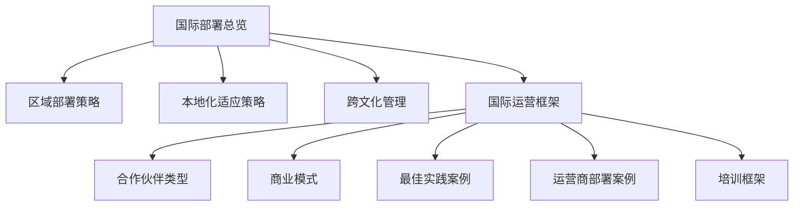
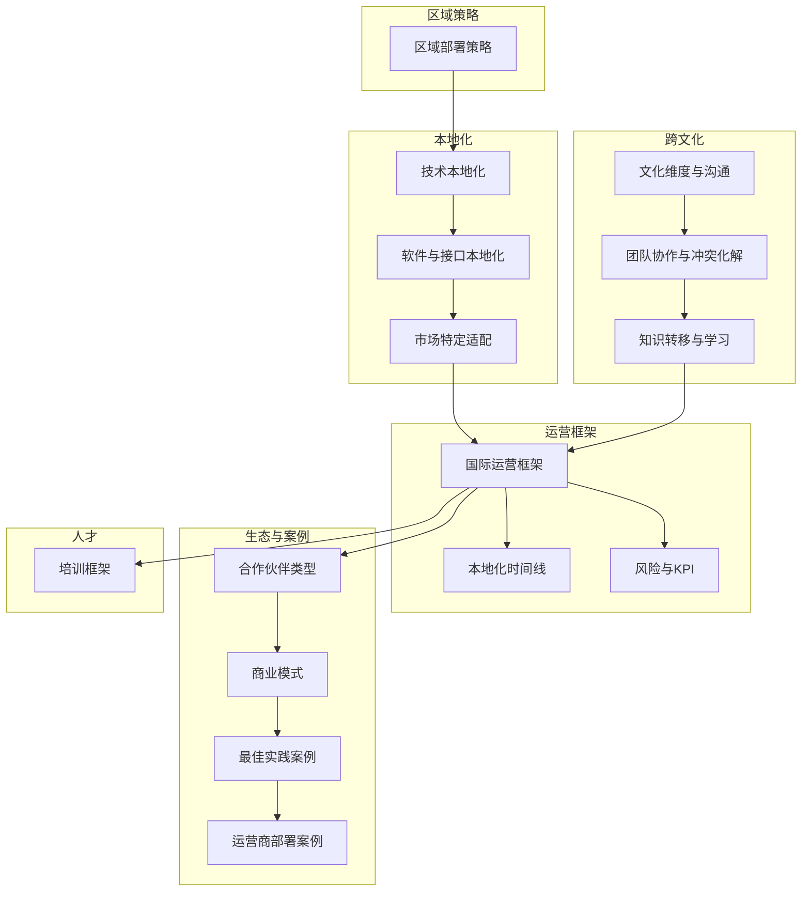
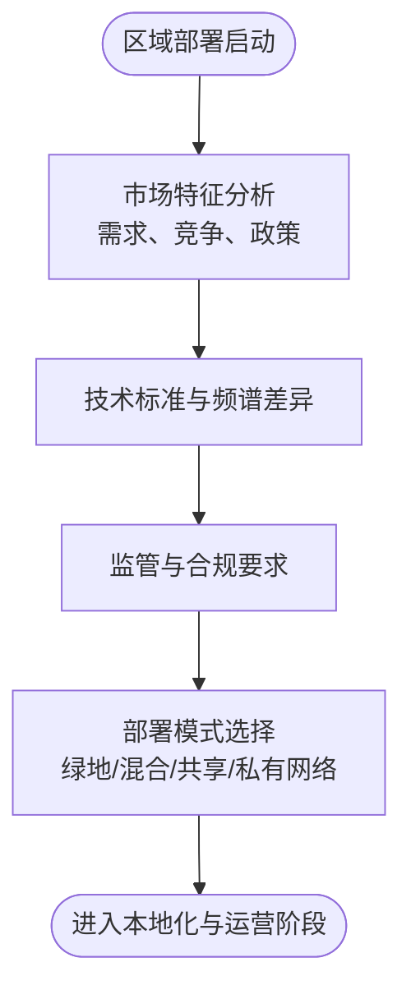
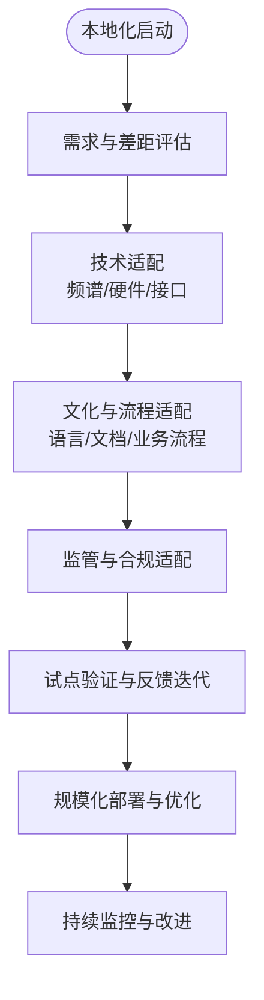
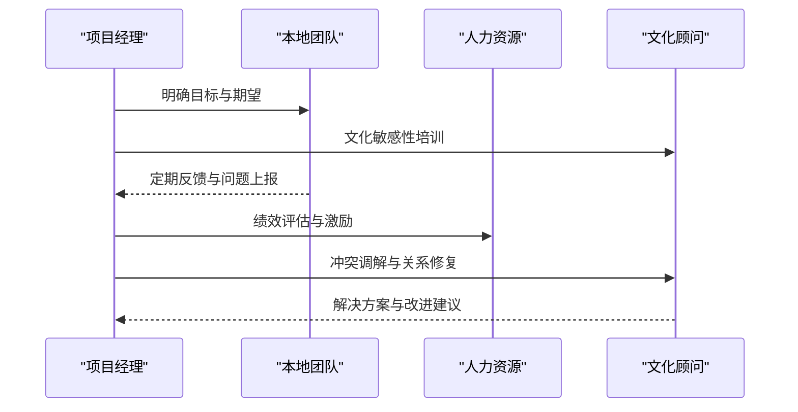
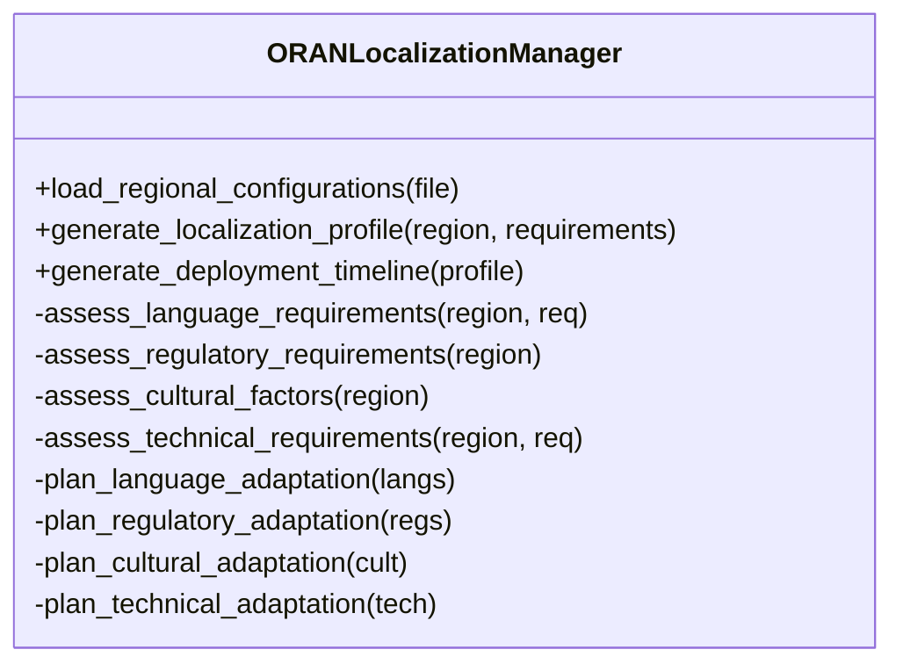
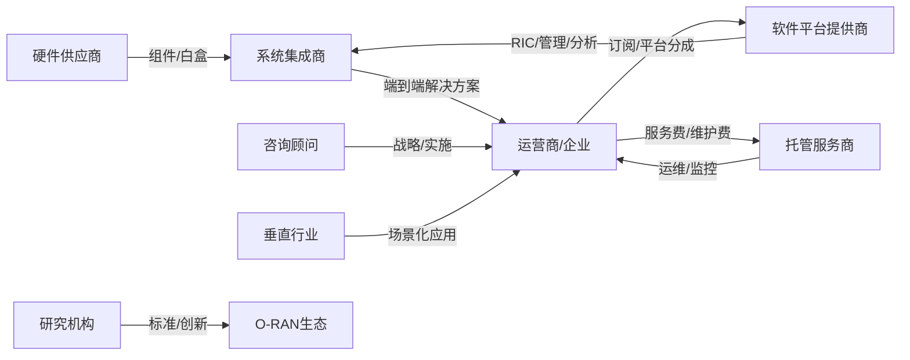
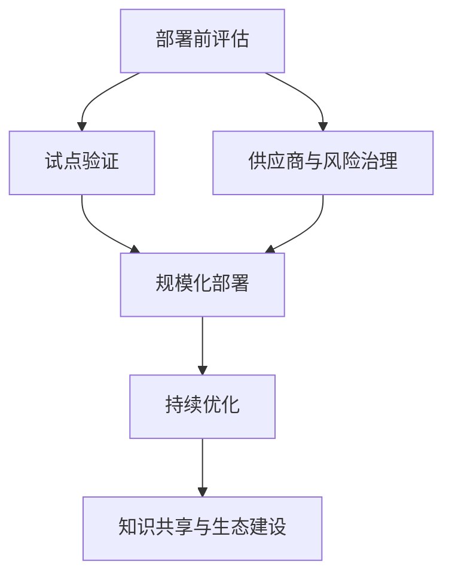
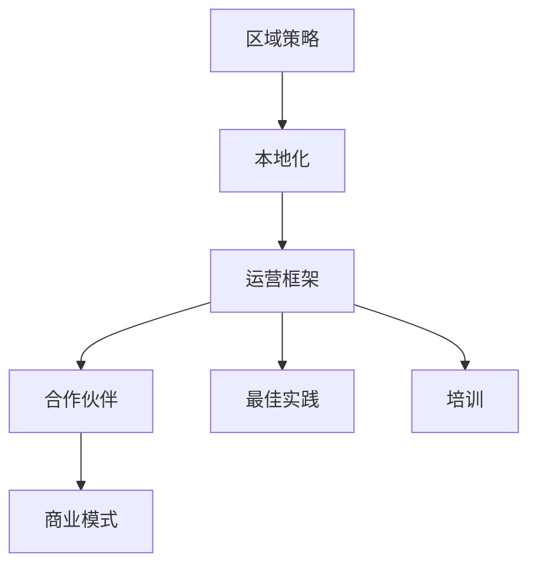

# 国际部署

<cite>
**本文引用的文件**
- [国际部署总览](file://23-international-deployment/readme.md)
- [区域部署策略](file://23-international-deployment/regional-strategies/o-ran-regional-deployment-strategies.md)
- [本地化适应策略](file://23-international-deployment/localization-adaptation/o-ran-localization-strategies.md)
- [跨文化管理](file://23-international-deployment/cross-cultural-management/o-ran-cross-cultural-management.md)
- [国际运营框架](file://23-international-deployment/international-operations/international-operations-framework.md)
- [合作伙伴类型](file://20-ecosystem-partnership/partner-types/o-ran-partner-classification.md)
- [商业模式](file://20-ecosystem-partnership/business-models/o-ran-business-models.md)
- [最佳实践案例](file://21-case-studies/best-practices/o-ran-best-practice-cases.md)
- [运营商部署案例](file://21-case-studies/operator-cases/carrier-o-ran-deployment-cases.md)
- [培训框架](file://19-talent-development/training-programs/o-ran-training-framework.md)
</cite>

## 目录
1. [引言](#引言)
2. [项目结构](#项目结构)
3. [核心组件](#核心组件)
4. [架构总览](#架构总览)
5. [详细组件分析](#详细组件分析)
6. [依赖分析](#依赖分析)
7. [性能考虑](#性能考虑)
8. [故障排查指南](#故障排查指南)
9. [结论](#结论)
10. [附录](#附录)

## 引言
本文件面向O-RAN国际部署场景，系统化梳理区域部署策略、本地化适应、跨文化管理、国际运营框架与多地区协调方法，并结合最佳实践与运营商案例总结成功要素与常见挑战的应对策略，帮助组织在不同国家与市场实现高质量、可持续的O-RAN落地。

## 项目结构
围绕“国际部署”主题，仓库内形成以下关键模块与文件：
- 区域部署策略：覆盖北美、欧洲、亚太、拉美与非洲的市场特征、技术标准差异、法规要求与部署模式
- 本地化适应策略：涵盖频谱与监管适配、硬件与基础设施定制、软件与接口本地化、市场特定适配与实施路线
- 跨文化管理：文化维度、沟通风格、团队构成与动态、冲突化解与协作机制
- 国际运营框架：区域部署模型、本地化管理工具、国际团队协作、风险与KPI体系
- 生态伙伴与商业模式：合作伙伴分类、收入与分成模型、定价策略与财务指标
- 最佳实践与运营商案例：横向提炼关键成功因素，纵向解析典型运营商部署路径
- 培训与人才发展：面向不同层级的课程体系与能力评估

图表来源
- [国际部署总览](file://23-international-deployment/readme.md#L1-L72)
- [区域部署策略](file://23-international-deployment/regional-strategies/o-ran-regional-deployment-strategies.md#L1-L327)
- [本地化适应策略](file://23-international-deployment/localization-adaptation/o-ran-localization-strategies.md#L1-L424)
- [跨文化管理](file://23-international-deployment/cross-cultural-management/o-ran-cross-cultural-management.md#L1-L519)
- [国际运营框架](file://23-international-deployment/international-operations/international-operations-framework.md#L1-L497)
- [合作伙伴类型](file://20-ecosystem-partnership/partner-types/o-ran-partner-classification.md#L1-L218)
- [商业模式](file://20-ecosystem-partnership/business-models/o-ran-business-models.md#L1-L299)
- [最佳实践案例](file://21-case-studies/best-practices/o-ran-best-practice-cases.md#L1-L210)
- [运营商部署案例](file://21-case-studies/operator-cases/carrier-o-ran-deployment-cases.md#L1-L401)
- [培训框架](file://19-talent-development/training-programs/o-ran-training-framework.md#L1-L329)

章节来源
- [国际部署总览](file://23-international-deployment/readme.md#L1-L72)

## 核心组件
- 区域部署策略：基于市场成熟度、政策环境、基础设施与竞争格局制定差异化部署优先级与模式
- 本地化适应策略：从频谱、硬件、软件到文档与流程的全链路本地化方案与风险管控
- 跨文化管理：以文化维度理论为基础，构建沟通协议、团队协作与冲突化解机制
- 国际运营框架：提供可复用的区域部署模型、本地化管理工具、国际团队协作与KPI体系
- 生态伙伴与商业模式：明确各角色定位、合作模式与收益分配，支撑规模化与可持续增长
- 最佳实践与运营商案例：总结关键成功因素与失败教训，形成可迁移的方法论
- 培训与人才发展：构建从高层到一线的全栈能力培养体系，保障组织能力建设

章节来源
- [区域部署策略](file://23-international-deployment/regional-strategies/o-ran-regional-deployment-strategies.md#L1-L327)
- [本地化适应策略](file://23-international-deployment/localization-adaptation/o-ran-localization-strategies.md#L1-L424)
- [跨文化管理](file://23-international-deployment/cross-cultural-management/o-ran-cross-cultural-management.md#L1-L519)
- [国际运营框架](file://23-international-deployment/international-operations/international-operations-framework.md#L1-L497)
- [合作伙伴类型](file://20-ecosystem-partnership/partner-types/o-ran-partner-classification.md#L1-L218)
- [商业模式](file://20-ecosystem-partnership/business-models/o-ran-business-models.md#L1-L299)
- [最佳实践案例](file://21-case-studies/best-practices/o-ran-best-practice-cases.md#L1-L210)
- [运营商部署案例](file://21-case-studies/operator-cases/carrier-o-ran-deployment-cases.md#L1-L401)
- [培训框架](file://19-talent-development/training-programs/o-ran-training-framework.md#L1-L329)

## 架构总览
国际部署的总体架构由“区域策略—本地化—跨文化—运营框架—生态与案例—人才”六大支柱组成，通过本地化管理工具与国际团队协作机制实现端到端闭环。

图表来源
- [区域部署策略](file://23-international-deployment/regional-strategies/o-ran-regional-deployment-strategies.md#L1-L327)
- [本地化适应策略](file://23-international-deployment/localization-adaptation/o-ran-localization-strategies.md#L1-L424)
- [跨文化管理](file://23-international-deployment/cross-cultural-management/o-ran-cross-cultural-management.md#L1-L519)
- [国际运营框架](file://23-international-deployment/international-operations/international-operations-framework.md#L1-L497)
- [合作伙伴类型](file://20-ecosystem-partnership/partner-types/o-ran-partner-classification.md#L1-L218)
- [商业模式](file://20-ecosystem-partnership/business-models/o-ran-business-models.md#L1-L299)
- [最佳实践案例](file://21-case-studies/best-practices/o-ran-best-practice-cases.md#L1-L210)
- [运营商部署案例](file://21-case-studies/operator-cases/carrier-o-ran-deployment-cases.md#L1-L401)
- [培训框架](file://19-talent-development/training-programs/o-ran-training-framework.md#L1-L329)

## 详细组件分析

### 区域部署策略
- 北美：聚焦城市与郊区覆盖、农村宽带、CBRS频谱与政府项目参与；监管强调FCC规则、NEPA审查与安全合规
- 加拿大：关注广域覆盖、印第安社区连接、双语与多元文化服务；CRTC监管与原住民事务
- 西欧：德国工业4.0与边缘计算、英国脱欧后的标准与合规、北欧绿色与数字社会
- 亚太：中国5G主导、日韩成熟市场、印度规模效应与成本敏感、东南亚差异化频谱与政策
- 拉丁美洲与非洲：基础设施缺口与南南合作、快速结果与简单易用、技术转移与能力建设

图表来源
- [区域部署策略](file://23-international-deployment/regional-strategies/o-ran-regional-deployment-strategies.md#L6-L327)

章节来源
- [区域部署策略](file://23-international-deployment/regional-strategies/o-ran-regional-deployment-strategies.md#L1-L327)

### 本地化适应策略
- 技术本地化：频谱规划、5G NR配置、O-RAN拆分选项、功率与覆盖优化
- 硬件与基础设施：温度/气候、电压/频率、物理安装、地震/风载、本地供应链与认证
- 软件与接口：UI多语言、文档翻译、CLI/API本地化、与本地系统集成、隐私与合规
- 市场特定适配：北美的FCC与环境审查、欧洲GDPR与数据主权、亚太的快速部署与包容性

图表来源
- [本地化适应策略](file://23-international-deployment/localization-adaptation/o-ran-localization-strategies.md#L301-L424)

章节来源
- [本地化适应策略](file://23-international-deployment/localization-adaptation/o-ran-localization-strategies.md#L1-L424)

### 跨文化管理
- 文化维度：高低权力距离、个人主义/集体主义、不确定性规避等对决策与沟通的影响
- 沟通风格：直接/间接沟通的文化差异及应对策略
- 团队协作：多元文化团队构成、动态管理、绩效与成长、冲突预防与化解
- 知识转移：正式/非正式学习、数字平台、实操体验、学习型组织与伦理保护

图表来源
- [跨文化管理](file://23-international-deployment/cross-cultural-management/o-ran-cross-cultural-management.md#L180-L253)

章节来源
- [跨文化管理](file://23-international-deployment/cross-cultural-management/o-ran-cross-cultural-management.md#L1-L519)

### 国际运营框架
- 区域部署模型：分阶段推进（展示/商用/普及），不同市场采用联合体/托管/咨询/公私合作等模式
- 本地化管理工具：本地化配置模板、文化与技术评估、合规与认证、部署时间线
- 国际团队协作：工作语言、时区协调、决策风格与沟通偏好、冲突升级流程
- 风险与KPI：政治/经济/运营风险评估与缓解，部署成功率、可用性、客户满意度、团队协作评分等

图表来源
- [国际运营框架](file://23-international-deployment/international-operations/international-operations-framework.md#L95-L372)

章节来源
- [国际运营框架](file://23-international-deployment/international-operations/international-operations-framework.md#L1-L497)

### 生态伙伴与商业模式
- 合作伙伴类型：硬件供应商、软件平台提供商、系统集成商、托管服务商、咨询顾问、垂直行业解决方案、研究机构
- 商业模式：硬件销售、设备即服务、软件许可、订阅与平台分成、网络切片与边缘计算服务、数据洞察与分析、API市场与生态分成
- 收入与分成：硬件/软件/服务/平台的收益占比与分成机制
- 定价与财务：价值导向定价、竞争策略、收入增长与利润率目标

图表来源
- [合作伙伴类型](file://20-ecosystem-partnership/partner-types/o-ran-partner-classification.md#L1-L218)
- [商业模式](file://20-ecosystem-partnership/business-models/o-ran-business-models.md#L1-L299)

章节来源
- [合作伙伴类型](file://20-ecosystem-partnership/partner-types/o-ran-partner-classification.md#L1-L218)
- [商业模式](file://20-ecosystem-partnership/business-models/o-ran-business-models.md#L1-L299)

### 最佳实践与运营商案例
- 成功关键因素：高层支持、技术专长、供应商管理、变革管理、流程标准化、性能监控
- 典型案例：德意志电信、乐天移动、Verizon、Vodafone、Orange、Dish Network、Reliance Jio、América Móvil
- 行动建议：部署前评估、分阶段实施、自动化优先、建立基线、风险管理、持续优化、知识共享、生态建设

图表来源
- [最佳实践案例](file://21-case-studies/best-practices/o-ran-best-practice-cases.md#L130-L210)
- [运营商部署案例](file://21-case-studies/operator-cases/carrier-o-ran-deployment-cases.md#L375-L401)

章节来源
- [最佳实践案例](file://21-case-studies/best-practices/o-ran-best-practice-cases.md#L1-L210)
- [运营商部署案例](file://21-case-studies/operator-cases/carrier-o-ran-deployment-cases.md#L1-L401)

### 培训与人才发展
- 领导层：O-RAN商业战略、技术架构、风险治理与组织变革
- 技术实施：架构基础、核心组件、RIC开发、高级特性与生产运维
- 专项培训：安全与合规、云原生O-RAN
- 大学合作：学术证书、联合研究、产业顾问
- 效果评估：能力基线、过程监测、成果验证与组织影响

章节来源
- [培训框架](file://19-talent-development/training-programs/o-ran-training-framework.md#L1-L329)

## 依赖分析
- 区域策略依赖于本地化与跨文化管理，以确保合规与文化契合
- 本地化管理工具为运营框架提供量化支撑，驱动部署时间线与资源配置
- 生态伙伴与商业模式决定收入与分成，支撑规模化与可持续运营
- 最佳实践与运营商案例为策略与执行提供实证参考
- 培训与人才发展为组织能力提供保障

图表来源
- [区域部署策略](file://23-international-deployment/regional-strategies/o-ran-regional-deployment-strategies.md#L1-L327)
- [国际运营框架](file://23-international-deployment/international-operations/international-operations-framework.md#L1-L497)
- [合作伙伴类型](file://20-ecosystem-partnership/partner-types/o-ran-partner-classification.md#L1-L218)
- [商业模式](file://20-ecosystem-partnership/business-models/o-ran-business-models.md#L1-L299)
- [最佳实践案例](file://21-case-studies/best-practices/o-ran-best-practice-cases.md#L1-L210)
- [培训框架](file://19-talent-development/training-programs/o-ran-training-framework.md#L1-L329)

## 性能考虑
- 部署效率：通过自动化测试、CI/CD与标准化流程缩短交付周期
- 运维质量：实时监控、预测性分析与自动修复提升可用性与可靠性
- 成本优化：规模化、共享基础设施、云原生弹性与能耗管理
- 客户体验：以KPI为导向的持续优化与用户反馈闭环

## 故障排查指南
- 技术层面：频谱干扰、互操作性问题、性能波动、认证与合规缺失
- 运营层面：供应链中断、汇率与通胀风险、政治与贸易摩擦
- 文化层面：沟通误解、决策分歧、团队冲突、文化落差导致的执行偏差
- 应对策略：建立早期预警、分阶段验证、跨文化沟通机制、本地化工具与流程、应急预案与回退方案

章节来源
- [国际运营框架](file://23-international-deployment/international-operations/international-operations-framework.md#L429-L497)
- [跨文化管理](file://23-international-deployment/cross-cultural-management/o-ran-cross-cultural-management.md#L180-L253)

## 结论
O-RAN国际部署需要以区域策略为纲、以本地化为要、以跨文化为基、以运营框架为径、以生态与案例为鉴、以人才为本，形成闭环协同。通过科学的分阶段推进、严格的合规与质量控制、有效的多文化团队协作与知识共享，以及可持续的商业模式与财务指标，组织可在全球范围内实现高质量、高效率、高价值的O-RAN落地。

## 附录
- 关键成功因素矩阵与行动建议可作为部署前的决策依据
- 各区域的部署优先级与模式可作为市场进入与资源投入的参考
- 本地化管理工具与时间线可作为项目管理的执行抓手
- 生态伙伴与商业模式可作为收入增长与风险共担的路径