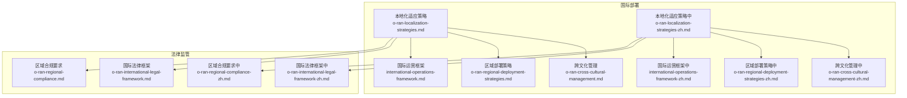
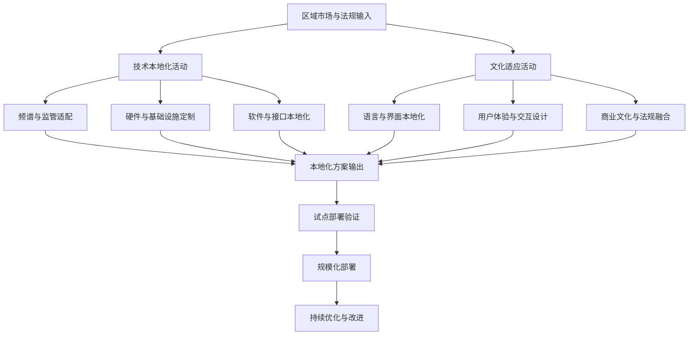
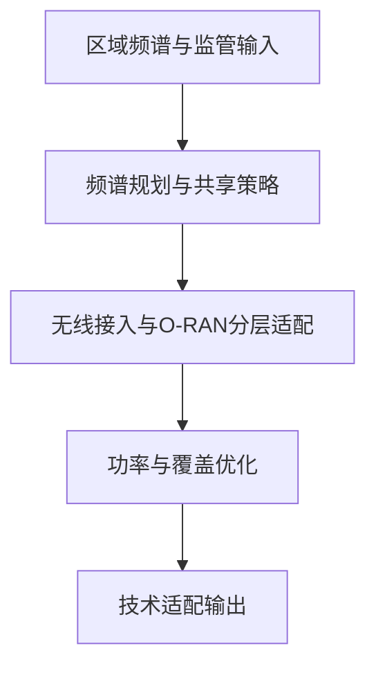
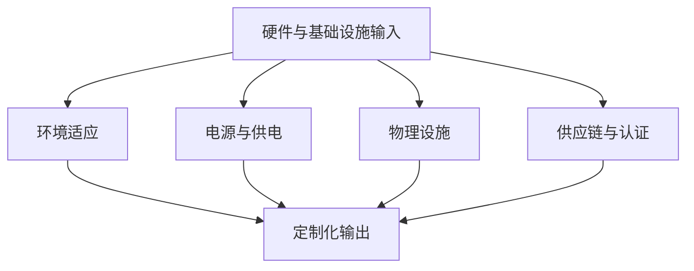
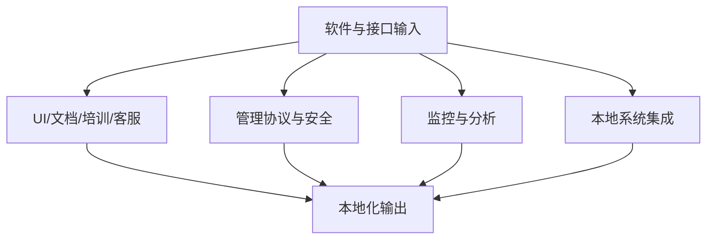
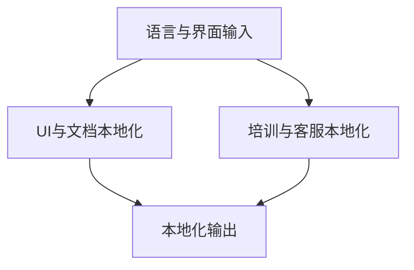
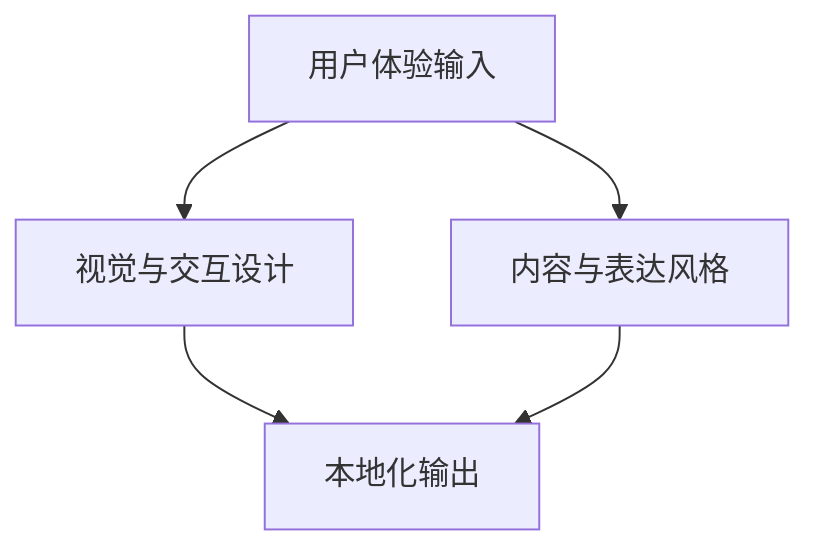
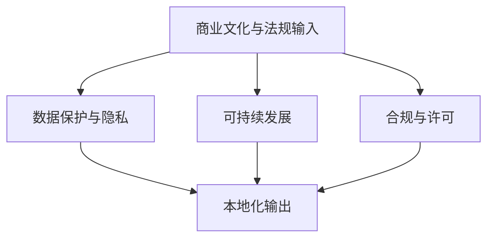
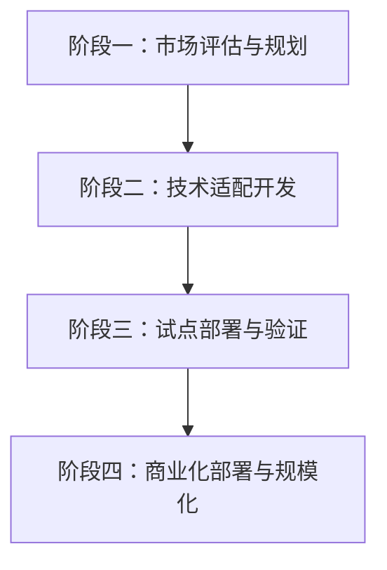
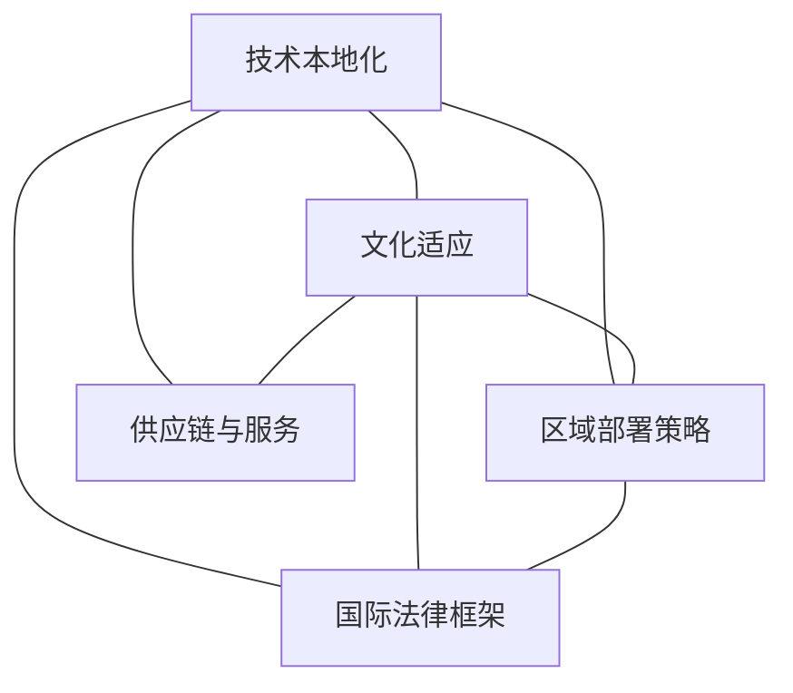

# 本地化适应

<cite>
**本文引用的文件**
- [O-RAN本地化适应策略（英文）](file://23-international-deployment/localization-adaptation/o-ran-localization-strategies.md)
- [O-RAN本地化适应策略（中文）](file://23-international-deployment/localization-adaptation/o-ran-localization-strategies-zh.md)
- [国际运营框架（英文）](file://23-international-deployment/international-operations/international-operations-framework.md)
- [国际运营框架（中文）](file://23-international-deployment/international-operations/international-operations-framework-zh.md)
- [跨文化管理（英文）](file://23-international-deployment/cross-cultural-management/o-ran-cross-cultural-management.md)
- [跨文化管理（中文）](file://23-international-deployment/cross-cultural-management/o-ran-cross-cultural-management-zh.md)
- [区域部署策略（英文）](file://23-international-deployment/regional-strategies/o-ran-regional-deployment-strategies.md)
- [区域部署策略（中文）](file://23-international-deployment/regional-strategies/o-ran-regional-deployment-strategies-zh.md)
- [国际法律框架（英文）](file://25-legal-regulations/international-laws/o-ran-international-legal-framework.md)
- [国际法律框架（中文）](file://25-legal-regulations/international-laws/o-ran-international-legal-framework-zh.md)
- [区域合规要求（英文）](file://25-legal-regulations/regional-requirements/o-ran-regional-compliance.md)
- [区域合规要求（中文）](file://25-legal-regulations/regional-requirements/o-ran-regional-compliance-zh.md)
</cite>

## 目录
1. [引言](#引言)
2. [项目结构](#项目结构)
3. [核心组件](#核心组件)
4. [架构总览](#架构总览)
5. [详细组件分析](#详细组件分析)
6. [依赖分析](#依赖分析)
7. [性能考虑](#性能考虑)
8. [故障排查指南](#故障排查指南)
9. [结论](#结论)
10. [附录](#附录)

## 引言
本文件面向O-RAN本地化适应的系统性落地，围绕“技术本地化”和“文化适应”两大维度，结合频谱适配、标准兼容、设备定制、接口本地化等技术层面，以及语言本地化、用户习惯适配、商业文化融合、法律法规遵循等非技术层面，构建可执行的实施框架。同时给出需求评估、资源配置、执行计划与效果评估的方法论，并总结关键成功因素与常见陷阱，配套风险控制与质量保证措施，最后以区域化案例与最佳实践收束。

## 项目结构
本仓库与本地化直接相关的内容主要集中在“国际部署”与“法律监管”两大板块：
- 国际部署：包含本地化策略、跨文化管理、区域部署策略与国际运营框架
- 法律监管：包含国际法律框架与区域合规要求

下图展示与本地化相关的核心文件及其关系：

图表来源
- [O-RAN本地化适应策略（英文）](file://23-international-deployment/localization-adaptation/o-ran-localization-strategies.md#L1-L424)
- [O-RAN本地化适应策略（中文）](file://23-international-deployment/localization-adaptation/o-ran-localization-strategies-zh.md#L1-L424)
- [国际运营框架（英文）](file://23-international-deployment/international-operations/international-operations-framework.md#L1-L200)
- [国际运营框架（中文）](file://23-international-deployment/international-operations/international-operations-framework-zh.md#L1-L200)
- [跨文化管理（英文）](file://23-international-deployment/cross-cultural-management/o-ran-cross-cultural-management.md#L1-L200)
- [跨文化管理（中文）](file://23-international-deployment/cross-cultural-management/o-ran-cross-cultural-management-zh.md#L1-L200)
- [区域部署策略（英文）](file://23-international-deployment/regional-strategies/o-ran-regional-deployment-strategies.md#L1-L200)
- [区域部署策略（中文）](file://23-international-deployment/regional-strategies/o-ran-regional-deployment-strategies-zh.md#L1-L200)
- [国际法律框架（英文）](file://25-legal-regulations/international-laws/o-ran-international-legal-framework.md#L1-L200)
- [国际法律框架（中文）](file://25-legal-regulations/international-laws/o-ran-international-legal-framework-zh.md#L1-L200)
- [区域合规要求（英文）](file://25-legal-regulations/regional-requirements/o-ran-regional-compliance.md#L1-L200)
- [区域合规要求（中文）](file://25-legal-regulations/regional-requirements/o-ran-regional-compliance-zh.md#L1-L200)

章节来源
- [O-RAN本地化适应策略（英文）](file://23-international-deployment/localization-adaptation/o-ran-localization-strategies.md#L1-L424)
- [O-RAN本地化适应策略（中文）](file://23-international-deployment/localization-adaptation/o-ran-localization-strategies-zh.md#L1-L424)

## 核心组件
- 技术本地化能力域
  - 频谱与监管适配：覆盖北美、欧洲、亚太等区域的频段分配、共享机制与合规流程
  - 硬件与基础设施定制：温度/气候、供电/频率、物理安装、抗震/风载与认证合规
  - 软件与接口本地化：UI/文档/培训/客服的语言与文化适配；管理协议、安全认证、监控报表的本地化集成
- 文化适应能力域
  - 语言与界面：多语种文本、日期/货币格式、RTL语言支持、色彩与图标的文化考量
  - 用户体验：导航/表单/通知/工作流的本地化设计
  - 商业文化与法规：数据主权、隐私保护、绿色技术、许可与审计体系
- 实施框架
  - 阶段化路线图：市场评估—技术适配—试点验证—规模化部署
  - 风险管理：监管变化、互操作性、性能差异、市场进入、竞争与文化差异
  - 成功要素：干系人早期参与、灵活架构、本地合作、测试验证、持续改进、治理与沟通、资源投入

章节来源
- [O-RAN本地化适应策略（英文）](file://23-international-deployment/localization-adaptation/o-ran-localization-strategies.md#L6-L424)
- [O-RAN本地化适应策略（中文）](file://23-international-deployment/localization-adaptation/o-ran-localization-strategies-zh.md#L6-L424)

## 架构总览
下图从“输入—活动—输出”的视角，展示本地化实施的总体架构：以区域市场与法规为输入，通过技术与文化双轨适配，形成可部署的本地化方案，并在试点与规模化阶段持续验证与优化。

图表来源
- [O-RAN本地化适应策略（英文）](file://23-international-deployment/localization-adaptation/o-ran-localization-strategies.md#L306-L374)
- [O-RAN本地化适应策略（中文）](file://23-international-deployment/localization-adaptation/o-ran-localization-strategies-zh.md#L306-L374)

## 详细组件分析

### 技术本地化：频谱与监管适配
- 区域频谱规划与共享
  - 北美：CBRS、C波段、毫米波与动态共享
  - 欧洲：700 MHz数字红利、3.5 GHz、26 GHz及国家差异化
  - 亚太：中国、日本、印度、东南亚的多样化频段
- 无线接入与O-RAN分层适配
  - FR1/FR2部署场景、DSS与载波聚合优化
  - O-RAN分层（Option 2/7/8）按容量/覆盖/平衡选择
- 功率与覆盖优化：发射功率、天线方向图、地理覆盖与能效合规

图表来源
- [O-RAN本地化适应策略（英文）](file://23-international-deployment/localization-adaptation/o-ran-localization-strategies.md#L10-L50)
- [O-RAN本地化适应策略（中文）](file://23-international-deployment/localization-adaptation/o-ran-localization-strategies-zh.md#L10-L50)

章节来源
- [O-RAN本地化适应策略（英文）](file://23-international-deployment/localization-adaptation/o-ran-localization-strategies.md#L8-L50)
- [O-RAN本地化适应策略（中文）](file://23-international-deployment/localization-adaptation/o-ran-localization-strategies-zh.md#L8-L50)

### 技术本地化：硬件与基础设施定制
- 环境适应：温区、湿度、盐雾、地震设防
- 电源与供电：电压/频率/电能质量/备用电源
- 物理设施：塔桅/机柜/走线/可达性
- 供应链与认证：本地含量、CE/FCC等认证、RoHS/REACH、维护与服务网络

图表来源
- [O-RAN本地化适应策略（英文）](file://23-international-deployment/localization-adaptation/o-ran-localization-strategies.md#L52-L94)
- [O-RAN本地化适应策略（中文）](file://23-international-deployment/localization-adaptation/o-ran-localization-strategies-zh.md#L52-L94)

章节来源
- [O-RAN本地化适应策略（英文）](file://23-international-deployment/localization-adaptation/o-ran-localization-strategies.md#L52-L94)
- [O-RAN本地化适应策略（中文）](file://23-international-deployment/localization-adaptation/o-ran-localization-strategies-zh.md#L52-L94)

### 技术本地化：软件与接口本地化
- 用户界面与文档：GUI文本、日期/时间/货币、RTL支持、安装/配置/排障/开发者文档
- 培训与客服：在线课程、面授材料、认证、帮助台、知识库、聊天/语音助手、社区平台
- 管理协议与安全：SNMP/NETCONF/YANG/REST/CLI本地化；SSO、证书、隐私合规
- 监控与分析：KPI定义、报表格式、仪表盘、告警通知
- 与本地系统集成：2G/3G/4G/OSS/BSS/计费/CMS、第三方应用、IoT/边缘计算、监管与合规系统

图表来源
- [O-RAN本地化适应策略（英文）](file://23-international-deployment/localization-adaptation/o-ran-localization-strategies.md#L96-L184)
- [O-RAN本地化适应策略（中文）](file://23-international-deployment/localization-adaptation/o-ran-localization-strategies-zh.md#L96-L184)

章节来源
- [O-RAN本地化适应策略（英文）](file://23-international-deployment/localization-adaptation/o-ran-localization-strategies.md#L96-L184)
- [O-RAN本地化适应策略（中文）](file://23-international-deployment/localization-adaptation/o-ran-localization-strategies-zh.md#L96-L184)

### 文化适应：语言与界面本地化
- 多语言支持：界面文本、日期/时间/货币格式、RTL语言
- 技术文档与培训：安装/配置/排障/开发者文档、在线/面授材料、认证、参考手册
- 客户支持：多语种热线、知识库翻译、聊天/语音助手、社区/社交平台

图表来源
- [O-RAN本地化适应策略（英文）](file://23-international-deployment/localization-adaptation/o-ran-localization-strategies.md#L98-L140)
- [O-RAN本地化适应策略（中文）](file://23-international-deployment/localization-adaptation/o-ran-localization-strategies-zh.md#L98-L140)

章节来源
- [O-RAN本地化适应策略（英文）](file://23-international-deployment/localization-adaptation/o-ran-localization-strategies.md#L98-L140)
- [O-RAN本地化适应策略（中文）](file://23-international-deployment/localization-adaptation/o-ran-localization-strategies-zh.md#L98-L140)

### 文化适应：用户体验与交互设计
- 视觉元素：色彩、图标、图像的文化含义与无障碍
- 交互模式：导航结构、表单设计、通知与提醒、流程优化
- 内容风格：语气/正式度、文化隐喻/引用、法律合规表达、品牌一致性

图表来源
- [O-RAN本地化适应策略（英文）](file://23-international-deployment/localization-adaptation/o-ran-localization-strategies.md#L124-L140)
- [O-RAN本地化适应策略（中文）](file://23-international-deployment/localization-adaptation/o-ran-localization-strategies-zh.md#L124-L140)

章节来源
- [O-RAN本地化适应策略（英文）](file://23-international-deployment/localization-adaptation/o-ran-localization-strategies.md#L124-L140)
- [O-RAN本地化适应策略（中文）](file://23-international-deployment/localization-adaptation/o-ran-localization-strategies-zh.md#L124-L140)

### 文化适应：商业文化与法规融合
- 数据保护与隐私：GDPR、跨境传输、本地数据驻留、主权云、边缘部署、数据治理
- 可持续发展：能效、生态设计、循环与回收、碳核算、生物多样性与气候适应
- 合规与许可：许可证管理、频谱监测、QoS报告、审计与合规追踪

图表来源
- [O-RAN本地化适应策略（英文）](file://23-international-deployment/localization-adaptation/o-ran-localization-strategies.md#L227-L262)
- [O-RAN本地化适应策略（中文）](file://23-international-deployment/localization-adaptation/o-ran-localization-strategies-zh.md#L227-L262)

章节来源
- [O-RAN本地化适应策略（英文）](file://23-international-deployment/localization-adaptation/o-ran-localization-strategies.md#L227-L262)
- [O-RAN本地化适应策略（中文）](file://23-international-deployment/localization-adaptation/o-ran-localization-strategies-zh.md#L227-L262)

### 区域市场与法规：北美、欧洲、亚太
- 北美：FCC/ISED互操作与隐私、NEPA环评、州/地方法规
- 欧洲：GDPR与数据保护、跨境传输、数据驻留、绿色技术
- 亚太：快速部署、规模与成本效率、新兴市场基建与数字包容、本地生态建设

章节来源
- [O-RAN本地化适应策略（英文）](file://23-international-deployment/localization-adaptation/o-ran-localization-strategies.md#L190-L299)
- [O-RAN本地化适应策略（中文）](file://23-international-deployment/localization-adaptation/o-ran-localization-strategies-zh.md#L190-L299)

### 实施框架：阶段化路线图
- 阶段一：市场评估与规划（1-3月）
  - 监管景观分析、文化与商业环境研究、资源与能力建设
- 阶段二：技术适配开发（4-8月）
  - 解决方案架构定制、原型开发与测试、文档与培训准备
- 阶段三：试点部署与验证（9-12月）
  - 受控部署、安装调试、性能监控与优化、用户验收、监管审批
- 阶段四：商业化部署与规模化（13-18月）
  - 全面实施、供应链优化、质量保障、监控与扩展、持续改进

图表来源
- [O-RAN本地化适应策略（英文）](file://23-international-deployment/localization-adaptation/o-ran-localization-strategies.md#L306-L374)
- [O-RAN本地化适应策略（中文）](file://23-international-deployment/localization-adaptation/o-ran-localization-strategies-zh.md#L306-L374)

章节来源
- [O-RAN本地化适应策略（英文）](file://23-international-deployment/localization-adaptation/o-ran-localization-strategies.md#L306-L374)
- [O-RAN本地化适应策略（中文）](file://23-international-deployment/localization-adaptation/o-ran-localization-strategies-zh.md#L306-L374)

### 风险管理与成功因素
- 技术风险与缓解：监管变化、互操作性、性能与质量差异
- 商业与市场风险：进入门槛、竞争压力、文化与运营差异
- 成功因素：干系人早期参与、灵活架构、本地合作、测试验证、持续改进、治理与沟通、资源投入

章节来源
- [O-RAN本地化适应策略（英文）](file://23-international-deployment/localization-adaptation/o-ran-localization-strategies.md#L376-L423)
- [O-RAN本地化适应策略（中文）](file://23-international-deployment/localization-adaptation/o-ran-localization-strategies-zh.md#L376-L423)

### 跨文化管理与国际运营
- 跨文化管理：团队协作、沟通方式、冲突化解、领导力与文化敏感性
- 国际运营：组织能力、流程制度、项目治理、风险管理与合规

章节来源
- [跨文化管理（英文）](file://23-international-deployment/cross-cultural-management/o-ran-cross-cultural-management.md#L1-L200)
- [跨文化管理（中文）](file://23-international-deployment/cross-cultural-management/o-ran-cross-cultural-management-zh.md#L1-L200)
- [国际运营框架（英文）](file://23-international-deployment/international-operations/international-operations-framework.md#L1-L200)
- [国际运营框架（中文）](file://23-international-deployment/international-operations/international-operations-framework-zh.md#L1-L200)

### 区域部署策略与法律合规
- 区域部署策略：因地制宜的网络架构、部署模式、成本与效率、生态建设
- 国际法律框架：全球法律体系概览、合规原则与流程
- 区域合规要求：各国具体合规条目、许可证与审计

章节来源
- [区域部署策略（英文）](file://23-international-deployment/regional-strategies/o-ran-regional-deployment-strategies.md#L1-L200)
- [区域部署策略（中文）](file://23-international-deployment/regional-strategies/o-ran-regional-deployment-strategies-zh.md#L1-L200)
- [国际法律框架（英文）](file://25-legal-regulations/international-laws/o-ran-international-legal-framework.md#L1-L200)
- [国际法律框架（中文）](file://25-legal-regulations/international-laws/o-ran-international-legal-framework-zh.md#L1-L200)
- [区域合规要求（英文）](file://25-legal-regulations/regional-requirements/o-ran-regional-compliance.md#L1-L200)
- [区域合规要求（中文）](file://25-legal-regulations/regional-requirements/o-ran-regional-compliance-zh.md#L1-L200)

## 依赖分析
- 组件耦合与协同
  - 技术本地化与文化适应相互支撑：技术适配需考虑文化落地，文化适配需满足技术约束
  - 阶段化实施贯穿全生命周期：从评估到规模化，各阶段对技术与文化能力提出不同权重要求
  - 法律与合规是前置条件：必须在技术与文化适配前完成监管与许可评估
- 外部依赖与集成点
  - 频谱与监管：依赖各国监管机构与标准组织
  - 认证与合规：依赖第三方认证与审计体系
  - 供应链与服务：依赖本地供应商与服务商网络

图表来源
- [O-RAN本地化适应策略（英文）](file://23-international-deployment/localization-adaptation/o-ran-localization-strategies.md#L306-L374)
- [O-RAN本地化适应策略（中文）](file://23-international-deployment/localization-adaptation/o-ran-localization-strategies-zh.md#L306-L374)
- [国际法律框架（英文）](file://25-legal-regulations/international-laws/o-ran-international-legal-framework.md#L1-L200)
- [国际法律框架（中文）](file://25-legal-regulations/international-laws/o-ran-international-legal-framework-zh.md#L1-L200)
- [区域部署策略（英文）](file://23-international-deployment/regional-strategies/o-ran-regional-deployment-strategies.md#L1-L200)
- [区域部署策略（中文）](file://23-international-deployment/regional-strategies/o-ran-regional-deployment-strategies-zh.md#L1-L200)

## 性能考虑
- 技术性能：在不同频段、气候与地理条件下保持覆盖与容量目标
- 运行效率：通过DSS、载波聚合、自适应算法提升能效与资源利用率
- 测试验证：实验室与外场测试并重，确保区域性性能达标
- 监控与反馈：建立KPI与告警体系，持续优化网络与用户体验

## 故障排查指南
- 频谱与干扰问题：核查带宽与共享规则、邻频干扰与共存策略
- 设备与环境问题：确认温度/湿度/海拔/地震等级下的运行参数与防护
- 接口与互操作问题：核对协议版本、YANG模型、CLI命令集与厂商一致性
- 文化与流程问题：检查UI/文档/培训材料是否符合当地语言与习惯，客服渠道是否畅通
- 合规与许可问题：对照区域合规清单逐项自查，准备审计材料

章节来源
- [O-RAN本地化适应策略（英文）](file://23-international-deployment/localization-adaptation/o-ran-localization-strategies.md#L376-L423)
- [O-RAN本地化适应策略（中文）](file://23-international-deployment/localization-adaptation/o-ran-localization-strategies-zh.md#L376-L423)

## 结论
O-RAN本地化需要技术与文化的双重适配，以区域合规与用户需求为导向，采用阶段化实施与闭环验证，辅以跨文化管理与国际运营能力，才能实现高质量、可持续的全球化部署。成功的关键在于早期参与、灵活架构、本地合作、严格测试与持续改进。

## 附录
- 区域案例与最佳实践建议
  - 北美：优先满足FCC互操作与隐私要求，结合NEPA流程推进许可与环评
  - 欧洲：以GDPR为核心驱动数据本地化与隐私设计，配合绿色技术政策
  - 亚太：聚焦快速部署与成本效率，同步推动本地生态与数字包容
- 质量保证与风险控制
  - 建立跨职能本地化小组，明确角色与责任
  - 制定测试矩阵与验收准则，覆盖技术与文化两个维度
  - 设立变更管理流程，应对监管与市场的动态变化