# 跨文化管理

<cite>
**本文引用的文件**
- [O-RAN 跨文化管理](file://23-international-deployment/cross-cultural-management/o-ran-cross-cultural-management.md)
- [O-RAN 培训项目](file://19-talent-development/training-programs/o-ran-training-framework-zh.md)
- [O-RAN 学习路径](file://19-talent-development/learning-paths/o-ran-learning-roadmaps-zh.md)
- [O-RAN 生态系统战略框架](file://20-ecosystem-partnership/ecosystem-strategy/o-ran-ecosystem-strategy-zh.md)
- [O-RAN 合作伙伴类型与协作模式](file://20-ecosystem-partnership/partner-types/o-ran-partner-classification-zh.md)
- [O-RAN 国际运营框架](file://23-international-deployment/international-operations/international-operations-framework.md)
- [O-RAN 团队协作最佳实践](file://30-best-practices/team-collaboration/o-ran-team-collaboration-best-practices.md)
</cite>

## 目录
1. [引言](#引言)
2. [项目结构](#项目结构)
3. [核心组件](#核心组件)
4. [架构总览](#架构总览)
5. [详细组件分析](#详细组件分析)
6. [依赖分析](#依赖分析)
7. [性能考量](#性能考量)
8. [故障排除指南](#故障排除指南)
9. [结论](#结论)
10. [附录](#附录)

## 引言
本指导文档围绕O-RAN跨文化管理，系统梳理多元文化团队组建与管理、远程协作挑战与对策、知识转移与经验分享、冲突化解与文化敏感性管理，以及供应链与生态合作中的跨文化实践。文档以项目仓库中已有的跨文化管理、培训与学习、生态系统与国际运营等权威文件为基础，形成可落地的管理方法论与实操建议，帮助组织在多文化、多时区、多语言环境下高效推进O-RAN项目与生态合作。

## 项目结构
本仓库围绕O-RAN技术体系与生态建设，形成“技术—标准—实施—生态—国际化—人才—最佳实践”等多维度文档体系。与跨文化管理直接相关的关键文件分布如下：
- 跨文化管理：系统化文化维度、沟通风格、团队管理、冲突化解与区域策略
- 人才与学习：培训框架、学习路径、认证与评估指标
- 生态系统：合作伙伴分类、协作模式、治理与KPI
- 国际运营：时区协调、语言与沟通协议、冲突预防与升级机制
- 团队协作：知识管理、学习文化与虚拟协作

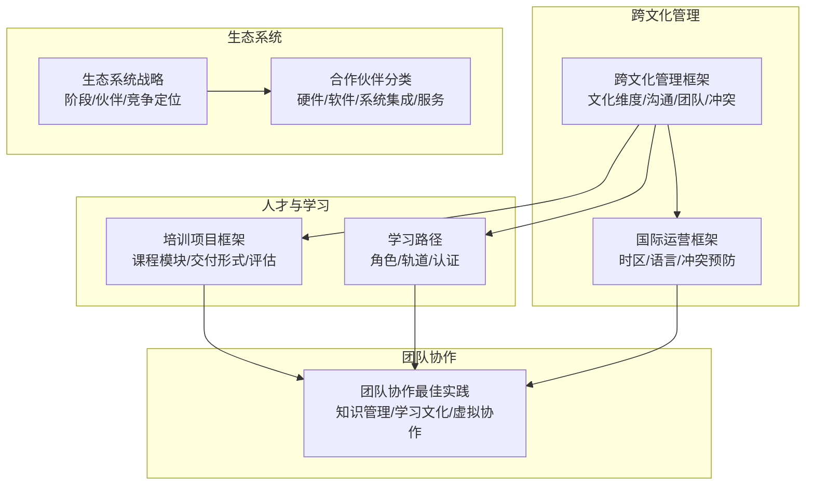

**图表来源**
- [O-RAN 跨文化管理](file://23-international-deployment/cross-cultural-management/o-ran-cross-cultural-management.md#L1-L519)
- [O-RAN 国际运营框架](file://23-international-deployment/international-operations/international-operations-framework.md#L374-L425)
- [O-RAN 培训项目](file://19-talent-development/training-programs/o-ran-training-framework-zh.md#L1-L329)
- [O-RAN 学习路径](file://19-talent-development/learning-paths/o-ran-learning-roadmaps-zh.md#L1-L297)
- [O-RAN 生态系统战略框架](file://20-ecosystem-partnership/ecosystem-strategy/o-ran-ecosystem-strategy-zh.md#L1-L189)
- [O-RAN 合作伙伴类型与协作模式](file://20-ecosystem-partnership/partner-types/o-ran-partner-classification-zh.md#L1-L218)
- [O-RAN 团队协作最佳实践](file://30-best-practices/team-collaboration/o-ran-team-collaboration-best-practices.md#L102-L132)

**章节来源**
- [O-RAN 跨文化管理](file://23-international-deployment/cross-cultural-management/o-ran-cross-cultural-management.md#L1-L519)
- [O-RAN 国际运营框架](file://23-international-deployment/international-operations/international-operations-framework.md#L374-L425)

## 核心组件
- 文化智力框架：基于霍夫斯泰德文化维度，结合O-RAN项目管理场景，提出权力建构、个体主义/集体主义、不确定性规避的实施策略
- 沟通风格适配：区分直接/间接沟通，给出在技术规范、问题升级、绩效期望、项目汇报中的文化适配要点与桥接策略
- 多元文化团队管理：团队结构矩阵、跨文化融入三阶段（行前/在任/归国）、跨文化绩效管理与领导力发展
- 冲突化解机制：冲突来源识别、预防与早期干预、调解流程五阶段（评估/准备/讨论/方案/跟进）
- 知识转移与学习：正式/非正式/数字/体验式学习机制，心理安全、持续改进与激励体系，知识产权与保密治理
- 区域管理策略：亚洲/欧洲/北美市场文化管理要点与成功要素

**章节来源**
- [O-RAN 跨文化管理](file://23-international-deployment/cross-cultural-management/o-ran-cross-cultural-management.md#L6-L519)

## 架构总览
跨文化管理体系由“文化洞察—沟通适配—团队建设—冲突化解—知识共享—区域策略”构成闭环，贯穿项目全生命周期与生态合作各层面。

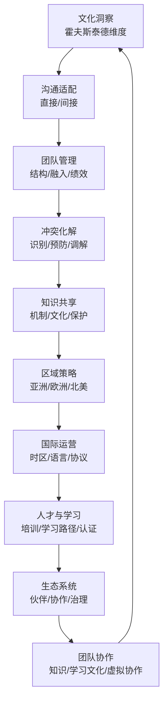

**图表来源**
- [O-RAN 跨文化管理](file://23-international-deployment/cross-cultural-management/o-ran-cross-cultural-management.md#L6-L519)
- [O-RAN 国际运营框架](file://23-international-deployment/international-operations/international-operations-framework.md#L374-L425)
- [O-RAN 培训项目](file://19-talent-development/training-programs/o-ran-training-framework-zh.md#L1-L329)
- [O-RAN 学习路径](file://19-talent-development/learning-paths/o-ran-learning-roadmaps-zh.md#L1-L297)
- [O-RAN 生态系统战略框架](file://20-ecosystem-partnership/ecosystem-strategy/o-ran-ecosystem-strategy-zh.md#L1-L189)
- [O-RAN 合作伙伴类型与协作模式](file://20-ecosystem-partnership/partner-types/o-ran-partner-classification-zh.md#L1-L218)
- [O-RAN 团队协作最佳实践](file://30-best-practices/team-collaboration/o-ran-team-collaboration-best-practices.md#L102-L132)

## 详细组件分析

### 文化维度与沟通适配
- 权力距离：高/低PDI国家在决策层级、沟通渠道、权威尊重与项目管理风格上的差异与应对
- 个体主义vs集体主义：个人成就与团队和谐在绩效与认可上的平衡
- 不确定性规避：高/低UAI文化在流程、风险与变更管理上的差异
- 直接vs间接沟通：任务导向与关系导向在技术表达、反馈与商务谈判中的注意事项与桥接策略

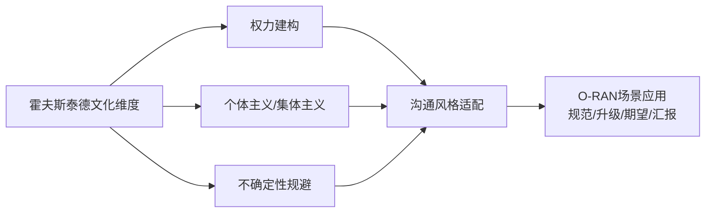

**图表来源**
- [O-RAN 跨文化管理](file://23-international-deployment/cross-cultural-management/o-ran-cross-cultural-management.md#L10-L62)

**章节来源**
- [O-RAN 跨文化管理](file://23-international-deployment/cross-cultural-management/o-ran-cross-cultural-management.md#L10-L120)

### 多元文化团队管理
- 团队结构矩阵：总部/地区/支持职能的职责分工与文化协调角色
- 融入三阶段：行前文化准备、在任支持与归国整合的系统化流程
- 跨文化绩效管理：量化指标、文化情境与反馈方式、发展与继任规划

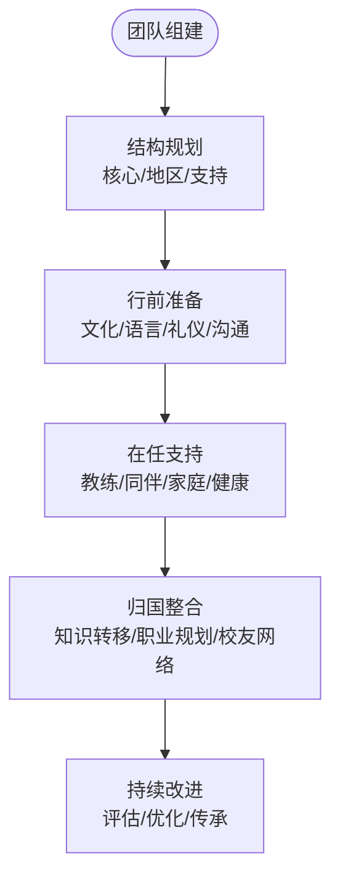

**图表来源**
- [O-RAN 跨文化管理](file://23-international-deployment/cross-cultural-management/o-ran-cross-cultural-management.md#L126-L178)

**章节来源**
- [O-RAN 跨文化管理](file://23-international-deployment/cross-cultural-management/o-ran-cross-cultural-management.md#L122-L178)

### 冲突化解与文化敏感性管理
- 冲突来源：沟通误解、工作风格差异、价值观冲突、组织文化不兼容
- 预防与早期干预：明确期望、文化敏感培训、团队建设、开放沟通渠道
- 调解流程五阶段：评估、准备、联合讨论、方案制定、跟进与改进

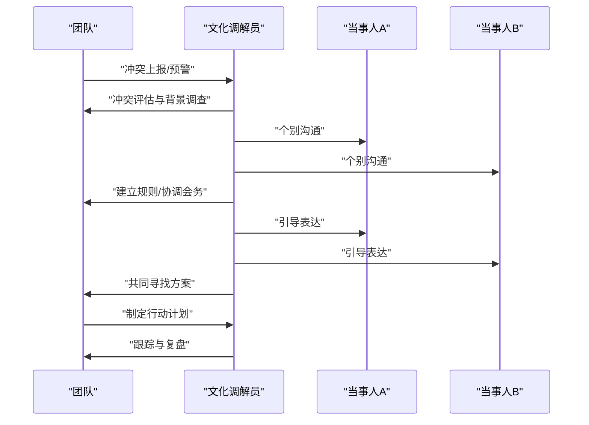

**图表来源**
- [O-RAN 跨文化管理](file://23-international-deployment/cross-cultural-management/o-ran-cross-cultural-management.md#L182-L253)

**章节来源**
- [O-RAN 跨文化管理](file://23-international-deployment/cross-cultural-management/o-ran-cross-cultural-management.md#L180-L253)

### 远程协作与虚拟团队建设
- 时区协调：核心重叠时段、区域枢纽与轮值机制
- 语言与文档：工作语言、本地语言支持、双语文档与会议翻译
- 沟通协议：正式/非正式、直接/间接、书面/口头、会议文化
- 冲突预防与升级：早期介入、文化调解、分级升级流程

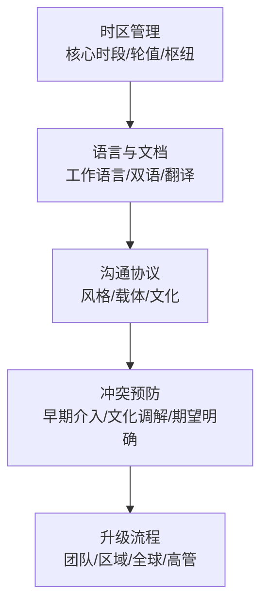

**图表来源**
- [O-RAN 国际运营框架](file://23-international-deployment/international-operations/international-operations-framework.md#L388-L425)

**章节来源**
- [O-RAN 国际运营框架](file://23-international-deployment/international-operations/international-operations-framework.md#L374-L425)

### 知识转移与经验分享
- 机制：正式培训、非正式网络、数字平台、体验式学习
- 文化：心理安全、持续改进、认可与奖励
- 保护：知识产权归属、保密与安全、伦理共享

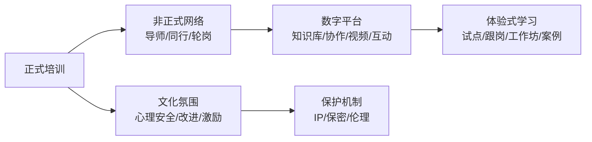

**图表来源**
- [O-RAN 跨文化管理](file://23-international-deployment/cross-cultural-management/o-ran-cross-cultural-management.md#L318-L377)

**章节来源**
- [O-RAN 跨文化管理](file://23-international-deployment/cross-cultural-management/o-ran-cross-cultural-management.md#L318-L377)

### 区域市场管理策略
- 亚洲：关系为中心、共识驱动、耐心与中介利用
- 欧洲：北欧平等文化与可持续理念；大陆国家重视等级与质量
- 北美：结果导向、高效沟通、创新鼓励、多元文化欣赏

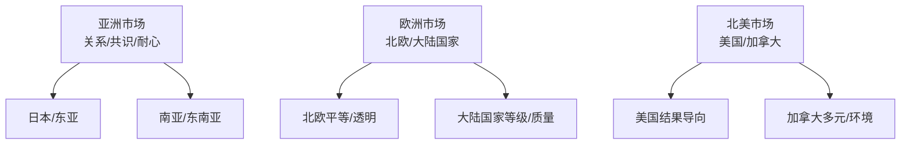

**图表来源**
- [O-RAN 跨文化管理](file://23-international-deployment/cross-cultural-management/o-ran-cross-cultural-management.md#L381-L517)

**章节来源**
- [O-RAN 跨文化管理](file://23-international-deployment/cross-cultural-management/o-ran-cross-cultural-management.md#L379-L517)

### 供应链与生态合作中的跨文化挑战
- 合作伙伴分类：硬件厂商、软件平台、系统集成、托管与咨询服务、垂直行业与研究机构
- 协作模式：授权/认证、预集成/支持、7×24运营、远程监控、现场服务、顾问项目
- 生态治理：指导委员会、运营治理、创新委员会、KPI与风险缓解

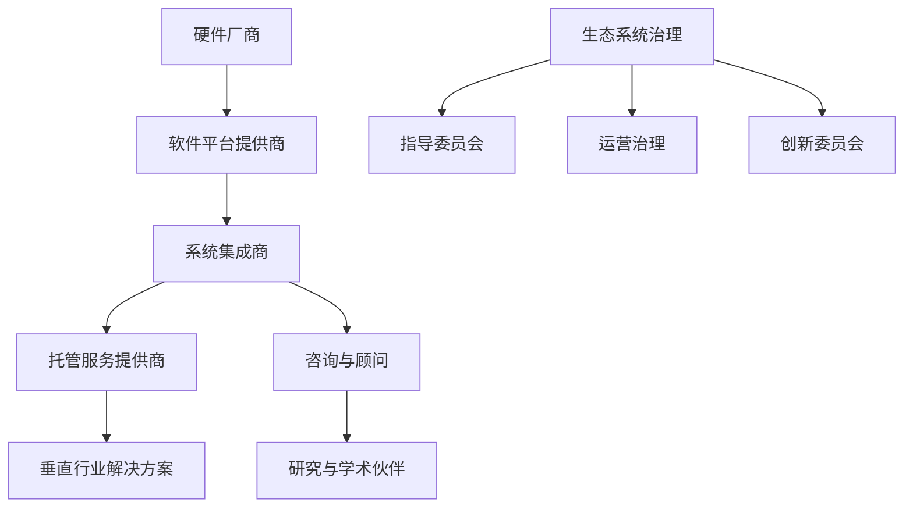

**图表来源**
- [O-RAN 合作伙伴类型与协作模式](file://20-ecosystem-partnership/partner-types/o-ran-partner-classification-zh.md#L6-L218)
- [O-RAN 生态系统战略框架](file://20-ecosystem-partnership/ecosystem-strategy/o-ran-ecosystem-strategy-zh.md#L143-L164)

**章节来源**
- [O-RAN 合作伙伴类型与协作模式](file://20-ecosystem-partnership/partner-types/o-ran-partner-classification-zh.md#L1-L218)
- [O-RAN 生态系统战略框架](file://20-ecosystem-partnership/ecosystem-strategy/o-ran-ecosystem-strategy-zh.md#L1-L189)

### 人才发展与培训支撑
- 培训框架：高管领导力、技术实施、安全与合规、云原生O-RAN、大学合作、定制化方案
- 学习路径：网络工程师、RIC开发者、安全/云/无线优化专业化轨道，认证与评估
- 交付与评估：现场/在线/混合/自定进度、试点-迭代-推广、季度评估与ROI

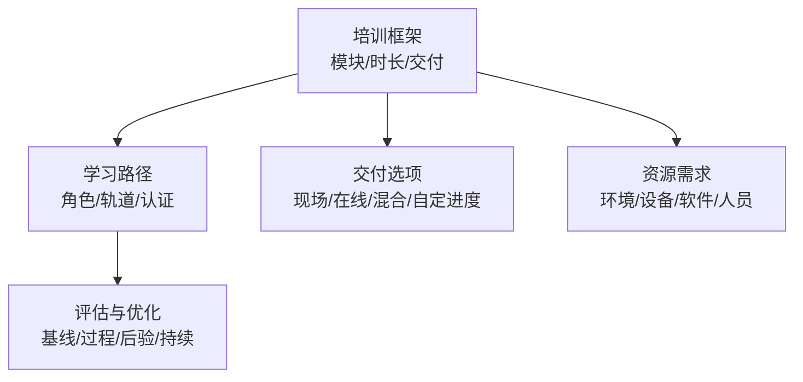

**图表来源**
- [O-RAN 培训项目](file://19-talent-development/training-programs/o-ran-training-framework-zh.md#L1-L329)
- [O-RAN 学习路径](file://19-talent-development/learning-paths/o-ran-learning-roadmaps-zh.md#L1-L297)

**章节来源**
- [O-RAN 培训项目](file://19-talent-development/training-programs/o-ran-training-framework-zh.md#L1-L329)
- [O-RAN 学习路径](file://19-talent-development/learning-paths/o-ran-learning-roadmaps-zh.md#L1-L297)

## 依赖分析
跨文化管理与国际运营、人才与学习、生态系统紧密耦合：
- 跨文化管理为国际运营提供文化适配与冲突预防基础
- 人才与学习为跨文化团队提供能力与文化素养支撑
- 生态系统为跨文化项目提供多方协作与治理框架
- 团队协作最佳实践为跨文化知识共享与虚拟协作提供方法论

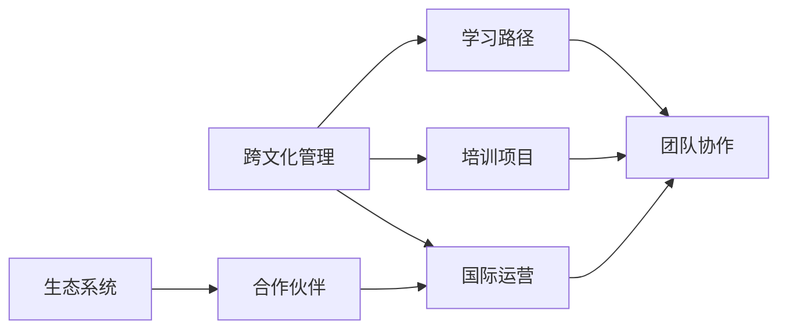

**图表来源**
- [O-RAN 跨文化管理](file://23-international-deployment/cross-cultural-management/o-ran-cross-cultural-management.md#L1-L519)
- [O-RAN 国际运营框架](file://23-international-deployment/international-operations/international-operations-framework.md#L374-L425)
- [O-RAN 培训项目](file://19-talent-development/training-programs/o-ran-training-framework-zh.md#L1-L329)
- [O-RAN 学习路径](file://19-talent-development/learning-paths/o-ran-learning-roadmaps-zh.md#L1-L297)
- [O-RAN 生态系统战略框架](file://20-ecosystem-partnership/ecosystem-strategy/o-ran-ecosystem-strategy-zh.md#L1-L189)
- [O-RAN 合作伙伴类型与协作模式](file://20-ecosystem-partnership/partner-types/o-ran-partner-classification-zh.md#L1-L218)
- [O-RAN 团队协作最佳实践](file://30-best-practices/team-collaboration/o-ran-team-collaboration-best-practices.md#L102-L132)

**章节来源**
- [O-RAN 跨文化管理](file://23-international-deployment/cross-cultural-management/o-ran-cross-cultural-management.md#L1-L519)
- [O-RAN 团队协作最佳实践](file://30-best-practices/team-collaboration/o-ran-team-collaboration-best-practices.md#L102-L132)

## 性能考量
- 文化适配与沟通效率：减少误解导致的返工与延期
- 跨文化团队稳定性：降低人员流动与摩擦成本
- 知识共享与传承：缩短上手周期，提升项目成功率
- 生态协同效率：明确协作边界与治理机制，降低交易成本
- 国际运营时区与语言：通过制度化流程与工具提升协作效率

## 故障排除指南
- 沟通障碍
  - 症状：信息传递不清、反馈被误读、会议效率低
  - 处置：明确沟通协议、使用书面确认、引入文化联络员、定期校准期望
- 团队冲突
  - 症状：协作不畅、信任缺失、绩效争议
  - 处置：早期干预、文化调解、建立共同目标与行动清单、复盘改进
- 远程协作低效
  - 症状：时差协调困难、语言与文化差异、虚拟关系弱化
  - 处置：核心时段轮值、双语支持、视频关系建设、异步协作工具与规范
- 知识断层
  - 症状：重复试错、隐性知识流失、培训转化差
  - 处置：标准化知识库、导师与轮岗、体验式学习、激励与认可
- 生态合作失衡
  - 症状：目标不一致、交付质量波动、关系紧张
  - 处置：治理结构明确、KPI对齐、定期评审与升级机制、风险与合规管理

**章节来源**
- [O-RAN 跨文化管理](file://23-international-deployment/cross-cultural-management/o-ran-cross-cultural-management.md#L180-L253)
- [O-RAN 国际运营框架](file://23-international-deployment/international-operations/international-operations-framework.md#L412-L425)
- [O-RAN 团队协作最佳实践](file://30-best-practices/team-collaboration/o-ran-team-collaboration-best-practices.md#L102-L132)

## 结论
通过文化维度洞察、沟通风格适配、团队融入与冲突化解机制、远程协作制度化、知识共享与学习文化、区域市场策略以及生态系统治理，O-RAN跨文化管理体系能够在多文化、多时区、多语言环境中实现高效协同与可持续发展。建议组织以本框架为基线，结合自身项目与生态特点，逐步完善流程、工具与文化氛围，持续优化跨文化协作效能。

## 附录
- 术语
  - 文化维度：权力建构、个体主义/集体主义、不确定性规避
  - 跨文化团队：多文化背景成员组成的项目团队
  - 生态系统：围绕O-RAN的多方合作伙伴网络
  - 国际运营：跨国/跨区域的项目与日常协作
- 参考文件
  - [O-RAN 跨文化管理](file://23-international-deployment/cross-cultural-management/o-ran-cross-cultural-management.md#L1-L519)
  - [O-RAN 国际运营框架](file://23-international-deployment/international-operations/international-operations-framework.md#L374-L425)
  - [O-RAN 培训项目](file://19-talent-development/training-programs/o-ran-training-framework-zh.md#L1-L329)
  - [O-RAN 学习路径](file://19-talent-development/learning-paths/o-ran-learning-roadmaps-zh.md#L1-L297)
  - [O-RAN 生态系统战略框架](file://20-ecosystem-partnership/ecosystem-strategy/o-ran-ecosystem-strategy-zh.md#L1-L189)
  - [O-RAN 合作伙伴类型与协作模式](file://20-ecosystem-partnership/partner-types/o-ran-partner-classification-zh.md#L1-L218)
  - [O-RAN 团队协作最佳实践](file://30-best-practices/team-collaboration/o-ran-team-collaboration-best-practices.md#L102-L132)