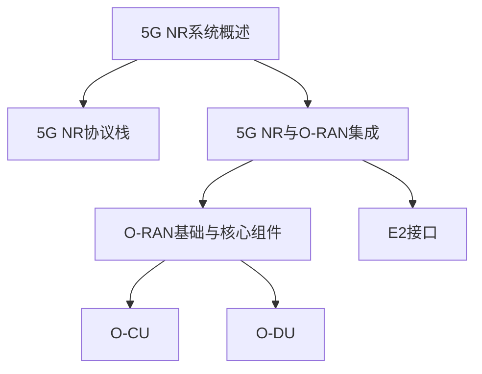
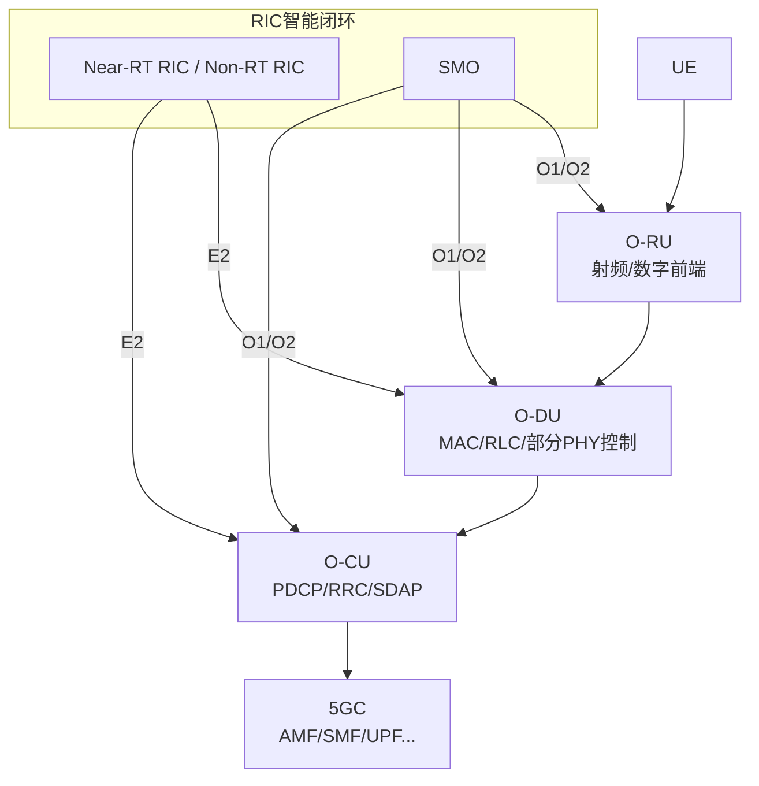
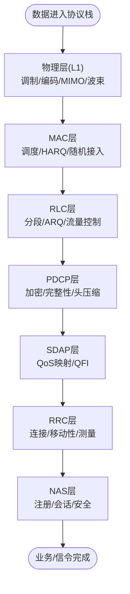
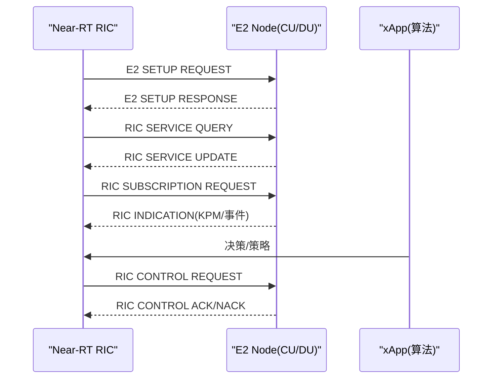
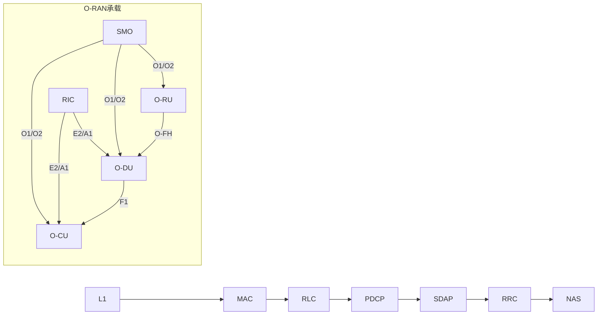

# 5G NR基础

<cite>
**本文引用的文件**
- [35-5g-nr-fundamentals/readme.md](file://35-5g-nr-fundamentals/readme.md)
- [35-5g-nr-fundamentals/5g-nr-system-overview.md](file://35-5g-nr-fundamentals/5g-nr-system-overview.md)
- [35-5g-nr-fundamentals/5g-nr-protocol-stack.md](file://35-5g-nr-fundamentals/5g-nr-protocol-stack.md)
- [35-5g-nr-fundamentals/5g-nr-o-ran-integration.md](file://35-5g-nr-fundamentals/5g-nr-o-ran-integration.md)
- [01-architecture-system/readme-zh.md](file://01-architecture-system/readme-zh.md)
- [02-core-components/o-cu.md](file://02-core-components/o-cu.md)
- [02-core-components/o-du.md](file://02-core-components/o-du.md)
- [03-interface-standards/e2-interface.md](file://03-interface-standards/e2-interface.md)
- [19-talent-development/learning-paths/o-ran-learning-roadmaps.md](file://19-talent-development/learning-paths/o-ran-learning-roadmaps.md)
</cite>

## 更新摘要
**变更内容**
- 增强了系统概述和协议栈文档的元数据，改进了搜索性和分类
- 更新了学习路径以包含六个综合技术文档
- 优化了文档结构和导航体验
- 增强了多语言支持和版本管理

## 目录
1. [引言](#引言)
2. [项目结构](#项目结构)
3. [核心组件](#核心组件)
4. [架构总览](#架构总览)
5. [详细组件分析](#详细组件分析)
6. [依赖关系分析](#依赖关系分析)
7. [性能考量](#性能考量)
8. [故障排查指南](#故障排查指南)
9. [学习路径与资源](#学习路径与资源)
10. [结论](#结论)
11. [附录](#附录)

## 引言
本章节面向云平台运维与网络工程人员，系统化梳理5G NR（New Radio）的基础知识，包括演进背景、系统架构、关键性能指标、频谱与部署模式、协议栈分层、以及与O-RAN的集成方式。内容基于3GPP规范与O-RAN联盟标准，兼顾理论框架与生产实践要点，帮助读者快速建立对5G NR的整体认知，并理解其在云原生RAN中的承载与优化路径。

**更新** 增强了文档元数据，改进了搜索性和分类，提供了更清晰的学习路径指引。

## 项目结构
围绕"5G NR基础"的知识组织主要位于以下文档：
- 5G NR系统概述：覆盖演进、架构、KPI、频谱、部署与标准等全景
- 5G NR协议栈：自下而上详解物理层至NAS各层功能与交互
- 5G NR与O-RAN集成：映射NR到O-RU/O-DU/O-CU/RIC/SMO，定义接口与优化闭环
- O-RAN基础与核心组件：CU/DU职责、接口体系、解耦选项与云集成
- E2接口：Near-RT RIC与E2 Node的服务化控制与数据上报机制

**图表来源**
- [35-5g-nr-fundamentals/5g-nr-system-overview.md:11-409](file://35-5g-nr-fundamentals/5g-nr-system-overview.md#L11-L409)
- [35-5g-nr-fundamentals/5g-nr-protocol-stack.md:11-800](file://35-5g-nr-fundamentals/5g-nr-protocol-stack.md#L11-L800)
- [35-5g-nr-fundamentals/5g-nr-o-ran-integration.md:11-800](file://35-5g-nr-fundamentals/5g-nr-o-ran-integration.md#L11-L800)
- [01-architecture-system/readme-zh.md:11-171](file://01-architecture-system/readme-zh.md#L11-L171)
- [02-core-components/o-cu.md:11-429](file://02-core-components/o-cu.md#L11-L429)
- [02-core-components/o-du.md:11-425](file://02-core-components/o-du.md#L11-L425)
- [03-interface-standards/e2-interface.md:11-375](file://03-interface-standards/e2-interface.md#L11-L375)

**章节来源**
- [35-5g-nr-fundamentals/readme.md:11-101](file://35-5g-nr-fundamentals/readme.md#L11-L101)

## 核心组件
- 5G NR系统：UE、NG-RAN（gNB）、5GC；三大场景eMBB/URLLC/mMTC；NSA/SA部署模式
- 协议栈分层：应用/NAS/RRC/SDAP/PDCP/RLC/MAC/L1，用户面与控制面差异
- O-RAN承载：O-RU（射频/数字前端）、O-DU（MAC/RLC/部分PHY控制）、O-CU（PDCP/RRC/SDAP），RIC（近实时/非实时）与SMO（管理编排）
- 关键接口：F1（CU-DU）、O-FH（DU-RU）、E2（RIC-E2Node）、A1（Non-RT RIC-Near-RT RIC）、O1/O2（SMO）

**章节来源**
- [35-5g-nr-fundamentals/5g-nr-system-overview.md:54-90](file://35-5g-nr-fundamentals/5g-nr-system-overview.md#L54-L90)
- [35-5g-nr-fundamentals/5g-nr-protocol-stack.md:15-125](file://35-5g-nr-fundamentals/5g-nr-protocol-stack.md#L15-L125)
- [35-5g-nr-fundamentals/5g-nr-o-ran-integration.md:138-172](file://35-5g-nr-fundamentals/5g-nr-o-ran-integration.md#L138-L172)
- [01-architecture-system/readme-zh.md:25-44](file://01-architecture-system/readme-zh.md#L25-L44)

## 架构总览
下图展示5G NR在O-RAN中的承载关系与关键接口，体现从空口到核心网的数据与控制流，以及RIC智能闭环。

**图表来源**
- [35-5g-nr-fundamentals/5g-nr-o-ran-integration.md:138-172](file://35-5g-nr-fundamentals/5g-nr-o-ran-integration.md#L138-L172)
- [35-5g-nr-fundamentals/5g-nr-o-ran-integration.md:302-428](file://35-5g-nr-fundamentals/5g-nr-o-ran-integration.md#L302-L428)
- [03-interface-standards/e2-interface.md:97-127](file://03-interface-standards/e2-interface.md#L97-L127)

## 详细组件分析

### 5G NR系统概述
- 演进与目标：IMT-2020定义的eMBB/URLLC/mMTC三大场景；Release 15/16/17/18能力演进
- 架构：UE-NG-RAN-5GC；gNB功能与接口（NG/Xn/F1/E1）
- KPI：峰值速率、时延、连接密度、移动性、能效
- 频谱：FR1/Sub-6GHz与FR2/mmWave；载波聚合/双连接/DSS
- 标准：TS 38系列（物理层/协议栈/接口/射频）

**章节来源**
- [35-5g-nr-fundamentals/5g-nr-system-overview.md:15-53](file://35-5g-nr-fundamentals/5g-nr-system-overview.md#L15-L53)
- [35-5g-nr-fundamentals/5g-nr-system-overview.md:91-160](file://35-5g-nr-fundamentals/5g-nr-system-overview.md#L91-L160)
- [35-5g-nr-fundamentals/5g-nr-system-overview.md:206-243](file://35-5g-nr-fundamentals/5g-nr-system-overview.md#L206-L243)

### 5G NR协议栈
- 分层与角色：应用/NAS/RRC/SDAP/PDCP/RLC/MAC/L1；用户面与控制面差异
- 物理层：调制编码、MIMO、波束管理、功率控制、传输信道
- MAC：逻辑/传输信道映射、复用/解复用、BSR/PHR、HARQ、随机接入
- RLC：TM/UM/AM模式、分段重组、ARQ、重复检测、流量控制
- PDCP：头压缩、加密/完整性保护、重排序/重复检测
- SDAP：QoS流到DRB映射、QFI标记、QoS框架
- RRC：状态机（IDLE/INACTIVE/CONNECTED）、系统信息、连接/移动性、测量
- NAS：注册/连接/会话/安全管理

**图表来源**
- [35-5g-nr-fundamentals/5g-nr-protocol-stack.md:15-125](file://35-5g-nr-fundamentals/5g-nr-protocol-stack.md#L15-L125)
- [35-5g-nr-fundamentals/5g-nr-protocol-stack.md:126-800](file://35-5g-nr-fundamentals/5g-nr-protocol-stack.md#L126-L800)

**章节来源**
- [35-5g-nr-fundamentals/5g-nr-protocol-stack.md:15-800](file://35-5g-nr-fundamentals/5g-nr-protocol-stack.md#L15-L800)

### O-RAN承载与接口
- 功能分割：PHY-MAC（O-FH）、RLC-PDCP（F1）、RRC-用户面（E1）、RIC（E2/A1/O1/O2）
- 接口特性：O-FH（eCPRI/RoE、同步）、F1（F1AP/GTP-U）、E2（E2AP/SCTP、服务模型）、A1（REST策略）、O1/O2（NETCONF/YANG、云资源）
- 性能影响：前传/中传延迟、带宽、可靠性与优化建议

**章节来源**
- [35-5g-nr-fundamentals/5g-nr-o-ran-integration.md:431-605](file://35-5g-nr-fundamentals/5g-nr-o-ran-integration.md#L431-L605)

### O-CU（集中式单元）
- CU-CP：RRC、NG控制面、F1控制面、移动性与安全管理
- CU-UP：PDCP、SDAP、用户面转发、负载均衡与统计计费
- 部署与容量：集中/分布式/混合；水平扩展与自动扩缩容
- 运维：监控告警、配置一致性、故障恢复、性能优化

**章节来源**
- [02-core-components/o-cu.md:11-429](file://02-core-components/o-cu.md#L11-L429)

### O-DU（分布式单元）
- 功能：物理层处理、MAC层调度/HARQ/随机接入、物理层控制
- 实时性：毫秒级处理、高精度时间同步（PTP）、高可靠
- 部署：边缘/集中/混合；前传/中传网络规划与同步
- 运维：性能监控、配置管理、故障处理、资源优化

**章节来源**
- [02-core-components/o-du.md:11-425](file://02-core-components/o-du.md#L11-L425)

### E2接口（Near-RT RIC与E2 Node）
- 过程模型：E2 Setup/Reset、RIC Service Query/Update、RIC Subscription/Indication、RIC Control/Insert
- 服务模型：KPM（性能测量）、RC（RAN控制）、NI（网络信息）、MRO/MO（移动鲁棒性/优化）、MAC/RLC/PDCP暴露
- 部署与优化：SCTP多流、批量处理、缓存、低延迟路径与冗余

**图表来源**
- [03-interface-standards/e2-interface.md:17-54](file://03-interface-standards/e2-interface.md#L17-L54)
- [03-interface-standards/e2-interface.md:71-96](file://03-interface-standards/e2-interface.md#L71-L96)

**章节来源**
- [03-interface-standards/e2-interface.md:11-375](file://03-interface-standards/e2-interface.md#L11-L375)

## 依赖关系分析
- 5G NR协议栈内部依赖：L1→MAC→RLC→PDCP→SDAP→RRC→NAS，用户面与控制面共享底层但上层职责不同
- O-RAN承载依赖：O-RU依赖O-DU的前传链路（O-FH），O-DU依赖O-CU的中传链路（F1），RIC通过E2/A1/O1/O2实现控制与管理闭环
- 接口间耦合：E2服务模型驱动xApp决策，反向控制E2 Node参数或流程；SMO通过O1/O2进行配置与编排

**图表来源**
- [35-5g-nr-fundamentals/5g-nr-protocol-stack.md:15-125](file://35-5g-nr-fundamentals/5g-nr-protocol-stack.md#L15-L125)
- [35-5g-nr-fundamentals/5g-nr-o-ran-integration.md:431-605](file://35-5g-nr-fundamentals/5g-nr-o-ran-integration.md#L431-L605)
- [03-interface-standards/e2-interface.md:97-127](file://03-interface-standards/e2-interface.md#L97-L127)

**章节来源**
- [35-5g-nr-fundamentals/5g-nr-protocol-stack.md:15-125](file://35-5g-nr-fundamentals/5g-nr-protocol-stack.md#L15-L125)
- [35-5g-nr-fundamentals/5g-nr-o-ran-integration.md:431-605](file://35-5g-nr-fundamentals/5g-nr-o-ran-integration.md#L431-L605)
- [03-interface-standards/e2-interface.md:97-127](file://03-interface-standards/e2-interface.md#L97-L127)

## 性能考量
- 时延预算：前传（O-FH）<100μs，中传（F1）<1ms，E2控制闭环<10ms；端到端需结合业务SLA
- 带宽规划：前传受MIMO与带宽影响显著；中传与回传按业务模型估算
- 可靠性设计：接口冗余、组件冗余、故障快速恢复（如E2 Reset、切换）
- 优化手段：SCTP多流与拥塞控制、消息批处理与压缩、缓存与就近计算、QoS保障与路由优化

**章节来源**
- [35-5g-nr-fundamentals/5g-nr-o-ran-integration.md:570-605](file://35-5g-nr-fundamentals/5g-nr-o-ran-integration.md#L570-L605)
- [03-interface-standards/e2-interface.md:169-185](file://03-interface-standards/e2-interface.md#L169-L185)

## 故障排查指南
- 常见故障域
  - 接口连通性：E2 Setup失败、F1断连、O-FH同步丢失
  - 性能劣化：E2消息延迟升高、吞吐下降、误码率上升
  - 配置错误：参数不一致、版本不兼容、策略冲突
- 定位方法
  - 告警与日志：关联RIC/CU/DU日志，识别异常点
  - 信令跟踪：E2订阅/指示/控制流程、F1上下文建立/释放
  - 测试验证：使用工具复现问题，验证修复效果
- 恢复策略
  - 重启服务/重置接口（E2 Reset）
  - 调整参数（SCTP、QoS、调度参数）
  - 升级修复与回滚策略

**章节来源**
- [03-interface-standards/e2-interface.md:186-227](file://03-interface-standards/e2-interface.md#L186-L227)
- [02-core-components/o-cu.md:207-287](file://02-core-components/o-cu.md#L207-L287)
- [02-core-components/o-du.md:234-318](file://02-core-components/o-du.md#L234-L318)

## 学习路径与资源
基于更新的元数据和分类改进，为不同角色的学习者提供结构化学习路径：

### 网络工程师学习路径
- **第一阶段（第1-3个月）**：5G RAN基础、O-RAN架构基础、协议基础
- **第二阶段（第4-6个月）**：O-RAN组件配置、网络管理、故障排查基础
- **第三阶段（第7-9个月）**：高级功能、性能优化、项目管理

### RIC开发者学习路径
- **第一阶段（第1-2个月）**：Python编程基础、容器技术、API开发
- **第二阶段（第3-5个月）**：xApp开发、机器学习集成、高级RIC功能
- **第三阶段（第6-8个月）**：生产部署、可扩展性与可靠性、高级主题

### 专业学习轨道
- **安全专家轨道**：网络安全、数据保护、合规性（6-8个月）
- **云基础设施轨道**：Kubernetes、云网络、DevOps实践（4-6个月）
- **无线优化轨道**：RF工程、传播建模、优化算法（5-7个月）

**章节来源**
- [19-talent-development/learning-paths/o-ran-learning-roadmaps.md:18-197](file://19-talent-development/learning-paths/o-ran-learning-roadmaps.md#L18-L197)
- [19-talent-development/learning-paths/o-ran-learning-roadmaps.md:199-215](file://19-talent-development/learning-paths/o-ran-learning-roadmaps.md#L199-L215)

## 结论
5G NR为下一代无线接入提供高性能、低时延与海量连接能力；O-RAN通过开放接口与智能化（RIC）将NR能力以云原生方式灵活承载与优化。掌握NR协议栈、O-RAN承载与E2闭环是设计与运维高质量5G网络的关键。建议在工程中优先明确SLA与时延预算，合理划分前后传与中传，构建可观测与自动化闭环，持续迭代优化。

**更新** 通过学习路径和资源指引，帮助不同背景的读者更高效地掌握5G NR基础知识。

## 附录
- 常用术语：5GC、AMF、SMF、UPF、gNB、CU/DU、eMBB/URLLC/mMTC、NSA/SA、F1/E2/O-FH/O1/O2
- 参考规范：3GPP TS 38系列、O-RAN WG1/WG3/WG4规范、ETSI O-RAN标准

**章节来源**
- [35-5g-nr-fundamentals/5g-nr-system-overview.md:385-409](file://35-5g-nr-fundamentals/5g-nr-system-overview.md#L385-L409)
- [01-architecture-system/readme-zh.md:113-128](file://01-architecture-system/readme-zh.md#L113-L128)