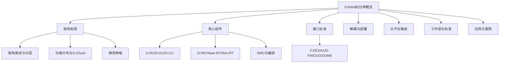
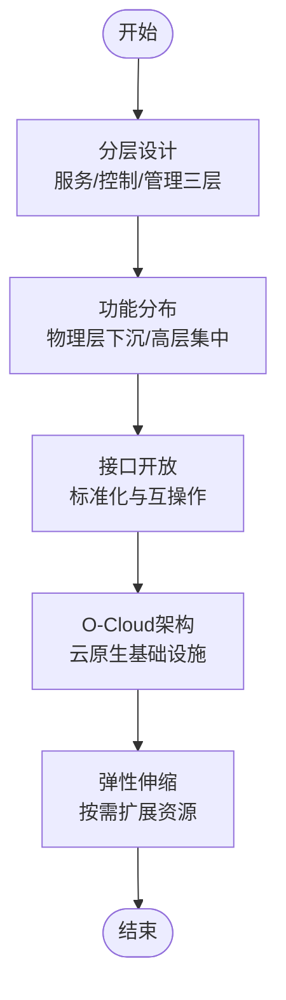
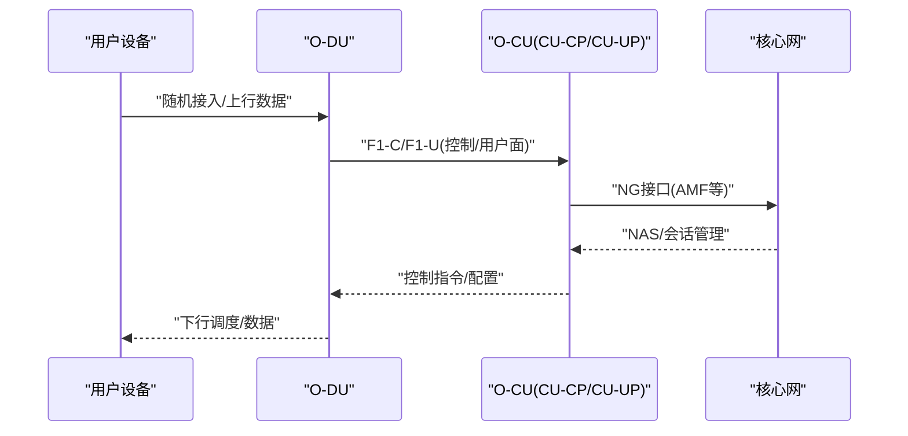
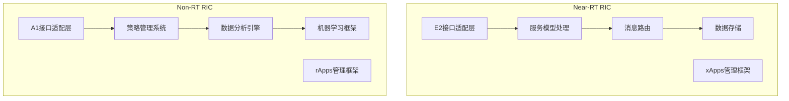
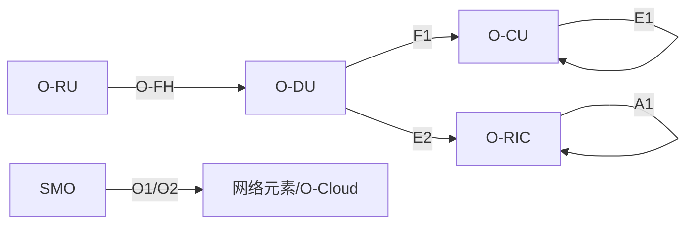
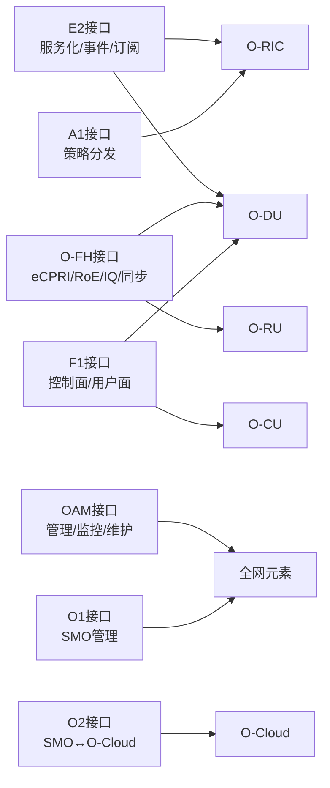

# 基础知识体系

<cite>
**本文引用的文件**
- [O-RAN基础知识体系.md](file://README.md)
- [O-RAN架构系统.md](file://01-architecture-system/readme.md)
- [O-DU（分布式单元）.md](file://02-core-components/o-du.md)
- [O-CU（集中式单元）.md](file://02-core-components/o-cu.md)
- [O-RIC（RAN智能控制器）.md](file://02-core-components/o-ric.md)
- [E2接口.md](file://03-interface-standards/e2-interface.md)
- [O-FH接口（开放前传）.md](file://03-interface-standards/o-fh-interface.md)
- [OAM接口.md](file://03-interface-standards/oam-interface.md)
- [O-RAN术语表.md](file://comprehensive-oran-glossary.md)
</cite>

## 目录
1. [引言](#引言)
2. [项目结构](#项目结构)
3. [核心组件](#核心组件)
4. [架构总览](#架构总览)
5. [详细组件分析](#详细组件分析)
6. [依赖关系分析](#依赖关系分析)
7. [性能考虑](#性能考虑)
8. [故障排查指南](#故障排查指南)
9. [结论](#结论)
10. [附录](#附录)

## 引言
本文件面向希望系统掌握O-RAN基础知识体系的读者，围绕“O-RAN架构系统、核心网络元素、接口标准”三大领域，梳理O-RAN参考架构的发展脉络、分层设计与功能分布；深入解析O-RU、O-DU、O-CU、O-RIC、SMO等核心组件的定位、技术特性与相互关系；系统介绍E2、A1、F1、O-FH、O1、O2、OAM等关键接口协议的工作原理、消息与最佳实践；并提供架构演进路线与功能解耦选项分析，辅以部署选择指导与性能影响评估，帮助读者建立从理论到实践的完整知识地图。

## 项目结构
该知识库以主题域为纲，形成“架构系统—核心组件—接口标准—解耦与部署—云融合—工作组—研发—实施—标准—应用—资源—过渡路径”的完整知识谱系。本文重点聚焦架构系统、核心组件与接口标准三大部分，其余章节作为背景与延伸阅读。



**图表来源**
- [O-RAN基础知识体系.md](file://README.md#L1-L365)
- [O-RAN架构系统.md](file://01-architecture-system/readme.md#L1-L161)

**章节来源**
- [O-RAN基础知识体系.md](file://README.md#L1-L365)
- [O-RAN架构系统.md](file://01-architecture-system/readme.md#L1-L161)

## 核心组件
本节聚焦O-RAN三大类核心网络元素：前传单元（O-RU）、中间单元（O-DU）、集中单元（O-CU），以及智能化中枢（O-RIC）与服务编排（SMO）。它们在O-RAN参考架构中承担物理层处理、高层协议处理、智能控制与服务编排等职责，彼此通过标准化接口协同工作。

- O-RU（射频单元）：负责射频信号收发与天线连接，承担前传链路的物理层对接。
- O-DU（分布式单元）：负责物理层与MAC层处理，承担实时性要求高的数据面功能，连接O-RU与O-CU。
- O-CU（集中式单元）：分为CU-CP与CU-UP，分别处理控制面与用户面，实现高层协议与资源管理。
- O-RIC（RAN智能控制器）：分为Near-RT RIC与Non-RT RIC，分别支撑毫秒级闭环控制与秒至分钟级策略管理，承载xApps/rApps运行与策略下发。
- SMO（服务管理与编排）：负责网络服务生命周期管理、配置与故障管理，作为跨域编排枢纽。

```mermaid
graph TB
subgraph "前传与接入"
RU["O-RU<br/>射频单元"]
FH["O-FH<br/>开放前传接口"]
end
subgraph "中间处理"
DU["O-DU<br/>分布式单元"]
F1["F1接口<br/>CU-UP/CU-CP"]
end
subgraph "集中控制"
CU_CP["CU-CP<br/>控制面"]
CU_UP["CU-UP<br/>用户面"]
E1["E1接口<br/>CU-CP/CU-UP"]
end
subgraph "智能中枢"
NRT["Near-RT RIC"]
ART["Non-RT RIC"]
E2["E2接口<br/>RIC↔CU/DU"]
end
subgraph "服务编排"
SMO["SMO<br/>服务管理与编排"]
O1["O1接口<br/>SMO↔其他元素"]
O2["O2接口<br/>SMO↔O-Cloud"]
end
RU --> FH --> DU
DU <- --> F1 <-- --> CU_UP
DU <- --> E2 <-- --> NRT
CU_CP <- --> E1 <-- --> CU_UP
ART -.策略下发.-> NRT
SMO --> O1
SMO --> O2
```

**图表来源**
- [O-RAN架构系统.md](file://01-architecture-system/readme.md#L8-L59)
- [O-DU（分布式单元）.md](file://02-core-components/o-du.md#L68-L86)
- [O-CU（集中式单元）.md](file://02-core-components/o-cu.md#L49-L121)
- [O-RIC（RAN智能控制器）.md](file://02-core-components/o-ric.md#L7-L72)

**章节来源**
- [O-RAN架构系统.md](file://01-architecture-system/readme.md#L15-L26)
- [O-DU（分布式单元）.md](file://02-core-components/o-du.md#L3-L86)
- [O-CU（集中式单元）.md](file://02-core-components/o-cu.md#L7-L61)
- [O-RIC（RAN智能控制器）.md](file://02-core-components/o-ric.md#L7-L66)

## 架构总览
O-RAN参考架构以“分层解耦、功能分离、接口开放”为核心理念，强调：
- 分层设计：服务层、控制层、管理层清晰分工，便于独立演进与替换。
- 功能分布：物理层与高层协议按需下沉或集中，兼顾实时性与灵活性。
- O-Cloud架构：以云原生基础设施为底座，支持弹性伸缩与多云协同。
- 弹性伸缩：按需动态扩展计算与网络资源，支撑业务波动。



**图表来源**
- [O-RAN架构系统.md](file://01-architecture-system/readme.md#L8-L14)

**章节来源**
- [O-RAN架构系统.md](file://01-architecture-system/readme.md#L3-L14)

## 详细组件分析

### O-DU（分布式单元）分析
- 核心职责：物理层与MAC层处理，承担实时性要求高的数据面功能；与O-RU通过O-FH接口通信，与O-CU通过F1接口通信。
- 实时性与可靠性：对端到端延迟、时间同步精度与故障恢复时间有严格要求。
- 接口能力：支持F1（控制面/用户面分离）、O-FH（eCPRI/RoE）、E2（与RIC服务化交互）。
- 部署形态：集中式、分布式与混合部署，结合边缘计算优化时延与带宽。
- 运维要点：性能监控（处理延迟、吞吐量、误码率）、配置管理（小区参数、同步参数）、故障定位与恢复、容量规划与负载均衡。

```mermaid
classDiagram
class O_DU {
+物理层处理
+MAC层处理
+实时性要求
+接口能力(F1,O-FH,E2)
+部署形态(集中/分布式/混合)
+运维(监控/配置/故障/优化)
}
class O_RU {
+射频信号收发
+天线连接
+与DU的前传接口
}
class O_CU {
+CU-CP(控制面)
+CU-UP(用户面)
+E1接口
}
class O_RIC {
+Near-RT RIC(毫秒级)
+Non-RT RIC(秒至分钟级)
+E2接口
}
O_DU --> O_RU : "O-FH接口"
O_DU <---> O_CU : "F1接口"
O_DU <---> O_RIC : "E2接口"
```

**图表来源**
- [O-DU（分布式单元）.md](file://02-core-components/o-du.md#L3-L86)
- [O-CU（集中式单元）.md](file://02-core-components/o-cu.md#L49-L121)
- [O-RIC（RAN智能控制器）.md](file://02-core-components/o-ric.md#L21-L32)

**章节来源**
- [O-DU（分布式单元）.md](file://02-core-components/o-du.md#L3-L147)

### O-CU（集中式单元）分析
- 组成：CU-CP（RRC/NG接口/移动性/安全）与CU-UP（PDCP/SDAP/用户面转发/负载均衡）。
- 接口：F1（控制面/用户面）、E1（CU-CP/CU-UP）、NG（与AMF等核心网元素）。
- 部署：集中式、分布式、混合部署与多租户部署，平衡管理效率与性能需求。
- 运维：监控（信令延迟、连接数、吞吐量、丢包率）、配置管理（参数一致性、变更流程）、故障处理（接口/性能/资源）、性能优化（信令优化、数据平面加速、网络优化）。



**图表来源**
- [O-CU（集中式单元）.md](file://02-core-components/o-cu.md#L103-L121)

**章节来源**
- [O-CU（集中式单元）.md](file://02-core-components/o-cu.md#L7-L121)

### O-RIC（RAN智能控制器）分析
- Near-RT RIC：毫秒级闭环控制，运行xApps，管理E2接口服务模型与订阅。
- Non-RT RIC：秒至分钟级策略管理，运行rApps，管理A1接口策略分发与数据分析。
- 协同：RIC之间与跨域协调，实现策略上下行传递与冲突解决。
- 部署：集中/分布式/混合部署，结合容器化与微服务架构提升弹性与可扩展性。
- 运维：监控（接口状态、应用状态、资源利用率、处理延迟）、配置管理（系统参数、接口参数、应用配置）、故障处理（接口/应用/资源/数据）、性能优化（延迟优化、资源利用率优化、系统集成优化）。



**图表来源**
- [O-RIC（RAN智能控制器）.md](file://02-core-components/o-ric.md#L75-L117)

**章节来源**
- [O-RIC（RAN智能控制器）.md](file://02-core-components/o-ric.md#L7-L133)

## 依赖关系分析
O-RAN核心组件之间存在明确的依赖与交互关系：
- O-RU依赖O-FH接口与O-RU的同步与控制消息；
- O-DU依赖O-FH接口完成与O-RU的IQ数据与控制面交互，同时通过F1接口与O-CU交互；
- O-CU内部通过E1接口协调CU-CP与CU-UP；
- O-RIC通过E2接口与CU/DU交互，通过A1接口与自身协调；
- SMO通过O1/O2接口与网络元素及O-Cloud交互，实现服务生命周期与资源编排。



**图表来源**
- [O-RAN架构系统.md](file://01-architecture-system/readme.md#L27-L35)
- [O-DU（分布式单元）.md](file://02-core-components/o-du.md#L68-L86)
- [O-CU（集中式单元）.md](file://02-core-components/o-cu.md#L49-L121)
- [O-RIC（RAN智能控制器）.md](file://02-core-components/o-ric.md#L61-L72)

**章节来源**
- [O-RAN架构系统.md](file://01-architecture-system/readme.md#L27-L35)

## 性能考虑
- 实时性与延迟：O-DU端到端延迟通常要求在毫秒级以内，Near-RT RIC控制闭环延迟应低于10ms；O-FH接口延迟与带宽直接影响用户体验。
- 同步精度：O-FH与O-DU/O-RU之间需满足纳秒级时间同步精度，频率同步通过SyncE保障。
- 带宽与QoS：O-FH与F1接口的带宽规划需考虑MIMO配置、调制方式与业务类型；QoS优先级确保控制与同步流量优先。
- 资源与弹性：通过云原生弹性伸缩与多云部署，按需扩展计算与网络资源，平衡成本与性能。

**章节来源**
- [O-DU（分布式单元）.md](file://02-core-components/o-du.md#L51-L67)
- [O-RIC（RAN智能控制器）.md](file://02-core-components/o-ric.md#L155-L192)
- [O-FH接口（开放前传）.md](file://03-interface-standards/o-fh-interface.md#L117-L178)

## 故障排查指南
- O-DU：关注物理层/MAC层处理延迟、资源利用率、吞吐量与误码率；常见故障包括同步异常、接口断连、调度失败与HARQ重传率高；建议建立告警分级与关联分析，配合自动化恢复与配置基线。
- O-CU：监控信令延迟、连接数、吞吐量与丢包率；常见故障包括接口故障、性能劣化与资源不足；建议实施变更管理与回滚机制，强化配置一致性。
- O-RIC：监控E2/A1接口状态、应用运行状态与处理延迟；常见故障包括接口断连、应用崩溃与资源不足；建议建立xApps生命周期管理与安全策略。
- OAM：集中管理全网拓扑、配置、性能与安全；常见故障包括连接异常、操作超时与同步失败；建议采用分层部署与灾备机制，强化自动化与审计。

**章节来源**
- [O-DU（分布式单元）.md](file://02-core-components/o-du.md#L224-L308)
- [O-CU（集中式单元）.md](file://02-core-components/o-cu.md#L197-L282)
- [O-RIC（RAN智能控制器）.md](file://02-core-components/o-ric.md#L214-L301)
- [OAM接口.md](file://03-interface-standards/oam-interface.md#L160-L217)

## 结论
O-RAN通过分层解耦与接口开放，实现了前传、中间与集中控制的清晰分工，配合O-RIC的智能化中枢与SMO的服务编排，形成了可演进、可扩展、可运维的现代无线接入网络。理解O-DU/O-CU/O-RU/O-RIC/SMO的职责边界与交互关系，掌握E2/F1/O-FH/OAM等关键接口的协议与最佳实践，是构建高质量O-RAN网络的基础。

## 附录

### 关键接口协议要点
- E2接口：基于SCTP/STREAMS的服务化接口，支撑RIC与CU/DU的事件通知与订阅管理，强调低延迟与可靠性。
- O-FH接口：支持eCPRI与RoE，提供标准化的数字基带数据传输、RU控制与高精度同步。
- OAM接口：提供端到端网络管理能力，覆盖拓扑、配置、软件、故障、性能、安全与备份恢复。
- F1/O1/O2/A1：分别承担CU/DU控制/用户面分离、SMO与其他元素管理、SMO与O-Cloud资源管理、Non-RT RIC与Near-RT RIC策略协同。



**图表来源**
- [E2接口.md](file://03-interface-standards/e2-interface.md#L33-L62)
- [O-FH接口（开放前传）.md](file://03-interface-standards/o-fh-interface.md#L59-L98)
- [OAM接口.md](file://03-interface-standards/oam-interface.md#L62-L101)
- [O-RAN架构系统.md](file://01-architecture-system/readme.md#L27-L35)

**章节来源**
- [E2接口.md](file://03-interface-standards/e2-interface.md#L7-L62)
- [O-FH接口（开放前传）.md](file://03-interface-standards/o-fh-interface.md#L7-L98)
- [OAM接口.md](file://03-interface-standards/oam-interface.md#L7-L101)
- [O-RAN架构系统.md](file://01-architecture-system/readme.md#L27-L35)

### 术语速查
- O-RAN、O-RU、O-DU、O-CU、O-RIC、SMO、E2、A1、F1、O-FH、O1、O2、OAM、CU-CP、CU-UP、Near-RT RIC、Non-RT RIC、SCTP/STREAMS、eCPRI、RoE、PTP/SyncE、QoS、Kubernetes、容器编排、云原生、弹性伸缩、服务化架构。

**章节来源**
- [O-RAN术语表.md](file://comprehensive-oran-glossary.md#L1-L656)