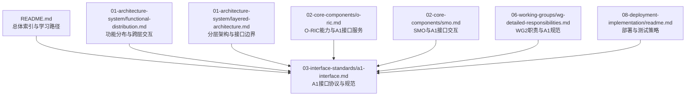
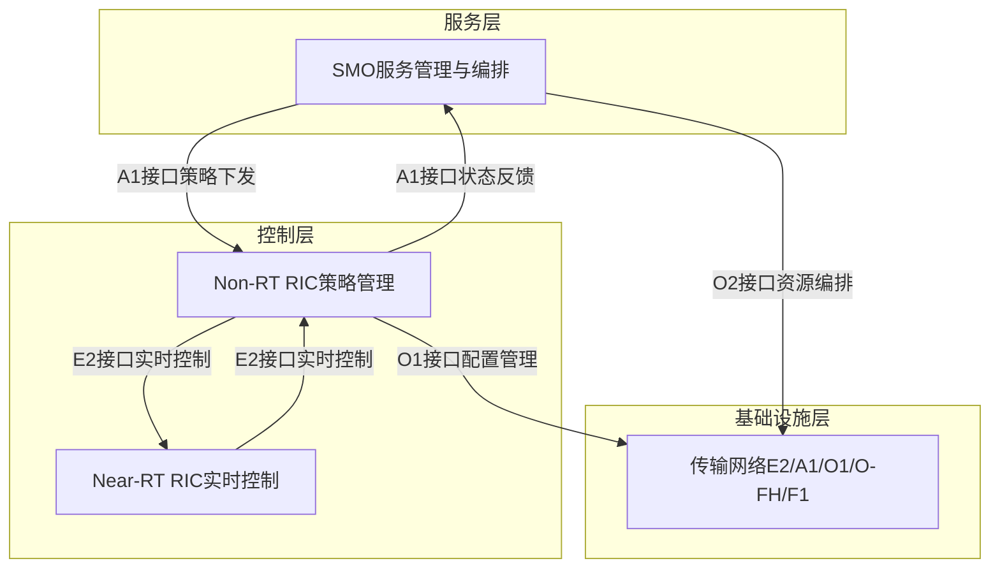
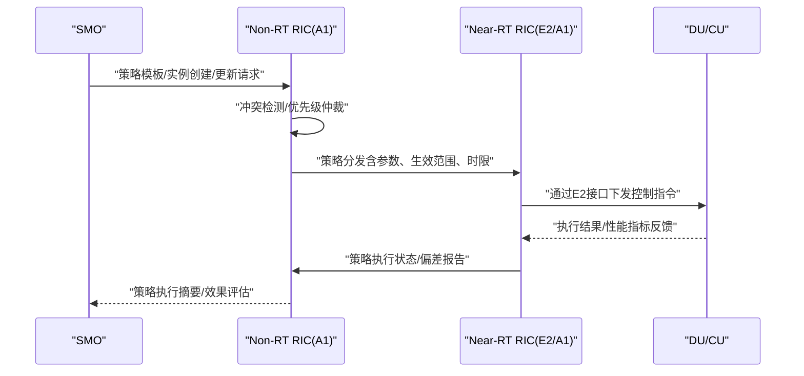
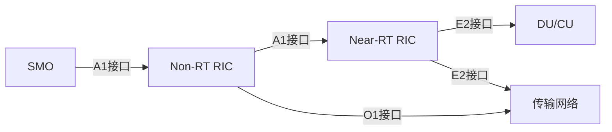

# A1接口协议

<cite>
**本文引用的文件**
- [README.md](file://README.md)
- [03-interface-standards/a1-interface.md](file://03-interface-standards/a1-interface.md)
- [01-architecture-system/functional-distribution.md](file://01-architecture-system/functional-distribution.md)
- [01-architecture-system/layered-architecture.md](file://01-architecture-system/layered-architecture.md)
- [02-core-components/o-ric.md](file://02-core-components/o-ric.md)
- [02-core-components/smo.md](file://02-core-components/smo.md)
- [06-working-groups/wg-detailed-responsibilities.md](file://06-working-groups/wg-detailed-responsibilities.md)
- [08-deployment-implementation/readme.md](file://08-deployment-implementation/readme.md)
</cite>

## 目录
1. [引言](#引言)
2. [项目结构](#项目结构)
3. [核心组件](#核心组件)
4. [架构总览](#架构总览)
5. [详细组件分析](#详细组件分析)
6. [依赖分析](#依赖分析)
7. [性能考虑](#性能考虑)
8. [故障排查指南](#故障排查指南)
9. [结论](#结论)
10. [附录](#附录)

## 引言
本文件围绕A1接口协议展开，系统阐述其在Non-RT RIC与Near-RT RIC之间的策略管理角色，覆盖策略消息格式、策略下发流程、策略执行反馈机制；并进一步扩展到策略模板定义、策略优先级管理、动态策略更新与多RIC协同工作机制。同时提供策略配置最佳实践与跨厂商互操作指导，帮助读者在生产环境中高效、稳健地落地A1接口能力。

## 项目结构
本知识库围绕O-RAN架构与接口标准组织内容，A1接口相关内容主要分布在“接口标准”、“架构系统”、“核心组件”、“工作组职责”、“部署实现”等主题下。下图给出与A1接口协议相关的主要文件与其职责映射：

**图表来源**
- [README.md](file://README.md#L17-L33)
- [03-interface-standards/a1-interface.md](file://03-interface-standards/a1-interface.md)
- [01-architecture-system/functional-distribution.md](file://01-architecture-system/functional-distribution.md#L36-L85)
- [01-architecture-system/layered-architecture.md](file://01-architecture-system/layered-architecture.md#L111-L131)
- [02-core-components/o-ric.md](file://02-core-components/o-ric.md#L47-L51)
- [02-core-components/smo.md](file://02-core-components/smo.md#L77-L77)
- [06-working-groups/wg-detailed-responsibilities.md](file://06-working-groups/wg-detailed-responsibilities.md#L56-L107)
- [08-deployment-implementation/readme.md](file://08-deployment-implementation/readme.md#L62-L92)

**章节来源**
- [README.md](file://README.md#L17-L33)
- [03-interface-standards/a1-interface.md](file://03-interface-standards/a1-interface.md)
- [01-architecture-system/functional-distribution.md](file://01-architecture-system/functional-distribution.md#L36-L85)
- [01-architecture-system/layered-architecture.md](file://01-architecture-system/layered-architecture.md#L111-L131)
- [02-core-components/o-ric.md](file://02-core-components/o-ric.md#L47-L51)
- [02-core-components/smo.md](file://02-core-components/smo.md#L77-L77)
- [06-working-groups/wg-detailed-responsibilities.md](file://06-working-groups/wg-detailed-responsibilities.md#L56-L107)
- [08-deployment-implementation/readme.md](file://08-deployment-implementation/readme.md#L62-L92)

## 核心组件
- Non-RT RIC（策略管理侧）
  - 负责策略生命周期管理（创建、修改、删除、激活）、冲突检测与解决、策略分发与状态反馈。
  - 通过A1接口与Near-RT RIC交互，承载秒级到分钟级的策略管理与网络规划职责。
- Near-RT RIC（策略执行侧）
  - 负责毫秒级实时控制闭环，执行来自Non-RT RIC的策略与优化指令，与CU/DU通过E2接口交互。
- SMO（服务编排与管理）
  - 与Non-RT RIC通过A1接口交互，负责网络服务的整体编排与策略下发；与基础设施层通过O2接口交互。
- A1接口服务
  - Non-RT RIC侧提供A1接口适配层，负责与Near-RT RIC的连接管理、消息路由与处理、状态与性能监控。

**章节来源**
- [02-core-components/o-ric.md](file://02-core-components/o-ric.md#L33-L71)
- [02-core-components/o-ric.md](file://02-core-components/o-ric.md#L47-L51)
- [02-core-components/smo.md](file://02-core-components/smo.md#L77-L77)
- [01-architecture-system/functional-distribution.md](file://01-architecture-system/functional-distribution.md#L36-L85)

## 架构总览
A1接口位于服务层与控制层之间，承担策略管理与执行的桥梁作用。下图展示A1接口在O-RAN架构中的位置与交互关系：

**图表来源**
- [01-architecture-system/functional-distribution.md](file://01-architecture-system/functional-distribution.md#L36-L85)
- [01-architecture-system/layered-architecture.md](file://01-architecture-system/layered-architecture.md#L111-L131)
- [02-core-components/o-ric.md](file://02-core-components/o-ric.md#L47-L51)
- [02-core-components/smo.md](file://02-core-components/smo.md#L77-L77)

## 详细组件分析

### 策略模板定义与管理
- 模板维度
  - 策略类型：区分覆盖优化、干扰协调、负载均衡、节能调度等场景化策略。
  - 参数化：将策略变量（如门限、权重、窗口）抽象为可配置项，便于跨区域复用。
  - 依赖关系：定义策略间的依赖与互斥关系，避免冲突。
- 生命周期
  - 创建：模板注册与版本化，绑定生效范围（区域/扇区/时段）。
  - 修改：灰度发布与回滚机制，支持在线热更新。
  - 删除：清理关联实例与依赖，确保无悬挂引用。
- 与SMO协作
  - SMO通过A1接口将服务编排意图转化为策略模板，并下发至Non-RT RIC进行实例化与执行。

**章节来源**
- [01-architecture-system/functional-distribution.md](file://01-architecture-system/functional-distribution.md#L36-L47)
- [02-core-components/smo.md](file://02-core-components/smo.md#L77-L77)

### 策略优先级与冲突检测
- 优先级模型
  - 场景优先级：URLLC类策略高于eMBB，保障关键业务SLA。
  - 区域优先级：核心区域策略优先于边缘区域，确保热点地区性能。
  - 时间优先级：节假日/高峰时段策略优先于日常策略。
- 冲突检测
  - 同一目标对象（如功率、切换参数）的策略冲突需在Non-RT RIC侧进行合并与裁决。
  - 冲突仲裁：基于权重、历史效果与SLA影响进行自动裁决，必要时触发人工介入。
- 反馈与收敛
  - Near-RT RIC周期性反馈执行偏差，Non-RT RIC据此调整后续策略参数，形成闭环。

**章节来源**
- [02-core-components/o-ric.md](file://02-core-components/o-ric.md#L33-L71)

### 动态策略更新与下发流程
- 下发流程（序列图）

**图表来源**
- [01-architecture-system/functional-distribution.md](file://01-architecture-system/functional-distribution.md#L203-L206)
- [02-core-components/o-ric.md](file://02-core-components/o-ric.md#L47-L51)

**章节来源**
- [01-architecture-system/functional-distribution.md](file://01-architecture-system/functional-distribution.md#L203-L206)
- [02-core-components/o-ric.md](file://02-core-components/o-ric.md#L47-L51)

### 策略执行反馈机制
- 反馈维度
  - 实时性：执行延迟、成功率、抖动。
  - 业务性：KPI达成率、SLA满足度、用户感知指标。
  - 资源性：功耗、CPU/内存占用、传输带宽。
- 反馈路径
  - Near-RT RIC周期性汇总执行结果，经A1接口回传Non-RT RIC。
  - Non-RT RIC聚合多区域/多实例反馈，输出策略效果评估与改进建议。
- 自适应优化
  - 基于反馈数据，Non-RT RIC动态调整策略参数或生成新策略，形成持续优化闭环。

**章节来源**
- [02-core-components/o-ric.md](file://02-core-components/o-ric.md#L33-L71)

### 多RIC协同工作机制
- 协同目标
  - 全局策略一致性：避免跨RIC策略冲突与竞态。
  - 负载均衡与故障转移：在多RIC部署场景下实现流量与任务的动态调度。
- 协同方式
  - 中心化编排：由Non-RT RIC集中生成与下发策略，Near-RT RIC执行。
  - 分布式编排：按区域自治策略，通过A1接口进行冲突消解与全局收敛。
- 一致性保障
  - 状态同步：定期交换网络状态与策略执行摘要。
  - 仲裁机制：冲突时依据预设规则进行裁决，必要时降级为保守策略。

**章节来源**
- [02-core-components/o-ric.md](file://02-core-components/o-ric.md#L67-L71)

### 策略消息格式与服务模型（概念性说明）
- 消息结构（概念）
  - 头部：消息ID、时间戳、发送方标识、目标RIC标识。
  - 载荷：策略模板ID/版本、实例参数、生效范围（区域/扇区/时段）、时限与优先级。
  - 签名与安全：完整性校验、防重放、访问控制。
- 服务模型（概念）
  - 策略注册与查询：模板注册、实例查询、状态订阅。
  - 策略分发与回执：批量下发、逐条确认、失败重试。
  - 反馈订阅：执行状态、KPI上报、异常告警。

（注：本节为概念性描述，不直接对应具体源码文件）

## 依赖分析
- 组件耦合
  - Non-RT RIC与Near-RT RIC通过A1接口强耦合，需保证协议一致性与容错能力。
  - SMO与Non-RT RIC通过A1接口耦合，需确保服务编排意图与策略执行一致。
- 外部依赖
  - 传输网络：E2/A1接口的带宽与延迟预算直接影响策略下发与反馈时效。
  - 标准与规范：遵循WG2与ETSI相关规范，确保跨厂商互操作。

**图表来源**
- [01-architecture-system/functional-distribution.md](file://01-architecture-system/functional-distribution.md#L36-L85)
- [02-core-components/o-ric.md](file://02-core-components/o-ric.md#L47-L51)

**章节来源**
- [01-architecture-system/functional-distribution.md](file://01-architecture-system/functional-distribution.md#L36-L85)
- [02-core-components/o-ric.md](file://02-core-components/o-ric.md#L47-L51)

## 性能考虑
- 延迟与吞吐
  - A1接口消息应尽量轻量化，避免大包阻塞；结合压缩与批处理提升吞吐。
- 可靠性与韧性
  - 重试与幂等：策略下发需具备重试与去重能力，避免重复执行。
  - 分片与分区：多区域/多实例策略分片下发，降低单点压力。
- 资源占用
  - 控制面与数据面分离，避免策略反馈占用过多带宽。
- 可观测性
  - 建立A1接口指标（下发时延、成功率、回执延迟），纳入统一监控体系。

（本节为通用性能建议，不直接分析具体文件）

## 故障排查指南
- 常见问题
  - A1接口断连：检查网络连通性、证书与鉴权配置、防火墙策略。
  - 策略未生效：核查策略模板参数、生效范围、优先级与冲突。
  - 反馈缺失：确认Near-RT RIC的反馈通道与上报周期配置。
- 排查步骤
  - 采集日志与指标：A1接口收发统计、传输网络时延与丢包。
  - 回放消息流：使用协议分析工具验证消息格式与序列。
  - 交叉验证：对比SMO下发意图与Non-RT RIC记录，定位偏差环节。
- 工具与流程
  - 结合部署实现中的测试与运维流程，开展端到端验证与回归测试。

**章节来源**
- [08-deployment-implementation/readme.md](file://08-deployment-implementation/readme.md#L126-L156)
- [08-deployment-implementation/readme.md](file://08-deployment-implementation/readme.md#L62-L92)

## 结论
A1接口作为Non-RT RIC与Near-RT RIC之间的策略管理桥梁，承担着策略生命周期管理、冲突仲裁、动态下发与反馈收敛的职责。通过标准化的策略模板、优先级与冲突检测机制、可靠的下发与反馈流程，以及多RIC协同与跨厂商互操作，A1接口能够支撑O-RAN网络在复杂场景下的智能化与自动化运营。建议在实践中以SMO为入口，以Non-RT RIC为核心，以Near-RT RIC为执行面，构建端到端的策略闭环。

## 附录

### A1接口协议最佳实践清单
- 策略治理
  - 模板化与版本化管理，严格变更审批与灰度发布。
  - 明确优先级与冲突规则，建立自动裁决与人工复核机制。
- 传输与安全
  - 保障A1接口带宽与延迟预算，启用端到端加密与身份认证。
  - 实施最小权限与访问控制，定期轮换密钥与证书。
- 运维与可观测性
  - 建立A1接口KPI监控与告警，配置自动故障检测与恢复。
  - 定期演练策略回滚与跨厂商互通场景，提升韧性。

**章节来源**
- [02-core-components/o-ric.md](file://02-core-components/o-ric.md#L214-L241)
- [08-deployment-implementation/readme.md](file://08-deployment-implementation/readme.md#L94-L125)

### 跨厂商互操作指导
- 标准遵循
  - 严格遵循WG2与ETSI相关规范，确保消息格式、服务模型与安全机制一致。
- 测试与验证
  - 参与Plugfest与互操作测试，覆盖多厂商组合场景。
- 文档与流程
  - 统一接口契约与测试用例，建立跨厂商问题闭环处理流程。

**章节来源**
- [06-working-groups/wg-detailed-responsibilities.md](file://06-working-groups/wg-detailed-responsibilities.md#L101-L107)
- [08-deployment-implementation/readme.md](file://08-deployment-implementation/readme.md#L81-L87)