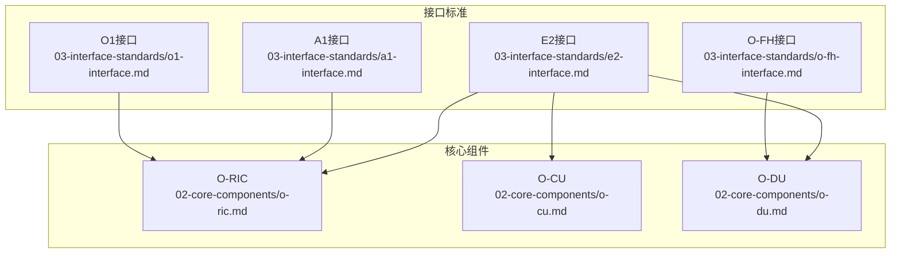
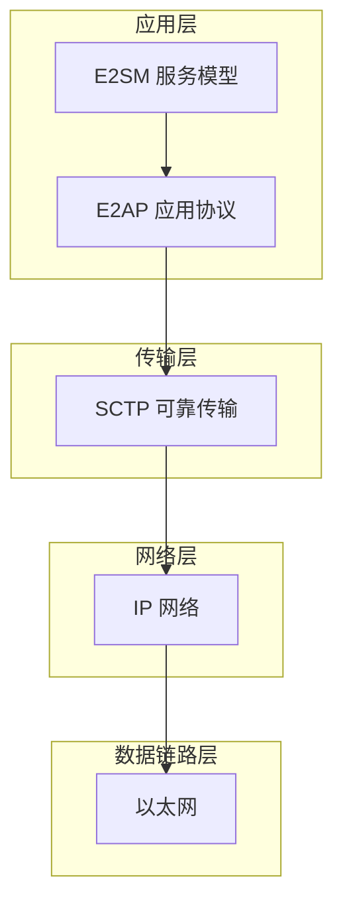
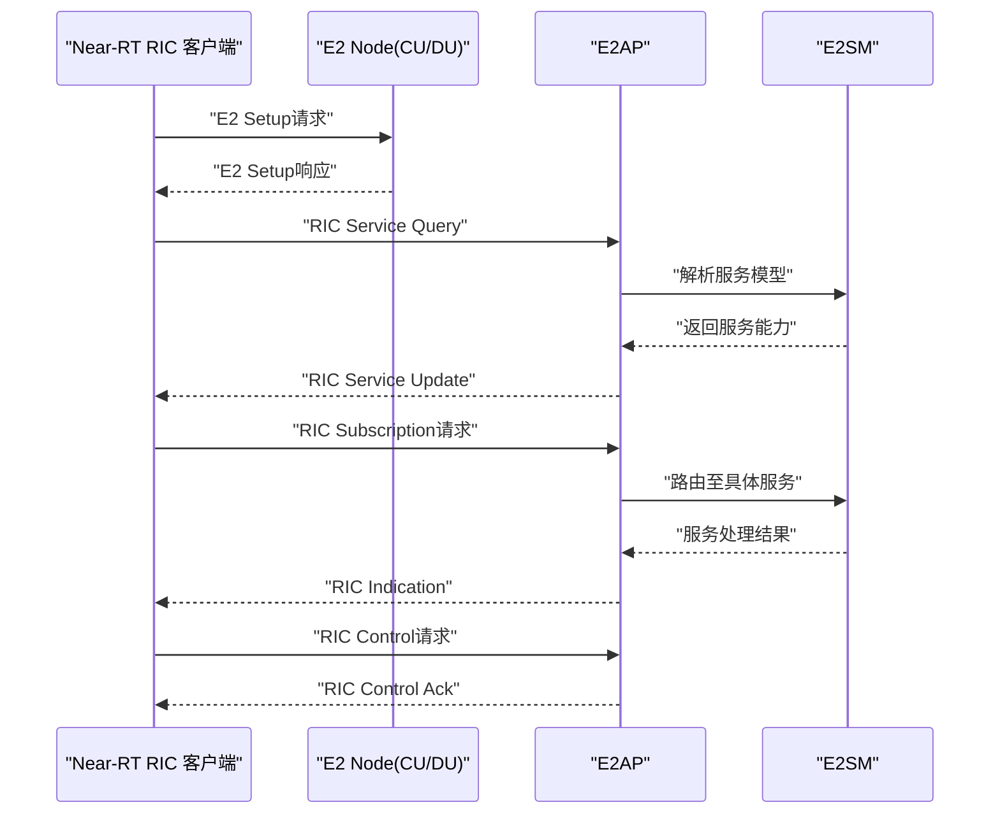
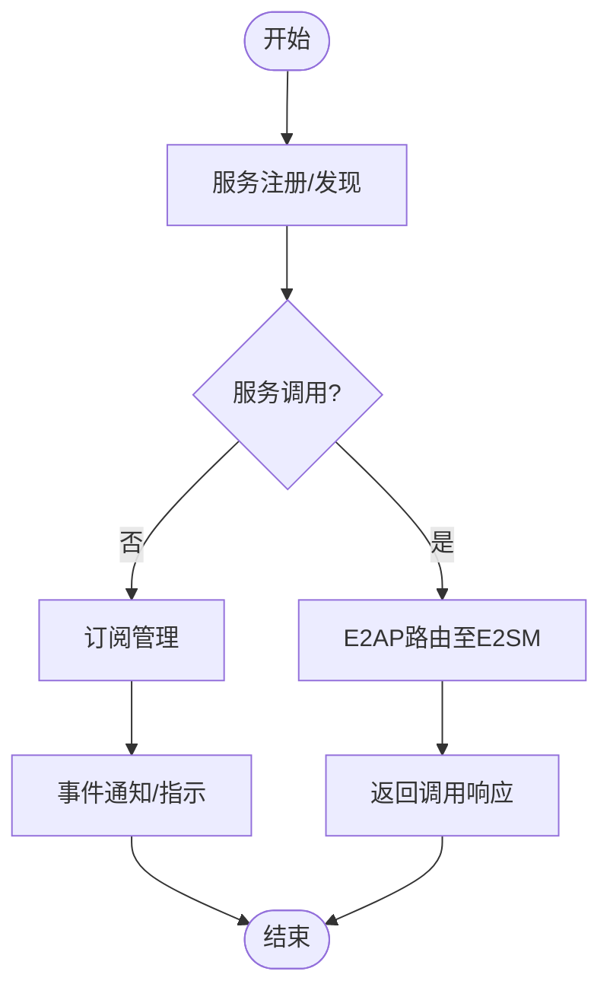
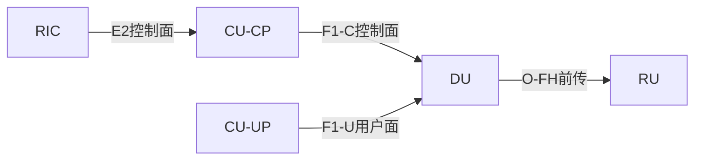
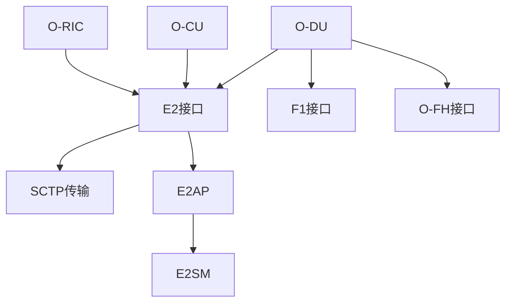

# E2接口协议

<cite>
**本文引用的文件**
- [E2接口.md](file://03-interface-standards/e2-interface.md)
- [O-RIC.md](file://02-core-components/o-ric.md)
- [O-CU.md](file://02-core-components/o-cu.md)
- [O-DU.md](file://02-core-components/o-du.md)
- [O-FH接口.md](file://03-interface-standards/o-fh-interface.md)
- [多厂商互操作测试.md](file://13-testing-validation/interoperability/interoperability-testing.md)
- [一致性测试（英文）.md](file://13-testing-validation/conformance-testing/o-ran-conformance-testing-en.md)
- [故障排查指南（英文）.md](file://14-operations-management/fault-handling/fault-troubleshooting-guide.md)
- [接口标准系统说明.md](file://03-interface-standards/readme.md)
</cite>

## 更新摘要
**所做更改**
- 修正协议栈术语：从"SCTP/STREAMS"更正为"SCTP+E2AP/E2SM"
- 修复端点角色描述：明确E2 Node与Near-RT RIC的角色定义
- 添加完整的O-RAN接口导航结构，包含所有主要接口的概览
- 增强协议栈架构描述的准确性

## 目录
1. [简介](#简介)
2. [项目结构](#项目结构)
3. [核心组件](#核心组件)
4. [架构总览](#架构总览)
5. [详细组件分析](#详细组件分析)
6. [依赖关系分析](#依赖关系分析)
7. [性能考量](#性能考量)
8. [故障排查指南](#故障排查指南)
9. [结论](#结论)
10. [附录](#附录)

## 简介
本文件围绕E2接口协议展开，系统阐述其在O-RAN架构中作为RIC与CU/DU之间服务化接口的核心作用，涵盖协议栈结构、消息类型、事件与订阅机制、服务注册与发现、以及与CU/DU控制面和用户面的交互模式。同时提供多厂商设备兼容性指导、接口配置要点与常见问题解决方案，帮助工程与运维人员在生产环境中稳定部署与高效运维。

## 项目结构
本仓库中与E2接口直接相关的内容主要分布在"接口标准"和"核心组件"两大板块：
- 接口标准：E2接口、F1接口、O-FH接口等
- 核心组件：O-RIC、O-CU、O-DU等

**图表来源**
- [E2接口.md:63-78](file://03-interface-standards/e2-interface.md#L63-L78)
- [接口标准系统说明.md:19-42](file://03-interface-standards/readme.md#L19-L42)

**章节来源**
- [E2接口.md:1-365](file://03-interface-standards/e2-interface.md#L1-L365)
- [O-RIC.md:1-437](file://02-core-components/o-ric.md#L1-L437)
- [O-CU.md:1-419](file://02-core-components/o-cu.md#L1-L419)
- [O-DU.md:1-415](file://02-core-components/o-du.md#L1-L415)
- [O-FH接口.md:1-397](file://03-interface-standards/o-fh-interface.md#L1-L397)
- [接口标准系统说明.md:1-61](file://03-interface-standards/readme.md#L1-L61)

## 核心组件
- RIC（O-RIC）：负责Near-RT与Non-RT两类智能控制，提供E2接口适配层与xApps/rApps运行环境，支撑与CU/DU的E2服务化交互。
- CU（O-CU）：集中式单元，分为CU-CP与CU-UP，承担控制面与用户面处理，并通过E1接口与DU交互；在E2场景中作为服务提供方或客户端之一。
- DU（O-DU）：分布式单元，负责物理层与MAC层处理，通过F1接口与CU交互，通过E2接口与RIC交互，承担实时性与同步要求。
- O-FH：前传接口，连接DU与RU，支撑eCPRI/RoE协议与同步，与E2共同构成DU侧的前后传完整链路。

**章节来源**
- [O-RIC.md:7-72](file://02-core-components/o-ric.md#L7-L72)
- [O-CU.md:3-61](file://02-core-components/o-cu.md#L3-L61)
- [O-DU.md:3-67](file://02-core-components/o-du.md#L3-L67)
- [O-FH接口.md:1-58](file://03-interface-standards/o-fh-interface.md#L1-L58)

## 架构总览
E2接口在O-RAN中位于RIC与CU/DU之间，采用服务化架构，基于SCTP传输承载E2AP应用协议和E2SM服务模型，向下承载IP/以太网网络层。

**图表来源**
- [E2接口.md:91-97](file://03-interface-standards/e2-interface.md#L91-L97)

**章节来源**
- [E2接口.md:91-97](file://03-interface-standards/e2-interface.md#L91-L97)

## 详细组件分析

### E2接口协议栈与消息类型
- **协议栈**：应用层（E2AP/E2SM）、传输层（SCTP）、网络层（IP）、数据链路层（以太网）。
- **端点角色**：E2 Node（CU/DU/CU-CP/CU-UP）作为服务器端提供服务，Near-RT RIC作为客户端调用服务。
- **消息类型**：初始化消息、服务注册/发现消息、服务调用/响应消息、事件通知消息、订阅管理消息、错误处理消息。

**图表来源**
- [E2接口.md:9-44](file://03-interface-standards/e2-interface.md#L9-L44)

**章节来源**
- [E2接口.md:9-117](file://03-interface-standards/e2-interface.md#L9-L117)

### RIC内部服务注册、发现与调用流程
- **E2接口适配层**：负责与E2 Node的E2通信，对接E2AP/E2SM。
- **服务模型处理**：解析E2SM定义的服务接口、消息格式与行为，支撑服务注册、发现与调用。
- **Near-RT RIC**：强调毫秒级控制闭环，对E2接口延迟与可靠性提出更高要求。
- **Non-RT RIC**：侧重策略管理与数据分析，通过A1接口与Near-RT RIC协同，间接影响E2接口策略落地。

**图表来源**
- [O-RIC.md:73-116](file://02-core-components/o-ric.md#L73-L116)
- [E2接口.md:9-44](file://03-interface-standards/e2-interface.md#L9-L44)

**章节来源**
- [O-RIC.md:73-116](file://02-core-components/o-ric.md#L73-L116)
- [E2接口.md:9-44](file://03-interface-standards/e2-interface.md#L9-L44)

### 与CU/DU的控制面与用户面交互模式
- **控制面**：DU通过F1-C与CU-CP交互，CU-CP再通过E2与RIC交互，实现策略下发与状态反馈。
- **用户面**：DU通过F1-U与CU-UP交互，CU-UP负责用户数据转发与QoS保障。
- **前传**：DU通过O-FH与RU交互，支持eCPRI/RoE协议与同步，确保低延迟与高精度。

**图表来源**
- [O-RIC.md:21-51](file://02-core-components/o-ric.md#L21-L51)
- [O-CU.md:23-60](file://02-core-components/o-cu.md#L23-L60)
- [O-DU.md:68-86](file://02-core-components/o-du.md#L68-L86)
- [O-FH接口.md:1-58](file://03-interface-standards/o-fh-interface.md#L1-L58)

**章节来源**
- [O-RIC.md:21-51](file://02-core-components/o-ric.md#L21-L51)
- [O-CU.md:23-60](file://02-core-components/o-cu.md#L23-L60)
- [O-DU.md:68-86](file://02-core-components/o-du.md#L68-L86)
- [O-FH接口.md:1-58](file://03-interface-standards/o-fh-interface.md#L1-L58)

### 多厂商设备兼容性指导
- **多厂商E2互通测试场景**：验证Near-RT RIC与不同厂商DU之间的E2连接建立、订阅管理、指示消息交换与控制命令处理。
- **一致性测试**：依据E2AP版本、ASN.1 PER编码、消息序列等标准进行协议合规性验证。
- **互操作测试方法论**：黑盒测试关注标准协议合规与功能需求，验证消息格式、时序与时延要求，确保向后兼容。

**章节来源**
- [多厂商互操作测试.md:30-56](file://13-testing-validation/interoperability/interoperability-testing.md#L30-L56)
- [一致性测试（英文）.md:26-150](file://13-testing-validation/conformance-testing/o-ran-conformance-testing-en.md#L26-L150)

### 接口配置示例与最佳实践
- **网络规划**：带宽需求、延迟要求、可靠性与QoS配置；IP地址规划、VLAN与子网划分、路由与防火墙规则。
- **部署架构**：集中式、分布式与混合部署，权衡实时性与管理效率。
- **性能优化**：SCTP参数优化、多流配置、消息压缩、批量处理、缓存机制、网络加速（如SR-IOV、DPDK）与负载均衡。
- **安全规划**：网络隔离、访问控制、加密传输、认证授权。
- **版本管理**：接口版本协商与兼容、服务模型版本控制与升级策略。

**章节来源**
- [E2接口.md:120-175](file://03-interface-standards/e2-interface.md#L120-L175)

## 依赖关系分析
- E2接口依赖SCTP可靠传输与E2AP/E2SM应用协议，向上承载服务语义。
- RIC依赖E2接口实现与E2 Node的服务化交互；E2 Node依赖E2接口实现与RIC的控制与事件交互。
- DU侧同时依赖F1接口与O-FH接口，形成前后传完整链路，E2接口在此链路中承担RIC侧控制面交互。

**图表来源**
- [E2接口.md:91-97](file://03-interface-standards/e2-interface.md#L91-L97)
- [O-RIC.md:73-116](file://02-core-components/o-ric.md#L73-L116)
- [O-CU.md:101-121](file://02-core-components/o-cu.md#L101-L121)
- [O-DU.md:68-86](file://02-core-components/o-du.md#L68-L86)

**章节来源**
- [E2接口.md:91-97](file://03-interface-standards/e2-interface.md#L91-L97)
- [O-RIC.md:73-116](file://02-core-components/o-ric.md#L73-L116)
- [O-CU.md:101-121](file://02-core-components/o-cu.md#L101-L121)
- [O-DU.md:68-86](file://02-core-components/o-du.md#L68-L86)

## 性能考量
- **传输层优化**：SCTP拥塞窗口、重传超时、多流与多路径配置。
- **应用层优化**：消息压缩、批量处理、缓存机制。
- **网络优化**：减少跳数、网络加速、负载均衡。
- **Near-RT RIC对E2接口延迟与吞吐提出更高要求**，需结合DU侧F1与O-FH的低延迟特性整体优化。

**章节来源**
- [E2接口.md:159-175](file://03-interface-standards/e2-interface.md#L159-L175)
- [O-DU.md:51-66](file://02-core-components/o-du.md#L51-L66)
- [O-FH接口.md:126-139](file://03-interface-standards/o-fh-interface.md#L126-L139)

## 故障排查指南
- **常见故障**：连接断连/重连失败、消息传输失败/解析错误、服务调用失败/不可用、性能劣化（延迟/吞吐）。
- **故障定位**：告警分析、日志分析、信令流程分析、测试验证。
- **故障恢复**：连接恢复、配置调整、服务重启、软件升级修复。
- **E2接口连接问题诊断步骤**：网络连通性验证、证书与安全校验、配置参数核验。

**章节来源**
- [E2接口.md:198-217](file://03-interface-standards/e2-interface.md#L198-L217)
- [故障排查指南（英文）.md:264-318](file://14-operations-management/fault-handling/fault-troubleshooting-guide.md#L264-L318)

## 结论
E2接口是O-RAN架构中RIC与CU/DU之间服务化通信的关键，具备服务发现、服务调用、事件通知与订阅管理等核心能力。通过SCTP+E2AP/E2SM协议栈与服务模型，E2接口支撑近实时控制闭环与智能化网络管理。在生产环境中，合理的网络规划、部署架构、性能优化与运维管理是确保E2接口稳定运行与跨厂商互操作的基础。

## 附录
- **多厂商互操作测试场景与一致性测试方法**可作为部署前验证与上线后的回归测试依据。
- **Near-RT RIC与DU侧F1/O-FH的协同优化**，是实现端到端低延迟与高可靠性的关键。
- **完整的O-RAN接口体系**包括E2、A1、O1、O2、F1、O-FH等接口，各接口协同工作实现完整的RAN解耦架构。

**章节来源**
- [多厂商互操作测试.md:30-56](file://13-testing-validation/interoperability/interoperability-testing.md#L30-L56)
- [一致性测试（英文）.md:26-150](file://13-testing-validation/conformance-testing/o-ran-conformance-testing-en.md#L26-L150)
- [接口标准系统说明.md:44-54](file://03-interface-standards/readme.md#L44-L54)