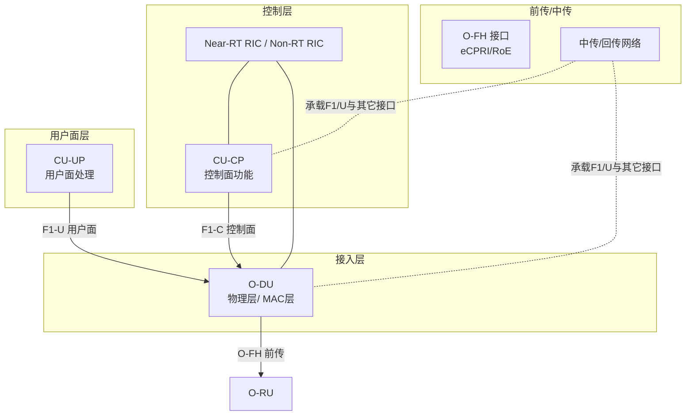
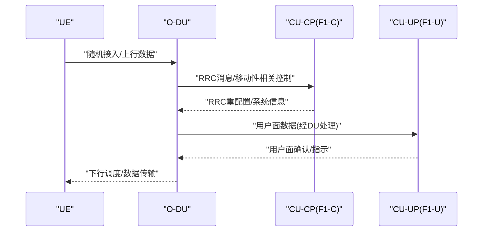
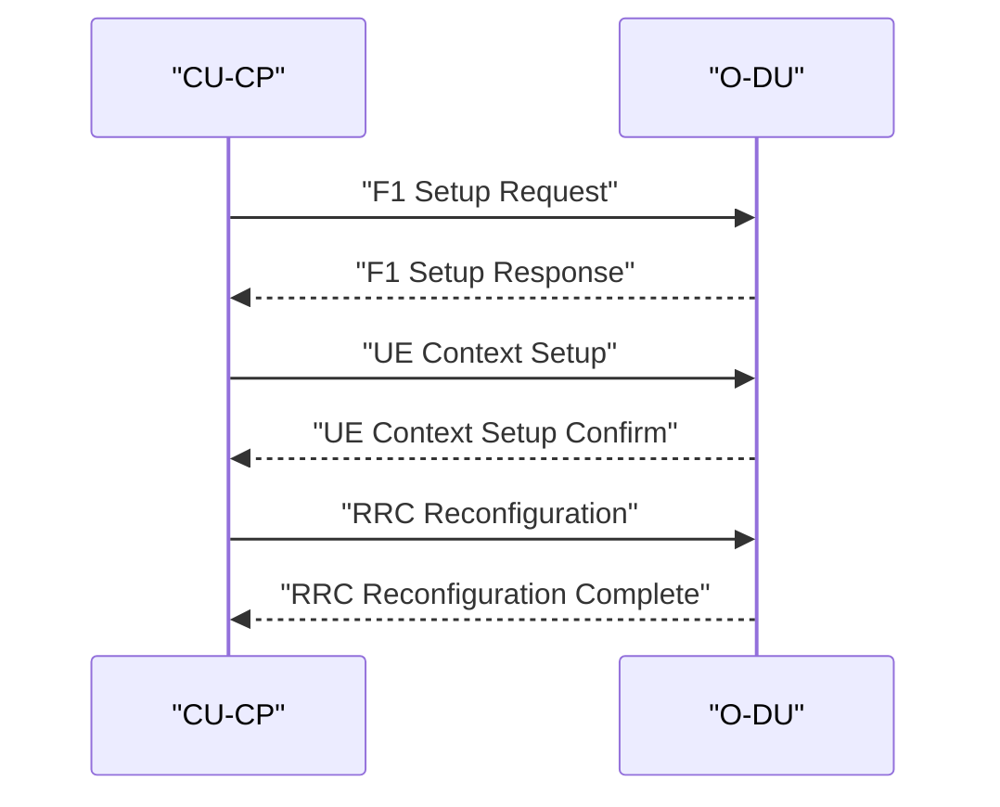
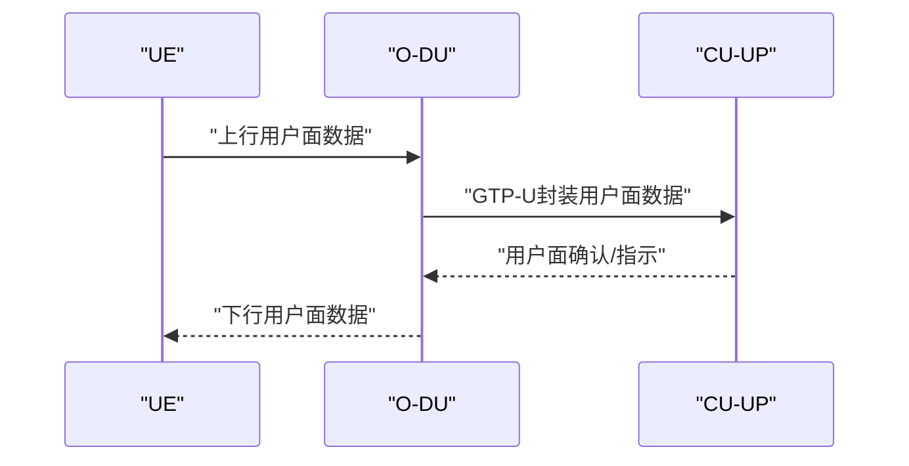
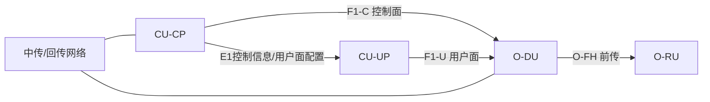

# F1接口协议

<cite>
**本文引用的文件**
- [02-core-components/o-cu.md](file://02-core-components/o-cu.md)
- [02-core-components/o-du.md](file://02-core-components/o-du.md)
- [03-interface-standards/f1-interface.md](file://03-interface-standards/f1-interface.md)
- [14-operations-management/fault-handling/fault-troubleshooting-guide.md](file://14-operations-management/fault-handling/fault-troubleshooting-guide.md)
- [14-operations-management/performance-optimization/performance-optimization-framework.md](file://14-operations-management/performance-optimization/performance-optimization-framework.md)
- [26-performance-optimization/network-optimization/network-performance-tuning.md](file://26-performance-optimization/network-optimization/network-performance-tuning.md)
- [comprehensive-oran-glossary.md](file://comprehensive-oran-glossary.md)
- [04-disaggregation-options/deployment-scenarios.md](file://04-disaggregation-options/deployment-scenarios.md)
- [01-architecture-system/functional-distribution.md](file://01-architecture-system/functional-distribution.md)
- [13-testing-validation/interoperability/interoperability-testing.md](file://13-testing-validation/interoperability/interoperability-testing.md)
</cite>

## 目录
1. [引言](#引言)
2. [项目结构](#项目结构)
3. [核心组件](#核心组件)
4. [架构总览](#架构总览)
5. [详细组件分析](#详细组件分析)
6. [依赖分析](#依赖分析)
7. [性能考虑](#性能考虑)
8. [故障排查指南](#故障排查指南)
9. [结论](#结论)
10. [附录](#附录)

## 引言
本文件围绕3GPP定义的F1接口（CU-DU控制面与用户面分离接口）进行系统化梳理，结合仓库中O-RAN架构、组件职责、部署场景与性能优化实践，阐述F1-C（控制面）与F1-U（用户面）的协议差异、消息承载格式、时序要求与性能特性，并给出无线资源管理、移动性管理、QoS控制与空口协议适配机制的实现要点，以及部署配置与性能优化指导。

## 项目结构
本仓库中与F1接口相关的内容主要分布在以下几类文档：
- 核心组件：O-CU（含CU-CP/CU-UP分离）、O-DU（物理层与MAC层处理、实时性要求）
- 接口标准：F1接口（控制面与用户面分离、协议栈要点）
- 运维与性能：故障排查、性能优化框架、网络性能调优
- 部署场景：集中式/分布式/混合部署对F1接口的影响
- 功能分布：服务层/控制层/管理层/基础设施层的职责边界与跨层交互
- 互操作性：多厂商F1接口互通测试方法

图示来源
- [02-core-components/o-cu.md](file://02-core-components/o-cu.md#L108-L116)
- [02-core-components/o-du.md](file://02-core-components/o-du.md#L68-L86)
- [03-interface-standards/f1-interface.md](file://03-interface-standards/f1-interface.md)

章节来源
- [02-core-components/o-cu.md](file://02-core-components/o-cu.md#L1-L160)
- [02-core-components/o-du.md](file://02-core-components/o-du.md#L1-L120)
- [03-interface-standards/f1-interface.md](file://03-interface-standards/f1-interface.md)

## 核心组件
- CU-CP（F1-C控制面）
  - 负责RRC层、NG接口控制面、F1接口控制面建立与维护、UE上下文管理、系统信息下发、DU间移动性管理等。
  - 与DU通过F1-C交互，基于SCTP/STREAMS承载控制面消息。
- CU-UP（F1-U用户面）
  - 负责PDCP/SDAP层功能、用户面数据转发、QoS流映射与反射QoS、负载均衡与统计计费。
  - 与DU通过F1-U交互，基于GTP-U承载用户面数据。
- O-DU（F1接口接入侧）
  - 负责物理层处理、MAC层控制与数据处理、实时性要求与接口功能（F1与O-FH）。
  - F1接口支持控制面与用户面分离，承载RRC消息、MAC控制消息与用户数据。

章节来源
- [02-core-components/o-cu.md](file://02-core-components/o-cu.md#L23-L60)
- [02-core-components/o-cu.md](file://02-core-components/o-cu.md#L108-L116)
- [02-core-components/o-du.md](file://02-core-components/o-du.md#L68-L86)

## 架构总览
F1接口贯穿控制面与用户面两条路径，分别对应F1-C与F1-U：
- F1-C（控制面）：承载RRC、NAS、移动性管理、系统信息、UE上下文等控制消息；基于SCTP/STREAMS。
- F1-U（用户面）：承载PDCP/SDAP用户数据、QoS流映射、端到端QoS保障；基于GTP-U。

图示来源
- [02-core-components/o-cu.md](file://02-core-components/o-cu.md#L23-L60)
- [02-core-components/o-du.md](file://02-core-components/o-du.md#L68-L86)

## 详细组件分析

### F1-C（控制面）协议与消息承载
- 协议栈与承载
  - 基于SCTP/STREAMS，支持多流传输与可靠传输，满足控制面的高可靠与有序性要求。
- 关键消息与流程
  - F1 Setup：建立F1-C连接、协商能力与参数。
  - UE Context：在CU与DU之间同步UE上下文，支撑RRC重配与移动性。
  - RRC消息：系统信息广播、RRC重配置、寻呼等。
  - 移动性管理：DU内部/跨DU切换、Xn接口交互触发的控制面动作。
- 时序与可靠性
  - 控制面消息要求低时延与高可靠性，SCTP提供有序交付与重传保障。
  - F1-C时延应满足端到端控制时延约束，配合DU的实时性要求（如<1ms物理层处理延迟）。

图示来源
- [02-core-components/o-cu.md](file://02-core-components/o-cu.md#L23-L29)
- [02-core-components/o-du.md](file://02-core-components/o-du.md#L68-L75)

章节来源
- [02-core-components/o-cu.md](file://02-core-components/o-cu.md#L23-L29)
- [02-core-components/o-du.md](file://02-core-components/o-du.md#L68-L75)

### F1-U（用户面）协议与承载
- 协议栈与承载
  - 基于GTP-U，承载PDCP/SDAP用户数据，支持QoS流映射与端到端QoS。
- 关键功能
  - 用户面数据转发：在DU与CU-UP之间转发用户数据，支持切换过程中的数据转发。
  - QoS控制：基于5QI/ARP等参数，实现差异化QoS保障。
  - 负载均衡：在多CU-UP实例间均衡用户面流量。
- 时序与性能
  - 用户面时延需满足业务SLA（如URLLC<1ms），结合DU的物理层与MAC层处理延迟要求。
  - GTP-U路径的带宽与丢包率直接影响用户体验与QoS达成。

图示来源
- [02-core-components/o-cu.md](file://02-core-components/o-cu.md#L29-L47)
- [02-core-components/o-du.md](file://02-core-components/o-du.md#L68-L75)

章节来源
- [02-core-components/o-cu.md](file://02-core-components/o-cu.md#L29-L47)

### 无线资源管理与移动性管理
- 无线资源管理（RRM）
  - RRC层负责系统信息广播、RRC重配置、UE能力协商；DU侧负责物理层/ MAC层调度与HARQ。
  - F1-C承载RRC消息，F1-U承载用户面数据，二者协同实现端到端资源调度与QoS保障。
- 移动性管理
  - DU内部/跨DU切换：通过F1-C下发移动性相关控制，DU侧执行切换执行与数据转发。
  - 与Xn接口协作：DU间移动性触发时，通过F1-C协调上下文与资源迁移。

章节来源
- [02-core-components/o-cu.md](file://02-core-components/o-cu.md#L9-L19)
- [02-core-components/o-du.md](file://02-core-components/o-du.md#L31-L50)

### QoS控制与空口协议适配
- QoS控制
  - SDAP层将QoS流映射到DRB，反射QoS模型与5QI参数，确保端到端QoS。
  - CU-UP与DU侧均需支持QoS参数的下发与执行，F1-U承载QoS相关的用户面数据。
- 空口协议适配
  - PDCP层提供加密/完整性保护、ROHC压缩、重排序与重复检测，适配不同业务的时延与可靠性需求。

章节来源
- [02-core-components/o-cu.md](file://02-core-components/o-cu.md#L31-L47)

### 时序要求与性能特性
- 实时性要求
  - DU侧物理层/ MAC层处理延迟通常要求<1ms；端到端控制面时延应满足F1-C控制面的低时延约束。
- 吞吐与可靠性
  - F1-U用户面吞吐需满足业务带宽需求，丢包率与抖动需控制在业务SLA范围内。
- 同步与抖动控制
  - 时间同步精度（如PTP）影响空口性能；队列管理与流量整形有助于抖动控制。

章节来源
- [02-core-components/o-du.md](file://02-core-components/o-du.md#L51-L67)
- [26-performance-optimization/network-optimization/network-performance-tuning.md](file://26-performance-optimization/network-optimization/network-performance-tuning.md#L45-L61)

## 依赖分析
- 组件耦合与协作
  - CU-CP与CU-UP通过E1接口解耦，F1-C/F1-U分别承担控制面与用户面，降低耦合度。
  - DU与CU通过F1接口解耦，支持集中式/分布式/混合部署。
- 外部依赖与集成点
  - F1接口依赖中传/回传网络承载（SCTP/STREAMS与GTP-U），需满足带宽、时延与可靠性。
  - 与O-FH接口（前传）协同，确保前传时延与同步满足DU实时性要求。

图示来源
- [02-core-components/o-cu.md](file://02-core-components/o-cu.md#L49-L60)
- [02-core-components/o-du.md](file://02-core-components/o-du.md#L68-L86)

章节来源
- [02-core-components/o-cu.md](file://02-core-components/o-cu.md#L49-L60)
- [02-core-components/o-du.md](file://02-core-components/o-du.md#L68-L86)

## 性能考虑
- 网络层优化
  - 接口优先级与队列：为F1接口端口设置优先级队列，确保控制面与用户面区分调度。
  - MTU与环回：Jumbo帧与中断合并参数优化，降低CPU占用与提升吞吐。
  - NUMA亲和与中断绑定：将F1接口中断绑定至特定CPU核，减少跨NUMA访问。
- 计算层优化
  - 进程亲和与调度：为CU-CP/CU-UP/O-DU进程设置CPU亲和与优先级，降低调度抖动。
  - 内核调度器参数：调整调度策略以满足低延迟需求。
- 应用层优化
  - 容器资源：为O-RAN组件设置requests/limits，启用Go垃圾回收参数优化。
  - 监控与仪表盘：建立F1接口延迟直方图与吞吐监控，辅助性能分析。
- 无线与传输优化
  - QoS参数：DRB配置、调度策略、缓冲区管理与优先级映射，降低时延与抖动。
  - 负载均衡：移动性参数与资源分配策略，提升用户分布均匀性与资源利用率。

章节来源
- [14-operations-management/performance-optimization/performance-optimization-framework.md](file://14-operations-management/performance-optimization/performance-optimization-framework.md#L8-L100)
- [14-operations-management/performance-optimization/performance-optimization-framework.md](file://14-operations-management/performance-optimization/performance-optimization-framework.md#L103-L234)
- [14-operations-management/performance-optimization/performance-optimization-framework.md](file://14-operations-management/performance-optimization/performance-optimization-framework.md#L236-L376)
- [26-performance-optimization/network-optimization/network-performance-tuning.md](file://26-performance-optimization/network-optimization/network-performance-tuning.md#L45-L83)

## 故障排查指南
- 典型症状
  - F1接口高时延（>5ms）、用户面丢包（>0.1%）、吞吐不足、UE附着/切换失败、特定业务类别的QoS退化。
- 排查步骤
  - 性能指标采集：监控F1接口统计、网卡计数器、应用级指标。
  - 网络层面：检查接口优先级队列、中断合并、MTU与NUMA绑定。
  - 计算层面：确认进程CPU亲和、内核调度参数、内存与HugePages配置。
  - 应用与协议：核查SCTP/STREAMS与GTP-U参数、证书与安全配置、超时与重试策略。
- 处理建议
  - 重启相关服务与重新加载证书配置。
  - 调整时延敏感场景的超时与队列参数。
  - 结合监控仪表盘定位瓶颈（CPU/内存/网络/磁盘）。

章节来源
- [14-operations-management/fault-handling/fault-troubleshooting-guide.md](file://14-operations-management/fault-handling/fault-troubleshooting-guide.md#L346-L371)

## 结论
F1接口作为3GPP定义的CU-DU分离关键接口，通过F1-C（控制面）与F1-U（用户面）实现控制与数据的解耦，支撑O-RAN架构的灵活部署与性能优化。结合SCTP/STREAMS与GTP-U承载，F1接口在时延、吞吐与可靠性方面需与DU的实时性要求、网络拓扑与QoS策略协同优化。通过标准化的部署场景与运维实践，可有效提升F1接口的稳定性与性能表现。

## 附录
- 术语与缩写
  - F1-C：控制面（基于SCTP/STREAMS）
  - F1-U：用户面（基于GTP-U）
  - CU-CP：集中单元控制面
  - CU-UP：集中单元用户面
  - O-DU：分布式单元
  - O-RU：远端单元
  - RIC：RAN智能控制器
  - DU/BU：分布式单元/基带单元
- 相关接口与场景
  - E2接口（服务化）、A1接口（策略管理）、O1接口（管理）、O-FH接口（前传）
  - 集中式/分布式/混合部署场景对F1接口时延与带宽的影响

章节来源
- [comprehensive-oran-glossary.md](file://comprehensive-oran-glossary.md#L160-L168)
- [04-disaggregation-options/deployment-scenarios.md](file://04-disaggregation-options/deployment-scenarios.md#L296-L365)
- [01-architecture-system/functional-distribution.md](file://01-architecture-system/functional-distribution.md#L197-L222)