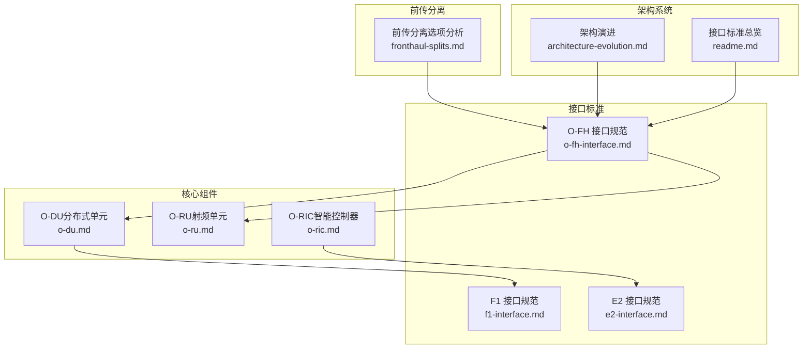
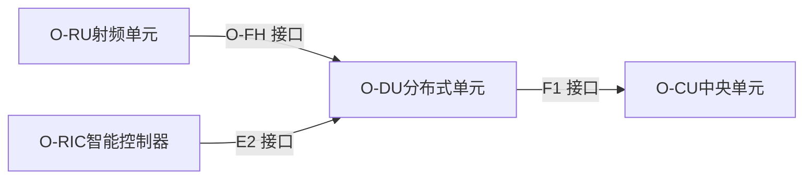
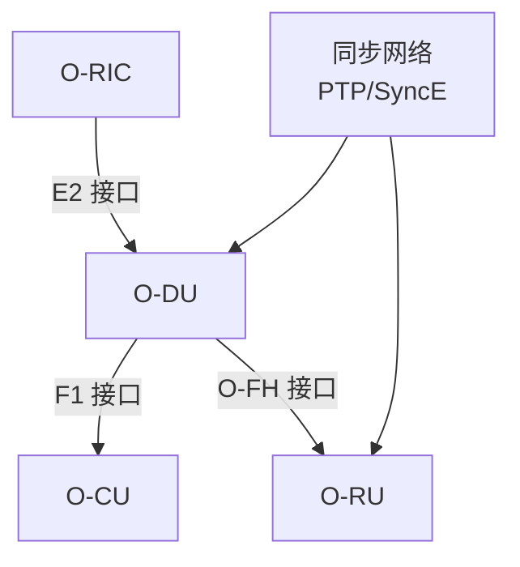

# O-FH接口协议

<cite>
**本文引用的文件**
- [开放前传接口 (O-FH)](file://03-interface-standards/o-fh-interface.md)
- [前传分离选项分析](file://04-disaggregation-options/fronthaul-splits.md)
- [分布式单元 (O-DU)](file://02-core-components/o-du.md)
- [架构演进](file://01-architecture-system/architecture-evolution.md)
- [接口标准总览](file://01-architecture-system/readme.md)
- [边缘计算场景案例](file://02-core-components/o-du.md)
</cite>

## 目录
1. [引言](#引言)
2. [项目结构](#项目结构)
3. [核心组件](#核心组件)
4. [架构概览](#架构概览)
5. [详细组件分析](#详细组件分析)
6. [依赖关系分析](#依赖关系分析)
7. [性能考量](#性能考量)
8. [故障排查指南](#故障排查指南)
9. [结论](#结论)
10. [附录](#附录)

## 引言
本文件围绕开放前传接口（O-FH）协议进行全面阐述，重点说明其在DU与RU之间的标准化前传通信中的核心价值，涵盖物理层映射、数据包格式、时钟同步机制与同步要求，并对CPRI、eCPRI等前传协议进行对比分析，给出带宽分配、延迟控制与可靠性保障的工程实践建议，以及前传网络规划与设备兼容性指导。

## 项目结构
O-FH相关内容分布在“接口标准”、“前传分离”、“核心组件”、“架构系统”等多个主题文档中，形成从协议规范到部署运维的完整知识体系。

图表来源
- [开放前传接口 (O-FH)](file://03-interface-standards/o-fh-interface.md#L1-L397)
- [前传分离选项分析](file://04-disaggregation-options/fronthaul-splits.md#L1-L461)
- [分布式单元 (O-DU)](file://02-core-components/o-du.md#L1-L415)
- [架构演进](file://01-architecture-system/architecture-evolution.md#L1-L140)
- [接口标准总览](file://01-architecture-system/readme.md#L15-L34)

章节来源
- [开放前传接口 (O-FH)](file://03-interface-standards/o-fh-interface.md#L1-L397)
- [前传分离选项分析](file://04-disaggregation-options/fronthaul-splits.md#L1-L461)
- [分布式单元 (O-DU)](file://02-core-components/o-du.md#L1-L415)
- [架构演进](file://01-architecture-system/architecture-evolution.md#L1-L140)
- [接口标准总览](file://01-architecture-system/readme.md#L15-L34)

## 核心组件
- O-FH接口概述与功能
  - O-FH是O-RAN联盟定义的标准化前传接口，连接O-DU与O-RU，支持eCPRI与RoE协议，实现DU与RU之间的标准化通信。
  - 核心功能包括用户平面（数字基带数据传输、IQ数据处理、采样率转换）、控制平面（RU配置管理、状态监控、故障管理、同步管理、操作维护）与同步功能（时间同步、频率同步、同步保护）。
- 协议栈与消息
  - eCPRI/RoE协议栈：应用层为eCPRI/RoE，传输层为以太网，数据链路层为以太网MAC，物理层为以太网PHY。
  - 同步协议栈：PTP应用层，UDP/IPv4/IPv6传输层，IP网络层，以太网MAC数据链路层，以太网PHY物理层。
  - 接口消息：用户平面消息（IQ数据帧、控制和管理消息）、控制平面消息（配置、状态、故障、同步消息）、同步消息（PTP同步消息、SyncE消息）。
- 接口流程
  - 初始化流程：物理连接建立、链路协商、协议版本协商、能力交换。
  - 正常运行流程：同步建立、数据传输、状态监控、故障处理。
  - 维护流程：软件升级、诊断测试、配置更新。

章节来源
- [开放前传接口 (O-FH)](file://03-interface-standards/o-fh-interface.md#L3-L116)

## 架构概览
O-FH在O-RAN架构中的定位与职责：
- 作为DU与RU之间的标准化前传接口，O-FH承载数字基带数据、控制信息与同步信号，支撑eMBB、URLLC、mMTC等多样化业务场景。
- 与F1接口（DU与CU之间）和E2接口（RIC与CU/DU之间）共同构成O-RAN的接口体系，实现控制面与用户面分离、云化与智能化。

图表来源
- [接口标准总览](file://01-architecture-system/readme.md#L15-L34)
- [架构演进](file://01-architecture-system/architecture-evolution.md#L42-L60)

章节来源
- [接口标准总览](file://01-architecture-system/readme.md#L15-L34)
- [架构演进](file://01-architecture-system/architecture-evolution.md#L42-L60)

## 详细组件分析

### O-FH用户平面与IQ数据处理
- 数字基带数据传输
  - 下行：DU向RU传输下行数字基带数据；上行：RU向DU传输上行数字基带数据。
  - 数据压缩：支持数据压缩以降低传输带宽需求。
- IQ数据处理
  - IQ数据格式定义与速率适配：依据带宽与天线配置调整数据速率。
  - IQ数据对齐：确保上下行IQ数据的时间对齐。
- 采样率转换
  - 支持不同采样率之间的转换，确保数据采样精度与质量。

章节来源
- [开放前传接口 (O-FH)](file://03-interface-standards/o-fh-interface.md#L9-L24)

### O-FH控制平面与同步管理
- RU控制与管理
  - RU配置管理、状态监控、故障管理。
- 同步管理
  - 时间同步：通过IEEE 1588 PTP实现高精度时间同步，支持边界时钟（BC）与透明时钟（TC）模式。
  - 频率同步：通过同步以太网（SyncE）实现频率同步，作为时间同步的备份机制。
  - 同步状态监控：监控同步质量与状态。
- 操作维护
  - 软件升级、诊断测试、性能监控。

章节来源
- [开放前传接口 (O-FH)](file://03-interface-standards/o-fh-interface.md#L25-L41)

### O-FH协议栈与消息格式
- 协议栈
  - eCPRI/RoE：应用层为eCPRI/RoE，传输层为以太网，数据链路层为以太网MAC，物理层为以太网PHY。
  - 同步协议栈：PTP应用层，UDP/IPv4/IPv6传输层，IP网络层，以太网MAC数据链路层，以太网PHY物理层。
- 接口消息
  - 用户平面消息：IQ数据帧、控制和管理消息。
  - 控制平面消息：配置消息、状态消息、故障消息、同步消息。
  - 同步消息：PTP同步消息、SyncE消息。

章节来源
- [开放前传接口 (O-FH)](file://03-interface-standards/o-fh-interface.md#L61-L97)

### O-FH接口流程
- 初始化流程：物理连接建立、链路协商、协议版本协商、能力交换。
- 正常运行流程：同步建立、数据传输、状态监控、故障处理。
- 维护流程：软件升级、诊断测试、配置更新。

章节来源
- [开放前传接口 (O-FH)](file://03-interface-standards/o-fh-interface.md#L98-L116)

### CPRI、eCPRI与RoE对比分析
- 传统CPRI
  - 传输内容：IQ数据；带宽需求极高（数百Gbps）；延迟要求严格（<100μs）；同步精度要求高（<100ns）；传输介质通常为光纤。
- eCPRI
  - 传输内容：压缩后的IQ数据或处理后的基带数据；带宽需求高（数十Gbps）；延迟要求较严格（<200μs）；同步精度要求高（<100ns）；传输介质通常为光纤。
- RoE
  - 传输内容：更高级别的基带数据或控制信息；带宽需求中等（数Gbps）；延迟要求适中（<500μs）；同步精度要求中等（<1μs）；传输介质可使用以太网。
- 带宽计算示例
  - 传统CPRI（64T64R，100MHz带宽）：约300Gbps；
  - eCPRI（64T64R，100MHz带宽，压缩比3:1）：约100Gbps；
  - RoE（64T64R，100MHz带宽，高级处理）：约10Gbps。

章节来源
- [前传分离选项分析](file://04-disaggregation-options/fronthaul-splits.md#L17-L87)

### 前传网络规划与设备兼容性
- 带宽需求计算
  - 根据天线数量、带宽、调制方式计算带宽需求；考虑数据压缩对带宽的影响；预留足够的带宽冗余，应对流量峰值。
- 延迟要求
  - 确保O-FH接口延迟满足业务需求，尤其是URLLC业务；优化传输路径，减少延迟；考虑同步精度对延迟的影响。
- 可靠性设计
  - 实现传输路径冗余，避免单点故障；配置链路聚合，提高带宽与可靠性；部署备用RU，实现设备级冗余。
- QoS配置
  - 为不同类型的流量配置不同的QoS等级；确保同步流量与控制流量的优先传输；避免用户平面流量拥塞影响控制与同步流量。
- 传输技术选择
  - 光纤传输：首选方案，支持高带宽、低延迟传输；支持不同速率（10G/25G/100G以太网）；考虑光纤类型（单模/多模）。
  - 无线传输：备选方案，适用于光纤难以到达的场景；支持毫米波或微波传输；考虑天气与环境对传输质量的影响。
  - 混合传输：结合光纤与无线传输，提高可靠性；主备传输路径设计，确保业务连续性。
- 同步规划
  - 同步架构设计：选择合适的同步架构（主从同步或分层同步）；部署高精度时间同步服务器；实现同步源冗余，提高可靠性。
  - 同步协议选择：主同步协议为IEEE 1588 PTP v2；备份同步协议为同步以太网（SyncE）；考虑GPS作为外部同步源。
  - 同步精度要求：时间同步精度小于100ns；频率同步精度小于10ppb；同步稳定性需长时间保持同步精度。
  - 同步测试：测试同步精度是否满足要求；验证同步稳定性；测试同步故障恢复能力。
- 硬件选型
  - O-DU硬件：支持高速以太网接口（10G/25G/100G）、支持IEEE 1588 PTP同步、支持eCPRI与RoE协议、具备足够处理能力支持IQ数据处理。
  - O-RU硬件：支持高速以太网接口（10G/25G/100G）、支持IEEE 1588 PTP同步、支持eCPRI与RoE协议、具备足够处理能力支持数字前端处理。
  - 传输设备：支持高速以太网（10G/25G/100G）、支持IEEE 1588 PTP透传、支持同步以太网（SyncE）、低延迟设计，减少传输延迟。
- 设备兼容性
  - 确保DU与RU设备支持标准协议（eCPRI/RoE）；验证多厂商互操作性；考虑协议演进路径。

章节来源
- [开放前传接口 (O-FH)](file://03-interface-standards/o-fh-interface.md#L117-L198)
- [前传分离选项分析](file://04-disaggregation-options/fronthaul-splits.md#L155-L234)

### O-FH运维管理与最佳实践
- 监控与告警
  - 接口状态监控：连接状态、带宽利用率、延迟、误码率。
  - RU状态监控：运行状态、温度、功率、同步状态。
  - 故障告警：连接故障、同步故障、性能劣化、硬件故障。
  - 告警处理：告警分级、告警关联、告警抑制、告警自动化。
- 配置管理
  - 接口配置：带宽配置、协议配置、同步配置、QoS配置。
  - RU配置：小区参数、天线参数、功率参数、同步参数。
  - 配置变更：变更管理、变更验证、变更回滚、配置备份。
- 故障处理
  - 常见故障：连接故障、同步故障、性能故障、硬件故障。
  - 故障定位：告警分析、日志分析、接口测试、同步测试。
  - 故障恢复：网络故障修复、同步故障修复、硬件故障更换、配置错误修正。
- 性能优化
  - 带宽优化：启用数据压缩、优化IQ数据格式、合理规划天线配置。
  - 延迟优化：优化传输路径、配置低延迟队列、调整PTP参数。
  - 同步优化：部署高精度时间同步服务器、优化PTP配置参数、实现同步源冗余。
  - 容量规划：根据业务增长趋势预测带宽需求、提前规划容量扩展、实施负载均衡。
- 最佳实践
  - 部署最佳实践：采用分层网络架构、实现传输路径冗余、部署高速传输设备。
  - 运维最佳实践：建立全面的O-FH接口监控体系、标准化故障处理流程、持续性能优化。
  - 安全最佳实践：网络分段、严格防火墙规则、加密控制平面消息、定期安全评估与渗透测试。

章节来源
- [开放前传接口 (O-FH)](file://03-interface-standards/o-fh-interface.md#L199-L346)

### 案例研究：O-FH在大型体育场中的部署
- 背景：某大型体育场部署5G网络，使用O-RAN架构，O-FH接口用于连接O-DU与O-RU，需支持高密度用户接入与高带宽业务，同时确保低延迟与高可靠性。
- 挑战：高密度场景、高带宽需求、低延迟要求、高精度同步、高可靠性要求。
- 解决方案：采用25G以太网作为O-FH接口传输介质、实现传输路径冗余与链路聚合、部署高精度时间同步服务器、在体育场内均匀部署多个RU、部署备用RU、建立全面的O-FH接口监控系统、实现智能告警与自动化故障处理流程。
- 成果：覆盖率达99.9%以上、支持10万+用户同时接入、接口延迟降至100μs以下、接口可用性达到99.999%、用户体验显著提升。

章节来源
- [开放前传接口 (O-FH)](file://03-interface-standards/o-fh-interface.md#L347-L390)

## 依赖关系分析
- O-FH与DU/RU的关系
  - O-FH承载DU与RU之间的数字基带数据、控制信息与同步信号，是DU与RU之间通信的桥梁。
- O-FH与F1/E2的关系
  - F1接口连接DU与CU，E2接口连接RIC与CU/DU，三者共同构成O-RAN的接口体系。
- 同步依赖
  - O-FH依赖PTP与SyncE实现高精度时间与频率同步，同步质量直接影响数据传输与业务性能。

图表来源
- [接口标准总览](file://01-architecture-system/readme.md#L15-L34)
- [架构演进](file://01-architecture-system/architecture-evolution.md#L42-L60)
- [开放前传接口 (O-FH)](file://03-interface-standards/o-fh-interface.md#L32-L57)

章节来源
- [接口标准总览](file://01-architecture-system/readme.md#L15-L34)
- [架构演进](file://01-architecture-system/architecture-evolution.md#L42-L60)
- [开放前传接口 (O-FH)](file://03-interface-standards/o-fh-interface.md#L32-L57)

## 性能考量
- 带宽与延迟预算
  - 前传延迟通常占端到端延迟的10%-20%；URLLC场景下前传延迟预算应小于200μs；eMBB场景下小于1ms；mMTC场景下小于2ms。
- 同步精度
  - 时间同步精度要求小于100ns；频率同步精度要求小于10ppb；需部署高精度时间同步网络并实现同步源冗余。
- 传输优化
  - 使用链路聚合提高带宽与可靠性；优化路由减少传输跳数；配置合适的MTU与缓冲区大小；调整eCPRI压缩参数与以太网帧大小；配置合适的流控制参数。
- 资源优化
  - 合理分配网络资源；实施流量调度优先处理关键业务；监控与管理网络拥塞。

章节来源
- [前传分离选项分析](file://04-disaggregation-options/fronthaul-splits.md#L93-L135)
- [前传分离选项分析](file://04-disaggregation-options/fronthaul-splits.md#L336-L351)

## 故障排查指南
- 常见故障类型
  - 连接故障：接口连接断开或不稳定，可能由光纤故障、接口故障等原因引起。
  - 同步故障：时间或频率同步丢失，可能由同步源故障、配置错误等原因引起。
  - 性能故障：接口性能下降，如延迟增加、误码率升高等。
  - 硬件故障：RU硬件故障，如功率放大器故障、天线故障等。
- 故障定位方法
  - 告警分析：根据告警信息初步定位故障范围。
  - 日志分析：分析DU与RU的日志，查找故障原因。
  - 接口测试：使用ping、traceroute等工具测试接口连通性。
  - 同步测试：使用同步测试工具测试同步精度与状态。
- 故障恢复策略
  - 网络故障：修复光纤故障、传输设备故障等。
  - 同步故障：修复同步源故障、调整同步配置等。
  - 硬件故障：更换故障硬件、重启故障设备等。
  - 配置错误：修正配置错误、恢复默认配置等。

章节来源
- [开放前传接口 (O-FH)](file://03-interface-standards/o-fh-interface.md#L247-L266)

## 结论
O-FH接口作为O-RAN架构中的标准化前传接口，实现了DU与RU之间的高效、低延迟、高精度同步通信。通过eCPRI与RoE协议的支持，O-FH在不同业务场景与部署环境下提供了灵活的带宽与延迟平衡方案。结合严格的网络规划、传输技术选择、同步规划与硬件选型，以及完善的监控、配置与故障处理流程，可有效保障O-FH接口的稳定性与可靠性，满足5G网络对前传接口的高带宽、低延迟与高精度同步要求。

## 附录
- O-DU在边缘计算场景中的部署案例展示了如何在工业控制等URLLC场景下，通过分布式部署、确定性网络与低延迟调度算法，实现端到端延迟低于0.5ms、可靠性达99.999%的目标。

章节来源
- [边缘计算场景案例](file://02-core-components/o-du.md#L370-L410)