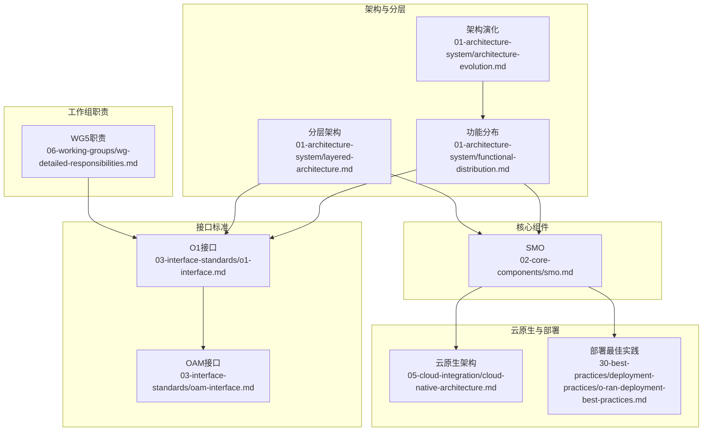
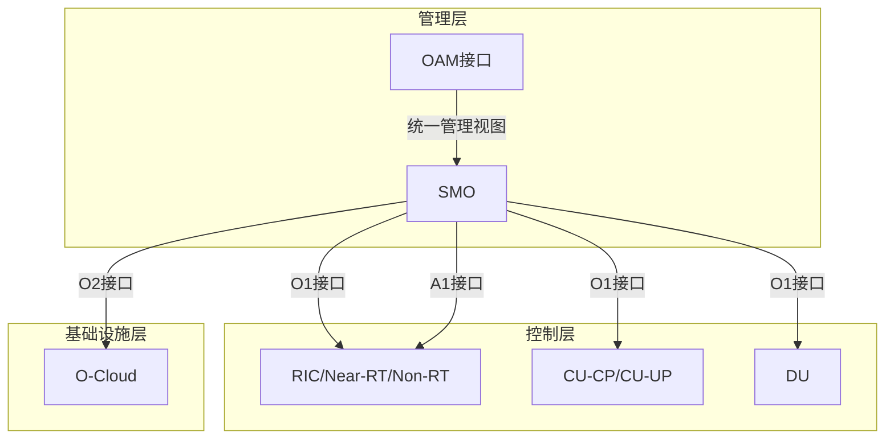
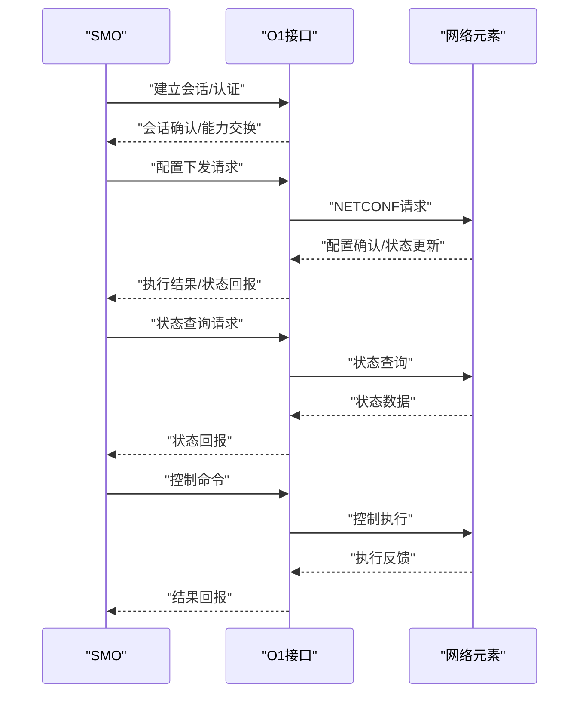
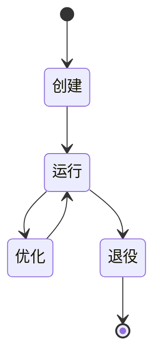
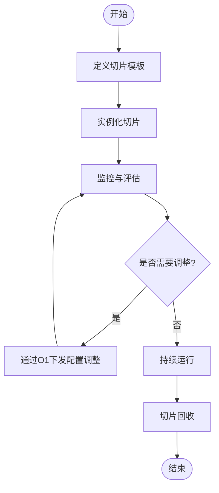
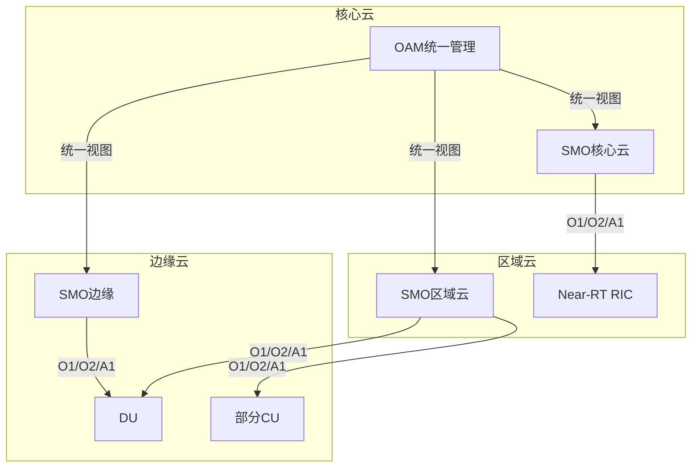
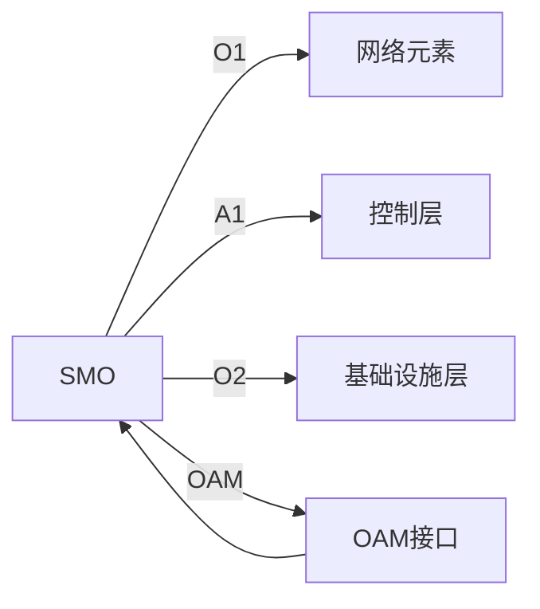

# O1接口协议

<cite>
**本文引用的文件**
- [O1接口.md](file://03-interface-standards/o1-interface.md)
- [SMO.md](file://02-core-components/smo.md)
- [架构演化.md](file://01-architecture-system/architecture-evolution.md)
- [功能分布.md](file://01-architecture-system/functional-distribution.md)
- [分层架构.md](file://01-architecture-system/layered-architecture.md)
- [OAM接口.md](file://03-interface-standards/oam-interface.md)
- [云原生架构.md](file://05-cloud-integration/cloud-native-architecture.md)
- [工作职责.md](file://06-working-groups/wg-detailed-responsibilities.md)
- [部署最佳实践.md](file://30-best-practices/deployment-practices/o-ran-deployment-best-practices.md)
</cite>

## 目录
1. [引言](#引言)
2. [项目结构](#项目结构)
3. [核心组件](#核心组件)
4. [架构总览](#架构总览)
5. [详细组件分析](#详细组件分析)
6. [依赖分析](#依赖分析)
7. [性能考虑](#性能考虑)
8. [故障排查指南](#故障排查指南)
9. [结论](#结论)
10. [附录](#附录)

## 引言
本文件围绕 O1 接口协议展开，系统阐述其在 O-RAN 架构中的定位与作用：作为 SMO（服务管理与编排）与其他网络元素之间的管理接口，O1 接口承担网络服务生命周期管理、配置管理、故障管理、性能管理、资源调度与监控等关键职责。本文结合架构文档、接口规范与云原生部署实践，给出消息格式、配置参数、状态查询与控制命令的抽象说明，并提供云原生环境下的部署与集成策略。

## 项目结构
本仓库以主题域组织 O-RAN 相关知识，O1 接口相关内容主要分布在以下路径：
- 接口标准：03-interface-standards/o1-interface.md
- 核心组件：02-core-components/smo.md
- 架构与分层：01-architecture-system 下的多篇文档
- 管理与运维：03-interface-standards/oam-interface.md
- 云原生与部署：05-cloud-integration/cloud-native-architecture.md 与 30-best-practices/deployment-practices/o-ran-deployment-best-practices.md
- 工作组职责：06-working-groups/wg-detailed-responsibilities.md

**图示来源**
- [O1接口.md](file://03-interface-standards/o1-interface.md)
- [SMO.md](file://02-core-components/smo.md)
- [架构演化.md](file://01-architecture-system/architecture-evolution.md)
- [功能分布.md](file://01-architecture-system/functional-distribution.md)
- [分层架构.md](file://01-architecture-system/layered-architecture.md)
- [OAM接口.md](file://03-interface-standards/oam-interface.md)
- [云原生架构.md](file://05-cloud-integration/cloud-native-architecture.md)
- [部署最佳实践.md](file://30-best-practices/deployment-practices/o-ran-deployment-best-practices.md)
- [工作职责.md](file://06-working-groups/wg-detailed-responsibilities.md)

**章节来源**
- [O1接口.md](file://03-interface-standards/o1-interface.md)
- [SMO.md](file://02-core-components/smo.md)
- [架构演化.md](file://01-architecture-system/architecture-evolution.md)
- [功能分布.md](file://01-architecture-system/functional-distribution.md)
- [分层架构.md](file://01-architecture-system/layered-architecture.md)
- [OAM接口.md](file://03-interface-standards/oam-interface.md)
- [云原生架构.md](file://05-cloud-integration/cloud-native-architecture.md)
- [部署最佳实践.md](file://30-best-practices/deployment-practices/o-ran-deployment-best-practices.md)
- [工作职责.md](file://06-working-groups/wg-detailed-responsibilities.md)

## 核心组件
- SMO（服务管理与编排）
  - 职责：网络服务生命周期管理、配置管理、故障管理、性能管理、软件与生命周期管理、网络服务编排与管理、安全与合规。
  - 与 O1 接口的关系：通过 O1 接口管理与编排其他网络元素；同时接受来自 OAM 的统一网络管理能力支撑。
- O1 接口
  - 定位：SMO 与其他网络元素之间的管理接口，基于 NETCONF/YANG 协议，提供服务模型与 API。
  - 功能：支持配置下发、状态查询、控制命令下发、错误处理与异常管理。
- OAM 接口
  - 定位：整体网络管理和监控接口，提供端到端的网络管理能力，与 O1 接口互补，形成“编排层（SMO）—管理接口（O1/OAM）—被管对象”的闭环。

**章节来源**
- [SMO.md](file://02-core-components/smo.md)
- [O1接口.md](file://03-interface-standards/o1-interface.md)
- [OAM接口.md](file://03-interface-standards/oam-interface.md)
- [工作职责.md](file://06-working-groups/wg-detailed-responsibilities.md)

## 架构总览
O1 接口在 O-RAN 分层架构中的位置与交互如下：
- 在分层架构中，管理层负责配置、监控与维护；SMO 位于管理层，通过 O1 接口管理控制层与基础设施层的网络元素。
- 在功能分布中，SMO 与控制层通过 A1 接口交互，与基础设施层通过 O2 接口交互；而 O1 接口则作为管理层内对外管理的标准化接口，向下管理各网络功能实体。
- OAM 接口提供端到端的网络管理能力，与 O1 接口共同构成统一的管理视图。

**图示来源**
- [分层架构.md](file://01-architecture-system/layered-architecture.md)
- [功能分布.md](file://01-architecture-system/functional-distribution.md)
- [OAM接口.md](file://03-interface-standards/oam-interface.md)
- [O1接口.md](file://03-interface-standards/o1-interface.md)

## 详细组件分析

### O1 接口协议与消息模型
- 协议栈与服务模型
  - 基于 NETCONF/YANG 的协议栈，提供标准化的数据模型与 API，确保跨厂商互操作。
  - 服务模型定义接口、消息格式与行为，支持配置管理、状态查询、控制命令下发与错误处理。
- 消息类型与处理流程
  - 初始化与会话建立：建立安全、可靠的管理通道。
  - 配置管理：下发/更新/删除配置；支持增量与原子性更新。
  - 状态查询：按需查询网络元素状态与指标；支持批量查询与订阅。
  - 控制命令：下发控制指令（如资源调度、切片管理、性能开关等）。
  - 错误处理：异常情况的错误码、错误消息与恢复建议。
- 数据模型与 YANG
  - 通过 YANG 模型描述网络元素的配置与状态；支持版本管理与演进。
  - 管理平面与控制平面解耦，便于独立演进与扩展。

**图示来源**
- [O1接口.md](file://03-interface-standards/o1-interface.md)
- [工作职责.md](file://06-working-groups/wg-detailed-responsibilities.md)

**章节来源**
- [O1接口.md](file://03-interface-standards/o1-interface.md)
- [工作职责.md](file://06-working-groups/wg-detailed-responsibilities.md)

### SMO 生命周期管理
- 生命周期阶段
  - 服务创建：根据业务需求创建服务模板与实例，完成资源编排与功能组合。
  - 服务运行：持续监控服务状态与性能，执行策略与配置的动态调整。
  - 服务优化：基于性能与SLA评估，进行资源再调度与优化。
  - 服务退役：清理资源、回收配置、记录审计与归档。
- 与 O1 接口的交互
  - 通过 O1 接口下发配置、查询状态、执行控制命令，实现端到端的服务生命周期管理。
  - 结合 OAM 接口提供的统一管理视图，确保跨域与跨系统的协同。

**图示来源**
- [SMO.md](file://02-core-components/smo.md)
- [OAM接口.md](file://03-interface-standards/oam-interface.md)

**章节来源**
- [SMO.md](file://02-core-components/smo.md)
- [OAM接口.md](file://03-interface-standards/oam-interface.md)

### 网络切片管理
- 切片生命周期
  - 切片模板定义：明确切片的资源、QoS、安全与隔离要求。
  - 切片实例化：基于模板在目标域内完成资源编排与功能部署。
  - 切片运行与监控：持续监控切片性能与SLA，必要时进行动态调整。
  - 切片回收：释放资源、清理配置、审计与归档。
- O1 接口的作用
  - 通过 O1 接口下发切片配置、查询切片状态、执行切片控制命令（如资源扩容/缩容、QoS调整）。
  - 与控制层（A1 接口）协同，确保切片内的控制闭环与策略执行。

**图示来源**
- [O1接口.md](file://03-interface-standards/o1-interface.md)
- [功能分布.md](file://01-architecture-system/functional-distribution.md)

**章节来源**
- [O1接口.md](file://03-interface-standards/o1-interface.md)
- [功能分布.md](file://01-architecture-system/functional-distribution.md)

### 资源调度与性能监控
- 资源调度
  - 基于 O1 接口的配置下发与状态查询，实现计算、存储与网络资源的动态调度。
  - 结合控制层策略（A1 接口），在切片内实现端到端的资源优化。
- 性能监控
  - 通过 O1 接口查询关键性能指标，结合 OAM 接口的统一监控视图，形成闭环。
  - 建立告警与自动化处置机制，提升系统稳定性与可维护性。

**章节来源**
- [OAM接口.md](file://03-interface-standards/oam-interface.md)
- [O1接口.md](file://03-interface-standards/o1-interface.md)

### O1 接口在云原生环境中的部署与集成
- 部署模式
  - 集中式云部署：在核心数据中心集中部署 SMO 与管理功能，统一编排与管理。
  - 分布式/边缘部署：在边缘区域部署轻量化 SMO 实例，满足低延迟与就近管理需求。
  - 混合云部署：核心云负责 SMO 与 Non-RT RIC，区域云与边缘云负责 CU、DU 与 Near-RT RIC，统一编排。
- 集成策略
  - 与 Kubernetes 集成：容器化部署 SMO，结合 Helm 管理应用，Prometheus/Grafana 实现监控。
  - 与 CI/CD 集成：通过基础设施即代码（IaC）与流水线实现自动化部署与回滚。
  - 与 OAM 接口集成：统一管理视图，实现跨域与跨系统的协同。

**图示来源**
- [云原生架构.md](file://05-cloud-integration/cloud-native-architecture.md)
- [部署最佳实践.md](file://30-best-practices/deployment-practices/o-ran-deployment-best-practices.md)

**章节来源**
- [云原生架构.md](file://05-cloud-integration/cloud-native-architecture.md)
- [部署最佳实践.md](file://30-best-practices/deployment-practices/o-ran-deployment-best-practices.md)

## 依赖分析
- 组件耦合与协作
  - SMO 与 O1 接口：SMO 通过 O1 接口管理网络元素；O1 接口承载 SMO 的管理意图。
  - SMO 与控制层：通过 A1 接口下发策略与控制，实现端到端的控制闭环。
  - SMO 与基础设施层：通过 O2 接口管理云资源，实现资源编排与弹性。
  - SMO 与 OAM：OAM 提供统一的网络管理视图，SMO 基于该视图进行编排与治理。
- 外部依赖与集成点
  - NETCONF/YANG 协议栈与数据模型。
  - Kubernetes 与容器编排平台。
  - 监控与告警系统（Prometheus/Grafana）。
  - CI/CD 与 IaC 工具链。

**图示来源**
- [功能分布.md](file://01-architecture-system/functional-distribution.md)
- [分层架构.md](file://01-architecture-system/layered-architecture.md)
- [OAM接口.md](file://03-interface-standards/oam-interface.md)
- [O1接口.md](file://03-interface-standards/o1-interface.md)

**章节来源**
- [功能分布.md](file://01-architecture-system/functional-distribution.md)
- [分层架构.md](file://01-architecture-system/layered-architecture.md)
- [OAM接口.md](file://03-interface-standards/oam-interface.md)
- [O1接口.md](file://03-interface-standards/o1-interface.md)

## 性能考虑
- 低延迟与高可用
  - O1 接口应满足管理命令的低延迟与高可靠性要求，结合边缘部署与就近管理降低时延。
- 可扩展性与弹性
  - 通过云原生容器化与自动扩缩容，实现 SMO 与管理功能的弹性伸缩。
- 监控与可观测性
  - 建立统一的监控与告警体系，结合 OAM 接口的端到端视图，实现全栈可观测性。

## 故障排查指南
- 常见问题与处理
  - 连接与认证失败：检查 O1 接口的认证配置、证书与网络连通性。
  - 配置下发失败：核对 YANG 模型版本、配置合法性与原子性；查看错误码与日志。
  - 状态查询异常：确认订阅与查询权限、数据模型一致性与缓存状态。
  - 控制命令无响应：检查控制链路（A1 接口）与目标网络元素状态。
- 建议流程
  - 逐层定位：从 O1 接口到网络元素，再到控制层与基础设施层。
  - 日志与审计：结合 SMO、OAM 与网络元素的日志进行根因分析。
  - 自动化恢复：建立自动化故障检测与恢复流程，缩短 MTTR。

**章节来源**
- [OAM接口.md](file://03-interface-standards/oam-interface.md)

## 结论
O1 接口作为 SMO 与其他网络元素之间的管理接口，承担着配置管理、状态查询、控制命令下发与错误处理等关键职责。结合分层架构与功能分布，O1 接口与 A1、O2、OAM 接口协同，形成统一的管理视图与控制闭环。在云原生环境下，通过容器化、自动化与统一监控，可实现 O1 接口的高可用、低延迟与弹性扩展，支撑网络服务的全生命周期管理与性能优化。

## 附录
- 相关文档索引
  - O1 接口规范与协议栈
  - SMO 能力与职责
  - OAM 接口的统一管理视图
  - 云原生部署与集成策略
  - 工作坊（WG5）职责与接口规范