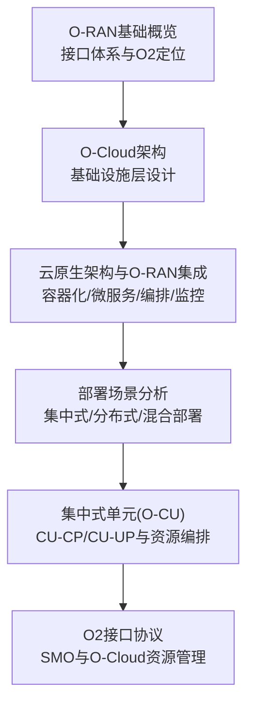
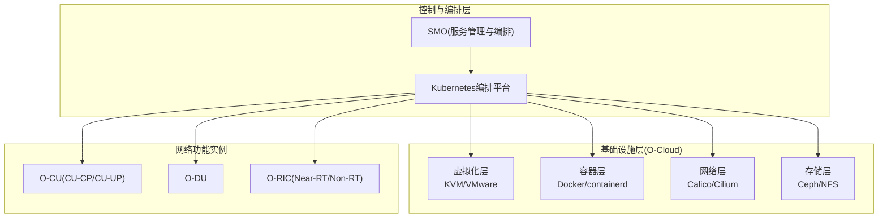
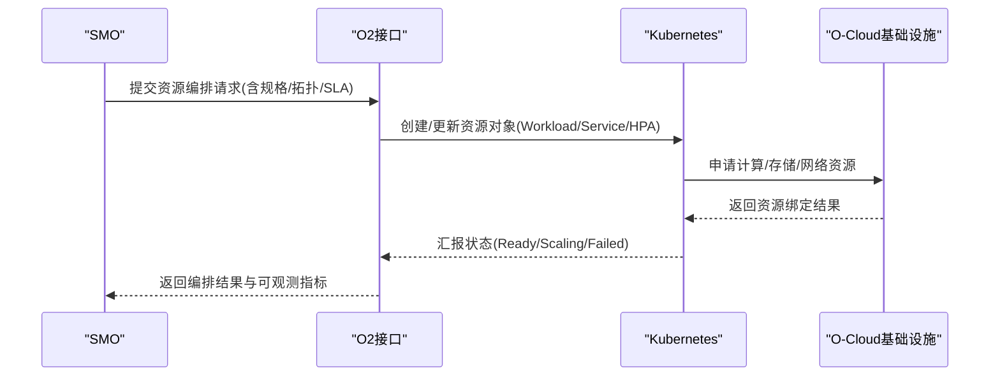
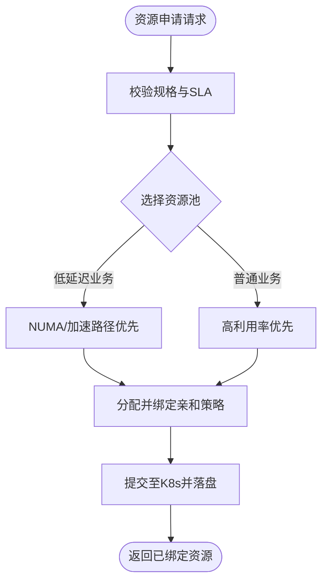
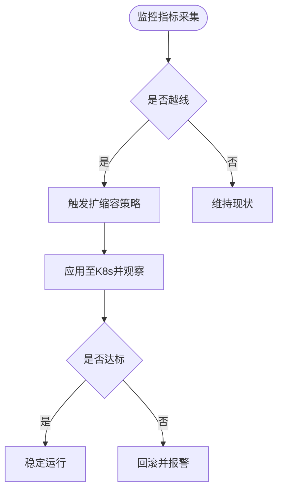
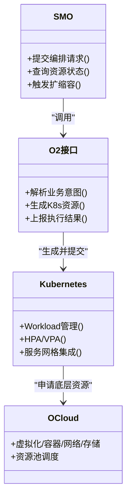
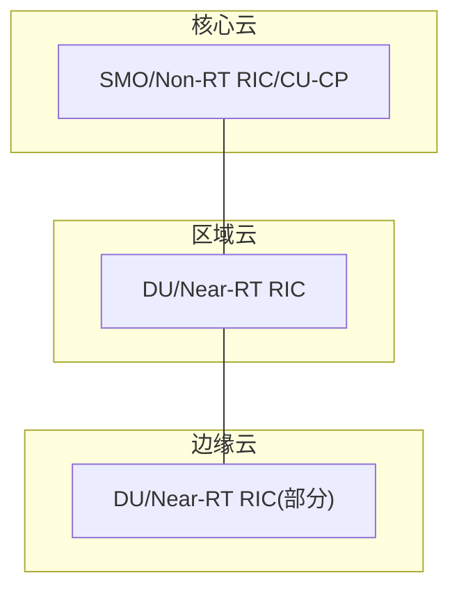
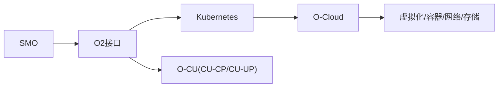

# O2接口协议

<cite>
**本文引用的文件**
- [O-RAN基础概览](file://01-architecture-system/readme.md)
- [O-Cloud架构](file://01-architecture-system/o-cloud-architecture.md)
- [云原生架构与O-RAN集成](file://05-cloud-integration/cloud-native-architecture.md)
- [部署场景分析](file://04-disaggregation-options/deployment-scenarios.md)
- [集中式单元(O-CU)](file://02-core-components/o-cu.md)
</cite>

## 目录
1. [引言](#引言)
2. [项目结构](#项目结构)
3. [核心组件](#核心组件)
4. [架构总览](#架构总览)
5. [详细组件分析](#详细组件分析)
6. [依赖分析](#依赖分析)
7. [性能考量](#性能考量)
8. [故障排查指南](#故障排查指南)
9. [结论](#结论)
10. [附录](#附录)

## 引言
本文件围绕O2接口协议展开，系统阐述其在O-RAN云资源管理中的定位与作用，结合O-Cloud基础设施层、云原生编排与弹性伸缩、资源池管理与虚拟化分配、容器编排与微服务治理、资源监控与成本优化策略，以及多云/混合云部署的最佳实践，帮助读者从系统架构到落地实施形成完整认知。

## 项目结构
本仓库以主题域划分文档，O2接口相关内容主要分布在“架构系统”“云原生集成”“部署场景”“核心组件”等章节中，形成“总体架构—基础设施—编排治理—资源管理—部署实践”的知识闭环。

图示来源
- [O-RAN基础概览](file://01-architecture-system/readme.md#L27-L34)
- [O-Cloud架构](file://01-architecture-system/o-cloud-architecture.md#L1-L30)
- [云原生架构与O-RAN集成](file://05-cloud-integration/cloud-native-architecture.md#L65-L122)
- [部署场景分析](file://04-disaggregation-options/deployment-scenarios.md#L7-L41)
- [集中式单元(O-CU)](file://02-core-components/o-cu.md#L62-L100)

章节来源
- [O-RAN基础概览](file://01-architecture-system/readme.md#L1-L161)
- [O-Cloud架构](file://01-architecture-system/o-cloud-architecture.md#L1-L238)
- [云原生架构与O-RAN集成](file://05-cloud-integration/cloud-native-architecture.md#L1-L481)
- [部署场景分析](file://04-disaggregation-options/deployment-scenarios.md#L1-L563)
- [集中式单元(O-CU)](file://02-core-components/o-cu.md#L1-L419)

## 核心组件
- O2接口定位：作为SMO与O-Cloud之间的云资源管理接口，负责网络功能的资源申请、分配、编排与弹性伸缩，支撑O-RAN上层CU/DU/RIC等网络功能的运行。
- O-Cloud基础设施层：提供计算/存储/网络虚拟化与容器化能力，支持Kubernetes编排、自动化部署与监控告警，满足O-RAN对低延迟、高可靠与可扩展的要求。
- 云原生编排与治理：通过容器化、微服务化、自动化编排与可观测性，实现服务的快速部署、弹性扩缩容与自愈。
- 资源池与虚拟化：面向CU/DU/RIC等网络功能提供资源池化管理，支持按需分配、隔离与回收；结合Kubernetes实现跨节点资源调度与亲和性优化。
- 监控与成本优化：基于Prometheus/Grafana等工具链，构建分层监控与智能告警；通过容量规划、资源复用与自动化运维降低总体拥有成本(TCO)。

章节来源
- [O-RAN基础概览](file://01-architecture-system/readme.md#L27-L34)
- [O-Cloud架构](file://01-architecture-system/o-cloud-architecture.md#L1-L115)
- [云原生架构与O-RAN集成](file://05-cloud-integration/cloud-native-architecture.md#L177-L234)
- [部署场景分析](file://04-disaggregation-options/deployment-scenarios.md#L296-L365)

## 架构总览
O2接口贯穿“SMO—O-Cloud—网络功能实例”的资源管理链路，结合云原生编排与弹性伸缩，实现端到端的资源生命周期管理。

图示来源
- [O-Cloud架构](file://01-architecture-system/o-cloud-architecture.md#L19-L30)
- [云原生架构与O-RAN集成](file://05-cloud-integration/cloud-native-architecture.md#L65-L122)
- [集中式单元(O-CU)](file://02-core-components/o-cu.md#L82-L100)

## 详细组件分析

### O2接口协议与资源编排
- 职责边界：O2接口负责SMO与O-Cloud之间的资源编排契约，涵盖网络功能实例的生命周期（创建/更新/删除）、资源分配（CPU/内存/存储/网络带宽）、亲和性与隔离策略、弹性扩缩容触发与回收。
- 交互模式：基于RESTful风格的编排接口，结合Kubernetes CRD/Operator实现声明式资源管理；通过事件驱动与轮询相结合的方式反馈状态。
- 与Kubernetes的关系：O2接口将SMO的业务意图转化为K8s资源对象（Deployment/StatefulSet/Service/HPA等），并借助Helm/Argo等工具实现模板化与GitOps化管理。

图示来源
- [云原生架构与O-RAN集成](file://05-cloud-integration/cloud-native-architecture.md#L207-L220)
- [O-Cloud架构](file://01-architecture-system/o-cloud-architecture.md#L144-L171)

章节来源
- [云原生架构与O-RAN集成](file://05-cloud-integration/cloud-native-architecture.md#L177-L234)
- [O-Cloud架构](file://01-architecture-system/o-cloud-architecture.md#L142-L182)

### 资源池管理与虚拟化资源分配
- 资源池抽象：将物理计算/存储/网络资源抽象为可调度的资源池，支持按域（区域/可用区/机架）与标签进行隔离与亲和。
- 分配策略：结合QoS与SLA，优先满足低延迟业务（如URLLC）的NUMA亲和与SR-IOV/DPDK等加速路径；普通业务（如eMBB/mMTC）追求高资源利用率与弹性。
- 跨域调度：在混合部署场景下，实现核心-边缘的资源协同与跨域亲和，保障端到端时延与吞吐。

图示来源
- [O-Cloud架构](file://01-architecture-system/o-cloud-architecture.md#L41-L63)
- [部署场景分析](file://04-disaggregation-options/deployment-scenarios.md#L318-L345)

章节来源
- [O-Cloud架构](file://01-architecture-system/o-cloud-architecture.md#L41-L115)
- [部署场景分析](file://04-disaggregation-options/deployment-scenarios.md#L296-L365)

### 弹性伸缩机制
- 触发条件：基于业务负载（连接数/吞吐/时延）、QoS目标与SLA阈值，结合K8s HPA/VPA与自定义指标（Prometheus）触发扩缩容。
- 执行策略：优先水平扩展（副本数/节点亲和），必要时垂直扩展（CPU/内存）；边缘场景下优先就近扩缩容，减少跨域迁移。
- 自愈与回退：异常检测与自动回滚，确保业务连续性与稳定性。

图示来源
- [云原生架构与O-RAN集成](file://05-cloud-integration/cloud-native-architecture.md#L207-L220)
- [O-Cloud架构](file://01-architecture-system/o-cloud-architecture.md#L165-L171)

章节来源
- [云原生架构与O-RAN集成](file://05-cloud-integration/cloud-native-architecture.md#L177-L234)
- [O-Cloud架构](file://01-architecture-system/o-cloud-architecture.md#L165-L182)

### 容器编排与微服务治理
- 微服务化：将CU/DU/RIC等功能模块拆分为独立微服务，通过Kubernetes进行部署、服务发现、负载均衡与灰度发布。
- 编排策略：滚动更新/蓝绿发布/金丝雀发布，结合HPA/VPA实现弹性；使用Helm/Argo实现GitOps化管理。
- 多租户与隔离：命名空间、资源配额、网络策略与RBAC，确保业务域隔离与安全。

图示来源
- [云原生架构与O-RAN集成](file://05-cloud-integration/cloud-native-architecture.md#L193-L234)
- [O-Cloud架构](file://01-architecture-system/o-cloud-architecture.md#L19-L30)

章节来源
- [云原生架构与O-RAN集成](file://05-cloud-integration/cloud-native-architecture.md#L177-L234)
- [O-Cloud架构](file://01-architecture-system/o-cloud-architecture.md#L19-L30)

### 资源监控与成本优化
- 监控体系：分层监控（基础设施/容器/服务/业务），统一指标、日志与追踪，结合告警聚合与根因分析。
- 成本优化：容量规划与预测、资源复用与共享、自动化运维与弹性调度，降低闲置与拥塞带来的成本浪费。

图示来源
- [云原生架构与O-RAN集成](file://05-cloud-integration/cloud-native-architecture.md#L297-L341)
- [O-Cloud架构](file://01-architecture-system/o-cloud-architecture.md#L151-L182)

章节来源
- [云原生架构与O-RAN集成](file://05-cloud-integration/cloud-native-architecture.md#L297-L341)
- [O-Cloud架构](file://01-architecture-system/o-cloud-architecture.md#L151-L182)

### 多云/混合云部署最佳实践
- 集中式：核心数据中心集中部署SMO、Non-RT RIC与CU-CP，DU部署在区域边缘，适合eMBB与管理效率优先场景。
- 边缘云：DU/Near-RT RIC下沉至边缘，满足URLLC低时延与工业控制场景。
- 混合云：核心-边缘分层部署，统一编排与协同，兼顾集中管理与边缘性能。

图示来源
- [部署场景分析](file://04-disaggregation-options/deployment-scenarios.md#L162-L215)
- [云原生架构与O-RAN集成](file://05-cloud-integration/cloud-native-architecture.md#L235-L296)

章节来源
- [部署场景分析](file://04-disaggregation-options/deployment-scenarios.md#L162-L215)
- [云原生架构与O-RAN集成](file://05-cloud-integration/cloud-native-architecture.md#L235-L296)

## 依赖分析
- O2接口依赖Kubernetes编排平台与O-Cloud基础设施层，向上承接SMO的业务意图，向下对接虚拟化/容器/网络/存储资源。
- 与O-CU的耦合体现在资源规格与亲和性约束：CU-CP偏管理与控制，对延迟与可用性要求高；CU-UP偏用户面转发，对吞吐与低延迟要求高。
- 与部署场景耦合体现在资源池选择、跨域调度与网络拓扑优化。

图示来源
- [O-RAN基础概览](file://01-architecture-system/readme.md#L18-L25)
- [O-Cloud架构](file://01-architecture-system/o-cloud-architecture.md#L19-L30)
- [集中式单元(O-CU)](file://02-core-components/o-cu.md#L82-L100)

章节来源
- [O-RAN基础概览](file://01-architecture-system/readme.md#L18-L25)
- [O-Cloud架构](file://01-architecture-system/o-cloud-architecture.md#L19-L30)
- [集中式单元(O-CU)](file://02-core-components/o-cu.md#L82-L100)

## 性能考量
- 实时性与确定性：针对URLLC等场景，优先NUMA亲和、SR-IOV/DPDK与专用网络路径，降低抖动与时延。
- 可靠性与可用性：多副本、自动故障转移、健康检查与快速恢复，目标达到5个9以上的可用性。
- 可扩展性：水平扩展优先，结合多级缓存与异步处理，避免单点瓶颈。
- 安全与合规：网络隔离、访问控制、数据加密与审计，满足行业合规要求。

章节来源
- [O-Cloud架构](file://01-architecture-system/o-cloud-architecture.md#L116-L141)
- [云原生架构与O-RAN集成](file://05-cloud-integration/cloud-native-architecture.md#L123-L177)

## 故障排查指南
- 告警与根因：统一告警分级与聚合，结合分布式追踪定位跨服务调用链路中的异常节点。
- 自愈与回滚：自动扩缩容失败、部署回滚、配置变更回滚与数据备份恢复。
- 运维自动化：CI/CD流水线、基础设施即代码与自动化巡检，减少人为误操作。

章节来源
- [云原生架构与O-RAN集成](file://05-cloud-integration/cloud-native-architecture.md#L164-L176)
- [O-Cloud架构](file://01-architecture-system/o-cloud-architecture.md#L165-L182)

## 结论
O2接口协议是SMO与O-Cloud之间的桥梁，通过云原生编排与弹性伸缩，实现O-RAN网络功能的资源化、服务化与自动化。结合多云/混合云部署策略与全栈监控优化，可在满足低时延与高可用的同时，实现资源高效利用与成本可控。

## 附录
- 关键术语：SMO（服务管理与编排）、O-Cloud（O-RAN基础设施层）、K8s（Kubernetes）、HPA/VPA（水平/垂直自动伸缩）、GitOps（基于Git的自动化编排）。
- 参考路径：O2接口在O-RAN接口体系中的定位与职责；O-Cloud在云原生架构中的技术栈与部署模式；O-CU在集中式/分布式/混合部署中的资源与性能考量。

章节来源
- [O-RAN基础概览](file://01-architecture-system/readme.md#L27-L34)
- [O-Cloud架构](file://01-architecture-system/o-cloud-architecture.md#L1-L30)
- [部署场景分析](file://04-disaggregation-options/deployment-scenarios.md#L1-L563)
- [集中式单元(O-CU)](file://02-core-components/o-cu.md#L1-L419)