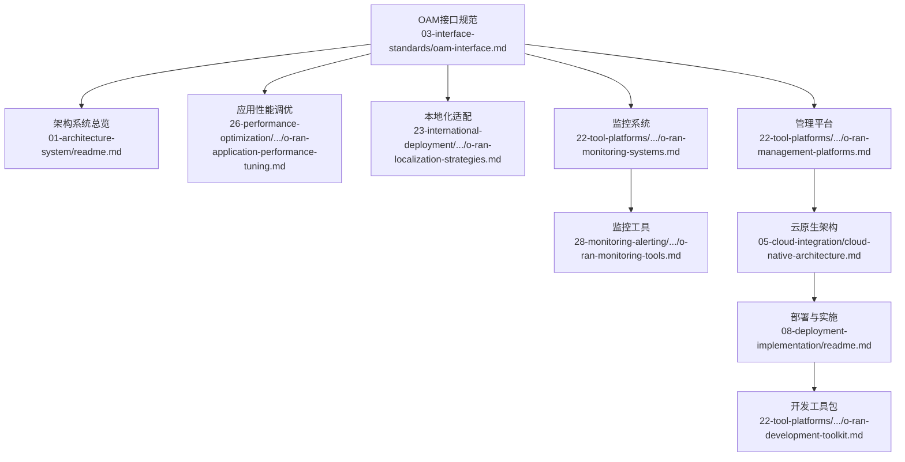
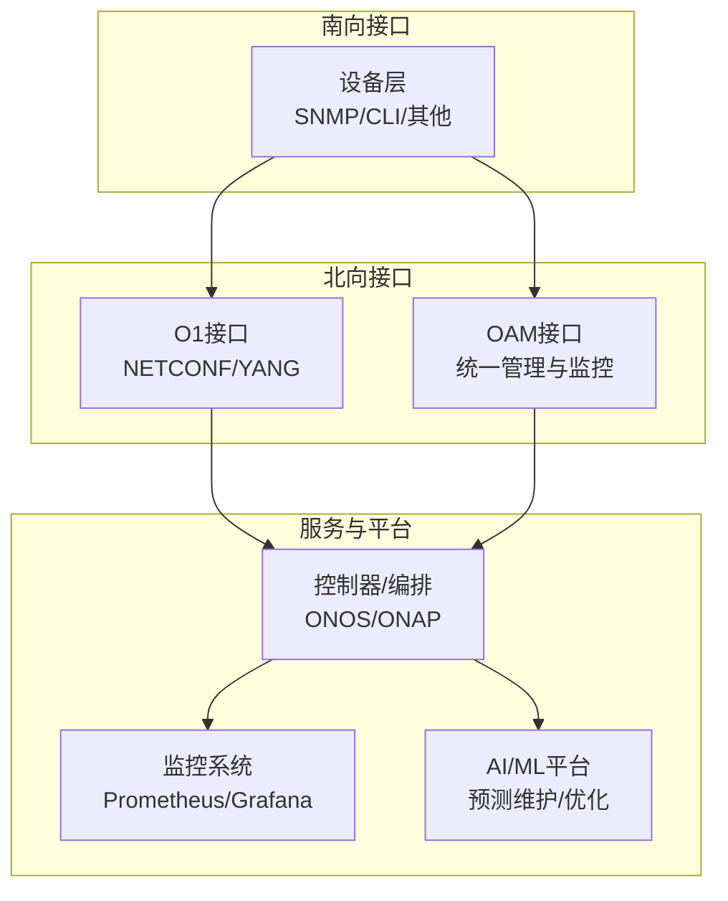
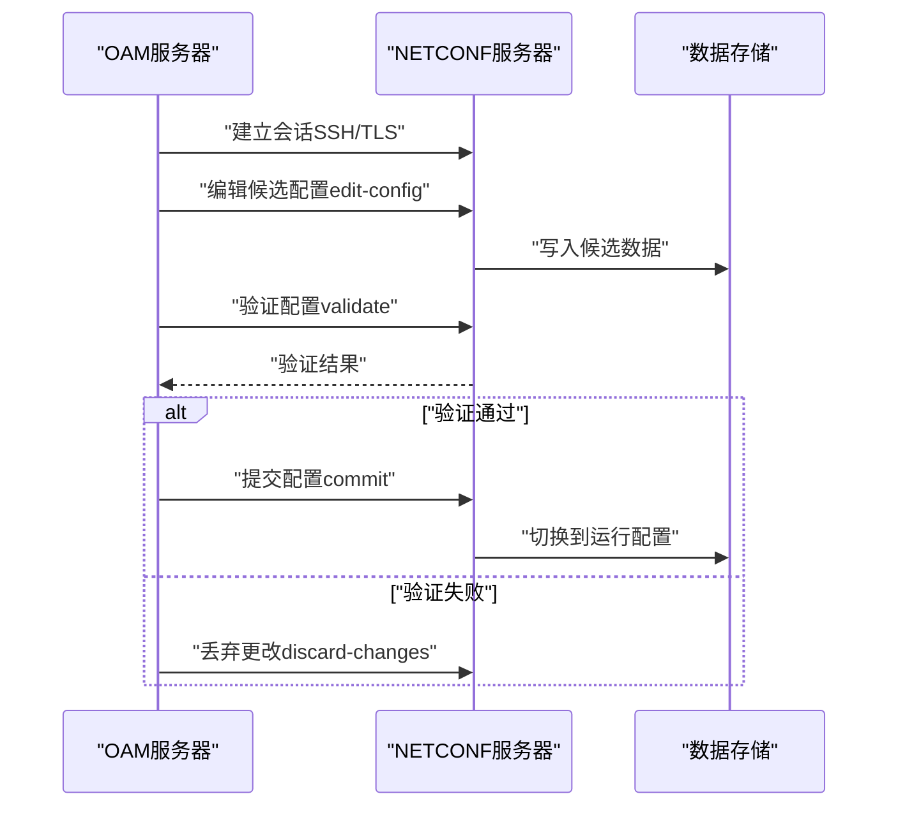
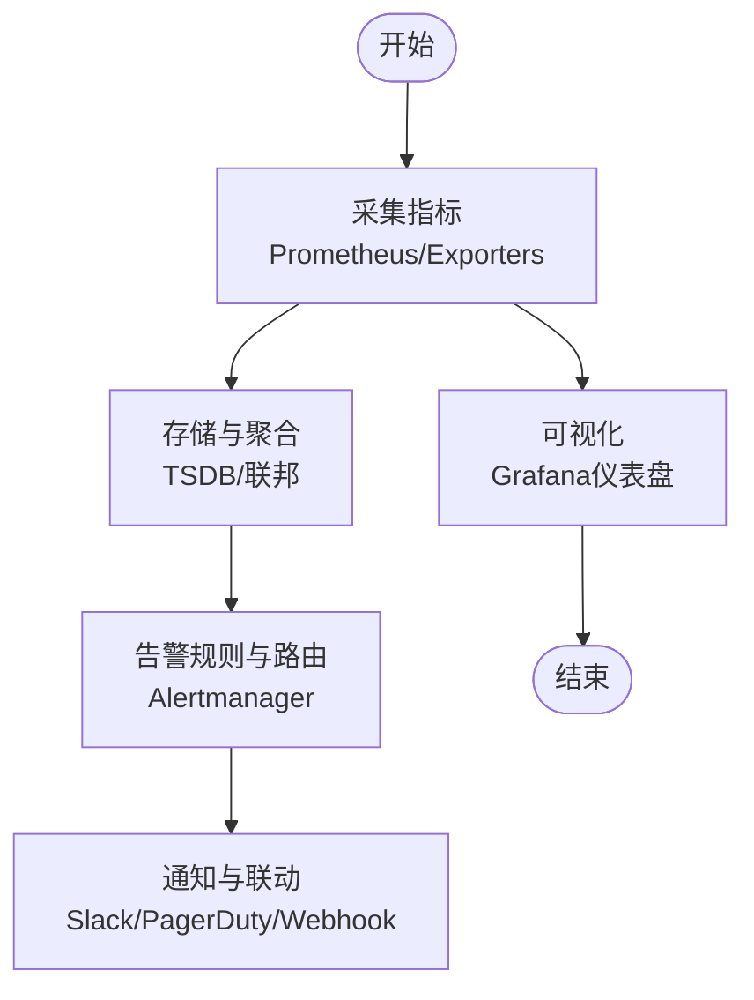
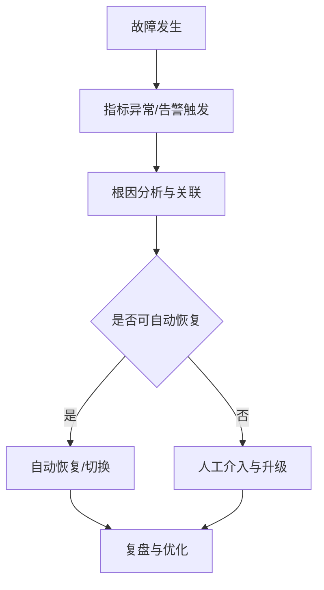
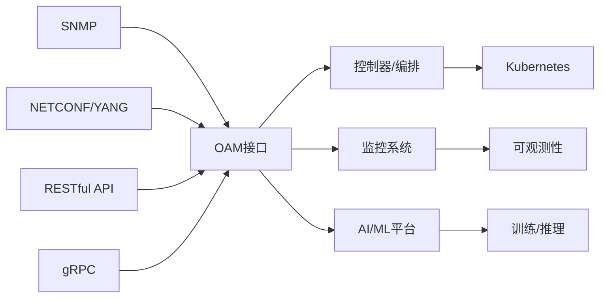

# OAM接口协议

<cite>
**本文引用的文件**
- [OAM接口.md](file://03-interface-standards/oam-interface.md)
- [架构系统总览.md](file://01-architecture-system/readme.md)
- [应用性能调优.md](file://26-performance-optimization/application-tuning/o-ran-application-performance-tuning.md)
- [本地化策略.md](file://23-international-deployment/localization-adaptation/o-ran-localization-strategies.md)
- [管理平台.md](file://22-tool-platforms/management-platforms/o-ran-management-platforms.md)
- [监控系统.md](file://22-tool-platforms/monitoring-systems/o-ran-monitoring-systems.md)
- [监控工具.md](file://28-monitoring-alerting/monitoring-tools/o-ran-monitoring-tools.md)
- [云原生架构.md](file://05-cloud-integration/cloud-native-architecture.md)
- [部署与实施.md](file://08-deployment-implementation/readme.md)
- [开发工具包.md](file://22-tool-platforms/development-tools/o-ran-development-toolkit.md)
</cite>

## 目录
1. [引言](#引言)
2. [项目结构](#项目结构)
3. [核心组件](#核心组件)
4. [架构总览](#架构总览)
5. [详细组件分析](#详细组件分析)
6. [依赖分析](#依赖分析)
7. [性能考虑](#性能考虑)
8. [故障排查指南](#故障排查指南)
9. [结论](#结论)
10. [附录](#附录)

## 引言
本文件围绕OAM（操作、管理、维护）接口协议，系统阐述其在O-RAN网络中的整体网络管理与监控能力，覆盖配置管理、性能监控、故障管理、安全管理等核心功能模块；同时给出SNMP、NETCONF/YANG、REST/gRPC等协议栈在北向与南向接口中的规范与实践，并结合自动化运维与智能运维场景，提供可落地的应用指导。

## 项目结构
OAM接口协议相关内容分布在“接口标准”、“架构系统”、“性能优化”、“本地化适配”、“管理与监控平台”、“云原生集成”、“部署与实施”、“开发工具”等多个知识库章节中，形成从协议规范到平台实现、从性能优化到运维实践的完整知识谱系。

**图表来源**
- [OAM接口.md](file://03-interface-standards/oam-interface.md#L1-L353)
- [架构系统总览.md](file://01-architecture-system/readme.md#L30-L34)
- [应用性能调优.md](file://26-performance-optimization/application-tuning/o-ran-application-performance-tuning.md#L71-L129)
- [本地化策略.md](file://23-international-deployment/localization-adaptation/o-ran-localization-strategies.md#L142-L184)
- [管理平台.md](file://22-tool-platforms/management-platforms/o-ran-management-platforms.md#L1-L200)
- [监控系统.md](file://22-tool-platforms/monitoring-systems/o-ran-monitoring-systems.md#L1-L200)
- [监控工具.md](file://28-monitoring-alerting/monitoring-tools/o-ran-monitoring-tools.md#L1-L65)
- [云原生架构.md](file://05-cloud-integration/cloud-native-architecture.md#L1-L200)
- [部署与实施.md](file://08-deployment-implementation/readme.md#L280-L353)
- [开发工具包.md](file://22-tool-platforms/development-tools/o-ran-development-toolkit.md#L368-L415)

**章节来源**
- [OAM接口.md](file://03-interface-standards/oam-interface.md#L1-L353)
- [架构系统总览.md](file://01-architecture-system/readme.md#L30-L34)

## 核心组件
- 协议栈与接口形态
  - SNMP：设备级监控与管理，基于UDP，轻量、易部署。
  - NETCONF/YANG：结构化配置管理，基于SSH/TLS，支持事务、版本与模型驱动。
  - RESTful API：服务级编排与管理，基于HTTP/HTTPS，灵活易集成。
  - gRPC：高性能服务通信，基于HTTP/2，低延迟、高吞吐。
- 架构层次
  - 设备层：与具体网络设备交互。
  - 网络层：管理网络级资源与功能。
  - 服务层：管理服务级资源与功能。
  - 业务层：面向业务的管理接口。
- 端点角色
  - OAM服务器：网络管理系统侧，提供管理接口。
  - OAM客户端：网络元素侧，提供被管理接口。

**章节来源**
- [OAM接口.md](file://03-interface-standards/oam-interface.md#L64-L101)

## 架构总览
OAM接口贯穿设备、网络、服务、业务四层，通过SNMP、NETCONF/YANG、REST/gRPC等协议实现北向（O1/OAM）与南向（设备侧）的统一管理与监控，支撑集中/分布/分层等多种部署形态，并与云原生监控、自动化编排、AI/ML预测维护深度融合。

**图表来源**
- [OAM接口.md](file://03-interface-standards/oam-interface.md#L64-L101)
- [管理平台.md](file://22-tool-platforms/management-platforms/o-ran-management-platforms.md#L10-L72)
- [监控系统.md](file://22-tool-platforms/monitoring-systems/o-ran-monitoring-systems.md#L10-L78)

## 详细组件分析

### 配置管理（NETCONF/YANG）
- 数据模型与会话
  - YANG模型驱动的配置建模，支持事务、候选编辑、回滚与版本控制。
  - NETCONF会话通过SSH/TLS建立，支持call-home与连接池。
- 实践要点
  - 使用候选数据集进行安全配置，先验证再提交。
  - 结合OpenDaylight MD-SAL的数据存储与服务绑定框架，实现分布式高可用。
  - 在多厂商环境下遵循O-RAN/YANG模型标准，确保互操作性。

**图表来源**
- [管理平台.md](file://22-tool-platforms/management-platforms/o-ran-management-platforms.md#L116-L132)
- [OAM接口.md](file://03-interface-standards/oam-interface.md#L73-L77)

**章节来源**
- [管理平台.md](file://22-tool-platforms/management-platforms/o-ran-management-platforms.md#L74-L132)
- [OAM接口.md](file://03-interface-standards/oam-interface.md#L73-L77)

### 性能监控（SNMP/REST/gRPC）
- 指标采集与可视化
  - Prometheus采集器与Grafana仪表盘，支持按组件（CU/DU/RIC）与接口（E2/O1等）维度监控。
  - SNMP Exporter对接传统设备，实现统一指标汇聚。
- 实时与异步通信
  - gRPC用于低延迟、高吞吐的控制面消息传递与订阅。
  - REST用于服务编排与策略下发。

**图表来源**
- [监控系统.md](file://22-tool-platforms/monitoring-systems/o-ran-monitoring-systems.md#L10-L78)
- [监控工具.md](file://28-monitoring-alerting/monitoring-tools/o-ran-monitoring-tools.md#L1-L65)

**章节来源**
- [监控系统.md](file://22-tool-platforms/monitoring-systems/o-ran-monitoring-systems.md#L1-L200)
- [监控工具.md](file://28-monitoring-alerting/monitoring-tools/o-ran-monitoring-tools.md#L1-L65)

### 故障管理与告警
- 告警分级与关联
  - 基于阈值与规则的分级告警，避免告警风暴；通过关联分析定位根因。
- 自动化恢复
  - 云原生自愈能力：自动故障转移、优雅启停、健康检查。
  - 结合ONAP/ONOS的闭环策略与意图管理，实现自动恢复与降级运行。

**图表来源**
- [OAM接口.md](file://03-interface-standards/oam-interface.md#L180-L205)
- [云原生架构.md](file://05-cloud-integration/cloud-native-architecture.md#L138-L163)

**章节来源**
- [OAM接口.md](file://03-interface-standards/oam-interface.md#L160-L205)
- [云原生架构.md](file://05-cloud-integration/cloud-native-architecture.md#L138-L163)

### 安全管理（认证、授权、加密）
- 网络与传输安全
  - OAM接口采用SSH/TLS加密，实施相互认证与最小权限原则。
  - 网络隔离与访问控制，严格限制管理平面访问范围。
- 应用与审计
  - 管理操作审计与日志记录，定期安全扫描与合规评估。

**章节来源**
- [OAM接口.md](file://03-interface-standards/oam-interface.md#L117-L122)
- [OAM接口.md](file://03-interface-standards/oam-interface.md#L257-L276)

### 北向与南向接口规范
- 北向接口
  - O1接口：基于NETCONF/YANG，面向SMO与网络元素的配置与状态管理。
  - OAM接口：统一的网络管理与监控入口，承载拓扑、配置、性能、故障、安全等全量管理能力。
- 南向接口
  - 设备侧通过SNMP/CLI/其他协议对接，实现底层设备的监控与配置下发。

**章节来源**
- [架构系统总览.md](file://01-architecture-system/readme.md#L30-L34)
- [OAM接口.md](file://03-interface-standards/oam-interface.md#L97-L101)

## 依赖分析
OAM接口的协议栈与平台实现存在如下依赖关系：
- 协议层依赖：SNMP/NETCONF/REST/gRPC共同构成管理与监控的协议基础。
- 平台层依赖：管理平台（ONOS/ONAP/OpenDaylight）、监控系统（Prometheus/Grafana）、AI/ML平台相互协作。
- 云原生依赖：容器编排、服务网格、可观测性与安全策略为OAM提供弹性与韧性。

**图表来源**
- [OAM接口.md](file://03-interface-standards/oam-interface.md#L64-L87)
- [管理平台.md](file://22-tool-platforms/management-platforms/o-ran-management-platforms.md#L10-L72)
- [监控系统.md](file://22-tool-platforms/monitoring-systems/o-ran-monitoring-systems.md#L10-L78)
- [云原生架构.md](file://05-cloud-integration/cloud-native-architecture.md#L1-L200)

**章节来源**
- [OAM接口.md](file://03-interface-standards/oam-interface.md#L64-L101)
- [管理平台.md](file://22-tool-platforms/management-platforms/o-ran-management-platforms.md#L1-L200)
- [监控系统.md](file://22-tool-platforms/monitoring-systems/o-ran-monitoring-systems.md#L1-L200)
- [云原生架构.md](file://05-cloud-integration/cloud-native-architecture.md#L1-L200)

## 性能考虑
- 传输层优化
  - 协议参数调优（超时、重传）、连接池、压缩传输。
- 应用层优化
  - 批量操作、缓存机制、异步处理。
- 网络优化
  - 减少跳数、网络加速、负载均衡。
- 接口性能优化参考
  - E2、A1、O1等接口的协议优化策略与YANG/JSON模型优化、TLS握手与会话复用等。

**章节来源**
- [OAM接口.md](file://03-interface-standards/oam-interface.md#L143-L159)
- [应用性能调优.md](file://26-performance-optimization/application-tuning/o-ran-application-performance-tuning.md#L71-L129)

## 故障排查指南
- 常见故障类型
  - 连接故障、操作故障、同步故障、性能故障。
- 定位与恢复流程
  - 告警分析、日志分析、测试验证、网络诊断；通过自动化恢复与升级修复相结合。
- 运维体系
  - 统一监控平台、自动化故障检测与恢复、跨团队协作机制、定期性能评估与优化。

**章节来源**
- [OAM接口.md](file://03-interface-standards/oam-interface.md#L186-L217)
- [部署与实施.md](file://08-deployment-implementation/readme.md#L296-L353)

## 结论
OAM接口作为O-RAN的整体网络管理与监控枢纽，通过SNMP、NETCONF/YANG、REST/gRPC等协议实现北向与南向的统一管理；结合云原生监控、自动化编排与AI/ML预测维护，能够支撑大规模、高可靠、低延迟的现代化网络运维。在生产环境中，合理的网络规划、部署架构、性能优化与运维管理是确保OAM稳定运行的关键。

## 附录
- 案例研究：某大型运营商通过分层部署、负载均衡与自动化运维，实现OAM接口对数十万网络元素的集中管理与高可用保障。
- 未来趋势：智能化（AI/ML预测与自动恢复）、云原生演进（容器化与自动扩缩容）、开源生态建设、边缘与切片管理集成。

**章节来源**
- [OAM接口.md](file://03-interface-standards/oam-interface.md#L277-L348)