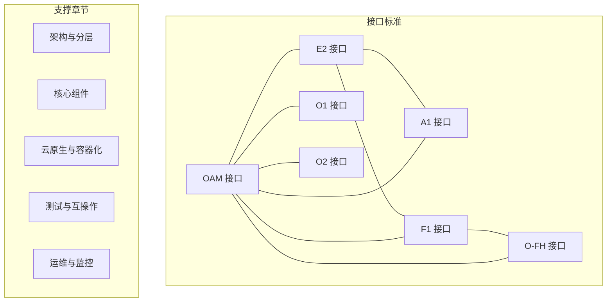
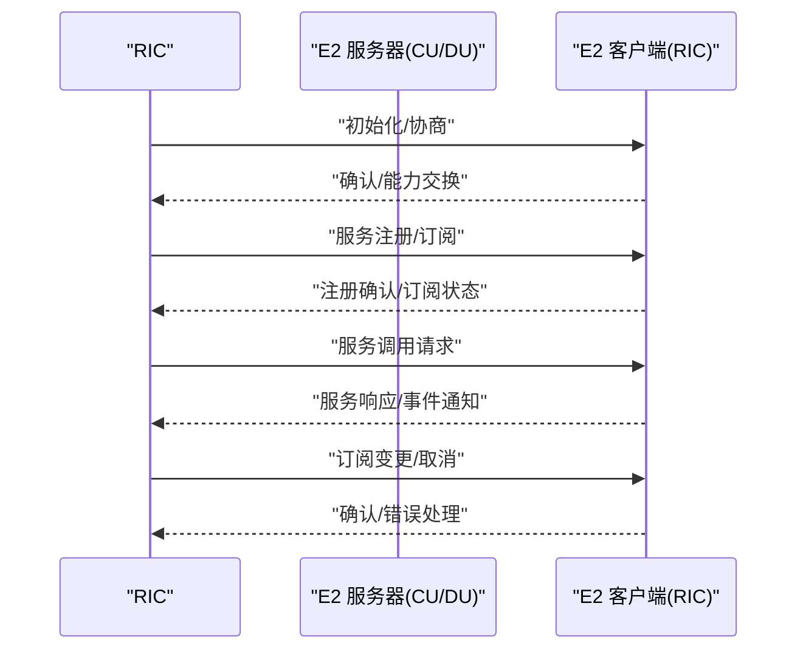
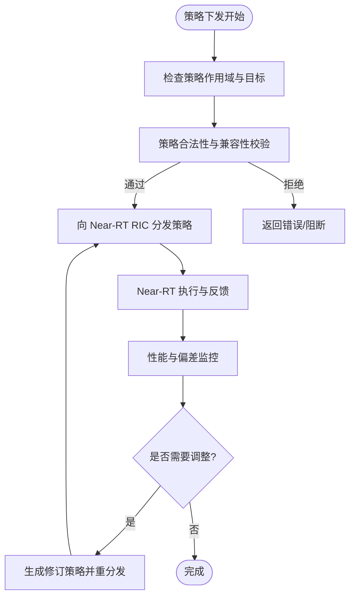
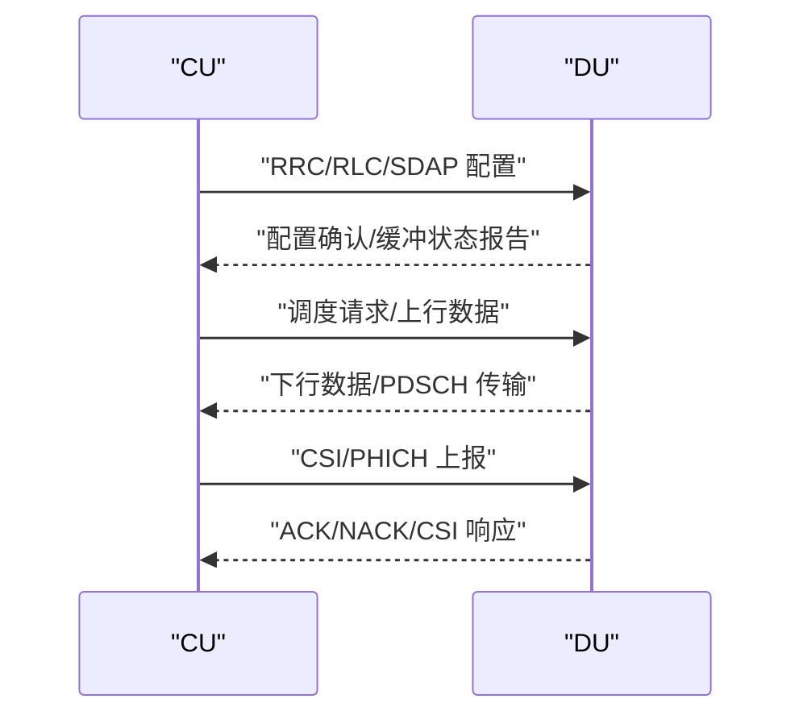
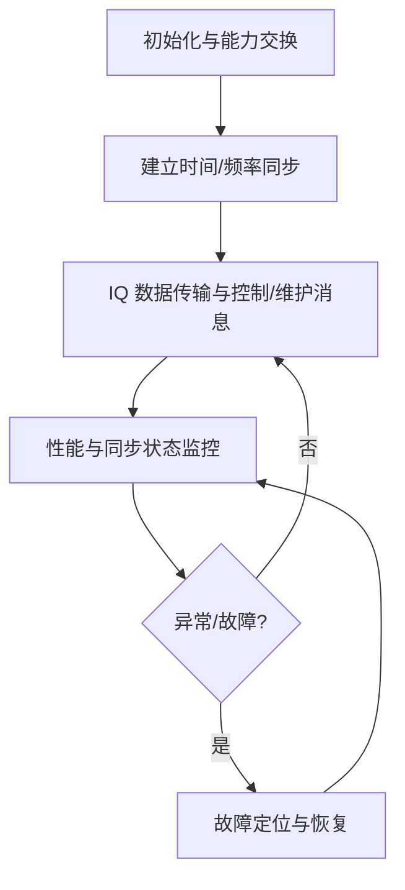
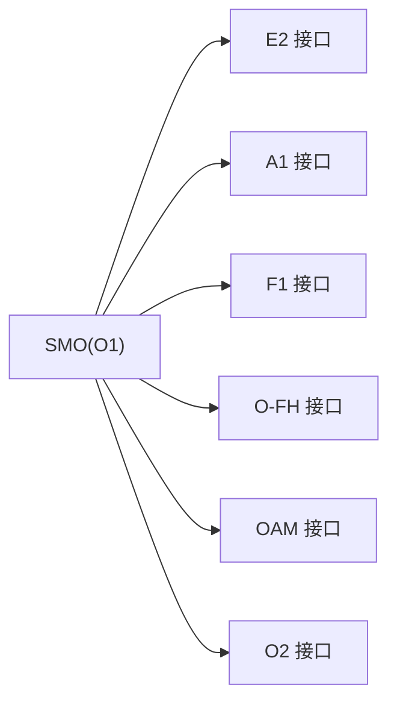
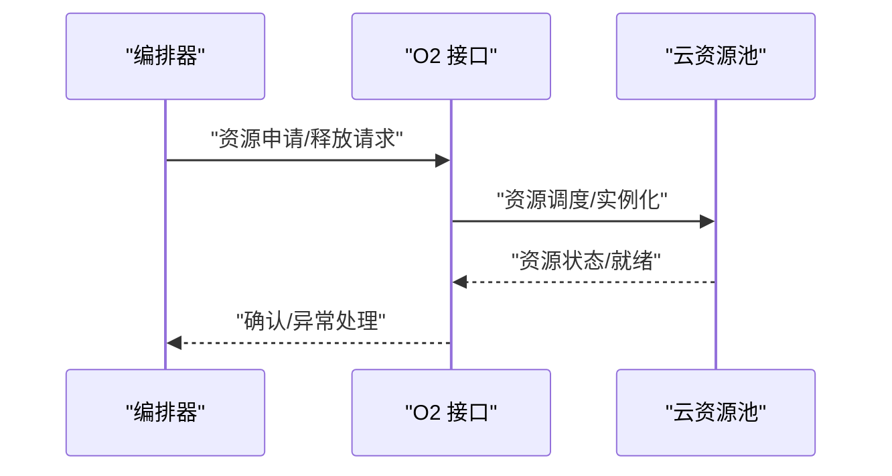
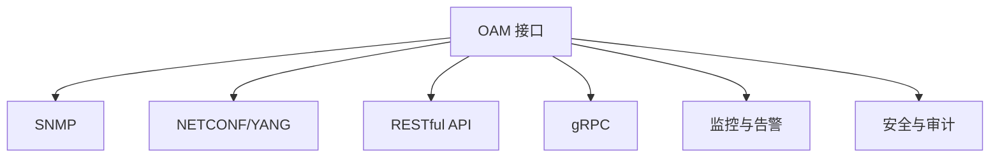
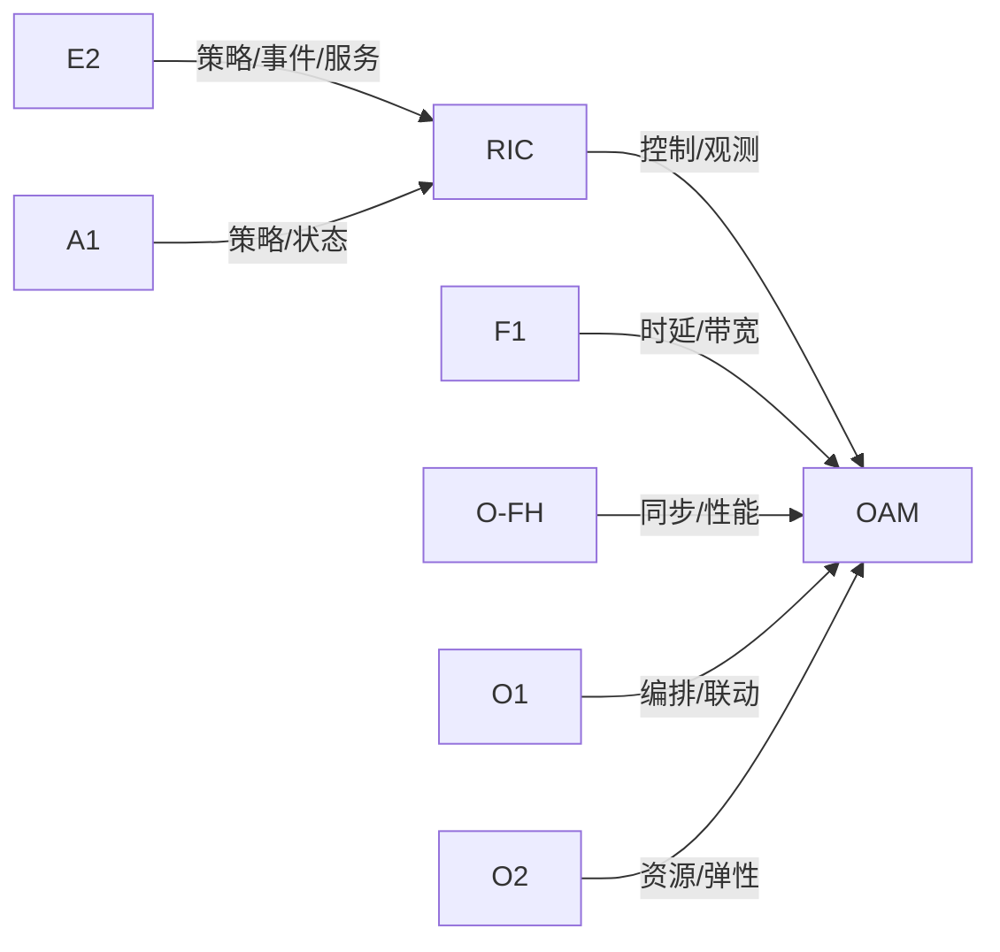

# 接口标准系统

<cite>
**本文引用的文件**
- [E2 接口](file://03-interface-standards/e2-interface.md)
- [A1 接口](file://03-interface-standards/a1-interface.md)
- [F1 接口](file://03-interface-standards/f1-interface.md)
- [O-FH 接口](file://03-interface-standards/o-fh-interface.md)
- [O1 接口](file://03-interface-standards/o1-interface.md)
- [O2 接口](file://03-interface-standards/o2-interface.md)
- [OAM 接口](file://03-interface-standards/oam-interface.md)
</cite>

## 目录
1. [引言](#引言)
2. [项目结构](#项目结构)
3. [核心组件](#核心组件)
4. [架构总览](#架构总览)
5. [详细组件分析](#详细组件分析)
6. [依赖分析](#依赖分析)
7. [性能考虑](#性能考虑)
8. [故障排查指南](#故障排查指南)
9. [结论](#结论)
10. [附录](#附录)

## 引言
本文件系统化梳理 O-RAN 联盟定义的接口标准体系，覆盖以下接口：E2（RIC 与 CU/DU 服务化接口）、A1（Non-RT RIC 与 Near-RT RIC 策略管理接口）、F1（3GPP 定义的 CU-DU 控制面与用户面分离接口）、O-FH（标准化前传接口）、O1（SMO 管理接口）、O2（云资源管理接口）与 OAM（网络管理监控接口）。文档从协议栈、消息格式、通信机制与最佳实践入手，提供多厂商环境下接口集成的指导思路，并辅以运维与性能优化建议。

## 项目结构
本仓库围绕“接口标准”主题形成独立的知识模块，每个接口均以独立文档形式呈现，便于检索与复用。接口标准文档与架构、核心组件、云原生集成、测试验证、运维管理等章节共同构成完整的 O-RAN 知识体系。



**章节来源**
- file://03-interface-standards/e2-interface.md#L1-L337
- file://03-interface-standards/a1-interface.md
- file://03-interface-standards/f1-interface.md
- file://03-interface-standards/o-fh-interface.md#L1-L397
- file://03-interface-standards/o1-interface.md
- file://03-interface-standards/o2-interface.md
- file://03-interface-standards/oam-interface.md#L1-L353

## 核心组件
- RIC（RAN Intelligent Controller）：负责策略下发、事件收集与控制闭环，是 Near-RT/Non-RT 的中枢。
- CU（Centralized Unit）/DU（Distributed Unit）：实现 5G 前传与回传的分层处理，支持 F1、E2 接口。
- RU（Radio Unit）：射频前端单元，通过 O-FH 接口与 DU 互联。
- SMO（System Management Orchestrator）：面向系统管理与编排的接口（O1）。
- 云资源管理（O2）：面向云平台资源的编排与管理。
- 网管（OAM）：提供端到端的网络管理、监控与维护能力。

**章节来源**
- file://03-interface-standards/e2-interface.md#L7-L62
- file://03-interface-standards/o-fh-interface.md#L1-L58
- file://03-interface-standards/oam-interface.md#L7-L61

## 架构总览
下图展示各接口在 O-RAN 分层架构中的角色与交互关系，强调 E2/A1/F1/O-FH/O1/O2/OAM 的协同与边界。

```mermaid
graph TB
subgraph "应用层"
APP["策略与AI/ML"]
end
subgraph "控制与编排层"
RIC["RIC<br/>Near-RT/Non-RT"]
SMO["SMO(O1)"]
OAM["OAM"]
end
subgraph "承载与资源层"
O2["O2 云资源管理"]
NET["传输网络<br/>IP/SCTP/以太网"]
end
subgraph "接入与前传层"
CU["CU"]
DU["DU"]
RU["RU"]
F1["F1 接口"]
E2["E2 接口"]
OFH["O-FH 接口"]
end
APP --> RIC
RIC --> E2
RIC --> A1
CU < --> F1
DU < --> F1
DU < --> OFH
RU < --> OFH
E2 --> CU
E2 --> DU
OAM --> RIC
OAM --> CU
OAM --> DU
OAM --> RU
O2 --> CU
O2 --> DU
O2 --> RU
SMO --> RIC
SMO --> CU
SMO --> DU
SMO --> RU
NET --- F1
NET --- E2
NET --- OFH
```

**图表来源**
- file://03-interface-standards/e2-interface.md#L63-L90
- file://03-interface-standards/f1-interface.md
- file://03-interface-standards/o-fh-interface.md#L59-L97
- file://03-interface-standards/oam-interface.md#L62-L101

## 详细组件分析

### E2 接口（RIC 与 CU/DU 服务化接口）
- 协议栈与传输：基于 SCTP/STREAMS，应用层为 E2AP/E2SM，支持服务发现、调用、事件通知与订阅管理。
- 消息类型：初始化、服务注册、服务调用、事件通知、订阅管理、错误处理。
- 部署与优化：网络规划（带宽、延迟、QoS）、部署架构（集中/分布式/混合）、传输层（SCTP 参数、多流、多路径）、应用层（消息压缩、批量处理、缓存）、网络加速（SR-IOV/DPDK）。
- 运维与安全：监控（连接、吞吐、延迟、错误率）、告警分级与关联分析、故障定位与恢复、版本管理；安全（网络隔离、访问控制、加密、认证）。
- 最佳实践：自动化部署与配置、高可用与灾备、统一监控与自动化运维、容量管理与动态资源调整。



**图表来源**
- file://03-interface-standards/e2-interface.md#L79-L88
- file://03-interface-standards/e2-interface.md#L111-L146

**章节来源**
- file://03-interface-standards/e2-interface.md#L1-L337

### A1 接口（Non-RT RIC 与 Near-RT RIC 策略管理接口）
- 角色定位：Non-RT RIC 负责长期策略与优化，Near-RT RIC 负责实时控制闭环；A1 作为两者间策略与数据的桥梁。
- 协议与消息：策略下发、状态反馈、性能指标上报与订阅、错误与异常处理。
- 部署与优化：策略一致性校验、跨 RIC 的同步与协调、低延迟路径与 QoS 保障。
- 运维与安全：策略版本管理、灰度发布与回滚、策略执行监控与审计、访问控制与加密。



**图表来源**
- file://03-interface-standards/a1-interface.md

**章节来源**
- file://03-interface-standards/a1-interface.md

### F1 接口（3GPP CU-DU 控制面与用户面分离接口）
- 协议栈：控制面（RRC、PDCP、RLC、MAC、PHY 层协议交互）、用户面（PDCP/RLC/SDAP 的用户面数据转发）。
- 消息类型：RRC 重配置、RLC/SDAP 配置、缓冲状态报告（BSR）、逻辑信道优先级与调度请求、PHICH/CSI 上报。
- 部署与优化：低延迟路径、带宽与 QoS 保障、控制面与用户面分离带来的资源与时延权衡。
- 运维与安全：端到端时延与丢包监控、控制面与用户面隔离、安全边界与访问控制。



**图表来源**
- file://03-interface-standards/f1-interface.md

**章节来源**
- file://03-interface-standards/f1-interface.md

### O-FH 接口（标准化前传接口）
- 功能：用户平面（IQ 数据传输与压缩）、控制平面（RU 配置、状态、故障、同步）、同步（PTP/SyncE）。
- 协议栈：eCPRI/RoE 应用于用户平面，PTP 用于时间同步，SyncE 用于频率同步。
- 部署与优化：带宽需求计算、延迟与抖动控制、传输路径冗余、QoS 保障、同步精度与保护。
- 运维与安全：接口状态与 RU 状态监控、告警分级与自动化、故障定位与恢复、配置变更与回滚、安全加固。



**图表来源**
- file://03-interface-standards/o-fh-interface.md#L98-L116
- file://03-interface-standards/o-fh-interface.md#L157-L177

**章节来源**
- file://03-interface-standards/o-fh-interface.md#L1-L397

### O1 接口（SMO 管理接口）
- 角色定位：面向系统管理与编排，提供跨域资源与策略的统一视图与控制。
- 关注点：跨域编排、资源抽象与映射、策略一致性与冲突消解、可观测性与审计。
- 集成建议：与 E2/A1/F1/O-FH/OAM/O2 对接，形成端到端的系统管理闭环。



**图表来源**
- file://03-interface-standards/o1-interface.md

**章节来源**
- file://03-interface-standards/o1-interface.md

### O2 接口（云资源管理接口）
- 角色定位：面向云平台资源的编排与管理，支持弹性扩缩容与资源调度。
- 关注点：虚拟化/容器化资源抽象、跨域资源调度、与 OAM/E2 的联动。
- 集成建议：与 OAM/O1 协同，实现“策略—编排—资源”的闭环。



**图表来源**
- file://03-interface-standards/o2-interface.md

**章节来源**
- file://03-interface-standards/o2-interface.md

### OAM 接口（网络管理监控接口）
- 功能：操作管理（拓扑、配置、软件）、管理（故障、性能、安全）、维护（资源、测试、备份/恢复）。
- 协议栈：SNMP、NETCONF/YANG、RESTful API、gRPC 等组合使用。
- 部署与优化：集中/分布式/分层部署、QoS 与带宽、连接池与缓存、批量与异步处理。
- 运维与安全：统一监控与告警、故障定位与恢复、版本与配置管理、访问控制与加密。



**图表来源**
- file://03-interface-standards/oam-interface.md#L62-L101

**章节来源**
- file://03-interface-standards/oam-interface.md#L1-L353

## 依赖分析
- E2 与 A1：E2 侧重 CU/DU 与 RIC 的服务化通信，A1 侧重 Non-RT 与 Near-RT 的策略协同，二者在策略执行与反馈上存在耦合。
- F1 与 O-FH：F1 是 CU-DU 内部接口，O-FH 是 DU-RU 前传接口，二者在时延、带宽与同步方面相互影响。
- O1 与 OAM/O2：O1 作为系统编排入口，需与 OAM 的监控与维护能力、O2 的资源编排能力协同。
- OAM 作为中枢：贯穿各接口的运维与管理，提供统一的监控、告警、配置与安全能力。



**图表来源**
- file://03-interface-standards/e2-interface.md#L1-L337
- file://03-interface-standards/a1-interface.md
- file://03-interface-standards/o-fh-interface.md#L1-L397
- file://03-interface-standards/oam-interface.md#L1-L353
- file://03-interface-standards/o1-interface.md
- file://03-interface-standards/o2-interface.md

## 性能考虑
- 低延迟与高可靠：针对 Near-RT 场景（E2、F1、O-FH），优先采用专用网络、低延迟队列、多路径与同步保障。
- 带宽与压缩：O-FH 用户面支持 IQ 数据压缩与速率适配，E2 应用层可采用批量与缓存减少交互。
- QoS 与隔离：为控制/同步/管理流量设置差异化优先级，避免互相干扰。
- 自动化与弹性：O2 与 OAM 的自动化能力可提升资源利用率与故障恢复效率。

[本节为通用性能讨论，无需列出具体文件来源]

## 故障排查指南
- E2：连接断连、消息失败、服务不可用、延迟/吞吐异常；建议从告警、日志、信令与测试工具入手定位，必要时进行版本与配置回退。
- O-FH：连接/同步故障、性能劣化、硬件故障；建议从告警与日志分析、连通性与同步测试入手，修复网络/同步/硬件问题。
- OAM：连接/操作失败、同步异常、性能下降；建议统一监控与告警分级，结合网络诊断与配置验证进行恢复。
- A1：策略下发失败、状态不一致；建议检查策略合法性、版本兼容与跨 RIC 同步。
- F1：控制/用户面异常；建议检查时延与丢包、缓冲状态与调度反馈。
- O1/O2：编排失败/资源异常；建议核对资源状态、编排策略与与 OAM/O2 的联动。

**章节来源**
- file://03-interface-standards/e2-interface.md#L170-L200
- file://03-interface-standards/o-fh-interface.md#L247-L287
- file://03-interface-standards/oam-interface.md#L186-L217
- file://03-interface-standards/a1-interface.md
- file://03-interface-standards/f1-interface.md
- file://03-interface-standards/o1-interface.md
- file://03-interface-standards/o2-interface.md

## 结论
O-RAN 接口标准体系以 E2/A1/F1/O-FH 为核心，配合 O1/O2/OAM 形成端到端的智能化、云原生与可运维的 5G 承载网络。在多厂商环境下，遵循统一的协议栈、消息模型与运维流程，是实现互操作与规模化部署的关键。通过合理的网络规划、部署架构、性能优化与安全加固，可在保证低时延与高可靠的同时，提升资源利用率与自动化水平。

[本节为总结性内容，无需列出具体文件来源]

## 附录
- 多厂商集成建议：统一版本协商与兼容性测试、标准化消息格式与服务模型、跨域编排与联动机制、统一监控与告警平台。
- 持续演进：AI/ML 驱动的智能运维、云原生与边缘计算融合、开源生态与互操作规范完善、网络切片与资源隔离能力增强。

[本节为概念性内容，无需列出具体文件来源]