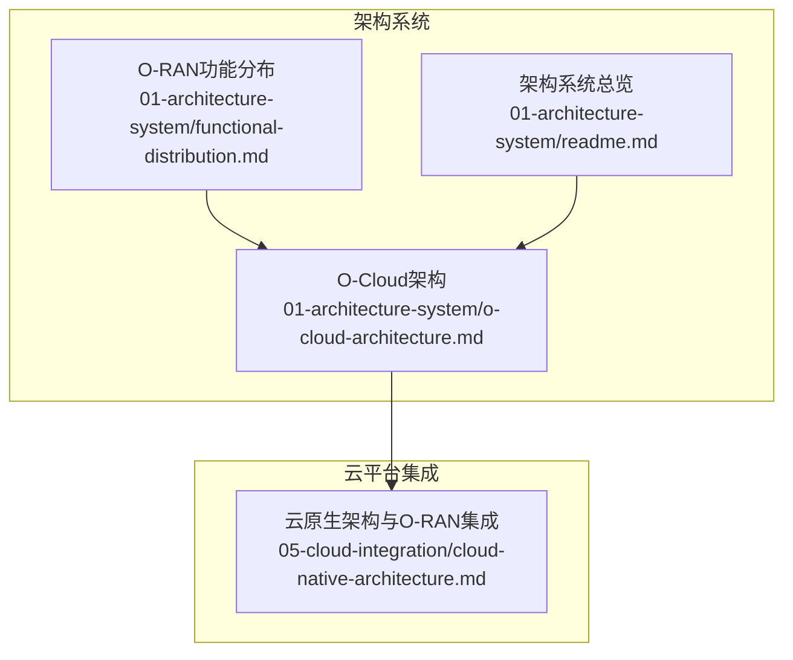
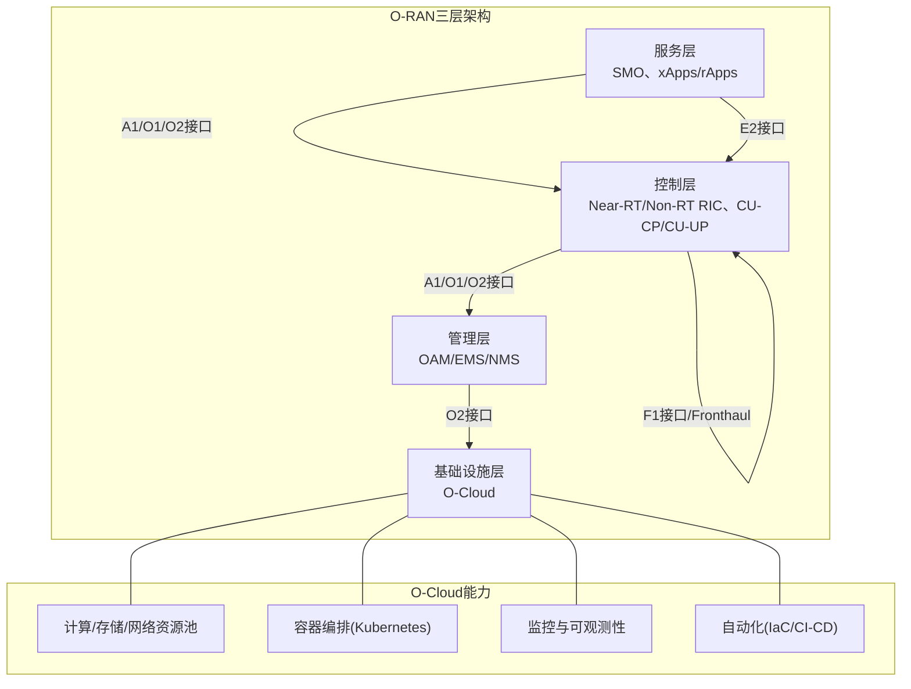
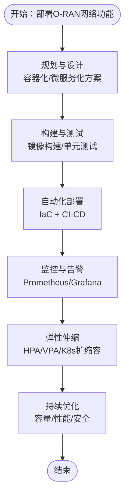
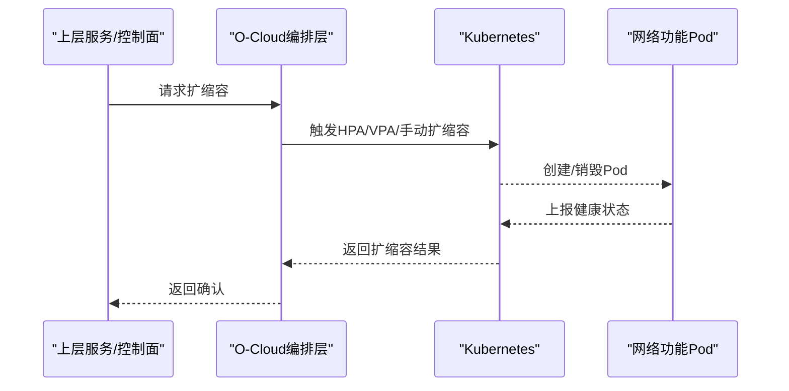
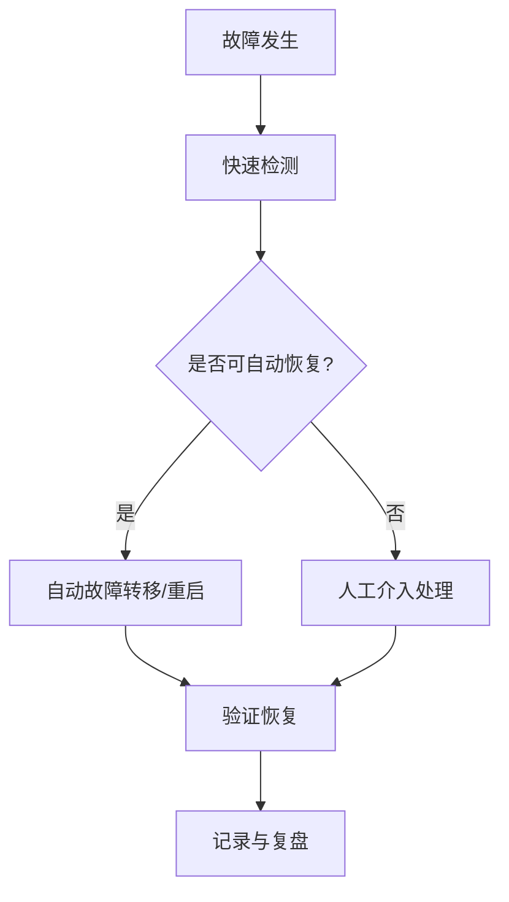
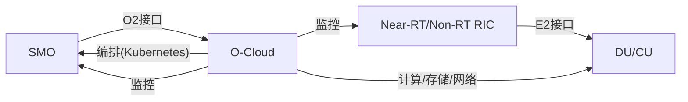

# O-Cloud架构

<cite>
**本文引用的文件**
- [O-Cloud架构](file://01-architecture-system/o-cloud-architecture.md)
- [云原生架构与O-RAN集成](file://05-cloud-integration/cloud-native-architecture.md)
- [O-RAN功能分布](file://01-architecture-system/functional-distribution.md)
- [O-RAN架构系统总览](file://01-architecture-system/readme.md)
</cite>

## 目录
1. [引言](#引言)
2. [项目结构](#项目结构)
3. [核心组件](#核心组件)
4. [架构总览](#架构总览)
5. [详细组件分析](#详细组件分析)
6. [依赖分析](#依赖分析)
7. [性能考虑](#性能考虑)
8. [故障排查指南](#故障排查指南)
9. [结论](#结论)
10. [附录](#附录)

## 引言
本文件围绕O-Cloud作为O-RAN云原生基础设施层的设计理念与架构原理展开，系统阐述其在O-RAN中的定位、与云原生技术的融合方式、以及支撑弹性扩展、高可用与资源优化的关键机制。同时对比传统云平台的差异，给出部署最佳实践与注意事项，帮助读者在理解O-RAN整体架构的基础上，掌握O-Cloud的落地要点与运维关注点。

## 项目结构
本仓库以主题域组织O-RAN知识体系，其中与O-Cloud直接相关的内容主要分布在“架构系统”和“云平台集成”两大板块：
- 架构系统：包含O-Cloud架构、功能分布、弹性伸缩、分层架构等基础性文档
- 云平台集成：聚焦云原生技术在O-RAN中的应用，涵盖容器化、微服务化、编排与监控等

下图给出与O-Cloud相关的主要文件与其主题映射：

图表来源
- [O-Cloud架构](file://01-architecture-system/o-cloud-architecture.md#L1-L238)
- [O-RAN功能分布](file://01-architecture-system/functional-distribution.md#L1-L325)
- [O-RAN架构系统总览](file://01-architecture-system/readme.md#L1-L161)
- [云原生架构与O-RAN集成](file://05-cloud-integration/cloud-native-architecture.md#L1-L481)

章节来源
- [O-Cloud架构](file://01-architecture-system/o-cloud-architecture.md#L1-L238)
- [O-RAN功能分布](file://01-architecture-system/functional-distribution.md#L1-L325)
- [O-RAN架构系统总览](file://01-architecture-system/readme.md#L1-L161)
- [云原生架构与O-RAN集成](file://05-cloud-integration/cloud-native-architecture.md#L1-L481)

## 核心组件
O-Cloud作为基础设施层，承担为上层CU、DU、RIC、SMO等网络功能提供云原生运行环境的职责。其核心组成与技术栈如下：
- 组成层
  - 计算资源层：虚拟化与容器化运行环境
  - 存储资源层：高性能、可靠、可扩展的存储服务
  - 网络资源层：虚拟网络与容器网络能力
  - 管理层：基础设施配置、监控与管理
  - 编排层：网络功能的部署、扩缩容与生命周期管理
- 技术栈
  - 虚拟化：KVM、VMware等
  - 容器：Docker、containerd等
  - 编排：Kubernetes
  - 存储：Ceph、NFS等
  - 网络：Calico、Cilium等
  - 监控：Prometheus、Grafana等
  - 自动化：Ansible、Terraform等
- 部署模式
  - 集中式部署：核心数据中心集中提供服务
  - 分布式部署：边缘节点就近提供服务
  - 混合部署：核心与边缘协同

章节来源
- [O-Cloud架构](file://01-architecture-system/o-cloud-architecture.md#L9-L38)
- [O-Cloud架构](file://01-architecture-system/o-cloud-architecture.md#L19-L29)

## 架构总览
O-Cloud在O-RAN三层架构中处于基础设施层，向上通过O2接口与SMO对接，向下承载CU、DU、RIC、SMO等网络功能的容器化/虚拟化运行。其与云原生技术的融合体现在：
- 容器化与微服务化：将网络功能模块化、服务化，提升可维护性与可扩展性
- 自动化编排：借助Kubernetes实现弹性伸缩、自愈与服务发现
- 基础设施即代码：通过Terraform、Ansible等实现基础设施的自动化与一致性

图表来源
- [O-Cloud架构](file://01-architecture-system/o-cloud-architecture.md#L1-L238)
- [O-RAN功能分布](file://01-architecture-system/functional-distribution.md#L145-L196)
- [O-RAN架构系统总览](file://01-architecture-system/readme.md#L8-L35)
- [云原生架构与O-RAN集成](file://05-cloud-integration/cloud-native-architecture.md#L65-L122)

## 详细组件分析

### O-Cloud与云原生的融合
- 容器化与微服务化
  - 将CU、DU、RIC、SMO等功能容器化，实现快速部署与弹性扩缩容
  - 微服务化拆分控制面与用户面、近实时与非实时功能，提升独立演进能力
- 自动化编排
  - 使用Kubernetes进行服务编排、自愈与弹性伸缩
  - 结合HPA/VPA实现资源的自动调节
- 基础设施即代码
  - 使用Terraform、Ansible实现基础设施的版本化与自动化
  - 保障开发/测试/生产环境一致性

图表来源
- [云原生架构与O-RAN集成](file://05-cloud-integration/cloud-native-architecture.md#L177-L234)

章节来源
- [云原生架构与O-RAN集成](file://05-cloud-integration/cloud-native-architecture.md#L9-L64)
- [云原生架构与O-RAN集成](file://05-cloud-integration/cloud-native-architecture.md#L177-L234)

### O-Cloud在弹性扩展中的作用
- 水平扩展：通过Kubernetes实现服务实例的横向扩展与负载均衡
- 垂直扩展：为关键服务预留资源，优化资源使用
- 模块化设计：按功能边界拆分服务，降低耦合，便于独立扩展
- 自动化扩缩容：基于业务负载与性能指标自动调整资源

图表来源
- [O-Cloud架构](file://01-architecture-system/o-cloud-architecture.md#L101-L115)
- [云原生架构与O-RAN集成](file://05-cloud-integration/cloud-native-architecture.md#L207-L220)

章节来源
- [O-Cloud架构](file://01-architecture-system/o-cloud-architecture.md#L101-L115)
- [云原生架构与O-RAN集成](file://05-cloud-integration/cloud-native-architecture.md#L207-L220)

### O-Cloud在高可用与可靠性方面的设计
- 硬件冗余：服务器、存储、网络采用N+1或多路径设计
- 软件冗余：虚拟机/容器自动故障转移，服务多副本与负载均衡
- 故障检测与恢复：快速检测、自动化恢复与定期演练
- 数据安全与备份：数据加密、备份与销毁流程、访问审计

图表来源
- [O-Cloud架构](file://01-architecture-system/o-cloud-architecture.md#L64-L80)

章节来源
- [O-Cloud架构](file://01-architecture-system/o-cloud-architecture.md#L64-L80)

### O-Cloud与传统云平台的差异与优势
- 性能要求：实时性、确定性与低延迟，满足物理层与近实时控制面需求
- 可靠性要求：达到99.999%可用性，快速故障恢复与严格冗余设计
- 安全性要求：更严格的网络隔离、访问控制与合规性（如GDPR、PCI DSS）
- 管理要求：端到端管理、详细性能监控与精准故障定位

章节来源
- [O-Cloud架构](file://01-architecture-system/o-cloud-architecture.md#L116-L141)

### O-Cloud在实际部署中的最佳实践
- 基础设施即代码：版本化管理、自动化部署、环境一致性
- 监控与告警：全面监控计算/存储/网络/服务状态，智能告警与分级处理
- 自动化运维：自动扩缩容、自动故障恢复、自动备份与更新
- 容量规划：评估与预测资源需求，优化资源利用率与扩展计划
- 灾备设计：定期备份与异地存储、灾难恢复演练、多区域部署

章节来源
- [O-Cloud架构](file://01-architecture-system/o-cloud-architecture.md#L142-L194)

### 案例研究：运营商网络中的O-Cloud部署
- 背景：某运营商部署基于O-RAN的5G网络，需设计O-Cloud支撑CU、DU、RIC等
- 挑战：低延迟、高可用、可扩展与多厂商兼容
- 方案：核心区域集中式O-Cloud集群，边缘区域分布式O-Cloud集群；Kubernetes编排、Prometheus/Grafana监控、IaC自动化
- 成果：满足低延迟与高吞吐量、系统可用性达99.999%、支持快速新增网络功能、实现多厂商互操作

章节来源
- [O-Cloud架构](file://01-architecture-system/o-cloud-architecture.md#L195-L233)

## 依赖分析
O-Cloud在O-RAN架构中的依赖关系体现为跨层交互与接口约束：
- 服务层（SMO、xApps/rApps）通过A1/O1/O2接口与控制层、管理层交互
- 管理层通过O2接口向O-Cloud下发资源管理指令
- 控制层通过E2接口与DU/CU交互，实现近实时控制闭环
- 基础设施层为上述所有层提供计算、存储、网络与编排能力

图表来源
- [O-RAN功能分布](file://01-architecture-system/functional-distribution.md#L197-L222)
- [O-Cloud架构](file://01-architecture-system/o-cloud-architecture.md#L1-L238)

章节来源
- [O-RAN功能分布](file://01-architecture-system/functional-distribution.md#L197-L222)
- [O-RAN架构系统总览](file://01-architecture-system/readme.md#L27-L35)

## 性能考虑
- 计算优化：高性能硬件、NUMA感知、CPU亲和性、加速卡（GPU/FPGA）用于计算密集型任务
- 存储优化：热/温/冷数据分层存储、分布式存储、缓存与存储网络优化
- 网络优化：高带宽低延迟设备、拓扑优化、SR-IOV/DPDK等技术降低延迟
- 编排与资源：HPA/VPA自动调节、资源预留、服务网格与网络策略优化

章节来源
- [O-Cloud架构](file://01-architecture-system/o-cloud-architecture.md#L41-L63)
- [云原生架构与O-RAN集成](file://05-cloud-integration/cloud-native-architecture.md#L125-L137)

## 故障排查指南
- 快速定位：结合端到端监控与分布式追踪，缩小故障范围
- 自愈机制：启用Kubernetes自愈、多副本与自动故障转移
- 告警治理：设置合理阈值、分级告警与智能聚合，避免告警风暴
- 备份与恢复：定期备份关键配置与数据，演练恢复流程
- 安全审计：记录访问与操作日志，配合入侵检测与加密传输

章节来源
- [O-Cloud架构](file://01-architecture-system/o-cloud-architecture.md#L151-L171)
- [O-Cloud架构](file://01-architecture-system/o-cloud-architecture.md#L183-L194)

## 结论
O-Cloud作为O-RAN的云原生基础设施层，通过容器化、微服务化、自动化编排与基础设施即代码等手段，为上层CU、DU、RIC、SMO等网络功能提供弹性、可靠、高效的运行环境。相较传统云平台，O-Cloud在实时性、确定性、低延迟、高可用与严格安全合规方面提出了更高要求，并配套相应的设计与运维最佳实践。结合集中式、分布式与混合部署模式，O-Cloud能够灵活适配不同场景，支撑O-RAN网络的持续演进与业务创新。

## 附录
- 术语与接口参考：A1、E2、F1、O1、O2、OAM等接口在O-RAN架构中的作用与交互
- 工具与技术栈：Kubernetes、Prometheus/Grafana、Terraform/Ansible、Ceph/Calico等在O-Cloud中的应用

章节来源
- [O-RAN架构系统总览](file://01-architecture-system/readme.md#L27-L35)
- [O-Cloud架构](file://01-architecture-system/o-cloud-architecture.md#L19-L29)