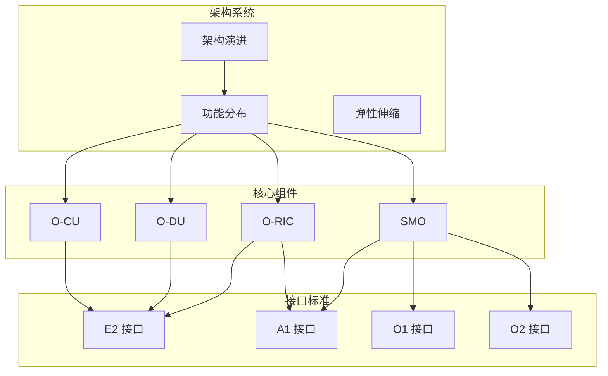
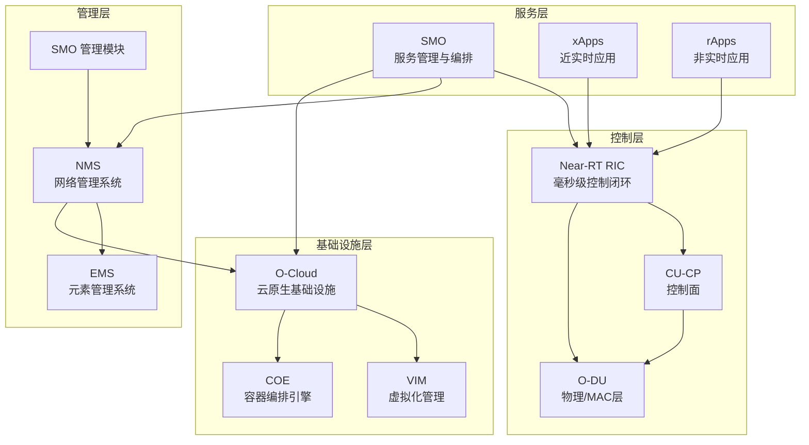
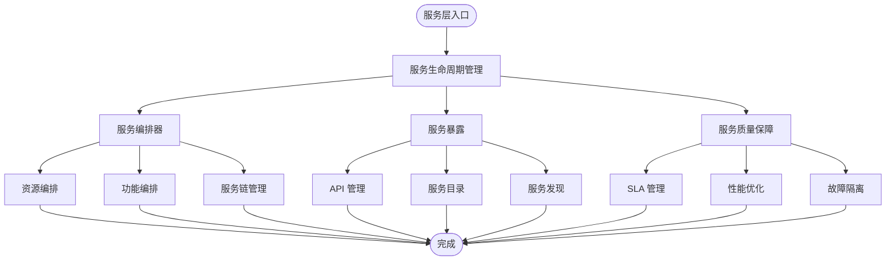
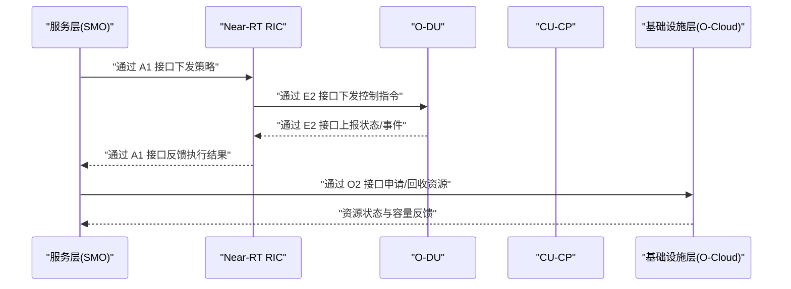
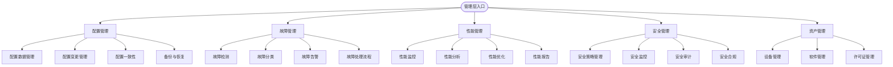
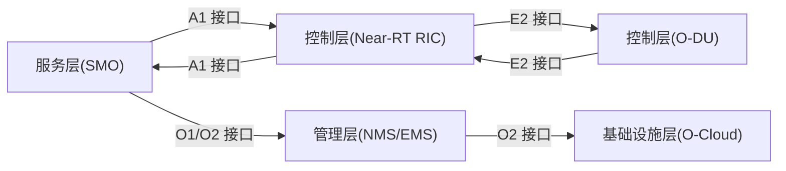

# 分层架构

<cite>
**本文引用的文件**
- [架构演进](file://01-architecture-system/architecture-evolution.md)
- [功能分布](file://01-architecture-system/functional-distribution.md)
- [O-RAN 基础知识](file://01-architecture-system/readme.md)
- [E2 接口](file://03-interface-standards/e2-interface.md)
- [O-CU](file://02-core-components/o-cu.md)
- [O-DU](file://02-core-components/o-du.md)
- [O-RIC](file://02-core-components/o-ric.md)
- [综合术语表](file://comprehensive-oran-glossary.md)
</cite>

## 目录
1. [引言](#引言)
2. [项目结构](#项目结构)
3. [核心组件](#核心组件)
4. [架构总览](#架构总览)
5. [详细组件分析](#详细组件分析)
6. [依赖分析](#依赖分析)
7. [性能考虑](#性能考虑)
8. [故障排查指南](#故障排查指南)
9. [结论](#结论)
10. [附录](#附录)

## 引言
本文件围绕 O-RAN 参考架构的三层设计原理，系统阐述服务层（Service Layer）、控制层（Control Layer）与管理层（Management Layer）的职责边界、技术实现方式与跨层交互关系，并结合核心网络元素与接口标准，说明分层架构如何实现功能解耦、提升系统灵活性与可扩展性。文档同时提供分层架构图与组件说明，辅以典型应用场景与最佳实践案例，帮助读者在工程实践中有效落地。

## 项目结构
本仓库围绕 O-RAN 的“架构系统”“核心组件”“接口标准”等主题组织内容，其中与分层架构直接相关的内容主要集中在“架构系统”与“核心组件”两大板块：
- 架构系统：包含架构演进、功能分布、弹性伸缩等主题，明确三层划分与职责边界
- 核心组件：涵盖 CU、DU、RU、RIC、SMO 等关键网元，体现各层在网元层面的职责落位
- 接口标准：以 E2、A1、O1、O2 等接口为纽带，支撑跨层交互与协同

图表来源
- [架构演进](file://01-architecture-system/architecture-evolution.md#L1-L183)
- [功能分布](file://01-architecture-system/functional-distribution.md#L1-L325)
- [O-CU](file://02-core-components/o-cu.md#L1-L419)
- [O-DU](file://02-core-components/o-du.md#L1-L415)
- [O-RIC](file://02-core-components/o-ric.md#L1-L437)
- [E2 接口](file://03-interface-standards/e2-interface.md#L1-L337)

章节来源
- [O-RAN 基础知识](file://01-architecture-system/readme.md#L1-L161)

## 核心组件
本节聚焦三层架构在核心网元上的职责落位与边界划分：
- 服务层：以 SMO 为核心，负责网络服务生命周期管理、编排与暴露，向上对接业务与应用，向下通过 A1/O1/O2 接口与控制层/管理层交互
- 控制层：以 Near-RT RIC 与 CU/DU 为代表，负责实时控制、策略执行、资源调度与故障处理，通过 E2/A1 接口与服务层/管理层协同
- 管理层：以 EMS/NMS/SMO 管理模块为代表，负责配置、故障、性能、安全与资产管理，通过 O1/O2 接口与基础设施层交互

章节来源
- [功能分布](file://01-architecture-system/functional-distribution.md#L7-L325)
- [O-RIC](file://02-core-components/o-ric.md#L1-L437)
- [O-CU](file://02-core-components/o-cu.md#L1-L419)
- [O-DU](file://02-core-components/o-du.md#L1-L415)

## 架构总览
O-RAN 分层架构通过清晰的职责边界与标准化接口，实现三层之间的松耦合与协同：
- 服务层：业务与应用导向，提供服务编排、SLA 保障与服务暴露
- 控制层：网络智能化核心，负责实时控制、策略管理与资源调度
- 管理层：配置、监控与维护，保障网络生命周期与资产安全
- 基础设施层：提供计算、存储、网络与容器化资源，支撑三层运行

图表来源
- [功能分布](file://01-architecture-system/functional-distribution.md#L197-L245)
- [O-RIC](file://02-core-components/o-ric.md#L7-L133)
- [O-CU](file://02-core-components/o-cu.md#L49-L121)
- [O-DU](file://02-core-components/o-du.md#L68-L86)

## 详细组件分析

### 服务层（Service Layer）
- 职责边界
  - 业务与应用编排：服务创建、修改、删除、监控与 SLA 管理
  - 资源编排：按需编排计算、存储与网络资源
  - 服务暴露：标准化 API、服务目录与服务发现
  - 质量保障：性能优化与故障隔离
- 关键组件
  - SMO：网络服务生命周期与资源编排；与控制层通过 A1 接口交互，与基础设施层通过 O2 接口交互
  - 应用层（xApps/rApps）：近实时与非实时网络应用，分别通过 E2 与 Non-RT RIC 交互
- 生产环境考量
  - 服务模板标准化、编排自动化、依赖管理与版本管理

图表来源
- [功能分布](file://01-architecture-system/functional-distribution.md#L9-L47)

章节来源
- [功能分布](file://01-architecture-system/functional-distribution.md#L7-L47)
- [综合术语表](file://comprehensive-oran-glossary.md#L493-L506)

### 控制层（Control Layer）
- 职责边界
  - 网络控制：资源分配、会话与移动性管理、安全控制
  - 策略管理：策略制定、执行、评估与优化
  - 资源调度：动态调度、负载均衡与资源预留
  - 故障处理：检测、定位、恢复与预防
- 关键组件
  - Near-RT RIC：毫秒级实时控制与优化，xApps 运行环境，E2 接口服务
  - Non-RT RIC：秒至分钟级策略管理与规划，rApps 运行环境，A1 接口服务
  - CU-CP：RRC、NG 接口控制面与 F1-C 接口控制面
  - O-DU：物理层与部分 MAC 层，实时性要求高，E2 接口服务
- 生产环境考量
  - 控制延迟优化、策略冲突检测、控制平面冗余与可扩展性

图表来源
- [功能分布](file://01-architecture-system/functional-distribution.md#L197-L221)
- [O-RIC](file://02-core-components/o-ric.md#L7-L71)
- [O-DU](file://02-core-components/o-du.md#L82-L85)
- [O-CU](file://02-core-components/o-cu.md#L23-L27)

章节来源
- [功能分布](file://01-architecture-system/functional-distribution.md#L49-L93)
- [O-RIC](file://02-core-components/o-ric.md#L1-L133)
- [O-DU](file://02-core-components/o-du.md#L1-L86)
- [O-CU](file://02-core-components/o-cu.md#L1-L61)

### 管理层（Management Layer）
- 职责边界
  - 配置管理：配置数据、变更、一致性与备份恢复
  - 故障管理：检测、分类、告警与处理流程
  - 性能管理：监控、分析、优化与报告
  - 安全管理：策略、监控、审计与合规
  - 资产管理：设备、软件与许可证管理
- 关键组件
  - SMO 管理模块：网络服务与资源管理，O1 接口交互
  - EMS：具体网元管理
  - NMS：全网管理与系统集成
  - 安全管理系统：安全策略与合规
- 生产环境考量
  - 管理平面安全、系统集成、数据一致性与可扩展性

图表来源
- [功能分布](file://01-architecture-system/functional-distribution.md#L94-L144)

章节来源
- [功能分布](file://01-architecture-system/functional-distribution.md#L94-L144)

### 基础设施层（Infrastructure Layer）
- 职责边界
  - 计算资源：虚拟机/容器管理、资源调度与监控
  - 存储资源：存储池、卷、快照与备份
  - 网络资源：虚拟网络、策略、QoS 与安全
  - 虚拟化与容器：虚拟化基础设施、镜像与模板管理
- 关键组件
  - O-Cloud：云原生基础设施平台，O2 接口交互
  - VIM：虚拟化资源管理
  - COE：容器编排（如 Kubernetes）
  - 存储与网络系统：提供存储与网络服务
- 生产环境考量
  - 资源池化、隔离、弹性与监控

章节来源
- [功能分布](file://01-architecture-system/functional-distribution.md#L145-L196)

## 依赖分析
三层之间的交互通过标准化接口实现，形成清晰的依赖链与协同机制：
- 服务层与控制层：A1 接口策略下发与反馈，服务暴露接口能力提供
- 控制层与管理层：O1/O2 接口配置与资源管理指令下发，状态与事件上报
- 管理层与基础设施层：O2 接口资源管理指令与状态上报

图表来源
- [功能分布](file://01-architecture-system/functional-distribution.md#L197-L221)
- [O-RIC](file://02-core-components/o-ric.md#L47-L51)
- [O-DU](file://02-core-components/o-du.md#L82-L85)
- [O-CU](file://02-core-components/o-cu.md#L23-L27)

章节来源
- [功能分布](file://01-architecture-system/functional-distribution.md#L197-L245)

## 性能考虑
- 三层解耦带来的性能收益
  - 服务层：通过编排与 SLA 管理，保障端到端服务质量
  - 控制层：近实时闭环控制与策略优化，满足低延迟与高可靠
  - 管理层：集中配置与全网监控，提升运维效率与资源利用率
- 接口与网元层面的性能优化
  - E2 接口：SCTP/STREAMS 协议栈优化、消息压缩与批量处理、网络加速
  - O-DU：物理层与 MAC 层参数优化、确定性网络与负载均衡
  - O-RIC：Near-RT 低延迟处理、Non-RT 数据分析与机器学习优化
- 弹性与扩展性
  - 云原生基础设施支持自动扩缩容与容器编排
  - 分布式部署降低延迟，集中式部署提升管理效率

章节来源
- [E2 接口](file://03-interface-standards/e2-interface.md#L131-L147)
- [O-DU](file://02-core-components/o-du.md#L289-L307)
- [O-RIC](file://02-core-components/o-ric.md#L283-L296)
- [架构演进](file://01-architecture-system/architecture-evolution.md#L58-L65)

## 故障排查指南
- 服务层
  - 关注服务生命周期异常、编排失败与 SLA 不达标
  - 建议：检查服务模板、依赖关系与版本管理
- 控制层
  - 关注 E2 接口连接状态、消息延迟与服务调用成功率
  - 建议：使用告警分级与关联分析，结合日志与信令分析定位
- 管理层
  - 关注配置一致性、变更流程与备份恢复
  - 建议：建立配置基线与变更回滚机制
- 基础设施层
  - 关注资源利用率、隔离与弹性能力
  - 建议：监控与容量规划联动，实施自动扩缩容

章节来源
- [功能分布](file://01-architecture-system/functional-distribution.md#L247-L325)
- [E2 接口](file://03-interface-standards/e2-interface.md#L148-L201)
- [O-DU](file://02-core-components/o-du.md#L224-L282)
- [O-RIC](file://02-core-components/o-ric.md#L214-L282)

## 结论
O-RAN 分层架构通过服务层、控制层与管理层的职责划分与标准化接口，实现了功能解耦与跨层协同，显著提升了系统的灵活性、可扩展性与可运维性。结合核心网元与接口标准，工程实践中应重点关注三层边界、接口性能与自动化运维，以达成端到端的服务质量目标与业务创新需求。

## 附录
- 典型应用场景
  - 智能交通：Near-RT RIC 实时信号控制，Non-RT RIC 长期优化，SMO 统一编排
  - 边缘制造：O-DU 低延迟处理，O-RIC xApps 实时优化，SMO 资源编排
- 最佳实践
  - 服务层：模板化与自动化编排、SLA 与故障隔离
  - 控制层：分布式部署与近实时闭环、策略冲突检测与冗余设计
  - 管理层：统一监控与告警、配置基线与变更流程
  - 基础设施层：资源池化与弹性、容器化与自动扩缩容

章节来源
- [功能分布](file://01-architecture-system/functional-distribution.md#L280-L325)
- [O-RIC](file://02-core-components/o-ric.md#L389-L431)
- [O-DU](file://02-core-components/o-du.md#L370-L410)