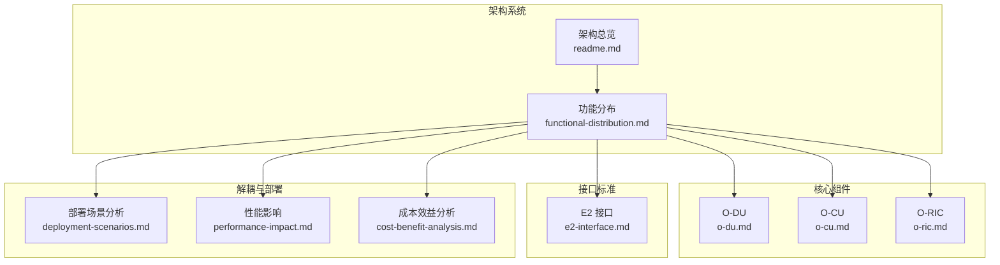
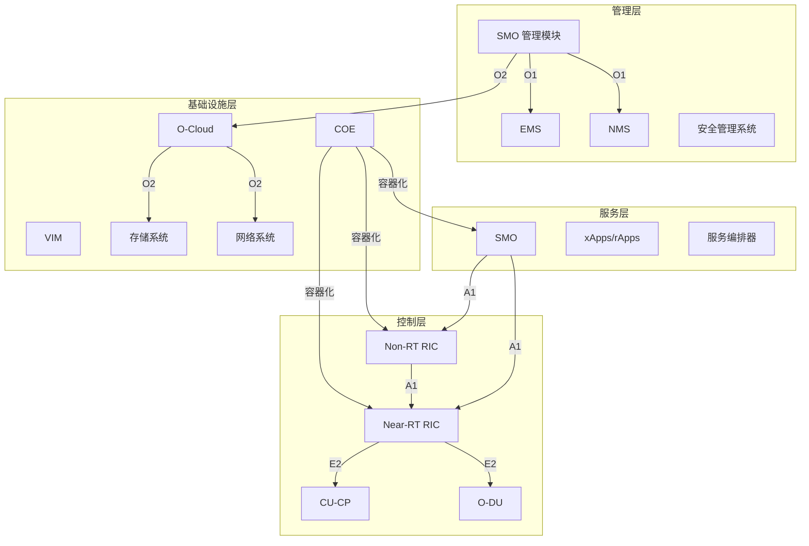
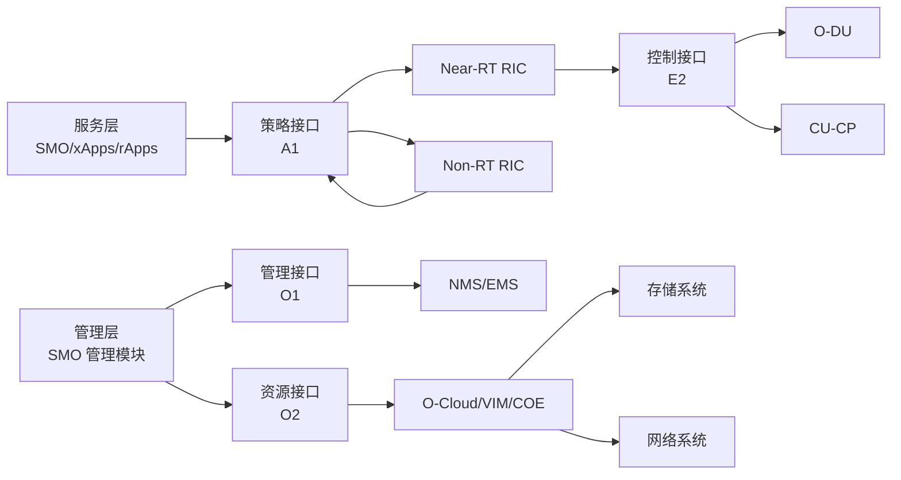
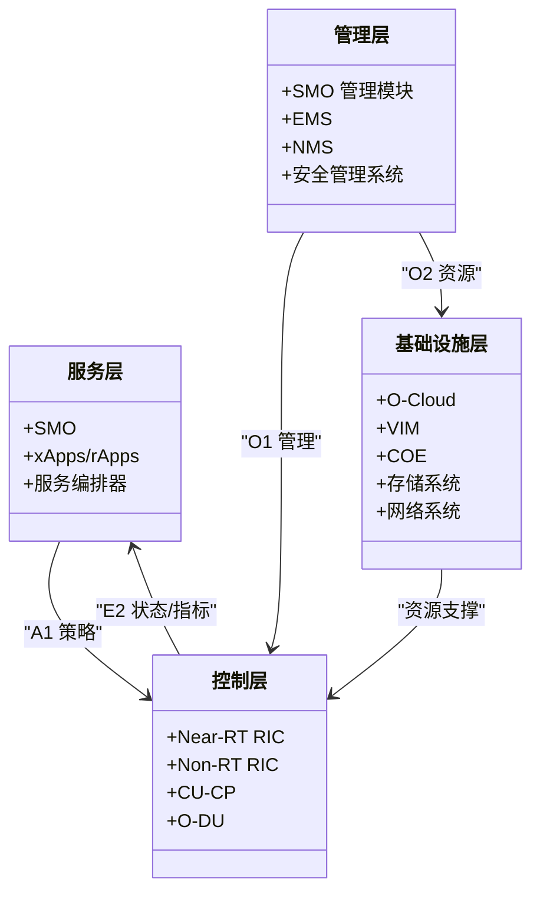

# 功能分布

<cite>
**本文引用的文件**
- [O-RAN 功能分布](file://01-architecture-system/functional-distribution.md)
- [O-RAN 架构系统总览](file://01-architecture-system/readme.md)
- [部署场景分析](file://04-disaggregation-options/deployment-scenarios.md)
- [解耦选项的性能影响](file://04-disaggregation-options/performance-impact.md)
- [解耦方案的成本效益分析](file://04-disaggregation-options/cost-benefit-analysis.md)
- [分布式单元 (O-DU)](file://02-core-components/o-du.md)
- [集中式单元 (O-CU)](file://02-core-components/o-cu.md)
- [RAN 智能控制器 (O-RIC)](file://02-core-components/o-ric.md)
- [E2 接口](file://03-interface-standards/e2-interface.md)
</cite>

## 目录
1. [引言](#引言)
2. [项目结构](#项目结构)
3. [核心组件](#核心组件)
4. [架构总览](#架构总览)
5. [详细组件分析](#详细组件分析)
6. [依赖分析](#依赖分析)
7. [性能考量](#性能考量)
8. [故障排查指南](#故障排查指南)
9. [结论](#结论)
10. [附录](#附录)

## 引言
本文件围绕 O-RAN 架构的功能分布展开，系统阐述服务层、控制层、管理层各自的职责边界与交互机制，解释如何通过灵活的功能分布实现网络功能的组合与动态调整，并评估其对网络性能与总体拥有成本（TCO）的影响。同时，结合不同部署场景与解耦选项，给出可操作的方案选择与优化建议，帮助读者建立从架构到落地的完整认知。

## 项目结构
本仓库以主题域组织内容，功能分布相关内容主要集中在“架构系统”“核心组件”“接口标准”“解耦与部署”等章节。下图给出与功能分布直接相关的知识域与文件映射关系。

图表来源
- [O-RAN 功能分布](file://01-architecture-system/functional-distribution.md#L1-L325)
- [O-RAN 架构系统总览](file://01-architecture-system/readme.md#L1-L161)
- [部署场景分析](file://04-disaggregation-options/deployment-scenarios.md#L1-L563)
- [解耦选项的性能影响](file://04-disaggregation-options/performance-impact.md#L1-L365)
- [解耦方案的成本效益分析](file://04-disaggregation-options/cost-benefit-analysis.md#L1-L418)
- [分布式单元 (O-DU)](file://02-core-components/o-du.md#L1-L415)
- [集中式单元 (O-CU)](file://02-core-components/o-cu.md#L1-L419)
- [RAN 智能控制器 (O-RIC)](file://02-core-components/o-ric.md#L1-L437)
- [E2 接口](file://03-interface-standards/e2-interface.md#L1-L337)

章节来源
- [O-RAN 功能分布](file://01-architecture-system/functional-distribution.md#L1-L325)
- [O-RAN 架构系统总览](file://01-architecture-system/readme.md#L1-L161)

## 核心组件
本节聚焦三层功能分布的职责边界与关键组件，以及跨层交互机制与生产实践要点。

- 服务层
  - 职责：网络服务生命周期管理、服务编排、服务暴露、服务质量保障
  - 关键组件：SMO（服务管理与编排）、xApps/rApps、服务编排器
  - 交互：通过 A1 接口向控制层下发策略，通过服务暴露接口向控制层提供能力

- 控制层
  - 职责：网络控制、策略管理、资源调度、故障处理
  - 关键组件：Near-RT RIC（毫秒级控制）、Non-RT RIC（秒至分钟级策略）、CU-CP（控制面）
  - 交互：通过 E2 接口与 DU/CU 交互，通过 A1 接口与 SMO/Other RIC 交互

- 管理层
  - 职责：配置管理、故障管理、性能管理、安全管理、资产管理
  - 关键组件：SMO 管理模块、EMS、NMS、安全管理系统
  - 交互：通过 O1 接口管理其他网络元素

- 基础设施层
  - 职责：计算/存储/网络资源管理、虚拟化与容器管理
  - 关键组件：O-Cloud、VIM、COE、存储系统、网络系统
  - 交互：通过 O2 接口被管理层调度

章节来源
- [O-RAN 功能分布](file://01-architecture-system/functional-distribution.md#L7-L196)

## 架构总览
下图展示三层功能分布与核心网络元素、接口的关系，体现“服务-控制-管理-基础设施”的协同与边界。

图表来源
- [O-RAN 功能分布](file://01-architecture-system/functional-distribution.md#L197-L246)
- [O-RAN 架构系统总览](file://01-architecture-system/readme.md#L27-L34)
- [E2 接口](file://03-interface-standards/e2-interface.md#L74-L89)
- [RAN 智能控制器 (O-RIC)](file://02-core-components/o-ric.md#L7-L58)
- [集中式单元 (O-CU)](file://02-core-components/o-cu.md#L49-L61)
- [分布式单元 (O-DU)](file://02-core-components/o-du.md#L68-L86)

## 详细组件分析

### 服务层：SMO、xApps/rApps、服务编排器
- 职责边界
  - 生命周期管理：创建/修改/删除/监控
  - 资源编排：按需编排计算/存储/网络
  - 服务暴露：API 管理、服务目录、服务发现
  - 质量保障：SLA 管理、性能优化、故障隔离
- 生产实践
  - 服务模板标准化、编排自动化、依赖与版本管理
- 与控制层交互
  - 通过 A1 接口下发策略，接收执行结果与状态

章节来源
- [O-RAN 功能分布](file://01-architecture-system/functional-distribution.md#L9-L47)
- [O-RAN 架构系统总览](file://01-architecture-system/readme.md#L24-L25)

### 控制层：Near-RT RIC、Non-RT RIC、CU-CP、DU
- Near-RT RIC
  - 实时控制闭环（毫秒级），部署 xApps，通过 E2 接口与 DU/CU 交互
- Non-RT RIC
  - 策略管理与规划（秒至分钟级），部署 rApps，通过 A1 接口与 Near-RT RIC 交互
- CU-CP
  - 控制面功能（RRC、NG 接口控制面、F1 接口控制面）
- DU
  - 物理层与部分 MAC 层处理，实时性要求高，通过 F1/O-FH/E2 接口与上下层交互

章节来源
- [O-RAN 功能分布](file://01-architecture-system/functional-distribution.md#L49-L93)
- [RAN 智能控制器 (O-RIC)](file://02-core-components/o-ric.md#L7-L58)
- [集中式单元 (O-CU)](file://02-core-components/o-cu.md#L7-L61)
- [分布式单元 (O-DU)](file://02-core-components/o-du.md#L7-L86)

### 管理层：SMO 管理模块、EMS、NMS、安全管理系统
- 职责边界
  - 配置/故障/性能/安全/资产全生命周期管理
- 交互机制
  - 通过 O1 接口管理其他网络元素，向上承接服务层目标，向下驱动基础设施层资源

章节来源
- [O-RAN 功能分布](file://01-architecture-system/functional-distribution.md#L94-L143)

### 基础设施层：O-Cloud、VIM、COE、存储/网络系统
- 职责边界
  - 虚拟化与容器编排、计算/存储/网络资源池化与弹性
- 交互机制
  - 通过 O2 接口被管理层调度，支撑服务层与控制层的运行

章节来源
- [O-RAN 功能分布](file://01-architecture-system/functional-distribution.md#L145-L196)

### 跨层交互与职责边界
- 交互机制
  - 服务层与控制层：A1 下发策略，E2 反馈状态
  - 控制层与管理层：O1 管理接口，O2 资源调度
  - 管理层与基础设施层：O2 资源管理，O1 网元管理
- 职责边界
  - 服务层：业务与编排，不直接管资源
  - 控制层：控制与策略执行，不直接管基础设施
  - 管理层：配置/监控/维护，不直接参与业务逻辑
  - 基础设施层：资源提供与隔离，不参与上层业务决策

章节来源
- [O-RAN 功能分布](file://01-architecture-system/functional-distribution.md#L197-L246)

### 功能分布的动态调整与最佳实践
- 设计原则：模块化、松耦合、标准化接口、服务化
- 部署策略：集中式/分布式/混合式
- 动态调整：基于负载、业务、位置、时间

章节来源
- [O-RAN 功能分布](file://01-architecture-system/functional-distribution.md#L247-L279)

## 依赖分析
下图展示功能分布与核心网络元素、接口之间的依赖关系，强调 E2/A1/O1/O2 的跨层协同。

图表来源
- [O-RAN 功能分布](file://01-architecture-system/functional-distribution.md#L197-L246)
- [E2 接口](file://03-interface-standards/e2-interface.md#L74-L89)
- [RAN 智能控制器 (O-RIC)](file://02-core-components/o-ric.md#L7-L58)
- [集中式单元 (O-CU)](file://02-core-components/o-cu.md#L49-L61)
- [分布式单元 (O-DU)](file://02-core-components/o-du.md#L68-L86)

## 性能考量
- 延迟
  - Split Option 与部署方式对端到端延迟影响显著，分布式部署通常优于集中式部署
  - Near-RT RIC 的 E2 接口延迟需控制在毫秒级
- 带宽
  - 不同 Split Option 与前传分割点带来差异化的带宽需求，需结合传输技术与拓扑规划
- 同步
  - O-RU 同步精度要求高，建议采用 PTP/SyncE 架构，必要时采用分层/混合同步
- 虚拟化与加速
  - 虚拟化存在一定性能开销，可通过容器化、硬件加速（GPU/FPGA/ASIC）优化

章节来源
- [解耦选项的性能影响](file://04-disaggregation-options/performance-impact.md#L7-L365)
- [E2 接口](file://03-interface-standards/e2-interface.md#L90-L147)

## 故障排查指南
- 服务层
  - 关注服务生命周期异常、编排失败、API 不可达、SLA 不达标
- 控制层
  - E2 接口连接/消息异常、xApps/rApps 运行异常、DU/CU-CP 性能劣化
- 管理层
  - O1 接口异常、配置不一致、告警风暴
- 基础设施层
  - O2 接口异常、资源不足、存储/网络故障

章节来源
- [O-RAN 功能分布](file://01-architecture-system/functional-distribution.md#L197-L246)
- [E2 接口](file://03-interface-standards/e2-interface.md#L148-L201)

## 结论
O-RAN 的功能分布通过清晰的三层职责边界与标准化接口，实现了网络功能的灵活组合与动态调整。在生产实践中，应结合业务需求、网络条件与成本约束，选择合适的解耦选项与部署策略，并通过性能优化与运维自动化持续提升网络的可靠性、性能与成本效益。

## 附录

### 不同部署场景与解耦选项的权衡
- 集中式部署
  - 优点：集中管理、资源共享；缺点：传输成本高、延迟大
- 分布式部署
  - 优点：低延迟、贴近用户；缺点：站点多、运维复杂
- 混合部署
  - 优点：平衡集中管理与边缘性能；缺点：复杂度较高
- 解耦选项（以 Split Option 为例）
  - Option 2：平衡延迟与灵活性，适合 eMBB
  - Option 7：物理层下沉，适合 URLLC，但带宽与同步要求更高

章节来源
- [部署场景分析](file://04-disaggregation-options/deployment-scenarios.md#L59-L214)
- [解耦选项的性能影响](file://04-disaggregation-options/performance-impact.md#L9-L75)
- [解耦方案的成本效益分析](file://04-disaggregation-options/cost-benefit-analysis.md#L48-L85)

### 功能分布与核心组件映射图

图表来源
- [O-RAN 功能分布](file://01-architecture-system/functional-distribution.md#L197-L246)
- [RAN 智能控制器 (O-RIC)](file://02-core-components/o-ric.md#L7-L58)
- [集中式单元 (O-CU)](file://02-core-components/o-cu.md#L49-L61)
- [分布式单元 (O-DU)](file://02-core-components/o-du.md#L68-L86)