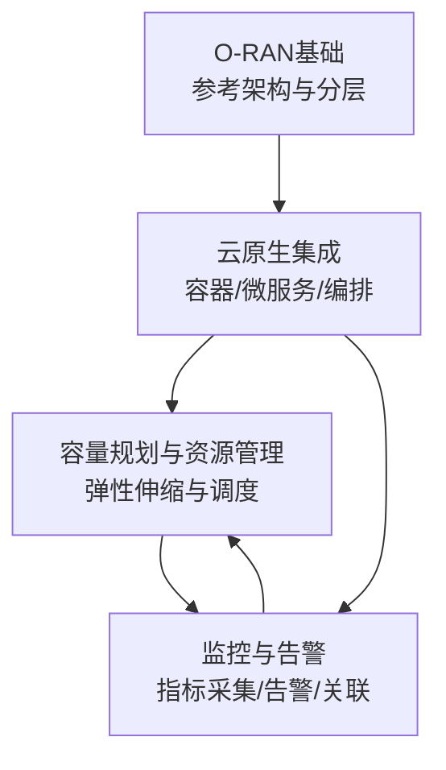
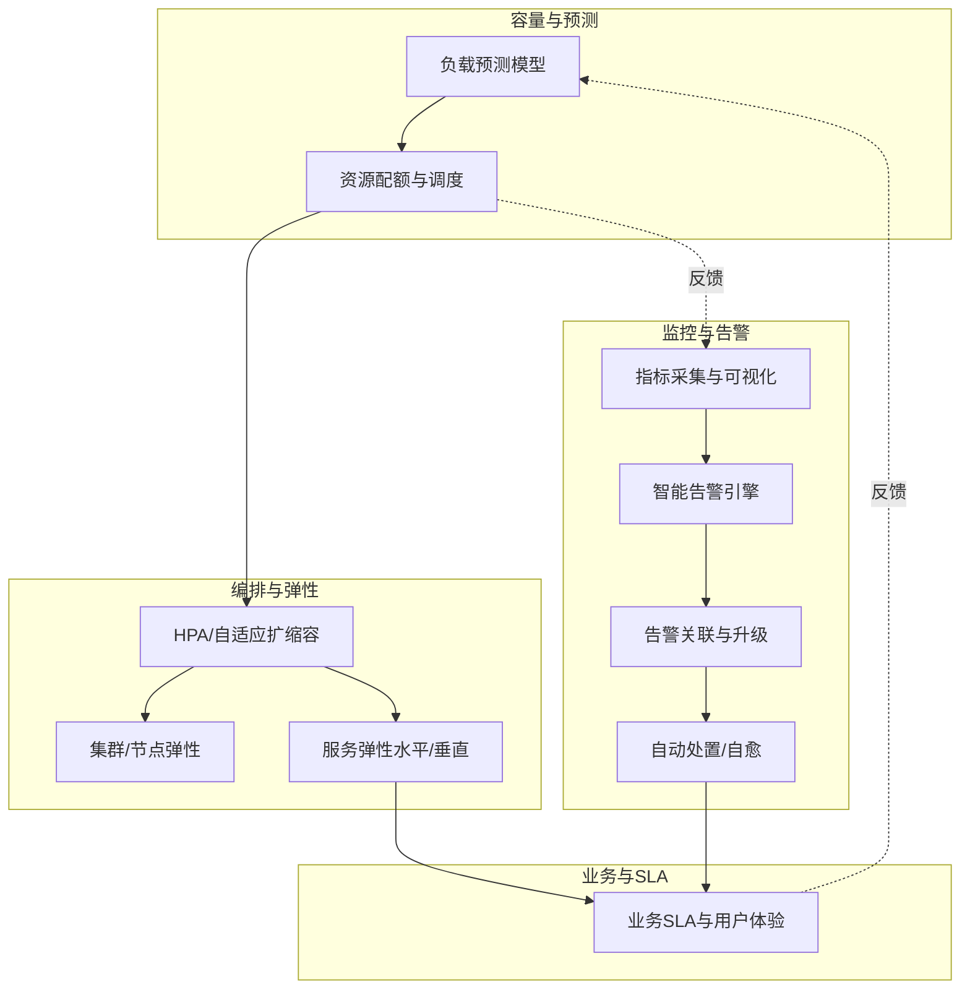
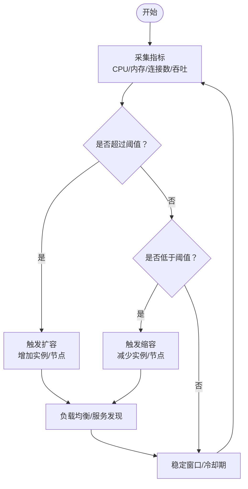
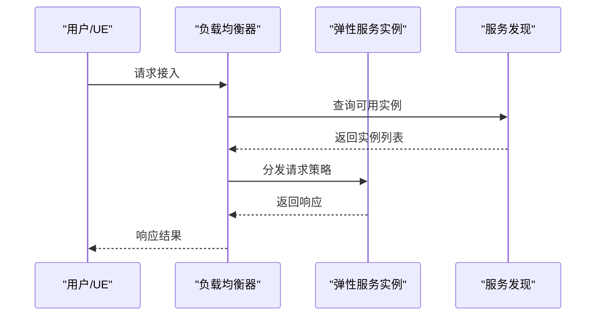
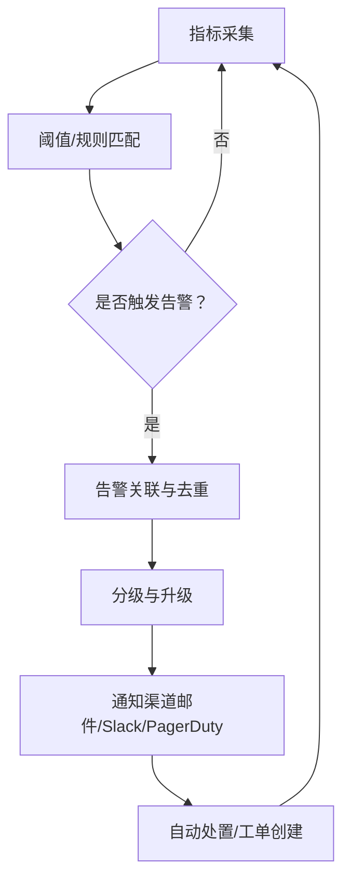
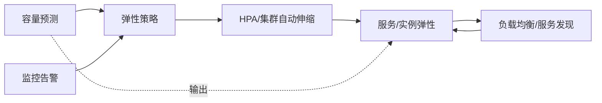
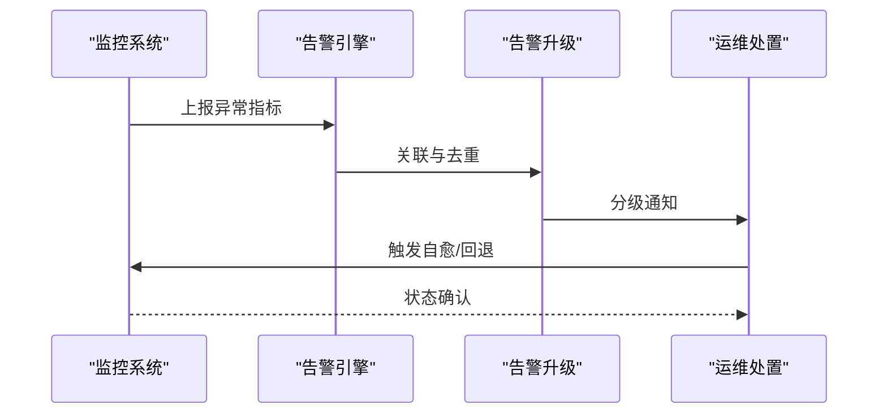

# 弹性扩展

<cite>
**本文引用的文件**
- [README（O-RAN基础）](file://01-architecture-system/readme.md)
- [云原生架构与O-RAN集成](file://05-cloud-integration/cloud-native-architecture.md)
- [O-RAN容量规划与资源管理](file://26-performance-optimization/capacity-planning/o-ran-capacity-planning.md)
- [O-RAN容量规划框架](file://14-operations-management/capacity-planning/capacity-planning-framework.md)
- [O-RAN监控系统](file://22-tool-platforms/monitoring-systems/o-ran-monitoring-systems.md)
- [运维监控框架](file://14-operations-management/monitoring-alerting/operations-monitoring-framework.md)
</cite>

## 目录
1. [简介](#简介)
2. [项目结构](#项目结构)
3. [核心组件](#核心组件)
4. [架构总览](#架构总览)
5. [详细组件分析](#详细组件分析)
6. [依赖分析](#依赖分析)
7. [性能考量](#性能考量)
8. [故障排查指南](#故障排查指南)
9. [结论](#结论)
10. [附录](#附录)

## 简介
本章节围绕O-RAN架构的弹性扩展能力进行系统化阐述，聚焦自动扩缩容、负载均衡、资源调度等核心机制，解释弹性扩展如何支撑网络流量动态变化与业务增长，并给出面向不同场景的扩展策略、监控指标、扩缩容触发条件与故障恢复机制。同时结合仓库中的云原生集成、容量规划与监控告警材料，形成可落地的实现方案与配置指南，并总结最佳实践。

## 项目结构
与弹性扩展直接相关的内容主要分布在以下主题域：
- 架构与基础：O-RAN参考架构、分层与功能分布、O-Cloud与弹性扩展原则
- 云原生集成：容器化、微服务、编排、自动化与基础设施即代码
- 容量规划与资源管理：负载预测、资源配额、弹性伸缩策略、性能优化
- 监控与告警：指标体系、智能告警引擎、告警关联与升级

**图表来源**
- [README（O-RAN基础）](file://01-architecture-system/readme.md#L1-L161)
- [云原生架构与O-RAN集成](file://05-cloud-integration/cloud-native-architecture.md#L1-L481)
- [O-RAN容量规划与资源管理](file://26-performance-optimization/capacity-planning/o-ran-capacity-planning.md#L1-L285)
- [O-RAN容量规划框架](file://14-operations-management/capacity-planning/capacity-planning-framework.md#L1-L505)
- [运维监控框架](file://14-operations-management/monitoring-alerting/operations-monitoring-framework.md#L262-L528)

**章节来源**
- [README（O-RAN基础）](file://01-architecture-system/readme.md#L1-L161)
- [云原生架构与O-RAN集成](file://05-cloud-integration/cloud-native-architecture.md#L1-L481)

## 核心组件
- 服务层（SMO、RIC、CU/DU等）的容器化与微服务化，支持按需弹性扩缩容与快速部署
- 控制层（Near-RT/Non-RT RIC）的智能控制与弹性调度，结合云原生监控进行自适应优化
- 管理层（配置与故障管理）的自动化与可观测性，保障弹性过程中的稳定性与可追溯性
- 基础设施层（O-Cloud）的容器编排与资源动态分配，实现跨区域、跨集群的弹性伸缩

这些能力共同构成O-RAN弹性扩展的基础：以云原生为手段，以容量规划为依据，以监控告警为闭环，实现“按需扩容、自动恢复、成本可控”的目标。

**章节来源**
- [云原生架构与O-RAN集成](file://05-cloud-integration/cloud-native-architecture.md#L65-L122)
- [O-RAN容量规划与资源管理](file://26-performance-optimization/capacity-planning/o-ran-capacity-planning.md#L146-L214)

## 架构总览
下图展示了弹性扩展在O-RAN中的端到端交互：从容量预测与资源配额出发，到编排层的自动扩缩容，再到监控告警的反馈与自愈，最终驱动业务SLA达标。

**图表来源**
- [O-RAN容量规划与资源管理](file://26-performance-optimization/capacity-planning/o-ran-capacity-planning.md#L6-L74)
- [O-RAN容量规划与资源管理](file://26-performance-optimization/capacity-planning/o-ran-capacity-planning.md#L76-L144)
- [O-RAN容量规划与资源管理](file://26-performance-optimization/capacity-planning/o-ran-capacity-planning.md#L146-L214)
- [O-RAN容量规划框架](file://14-operations-management/capacity-planning/capacity-planning-framework.md#L6-L186)
- [运维监控框架](file://14-operations-management/monitoring-alerting/operations-monitoring-framework.md#L262-L528)
- [O-RAN监控系统](file://22-tool-platforms/monitoring-systems/o-ran-monitoring-systems.md#L355-L413)

## 详细组件分析

### 自动扩缩容与弹性调度
- 资源配额与请求：通过Pod资源请求/限制、QoS类、配额约束，确保弹性过程中的公平性与稳定性
- 水平与垂直弹性：HPA基于CPU/内存/自定义指标进行横向扩缩；VPA提供资源推荐与限制调整；集群自动伸缩（Cluster Autoscaler）按需增减节点
- 工作负载弹性：针对Near-RT RIC、O-DU集群、CU池等关键组件，设定差异化阈值、缩放因子与冷却期，避免震荡
- 地理与层级弹性：多数据中心/边缘节点的弹性策略，结合服务发现与数据分区，实现就近与全局协同

**图表来源**
- [O-RAN容量规划与资源管理](file://26-performance-optimization/capacity-planning/o-ran-capacity-planning.md#L78-L144)
- [O-RAN容量规划与资源管理](file://26-performance-optimization/capacity-planning/o-ran-capacity-planning.md#L146-L214)
- [O-RAN容量规划框架](file://14-operations-management/capacity-planning/capacity-planning-framework.md#L230-L266)

**章节来源**
- [O-RAN容量规划与资源管理](file://26-performance-optimization/capacity-planning/o-ran-capacity-planning.md#L76-L144)
- [O-RAN容量规划与资源管理](file://26-performance-optimization/capacity-planning/o-ran-capacity-planning.md#L146-L214)
- [O-RAN容量规划框架](file://14-operations-management/capacity-planning/capacity-planning-framework.md#L188-L266)

### 负载均衡与服务发现
- 负载均衡算法：轮询、最少连接、IP哈希、加权分发等，适配不同流量特征
- 服务发现：DNS、API网关、服务网格、客户端侧LB，确保弹性后实例的透明接入
- 数据分区：数据库分片、缓存分区、消息队列分区，支撑水平扩展后的数据一致性与性能

**图表来源**
- [O-RAN容量规划与资源管理](file://26-performance-optimization/capacity-planning/o-ran-capacity-planning.md#L150-L172)

**章节来源**
- [O-RAN容量规划与资源管理](file://26-performance-optimization/capacity-planning/o-ran-capacity-planning.md#L150-L172)

### 监控指标与告警策略
- 指标体系：系统级（CPU/内存/磁盘/网络）、应用级（响应时间/TPS/错误率）、业务级（SLA/收入指标），并结合O-RAN特有指标（RIC响应时延、接口可用性等）
- 智能告警：阈值触发、趋势分析、相关性关联、分级升级，避免噪声与误报
- 告警联动：与自动处置流程对接，实现“发现-评估-处置-恢复”的闭环

**图表来源**
- [运维监控框架](file://14-operations-management/monitoring-alerting/operations-monitoring-framework.md#L262-L528)
- [O-RAN监控系统](file://22-tool-platforms/monitoring-systems/o-ran-monitoring-systems.md#L355-L413)

**章节来源**
- [运维监控框架](file://14-operations-management/monitoring-alerting/operations-monitoring-framework.md#L262-L528)
- [O-RAN监控系统](file://22-tool-platforms/monitoring-systems/o-ran-monitoring-systems.md#L355-L413)

### 扩展策略与场景化实践
- 集中式云部署：核心区域集中管理，高资源利用率与统一编排，适用于传输条件好、对延迟要求不严的场景
- 边缘云部署：边缘节点低延迟、靠近用户，满足严苛时延与边缘计算需求
- 混合云部署：核心/区域/边缘协同，兼顾集中管理与边缘性能，适合全国范围、业务差异大的运营商

**图表来源**
- [云原生架构与O-RAN集成](file://05-cloud-integration/cloud-native-architecture.md#L235-L296)

**章节来源**
- [云原生架构与O-RAN集成](file://05-cloud-integration/cloud-native-architecture.md#L235-L296)

## 依赖分析
弹性扩展涉及的关键依赖关系如下：
- 容量预测依赖历史指标与外部因素建模，为弹性策略提供输入
- 编排层依赖监控与告警的反馈，形成闭环
- 服务层弹性依赖稳定的负载均衡与服务发现机制
- 基础设施弹性依赖节点/集群的自动伸缩与资源池化

**图表来源**
- [O-RAN容量规划与资源管理](file://26-performance-optimization/capacity-planning/o-ran-capacity-planning.md#L6-L74)
- [O-RAN容量规划与资源管理](file://26-performance-optimization/capacity-planning/o-ran-capacity-planning.md#L76-L144)
- [O-RAN容量规划框架](file://14-operations-management/capacity-planning/capacity-planning-framework.md#L6-L186)
- [运维监控框架](file://14-operations-management/monitoring-alerting/operations-monitoring-framework.md#L262-L528)

**章节来源**
- [O-RAN容量规划与资源管理](file://26-performance-optimization/capacity-planning/o-ran-capacity-planning.md#L6-L74)
- [O-RAN容量规划框架](file://14-operations-management/capacity-planning/capacity-planning-framework.md#L6-L186)
- [运维监控框架](file://14-operations-management/monitoring-alerting/operations-monitoring-framework.md#L262-L528)

## 性能考量
- 实时性与延迟：Near-RT RIC与部分CU/DU对时延敏感，容器化需配合资源预留、网络优化（如SR-IOV/DPDK）与存储优化
- 可靠性与可用性：多副本、自动故障转移、状态管理与备份恢复，确保5个9以上的可用性目标
- 观测性与可诊断：统一监控、分布式追踪、告警聚合与可视化，支撑弹性过程的可观测与可诊断
- 成本与资源效率：通过Spot实例、预留实例、多云成本优化与容量规划自动化，平衡性能与成本

**章节来源**
- [云原生架构与O-RAN集成](file://05-cloud-integration/cloud-native-architecture.md#L123-L176)
- [云原生架构与O-RAN集成](file://05-cloud-integration/cloud-native-architecture.md#L342-L377)

## 故障排查指南
- 告警规则与阈值：结合基础设施、应用、网络、安全与业务维度，建立分级阈值与持续评估
- 告警关联与去重：通过时间/空间相关性与因果关系识别，减少噪声与误报
- 升级与通知：按严重级别路由至不同通道（邮件、Slack、PagerDuty），并联动自动处置
- 自愈与回退：在弹性过程中出现异常时，自动回滚、重启或降级，确保SLA与用户体验

**图表来源**
- [运维监控框架](file://14-operations-management/monitoring-alerting/operations-monitoring-framework.md#L262-L528)
- [O-RAN监控系统](file://22-tool-platforms/monitoring-systems/o-ran-monitoring-systems.md#L355-L413)

**章节来源**
- [运维监控框架](file://14-operations-management/monitoring-alerting/operations-monitoring-framework.md#L262-L528)
- [O-RAN监控系统](file://22-tool-platforms/monitoring-systems/o-ran-monitoring-systems.md#L355-L413)

## 结论
O-RAN弹性扩展以云原生为手段，以容量规划为依据，以监控告警为闭环，覆盖从预测、调度、弹性到自愈的完整链路。通过合理的扩缩容策略、负载均衡与服务发现、完善的监控与告警体系，可在保证SLA的前提下实现性能与成本的最优平衡，并支撑业务的动态增长与复杂场景的灵活适配。

## 附录
- 实施建议清单
  - 建立容量预测模型与SLA基线，明确弹性阈值与冷却期
  - 部署HPA/VPA/集群自动伸缩，结合服务网格与负载均衡
  - 完善监控指标体系与智能告警，打通告警关联与升级
  - 设计自愈与回退机制，确保弹性过程中的稳定性
  - 选择合适部署形态（集中/边缘/混合），匹配业务时延与覆盖需求

- 参考文件
  - [README（O-RAN基础）](file://01-architecture-system/readme.md#L1-L161)
  - [云原生架构与O-RAN集成](file://05-cloud-integration/cloud-native-architecture.md#L1-L481)
  - [O-RAN容量规划与资源管理](file://26-performance-optimization/capacity-planning/o-ran-capacity-planning.md#L1-L285)
  - [O-RAN容量规划框架](file://14-operations-management/capacity-planning/capacity-planning-framework.md#L1-L505)
  - [运维监控框架](file://14-operations-management/monitoring-alerting/operations-monitoring-framework.md#L262-L528)
  - [O-RAN监控系统](file://22-tool-platforms/monitoring-systems/o-ran-monitoring-systems.md#L355-L413)