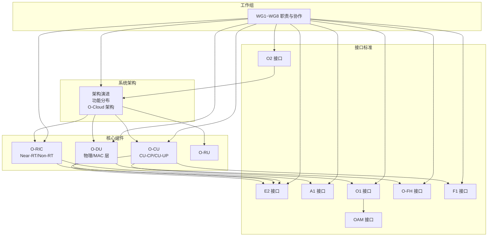
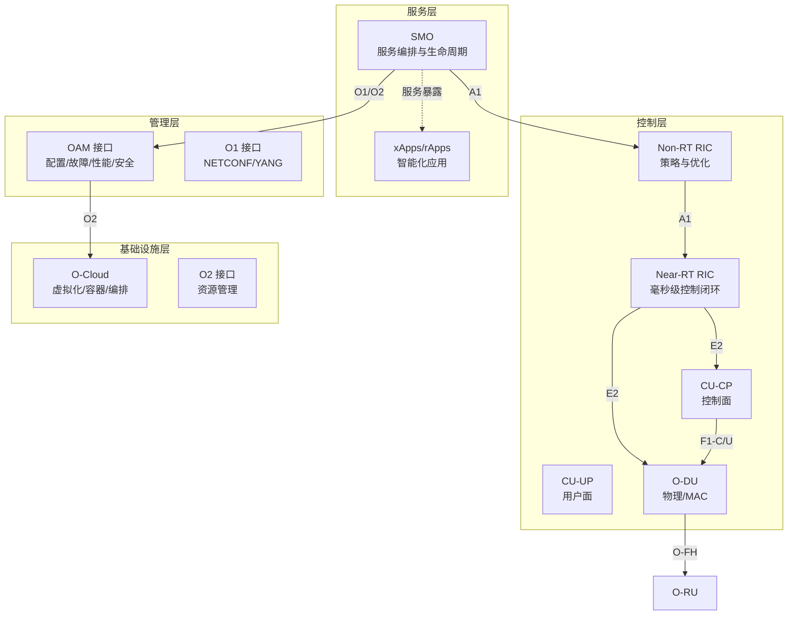
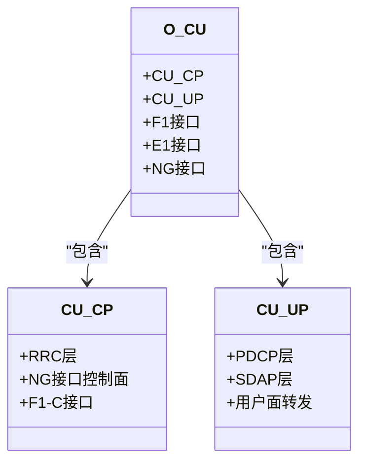
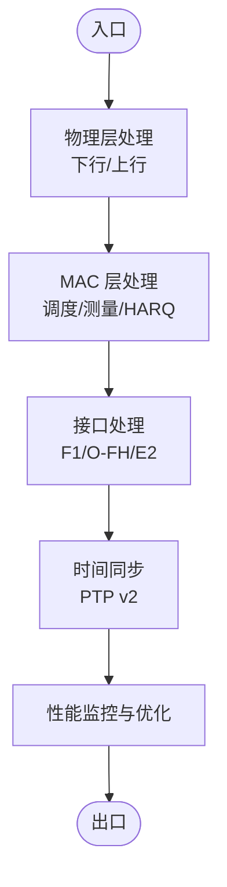
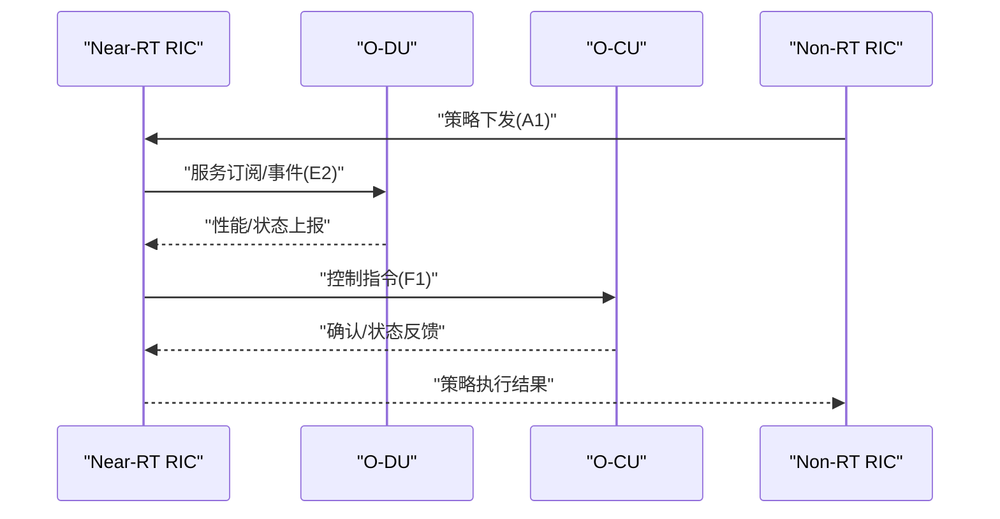
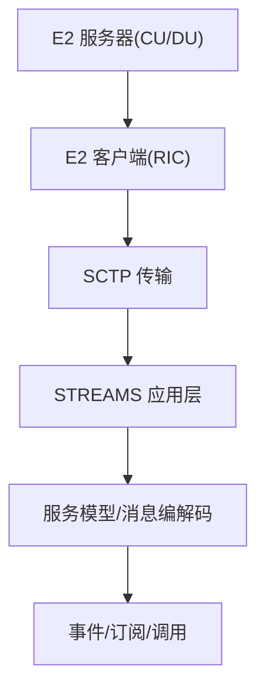
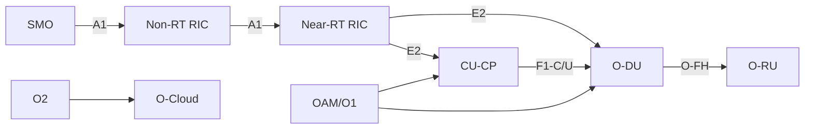

# 架构演进

<cite>
**本文引用的文件**
- [架构演进](file://01-architecture-system/architecture-evolution.md)
- [架构系统概览](file://01-architecture-system/readme.md)
- [O-Cloud 架构](file://01-architecture-system/o-cloud-architecture.md)
- [功能分布](file://01-architecture-system/functional-distribution.md)
- [O-CU](file://02-core-components/o-cu.md)
- [O-DU](file://02-core-components/o-du.md)
- [O-RIC](file://02-core-components/o-ric.md)
- [E2 接口](file://03-interface-standards/e2-interface.md)
- [工作组职责](file://06-working-groups/wg-detailed-responsibilities.md)
</cite>

## 目录
1. [引言](#引言)
2. [项目结构](#项目结构)
3. [核心组件](#核心组件)
4. [架构总览](#架构总览)
5. [详细组件分析](#详细组件分析)
6. [依赖分析](#依赖分析)
7. [性能考虑](#性能考虑)
8. [故障排查指南](#故障排查指南)
9. [结论](#结论)
10. [附录](#附录)

## 引言
本文件围绕 O-RAN 架构的演进历程与核心创新，系统对比传统 RAN 的垂直整合与 O-RAN 的水平解耦，梳理参考架构规范、关键里程碑与标准化进程，并总结 O-RAN 在成本控制、灵活性与生态开放性方面的优势及挑战。内容基于仓库内架构、接口、工作组等权威文档，帮助读者从系统视角把握 O-RAN 的技术脉络与落地实践。

## 项目结构
本仓库以“系统架构—核心组件—接口标准—工作组—部署与运维”为主线组织内容，形成从宏观到微观、从规范到实践的知识体系。重点章节如下：
- 系统架构：架构演进、功能分布、O-Cloud 基础设施
- 核心组件：O-CU、O-DU、O-RIC、O-RU 等
- 接口标准：E2、A1、O1、O-FH、F1、O2、OAM 等
- 工作组：WG1~WG8 的职责与协作机制
- 部署与运维：测试与互操作性、云原生集成、监控与告警

**图表来源**
- [架构演进](file://01-architecture-system/architecture-evolution.md#L1-L183)
- [架构系统概览](file://01-architecture-system/readme.md#L1-L161)
- [O-Cloud 架构](file://01-architecture-system/o-cloud-architecture.md#L1-L238)
- [功能分布](file://01-architecture-system/functional-distribution.md#L1-L325)
- [O-CU](file://02-core-components/o-cu.md#L1-L419)
- [O-DU](file://02-core-components/o-du.md#L1-L415)
- [O-RIC](file://02-core-components/o-ric.md#L1-L437)
- [E2 接口](file://03-interface-standards/e2-interface.md#L1-L337)
- [工作组职责](file://06-working-groups/wg-detailed-responsibilities.md#L1-L607)

**章节来源**
- [架构系统概览](file://01-architecture-system/readme.md#L1-L161)

## 核心组件
- O-CU：集中式处理单元，分为 CU-CP（控制面）与 CU-UP（用户面），承担 RRC、NG 接口、F1 接口控制面与用户面处理等职责；支持容器化与云原生部署。
- O-DU：分布式处理单元，负责物理层与部分 MAC 层功能，强调低延迟与高实时性；通过 F1 与 O-CU、O-FH 与 O-RU 互联。
- O-RIC：智能控制器，分为 Near-RT RIC（毫秒级闭环）与 Non-RT RIC（秒至分钟级策略），支撑 xApps/rApps 的部署与运行。
- O-RU：射频处理单元，完成数字前端与天线连接，承担同步与配置管理。

这些组件在功能分布与接口标准的约束下协同工作，形成控制面、用户面与智能控制的分层能力。

**章节来源**
- [O-CU](file://02-core-components/o-cu.md#L1-L419)
- [O-DU](file://02-core-components/o-du.md#L1-L415)
- [O-RIC](file://02-core-components/o-ric.md#L1-L437)
- [架构系统概览](file://01-architecture-system/readme.md#L15-L26)

## 架构总览
O-RAN 以“服务层—控制层—管理层—基础设施层”四层划分实现功能解耦与职责边界清晰，配合云原生与开放接口，支撑灵活部署与生态协作。O-Cloud 作为基础设施层，提供虚拟化、容器化与自动化编排能力，满足实时性、确定性与高可用性要求。

**图表来源**
- [功能分布](file://01-architecture-system/functional-distribution.md#L7-L246)
- [O-Cloud 架构](file://01-architecture-system/o-cloud-architecture.md#L1-L238)
- [架构系统概览](file://01-architecture-system/readme.md#L27-L35)

**章节来源**
- [功能分布](file://01-architecture-system/functional-distribution.md#L1-L325)
- [O-Cloud 架构](file://01-architecture-system/o-cloud-architecture.md#L1-L238)
- [架构系统概览](file://01-architecture-system/readme.md#L1-L161)

## 详细组件分析

### O-CU：集中式控制与用户面分离
- 职责边界：CU-CP 负责 RRC、NG 接口与 F1 控制面；CU-UP 负责 PDCP/SDAP 与用户面转发。
- 接口与协议：F1-C/U、E1、NG 接口，采用 SCTP/GTP-U 等协议栈。
- 部署与运维：支持集中/分布式/混合部署；关注容量规划、监控告警、配置一致性与性能优化。

**图表来源**
- [O-CU](file://02-core-components/o-cu.md#L7-L121)

**章节来源**
- [O-CU](file://02-core-components/o-cu.md#L1-L419)

### O-DU：物理层与 MAC 层的实时处理
- 职责边界：下行/上行物理层处理、MAC 层调度与测量，强调毫秒级延迟与高可靠性。
- 接口与协议：F1 接口（控制面/用户面）、O-FH 接口（eCPRI/RoE）、E2 接口（与 RIC）。
- 部署与运维：硬件选型（CPU/DSP/FPGA）、前传/中传网络规划、同步（PTP v2）、容量与性能优化。

**图表来源**
- [O-DU](file://02-core-components/o-du.md#L7-L86)

**章节来源**
- [O-DU](file://02-core-components/o-du.md#L1-L415)

### O-RIC：近实时与非实时协同
- Near-RT RIC：毫秒级闭环，支撑 xApps 部署与 E2 接口服务模型；强调低延迟与高可用。
- Non-RT RIC：秒至分钟级策略管理，支撑 rApps 与 A1 接口；强调数据分析与长期优化。
- 部署与运维：容器化与微服务架构、接口与应用生命周期管理、安全与容量规划。

**图表来源**
- [O-RIC](file://02-core-components/o-ric.md#L7-L72)
- [E2 接口](file://03-interface-standards/e2-interface.md#L7-L62)

**章节来源**
- [O-RIC](file://02-core-components/o-ric.md#L1-L437)
- [E2 接口](file://03-interface-standards/e2-interface.md#L1-L337)

### E2 接口：基于 SCTP/STREAMS 的服务化
- 功能：服务发现、服务调用、事件通知、订阅管理；基于 SCTP/STREAMS 协议栈。
- 部署与运维：网络规划（带宽/延迟/QoS）、部署架构（集中/分布式/混合）、性能优化（SCTP 参数、消息压缩、网络加速）、安全与版本管理。

**图表来源**
- [E2 接口](file://03-interface-standards/e2-interface.md#L63-L90)

**章节来源**
- [E2 接口](file://03-interface-standards/e2-interface.md#L1-L337)

### O-Cloud：云原生基础设施层
- 组成：计算/存储/网络/管理层/编排层；技术栈涵盖虚拟化、容器、编排、监控与自动化。
- 设计考量：性能优化（计算/存储/网络）、可靠性设计（硬件/软件冗余、故障检测与恢复）、安全性设计（网络/主机/数据）、可扩展性设计（水平/垂直/模块化）。
- 最佳实践：基础设施即代码、监控与告警、自动化运维、容量规划与灾备。

**章节来源**
- [O-Cloud 架构](file://01-architecture-system/o-cloud-architecture.md#L1-L238)

## 依赖分析
- 层间依赖：服务层经 A1 下发策略至控制层；控制层经 E2 与 O-DU/O-CU 交互；管理层经 O1/O2 管理控制与基础设施；基础设施层为上层提供资源与编排。
- 组件耦合：O-DU 与 O-RU 通过 O-FH 接口耦合，O-CU 与 O-DU 通过 F1 接口耦合；O-RIC 与 O-DU/O-CU 通过 E2 接口耦合。
- 外部依赖：3GPP 核心功能与接口定义，O-RAN 联盟工作组细化开放接口与智能化能力。

**图表来源**
- [功能分布](file://01-architecture-system/functional-distribution.md#L197-L222)
- [O-Cloud 架构](file://01-architecture-system/o-cloud-architecture.md#L1-L238)
- [架构系统概览](file://01-architecture-system/readme.md#L27-L35)

**章节来源**
- [功能分布](file://01-architecture-system/functional-distribution.md#L197-L246)
- [架构系统概览](file://01-architecture-system/readme.md#L1-L161)

## 性能考虑
- 实时性与确定性：O-DU 的物理层与 MAC 层处理延迟、O-RIC 的毫秒级闭环、O-FH/F1 的带宽与延迟要求。
- 同步精度：O-DU 与 O-RU、O-DU 与 O-CU 的时间同步要求与 PTP v2 实现。
- 接口性能：E2 接口的 SCTP 参数优化、消息压缩与网络加速；F1/O-FH 的带宽与 QoS。
- 基础设施性能：O-Cloud 的计算/存储/网络优化与 SR-IOV/DPDK 等技术应用。

**章节来源**
- [O-DU](file://02-core-components/o-du.md#L51-L67)
- [O-RIC](file://02-core-components/o-ric.md#L134-L192)
- [E2 接口](file://03-interface-standards/e2-interface.md#L131-L147)
- [O-Cloud 架构](file://01-architecture-system/o-cloud-architecture.md#L41-L63)

## 故障排查指南
- O-DU：物理层/ MAC 层故障、接口故障（F1/O-FH）、同步异常、硬件故障；建议通过告警分析、日志与性能分析、信令分析与测试验证定位与恢复。
- O-RIC：接口故障（E2/A1）、应用故障（xApps/rApps）、资源不足、配置错误；建议分级告警、关联分析与自动化处理。
- O-CU：信令故障、接口断连、性能劣化、资源过载；建议监控关键指标、配置一致性与自动扩缩容。
- E2 接口：连接断连、消息传输失败、服务调用失败、性能劣化；建议监控连接状态、消息吞吐与延迟、告警分级与版本管理。
- O-Cloud：计算/存储/网络资源异常、故障恢复与灾备；建议基础设施即代码、自动化运维与容量规划。

**章节来源**
- [O-DU](file://02-core-components/o-du.md#L224-L288)
- [O-RIC](file://02-core-components/o-ric.md#L214-L282)
- [O-CU](file://02-core-components/o-cu.md#L197-L263)
- [E2 接口](file://03-interface-standards/e2-interface.md#L148-L189)
- [O-Cloud 架构](file://01-architecture-system/o-cloud-architecture.md#L142-L194)

## 结论
O-RAN 通过开放接口、智能控制与云原生设计，实现了从传统 RAN 垂直整合向水平解耦的演进。WG1~WG8 的标准化工作明确了架构、接口与智能化框架，推动产业生态协同与技术创新。尽管在实时性、同步、互操作与安全等方面仍具挑战，但通过渐进式部署、自动化运维与持续优化，O-RAN 正逐步成为面向未来的无线接入网络主流架构。

## 附录

### 技术演进路线图与关键里程碑
- 初步探索（2016-2017）：O-RAN 联盟成立，发布架构愿景，确立开放、智能、虚拟化原则。
- 架构定义（2018-2019）：发布参考架构 v1.0，定义 E2/A1/O1 等关键接口，建立工作组分工。
- 标准完善（2020-2021）：完善接口规范与 RIC 架构，引入云原生设计。
- 产业落地（2022-至今）：多家厂商产品符合标准，运营商小规模测试与部署，生态系统逐步成熟。

**章节来源**
- [架构演进](file://01-architecture-system/architecture-evolution.md#L17-L38)

### O-RAN 参考架构与工作组职责
- WG1：架构与用例定义，提供参考模型与功能划分。
- WG2：Non-RT RIC 与 A1 接口，策略管理框架。
- WG3：Near-RT RIC 与 E2 接口，xApps 框架。
- WG4：O-CU/O-DU/O-RU 接口，F1/O-FH 等规范与测试。
- WG5：SMO 与 O1 接口，服务编排与生命周期管理。
- WG6：安全架构与测试。
- WG7：AI/ML 框架与用例。
- WG8：测试与集成框架。

**章节来源**
- [工作组职责](file://06-working-groups/wg-detailed-responsibilities.md#L7-L607)