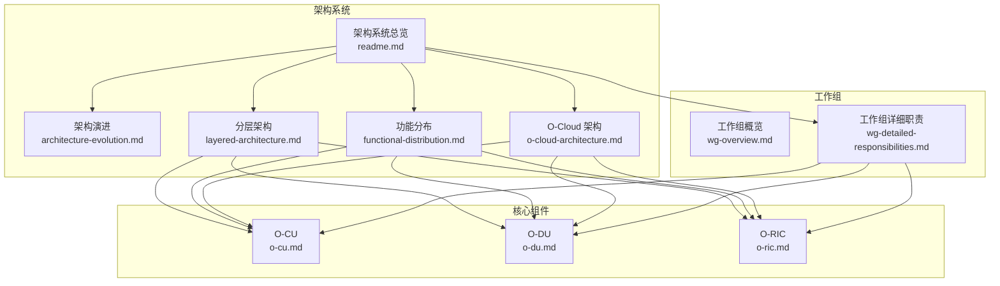
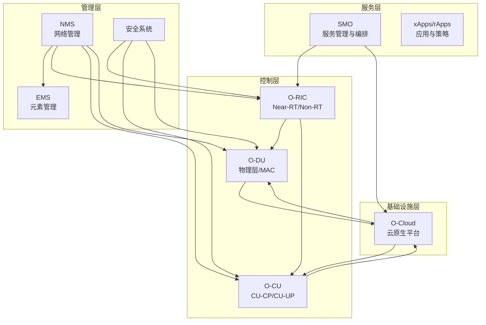
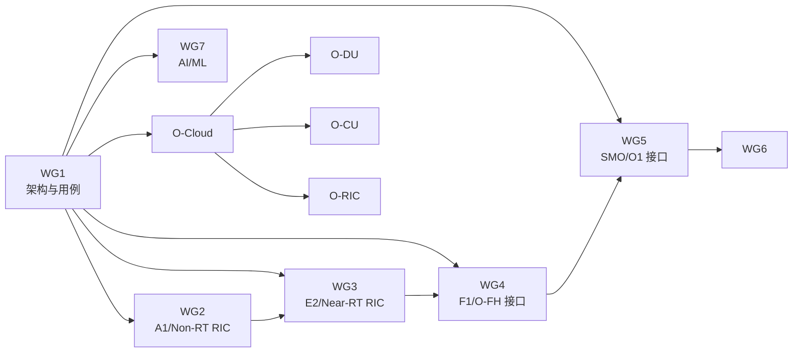
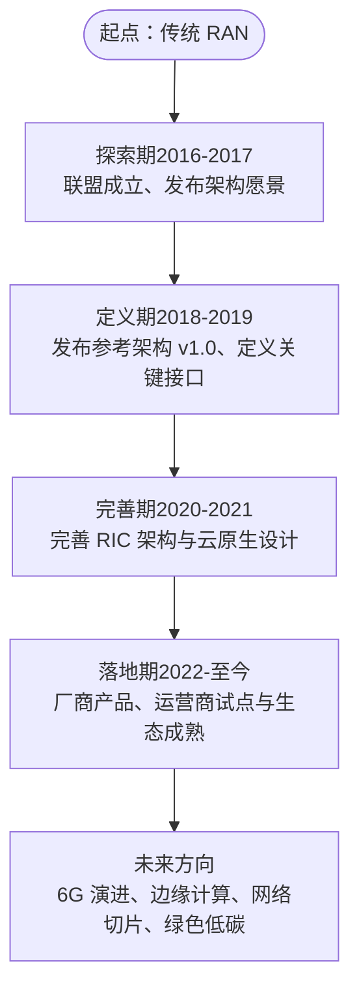
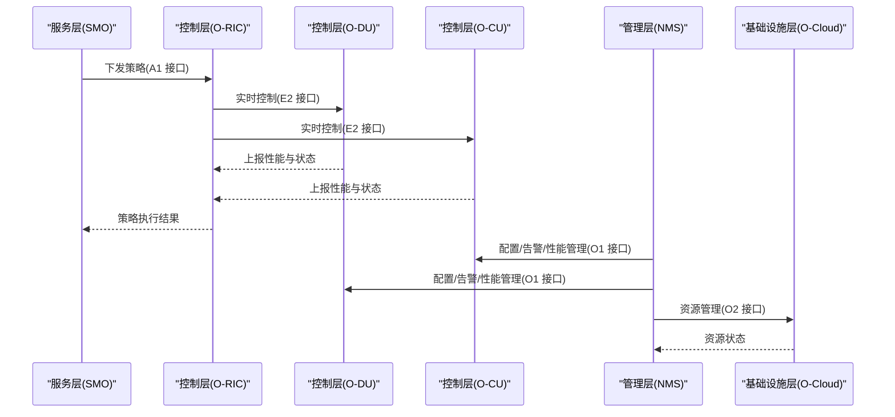

# 架构系统

<cite>
**本文引用的文件**
- [架构系统总览](file://01-architecture-system/readme.md)
- [架构演进](file://01-architecture-system/architecture-evolution.md)
- [O-Cloud 架构](file://01-architecture-system/o-cloud-architecture.md)
- [功能分布](file://01-architecture-system/functional-distribution.md)
- [分层架构](file://01-architecture-system/layered-architecture.md)
- [O-CU](file://02-core-components/o-cu.md)
- [O-DU](file://02-core-components/o-du.md)
- [O-RIC](file://02-core-components/o-ric.md)
- [工作组概览](file://06-working-groups/wg-overview.md)
- [工作组详细职责](file://06-working-groups/wg-detailed-responsibilities.md)
</cite>

## 目录
1. [引言](#引言)
2. [项目结构](#项目结构)
3. [核心组件](#核心组件)
4. [架构总览](#架构总览)
5. [详细组件分析](#详细组件分析)
6. [依赖关系分析](#依赖关系分析)
7. [性能与弹性](#性能与弹性)
8. [故障排查指南](#故障排查指南)
9. [结论](#结论)
10. [附录](#附录)

## 引言
本文件面向 O-RAN 架构系统，系统梳理从传统 RAN 到 O-RAN 的技术演进、分层架构设计、O-Cloud 云原生基础设施、功能分布与职责边界，并结合工作组标准与生产实践，帮助读者理解 O-RAN 的整体设计思路与实现原理。内容既适合初学者建立知识框架，也适合工程人员进行部署与运维参考。

## 项目结构
本仓库围绕“架构系统”组织内容，涵盖架构演进、分层与功能分布、O-Cloud 基础设施、核心网络元素、工作组职责与标准等主题。下图给出与本文相关的知识域与文件映射关系。

图表来源
- [架构系统总览](file://01-architecture-system/readme.md#L1-L161)
- [架构演进](file://01-architecture-system/architecture-evolution.md#L1-L183)
- [分层架构](file://01-architecture-system/layered-architecture.md)
- [功能分布](file://01-architecture-system/functional-distribution.md#L1-L325)
- [O-Cloud 架构](file://01-architecture-system/o-cloud-architecture.md#L1-L238)
- [O-CU](file://02-core-components/o-cu.md#L1-L419)
- [O-DU](file://02-core-components/o-du.md#L1-L415)
- [O-RIC](file://02-core-components/o-ric.md#L1-L437)
- [工作组详细职责](file://06-working-groups/wg-detailed-responsibilities.md#L1-L607)

章节来源
- [架构系统总览](file://01-architecture-system/readme.md#L1-L161)

## 核心组件
- O-RU（无线电单元）：射频处理、数字前端、天线连接与同步
- O-DU（分布式单元）：物理层处理、部分 MAC 层功能，强调实时性
- O-CU（集中式单元）：CU-CP（RRC/NG 接口控制面）、CU-UP（PDCP/SDAP 用户面）
- O-RIC（RAN 智能控制器）：Near-RT RIC（毫秒级闭环）、Non-RT RIC（秒至分钟级策略）
- SMO（服务管理与编排）：网络服务生命周期管理、配置与故障管理
- O-CUCP/O-CUUP（跨厂商协调）：跨厂商协调与管理功能

章节来源
- [架构系统总览](file://01-architecture-system/readme.md#L15-L26)

## 架构总览
O-RAN 参考架构以“服务层—控制层—管理层—基础设施层”四层划分，配合开放接口与云原生基础设施，实现灵活、可扩展、可智能的无线接入网络。

图表来源
- [架构系统总览](file://01-architecture-system/readme.md#L8-L34)
- [功能分布](file://01-architecture-system/functional-distribution.md#L7-L196)
- [O-Cloud 架构](file://01-architecture-system/o-cloud-architecture.md#L7-L38)

## 详细组件分析

### 传统 RAN 与 O-RAN 的核心差异
- 传统 RAN：集中式、端到端专有、硬件紧耦合、缺乏智能化与开放生态
- O-RAN：解耦分层、开放接口、云原生、可智能、多厂商互操作、弹性扩展

章节来源
- [架构演进](file://01-architecture-system/architecture-evolution.md#L5-L14)

### 分层架构设计原理与职责边界
- 服务层：服务生命周期、编排、暴露；与控制层通过 A1 接口交互，与基础设施层通过 O2 接口交互
- 控制层：网络控制、策略、资源调度、故障处理；Near-RT RIC 与 Non-RT RIC 协同
- 管理层：配置、故障、性能、安全、资产；与控制层通过 O1 接口交互
- 基础设施层：计算/存储/网络资源、虚拟化与容器编排、自动化运维

章节来源
- [功能分布](file://01-architecture-system/functional-distribution.md#L7-L196)
- [架构系统总览](file://01-architecture-system/readme.md#L8-L13)

### O-Cloud 架构的云原生设计
- 组成：计算/存储/网络资源层、管理层、编排层
- 技术栈：虚拟化、容器、容器编排、存储、网络、监控、自动化
- 部署模式：集中式、分布式、混合
- 设计考量：性能优化（计算/存储/网络）、可靠性（硬件/软件冗余、故障检测与恢复）、安全性（网络/主机/数据）、可扩展性（水平/垂直/模块化）

章节来源
- [O-Cloud 架构](file://01-architecture-system/o-cloud-architecture.md#L7-L141)

### O-CU（集中式单元）
- 功能：CU-CP（RRC/NG 接口控制面）、CU-UP（PDCP/SDAP 用户面），E1 接口互联
- 硬件/软件/接口：通用服务器、模块化设计、F1/NG/E1 接口
- 部署：集中式/分布式/混合/多租户
- 运维：监控告警、配置管理、故障处理、性能优化
- 最佳实践：自动化部署、高可用、灾难恢复、监控体系、自动化运维、容量管理、安全最佳实践

章节来源
- [O-CU](file://02-core-components/o-cu.md#L3-L100)

### O-DU（分布式单元）
- 功能：物理层处理、部分 MAC 层功能，强调实时性
- 接口：F1（与 O-CU）、O-FH（与 O-RU）、E2（与 O-RIC）
- 硬件/软件/部署：多核/加速器/FPGA、实时 OS、集中/分布式/混合
- 运维：监控告警、配置管理、故障处理、性能优化
- 最佳实践：硬件选型、网络设计、同步实现、监控体系、自动化运维、容量管理

章节来源
- [O-DU](file://02-core-components/o-du.md#L3-L86)

### O-RIC（RAN 智能控制器）
- 功能：Near-RT RIC（毫秒级闭环、xApps）、Non-RT RIC（秒至分钟级策略、rApps）
- 架构：微服务、容器编排、消息队列、数据库、监控、服务网格
- 部署：集中/分布式/混合
- 运维：监控告警、配置管理、故障处理、性能优化
- 最佳实践：自动化部署、高可用、灾难恢复、应用管理、监控体系、自动化运维、容量管理、安全最佳实践

章节来源
- [O-RIC](file://02-core-components/o-ric.md#L3-L133)

### 工作组与标准体系
- WG1：架构与用例定义，对齐 3GPP，定义 CU/DU/RU、RIC、SMO 的功能与边界
- WG2：Non-RT RIC 与 A1 接口，策略管理框架
- WG3：Near-RT RIC 与 E2 接口，xApps 框架
- WG4：O-CU/O-DU/O-RU 接口（F1、O-FH 等），接口测试
- WG5：SMO 与 O1 接口，服务编排
- WG6：安全架构与测试
- WG7：AI/ML 框架与用例
- WG8：测试与集成框架

章节来源
- [工作组详细职责](file://06-working-groups/wg-detailed-responsibilities.md#L7-L490)

## 依赖关系分析

图表来源
- [工作组详细职责](file://06-working-groups/wg-detailed-responsibilities.md#L420-L490)
- [架构系统总览](file://01-architecture-system/readme.md#L27-L34)

章节来源
- [工作组详细职责](file://06-working-groups/wg-detailed-responsibilities.md#L420-L490)
- [架构系统总览](file://01-architecture-system/readme.md#L27-L34)

## 性能与弹性
- 实时性与确定性：O-DU 物理层与 MAC 层处理延迟、O-RIC 控制闭环延迟、时间同步精度
- 可靠性与可用性：硬件冗余、软件冗余、故障检测与恢复、高可用设计
- 可扩展性：水平/垂直扩展、模块化设计、自动扩缩容
- 监控与告警：全栈监控、智能告警、告警分级与抑制、自动化处理
- 灾备与容量：数据备份、灾难恢复演练、容量评估与预测、资源优化与扩展

章节来源
- [O-Cloud 架构](file://01-architecture-system/o-cloud-architecture.md#L41-L194)
- [O-DU](file://02-core-components/o-du.md#L51-L66)
- [O-RIC](file://02-core-components/o-ric.md#L134-L192)

## 故障排查指南
- 告警分级与关联：区分严重程度，关联相关告警定位根因
- 日志与信令分析：设备日志、性能数据、信令流程辅助定位
- 接口与同步：F1/O-FH/E2/A1 接口状态、时间同步精度与恢复
- 资源与容量：CPU/内存/网络/存储使用率与容量余量
- 回退与演练：配置回滚、故障演练、流程 review 与持续改进

章节来源
- [O-DU](file://02-core-components/o-du.md#L224-L288)
- [O-RIC](file://02-core-components/o-ric.md#L214-L282)
- [O-CU](file://02-core-components/o-cu.md#L197-L263)

## 结论
O-RAN 通过开放接口、智能控制与云原生基础设施，实现了从传统 RAN 到可演进、可智能、可扩展的无线接入网络。分层架构明确了服务、控制、管理与基础设施的职责边界；O-Cloud 提供了弹性与自动化支撑；核心网络元素在工作组标准下协同工作。生产实践中应重视实时性、可靠性、安全性与可扩展性，结合自动化与监控体系，持续优化网络性能与运维效率。

## 附录

### 架构演进路线图（概念示意）

图表来源
- [架构演进](file://01-architecture-system/architecture-evolution.md#L17-L37)

### 服务层-控制层-管理层-基础设施层交互序列（概念示意）

图表来源
- [功能分布](file://01-architecture-system/functional-distribution.md#L197-L222)
- [工作组详细职责](file://06-working-groups/wg-detailed-responsibilities.md#L56-L107)