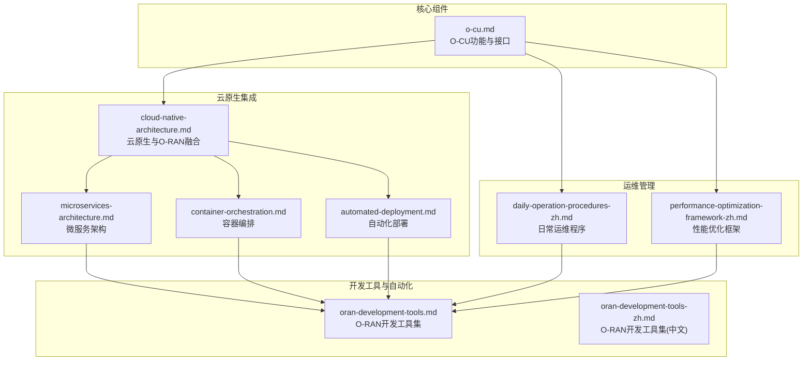
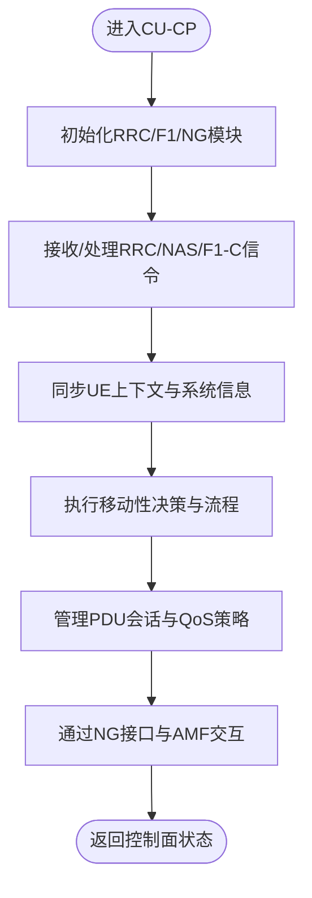
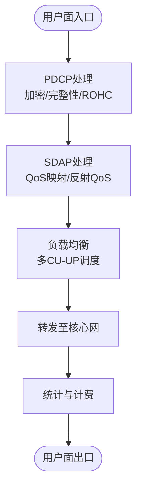
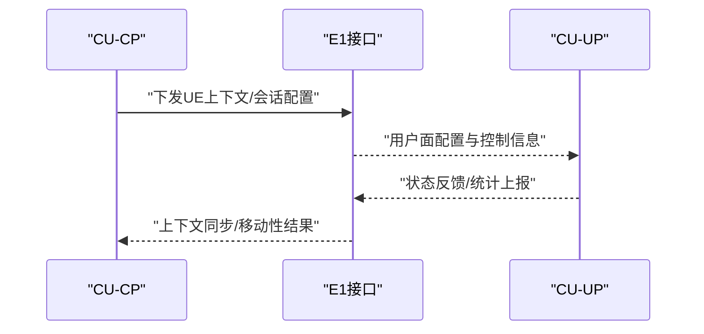
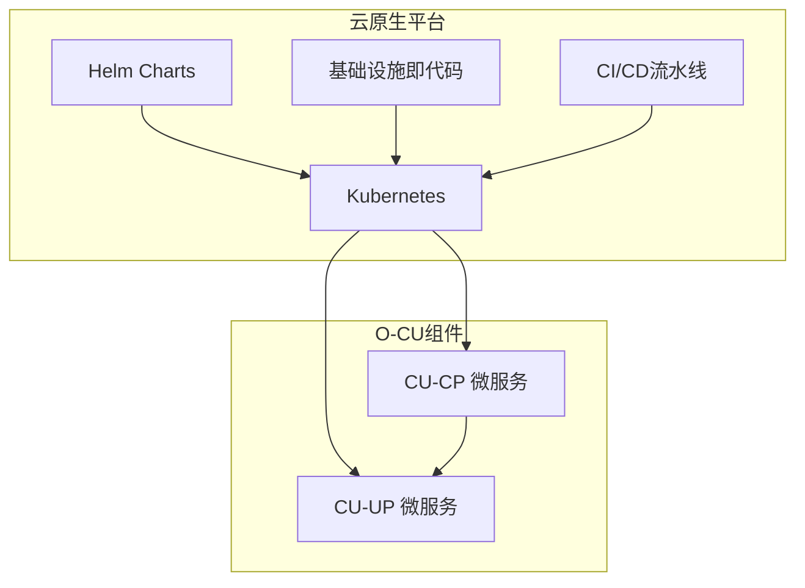
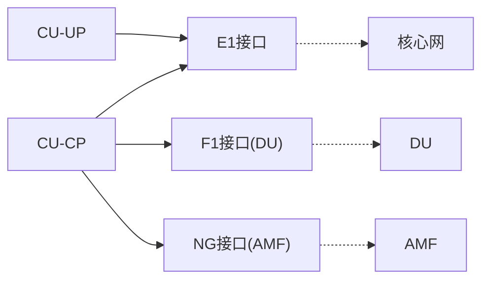
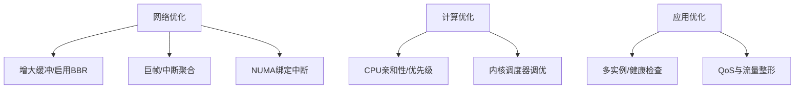
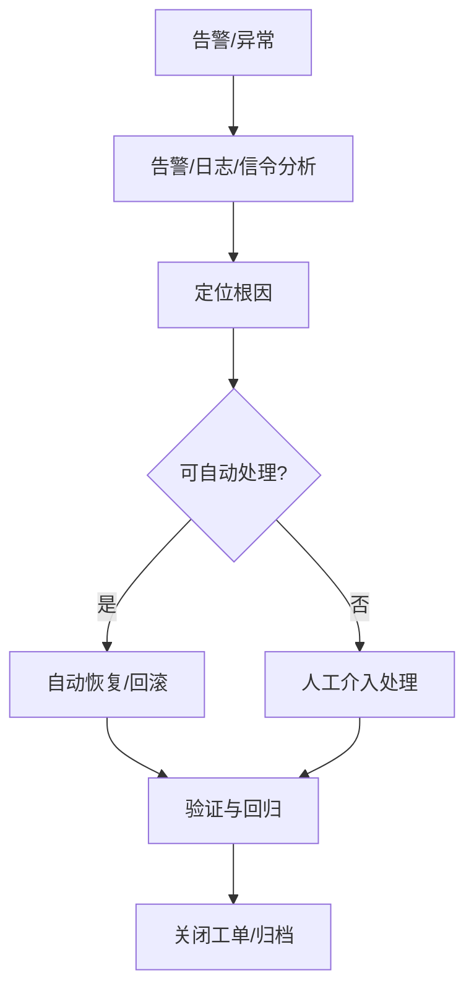

# O-CU（集中单元）

<cite>
**本文引用的文件列表**
- [o-cu.md](file://02-core-components/o-cu.md)
- [cloud-native-architecture.md](file://05-cloud-integration/cloud-native-architecture.md)
- [automated-deployment.md](file://05-cloud-integration/automated-deployment.md)
- [microservices-architecture.md](file://05-cloud-integration/microservices-architecture.md)
- [container-orchestration.md](file://05-cloud-integration/container-orchestration.md)
- [daily-operation-procedures-zh.md](file://14-operations-management/daily-operations/daily-operation-procedures-zh.md)
- [performance-optimization-framework-zh.md](file://14-operations-management/performance-optimization/performance-optimization-framework-zh.md)
- [oran-development-tools.md](file://17-open-source-ecosystem/developer-tools/oran-development-tools.md)
- [oran-development-tools-zh.md](file://17-open-source-ecosystem/developer-tools/oran-development-tools-zh.md)
</cite>

## 目录
1. [简介](#简介)
2. [项目结构](#项目结构)
3. [核心组件](#核心组件)
4. [架构总览](#架构总览)
5. [详细组件分析](#详细组件分析)
6. [依赖关系分析](#依赖关系分析)
7. [性能考虑](#性能考虑)
8. [故障排查指南](#故障排查指南)
9. [结论](#结论)
10. [附录](#附录)

## 简介
本文件面向O-CU（集中单元）的系统化文档，聚焦于O-RAN架构中CU-CP（控制面）与CU-UP（用户面）的职责分工、功能实现与协同机制；阐述CU-CP的信令处理、资源管理、移动性管理与核心网接口；说明CU-UP的数据转发、QoS处理、负载均衡与性能优化；并结合云原生理念，给出容器化、微服务、编排与高可用性保障的实践建议，最后提供部署最佳实践与运维管理指南。

## 项目结构
围绕O-CU主题，本仓库的相关内容主要分布在“核心组件”、“云原生集成”、“运维管理”、“开发工具与自动化”等目录。其中与O-CU最直接相关的材料集中在核心组件与云原生架构两部分，运维与性能优化则提供落地的监控、告警、配置与调优方法论。



**图表来源**
- [o-cu.md](file://02-core-components/o-cu.md#L1-L419)
- [cloud-native-architecture.md](file://05-cloud-integration/cloud-native-architecture.md#L1-L481)
- [microservices-architecture.md](file://05-cloud-integration/microservices-architecture.md)
- [container-orchestration.md](file://05-cloud-integration/container-orchestration.md)
- [automated-deployment.md](file://05-cloud-integration/automated-deployment.md)
- [daily-operation-procedures-zh.md](file://14-operations-management/daily-operations/daily-operation-procedures-zh.md#L1-L419)
- [performance-optimization-framework-zh.md](file://14-operations-management/performance-optimization/performance-optimization-framework-zh.md#L1-L342)
- [oran-development-tools.md](file://17-open-source-ecosystem/developer-tools/oran-development-tools.md)
- [oran-development-tools-zh.md](file://17-open-source-ecosystem/developer-tools/oran-development-tools-zh.md)

**章节来源**
- [o-cu.md](file://02-core-components/o-cu.md#L1-L419)
- [cloud-native-architecture.md](file://05-cloud-integration/cloud-native-architecture.md#L1-L481)

## 核心组件
- CU-CP（控制面）
  - RRC层：系统信息广播、寻呼、UE连接管理、移动性管理、安全管理、QoS策略管理
  - NG接口控制面：与AMF通信、NAS消息转发、跨NG-RAN移动性、PDU会话管理
  - F1接口控制面：F1接口建立维护、UE上下文同步、系统信息下发、DU间移动性
- CU-UP（用户面）
  - PDCP层：加密/解密、完整性保护、ROHC头压缩、乱序/重复处理、切换期间数据转发
  - SDAP层：QoS流映射至DRB、反射QoS、端到端QoS保障
  - 用户面处理：UE与核心网间数据转发、QoS驱动的流量管理、多CU-UP负载均衡、统计与计费
- CU-CP与CU-UP交互
  - E1接口：控制信息与用户面配置传输，支持分离部署
  - 交互过程：UE上下文建立、会话管理、移动性管理、资源协调

**章节来源**
- [o-cu.md](file://02-core-components/o-cu.md#L7-L61)

## 架构总览
O-CU通过将控制面与用户面分离，实现集中化控制与分布化用户面的协同。CU-CP负责非实时性高层协议与核心网交互，CU-UP负责高吞吐用户面数据处理与转发。两者通过E1接口协同，并通过F1接口与DU交互，通过NG接口与AMF交互。

```mermaid
graph TB
subgraph "CU-CP控制面"
CP_RRC["RRC层"]
CP_NG["NG接口控制面"]
CP_F1["F1接口控制面"]
CP_E1["E1接口控制面"]
end
subgraph "CU-UP用户面"
UP_PDCP["PDCP层"]
UP_SDAP["SDAP层"]
UP_UPF["用户面处理"]
UP_E1["E1接口用户面"]
end
subgraph "外部接口"
DU["DU"]
AMF["AMF"]
CORE["核心网"]
end
CP_RRC --> CP_NG
CP_RRC --> CP_F1
CP_E1 <- --> UP_E1
CP_F1 --> DU
CP_NG --> AMF
UP_PDCP --> UP_SDAP
UP_SDAP --> UP_UPF
UP_UPF --> CORE
```

**图表来源**
- [o-cu.md](file://02-core-components/o-cu.md#L101-L121)

## 详细组件分析

### CU-CP（控制面）分析
- 信令处理
  - RRC层：系统信息广播、寻呼、连接建立/维护/释放、移动性管理、安全与QoS策略
  - NG接口：与AMF的RRC/NAS消息转发、跨NG-RAN移动性、PDU会话管理
  - F1接口：F1建立维护、UE上下文同步、系统信息下发、DU间移动性
- 资源管理
  - 模块化设计：RRC、NG-C、F1-C等模块，状态管理与安全模块
  - 容器化与微服务：便于弹性扩展与高可用
- 移动性管理
  - 跨DU与跨AMF移动性，结合UE上下文与会话状态
- 与核心网接口
  - NG接口基于SCTP，传输控制面信令；与AMF交互遵循3GPP规范



**图表来源**
- [o-cu.md](file://02-core-components/o-cu.md#L7-L29)

**章节来源**
- [o-cu.md](file://02-core-components/o-cu.md#L7-L29)

### CU-UP（用户面）分析
- PDCP层
  - 加密/解密、完整性保护、ROHC压缩、乱序/重复处理、切换期间数据转发
- SDAP层
  - QoS流映射至DRB、反射QoS、端到端QoS保障
- 用户面处理
  - 数据转发、QoS驱动的流量管理、多CU-UP负载均衡、统计与计费
- 性能优化
  - 数据平面加速（如DPDK）、内存管理、QoS优化、负载均衡优化



**图表来源**
- [o-cu.md](file://02-core-components/o-cu.md#L29-L48)

**章节来源**
- [o-cu.md](file://02-core-components/o-cu.md#L29-L48)

### CU-CP与CU-UP协同机制
- E1接口
  - 控制信息与用户面配置传输，支持分离部署
- 协同过程
  - UE上下文建立、会话管理、移动性管理（含CU-UP变更）、资源协调



**图表来源**
- [o-cu.md](file://02-core-components/o-cu.md#L49-L61)

**章节来源**
- [o-cu.md](file://02-core-components/o-cu.md#L49-L61)

### 云原生部署与微服务设计
- 容器化与编排
  - 采用容器技术实现快速部署与弹性扩展，使用Kubernetes进行编排
  - 支持微服务架构，提升系统可靠性与可维护性
- 微服务拆分
  - 将CU-CP/CU-UP功能模块化，独立部署与扩展
- 自动化与基础设施即代码
  - 使用IaC工具（如Terraform、Ansible）自动化部署与配置
  - CI/CD流水线（如GitHub Actions、Jenkins）实现持续交付



**图表来源**
- [cloud-native-architecture.md](file://05-cloud-integration/cloud-native-architecture.md#L1-L481)
- [microservices-architecture.md](file://05-cloud-integration/microservices-architecture.md)
- [container-orchestration.md](file://05-cloud-integration/container-orchestration.md)
- [automated-deployment.md](file://05-cloud-integration/automated-deployment.md)
- [oran-development-tools.md](file://17-open-source-ecosystem/developer-tools/oran-development-tools.md#L222-L257)
- [oran-development-tools-zh.md](file://17-open-source-ecosystem/developer-tools/oran-development-tools-zh.md#L800-L907)

**章节来源**
- [cloud-native-architecture.md](file://05-cloud-integration/cloud-native-architecture.md#L1-L481)
- [oran-development-tools.md](file://17-open-source-ecosystem/developer-tools/oran-development-tools.md#L222-L257)
- [oran-development-tools-zh.md](file://17-open-source-ecosystem/developer-tools/oran-development-tools-zh.md#L800-L907)

## 依赖关系分析
- 组件耦合与内聚
  - CU-CP与CU-UP通过E1接口耦合，控制与用户面内聚明确
  - F1接口与NG接口分别与DU与AMF耦合，形成清晰的外部依赖边界
- 外部依赖与集成点
  - 与DU的F1接口（SCTP/STREAMS）
  - 与AMF的NG接口（SCTP）
  - 与核心网的会话与移动性管理
- 云原生依赖
  - Kubernetes集群、Helm、CI/CD流水线、监控与告警系统



**图表来源**
- [o-cu.md](file://02-core-components/o-cu.md#L101-L121)

**章节来源**
- [o-cu.md](file://02-core-components/o-cu.md#L101-L121)

## 性能考虑
- 网络层面
  - 接口调优：禁用可能引起抖动的卸载、设置巨帧、中断聚合、优先级队列
  - 内核参数：增大TCP收发缓冲、启用BBR、降低TCP延迟参数
  - NUMA感知：将网络中断绑定到特定CPU核心
- 计算层面
  - CPU亲和性与调度：为关键进程设置CPU亲和性与优先级，调优内核调度器
  - 容器资源：合理设置requests/limits，配合GC与GOMAXPROCS
- 应用层面
  - 负载均衡：多实例部署与健康检查，结合E1/CU-UP间负载均衡策略
  - QoS：端到端QoS保障与流量整形，确保关键业务SLA



**图表来源**
- [performance-optimization-framework-zh.md](file://14-operations-management/performance-optimization/performance-optimization-framework-zh.md#L6-L101)

**章节来源**
- [performance-optimization-framework-zh.md](file://14-operations-management/performance-optimization/performance-optimization-framework-zh.md#L6-L101)

## 故障排查指南
- 常见故障类型
  - 信令故障：RRC连接建立失败、切换失败
  - 接口故障：NG/F1/E1断连
  - 性能故障：用户面延迟上升、吞吐量下降
  - 资源故障：CPU过载、内存不足
- 定位与恢复
  - 告警分析、日志分析、信令分析、测试验证
  - 重启服务、调整配置、资源扩容、修复接口
- 运维程序
  - 日常健康检查、网络接口监控、配置备份与变更流程、事件响应矩阵、故障排除手册



**图表来源**
- [daily-operation-procedures-zh.md](file://14-operations-management/daily-operations/daily-operation-procedures-zh.md#L283-L359)

**章节来源**
- [daily-operation-procedures-zh.md](file://14-operations-management/daily-operations/daily-operation-procedures-zh.md#L163-L281)

## 结论
O-CU通过CU-CP与CU-UP的分离，实现了控制面集中化与用户面分布化的协同，既满足了非实时性高层协议处理的需求，又兼顾了用户面高吞吐与低延迟的要求。结合云原生容器化、微服务与自动化编排，O-CU具备良好的弹性、可扩展性与可维护性。通过完善的监控、告警、配置管理与性能优化体系，可在生产环境中实现高可用与高质量服务。

## 附录
- 部署最佳实践
  - 自动化部署：IaC与CI/CD流水线
  - 高可用性：多副本、自动故障转移、灾备演练
  - 灾难恢复：异地备份、恢复计划与快速恢复
- 运维最佳实践
  - 全面监控与可视化、智能告警、自动化运维
  - 容量管理：容量评估、动态资源调整、成本优化
  - 故障预防与演练：健康检查、预防性维护、故障演练
- 安全最佳实践
  - 网络安全：分段、防火墙、加密、访问控制
  - 系统安全：补丁管理、最小权限、安全启动与运行环境
  - 数据安全：加密存储、备份与恢复、权限控制与审计

**章节来源**
- [o-cu.md](file://02-core-components/o-cu.md#L283-L361)
- [cloud-native-architecture.md](file://05-cloud-integration/cloud-native-architecture.md#L177-L234)