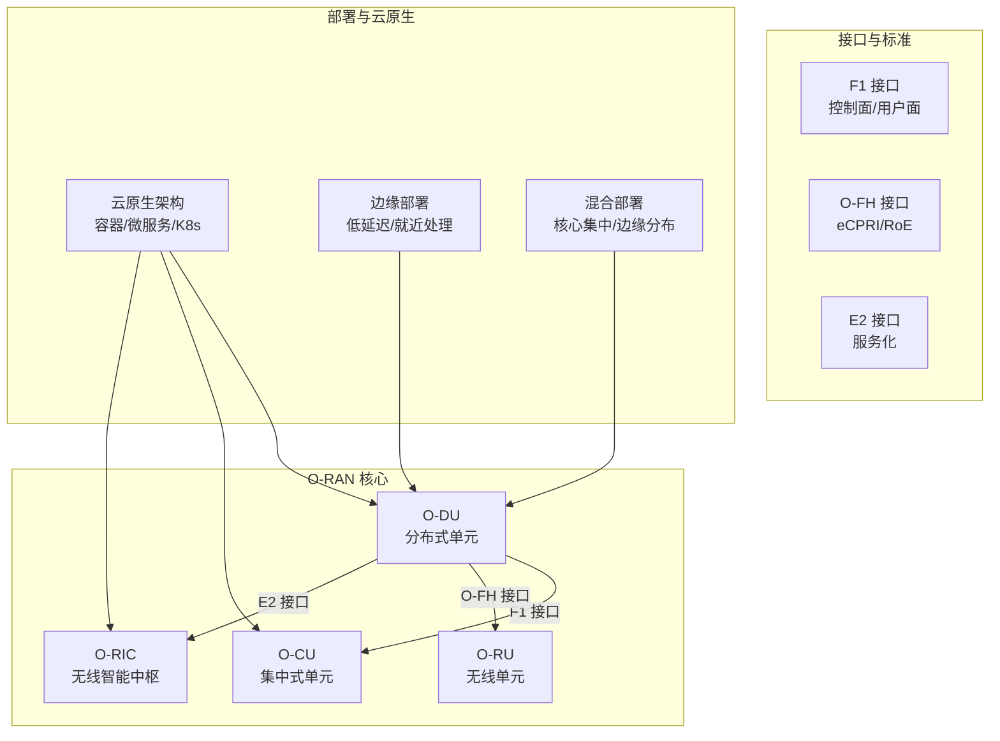
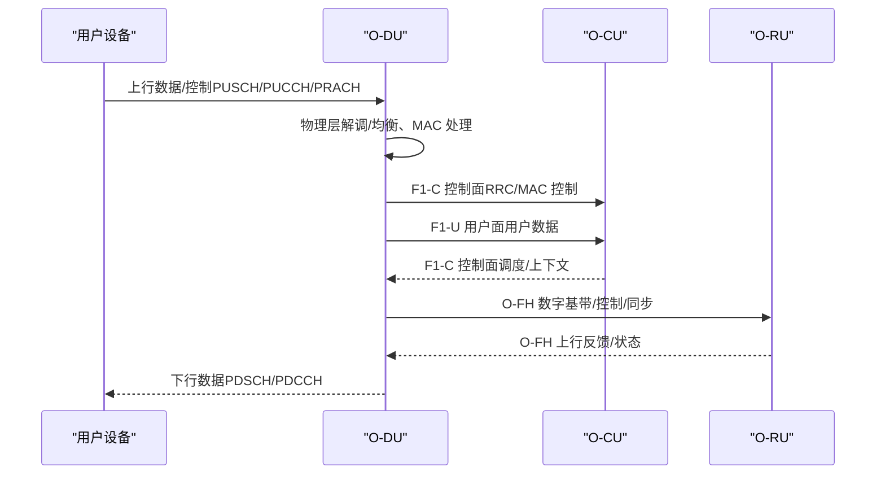
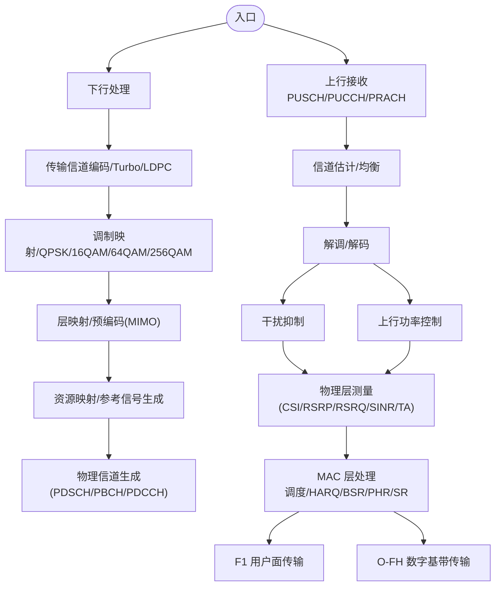
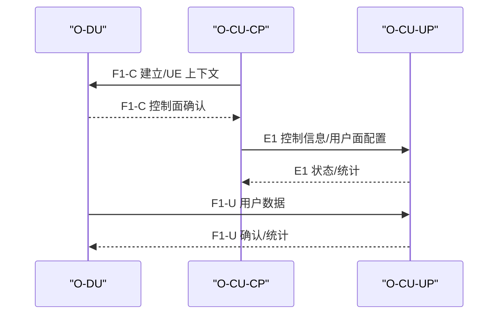
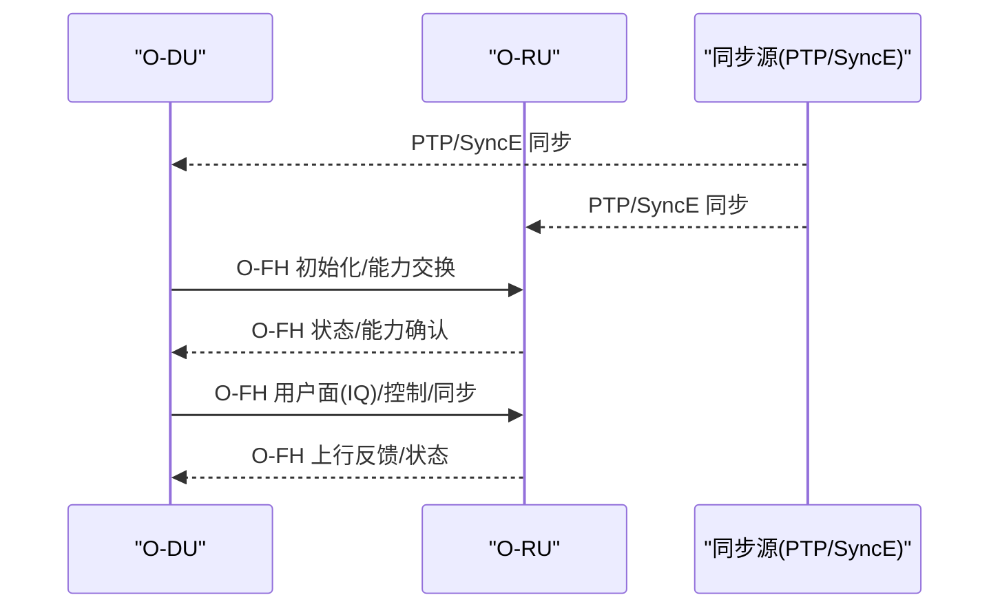
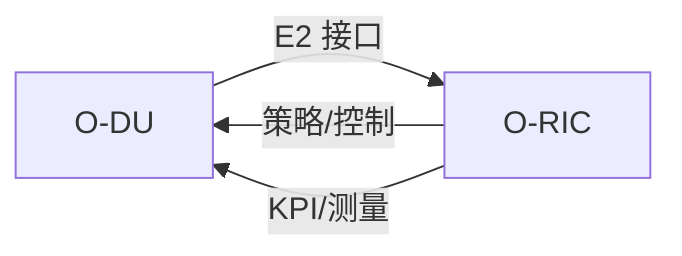
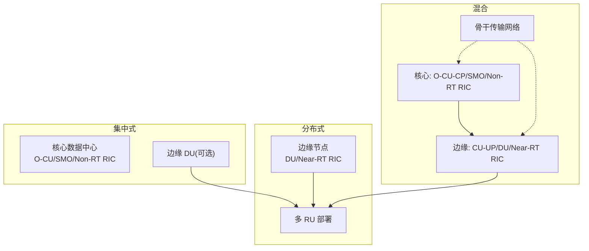
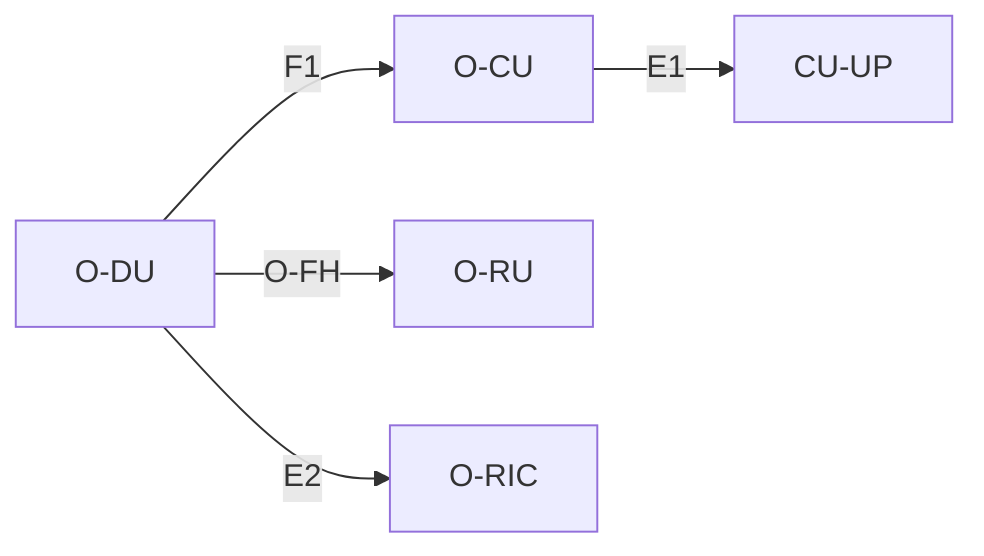
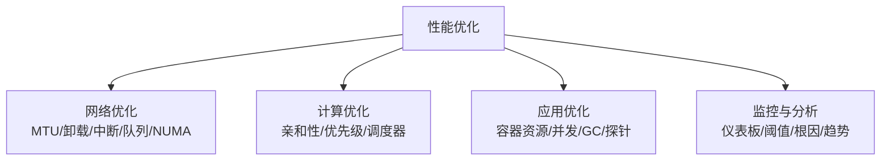
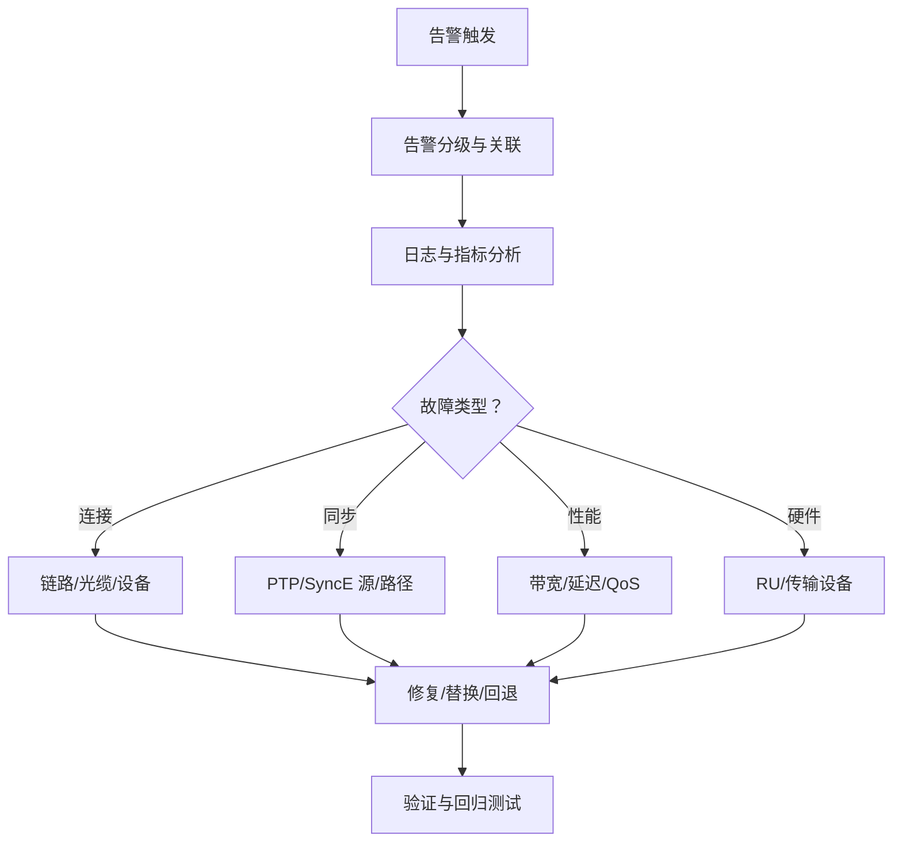

# O-DU（分布单元）

<cite>
**本文引用的文件**
- [分布式单元 (O-DU)](file://02-core-components/o-du.md)
- [开放前传接口 (O-FH)](file://03-interface-standards/o-fh-interface.md)
- [部署场景分析](file://04-disaggregation-options/deployment-scenarios.md)
- [云原生架构与 O-RAN 集成](file://05-cloud-integration/cloud-native-architecture.md)
- [O-RAN 性能优化框架](file://14-operations-management/performance-optimization/performance-optimization-framework-zh.md)
- [O-RAN 高级技术](file://07-ric-development/readme-zh.md)
- [O-RAN 架构论文](file://11-academic-papers/architecture/readme-zh.md)
</cite>

## 目录
1. [引言](#引言)
2. [项目结构](#项目结构)
3. [核心组件](#核心组件)
4. [架构总览](#架构总览)
5. [详细组件分析](#详细组件分析)
6. [依赖分析](#依赖分析)
7. [性能考量](#性能考量)
8. [故障排查指南](#故障排查指南)
9. [结论](#结论)
10. [附录](#附录)

## 引言
本文件围绕 O-DU（分布式单元）在 O-RAN 架构中的关键地位与实现进行全面阐述，重点覆盖物理层处理与高层协议栈、F1 接口管理、前传网络控制、CU-CP/CU-UP 分离架构、实时性与 QoS 保障、软件定义与云原生部署、弹性扩展与与 O-RU 协同机制，并提供部署架构建议、性能优化策略与故障诊断方法。内容来源于仓库中关于 O-DU、O-FH、部署场景、云原生、性能优化与 RIC 高级技术等权威文档。

## 项目结构
本仓库围绕 O-RAN 架构形成系统化知识体系，O-DU 作为关键“分布单元”，在如下模块中被系统化描述与支撑：
- 核心组件：O-DU 的功能、接口与部署
- 接口标准：F1、O-FH、E2 等接口的协议与运维
- 部署场景：集中式/分布式/混合部署与边缘计算
- 云原生：容器化、微服务、弹性与编排
- 性能优化：网络、计算、应用与监控
- 高级技术：RIC、xApps/rApps、AI/ML 优化

**图示来源**
- [分布式单元 (O-DU)](file://02-core-components/o-du.md#L68-L86)
- [开放前传接口 (O-FH)](file://03-interface-standards/o-fh-interface.md#L1-L120)
- [云原生架构与 O-RAN 集成](file://05-cloud-integration/cloud-native-architecture.md#L65-L122)

**章节来源**
- [分布式单元 (O-DU)](file://02-core-components/o-du.md#L1-L120)
- [开放前传接口 (O-FH)](file://03-interface-standards/o-fh-interface.md#L1-L120)
- [部署场景分析](file://04-disaggregation-options/deployment-scenarios.md#L1-L120)
- [云原生架构与 O-RAN 集成](file://05-cloud-integration/cloud-native-architecture.md#L1-L120)

## 核心组件
- 物理层处理：下行（传输信道编码、调制映射、层映射/预编码、资源映射、参考信号生成、物理信道生成）、上行（信号接收、信道估计/均衡、解调/解码、上行功率控制、干扰抑制）、物理层测量（CSI、RSRP/RSRQ、SINR、TA）。
- MAC 层功能：控制（随机接入、调度、HARQ、上行功率控制、逻辑信道优先级）、数据（逻辑信道到传输信道映射、MAC 头处理、复用/解复用、填充）、测量与报告（BSR、PHR、SR）。
- 实时性与可靠性：物理层/ MAC 层延迟要求、端到端延迟、时间同步精度（PTP v2）、可用性与故障恢复、HARQ 可靠性保障。
- 接口能力：F1（与 O-CU 控制/用户面分离、RRC/MAC/用户数据、上下文管理）、O-FH（eCPRI/RoE、数字基带/控制/同步、RU 管理）、E2（与 O-RIC 服务化、性能测量与控制）。

**章节来源**
- [分布式单元 (O-DU)](file://02-core-components/o-du.md#L7-L86)

## 架构总览
O-DU 位于 O-CU 与 O-RU 之间，承担物理层与 MAC 层处理，通过 F1 接口与 CU 交互，通过 O-FH 接口与 RU 交互，并通过 E2 接口与 RIC 协同。其部署形态可随业务与网络条件选择集中式、分布式或混合部署；在云原生环境下，O-DU 可容器化、微服务化、弹性伸缩，并与边缘计算平台协同以满足低延迟与高可靠性。

**图示来源**
- [分布式单元 (O-DU)](file://02-core-components/o-du.md#L68-L86)
- [开放前传接口 (O-FH)](file://03-interface-standards/o-fh-interface.md#L82-L116)

**章节来源**
- [分布式单元 (O-DU)](file://02-core-components/o-du.md#L87-L147)
- [开放前传接口 (O-FH)](file://03-interface-standards/o-fh-interface.md#L59-L116)

## 详细组件分析

### 物理层与 MAC 层处理
- 物理层：覆盖下行与上行完整链路，支持多种调制与 MIMO，生成参考信号并完成资源映射与信道估计，支撑功率控制与干扰抑制。
- MAC 层：实现随机接入、调度、HARQ、BSR/PHR/SR 报告与逻辑信道优先级管理，支撑 QoS 与资源复用。
- 实时性与可靠性：明确处理延迟与端到端延迟目标、时间同步精度与可用性要求，保障关键业务 SLA。

**图示来源**
- [分布式单元 (O-DU)](file://02-core-components/o-du.md#L7-L67)

**章节来源**
- [分布式单元 (O-DU)](file://02-core-components/o-du.md#L7-L67)

### F1 接口管理（与 O-CU）
- 控制面与用户面分离：F1-C（SCTP）与 F1-U（GTP-U）分别承载控制与用户数据。
- 业务承载：RRC 消息、MAC 控制消息与用户数据的传输与上下文管理。
- 与 CU-CP/CU-UP 分离：O-DU 仅负责 DU 功能，O-CU 的 CP/UP 分离由 O-CU 承担，DU 侧通过 F1 接口与之交互。

**图示来源**
- [分布式单元 (O-DU)](file://02-core-components/o-du.md#L49-L75)
- [O-RAN 高级技术](file://07-ric-development/readme-zh.md#L1-L60)

**章节来源**
- [分布式单元 (O-DU)](file://02-core-components/o-du.md#L49-L75)

### 前传网络控制（O-FH 与 O-RU）
- 协议支持：eCPRI 与 RoE，标准化 IQ 数据、控制与同步消息。
- 同步能力：PTP v2 时间同步与 SyncE 频率同步，支持边界时钟/透明时钟模式与同步冗余。
- 运维要点：带宽与延迟规划、QoS 保障、传输路径冗余与设备级冗余。

**图示来源**
- [开放前传接口 (O-FH)](file://03-interface-standards/o-fh-interface.md#L82-L116)

**章节来源**
- [开放前传接口 (O-FH)](file://03-interface-standards/o-fh-interface.md#L1-L180)

### 与 RIC 的协同（E2 接口）
- 服务化接口：E2 用于 RIC 对 DU 的控制与管理，传输性能测量与控制指令。
- RIC 架构：Near-RT RIC 与 Non-RT RIC 的分工，xApps/rApps 的开发与部署，策略与智能算法集成。

**图示来源**
- [分布式单元 (O-DU)](file://02-core-components/o-du.md#L82-L86)
- [O-RAN 高级技术](file://07-ric-development/readme-zh.md#L1-L60)

**章节来源**
- [分布式单元 (O-DU)](file://02-core-components/o-du.md#L82-L86)
- [O-RAN 高级技术](file://07-ric-development/readme-zh.md#L1-L60)

### 部署架构与弹性扩展
- 集中式：集中机房部署，共享资源，便于管理；适合广覆盖与非低时延场景。
- 分布式：靠近 RU/用户部署，降低前传与空口时延，适合 URLLC/mMTC 等低时延场景。
- 混合部署：核心集中管理，边缘分布处理，平衡管理效率与性能；支持分层编排与多域协同。
- 云原生：容器化、微服务、Kubernetes 编排、弹性伸缩、自动扩缩容与多租户隔离。

**图示来源**
- [部署场景分析](file://04-disaggregation-options/deployment-scenarios.md#L110-L215)
- [云原生架构与 O-RAN 集成](file://05-cloud-integration/cloud-native-architecture.md#L235-L296)

**章节来源**
- [部署场景分析](file://04-disaggregation-options/deployment-scenarios.md#L1-L215)
- [云原生架构与 O-RAN 集成](file://05-cloud-integration/cloud-native-architecture.md#L235-L296)

## 依赖分析
- 组件耦合：O-DU 与 O-CU（F1）、O-RU（O-FH）、O-RIC（E2）形成三向依赖；CU-CP/CU-UP 分离降低 DU 的控制面负担。
- 外部依赖：O-FH 依赖 eCPRI/RoE 协议栈与 PTP/SyncE 同步；部署依赖传输网络带宽、延迟与 QoS。
- 云原生依赖：容器编排、服务网格、监控与可观测性工具链。

**图示来源**
- [分布式单元 (O-DU)](file://02-core-components/o-du.md#L49-L86)
- [O-RAN 高级技术](file://07-ric-development/readme-zh.md#L1-L60)

**章节来源**
- [分布式单元 (O-DU)](file://02-core-components/o-du.md#L49-L86)
- [O-RAN 高级技术](file://07-ric-development/readme-zh.md#L1-L60)

## 性能考量
- 网络层面：巨帧、关闭 GRO/LRO、中断聚合、NUMA 绑定、优先级队列与流量标记（E2/F1/O-FH），内核参数优化（TCP BBR、低延迟参数）。
- 计算层面：CPU 亲和性、进程优先级、内核调度器调优（迁移成本、RT 时间片），NUMA 感知绑定。
- 应用层面：容器资源请求/限制、并发与 GC 参数、健康探针、自动扩缩容与多副本。
- 监控与分析：仪表板、阈值告警、根因分析与趋势评估。

**图示来源**
- [O-RAN 性能优化框架](file://14-operations-management/performance-optimization/performance-optimization-framework-zh.md#L1-L342)

**章节来源**
- [O-RAN 性能优化框架](file://14-operations-management/performance-optimization/performance-optimization-framework-zh.md#L1-L342)

## 故障排查指南
- 监控与告警：接口状态、RU 状态、连接/同步/性能劣化/硬件故障；告警分级、关联与抑制。
- 配置管理：接口/协议/同步/QoS 配置、RU 参数、变更流程与回滚、备份。
- 故障定位：告警分析、日志分析、接口/同步测试；区分连接、同步、性能与硬件故障。
- 故障恢复：修复传输/同步/配置/硬件，必要时启用冗余与自动恢复。

**图示来源**
- [开放前传接口 (O-FH)](file://03-interface-standards/o-fh-interface.md#L199-L288)

**章节来源**
- [开放前传接口 (O-FH)](file://03-interface-standards/o-fh-interface.md#L199-L288)

## 结论
O-DU 作为 O-RAN 的分布处理单元，承担物理层与 MAC 层关键功能，通过 F1/O-FH/E2 接口与 CU/RU/RIC 协同，满足低时延、高可靠的业务需求。结合云原生的容器化、微服务与弹性扩展能力，以及针对网络、计算与应用的系统化性能优化与运维体系，O-DU 能够在集中式、分布式与混合部署场景中实现灵活、高效与稳定的运行。

## 附录
- 相关架构论文与趋势：参考架构、网络功能虚拟化、多域编排、边缘计算集成、AI/ML 集成与安全架构演进。
- RIC 与 xApps/rApps：服务模型（E2SM-KPM/RC/CU-UP）、策略管理（A1）、智能算法与能效优化、安全增强与威胁检测。

**章节来源**
- [O-RAN 架构论文](file://11-academic-papers/architecture/readme-zh.md#L1-L84)
- [O-RAN 高级技术](file://07-ric-development/readme-zh.md#L1-L340)