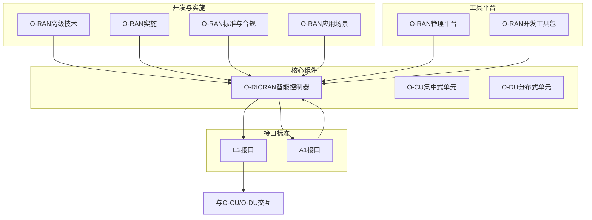
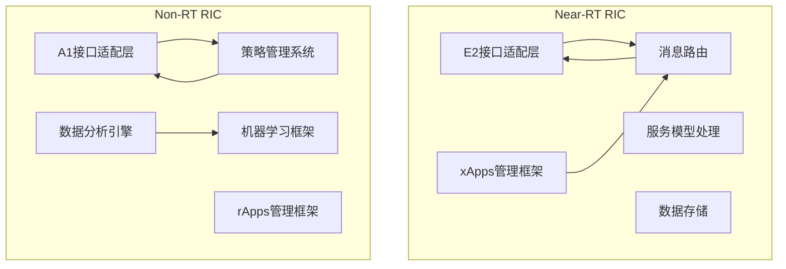
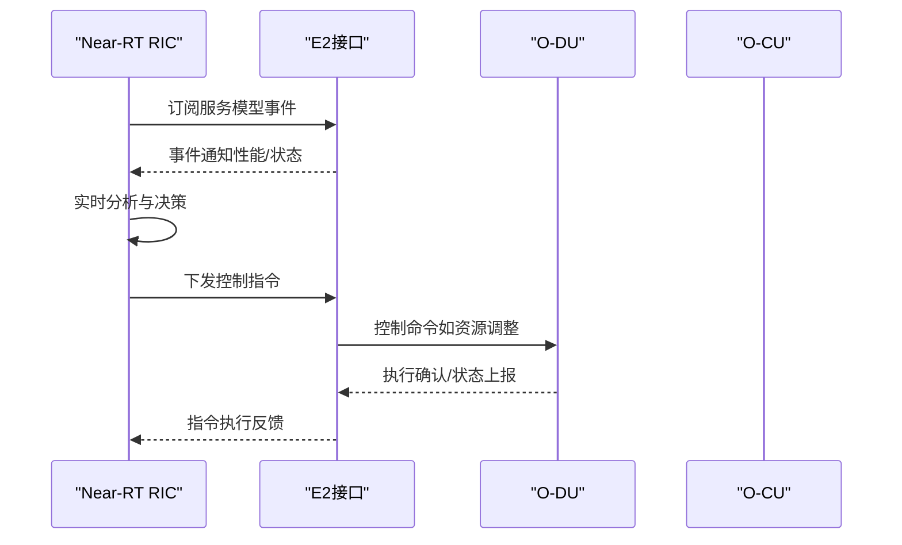
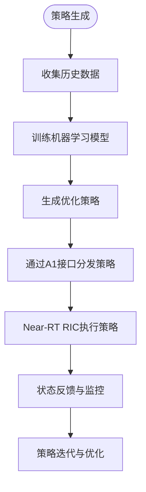
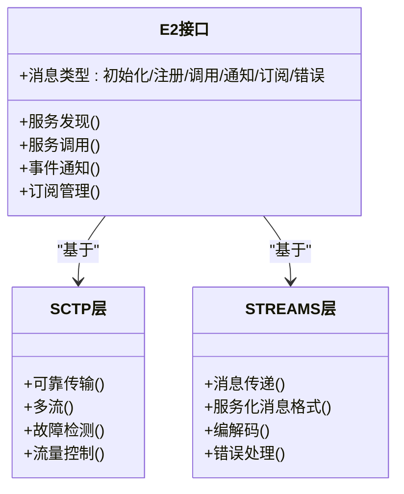
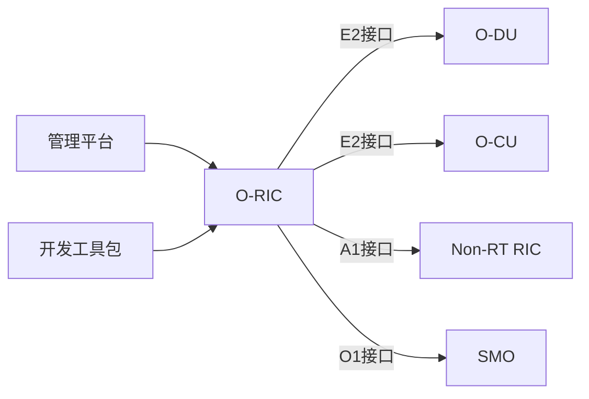

# O-RIC（RAN智能控制器）

<cite>
**本文引用的文件**
- [O-RIC（RAN智能控制器）](file://02-core-components/o-ric.md)
- [E2接口](file://03-interface-standards/e2-interface.md)
- [A1接口](file://03-interface-standards/a1-interface.md)
- [O-CU（集中式单元）](file://02-core-components/o-cu.md)
- [O-DU（分布式单元）](file://02-core-components/o-du.md)
- [O-RAN高级技术](file://07-ric-development/readme.md)
- [O-RAN实施](file://08-deployment-implementation/readme.md)
- [O-RAN标准与合规](file://09-standards-compliance/readme.md)
- [O-RAN应用场景](file://10-application-scenarios/readme.md)
- [O-RAN管理平台](file://22-tool-platforms/management-platforms/o-ran-management-platforms-zh.md)
- [O-RAN开发工具包](file://22-tool-platforms/development-tools/o-ran-development-toolkit.md)
</cite>

## 目录
1. [引言](#引言)
2. [项目结构](#项目结构)
3. [核心组件](#核心组件)
4. [架构总览](#架构总览)
5. [详细组件分析](#详细组件分析)
6. [依赖关系分析](#依赖关系分析)
7. [性能考虑](#性能考虑)
8. [故障排查指南](#故障排查指南)
9. [结论](#结论)
10. [附录](#附录)

## 引言
本文件面向O-RAN架构中的智能化核心——O-RIC（RAN Intelligent Controller），系统阐述其在Near-RT RIC与Non-RT RIC两个层面的功能定位、技术架构、xApp/rApp管理机制、策略执行与自适应控制算法，并结合E2/A1接口通信、消息格式、事件处理与性能优化，给出部署架构、xApp开发指南与智能决策实现方案。文档旨在帮助云平台运维与网络工程人员全面理解O-RIC在O-RAN中的关键作用与落地实践。

## 项目结构
围绕O-RIC主题，本仓库提供了从核心组件、接口标准、开发与实施、标准合规到应用场景的完整知识体系。下图展示与O-RIC直接相关的主要文件及其关系。

**图表来源**
- [O-RIC（RAN智能控制器）](file://02-core-components/o-ric.md#L1-L437)
- [E2接口](file://03-interface-standards/e2-interface.md#L1-L337)
- [A1接口](file://03-interface-standards/a1-interface.md)
- [O-CU（集中式单元）](file://02-core-components/o-cu.md#L1-L419)
- [O-DU（分布式单元）](file://02-core-components/o-du.md#L1-L415)
- [O-RAN高级技术](file://07-ric-development/readme.md#L1-L368)
- [O-RAN实施](file://08-deployment-implementation/readme.md#L1-L353)
- [O-RAN标准与合规](file://09-standards-compliance/readme.md#L1-L371)
- [O-RAN应用场景](file://10-application-scenarios/readme.md#L1-L470)
- [O-RAN管理平台](file://22-tool-platforms/management-platforms/o-ran-management-platforms-zh.md#L293-L389)
- [O-RAN开发工具包](file://22-tool-platforms/development-tools/o-ran-development-toolkit.md#L259-L329)

**章节来源**
- [O-RIC（RAN智能控制器）](file://02-core-components/o-ric.md#L1-L437)
- [E2接口](file://03-interface-standards/e2-interface.md#L1-L337)
- [A1接口](file://03-interface-standards/a1-interface.md)
- [O-CU（集中式单元）](file://02-core-components/o-cu.md#L1-L419)
- [O-DU（分布式单元）](file://02-core-components/o-du.md#L1-L415)
- [O-RAN高级技术](file://07-ric-development/readme.md#L1-L368)
- [O-RAN实施](file://08-deployment-implementation/readme.md#L1-L353)
- [O-RAN标准与合规](file://09-standards-compliance/readme.md#L1-L371)
- [O-RAN应用场景](file://10-application-scenarios/readme.md#L1-L470)
- [O-RAN管理平台](file://22-tool-platforms/management-platforms/o-ran-management-platforms-zh.md#L293-L389)
- [O-RAN开发工具包](file://22-tool-platforms/development-tools/o-ran-development-toolkit.md#L259-L329)

## 核心组件
- Near-RT RIC：毫秒级闭环控制，负责实时网络控制、xApps运行环境、E2接口服务与实时数据处理。
- Non-RT RIC：秒至分钟级策略管理，负责策略生命周期、rApps运行环境、A1接口服务与数据分析建模。
- RIC协调：实现策略上下行传递、实时与长期优化协调、跨RIC状态同步与冲突解决。
- 部署形态：集中式、分布式、混合式部署，平衡全局优化与实时响应。

**章节来源**
- [O-RIC（RAN智能控制器）](file://02-core-components/o-ric.md#L7-L72)
- [O-RIC（RAN智能控制器）](file://02-core-components/o-ric.md#L118-L133)

## 架构总览
O-RIC采用微服务架构，结合容器编排与服务网格，支撑Near-RT与Non-RT两类能力：
- Near-RT RIC：E2接口适配层、xApps管理框架、服务模型处理、消息路由、数据存储。
- Non-RT RIC：A1接口适配层、rApps管理框架、策略管理系统、数据分析引擎、机器学习框架。
- 技术栈：Kubernetes、Istio/Linkerd、Kafka/RabbitMQ、Redis/InfluxDB/PostgreSQL/MongoDB、Prometheus/Grafana、Spark/Flink、TensorFlow/PyTorch。

**图表来源**
- [O-RIC（RAN智能控制器）](file://02-core-components/o-ric.md#L75-L117)

**章节来源**
- [O-RIC（RAN智能控制器）](file://02-core-components/o-ric.md#L75-L117)

## 详细组件分析

### Near-RT RIC：实时控制与xApp管理
- 实时控制闭环：毫秒级响应，基于E2接口与CU/DU交互，执行策略指令与资源动态分配。
- xApps运行环境：提供生命周期管理、统一服务接口、应用间通信与协作。
- E2接口服务：服务发现、调用、事件通知与订阅管理；消息路由与状态监控。
- 实时数据处理：采集CU/DU实时性能数据，执行分析与决策，生成控制指令并下发。

**图表来源**
- [E2接口](file://03-interface-standards/e2-interface.md#L79-L89)
- [O-RIC（RAN智能控制器）](file://02-core-components/o-ric.md#L7-L32)

**章节来源**
- [O-RIC（RAN智能控制器）](file://02-core-components/o-ric.md#L7-L32)
- [E2接口](file://03-interface-standards/e2-interface.md#L79-L89)

### Non-RT RIC：策略管理与rApp生态
- 策略管理：秒至分钟级响应，制定与优化网络策略，冲突检测与解决。
- rApps运行环境：生命周期管理、统一接口、应用间通信与协作。
- A1接口服务：与Near-RT RIC的策略分发与状态反馈、消息路由与性能监控。
- 数据分析与建模：历史数据收集与分析、机器学习模型训练、策略生成与预测。

**图表来源**
- [O-RIC（RAN智能控制器）](file://02-core-components/o-ric.md#L33-L58)
- [O-RAN高级技术](file://07-ric-development/readme.md#L79-L98)

**章节来源**
- [O-RIC（RAN智能控制器）](file://02-core-components/o-ric.md#L33-L58)
- [O-RAN高级技术](file://07-ric-development/readme.md#L79-L98)

### RIC协调与多RIC协作
- Near-RT与Non-RT协调：策略上下行传递、实时与长期优化协调、状态同步与冲突解决。
- 多RIC协作：跨RIC控制任务、一致性与协调、负载均衡与故障转移。

**章节来源**
- [O-RIC（RAN智能控制器）](file://02-core-components/o-ric.md#L59-L72)

### E2接口：与CU/DU的实时交互
- 服务化架构：服务发现、调用、事件通知与订阅管理。
- 协议栈：SCTP/STREAMS，传输层可靠传输与多流，应用层服务化消息格式。
- 消息类型：初始化、服务注册、服务调用、事件通知、订阅管理、错误处理。
- 部署与优化：集中式/分布式/混合部署，SCTP参数优化、多流配置、消息压缩、批量处理、缓存与网络加速。

**图表来源**
- [E2接口](file://03-interface-standards/e2-interface.md#L33-L48)
- [E2接口](file://03-interface-standards/e2-interface.md#L79-L89)

**章节来源**
- [E2接口](file://03-interface-standards/e2-interface.md#L3-L147)

### A1接口：策略分发与状态反馈
- A1接口架构与原则、策略管理框架、策略类型与格式、生命周期管理、安全要求。
- 传输协议：RESTful API、JSON数据格式、HTTP/HTTPS、错误处理与性能要求。
- 与Non-RT RIC协作：策略分发、状态反馈、消息路由与性能监控。

**章节来源**
- [A1接口](file://03-interface-standards/a1-interface.md)
- [O-RIC（RAN智能控制器）](file://02-core-components/o-ric.md#L47-L52)

### xApp与rApp开发与管理
- xApp：基于E2服务模型的实时控制应用，生命周期管理、订阅与指示机制、实时数据处理与控制逻辑。
- rApp：基于A1策略的长期优化应用，数据建模与机器学习、策略生成与分发。
- 开发工具链：IDE配置、单元/集成测试、CI/CD、容器镜像构建、部署与升级工具。
- 编程语言与框架：Python、Go、Java、C++及Spring Boot、Flask、gRPC等。

**章节来源**
- [O-RAN高级技术](file://07-ric-development/readme.md#L34-L59)

### 智能算法与自适应控制
- 机器学习模型：监督学习、无监督学习、强化学习、深度学习、联邦学习。
- 异常检测：统计方法、机器学习方法、深度学习方法、时序检测、流式检测。
- 预测性维护：设备健康状态预测、故障预测模型、剩余寿命估计、维护计划优化。
- 自动优化算法：闭环优化框架、多目标优化、约束优化、在线学习与自适应、A/B测试与验证。

**章节来源**
- [O-RAN高级技术](file://07-ric-development/readme.md#L99-L124)

### Radio Resource Management（RRM）优化
- 智能资源分配：基于ML的调度、动态带宽分配、功率控制优化、调度策略优化、负载均衡。
- 干扰管理：小区间干扰协调、干扰抵消、学习型干扰预测、自适应干扰规避、协作多点传输。
- 移动性优化：切换决策优化、切换参数调优、移动性预测、双连接管理、边缘用户识别。
- 容量管理：预测性容量规划、动态小区切换、负载均衡与分流、用户分组与调度、QoS保障。

**章节来源**
- [O-RAN高级技术](file://07-ric-development/readme.md#L125-L150)

### 能源效率优化
- 智能节能算法：按负载动态开关、功率控制优化、睡眠模式管理、能耗预测模型、绿色能源集成。
- 能耗监测与分析：实时能耗监测、趋势分析、能效指标计算、节能效果评估、成本分析。
- 绿色O-RAN：可再生能源集成、储能管理、碳足迹优化、可持续发展战略、合规。

**章节来源**
- [O-RAN高级技术](file://07-ric-development/readme.md#L151-L170)

### 安全架构与威胁检测
- O-RAN安全框架：零信任架构、微分段、身份与访问管理、密钥管理、安全编排自动化。
- 接口安全增强：双向TLS、OAuth 2.0/OIDC授权、API网关安全、限流与熔断、消息签名与校验。
- AI驱动安全：异常行为检测、威胁情报集成、自动化响应、预测性安全分析、欺骗检测。
- 安全监控与审计：实时安全监控、安全事件关联分析、审计日志管理、合规检查、安全报告与可视化。

**章节来源**
- [O-RAN高级技术](file://07-ric-development/readme.md#L171-L196)

## 依赖关系分析
- O-RIC与O-CU/O-DU：通过E2接口进行服务化交互，实现控制闭环与数据上报。
- O-RIC与SMO：通过O1接口进行管理平面交互，实现配置、告警与性能数据管理。
- Near-RT与Non-RT RIC：通过A1接口进行策略分发与状态反馈，实现长短期协同。
- 工具平台与开发框架：管理平台提供部署与监控能力，开发工具包提供API设计与ML集成能力。

**图表来源**
- [O-RIC（RAN智能控制器）](file://02-core-components/o-ric.md#L1-L437)
- [O-CU（集中式单元）](file://02-core-components/o-cu.md#L101-L117)
- [O-DU（分布式单元）](file://02-core-components/o-du.md#L68-L86)
- [O-RAN管理平台](file://22-tool-platforms/management-platforms/o-ran-management-platforms-zh.md#L293-L389)
- [O-RAN开发工具包](file://22-tool-platforms/development-tools/o-ran-development-toolkit.md#L259-L329)

**章节来源**
- [O-RIC（RAN智能控制器）](file://02-core-components/o-ric.md#L1-L437)
- [O-CU（集中式单元）](file://02-core-components/o-cu.md#L101-L117)
- [O-DU（分布式单元）](file://02-core-components/o-du.md#L68-L86)
- [O-RAN管理平台](file://22-tool-platforms/management-platforms/o-ran-management-platforms-zh.md#L293-L389)
- [O-RAN开发工具包](file://22-tool-platforms/development-tools/o-ran-development-toolkit.md#L259-L329)

## 性能考虑
- Near-RT RIC优化：处理延迟优化、资源利用率优化、消息处理优化、xApps性能优化。
- Non-RT RIC优化：数据处理优化、资源利用率优化、策略优化、rApps性能优化。
- 系统集成优化：接口优化、数据传输优化、服务协调优化。

**章节来源**
- [O-RIC（RAN智能控制器）](file://02-core-components/o-ric.md#L283-L301)

## 故障排查指南
- 常见故障：接口故障（E2/A1）、应用故障（xApps/rApps）、资源故障（CPU/内存/网络）、数据故障、配置错误。
- 故障定位：告警分析、日志分析、性能分析、测试验证。
- 故障恢复：重启服务、调整配置、资源扩容、修复接口、应用重启。

**章节来源**
- [O-RIC（RAN智能控制器）](file://02-core-components/o-ric.md#L261-L282)

## 结论
O-RIC作为O-RAN架构的智能化核心，通过Near-RT与Non-RT RIC的分工协作，实现从策略制定到实时控制的全栈能力。依托E2/A1接口与xApp/rApp生态，结合先进的AI/ML算法与云原生技术栈，O-RIC能够支撑多样化的应用场景并持续优化网络性能与可靠性。在生产环境中，合理的部署架构、运维体系与安全策略是确保O-RIC稳定运行与价值实现的关键。

## 附录

### 部署架构与最佳实践
- 部署最佳实践：自动化部署（CI/CD、GitOps）、高可用性设计（冗余、故障转移、灾难恢复）、运维自动化（配置管理、测试、故障自动恢复、性能优化）。
- 安全最佳实践：网络安全（分段、防火墙、加密）、系统安全（补丁、最小权限、安全启动）、应用安全（认证授权、隔离、监控、漏洞扫描）、数据安全（加密、备份、权限控制、审计）。

**章节来源**
- [O-RIC（RAN智能控制器）](file://02-core-components/o-ric.md#L302-L388)
- [O-RAN实施](file://08-deployment-implementation/readme.md#L197-L250)

### xApp开发指南
- 开发框架：E2服务模型适配、实时数据处理、控制逻辑实现、订阅与指示机制、生命周期管理。
- 工具链：IDE与环境配置、单元/集成测试、CI/CD流水线、容器镜像构建、部署与升级工具。
- 编程语言与框架：Python（数据分析与ML）、Go（高性能服务与实时处理）、Java（企业应用与微服务）、C++（性能关键组件与算法优化）、Spring Boot、Flask、gRPC。

**章节来源**
- [O-RAN高级技术](file://07-ric-development/readme.md#L34-L59)

### 智能决策实现方案
- 策略生成：基于历史数据与机器学习模型生成策略，通过A1接口分发至Near-RT RIC。
- 实时执行：Near-RT RIC基于E2接口与CU/DU交互，执行控制指令并反馈状态。
- 自适应优化：闭环优化框架、多目标优化、约束优化、在线学习与A/B测试验证。

**章节来源**
- [O-RIC（RAN智能控制器）](file://02-core-components/o-ric.md#L33-L72)
- [O-RAN高级技术](file://07-ric-development/readme.md#L99-L124)

### 应用场景与案例
- 5G网络应用：eMBB、URLLC、mMTC、网络切片、载波聚合。
- 边缘计算集成：MEC协同、边缘智能、内容分发、IoT网关、业务连续性。
- 工业互联网：私有网络部署、QoS与确定性网络、与OT系统集成。
- 连接车辆：V2X通信、低延迟、高可靠、RSU部署、自动驾驶支持。
- 智慧城市：多部门协同、应急通信、能源管理。
- 医疗健康：远程医疗、医疗物联网、紧急医疗服务。

**章节来源**
- [O-RAN应用场景](file://10-application-scenarios/readme.md#L8-L470)

### 标准与合规
- 标准体系：O-RAN联盟规范、ETSI标准、3GPP标准、行业最佳实践。
- 合规与认证：合规要求、认证流程、测试实验室、合规验证与持续监控。
- 多厂商集成：接口兼容性、功能差异、性能差异、安全策略差异、运维工具差异；Plugfest参与、互操作测试。

**章节来源**
- [O-RAN标准与合规](file://09-standards-compliance/readme.md#L8-L161)

### 管理平台与开发工具
- Near-RT RIC平台：基础设施层、平台服务、应用框架；Helm图表与资源配置示例。
- 开发工具包：OpenAPI/Swagger规范、RESTful API设计原则、ML框架集成（TensorFlow/Keras）。

**章节来源**
- [O-RAN管理平台](file://22-tool-platforms/management-platforms/o-ran-management-platforms-zh.md#L293-L389)
- [O-RAN开发工具包](file://22-tool-platforms/development-tools/o-ran-development-toolkit.md#L259-L329)
- [O-RAN开发工具包](file://22-tool-platforms/development-tools/o-ran-development-toolkit.md#L368-L415)