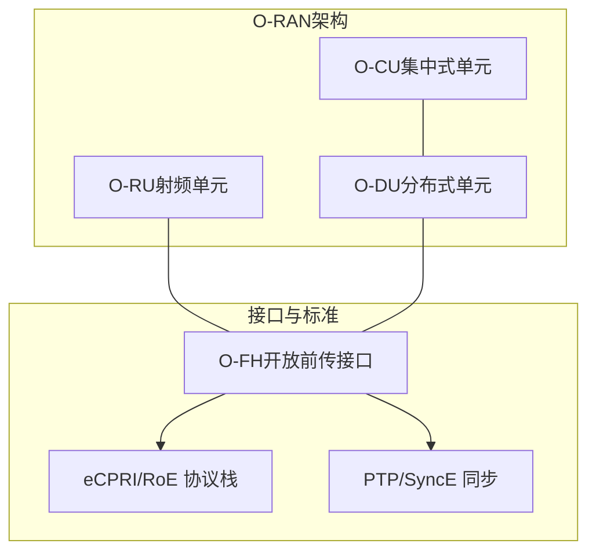
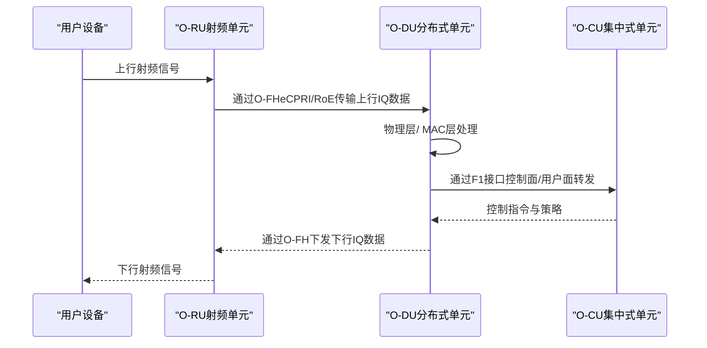
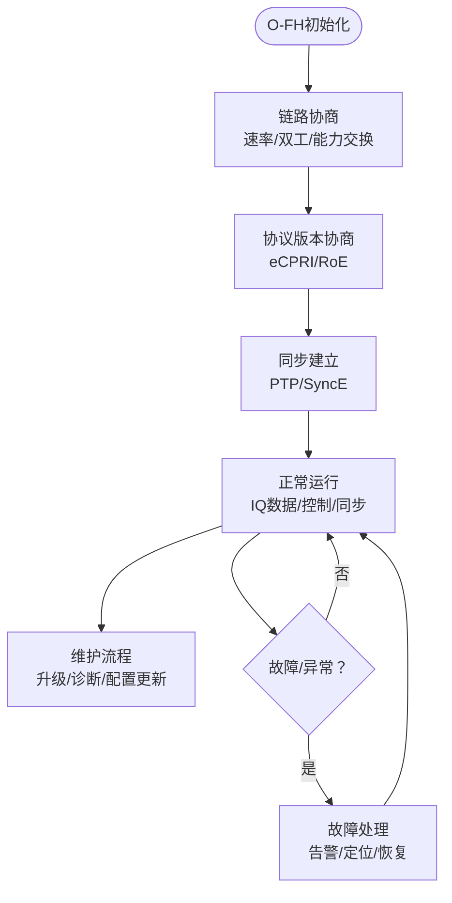
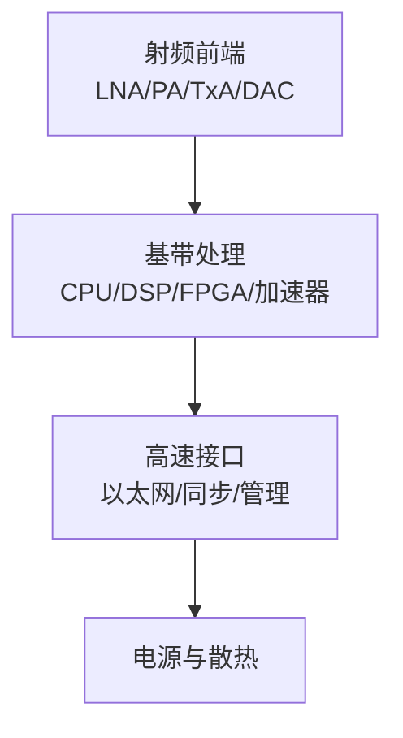

# O-RU（射频单元）

<cite>
**本文引用的文件**
- [开放前传接口（O-FH）](file://03-interface-standards/o-fh-interface.md)
- [分布式单元（O-DU）](file://02-core-components/o-du.md)
- [集中式单元（O-CU）](file://02-core-components/o-cu.md)
- [O-RAN架构（简化版）](file://12-oran-for-dummies/architecture/simple-architecture.md)
- [O-RAN性能测试](file://13-testing-validation/performance-testing/performance-testing-zh.md)
- [O-RAN可持续发展](file://24-sustainable-development/environmental-protection/o-ran-environmental-sustainability.md)
- [O-RAN部署场景](file://04-disaggregation-options/deployment-scenarios.md)
- [O-RAN决策框架](file://18-cost-benefit-analysis/decision-tools/oran-decision-frameworks.md)
- [O-RAN最佳实践（运维）](file://30-best-practices/operations-practices/o-ran-operations-best-practices.md)
- [O-RAN术语表](file://comprehensive-oran-glossary.md)
</cite>

## 目录
1. [简介](#简介)
2. [项目结构](#项目结构)
3. [核心组件](#核心组件)
4. [架构总览](#架构总览)
5. [详细组件分析](#详细组件分析)
6. [依赖关系分析](#依赖关系分析)
7. [性能考量](#性能考量)
8. [故障排查指南](#故障排查指南)
9. [结论](#结论)
10. [附录](#附录)

## 简介
本文件面向O-RU（射频单元）在O-RAN架构中的角色与实现，围绕射频信号处理、天线接口管理、波束赋形与功率控制机制，系统梳理O-RU的硬件架构、软件功能模块、与O-DU的O-FH接口协议（eCPRI/RoE），并结合部署形态（宏基站、小基站、皮站）、功耗管理、热设计与散热方案，提供选型指南、性能参数对比与实际部署案例分析，帮助读者在工程实践中高效落地与优化O-RAN网络。

## 项目结构
本仓库以主题域组织O-RAN知识，与O-RU相关的内容主要分布在如下目录：
- 接口标准：O-FH接口协议与消息、同步机制、部署与运维
- 核心组件：O-DU与O-CU的职责边界、软硬件架构与部署方式
- 架构概览：O-RAN三层（O-RU/O-DU/O-CU）定位与组合方式
- 性能测试：吞吐量、延迟、功耗等关键KPI与测试方法
- 可持续发展：绿色通信、节能与热设计
- 部署场景：多场景部署策略与案例
- 决策框架：供应商对比与TCO评估
- 最佳实践：运维监控、告警与性能优化

**图示来源**
- [开放前传接口（O-FH）](file://03-interface-standards/o-fh-interface.md#L1-L397)
- [分布式单元（O-DU）](file://02-core-components/o-du.md#L68-L86)
- [集中式单元（O-CU）](file://02-core-components/o-cu.md#L101-L121)
- [O-RAN架构（简化版）](file://12-oran-for-dummies/architecture/simple-architecture.md#L118-L187)

**章节来源**
- [开放前传接口（O-FH）](file://03-interface-standards/o-fh-interface.md#L1-L397)
- [分布式单元（O-DU）](file://02-core-components/o-du.md#L1-L415)
- [集中式单元（O-CU）](file://02-core-components/o-cu.md#L1-L419)
- [O-RAN架构（简化版）](file://12-oran-for-dummies/architecture/simple-architecture.md#L118-L187)

## 核心组件
- O-RU（射频单元）
  - 位置与职责：最接近用户侧，负责射频信号的收发与处理，承担天线接口管理、波束赋形、功率控制等关键功能。
  - 与O-DU的接口：通过O-FH（eCPRI/RoE）传输数字基带IQ数据、控制/管理消息与同步信号。
  - 与O-CU的关系：O-RU不直接参与高层协议处理，但需配合O-DU/O-CU完成端到端业务。
- O-DU（分布式单元）
  - 职责：物理层与部分MAC层处理，承担F1接口（与O-CU）与O-FH接口（与O-RU）的桥接。
  - 硬件与软件：多核CPU、DSP/FPGA、高速以太网、实时OS、接口与同步管理模块。
- O-CU（集中式单元）
  - 职责：高层协议处理（RRC、NG接口、F1控制面），CU-CP/CU-UP分离，支持E1接口。
  - 部署：集中/分布式/混合部署，容器化与微服务架构。

**章节来源**
- [O-RAN架构（简化版）](file://12-oran-for-dummies/architecture/simple-architecture.md#L118-L187)
- [分布式单元（O-DU）](file://02-core-components/o-du.md#L3-L86)
- [集中式单元（O-CU）](file://02-core-components/o-cu.md#L3-L61)

## 架构总览
O-RU位于无线接入网最前端，O-DU负责基带处理与接口桥接，O-CU负责高层控制面与用户面处理。O-FH接口实现O-DU与O-RU之间的标准化通信，支持eCPRI/RoE协议与PTP/SyncE同步，满足高带宽、低延迟与高精度同步要求。

**图示来源**
- [开放前传接口（O-FH）](file://03-interface-standards/o-fh-interface.md#L76-L80)
- [分布式单元（O-DU）](file://02-core-components/o-du.md#L68-L86)
- [集中式单元（O-CU）](file://02-core-components/o-cu.md#L101-L121)

## 详细组件分析

### O-FH接口与O-RU交互
- 用户平面：下行/上行数字基带数据传输，IQ数据格式与速率适配，采样率转换与对齐。
- 控制平面：RU配置/状态/故障管理、时间/频率同步、软件升级/诊断/性能监控。
- 同步机制：PTP纳秒级时间同步、SyncE频率同步、同步源冗余与切换。
- 协议栈：eCPRI/RoE应用层与以太网传输/数据链路/物理层映射；PTP应用/传输/网络/数据链路/物理层映射。
- 部署与运维：带宽/延迟/可靠性规划、传输介质（光纤/无线/混合）、QoS配置、监控告警、配置管理、故障处理、性能优化。

**图示来源**
- [开放前传接口（O-FH）](file://03-interface-standards/o-fh-interface.md#L98-L116)

**章节来源**
- [开放前传接口（O-FH）](file://03-interface-standards/o-fh-interface.md#L1-L397)

### O-RU射频信号处理与天线接口
- 射频信号处理：接收/发射链路、滤波、混频、A/D与D/A、IQ校准与对齐。
- 天线接口管理：通道配置、通道增益/相位校准、MIMO端口映射、机械/电子倾角控制接口。
- 波束赋形：数字波束赋形权重计算与加载、动态波束切换、跟踪与自适应。
- 功率控制：发射功率目标/步进/限幅、回退机制、邻区干扰抑制、动态功率共享。

说明：上述能力在O-RU侧实现，O-DU负责更高层的物理层/MAC处理与O-FH桥接，O-CU负责高层控制与策略下发。

**章节来源**
- [分布式单元（O-DU）](file://02-core-components/o-du.md#L7-L50)
- [O-RAN术语表](file://comprehensive-oran-glossary.md#L54-L57)

### O-RU硬件架构与软件功能模块
- 硬件架构（示意）：射频前端（LNA/PA/TxA/DAC）、基带处理（CPU/DSP/FPGA/加速器）、高速接口（以太网/同步接口/管理接口）、电源与散热。
- 软件功能模块（示意）：射频控制与校准、波束管理、功率控制、O-FH用户/控制/同步处理、同步管理、故障与性能监控、远程维护。

（本图为概念示意，不对应具体源码文件）

**章节来源**
- [分布式单元（O-DU）](file://02-core-components/o-du.md#L89-L130)

### 部署形态与场景适配
- 宏基站：高功率、多通道、大范围覆盖，关注容量与覆盖平衡。
- 小基站：低成本、易部署、高密度场景，关注回传带宽与同步。
- 皮站/微站：室内/热点场景，关注近端覆盖与干扰控制。
- 场景化部署：边缘/工业园区/农村地区等差异化需求，结合回传与电源条件选择一体化/分离式部署。

**章节来源**
- [O-RAN部署场景](file://04-disaggregation-options/deployment-scenarios.md#L519-L563)
- [O-RAN架构（简化版）](file://12-oran-for-dummies/architecture/simple-architecture.md#L144-L163)

### 功耗管理、热设计与散热方案
- 能效优化：动态睡眠机制、按需激活、智能休眠、负载协同。
- 绿色硬件：低功耗芯片、高效电源、热管/液冷、自然风冷、相变材料。
- 生命周期：模块化设计、可升级、可回收、减少电子废料。

**章节来源**
- [O-RAN可持续发展](file://24-sustainable-development/environmental-protection/o-ran-environmental-sustainability.md#L8-L75)

### 选型指南与性能参数对比
- 选型维度：接口兼容性（O-FH/eCPRI/RoE）、性能指标（吞吐量/延迟/连接数）、同步精度、功耗/能效、可靠性/可用性、部署形态与扩展性。
- 对比框架：技术能力、财务成本（TCO）、运营因素（交付周期/技能/支持/升级路径）加权评分。
- KPI基准：运营商级目标（可用性/可靠性/效率/弹性），竞品对比（上市时间/成本效益/节能/频谱效率/部署灵活性）。

**章节来源**
- [O-RAN决策框架](file://18-cost-benefit-analysis/decision-tools/oran-decision-frameworks.md#L480-L508)
- [O-RAN性能测试](file://13-testing-validation/performance-testing/performance-testing-zh.md#L29-L327)

### 实际部署案例分析
- 大型体育场馆：25G以太网回传、传输冗余、链路聚合、高精度PTP/SyncE、多RU部署与备用RU、智能告警与自动化处理，达成覆盖、容量、延迟与可靠性的目标。
- 工业园区边缘：低延迟（<1ms）、高可靠（99.999%）、URLLC为主、与工业控制集成、边缘DU部署、确定性网络与QoS保障。
- 农村地区混合：核心/边缘/一体化分层部署、无线回传与有限光纤结合、支持mMTC、降低成本与提升运维效率。

**章节来源**
- [开放前传接口（O-FH）](file://03-interface-standards/o-fh-interface.md#L347-L390)
- [O-RAN部署场景](file://04-disaggregation-options/deployment-scenarios.md#L519-L563)

## 依赖关系分析
- O-RU依赖O-DU提供的O-FH接口能力（eCPRI/RoE、同步、控制/管理）与O-CU的高层策略。
- O-DU依赖O-FH接口完成与O-RU的桥接，并通过F1接口与O-CU交互。
- O-CU依赖O-DU完成用户面与控制面的协同处理。

**图示来源**
- [集中式单元（O-CU）](file://02-core-components/o-cu.md#L101-L121)
- [分布式单元（O-DU）](file://02-core-components/o-du.md#L68-L86)
- [开放前传接口（O-FH）](file://03-interface-standards/o-fh-interface.md#L76-L80)

**章节来源**
- [集中式单元（O-CU）](file://02-core-components/o-cu.md#L101-L121)
- [分布式单元（O-DU）](file://02-core-components/o-du.md#L68-L86)
- [开放前传接口（O-FH）](file://03-interface-standards/o-fh-interface.md#L76-L80)

## 性能考量
- 关键KPI：峰值吞吐量、用户面/控制面延迟、连接建立时间、切换成功率、丢包/抖动、可用性/可靠性、功耗效率。
- 测试类别：网络性能（吞吐/延迟/丢包/抖动/连接密度）、资源性能（CPU/内存/存储/带宽/功耗）、可扩展性（水平/垂直扩展、负载分布、容量规划）。
- 优化方向：接口调优、缓冲区管理、QoS、负载均衡、协议优化、CPU亲和性、内存/存储I/O、内核参数、容器优化、算法效率、缓存策略、数据库优化、API性能、并行处理。

**章节来源**
- [O-RAN性能测试](file://13-testing-validation/performance-testing/performance-testing-zh.md#L1-L327)

## 故障排查指南
- 监控与告警：接口状态/带宽/延迟/误码率、RU运行状态/温度/功率/同步状态、故障分级/关联/抑制/自动化。
- 配置管理：接口参数（带宽/协议/同步/QoS）、RU参数（小区/天线/功率/同步）、变更流程（变更验证/回滚/备份）。
- 故障处理：连接/同步/性能/硬件故障定位（告警/日志/接口/同步测试），恢复（网络/同步/硬件/配置）。
- 运维最佳实践：监控体系、自动化运维、容量管理、故障预防/流程/演练。

**章节来源**
- [开放前传接口（O-FH）](file://03-interface-standards/o-fh-interface.md#L199-L346)
- [O-RAN最佳实践（运维）](file://30-best-practices/operations-practices/o-ran-operations-best-practices.md#L132-L162)

## 结论
O-RU作为O-RAN架构中最贴近用户的射频处理单元，承担着射频信号收发、天线接口管理、波束赋形与功率控制等关键职责。通过标准化的O-FH接口（eCPRI/RoE）与高精度同步（PTP/SyncE），O-RU与O-DU/O-CU形成清晰的职责边界与高效协作。结合多场景部署策略、绿色节能与热设计、完善的性能测试与运维体系，可在宏基站、小/皮站等多样化场景中实现高覆盖、高容量、低时延与高可靠的5G网络目标。

## 附录
- 术语：波束赋形（Beamforming）等关键概念参见术语表。
- 供应链与生态：O-RAN联盟标准与认证、跨厂商互操作性与接口合规性。

**章节来源**
- [O-RAN术语表](file://comprehensive-oran-glossary.md#L54-L57)